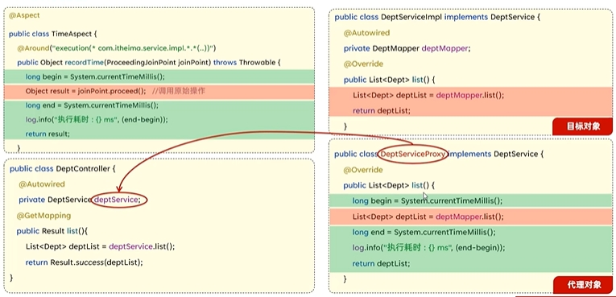

## 概述

AOP全称是 **`Aspect Oriented Programming`** (面向切面编程)，是一种编程范式，用于将跨领域的关注点（如日志记录、安全检查、事务管理等）与业务逻辑分离开来。它允许开发者通过“切面”（Aspect）将这些通用功能模块化，并将其应用到应用程序中的多个地方，从而避免代码重复。

- **核心思想**：AOP 的核心思想是将与业务逻辑无关的横切关注点抽取出来，通过声明的方式动态地应用到业务方法上，而不是将这些代码直接嵌入业务逻辑中。

- **底层实现** ：动态代理是面向切面编程最主流的实现。主要通过底层的动态代理机制，对特定的方法进行编程。

应用场景

- 记录操作日志
- 权限控制
- 事务管理

## 具体实现

- 导入相关依赖

- 创建一个服务类（目标方法）

   ```
   @Service
   public class MyService {
   
       public void performTask() {
           System.out.println("Task performed");
       }
   
       public String sayHello(String name) {
           return "Hello, " + name;
       }
   }
   ```

   

- 定义切面（Aspect）和通知（Advice）

   ```java
   @Aspect
   @Component
   public class LoggingAspect {
   
       // 切入点：匹配 MyService 类中所有方法
       @Pointcut("execution(* com.example.service.MyService.*(..))")
       public void serviceMethods() {}
   
       // 前置通知：在目标方法执行之前执行
       @Before("serviceMethods()")
       public void logBefore(JoinPoint joinPoint) {
           System.out.println("Before executing method: " + joinPoint.getSignature());
       }
   
       // 后置通知：在目标方法执行之后执行
       @After("serviceMethods()")
       public void logAfter(JoinPoint joinPoint) {
           System.out.println("After executing method: " + joinPoint.getSignature());
       }
   
       // 环绕通知：在目标方法执行前后都能执行
       @Around("serviceMethods()")
       public Object logAround(ProceedingJoinPoint joinPoint) throws Throwable {
           System.out.println("Before method execution: " + joinPoint.getSignature());
           Object result = joinPoint.proceed();  // 执行目标方法
           System.out.println("After method execution: " + joinPoint.getSignature());
           return result;
       }
   }
   ```

   

- 

## AOP的底层原理

Spring AOP的实现依赖于**动态代理技术**。动态代理是在运行时动态生成代理对象，而不是在编译时。它允许开发者在运行时指定要代理的接口和行为，从而实现在不修改源码的情况下增强方法的功能。

Spring AOP支持两种动态代理：

- **基于JDK的动态代理**：使用 **`java.lang.reflect.Proxy`** 类和 **`java.lang.reflect.InvocationHandler`** 接口实现。这种方式需要代理的类实现一个或多个接口。Java动态代理会创建一个实现了相同接口的代理类，然后在运行时动态生成该类的实例。
  - 创建接口
  - 创建接口的实现类
  - 创建工厂类实现 **`InvocationHandler`** 接口
  - 在客户端创建代理类，当通过代理对象调用一个方法时，这个方法的调用会被转发为由`InvocationHandler`接口的`invoke()`方法来进行调用。
- **基于CGLIB的动态代理**：当被代理的类没有实现接口时，Spring会使用CGLIB库生成一个被代理类的子类作为代理。CGLIB（Code Generation Library）是一个第三方代码生成库，通过继承方式实现代理。基于类继承，通过字节码技术生成目标类的子类，来实现对目标方法的代理

## AOP核心概念

- **连接点（JoinPoint）** ：可以被AOP控制的方法(暗含方法执行时的相关信息)，目标对象的所属类中，定义的所有方法
- **通知（Advice）** ：指重复的逻辑，也就是共性功能，增强的逻辑或代码，也即拦截到目标对象的连接点之后要做的事情

  ```java
  @Before("execution(* com.example.service.*.*(..))")
  public void logBefore() {
    System.out.println("Method is about to execute");
  }
  ```

- **切入点（PointCut）** ：匹配连接点的条件，通知仅会在切入点方法执行时被应用

  ```java
  @Pointcut("execution(* com.example.service.*.*(..))")
  public void serviceMethods() {}
  ```

- **切面（Aspect）** ：描述通知与切入点的对应关系（通知+切入点），定义了在何处以及何时执行通知，将切面的一些东西模块化了，即定义横切关注点的模块，封装了不同模块共享的功能。
  
  ```java
  @Aspect
  public class LoggingAspect {
    @Before("execution(* com.example.service.*.*(..))")
    public void logBefore() {
        System.out.println("Logging before method execution");
    }
  }
  ```
  
  
  
- **目标对象（Target）** ：通知所应用的对象，也就是原本的业务类。

- **代理（Proxy）** ：向目标对象应用通知之后创建的代理对象，代理对象包含目标对象的原始方法和增强逻辑。

- **织入（Weaving）** ：将通知应用到目标对象，进而生成代理对象的过程动作

示例代码

```java
@Aspect
@Component
public class LoggingAspect {

    // 定义切入点，匹配 service 包中的所有方法
    @Pointcut("execution(* com.example.aopdemo.service.*.*(..))")
    public void serviceMethods() {}

    // 前置通知：在方法执行前记录日志
    @Before("serviceMethods()")
    public void logBefore(JoinPoint joinPoint) {
        System.out.println("Before method: " + joinPoint.getSignature().getName());
    }

    // 后置通知：在方法执行后记录日志
    @After("serviceMethods()")
    public void logAfter(JoinPoint joinPoint) {
        System.out.println("After method: " + joinPoint.getSignature().getName());
    }

    // 返回通知：在方法成功返回结果后记录日志
    @AfterReturning(pointcut = "serviceMethods()", returning = "result")
    public void logAfterReturning(JoinPoint joinPoint, Object result) {
        System.out.println("Method returned with value: " + result);
    }

    // 异常通知：在方法抛出异常后记录异常信息
    @AfterThrowing(pointcut = "serviceMethods()", throwing = "error")
    public void logAfterThrowing(JoinPoint joinPoint, Throwable error) {
        System.out.println("Method threw exception: " + error.getMessage());
    }

    // 环绕通知：在方法执行前后记录日志，且可以控制方法是否执行
    @Around("serviceMethods()")
    public Object logAround(ProceedingJoinPoint joinPoint) throws Throwable {
        System.out.println("Before executing method: " + joinPoint.getSignature().getName());
        Object result = joinPoint.proceed();  // 执行目标方法
        System.out.println("After executing method: " + joinPoint.getSignature().getName());
        return result;
    }
}
```


## AOP执行流程

1. 底层为目标对象生成代理对象
2. 在代理对象中使用通知对目标对象的连接点做功能增强
3. 在依赖注入时注入代理对象



## AOP通知

### 通知类型

- **`@Around`** ：环绕通知，此注解标注的通知方法在目标方法前、后都被执行
- **`@Before`** ：前置通知，此注解标注的通知方法在目标方法前披执行
- **`@After`** ：后置通知，此注解标注的通知方法在目标方法后被执行，无论是否有异常都会执行
- **`@AfterReturning`** ：返回后通知，此注解标注的通知方法在目标方法后被执行，有异常不会执行，它可以访问目标方法的返回值，但无法修改返回值。可以用于记录日志或清理资源等操作。
- **`@AfterThrowing`** ：异常后通知，此注解标注的通知方法发生异常后执行，它可以访问目标方法抛出的异常，并且可以根据异常类型进行相应的处理，例如记录异常信息或执行异常处理逻辑。

在注解的属性中指定方法



- **`@Around`** 环绕通知需要自己调用 **`ProceedingJoinPoint.proceed()`** 来让原始方法执行，其他通知不需要考虑目标方法
- 执行 **`@Around`** 环绕通知方法的返回值，必须指定为Object，来接收原始方法的返回值。




### 通知顺序

当有多个切面的切入点都匹配到了目标方法，目标方法运行时，多个通知方法都会被执行

#### 不同切面类的通知顺序

- 目标方法前的通知方法：字母排名靠前的先执行
  目标方法后的通知方法：字母排名靠前的后执行
- 用注解 **`@Order(数字)`** 加在切面类上来控制顺序
  - 目标方法前的通知方法:数字小的先执行
  - 目标方法后的通知方法:数字小的后执行

#### 同一个切面类的通知顺序

- 正常情况 
  - 环绕之前通知 
  - 前置通知Before 
  - 被增强的方法 
  - AfterReturning后置通知 
  - After最终通知 
  - 环绕之后通知 
- 异常情况 
  - 环绕之前通知 
  - 前置通知Before 
  - 被增强的方法 
  - AfterThrowing异常通知 
  - After最终通知

## 切入点表达式

切入点表达式：描述切入点方法的一种表达式
作用：主要用来决定项目中的哪些方法需要加入通知

### execution(….)根据方法的签名来匹配

execution 主要根据方法的返回值、包名、类名、方法名、方法参数等信息来匹配

语法：execution(访问修饰符? 返回值 包名.类名.?方法名(方法参数)throws 异常?) 

带?的部分可以省略

- 访问修饰符:可省略(比如:public、protected)
- 包名.类名: 可省略
- throws 异常:可省略(注意是方法上声明抛出的异常，不是实际抛出的异常)

通配符

- **`*`** ：单个独立的任意符号，可以通配任意返回值、包名、类名、方法名、任意类型的一个参数，也可以通配包、类、方法名的一部分

  ```java
  execution(* com.*.service.*.update*(*))
  ```

- **`:`** ：多个连续的任意符号，可以通配任意层级的包，或任意类型、任意个数的参数

  ```java
  execution(* com.itheima..Deptservice.*(..))
  ```

  

### @annotation(.):根据注解匹配

**`@annotation`** 切入点表达式，用于匹配标识有特定注解的方法

语法：**`@annotation(全类名)`**

```java
@Before("@annotation(com.itheima.anno.Log)")
public void before(){
	log.info("before ....");
}
```



**`@PointCut`**
该注解的作用是将公共的切点表达式抽取出来，需要用到时引用该切点表达式即可

```java
@Pointcut("execution()")
public void pt(){}
@Around("pt()")
public Object recordrime(ProceedingjoinPoint joinPoint) throws Throwable {
    
}
```

注意事项

- private：仅能在当前切面类中引用该表达式
- public：其他外部的切面类中也可以引用该表达式




## 连接点

在Spring中用**JoinPoint**抽象了连接点，用它可以获得方法执行时的相关信息，如目标类名、方法名、方法参数等。

对于 **`@Around`** 通知，获取连接点信息只能使用 **`ProceedingJoinPoint`**

对于其他四种通知，获取连接点信息只能使用 **`JoinPoint`** ，它是 **`ProceedingJoinPoint`** 的父类型

相关方法

```java
@Around("execution()")
public object around(ProceedingJoinPoint joinPoint)throws Throwable {
	String className=joinPoint.getTarget().getc1ass().getName(); //获取目标类名
	Signature signature=joinPoint.getsignature();//获取目标方法签名
	String methodName= joinPoint.getsignature().getName();//获取目标方法名
	0bject[]args = joinPoint.getArgs();//获取目标方法运行参数
	0bject res= joinPoine.proceed();/执行原始方法,获取返回值(环绕通知)
	return res;
}
```

```java
@Before("execution(""))
public void befored(JoinPoint joinPoint)
{
	String className=joinPoint.getTarget().getclass().getName();//获取目标类名
	Signature signature=joinPoint.getsignature();//获取目标方法签名
	String methodName =joinPoint.getsignature().getName();//获取目标方法名
	0bject[]args= joinPoint.getArgs();//获取目标方法运行参数
}

```

## SpringAOP 框架 和 AspectJ 框架

**Spring AOP**：是 Spring 框架提供的一种 AOP 实现，主要用于**运行时**的代理机制。

- **特点**：Spring AOP 是基于**动态代理**实现的，适用于 Spring 容器管理的 Bean，较轻量级，使用方便。
- **使用场景**：适合大部分业务场景，尤其是需要简单 AOP 功能的 Spring 应用。

**AspectJ**：AspectJ 是功能更强大的 AOP 框架，支持**编译时**、**类加载时**和**运行时**的 AOP 功能。

- **特点**：AspectJ 支持更加灵活的切点和增强操作，提供编译期和加载期的织入方式，性能较高。
- **使用场景**：适合对性能要求较高或需要复杂切点匹配的场景，如日志、监控等。



Spring AOP 属于`运行时增强`，主要具有如下特点：

- 基于动态代理来实现，默认如果使用接口的，用 JDK 提供的动态代理实现，如果是方法则使用 CGLIB 实现
- Spring AOP 需要依赖 IoC 容器来管理，并且只能作用于 Spring 容器，使用纯 Java 代码实现
- 在性能上，由于 Spring AOP 是基于**动态代理**来实现的，在容器启动时需要生成代理实例，在方法调用上也会增加栈的深度，使得 Spring AOP 的性能不如 AspectJ 的那么好。
- Spring AOP 致力于解决企业级开发中最普遍的 AOP(方法织入)。

AspectJ 是一个易用的功能强大的 AOP 框架，属于`编译时增强`， 可以单独使用，也可以整合到其它框架中，是 AOP 编程的完全解决方案。

- 编译期织入（Compile-time weaving）：如类 A 使用 AspectJ 添加了一个属性，类 B 引用了它，这个场景就需要编译期的时候就进行织入，否则没法编译类 B。
- 编译后织入（Post-compile weaving）：也就是已经生成了 .class 文件，或已经打成 jar 包了，这种情况我们需要增强处理的话，就要用到编译后织入。
- 类加载后织入（Load-time weaving）：指的是在加载类的时候进行织入


