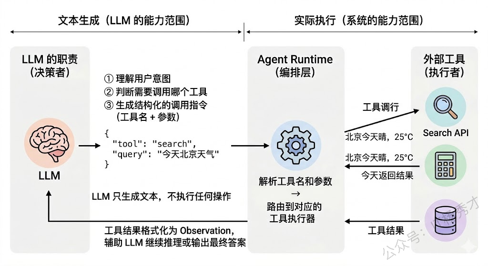
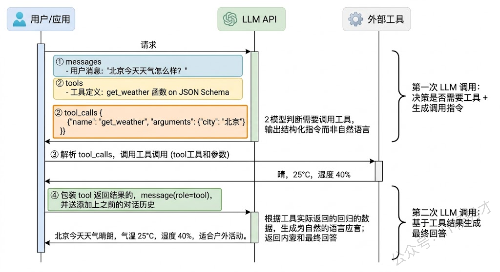
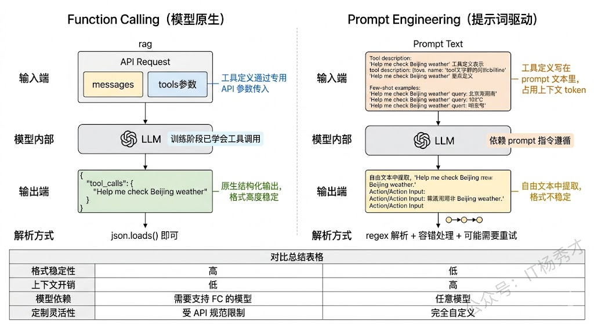
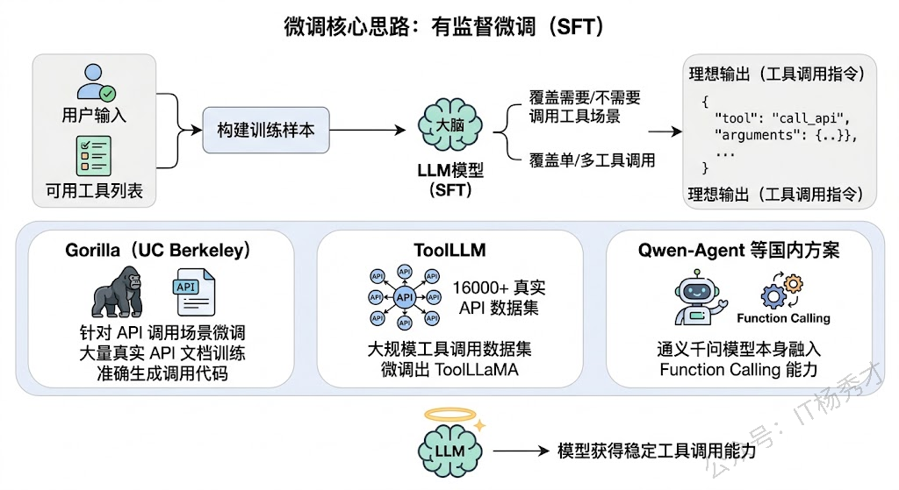
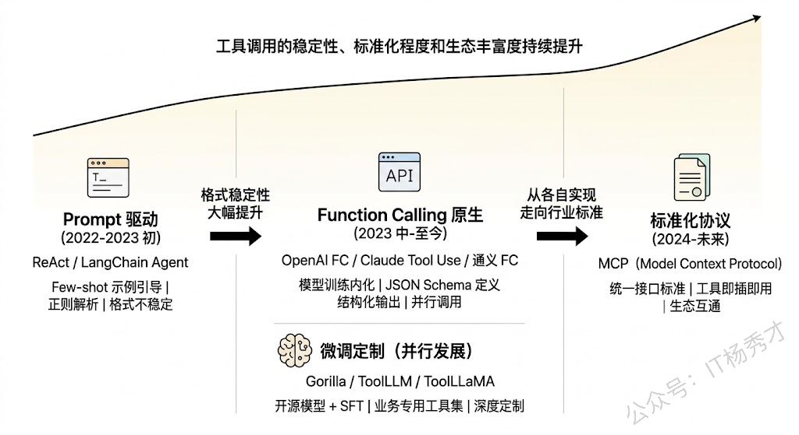

## 🔧 LLM 为什么需要工具调用？

在讨论"怎么调工具"之前，先要搞清楚"为什么要调工具"。LLM 本质上是一个基于海量文本训练出来的语言模型，它的能力边界由训练数据决定。这意味着它天生有几个硬伤：

- **知识有截止日期**：训练数据之后发生的事情它不知道
- **不擅长精确计算**：比如让它算 1234×5678 它大概率算不对
- **无法与外部系统交互**：它不能发邮件、查数据库、调 API

工具调用（Tool Use）就是为了弥补这些硬伤而设计的。通过让 LLM "学会"在需要的时候调用外部工具——搜索引擎、计算器、数据库、第三方 API 等——它的能力就从"只能说"扩展到了"能说也能做"。这也是 Agent 和普通 Chatbot 的本质区别之一。

但这里有一个关键的认知要先建立：**LLM 并不是真的在"执行"工具调用**。LLM 做的事情只有一件——生成文本。所谓的"调用工具"，实际上是 LLM 生成了一段**结构化的文本**（比如一个 JSON），表达"我想调用某个工具，参数是什么"，然后由外部的**运行时系统**（Agent Runtime / Orchestrator）来解析这段文本、真正执行工具调用、获取结果、再把结果喂回给 LLM。LLM 在这个过程中扮演的是"决策者"而非"执行者"的角色。

理解了这一点，后面讲的所有方案就都好理解了——它们本质上都是在解决同一个问题：**如何让 LLM 准确地生成符合格式要求的工具调用指令？**

<div align="center">
  
</div>

---

## 📡 Function Calling(数据格式层)

Function Calling 是过去一段时间最主流、效果最好的工具调用方案，由 OpenAI 在 2023 年 6 月率先推出，随后各大模型厂商（Anthropic、Google、国内的通义千问、智谱等）都跟进支持了。

Function Calling 的核心思路是：**在模型训练阶段就让模型学会"什么时候该调工具、怎么生成调用参数"**，而不是仅仅靠 prompt 在推理阶段去引导。具体来说，模型厂商在训练数据中加入了大量的工具调用样本——这些样本告诉模型"当用户问到这类问题时，你应该输出一个特定格式的工具调用请求"。经过这种训练后，模型原生就具备了工具调用的能力。

不论外部工具多么复杂，LLM 在推理时只认特定的数据结构。当前业界处理工具描述的数据格式标准高度统一于 OpenAI Function Calling Schema，Anthropic（Claude）、Google（Gemini）等主要模型提供商均已对齐这套规范或提供高度兼容的实现。

在使用时，开发者需要在 API 请求中通过 `tools` 参数传入可用工具的定义，每个工具定义包括工具名称、功能描述、以及参数的 JSON Schema。通过 JSON Schema 严格定义工具的描述和参数规范。LLM 在推理时只消费这部分 JSON Schema 来理解工具的功能边界，从而决定"是否调用"以及"如何填充参数"。

比如：

```json
{
  "tools": [{
    "type": "function",
    "function": {
      "name": "get_weather",
      "description": "获取指定城市的当前天气信息",
      "parameters": {
        "type": "object",
        "properties": {
          "city": {
            "type": "string",
            "description": "城市名称，如'北京'"
          }
        },
        "required": ["city"]
      }
    }
  }]
}
```

当模型判断需要调用工具时，它不会输出普通的文本回复，而是输出一个结构化的 `tool_calls` 对象，里面包含要调用的函数名和参数值。比如 `{"name": "get_weather", "arguments": {"city": "北京"}}`。开发者的代码接收到这个对象后，执行实际的 API 调用，拿到结果，再把结果以 `tool` 类型的消息追加到对话历史中，发送给模型进行下一轮推理。

<div align="center">
  
</div>

Function Calling 的优势非常明显：因为是模型训练阶段内化的能力，所以**格式稳定性极高**，几乎不会出现 JSON 解析错误的情况；同时模型对"什么时候该调工具、什么时候不该调"的判断也更准确，能很好地处理"不需要工具直接回答"和"需要工具辅助"之间的切换。而且现在主流模型都支持**并行工具调用**——一次推理同时调用多个工具，大幅提升效率。

---

## ⚙️ Prompt Engineering

在 Function Calling 出现之前，或者对于不支持 Function Calling 的模型，开发者主要依靠**精心设计的 Prompt** 来引导 LLM 生成工具调用指令。这也是 ReAct 框架最初采用的方案。

具体做法是：在 System Prompt 中详细描述每个可用工具的名称、功能和使用格式，并通过 few-shot 示例教模型按照固定格式输出工具调用指令。比如：

```
你可以使用以下工具：
1. search(query: str) - 在互联网上搜索信息
2. calculator(expression: str) - 计算数学表达式
3. database_query(sql: str) - 执行 SQL 查询

当你需要使用工具时，请严格按照以下格式输出：
Action: 工具名
Action Input: 参数值

示例：
用户：2023年中国GDP是多少？
Thought: 我需要搜索最新的中国GDP数据
Action: search
Action Input: 2023年中国GDP总量
```

系统在接收到 LLM 的输出后，通过**正则表达式或字符串解析**来提取 Action 和 Action Input，然后执行对应的工具调用。

<div align="center">
  
</div>

这种方案的优势是**灵活性极高**——不依赖模型厂商的特定 API，任何模型都能用，而且工具的定义和格式完全由开发者控制。但劣势也很明显：**格式稳定性差**。模型毕竟是在做自由文本生成，它不一定每次都严格遵守你定义的格式——有时候会在 Action 前面多写几句话，有时候参数格式不对，有时候干脆忘了用工具直接瞎编答案。这在工程上需要大量的容错处理和重试逻辑。

从实际项目经验来看，Prompt 方案适合两种场景：一是模型不支持 Function Calling 时的降级方案；二是需要高度定制化的工具调用格式时（比如 ReAct 的 Thought-Action-Observation 格式本身就承载了推理链信息，这是标准 Function Calling 不容易做到的）。

---

## 🎯 微调训练

如果你使用的是开源模型（如 LLaMA、Qwen、ChatGLM 等），而且需要非常稳定的工具调用能力，还有一条路是**对模型进行微调**，让它从训练层面学会工具调用。

微调的核心思路是：构建大量的工具调用训练样本，每个样本包含"用户输入 + 可用工具列表 → 模型应该输出的工具调用指令"，然后用这些数据对模型做有监督微调（SFT）。训练数据的质量和多样性决定了微调效果的上限——数据需要覆盖"需要调工具"和"不需要调工具"两种场景，也需要覆盖单工具调用和多工具调用的情况。

这个方向上有几个有代表性的工作：

- **Gorilla**：UC Berkeley 的研究，专门针对 API 调用场景做了微调，在大量真实 API 文档上训练，使模型能够根据 API 文档准确生成调用代码
- **ToolLLM**：构建了一个包含 16000+ 真实 API 的大规模工具调用数据集，并在此基础上微调出了 ToolLLaMA
- **Qwen-Agent**：国内的方案，通义千问模型本身就在训练中融入了 Function Calling 能力

<div align="center">
  
</div>

微调方案的优势是**可以深度定制**——你可以让模型学会调用你业务特有的工具集，甚至学会处理复杂的多工具编排逻辑。劣势是**成本高**，需要构建高质量的训练数据、消耗 GPU 资源训练、还需要持续维护和更新。

---

## 📝 工具描述的设计

不管使用哪种方案，有一个环节对工具调用成功率的影响非常大，但经常被低估——那就是**工具描述（Tool Description）的质量**。

LLM 是根据工具的描述文本来理解"这个工具能做什么、什么时候该用它"的。如果描述写得模糊或歧义，模型就可能在不该调工具的时候调了，或者该调的时候没调，或者调了错误的工具。

一个好的工具描述应该包含：

- **功能的精确描述**：这个工具做什么，不做什么
- **参数的清晰说明**：每个参数是什么含义、什么类型、有什么约束
- **使用场景的边界**：什么情况下该用这个工具，什么情况下不该用

在实际项目中，我们经常需要反复迭代工具描述的措辞，这跟调 prompt 是一样的道理——本质上它就是 prompt 的一部分。

另外一个工程上的重要考量是**工具数量的控制**。当可用工具数量很多时（比如超过 20 个），全部塞进上下文会消耗大量 token，而且模型在太多工具中做选择时准确率会下降。常见的解决方案是做**工具检索**——先用 embedding 相似度或者分类模型从全量工具库中筛选出与当前任务最相关的几个工具，只把这些工具的描述传给模型。这本质上就是对工具列表做了一次 RAG。

---

## 工具调用链路在工程上的设计
工具调度策略，核心是**“前置规则过滤+大模型语义路由+后置执行校验”的三级调度架构**，既保证工具选择的准确率，又降低大模型的幻觉，同时提升调度效率，适配高频请求场景。
### 工具调度策略
#### 前置规则过滤层
这一层的核心，是先把无效的、不可用的工具过滤掉，缩小大模型的选择范围，从源头减少工具选择错误的幻觉。核心规则包括：
- 场景过滤：基于用户query的意图识别结果，只保留对应场景的工具，比如用户的query是电商订单查询，直接过滤掉非电商相关的工具
- 权限过滤：基于用户的身份、权限，过滤掉用户无权限调用的工具；状态过滤：过滤掉当前不可用、服务降级、接口超时的工具，只保留可用状态的工具
- 优先级过滤：给工具设置优先级，官方工具、高可用工具、低延迟工具优先级更高，优先进入候选池。

#### 核心语义路由层
基于大模型的Function Call能力，实现工具的精准选择和动态调度

- 结构化的工具描述：给每个工具定义标准化的描述，包括核心功能、入参要求、出参格式、使用场景、限制条件，让大模型能精准理解每个工具的能力边界；
- Few-Shot示例引导：在prompt中加入高质量的工具调用示例，覆盖单工具调用、多工具串行/并行调用、异常场景处理，引导大模型输出符合要求的工具调用指令，大幅提升工具选择的准确率
- 串行/并行自适应调度：基于子任务的依赖关系，自动选择调度方式：无依赖的工具，并行调用，降低整体延迟；有强依赖的工具，串行调用，保证执行逻辑正确
- 工具调用链路的动态调整：支持多轮工具调用，前一个工具的返回结果，可以作为后一个工具的入参，同时支持根据工具返回的结果，动态新增工具调用步骤。

#### 后置执行校验层
这一层的核心，是在工具调用执行前和执行后，做两层校验，避免无效的工具调用，提升链路效率
- 调用前校验：校验大模型生成的工具调用指令，是否存在工具不存在、入参缺失、入参格式错误的问题，如果有问题，直接触发修正，不执行无效调用
- 调用后校验：校验工具返回的结果，是否有效、格式是否正确、是否符合子任务的要求，如果结果无效，触发二次调用或者fallback策略。

### 异常fallback策略
针对工具调用全链路的每一个异常场景，都需要设计了对应的fallback策略，保证整个Agent链路不会因为单步工具调用异常而崩盘
- 工具选择错误的fallback:大模型选择的工具和用户query不匹配、选择了不存在的工具，先触发反思修正：把错误原因、可用工具列表重新喂给大模型，让它重新选择工具，重试次数上限设置为2次；超过重试次数，直接终止工具调用，告知用户当前无法通过工具完成需求，转兜底回答，避免无限循环。
- 工具调用执行异常的fallback:针对接口超时、服务不可用、返回报错的场景：先做指数退避重试，重试次数上限3次；重试失败，自动切换同功能的备用工具；没有备用工具的话，告知用户当前该功能暂时不可用，同时记录异常日志，触发告警，不会让模型编造工具返回结果，从源头避免幻觉。
- 入参缺失/错误的fallback:针对入参缺失、入参格式错误的场景：不会直接执行调用，也不会直接报错，而是触发追问模块，让大模型基于缺失的入参，生成自然语言，向用户询问补充关键信息，用户补充后，自动填充入参，重新执行工具调用。
- 工具返回结果无效的fallback:针对工具返回空结果、无相关信息、结果不符合要求的场景：先触发二次调用，让大模型调整入参、查询条件，重新调用工具；二次调用还是无效的话，告知用户没有查询到相关信息，同时给出合理的建议，绝对不允许模型基于空结果编造内容。
- 多步链路异常的fallback:针对多工具串行调用的场景，某一步工具调用异常，不会直接终止整个链路：先判断该步骤是否是核心步骤，非核心步骤直接跳过，继续执行后续链路；核心步骤触发对应的fallback策略，fallback失败后，才终止链路，返回已执行的有效结果，同时告知用户异常环节，不会让整个链路完全崩盘。

## 🔗 MCP 协议

最后值得一提的是目前工具调用领域重要的标准化趋势——**MCP（Model Context Protocol，模型上下文协议）**。MCP 由 Anthropic 在 2024 年底提出，它试图解决的问题是：目前每个模型厂商的 Function Calling 接口格式不一样，每个工具的接入方式也各不相同，导致开发者在切换模型或接入新工具时需要大量的适配工作。

MCP 定义了一套标准化的协议，让 LLM 和外部工具之间的交互有了统一的"语言"。你可以把它理解为工具调用领域的"USB 接口"——有了这个标准，任何符合 MCP 协议的工具都可以即插即用地接入任何支持 MCP 的模型或 Agent 框架，大幅降低了集成成本。

<div align="center">
  
</div>

在 MCP 的架构中，有三个核心角色：

- **MCP Host**：使用工具的应用，比如你的 Agent
- **MCP Client**：协议客户端，负责和 Server 通信
- **MCP Server**：工具提供方，把自己的 API 包装成 MCP 标准接口暴露出来

开发者只需要按 MCP 标准实现一次工具的 Server 端，就可以被任何 MCP 兼容的 Agent 直接调用。

具体细节参见往期博客：
- [模型上下文协议（MCP）](https://tyritic.github.io/p/%E6%A8%A1%E5%9E%8B%E4%B8%8A%E4%B8%8B%E6%96%87%E5%8D%8F%E8%AE%AEmcp/)
---

## ✅ 总结

LLM 调用外部工具的核心原理，首先要理解一个关键前提：**LLM 本身并不执行任何工具操作，它做的事情只是生成一段结构化的文本指令**，表达"我要调什么工具、传什么参数"，然后由外部的 Agent 运行时系统去解析指令、执行调用、把结果回传给 LLM 继续推理。理解了这个前提之后，赋予 LLM 工具调用能力主要有三条技术路线。

**第一条是 Function Calling**，这是目前效果最好也最主流的方案，OpenAI、Anthropic、通义千问等主流模型都原生支持。它的原理是在模型训练阶段就加入大量工具调用的样本数据，让模型学会根据 tools 参数中的 JSON Schema 工具定义来判断何时需要调用工具，并直接输出结构化的 tool_calls 对象，格式稳定性非常高，还支持并行调用多个工具。

**第二条是 Prompt Engineering**，在模型不支持 Function Calling 时作为降级方案，通过在 System Prompt 中描述工具列表和调用格式，配合 few-shot 示例引导模型按固定格式输出，然后用正则表达式解析。ReAct 框架最初就是这种方案，灵活性高但格式稳定性差，需要大量容错处理。

**第三条是微调训练**，针对开源模型在业务专用的工具调用数据上做 SFT，像 Gorilla 和 ToolLLM 就是这个方向的代表工作。

除了方案选择之外，实际工程中**工具描述的质量对调用成功率影响极大**，好的描述要精确定义功能边界和参数约束，这和调 prompt 是一样的道理。工具数量多时还需要做工具检索——先用相似度筛选出相关工具再传给模型。最后值得关注的趋势是 **MCP 协议**，它定义了 LLM 和工具之间标准化的通信接口，目标是让工具实现"即插即用"的生态互通，是这个领域从碎片化走向标准化的重要一步。