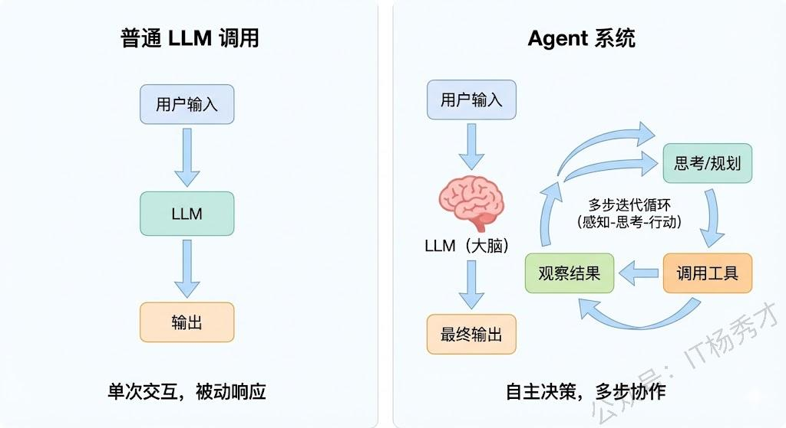
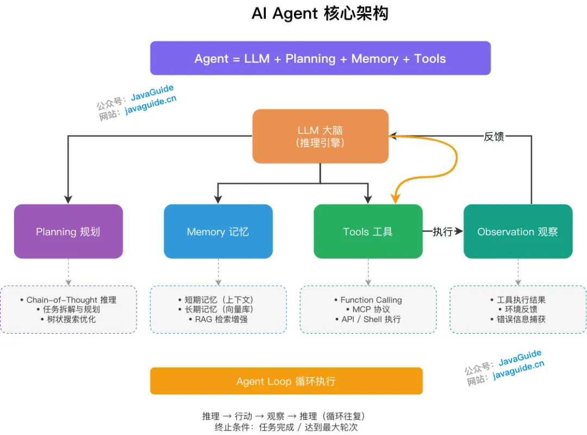
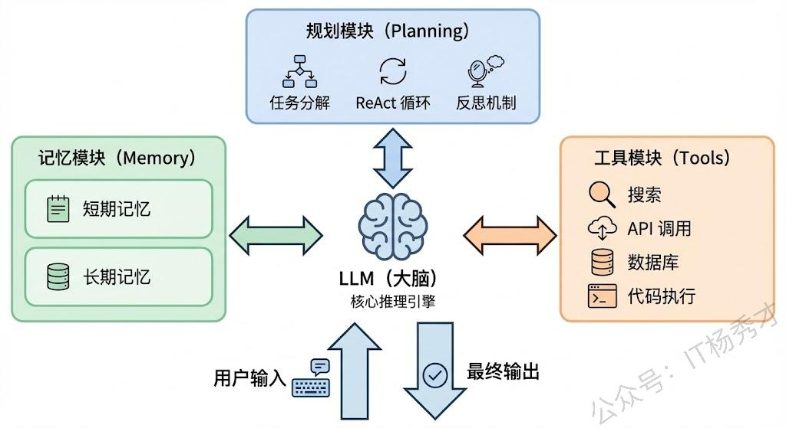
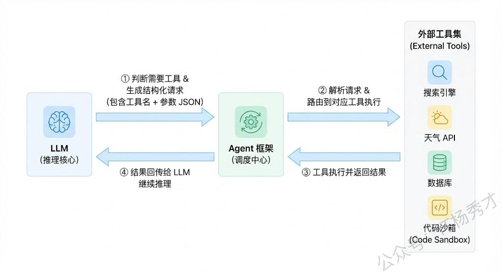
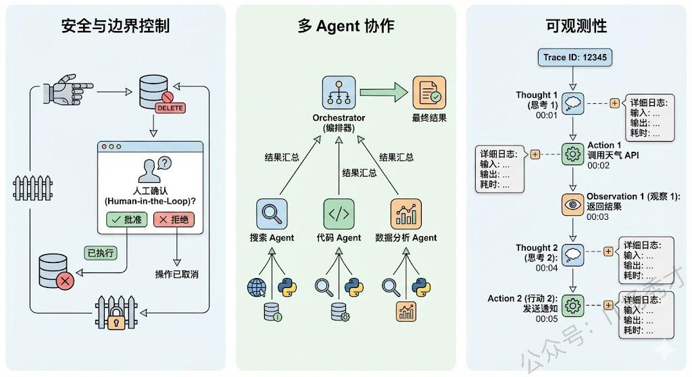

## 🧠 Agent的定义

**Agent（智能体）** 的本质是以 LLM 为核心推理引擎，能够感知环境，结合规划能力、工具使用能力和记忆能力，能够自主完成复杂任务的智能系统。它以大语言模型（LLM）为大脑，代表用户自动化完成复杂任务，例如自动化处理电子邮件、生成报告、执行多步查询或控制智能设备。

### 🆚 Agent vs 普通LLM调用

普通 LLM 调用是"一问一答"的被动模式——你给一个 prompt，它返回一个 completion，交互就结束了。LLM 本身不会主动做任何事情，也不会根据结果来决定下一步该干什么。

Agent 的核心特征是**自主性（Autonomy）和迭代性（Iteration）**——它能够自主地感知环境、制定计划、使用工具、执行行动，并且根据执行结果来动态调整后续策略，能够在动态环境中持续迭代，直到任务完成。

  

**举例说明：**假设用户说"帮我查一下明天北京的天气，如果下雨就把我后天的户外会议改成线上"。

- **普通 LLM**：最多只能告诉你"你可以去查天气然后改会议"
- **Agent**：会自动执行完整流程——调用天气 API → 判断是否下雨 → 调用日历 API 找到会议 → 调用会议修改接口 → 汇报结果

> 学术上比较经典的定义来自 Lilian Weng 的博客，她把 Agent 定义为 **LLM + Planning + Memory + Tools** 的组合体，这个框架至今仍是业界最广泛认可的 Agent 架构抽象。

  

- 推理与规划（Reasoning / Planning）：依赖 LLM 分析当前任务状态，拆解目标，生成思考路径，并决定下一步行动。例如，使用 Chain-of-Thought (CoT) 提示技术，让模型逐步推理复杂问题，避免直接给出错误答案。在规划中，可能涉及树状搜索（如 Monte Carlo Tree Search）或多代理协作，以优化多步决策。
- 记忆（Memory）：包含短期记忆（上下文历史，用于保持对话连续性）和长期记忆（外部知识库检索，如向量数据库或知识图谱），用于辅助决策。这能防止模型遗忘历史信息，并从过去经验中学习。例如，在处理重复任务时，Agent 可以检索存储的类似案例，提高效率。
- 执行与工具（Acting / Tools）：执行具体操作，如查询信息、调用外部工具（Function Call、MCP、Shell 命令、代码执行等）。工具扩展了 LLM 的能力，例如集成搜索引擎、数据库 API 或第三方服务，让 Agent 能处理超出预训练知识的实时数据。在工程实践中，多个原子工具还可以被进一步封装为技能（Skills）——即可复用的组合工具模块。
- 观察（Observation）：接收工具执行的反馈，将其纳入上下文用于下一轮推理，直至任务完成。这形成了一个闭环反馈机制，确保 Agent 能适应不确定性并纠错。
---

## 🔄 Agent Loop
Agent Loop 是所有 Agent 范式共享的运行引擎，其本质是一个 while 循环：每一次迭代完成"LLM 推理 → 工具调用 → 上下文更新"的完整链路，直至任务终止。

  

标准工作流如下：

- 初始化：加载 System Prompt、可用工具列表及用户初始请求，组装第一轮上下文。
- 循环迭代（核心）：读取当前完整上下文 → LLM 推理决定下一步行动（调用工具 or 直接回复）→ 触发并执行对应工具 → 捕获工具返回结果（Observation）→ 将 Observation 追加至上下文。
- 终止条件：当 LLM 在某轮判断任务完成，直接输出最终回复而不再调用工具时，退出循环。
- 安全兜底：为防止模型陷入死循环，须设置强制中断条件，如最大迭代轮次上限（通常 10 ～ 20 轮）或 Token 消耗阈值。

## 🏗️ Agent的核心组件

一个完整的 Agent 系统通常由**四个核心模块**构成：LLM（大脑）、规划模块、记忆模块、工具使用。这四个模块各司其职又紧密协作，共同支撑了 Agent 的自主决策和任务执行能力。

  

### 💻 LLM——Agent的大脑

LLM 是整个系统的中枢，负责：

- 理解用户意图
- 进行逻辑推理
- 生成行动计划
- 解读工具返回结果

Agent 的智能水平上限取决于底层 LLM 的能力。在工程实践中，我们通常通过精心设计的 **System Prompt** 来给 LLM 设定角色、约束行为边界、规定输出格式，这相当于给"大脑"装上了一套操作手册。

### 📋 规划模块——任务分解与推理

规划能力是 Agent 区别于简单 LLM 应用的关键标志。当 Agent 接收到一个复杂任务时，它会把任务分解成多个可执行的子步骤，然后按照逻辑顺序逐步执行。

**主流规划策略分为两类：**

  

**1. 无反馈的规划**

代表框架 **ReAct（Reasoning + Acting）**：

- Thought：先进行推理思考
- Action：决定执行一个动作
- Observation：观察动作的结果
- 进入下一轮循环

优点是实现简单、思路清晰，是目前最广泛使用的 Agent 推理框架。

**2. 带反馈的规划**

代表框架 **Reflexion**：

- Agent 在执行失败后会对失败原因进行自我反思
- 修正策略重新执行

这种方式更接近人类解决问题的真实过程——会根据反馈不断调整方案。

### 🗄️ 记忆模块——上下文与经验

Agent 的记忆通常分为两种：

  

**1. 短期记忆（Short-term Memory）**

- 本质是当前对话的上下文（Context）
- 包括用户的历史消息、Agent 的推理过程、工具调用结果等
- 受限于 LLM 的上下文窗口长度

**常见解决方案：**

- 对话摘要（Summarization）
- 滑动窗口
- 基于关键信息提取的压缩策略

**2. 长期记忆（Long-term Memory）**

- 持久化存储的外部知识，通常通过**向量数据库**实现
- Agent 可以把重要的历史交互、经验、用户偏好等信息存入
- 在需要时通过 **RAG** 的方式检索召回
- 使 Agent 表现出"越用越聪明"的特性

### 🔧 工具使用——与外部世界交互

LLM 本身只能生成文本，不能查数据库、不能调 API、不能操作文件系统。通过工具使用机制，Agent 可以将 LLM 的推理能力与外部世界的执行能力连接起来。

  

**Function Calling 机制：**

1. 预先定义好工具描述（名称、功能说明、参数 schema）
2. 放在 System Prompt 或通过 Function Calling 接口传给 LLM
3. LLM 判断需要使用某个工具时，生成结构化的函数调用请求
4. Agent 框架解析请求并执行函数
5. 把执行结果返回给 LLM 继续推理

**常见工具类型：**

- 搜索引擎（联网检索信息）
- 数据库查询
- API 调用（天气、日历、邮件等）
- 代码执行器
- 文件读写操作

---

## ⚙️ 工程关键设计

  

### 🔒 安全与边界控制

Agent 拥有工具调用能力意味着它能对外部系统产生真实影响（如发邮件、改数据库），所以必须设计：

- **权限控制**：限制 Agent 能访问和操作的资源范围
- **人工确认机制（Human-in-the-Loop）**：在执行危险操作前需要人类确认
- 防止 Agent 在推理出错时执行不可逆的危险操作

### 👥 多Agent协作

当任务非常复杂时，单个 Agent 可能难以胜任。可以设计**多个专业化的 Agent** 各负责一个子领域，通过编排层（Orchestrator）来协调分工合作。

- **AutoGen**、**CrewAI** 等框架就是这个思路
- 本质上是把"一个全能 Agent"拆成"多个专家 Agent 的团队"

### 📊 可观测性与调试

Agent 的多步推理过程是非确定性的，每次运行可能走不同路径，给调试带来很大挑战。工程上需要：

- **完善的日志记录**：记录每一步的输入输出
- **Trace 追踪**：追踪整个推理链路
- **中间状态可视化**：快速定位是哪一步推理出错

---

## 📚 总结

| 核心组件 | 主要作用 | 技术实现 |
|---------|---------|---------|
| 🧠 LLM | 大脑中枢 | 推理引擎、System Prompt |
| 📋 规划 | 任务分解 | ReAct、Reflexion |
| 🗄️ 记忆 | 上下文连贯 | 短期上下文、长期向量数据库 |
| 🔧 工具 | 外部交互 | Function Calling |

**关键要点：**

- Agent 的本质是**自主性**——能感知、规划、行动、调整
- 四大核心组件缺一不可，协同支撑智能决策
- 工程落地需关注**安全**、**多Agent协作**、**可观测性**

Agent，本质上是以 LLM 为核心推理引擎，具备自主规划、工具调用和记忆能力，能够自主完成复杂任务的智能系统。

它跟普通的 LLM 调用最大的区别在于**自主性**——普通 LLM 调用是一问一答的被动模式，而 Agent 能够自主地把一个复杂任务拆解成多个步骤，在每一步进行推理决策，选择合适的工具去执行，观察结果后再动态调整下一步策略，形成一个"思考-行动-观察"的闭环循环，直到任务完成。

核心组件通常有四个：

- **LLM 本身**：充当 Agent 的大脑，负责意图理解、逻辑推理和决策生成
- **规划模块**：让 Agent 能够进行任务分解和多步推理，主流的实现方式是 ReAct 框架
- **记忆模块**：分为短期记忆和长期记忆，短期记忆保证一次任务内的连贯性，长期记忆通过向量数据库存储历史经验
- **工具使用能力**：通过 Function Calling 机制让 Agent 能够调用外部 API、查数据库、执行代码等

在实际落地中，还需要特别关注**安全边界控制**、**Human-in-the-Loop 机制**以及**整个推理链路的可观测性**。

---

