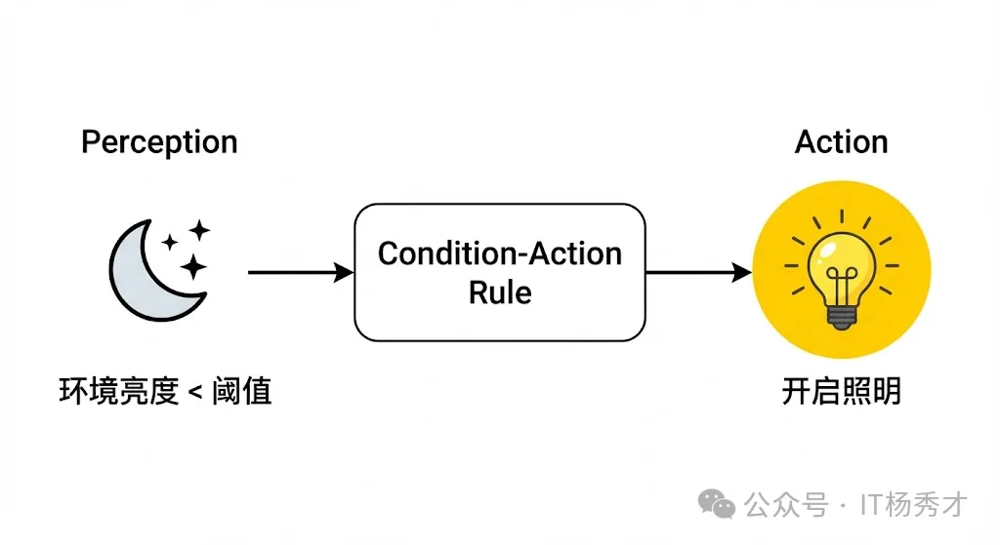
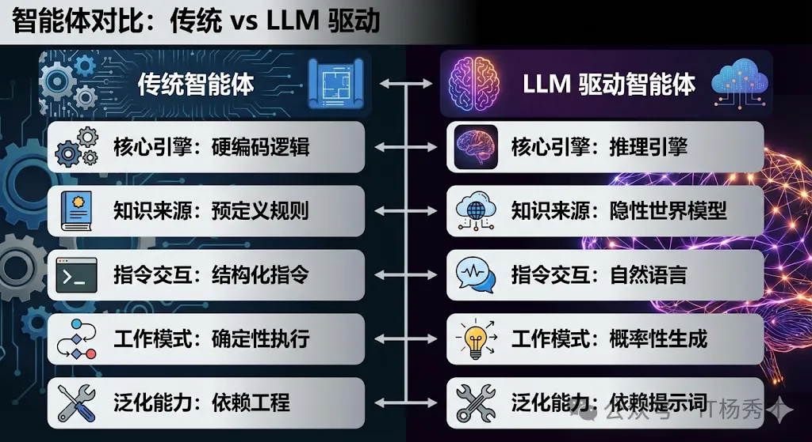
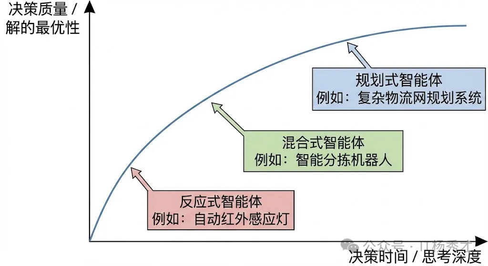
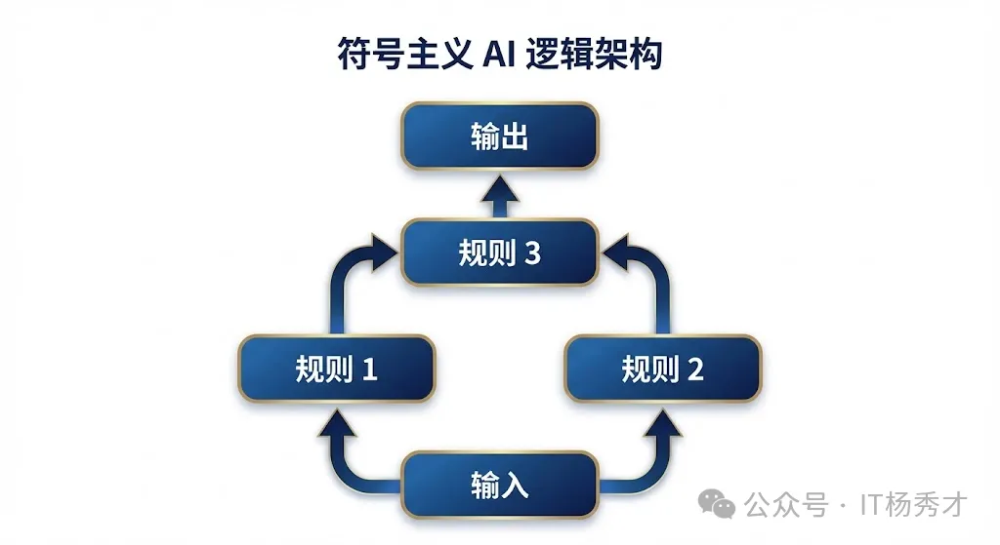
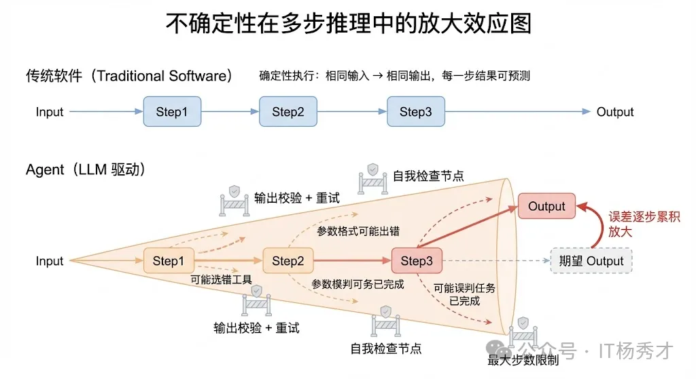
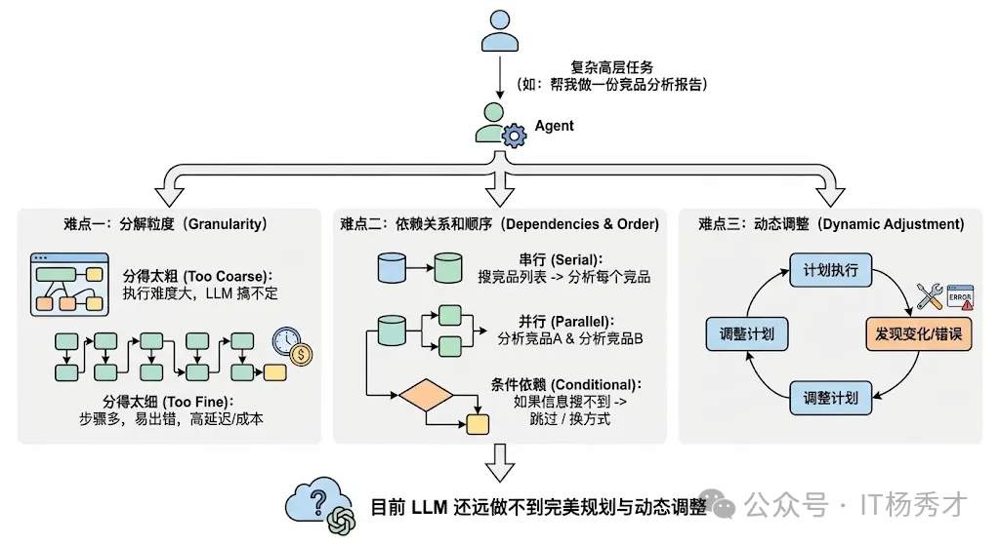
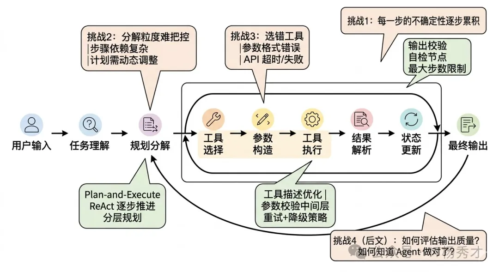
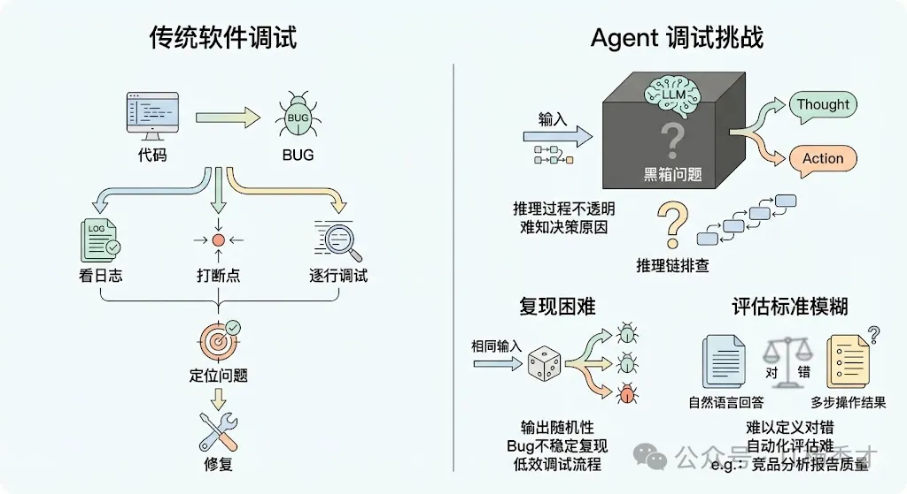
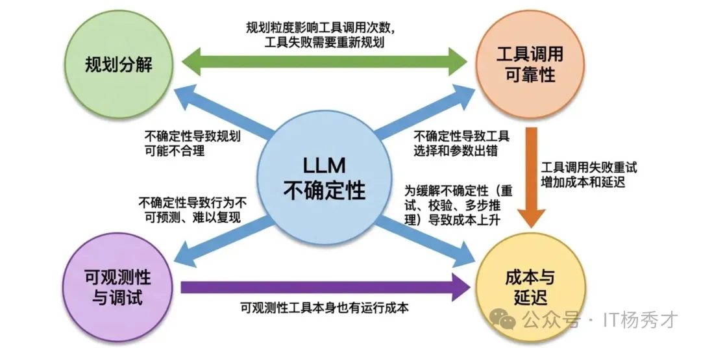

## 🧠 Agent是什么？

Agent，也就是我们常说的**智能体**。先下一个简单的定义：

> Agent是一个能够通过感知器（Sensors）获取外部环境（Environment）信息，并基于其内在逻辑，通过执行器（Actuators）采取具体行动（Action），从而实现既定目标的独立实体。

这个核心定义揭示了智能体的**四个核心要素**：

- **环境（Environment）**：智能体活动的舞台。对于一个自动化仓储机器人，环境是布满货架和移动设备的车间；对于一个量化交易机器人，环境则是实时波动的全球资产价格数据。

- **感知器（Sensors）**：智能体通过感知器与外界建立联系。这些感知器可以是摄像头、传感器，也可以是监听各类应用程序编程接口（API）的数据回调。

- **执行器（Actuators）**：智能体改变环境的能力来源。执行器既可以是物理层面的机械装置（如工业抓取手、自平衡底座），也可以是数字世界的软件接口（如发送一封邮件、更新数据库记录）。

- **自主性（Autonomy）**：衡量一个程序是否能被称为智能体的关键。智能体不是一段只会机械执行 `if-else` 的脚本，它拥有独立决策的能力，能够根据当下的环境感知和内部预设的状态，自主判断该采取何种行动来逼近目标。

这种**感知到行动的闭环逻辑**，构成了所有智能体行为的底层架构。

---

## 🆚 Agent 和 LLM 的区别

二者的本质区别其实就一句话：大模型是 Agent 的"决策大脑"，而 Agent 是"以大脑为核心、能自主闭环做事的完整执行体"。

- 大模型就像理论功底扎实的书呆子，你问他任何问题，他都能给你一套完整的理论方案；但你让他独立排查线上 OOM 故障，他只会给你方法论，不会登服务器、拉 GC 日志、分析堆 dump、改代码提 MR—— 他只有脑子，没有动手能力，更没有自主闭环做事的能力。
- Agent，就是给这个高材生配了完整的工具链、执行权限、复盘能力，还有严格操作规范的资深后端专家。你只需要给他一个最终目标，他就能以大模型的推理能力为核心，自主拆解任务、调用工具、执行操作、迭代优化，直到把事办完，全程不用你插手。

下表从四个维度详细对比二者的差异：

| 对比维度 | 大模型（LLM） | Agent（智能体） |
|---------|--------------|----------------|
| **本质定位** | 大规模预训练语言模型，核心是「文本理解 + 逻辑推理 + 知识储备」，是纯决策大脑 | 以 LLM 为核心的完整智能系统，具备「感知 - 规划 - 行动 - 反思」的闭环能力，是端到端执行体 |
| **核心能力边界** | 被动响应，能力局限于文本生成，只能基于 Prompt 输出文字内容，无法直接与外部系统交互、执行实际操作 | 主动执行，能把 LLM 的推理结果转化为实际动作，可对接数据库、微服务、运维平台、代码仓库等外部系统，完成全流程业务闭环 |
| **交互模式** | 对话式、用户主导，单轮/多轮响应，每一步都需要用户给出明确指令，全程由用户推着走 | 目标导向、自主执行，用户只需给出最终目标，Agent 自主拆解任务、调度工具、处理异常、迭代结果，全程无需人工干预 |
| **生命周期** | 单次请求 - 响应闭环，无长期记忆与任务连贯性 | 长生命周期任务管理，有持久化记忆、任务上下文同步、跨轮次反思优化能力 |

---

## 🧬 Agent的演化

在大语言模型（LLM）开启智能化新纪元之前，人工智能领域已经对智能体进行了长达半个世纪的探索。这些我们如今称之为传统智能体的架构，经历了一段从被动响应到主动适应的清晰进化史。

---

### 💡 简单反射智能体

最初的Agent称之为**简单反射智能体（Simple Reflex Agent）**。它们的逻辑非常直接，完全建立在预定义的条件与动作规则之上。

  

我们可以想象一个工业光控系统：当环境亮度低于特定阈值时，自动触发照明设备。这种智能体只关注当下，没有记忆，也无法预测未来。它像是一种数字化的膝跳反应，虽然在特定环境下极度可靠且高效，但面对需要上下文理解的复杂场景时，就显得捉襟见肘。

### 🏛️ 基于模型的反射智能体

为了破解这一难题，研究者开发了**基于模型的反射智能体（Model-Based Reflex Agent）**。这类智能体拥有一种内部模型（World Model），能够追踪那些无法被即时感知的环境信息。

它通过维护一个内部状态来回答：**世界现在处于什么状态？**

例如，一艘在深海潜行的无人潜航器，即便声呐信号因地形暂时中断，其内部模型仍会根据之前的航速、航向和水流惯性，推算自身的位置。这种机制赋予了智能体初步的记忆，使其决策建立在更完整、更具连贯性的环境理解之上。

### 🎯 基于目标的智能体

然而，仅仅理解世界是不够的，智能体必须由目标驱动。这推动了**基于目标的智能体（Goal-Based Agent）**的诞生。

与被动反应不同，它表现出极强的预见性，会主动选择那些能够导向最终目标的路径。此时，它需要思考的问题变成了：**为了达成这个目标，我下一步该做什么？**

以智能仓储的路径规划为例，机器人的目标是取走 5 号货柜的商品，它会基于仓库地图（世界模型），利用路径搜索算法（如 A* 算法）规划出一条效率最高的避障路线。这类智能体的精髓在于**对未来的模拟与规划能力**。

### 📊 基于效用的智能体

在现实场景中，目标往往是多元且相互冲突的。我们不仅希望机器人取货快，还希望它耗电最省、且避开人流密集的区域。当需要权衡多重目标时，**基于效用的智能体（Utility-Based Agent）**就派上了用场。

它会给每一种可能的结果赋予一个效用值（类似于满意度），智能体的核心驱动力从达成单一状态转变为追求期望效用的最大化。它在思考：**哪种行动组合能让我得到最满意的综合结果？**

这种架构使得机器人的决策更加趋于理性，能够在成本与收益之间寻找平衡。

### 🧪 学习型智能体

尽管这些传统智能体越来越复杂，但它们的决策逻辑依然被禁锢在人类设计师预设的框架内。如果智能体能够像人类一样，通过尝试与错误进行自主学习呢？

这正是**学习型智能体（Learning Agent）**的核心诉求，而**强化学习（Reinforcement Learning, RL）**则是其最著名的实践路径。这类智能体由性能元件和学习元件构成，学习元件会通过观察性能元件在环境中的行为反馈（奖励或惩罚），不断迭代和优化决策模型。

想象一个在虚拟环境中学习复杂操作的 AI 机械臂。起初它可能只是无规则地晃动，但每当它成功触碰到目标物体，系统就会给予正向激励。经过数以万计次的迭代，学习元件逐渐掌握了最优的抓取姿势。正如 AlphaGo Zero 在围棋领域的突破一样，这种通过自我对弈、自我进化的机制，展现了超越人类既有经验的巨大潜力。

> 从最基础的光控开关，到拥有内部状态的潜航器，再到具备规划能力的物流机器人和懂得权衡利弊的理财大脑，直至最终能够实现自我学习，这段演进历程是我们理解现代Agent的重要基础。

---

## 🚀 大语言模型催生的范式巨变

  

以 GPT 系列为代表的大语言模型的爆发，正在重塑智能体的构建逻辑与能力天花板。LLM 智能体不再仅仅是代码的堆砌，它们拥有了一种本质上不同的决策引擎。

这种范式的转变，赋予了智能体直接处理模糊指令的能力。让我们以一个智能办公助手为例。

在 LLM 时代之前，如果你想让 AI 帮你组织一场跨部门会议，你需要在不同的系统（日历、邮件、预订系统）之间来回切换，自己负责信息的对齐。而一个 LLM 驱动的智能助手则能将这些孤立的环节缝合成一个完整的智能流。

当你下达"帮我安排下周五下午的跨部门周会"这一模糊指令时，它的工作流充分展示了新范式的优势：

- **自主推理与任务规划**：智能体会将宏观目标拆解为具体的行动链条：`[获取参会名单] -> [核对各方日历空档] -> [筛选合适的会议室] -> [发送正式邀请]`。这是一个由模型内生驱动的思考过程。

- **工具与环境的交互**：在执行过程中，它能意识到自己缺乏实时数据，从而主动调用外部工具。比如，它会调用公司的会议室预订系统接口，一旦发现原定会议室不可用，会立即寻找备选方案。

- **动态调整与自我修复**：如果某个关键参会人临时反馈"周五下午不便"，智能体会将此视为新的约束条件，自动重启部分规划流程，重新协调时间并同步给所有人。

> 这种从单一功能自动化到系统性解决问题的转变，标志着我们正从编写死代码转向引导一个通用的"数字大脑"。

---

## 📊 多维度视角下的智能体分类

为了更深刻地理解 Agent 的多样性，我们可以从三个互补的维度对其进行分类。

### 🏗️ 基于决策架构的纵向分类

第一种分类方式侧重于智能体内在思维架构的复杂度。正如我们在前文演进史中所见，从最基础的反应式结构到具备内部模型、目标导向乃至效用最大化的架构，构成了一个由浅入深的技术阶梯。而学习能力则像是一个插件，可以加载在任何架构之上，让智能体具备进化属性。

### ⏱️ 基于反应时效的横向分类

除了架构复杂度，智能体在处理信息时的反应模式也是一个核心维度。这主要涉及**决策速度（反应性）与决策深度（规划性）之间的权衡**。

#### ⚡ 反应式智能体

这类智能体强调实时性，通常在接收到外部刺激后几乎零延迟地做出响应。它们不涉及长远的思考，而是遵循快速的感知-行动映射。

其优势在于极高的响应速度和极低的算力成本，在动态瞬变的环境（如赛车防抱死系统或高速避障传感器）中不可或缺。但缺点是缺乏全局视角，容易陷入局部最优。

#### 🎯 规划式智能体

与追求速度不同，规划式智能体（也称审议式）在行动前会进行充分的推演。它们利用世界模型，在虚拟空间内探索不同决策序列的后果，从中挑选最优路径。

其决策逻辑更像是一位顶尖的战术家，能够处理长跨度、多步骤的复杂任务。虽然这带来了更强的战略性，但代价是昂贵的计算开销和响应延迟。在瞬息万变的环境中，过度的思考有时意味着错失良机。

#### 🔀 混合式智能体

在现实应用中，我们往往需要两者兼得。混合式智能体通过分层设计，试图在反应速度与规划深度之间找到黄金平衡点。

- 底层通常由硬实时的反应模块组成，处理安全防御和基础动作
- 高层则由规划模块主导，负责战略目标的制定

现代 LLM 智能体实际上展现了一种极其灵活的混合模式，它们在"思考-行动-观察"的微循环中，将审慎的逻辑推理与敏捷的环境反馈有机结合，既能保持大方向正确，又能灵活应对突发状况。

  

### 📚 基于知识存储形式的分类

这是一个触及人工智能哲学根基的分类维度，它探讨的是智能体如何存储和处理知识。

#### 🗂️ 符号主义 AI

符号主义认为智能源于对人类可读符号的逻辑运算。知识被编码为清晰的规则、事实和逻辑关系。它像是一位博学且严谨的法官，通过法律条文（规则）和案情事实（符号）推导出判决结果。

其最大优势在于过程的完全透明和可解释性，但在面对模糊、非结构化和充满异常的现实世界时，往往会遭遇知识获取的瓶颈，表现得过于死板。

  

#### 🖥️ 亚符号主义 AI

这一阵营认为智能并非由显性逻辑构成，而是内隐地分布在神经网络的连接权重中，通过对海量数据的统计建模而产生。

它更像是一个具有直觉的艺术家，在看过无数作品后，能够瞬间识别出某种风格，却无法用精确的逻辑语言解释其判断依据。它在处理图像、语音等复杂模式识别任务时具有压倒性优势，但其黑箱特性使得决策过程难以被人类直观理解。

  

#### ⚖️ 神经符号主义 AI

为了融合上述两者的长处，神经符号主义应运而生。它试图构建一种既具备神经网络的感知与泛化能力，又具备符号系统的逻辑推理能力的智能体。

诺贝尔奖得主丹尼尔·卡尼曼提出的**双系统理论**为我们提供了一个完美的类比：

- **系统 1** 是快直觉（亚符号）
- **系统 2** 是慢逻辑（符号）

人工智能就是这两个系统协同的结果。当前的 LLM 智能体正是这一理念的绝佳落地：它的底层是一个巨大的神经网络（亚符号引擎），使其拥有惊人的常识和语言直觉；而当它被引导进行 Chain of Thought（思维链）推理或调用结构化 API 时，它实际上是在产生和操作显性的符号逻辑。

> 这种直觉与理性的初步融合，正是智能体未来发展的核心方向。

  

---

## ⚠️ 构建复杂Agent的挑战

在实际工程化落地中，构建一个复杂 Agent 面临着诸多挑战。这些挑战都围绕一个核心根源展开——**LLM 推理的不确定性**。

### 🎲 LLM推理的不确定性

这是构建复杂 Agent 时最根本、最深层的挑战，所有其他挑战几乎都由它衍生而来。

传统软件是确定性的——给定相同的输入，永远得到相同的输出。你写一个 `if-else` 分支，它每次都会走你预期的那条路。但 Agent 的核心驱动引擎是 LLM，而 LLM 本质上是一个概率模型，它的输出带有随机性。

这意味着：**同样的用户输入，同样的工具列表，Agent 这次可能选对了工具，下次可能选错了；这次的参数格式正确，下次可能多了个逗号导致 JSON 解析失败；这次推理了 3 步就完成了任务，下次可能推理了 10 步还在兜圈子。**

  

这种不确定性在简单的单轮对话场景中可能还能容忍，但在复杂 Agent 中就会被急剧放大。因为 Agent 的执行过程是**多步串联**的——每一步的输出是下一步的输入，如果某一步出了偏差，后面所有步骤都可能在错误的基础上越走越偏。这就像多米诺骨牌效应，一个小错误在多步传播后可能变成完全跑偏的结果。

**应对策略：**

- 通过精心设计 Prompt 和 few-shot 示例来约束模型输出的格式和范围
- 对关键步骤设置**输出校验**，格式不对就重试
- 在推理链中加入**自我检查**节点，让模型回顾之前的步骤是否合理
- 设置**最大步数限制**和**超时机制**，防止无限循环

> 这些都只能缓解而不能根治，这就是为什么 Agent 的可靠性始终是整个行业的核心难题。

### 🧩 复杂任务的规划与分解

当用户给 Agent 一个复杂的高层任务时（比如"帮我做一份竞品分析报告"），Agent 需要自己把这个大任务分解成可执行的子步骤，然后按照合理的顺序执行。这个"规划"的能力看起来理所当然，但实际上极其困难。

**难点一：分解粒度很难把控**

分得太粗，每一步的执行难度还是太大，LLM 搞不定；分得太细，步骤太多，一方面增加了出错概率，另一方面也增加了延迟和成本。

**难点二：步骤之间的依赖关系和顺序很复杂**

有些步骤必须串行（先搜索竞品列表，才能分析每个竞品），有些可以并行（同时分析多个竞品），有些还有条件依赖（如果搜不到某个竞品的信息，就跳过或换一种方式获取）。让 LLM 在规划阶段就考虑清楚这些依赖关系，目前的模型还远做不到完美。

**难点三：动态调整**

现实中计划赶不上变化——Agent 在执行过程中可能发现某个工具不可用了、某个 API 返回了异常结果、或者中间步骤获得了新信息导致原来的计划不再合理。好的 Agent 需要具备"边执行边调整计划"的能力，而不是僵化地按原计划走到底。

  

**实践策略：**

- **Plan-and-Execute 分离**：先让一个 Planner LLM 做全局规划，再让 Executor LLM 逐步执行，执行中可以触发重新规划
- **ReAct 式的逐步推进**：不做全局规划，每一步都根据当前状态决定下一步
- **分层规划**：先做粗粒度规划，每个粗步骤再做细粒度规划

### 🔧 工具调用的可靠性与错误处理

Agent 的能力边界由它能调用的工具决定，但工具调用在实际工程中远比想象中脆弱。

**问题一：工具选择错误**

当 Agent 面前有十几个工具时，它可能选错——比如该用精确查询数据库的工具，它却去调了搜索引擎；或者该用计算器算个精确值，它却自己让 LLM 心算。工具描述（Tool Description）的质量直接影响选择准确率，但即使描述写得再好，在工具数量多或场景边界模糊时，误选还是经常发生。

**问题二：参数构造错误**

LLM 生成的工具调用参数不一定符合工具的实际要求——日期格式不对、枚举值拼错、必填参数缺失、数值超出范围等等。这些在传统开发中靠类型系统和编译器就能避免的错误，在 LLM 生成的世界里需要额外的**参数校验层**来兜底。

**问题三：工具执行失败**

外部 API 可能超时、返回错误码、返回空结果，或者返回了和预期完全不同的数据格式。Agent 需要能够理解这些失败，并做出合理的应对——是重试、换一个工具、还是向用户报告无法完成。

  

**工程解决方案：**

建立一个**工具调用中间层**：

- 对 LLM 输出的调用指令做参数校验和类型转换
- 对工具执行结果做异常捕获和格式规范化
- 设置单次调用的超时和重试策略
- 对失败情况生成友好的错误描述反馈给 LLM，让它基于错误信息调整策略

### 🔍 可观测性与调试

在传统软件中，程序出了 bug，你可以看日志、打断点、逐行调试，定位问题通常不难。但 Agent 的调试是一个完全不同量级的难题。

**黑箱问题**

LLM 的推理过程是不透明的——你能看到它输出了什么 Thought 和 Action，但你很难知道"它为什么做出这个决策"。同样的输入，换一个措辞可能就走了完全不同的路径。这种不可解释性让定位问题变得非常困难：当 Agent 给出了一个错误的结果时，你需要在可能有十几步的推理链中，逐步排查到底是哪一步出了问题、为什么出了问题。

**复现困难**

由于 LLM 输出的随机性，你在调试时遇到的 bug 可能无法稳定复现——同样的输入跑 10 次，可能只有 2 次会触发这个问题。这让传统的"复现 → 定位 → 修复 → 验证"的调试流程变得非常低效。

**评估标准模糊**

传统软件的正确性可以用单元测试精确验证，但 Agent 的输出往往是自然语言的回答或多步操作的结果，怎么定义"对"和"错"本身就是一个难题。比如 Agent 帮你写了一份竞品分析报告，怎么自动化地评估这份报告的质量？内容是否准确？分析是否有深度？结论是否合理？这些都很难用确定性的测试用例来覆盖。

  

**工程应对方案：**

- 使用 **LangSmith、LangFuse** 等可观测性平台来记录 Agent 每一步的详细链路（Trace）——包括每次 LLM 的输入输出、工具调用的参数和结果、耗时和 token 消耗等
- 建立**基于 LLM 的评估体系**（LLM-as-Judge），用另一个 LLM 来评估 Agent 输出的质量
- 构建**回归测试集**，积累典型的 case 定期跑评估，确保改动不会导致整体效果下降

### 💰 成本与延迟的平衡

前面的挑战偏技术，这个挑战偏工程和商业。在生产环境中，Agent 的每一次 LLM 调用都有真金白银的 token 成本和实实在在的延迟。

一个复杂 Agent 完成一次任务可能需要 5-15 次 LLM 调用，每次调用还可能带上大量的上下文历史和工具定义，token 消耗动辄上万。如果再加上 RAG 检索、重试机制等，一次任务的总成本可能远超预期。在 B2C 场景中（比如面向大量终端用户的 AI 助手），这个成本乘以请求量就是一笔不可忽视的开支。

延迟同样是痛点。用户问一个问题，Agent 可能需要十几秒才能给出最终结果（多步推理 + 多次工具调用），这在很多对响应速度有要求的场景中是不可接受的。

  

**应对策略：**

- **按任务复杂度分级路由**：简单任务直接用小模型一步回答，复杂任务才走完整 Agent 流程
- **缓存**：对相同或相似的子任务结果做缓存，避免重复调用
- **并行化**：把可以并行的工具调用同时执行（Function Calling 的 parallel tool calls）
- **流式输出（Streaming）**：在 Agent 推理过程中就逐步将中间结果流式返回给用户，降低用户的感知等待时间

---

## 📝 小结

智能体正从机械执行的规则脚本，进化为具备"直觉与理性"双重特征的数字生命。这种范式的重塑，让Agent不再局限于预设的逻辑闭环，而是能以自主性为核心，在感知与行动的往复中更智能地实现既定目标。

从最初的简单反射到如今重塑范式的通用引擎，Agent的演变不仅是技术的更迭，更是人类从"编写死代码"转向"引导智慧体"的根本变革——它正以前所未有的姿态，开启一个人机协同、自主进化的新纪元。

---

> **参考资料**：
> - [人人都在说的Agent究竟是啥？](https://mp.weixin.qq.com/s/t38gIdGVmJ-dMYtFQhGFHQ) - IT杨秀才
> - [构建复杂Agent的挑战](https://mp.weixin.qq.com/s/w5X9b1wijBe5if3m0SeqtQ) - IT杨秀才
