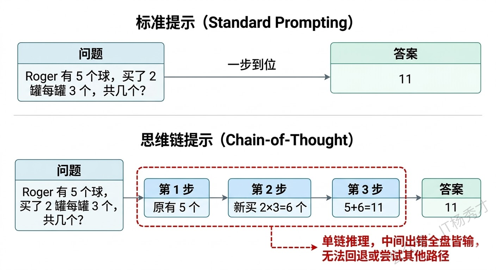
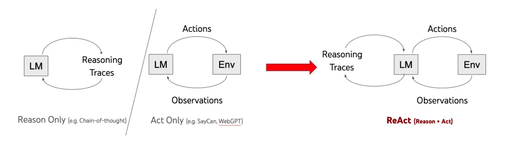
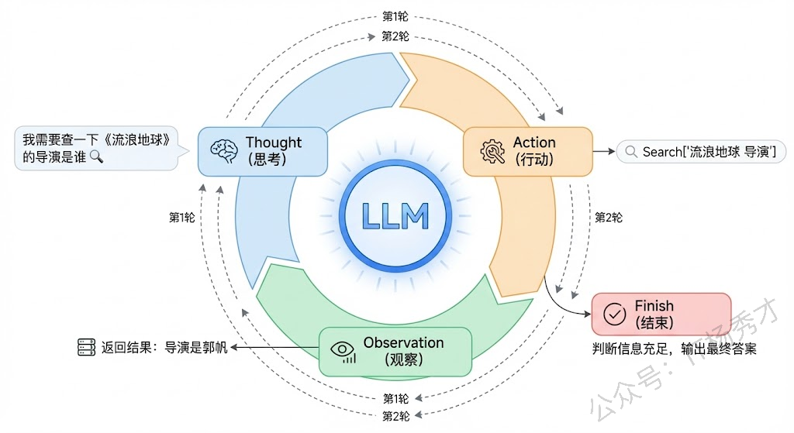
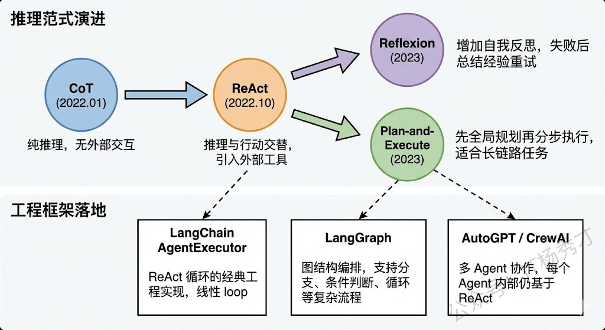
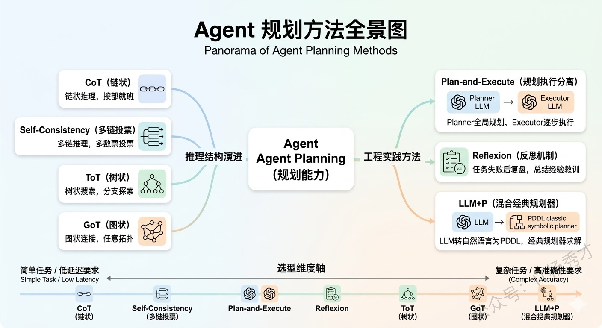
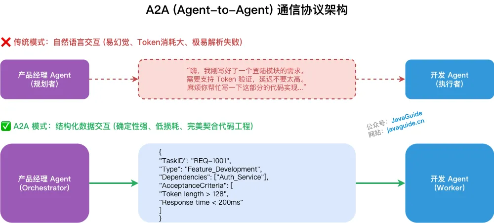

## 🧠 为什么规划能力是Agent的核心

在聊具体方法之前，我们先要理解"规划"在Agent体系中扮演的角色。一个完整的Agent通常包含四大能力模块：**感知（Perception）、规划（Planning）、记忆（Memory）和行动（Action）**。其中规划是真正的"大脑"，它决定了Agent面对一个复杂任务时，应该把任务拆解成哪些子步骤、以什么顺序执行、遇到问题时怎么调整策略。

如果没有规划能力，Agent就只能做简单的"一问一答"——用户说什么它就做什么，完全不具备处理多步骤复杂任务的能力。你可以把规划能力理解为**Agent和普通Chatbot之间的分水岭**：Chatbot是被动应答，Agent是主动规划并执行。

而赋予LLM规划能力的核心方法，本质上都是在回答同一个问题：**如何组织LLM的推理过程，使它能够系统地分解和解决复杂问题？** 不同方法的区别在于，它们对"推理过程"的结构化程度不同——从最简单的线性链条，到树状分支，再到任意图结构，复杂度逐步递增，适用场景也各不相同。

---

## 🏗️ 面向 LLM 的推理方法：让模型"更会想"
### 🔗 Chain-of-Thought（CoT）：线性链式推理

CoT是一切的起点，由Google在2022年的论文中正式提出。在CoT出现之前，我们让大模型回答问题的方式是"直接给答案"，也就是所谓的Standard Prompting。比如问"Roger有5个网球，又买了2罐，每罐3个，他现在有多少个？"，模型直接输出"11"。这种方式对于简单问题没问题，但遇到需要多步推理的问题就经常出错，因为模型被迫在一次前向传播中完成所有计算。

CoT的**核心洞察**非常简单但深刻：**让模型把中间推理步骤显式地写出来**。还是刚才那个问题，加上CoT之后模型会输出"Roger一开始有5个球，2罐每罐3个就是6个，5 + 6 = 11"。看起来只是多输出了几句话，但效果提升非常显著，因为每一步中间结果都变成了下一步推理的"垫脚石"，大幅降低了推理难度。

CoT有两种主要的触发方式：

- **Few-shot CoT**：在prompt中给几个带推理过程的示例，模型就会"模仿"这种推理风格
- **Zero-shot CoT**：只需要在问题后面加一句"Let's think step by step"，模型就会自动展开推理链

这说明大模型内部其实已经具备了逐步推理的能力，CoT只是通过prompt把这个能力"激活"了。

但是CoT有一个**本质局限**：它的推理过程是单条链路的，线性的，不可回退的。模型从第一步开始，一步接一步地往下推，如果中间某一步推错了，后面所有步骤都会跟着错下去，没有任何"纠错"或"换条路试试"的机制。这对于只有一条正确推理路径的简单任务来说够用了，但对于有多种可能解法的复杂任务，就显得力不从心了。

<div align="center">
  
</div>

---

### 🗳️ Self-Consistency：多条链路投票

在CoT的基础上，一个很自然的改进思路是：**既然一条链可能走错，那我多生成几条链，最后投票选最靠谱的不就行了？** 这就是Self-Consistency方法。

Self-Consistency的做法是：对同一个问题，让模型用CoT的方式生成多条不同的推理链（通过调高temperature来引入随机性），每条链都会得出一个最终答案，然后对所有答案进行**多数投票**，票数最多的答案作为最终输出。

这个方法的直觉来自于人类解题的经验——如果你用三种不同的方法解一道数学题，三种方法都得到了同一个答案，那这个答案大概率是对的。Self-Consistency用统计的方式提高了推理的鲁棒性，在数学推理和常识推理任务上效果很好。

但它的**局限也很明显**：多条链之间是完全独立的，不会互相交流信息。也就是说，如果第一条链在某一步发现了一个关键线索，第二条链在推理过程中完全用不到这个线索。每条链都是闷头自己推，最后只是在结果层面做投票聚合。这显然是一种浪费——理想情况下，我们希望不同推理路径之间能够共享中间信息、互相启发。

---

### 🌲 Tree-of-Thought（ToT）：树状分支探索

ToT就是为了解决CoT"一条路走到黑"和Self-Consistency"多条路互不相干"这两个问题而提出的。它由Yao等人在2023年的论文中正式提出，核心思想是：**把推理过程从一条链变成一棵树，在每一步都可以产生多个分支候选，然后通过评估来选择最有希望的分支继续探索，必要时还可以回溯**。

具体来说，ToT的工作流程是这样的：在推理的每一步，模型会生成多个可能的"思维节点"（Thought），每个节点代表一种可能的推理方向。然后，模型会对这些候选节点进行**自我评估**（Self-evaluation），判断每个方向的前景如何——是"很有希望"、"还行"还是"肯定不对"。基于评估结果，系统选择最优的一个或几个节点继续往下展开，形成新的分支。如果某个分支推着推着发现走不通了，还可以**回溯**到之前的节点，换一个方向继续探索。

这个过程本质上就是经典算法中的**搜索**——你可以用BFS（广度优先搜索）来逐层展开所有可能性，也可以用DFS（深度优先搜索）来沿着一个方向深入探索、走不通再回头。ToT把LLM的推理过程变成了一个可控的搜索问题。

用一个例子来说明ToT的威力。假设我们让模型做一个"24点游戏"——给定4个数字，用加减乘除组合成24。CoT可能一条路算下去，发现算不出来就卡住了。但ToT会在每一步尝试多种运算组合，评估哪些中间结果更有可能通向24，优先探索那些有希望的分支，走不通就回退换路，直到找到答案。

<div align="center">
  
</div>

---

### 🧩 Graph-of-Thought（GoT）：图结构的自由推理

如果说CoT是一条线、ToT是一棵树，那GoT就是一张**任意有向图**。GoT由Besta等人在2023年提出，它进一步打破了树结构的层级限制，允许推理节点之间形成更自由、更复杂的连接关系。

GoT相比ToT最关键的新增能力是**思维的聚合（Aggregation）**。在树结构中，信息只能从父节点流向子节点，不同分支之间是隔离的。但在很多实际推理场景中，我们需要把多个分支的中间结论汇总合并成一个新的结论——这就要求不同分支之间能够"连线"。GoT通过引入聚合操作，允许多个思维节点的输出合并成一个新节点的输入，形成类似DAG（有向无环图）甚至包含环路的图结构。

举个例子：假设你要分析一篇长文档的核心观点。你可以先用不同的分支分别提取各段落的关键信息（这是ToT也能做的"发散"），然后把各段落的关键信息**聚合**成一个全局摘要（这是GoT独有的"收敛"），最后基于全局摘要再进一步推理。这种"先发散再收敛"的模式在树结构中是做不到的。

从图论的角度来看，CoT是一条路径（Path），ToT是一棵树（Tree），GoT是一张图（Graph）。路径是树的特例，树是图的特例，所以GoT在理论上的表达能力是最强的。但表达能力强也意味着搜索空间更大、控制更复杂，实际工程中需要更精细的调度策略。

<div align="center">
  
</div>

---

## ⚙️ 面向 Agent 的控制策略：让系统“更会做”

除了上面这条"链→树→图"的主线是针对与大语言模型的规划增强策略，而下面几种方法是针对与Agent的规划增强策略。上面这一条“链 → 树 → 图”的演进脉络，本质上讨论的是 **LLM 的推理结构**。而在真实 Agent 系统中，仅仅“会想”还不够，Agent 还需要解决另一个问题：

> **推理、工具调用、执行、观察和修正，应该如何组织起来？**

下面这些方法是**面向 Agent 的规划与决策实施策略**。

### ⚡ ReAct：边推理，边行动

ReAct是当前Agent工程里最具代表性的控制范式之一。它的全称是**Reasoning + Acting**，核心思想是：**让大模型像人一样，边想边做**。

ReAct（Reasoning + Acting）是当前 AI Agent 理论中最具基础性和代表性的范式，由 Shunyu Yao、Jeffrey Zhao 等于 2022 年在论文《ReAct: Synergizing Reasoning and Acting in Language Models》中提出。该范式已成为现代 AI 代理设计的基准，影响了后续框架如 LangChain 和 LlamaIndex。

在ReAct出现之前，大模型处理复杂任务主要有两条路线：一条是以CoT为代表的**纯推理路线**，另一条是以WebGPT、SayCan等为代表的**纯行动路线**。

<div align="center">
  
</div>

- **纯推理路线**的问题在于，模型只能依赖自身内部的参数知识来一步步推导，一旦遇到需要实时信息、精确计算或者外部数据的场景，它就容易"幻觉"——比如问"今天北京天气怎么样"，它没有联网能力，只能瞎编一个答案。

- **纯行动路线**的问题则相反，模型直接映射到动作空间去执行操作，但缺少中间的推理过程，导致它不知道"为什么要做这个动作"、"做完之后下一步该怎么办"。

### 💡 ReAct的核心思想
ReAct的核心思想非常朴素：**想一步、做一步、看一步，根据每一步的反馈来调整下一步的计划**。ReAct就是把这个"交替进行推理和行动"的过程形式化了。将“思维链（CoT）推理”与“外部环境交互行动”相结合，弥补单纯 LLM 缺乏实时信息和容易产生幻觉的缺陷。通过交织推理和行动，ReAct 使模型生成更可靠、可追踪的任务解决轨迹，提高解释性和准确性。

<div align="center">
  
</div>

通俗来说:就是让 AI 在整体目标的指引下“走一步看一步”。它打破了一次性规划全部流程的局限，通过动态的交替循环边思考边验证。例如在排查线上服务变慢的故障时（后文会举例详细介绍），AI 不会死板地执行预设脚本，而是先查询监控指标，观察到 CPU 飙升及慢 SQL 告警后，再动态决定去深挖数据库日志定位全表扫描问题，最后基于真实的排查结果通知负责人。这种顺藤摸瓜的过程，生成了更可靠、可追踪且能动态纠错的任务解决轨迹。

---

#### 🔄 ReAct的工作流程

ReAct的工作流程可以用一个循环来概括：**Thought → Action → Observation → Thought → Action → Observation → ... → Finish**

我们用一个具体例子来说明。假设用户问："《流浪地球》的导演还执导过哪些电影？这些电影中评分最高的是哪一部？"

**第一轮：**
- **Thought（思考）**：我需要先查一下《流浪地球》的导演是谁。
- **Action（行动）**：调用搜索工具，搜索"流浪地球 导演"。
- **Observation（观察）**：搜索结果返回——导演是郭帆。

**第二轮：**
- **Thought（思考）**：好的，导演是郭帆。接下来我需要查一下郭帆还导演过哪些电影。
- **Action（行动）**：调用搜索工具，搜索"郭帆 导演 电影作品"。
- **Observation（观察）**：郭帆导演的电影有《流浪地球》《流浪地球2》《同桌的你》《李献计历险记》等。

**第三轮：**
- **Thought（思考）**：现在我知道了他的作品列表，接下来需要比较这些电影的评分，找出最高的。
- **Action（行动）**：调用搜索工具，搜索这些电影的评分信息。
- **Observation（观察）**：返回评分数据。

**第四轮：**
- **Thought（思考）**：根据评分数据，《流浪地球2》评分最高。我现在可以给出最终答案了。
- **Action（行动）**：Finish，输出最终答案。

这就是ReAct的精髓——**推理指导行动，行动反馈推理，二者交替螺旋式推进，直到任务完成**。

<div align="center">
  
</div>

---

#### 🎭 Thought、Action、Observation各自的角色

在ReAct的三元组中，每个部分承担着不同的职责：

- **Thought** 是模型的"内心独白"，它不会被发送给外部工具，而是留在推理链中供模型自己参考。Thought负责分解任务、分析当前进度、决定下一步策略。可以说Thought就是CoT思维链在ReAct中的体现，它让模型的决策过程变得可解释、可追溯。

- **Action** 是模型与外部世界交互的桥梁。Action通常是对某个外部工具的调用，比如搜索引擎、计算器、数据库查询、API调用等。Action的关键在于它是结构化的，通常包含工具名称和调用参数，这样系统才能解析并执行。

- **Observation** 是外部环境给模型的反馈，也就是Action执行后返回的结果。Observation不是模型生成的，而是真实的外部数据，这就保证了模型的推理过程是"接地气"的，基于真实信息而非臆想。

这三者的协同关系，本质上构成了一个**闭环反馈系统**：Thought基于当前上下文做出判断，Action将判断转化为具体操作，Observation将操作结果反馈回来更新上下文，然后新一轮的Thought再基于更新后的上下文继续推理。

<div align="center">
  
</div>

---

#### 💻 ReAct与Prompt工程的关系

在实际实现中，ReAct的核心机制是通过精心设计的Prompt来驱动的。一个典型的ReAct Prompt模板大致包含以下几个部分：

```markdown
你是一个智能助手，可以使用以下工具来回答问题：
1. Search[query] - 搜索相关信息
2. Lookup[term] - 在文档中查找特定内容
3. Finish[answer] - 给出最终答案

请按照以下格式交替进行思考和行动：
Thought: 你的思考过程
Action: 工具名[参数]
Observation: 工具返回的结果
...（重复以上过程）
Thought: 我现在可以给出答案了
Action: Finish[最终答案]
```

通过这种Prompt模板，我们实际上是在用few-shot或instruction的方式"教会"大模型按照Thought-Action-Observation的固定格式来输出。模型生成到Action时，系统会截断模型输出、解析Action内容、调用相应工具、获取结果，然后将Observation拼接回上下文，再让模型继续生成下一轮的Thought。

这也是为什么说ReAct是一个**框架**而非一个模型——它是一种组织大模型推理和行动的协议和流程，可以套用在任何足够强的大模型上。

---

#### 🔧 ReAct的落地实现
ReAct 的落地实现主要依赖以下五个核心组件协同工作：

- 历史上下文（History）：Agent 维护一个统一的交互日志，涵盖以往的推理步骤、执行动作以及反馈观察。这为 LLM 提供了即时"记忆"机制，确保决策时能回顾先前事件，从而规避冗余步骤或无限循环风险。
- 实时环境输入（Real-time Environment Input）：包括 Agent 当前捕获的外部变量，如系统警报信号或用户即时反馈。这些补充数据融入上下文，帮助 LLM 准确评估现状并调整策略。
- 模型推理模块（LLM Reasoning Module）：作为 ReAct 的核心引擎，处理逻辑分析与规划。每次迭代中，LLM 整合历史记录、环境输入及任务目标，输出行动方案。
- 执行工具集与技能库（Tools & Skills）：充当 Agent 的操作接口，与外部实体互动。其中原子工具（Tools）处理单一操作（如数据库查询、邮件发送）；技能（Skills）则是对多个相关工具的编排封装，提供面向特定业务场景的可复用能力模块（如"故障诊断技能"、"竞品分析技能"）。两者共同构成 Agent 的行动能力边界。
- 反馈观察机制（Feedback Observation）：行动完成后，从环境中采集的实际响应，包括成功输出、错误提示或无结果状态。这一信息将被追加至历史上下文中，成为后续推理的可靠基础。

这里展示一下执行流程（采用逐轮叙述形式，便于追踪动态变化）
<div align="center">
  
</div>

- Round 1
 - 历史上下文：空
 - 实时环境输入：空
 - 核心 Prompt：已知：当前历史上下文：{历史上下文} 实时环境输入：{实时环境输入} 用户目标："排查 user-service 变慢原因并通知负责人" 请做出下一步的决策，你必须最少使用一个工具来实现该决策。
 - 执行工具：query_monitor 查询 user-service 早上的监控指标
 - 观察结果：CPU 飙升至 98%，伴随大量慢 SQL 告警。
- Round 2
 - 历史上下文：已获取监控指标（CPU 飙升，有慢 SQL）
 - 执行工具：query_slow_sql 查询慢 SQL 日志
 - 观察结果：发现语句未命中索引，导致全表扫描。
- Round 3
 - 历史上下文：监控指标 + 日志结论（全表扫描）
 - 执行工具：query_owner 查询 user-service 负责人
 - 观察结果：负责人为王建国，邮箱 wangjianguo@company.com。
- Round 4
 - 历史上下文：监控指标 + 日志结论 + 负责人信息
 - 执行工具：send_email 向负责人发送排查报告
 - 观察结果：邮件发送成功。
从底层来看，驱动 Agent Loop 运转的核心是一套动态组装的 Prompt：

```markdown
已知：
当前历史上下文：&{历史上下文}
实时环境输入：&{实时环境输入}
用户目标："排查 user-service 变慢原因并通知负责人"

请做出下一步的决策：
（你可以选择调用工具或 Skill，或者在任务完成时直接输出最终结果）

最终输出："已查明 user-service 接口变慢原因是由于慢 SQL 未命中索引导致全表扫描，已向负责人王建国发送了详细排查邮件。"
```

#### ⚖️ ReAct的优势和局限

ReAct的优势主要体现在三个方面：

1. **可解释性强**：每一步行动之前都有明确的推理过程，出了问题可以回溯到具体是哪一步的思考出了偏差；
2. **减少幻觉**：通过调用外部工具获取真实数据，而不是让模型凭空编造，大大提高了事实准确性；
3. **泛化能力好**：同一套ReAct框架可以对接不同的工具集，适用于问答、数据分析、代码生成等多种场景。

但ReAct也有明显的局限性：

- **效率问题**：每一轮Thought-Action-Observation都需要一次LLM调用加一次工具调用，对于简单任务来说开销过大；
- **错误累积**：如果中间某一步的推理或工具调用出错，后续步骤可能会在错误的基础上越走越偏；
- **对模型能力的依赖**：ReAct需要模型有较强的指令遵循能力和格式控制能力，弱模型很容易输出不符合格式要求的内容导致解析失败。

---

#### 🔮 ReAct在现代Agent框架中的演进

现在主流的Agent框架基本都是在ReAct的基础上做了增强和扩展。

比如**LangChain**中的AgentExecutor就是ReAct的典型实现，它的Agent循环本质就是不断地让LLM生成Thought和Action，然后执行工具获取Observation，直到LLM输出Final Answer。

更新的框架像**LangGraph**，它把ReAct的线性循环扩展成了**图结构**，允许更复杂的分支和条件跳转，但底层的Thought-Action-Observation三元组逻辑依然没变。

另外还有一些变体值得关注：

- **Reflexion**在ReAct的基础上加入了自我反思机制，当任务失败时模型会回顾整个推理过程并总结经验教训，下次再遇到类似问题时可以避免犯同样的错误
- **Plan-and-Execute**则是先做全局规划再分步执行，适合更长链路的复杂任务

<div align="center">
  
</div>

从关系上看，ReAct不是CoT、ToT的替代品，而更像是一个**运行框架**。它内部的"Thought"完全可以使用CoT风格来展开，因此可以把它理解成：**CoT负责怎么想，ReAct负责怎么把想和做串起来。**

### 📋 Plan-and-Execute（规划-执行分离）

这是一种偏工程实践的策略。它的核心思路是把规划和执行拆成两个独立阶段：先让一个"Planner LLM"对任务做全局规划，输出一个完整的步骤清单，然后让一个"Executor LLM"逐步执行每个步骤。
- 优势:是规划阶段可以纵览全局，不会被执行过程中的细节干扰，适合那些步骤较多但逻辑相对确定的长期复杂任务，比如"帮我写一篇行业分析报告"这种。能有效避免 ReAct 模式在长任务中容易出现的"迷失"或"死循环"问题
- 劣势:偏向静态工作流，执行过程中的动态调整和容错能力较弱。如果环境变化（如工具失败），可能需要重新规划，导致效率低下。

| 维度 | ReAct | Plan-and-Execute |
|-----|-------|------------------|
| 规划方式 | 动态、逐步规划 | 静态、全局预规划 |
| 适用场景 | 动态环境、需实时纠偏 | 步骤明确的长期复杂任务 |
| 容错能力 | 强（每步可动态修正） | 弱（环境变化需重新规划） |
| 上下文管理 | 随迭代持续增长 | 执行步骤相对独立，更可控 |

最佳实践：两者并非互斥，可结合使用——规划阶段采用 CoT 生成全局步骤，执行阶段在每个步骤内嵌入 ReAct 子循环，兼顾全局结构性和局部灵活性。在执行层，还可以为每类子任务预注册对应的 Skill，让规划出的每一个步骤都能高效映射到可复用的能力模块上，进一步提升执行效率。

### 🔁 Reflexion（反思机制）

则是在规划执行的基础上加入了"复盘"环节。当Agent执行一个任务失败后，它不会简单地重试，而是先回顾整个推理和执行过程，总结出"哪里做错了、下次应该怎么改进"的经验教训，然后把这些反思存入记忆，在下一次尝试中参考。Reflexion本质上赋予了Agent从失败中学习的能力，类似于人类的"吃一堑长一智"。

Reflection（反思）模式赋予 Agent 自我纠错与迭代优化的能力，核心理念是：通过自然语言形式的口头反馈强化模型行为，而非调整模型权重（即零训练成本）。

三大主流实现方案

- Reflexion 框架（Noah Shinn et al., 2023）：Agent 在任务失败后进行口头反思，将反思结论存入情节记忆缓冲区，供下次尝试时参考。例：代码调试中，上次失败后反思"变量 count 在调用前未初始化"，下次直接规避同类错误。
- Self-Refine 方法：任务完成后，Agent 对自身输出进行批判性审查并迭代改进，平均可提升约 20% 的输出质量。流程：生成初稿 → 自我批评（"内容不够具体"）→ 修订输出 → 循环至满足质量标准。
- CRITIC 方法：引入外部工具（搜索引擎、代码执行器等）对输出进行事实性验证，再基于验证结果自我修正，相比纯内部反思更具客观性。

Reflection 通常不单独使用，而是作为增强层叠加在 ReAct 或 Plan-and-Execute 之上：ReAct + Reflection 使每轮观察后不仅更新行动计划，还进行显式自我反思，形成自适应 Agent。实际应用中显著提升了 Agent 在不确定环境下的鲁棒性，但会带来额外的 LLM 调用开销。

### 🤖 LLM+P（LLM + 经典规划器）

是一种混合方法，它把LLM的自然语言理解能力和经典AI规划算法（如PDDL规划器）的严格推理能力结合在一起。LLM负责把用户的自然语言需求转化为结构化的规划问题描述（PDDL格式），然后交给经典规划器去求解最优行动序列，最后LLM再把结果翻译成自然语言返回给用户。这种方法在需要严格逻辑保证的场景（比如机器人路径规划）中有独特优势。

<div align="center">
  
</div>

---

## ⚖️ 工程选型的思考

在实际 Agent 开发中，不同方法并不存在绝对的优劣，关键在于任务类型、延迟预算、可解释性要求和工程复杂度。
- 如果只是大多数常见任务，**CoT + ReAct** 往往已经足够好用。它简单、直观、延迟较低，也是目前很多通用 Agent 的默认起点。
- 如果任务本身具有明显的多路径探索特征，例如需要试错、搜索、回退，那么 **ToT** 会比单链式 CoT 更有优势，因为它能够显式探索多个候选方向。
- 如果任务需要“先发散分析、再聚合结论”，例如多文档总结、多源信息融合，那么 **GoT 的聚合思想**会更有启发意义。尽管目前落地还不如 CoT 和 ReAct 普遍，但它代表了一种更强的推理表达能力。
- 如果任务链条较长、步骤稳定、流程相对明确，那么 **Plan-and-Execute** 是一种非常实用的企业级方案。它把规划和执行拆开，便于分别优化、监控和调试。
- 如果系统需要在长期运行中持续修正自身行为，那么 **Reflexion** 会更有价值。它的重点不是一次成功，而是越做越好。
- 如果业务场景对逻辑正确性和约束满足有极高要求，那么 **LLM + P** 是值得优先考虑的路线，因为它能够借助经典规划器提供更强的形式化保证。

一个非常实用的经验原则是：

> **先用最简单的方法跑通，再围绕瓶颈做针对性升级。**

因为复杂方法带来的不仅是推理能力提升，也一定伴随着额外成本：更高的时延、更大的 token 开销、更复杂的调试过程，以及更高的系统维护门槛。

---

## 🤝 多智能体系统

### 🔍 单Agent的瓶颈

要理解多智能体系统，最好的切入点是先搞清楚：**单个Agent到底在什么时候不够用了？**

<div align="center">
  
</div>

回顾单Agent的架构——一个LLM作为中枢大脑，配上工具、记忆、规划能力，通过ReAct等框架来完成任务。这套架构在很多场景下确实好用，但随着任务复杂度的提升，它会遇到几个瓶颈。

- **第一个瓶颈是角色过载。** 当你让一个Agent同时扮演"需求分析师 + 架构师 + 程序员 + 测试员"时，它的System Prompt会变得又长又复杂，各种角色的指令互相干扰，模型很难在一个上下文里同时保持多种角色的专业能力。就像现实中一个人同时做四份工作，每份都做不精。

- **第二个瓶颈是上下文窗口的压力。** 一个复杂任务涉及大量的工具定义、历史对话、中间推理状态，全部塞进一个Agent的上下文窗口，很快就撑满了。即使窗口够大，信息太多也会导致"Lost in the Middle"问题，关键信息被淹没。

- **第三个瓶颈是串行执行的效率问题。** 单Agent只有一个LLM在推理，所有步骤只能串行执行。如果任务中有可以并行的部分（比如同时分析三个竞品），单Agent也只能一个一个来。

多智能体系统就是为了突破这些瓶颈而出现的。

---

### 🏛️ 什么是多智能体系统

多智能体系统（Multi-Agent System，MAS）是指**多个具有不同角色、专长或职责的Agent组成一个协作网络，通过互相通信和配合来共同完成一个复杂任务**。

<div align="center">
  
</div>

你可以把它类比为一个公司的团队协作。单Agent就像一个全栈的"独行侠"，什么都自己干。而多智能体系统就像一个有明确分工的项目团队——有产品经理负责理解需求、架构师负责设计方案、程序员负责写代码、测试负责验证质量，每个人都专注于自己最擅长的领域，通过沟通协作来完成整个项目。

<div align="center">
  
</div>

在技术实现层面，多智能体系统的每个Agent本质上是LLM驱动的，但每个Agent有自己独立的**System Prompt**（定义角色和职责）、**工具集**（只挂载与自己职责相关的工具）、以及**记忆空间**（可以有私有记忆也可以共享部分记忆）。Agent之间通过某种**通信机制**（消息传递、共享黑板、管道等）来交换信息和协调行动。

---

### ✨ 多Agent协作的核心优势

理解了"为什么需要多Agent"之后，优势就很自然了：

- **专业化分工带来的质量提升**是最大的优势。每个Agent只负责一个明确的角色，它的System Prompt可以写得非常精确和专注，挂载的工具也只需要和它的职责相关。这样LLM在推理时的"认知负荷"大幅降低，做出高质量决策的概率明显提高。就像你不会让一个前端工程师去写数据库优化SQL一样，专业的事交给专业的Agent。实验也验证了这一点——在代码生成任务中，让一个Agent同时写代码和审核代码的效果，明显不如让一个"Coder Agent"写代码然后让一个独立的"Reviewer Agent"做代码审查。因为后者在审查时不会带有"这是我自己写的代码"的认知偏见。

- **上下文隔离带来的效率提升**也非常显著。每个Agent只需要在自己的上下文中保留与自身职责相关的信息，不需要装载其他Agent的工具定义和历史记录。这不仅降低了单个Agent的token消耗，也避免了信息过多导致的注意力分散。

- **并行执行带来的速度提升**在很多场景下都很有价值。多个Agent可以同时处理任务的不同部分——比如在一个数据分析场景中，一个Agent在查询销售数据的同时，另一个Agent可以去查询用户反馈数据，最后由一个汇总Agent把两边的结果合并分析。这比单Agent串行执行两次查询要快得多。

- **容错和鲁棒性**也得到了改善。多个Agent可以互相检查和验证对方的输出——一个Agent写了代码，另一个Agent来测试；一个Agent做了分析，另一个Agent来验证逻辑是否自洽。这种"交叉检验"的机制在单Agent架构中很难实现。

---

### 🔀 主流的多Agent协作模式

在实际工程中，多Agent之间的协作方式不是随意的，而是有几种成熟的模式。理解这些模式对于实际项目设计都很重要。

<div align="center">
  
</div>

- **中心化协调模式（Orchestrator Pattern）** 是最常见的模式。有一个"协调Agent"（也叫Supervisor / Manager）作为中枢，它负责接收用户任务、分配子任务给各个专业Agent、收集结果、做最终汇总。其他Agent不直接互相通信，而是都和协调Agent交互。这种模式结构清晰、容易控制，但协调Agent是单点瓶颈——如果它的判断出错，整个团队都会被带偏。

- **去中心化对话模式（Debate / Discussion Pattern）** 允许多个Agent之间直接对话讨论。比如让一个"正方Agent"和一个"反方Agent"围绕一个问题展开辩论，最后由一个"裁判Agent"做总结。这种模式在需要多角度分析的场景中很有效，但对话管理更复杂。

- **流水线模式（Pipeline Pattern）** 是把任务拆成多个阶段，每个阶段由一个Agent负责，上一个Agent的输出是下一个Agent的输入，形成一条流水线。比如"需求分析Agent → 设计Agent → 编码Agent → 测试Agent"，就是一条典型的软件开发流水线。这种模式适合阶段明确、前后依赖关系清晰的任务。

- **层级模式（Hierarchical Pattern）** 是中心化模式的扩展。顶层有一个总协调Agent，它把任务分配给几个中层Manager Agent，每个Manager再管理自己下属的Worker Agent。这种模式适合规模更大、层次更深的复杂任务。

---

### A2A (Agent-to-Agent) 通信协议
当我们把单个 Agent 升级为 Multi-Agent（多智能体团队）时，必然面临一个工程难题：Agent 之间怎么沟通？ 如果在智能体之间依然使用自然语言（就像人类和 ChatGPT 聊天那样）进行交互，会导致极高的 Token 消耗，且极易在关键参数传递时出现格式解析错误（即模型幻觉导致的数据丢失）。A2A 协议就是为了解决这一痛点而生的。

<div align="center">
  
</div>

核心思想： A2A 协议是专门为 AI 智能体间高效、确定性协作而设计的通信规范。它要求 Agent 在相互交互时，收起“高情商”的自然语言废话，转而使用高度结构化、带有严格校验规则的数据载体（如定义了 Schema 的 JSON、XML 或特定的状态流转指令）。

通俗理解： 这就好比后端开发中的微服务架构。如果两个微服务通过互相解析带有感情色彩的 HTML 页面来交换数据，系统早就崩溃了；真实的微服务是通过 RESTful 或 RPC 接口，传递结构化的实体对象。A2A 协议就相当于给大模型之间定义了接口契约。 比如，“产品经理 Agent”写完了需求，它不会对“开发 Agent”说：“嗨，我写好了一个登陆模块，请你开发一下。” 而是通过 A2A 协议输出一段标准化的 JSON Payload，里面明确包含 TaskID、Dependencies、AcceptanceCriteria 等字段。开发 Agent 接收后，直接反序列化成内部上下文开始写代码。

### Agentic Workflows（智能体工作流）
这是由吴恩达（Andrew Ng）在近期重点倡导的宏观概念，它实际上是对上述所有范式的终极整合。

<div align="center">
  
</div>

核心思想：不要仅仅把 LLM 当作一个“一次性回答生成器”，而是围绕它设计一套工作流。Agentic Workflows 涵盖了四大核心设计模式：

- Reflection（反思）： 让模型检查自己的工作。
- Tool Use（工具使用）： 为 LLM 配备网络搜索、代码执行等工具（即 ReAct 中的 Acting）。
- Planning（规划）： 让模型提出多步计划并执行（即 Plan-and-Execute）。
- Multi-agent Collaboration（多智能体协作）： 多个不同的 Agent 共同工作。

### ⚠️ 多Agent引入的新复杂性

多Agent不是银弹，它在解决单Agent瓶颈的同时，也引入了一系列单Agent时代完全不存在的新问题。

<div align="center">
  
</div>

- **通信开销与信息一致性**是第一个大问题。多个Agent之间需要互相传递信息，但传什么、传多少、什么时候传，都需要精心设计。传少了，下游Agent缺乏足够的上下文做出好的决策；传多了，又变成了变相把所有信息塞进一个超大上下文的老问题。更棘手的是**信息一致性**——Agent A在第3步更新了对任务的理解，但Agent B可能还在基于第1步的旧信息工作，这种信息不同步会导致协作混乱。
实际项目中，常见的做法是设计一个**共享状态空间（Shared State）**——所有Agent都可以读写的公共黑板。LangGraph中的State就是这个思路，每个Node（Agent）读取State中自己需要的字段、写回自己产出的结果，由图引擎保证状态的一致性。

- **任务分配与协调成本**是第二个问题。谁来决定把哪个子任务分给哪个Agent？分完之后怎么知道各个Agent的执行进度？某个Agent失败了怎么重试或换人？这些在人类团队中靠项目经理和日会来解决的问题，在多Agent系统中需要靠一个可靠的"协调机制"来处理。而这个协调者本身也是一个LLM驱动的Agent，它的决策同样有不确定性——可能分配错任务、可能误判执行进度、可能做出不合理的重新规划。

- **调试难度的指数级增长**是第三个问题，也是在实际项目中感知最强烈的痛点。单Agent的调试已经够难了——推理链长、不可复现、黑箱不透明。多Agent把这个难度又放大了一个量级：你需要追踪多个Agent之间的消息流、理解每个Agent独立的推理链、还要排查它们之间的交互是否正确。当一个多Agent系统给出了错误结果时，可能是Agent A的分析有误、也可能是Agent B在传递信息时丢了关键细节、也可能是协调Agent在汇总时做了错误的判断——定位问题的空间比单Agent大得多。

- **成本控制**也是一个现实挑战。多Agent意味着多次LLM调用，而且Agent之间的通信本身也常常需要LLM来做"翻译"和"理解"。一个3个Agent的系统完成一次任务，总LLM调用次数可能是单Agent的3-5倍甚至更多。在token单价还没有降到足够低的阶段，这在很多B2C场景中是不可接受的成本。

---

### 🛠️ 主流框架和工程选型

了解了原理和挑战之后，如果能结合框架来谈就很有说服力了。

<div align="center">
  
</div>

**CrewAI** 是目前最流行的多Agent框架之一，它用Role-Based的方式定义Agent——每个Agent有自己的Role（角色）、Goal（目标）、Backstory（背景故事），像定义一个角色扮演游戏的角色一样。支持Sequential（流水线）和Hierarchical（层级）两种协作模式，上手非常简单。

**AutoGen**（微软出品）侧重于多Agent对话场景，支持Group Chat模式让多个Agent在一个对话组里讨论问题，非常适合需要多角度探讨的场景。

**LangGraph** 虽然不是专门的多Agent框架，但它的图编排能力天然适合构建多Agent系统——每个Node可以是一个独立的Agent，Node之间的边定义了通信和数据流转，通过State做共享状态管理。它的灵活性最高，但上手门槛也最高。

**选型原则：**

- 如果任务可以分成几个明确的角色用流水线或层级方式协作，**CrewAI**是最快的选择
- 如果需要Agent之间自由讨论辩论，**AutoGen**更合适
- 如果需要高度定制的复杂协作流程，**LangGraph**给你最大的控制力

---

## 📝 总结

如果把 Agent 的规划与决策能力放在一个统一框架里看，可以得到一个比较清晰的结论：

- **CoT、Self-Consistency、ToT、GoT** 主要描述的是 **LLM 的推理结构**，解决“模型怎么想”的问题；
- **ReAct、Plan-and-Execute、Reflexion、LLM + P** 主要描述的是 **Agent 的控制与执行方式**，解决“系统怎么做”的问题。

前者偏向推理机制，后者偏向执行框架；前者回答“如何组织思维过程”，后者回答“如何组织任务过程”。两者并不是互斥关系，而是可以互相组合、上下协同。

例如，ReAct 中的 Thought 往往就可以采用 CoT 风格展开；Plan-and-Execute 中的 Planner 也完全可以借助 ToT 提升规划质量。换句话说，**模型推理方法提供了 Agent 的“思考能力”，而 Agent 控制策略定义了这些能力如何被实际调度和执行。**

从演进脉络来看，相关方法大致可以理解为两条并行路线：

| 类型 | 方法 | 核心特征 | 更适合的场景 |
|------|------|----------|--------------|
| 模型推理方法 | **CoT** | 线性链式推理 | 简单多步问题 |
| 模型推理方法 | **Self-Consistency** | 多链投票，提升鲁棒性 | 数学/常识推理 |
| 模型推理方法 | **ToT** | 树状搜索，可回溯 | 复杂多路径任务 |
| 模型推理方法 | **GoT** | 图结构推理，可聚合 | 多源分析、先分后合 |
| Agent 控制策略 | **ReAct** | 推理与行动交替 | 工具调用、环境交互 |
| Agent 控制策略 | **Plan-and-Execute** | 规划执行分离 | 长链路稳定任务 |
| Agent 控制策略 | **Reflexion** | 基于反馈持续修正 | 长期运行、自我改进 |
| Agent 控制策略 | **LLM + P** | 结合经典规划器 | 强约束、强逻辑场景 |

归根结底，Agent 的规划能力并不是某一个单点技巧，而是一整套“**如何让系统更会想，也更会做**”的方法集合。理解这些方法之间的层级关系和适用边界，比单纯记住缩写本身更重要。
