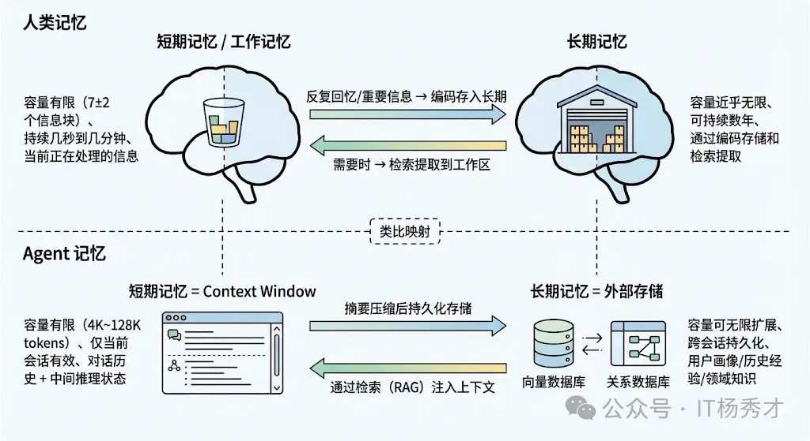

## 🧠 记忆模块的重要性

记忆模块是 Agent 四大核心组件之一（其余三个是 LLM 大脑、规划模块、工具使用）。如果说 LLM 是 Agent 的推理引擎，那么记忆模块就是支撑这个引擎持续运转的"燃料仓库"。

一个没有记忆的 Agent，每次对话都是从零开始的"失忆者"——它不知道用户之前的偏好、不记得上次任务的经验、也无法积累领域知识。而有了记忆模块，Agent 就能表现出"越用越聪明"的特性，成为一个真正有积累的智能助手。

---

## 🔄 人类记忆的类比

Agent 的记忆系统设计，其实是从认知科学中借鉴过来的。人类的记忆大致分为两类：

- **短期记忆（Short-term Memory）**：也叫工作记忆，容量有限，持续时间短。比如你听到一个手机号码，能暂时记住但过一会儿就忘了。
- **长期记忆（Long-term Memory）**：容量几乎无限，能持续很长时间。比如你的名字、骑自行车的技能、上周开会的内容。

把这个类比映射到 Agent 身上就非常自然了：

| 人类记忆 | Agent记忆     | 核心问题             |
| ---- | ----------- | ---------------- |
| 短期记忆 | 当前对话的上下文信息  | 上下文窗口有限怎么办？      |
| 长期记忆 | 跨对话持久化存储的知识 | 信息怎么存、怎么检索、怎么更新？ |

<div align="center">
  
</div>

---

## 💡 多轮对话的实现

所有大模型API都是“无状态”的——说白了，模型本身没有记忆，也不记你上一轮说了啥，每次请求都是独立的。目前行业内通用的解决方案是维护一个叫 messages 的对话数组，里面只存两种角色的内容

- user：用户问的问题
- assistant：模型答的内容

每一轮对话都走固定流程：追加用户问题 → 把完整笔记传给模型 → 拿回回复再追加进笔记，循环下去就是连贯的多轮对话。


// 第一轮：只问问题
```json
[{"role":"user","content":"推荐一本编程书籍"}]
```
// 第二轮：带上历史+新问题
```json
[{"role":"user","content":"推荐一本编程书籍"},
{"role":"assistant","content":"推荐《Python编程：从入门到实践》"},{"role":"user","content":"这本书适合零基础吗？"}]
```


## 📋 短期记忆：上下文窗口的管理艺术

Agent 的短期记忆，最直接的载体就是 LLM 的 **Context Window（上下文窗口）**。每次调用 LLM 时，我们把之前的对话历史、系统提示词、工具调用记录等信息拼接成一个 prompt 发给模型，模型就是基于这些"短期记忆"来理解当前状态并做出决策的。

### ⚠️ 上下文窗口的核心挑战

Context Window 的容量是有限的。即使现在的模型已经支持 128K 甚至更长的上下文，在实际 Agent 场景中，上下文很容易就被撑满：

- 一个复杂任务可能需要十几轮工具调用
- 每轮的 Thought、Action、Observation 加起来可能就有上千 token
- 再加上系统提示词和工具定义，上下文窗口很快就不够用了

而且即使窗口足够大，研究表明模型在处理超长上下文时会出现 **"Lost in the Middle"现象**——对上下文中间位置的信息关注度明显下降。

所以短期记忆的核心挑战是：**如何在有限的上下文窗口里，尽可能保留最有用的信息？**

---

### 🔧 滑动窗口（Sliding Window）

滑动窗口是最简单粗暴的方案。给messages数组设个长度上限，当对话历史超过窗口限制时，直接截断最早的消息，只保留最近的 N 轮对话。给messages数组设个长度上限，超出就删掉最早的对话，只保留最近N轮内容

**优点：** 实现简单

**缺点：** 信息丢失严重——可能用户在第一轮告诉了 Agent 一个关键信息，到了第十轮就被截掉了，Agent 完全"忘"了这件事。

---

### 📝 对话摘要（Conversation Summary）

对话摘要是一种更优雅的方案。当对话历史变长时，不是直接截断，而是用 LLM 把较早的对话内容压缩成一段摘要，然后用这段摘要+最近对话替代原始的冗长历史。

这种方式既控制了 token 用量，又保留了关键信息。**LangChain** 中的 `ConversationSummaryMemory` 和 `ConversationSummaryBufferMemory` 就是这种策略的实现：

- 优点：只对更早的对话做摘要压缩，保留核心信息，兼顾了近期对话的完整性和历史信息的保留Token消耗骤减。
- 缺点：需要额外的 LLM 调用来做摘要压缩，可能增加推理时间。


---

### 📐 Token Buffer（Token 缓冲区）

Token Buffer 则是按 token 数量来精确控制。设置一个 token 上限，比如 4000 token，当历史消息的总 token 数超过这个值时，从最早的消息开始逐条丢弃，直到总量回到阈值以内。

**优点：** 比简单的轮次截断更精确

**缺点：** 本质上还是"先进先出"的淘汰策略，可能丢失重要信息

---

### 📌 基于重要度的选择性保留

还有一种更精细的做法——不是简单地按时间顺序淘汰，而是评估每条历史消息的"重要程度"。

比如：

- 包含用户需求的消息比闲聊更重要
- 工具调用失败的经验比成功的记录更重要
- 用户明确纠正 Agent 的信息比普通对话更重要

**优先保留重要的、淘汰次要的。**

**优点：** 效果最好，最大化利用有限的上下文窗口

**缺点：** 实现最复杂，通常需要额外的 LLM 调用来做重要度评估

---

## 💾 长期记忆：跨会话的持久化知识系统

如果说短期记忆解决的是"当前对话怎么记"的问题，那长期记忆解决的就是"**跨对话怎么记、怎么用**"的问题。

长期记忆让 Agent 可以记住：

- 用户的偏好（"我喜欢简洁的代码风格"）
- 历史交互的经验教训
- 领域专有知识

使其表现得更像一个"有积累"的助手，而不是每次对话都从零开始的"失忆者"。

从认知科学的角度，长期记忆又可以细分为两类：

- **显式记忆（Explicit Memory）**：可以明确表述的事实和事件，比如"用户 A 喜欢 Python"
- **隐式记忆（Implicit Memory）**：内化在模型行为中的模式和技能，对应到 LLM 领域就是通过微调融入模型参数中的知识

---

### 🔍 向量数据库 + RAG（检索增强生成）

这是目前最主流的长期记忆方案。

**核心思路：**

1. 把需要长期记忆的信息（对话历史摘要、用户画像、领域文档等）通过 Embedding 模型转化为向量
2. 存入向量数据库（如 Milvus、Pinecone、Chroma、Weaviate 等）
3. 当 Agent 需要使用这些记忆时，先把当前问题也转化为向量
4. 在向量数据库中做相似度检索，找出最相关的记忆片段
5. 注入到当前的上下文中供 LLM 参考

**本质：** 把长期记忆的"存"和"取"都转化成了向量空间中的操作

**优势：** 检索是语义级别的，即使用户的问法和存储时的原文表述不同，只要语义相近就能检索到

---

### 🗄️ 关系型数据库 / KV 存储

适合存储**结构化**的记忆信息。

比如用户画像这类高度结构化的数据：

```json
{
  "user_id": "12345",
  "name": "张三",
  "preferred_language": "Python",
  "preferred_style": "简洁",
  "history_tasks": [
    {"task": "写排序算法", "result": "成功", "time": "2026-03-20"}
  ]
}
```

用关系型数据库存储比向量数据库更合适，因为可以**精确查询**而不是模糊的语义匹配。

**实际项目中：** 往往是向量数据库和关系型数据库配合使用

- 结构化信息用 MySQL/PostgreSQL 存
- 非结构化的语义信息用向量数据库存

---

### 🧩 知识图谱（Knowledge Graph）

知识图谱是另一种重要的长期记忆载体，特别适合存储**实体之间的关系**。

比如：

- "张三是产品经理"
- "张三负责 A 项目"
- "A 项目依赖 B 服务"

这类关系型知识，用**图结构**来存储比纯文本向量化更自然。Agent 在推理时可以通过图查询来获取结构化的关系信息，辅助决策。

**常用图数据库：** Neo4j、TigerGraph

---

### 📚 模型微调（Fine-tuning）

模型微调是一种"**隐式**"的长期记忆方案。

通过在特定领域的数据上对模型进行微调，领域知识就被"烧"进了模型参数中，变成了模型的"**肌肉记忆**"。

| 方案        | 优点         | 缺点                  |
| --------- | ---------- | ------------------- |
| 向量数据库+RAG | 更新灵活、可实时增删 | 推理时需要额外检索步骤         |
| 模型微调      | 推理时不需要额外步骤 | 更新成本高，每次知识更新都需要重新微调 |

---

## ⚙️ 记忆的写入、检索与更新机制

光有存储方案还不够，一个完善的记忆系统还需要设计好三个核心机制：

---

### 🖊️ 写入机制

最常见的做法是在每轮对话结束后，由一个专门的"**记忆管理模块**"来判断当前对话中是否有值得长期保存的信息。

比如：

- 用户明确表达了某个偏好（"我喜欢用 Python"）
- Agent 完成了一个任务并积累了经验教训
- 用户提供了重要的背景信息

**写入之前：** 通常需要做一次摘要提炼，把冗长的对话内容压缩成简洁的记忆条目，避免存储大量冗余信息。

---

### 🔎 检索机制

最关键的问题是"**检索的时机和精度**"。

**时机上：** Agent 在开始处理每个新任务时，都应该先从长期记忆中检索与当前任务相关的历史信息，把它们注入到短期记忆（上下文）中。

**精度上：** 除了基于向量相似度的语义检索，还可以结合：

- **元数据过滤**（比如按时间范围、按用户 ID 过滤）
- **重排序（Reranking）** 来提高检索质量

**常见组合：** "向量检索召回 + 交叉编码器重排序"

---

### 🔄 更新和遗忘机制

人的记忆会遗忘，Agent 的记忆也需要。如果长期记忆只增不减：

- 存储成本会越来越高
- 过期的、错误的记忆还会干扰 Agent 的判断

**常见做法：**

- 为记忆条目设置**时间衰减权重**（越久远的记忆权重越低）
- 定期让 LLM 对记忆库做**整理和去重**
- 当用户明确纠正某个信息时**主动更新**对应的记忆条目

---

## 🏗️ 实际项目中的三层分层记忆架构

在真实的 Agent 项目中，短期记忆和长期记忆不是孤立运作的，而是协同配合形成一个完整的**分层记忆架构**。

### 💭 最内层：即时上下文

也就是当前这轮 LLM 调用的 prompt 内容，包括：

- 系统提示词
- 最近几轮的原始对话
- 从长期记忆中检索注入的相关信息

这是 Agent **"当前正在想什么"**。

### 🗃️ 中间层：会话缓存

存储当前整个会话的完整历史（不仅仅是 prompt 中的那几轮），通常用 **Redis** 这类内存数据库来存。

当上下文窗口装不下全部历史时，就从会话缓存中检索或摘要化处理后注入。

### 🏛️ 最外层：持久化存储

也就是跨会话的长期记忆，用**向量数据库 + 关系型数据库 + 知识图谱**等方案来承载。

当 Agent 需要调用历史经验、用户偏好、领域知识时，就从这一层检索。

---

### 🔀 信息流动

信息在三层之间是可以**双向流动**的：

- **沉淀**：对话过程中产生的重要信息会从内层向外层（短期→长期）
- **提取**：需要用到的历史知识会从外层向内层（长期→短期）

**这种分层设计既保证了：**

- Agent 的实时响应速度
- 近乎无限的记忆容量

---

## 🛠️ 主流框架支持

主流框架对这套架构都有很好的支持：

| 框架             | 特点                                                                                                    |
| -------------- | ----------------------------------------------------------------------------------------------------- |
| **LangChain**  | 提供多种 Memory 组件（ConversationBufferMemory、ConversationSummaryBufferMemory、VectorStoreRetrieverMemory 等） |
| **LlamaIndex** | 更侧重于通过索引结构来组织长期记忆                                                                                     |
| **Mem0**       | 专门做 Agent 记忆管理的开源项目，提供开箱即用的记忆存储、检索、更新和遗忘机制                                                            |

---

## 📝 总结

| 记忆类型 | 存储位置               | 核心挑战                      | 主流方案                   |
| ---- | ------------------ | ------------------------- | ---------------------- |
| 短期记忆 | LLM Context Window | 窗口有限、"Lost in the Middle" | 滑动窗口、对话摘要、Token Buffer |
| 长期记忆 | 向量数据库/关系库/知识图谱     | 存/取/更新的完整生命周期             | 向量+RAG、KV存储、知识图谱、微调    |

**核心要点：**

- 短期记忆解决"当前对话怎么记"的问题——通过上下文窗口管理策略
- 长期记忆解决"跨对话怎么记、怎么用"的问题——通过向量检索、结构化存储、知识图谱
- 完整架构是**三层分层设计**：即时上下文 → 会话缓存 → 持久化存储
- 信息在三层之间**双向流动**：沉淀（内→外）和提取（外→内）

理解并掌握记忆模块的设计，是构建真正"有积累、有经验"的智能 Agent 的关键所在。
