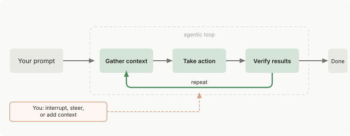
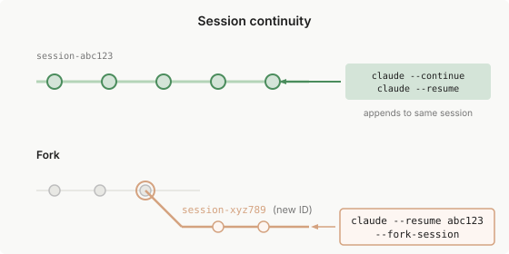
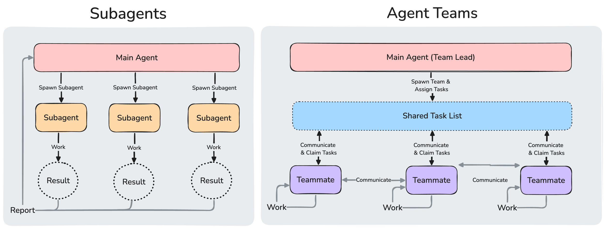
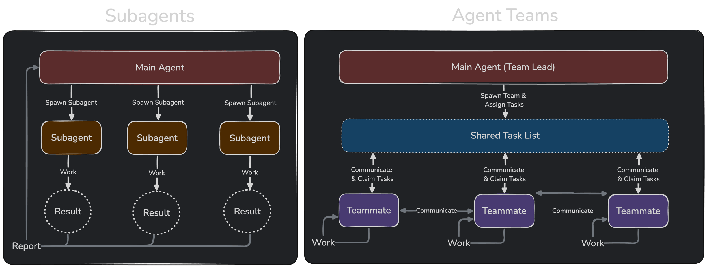
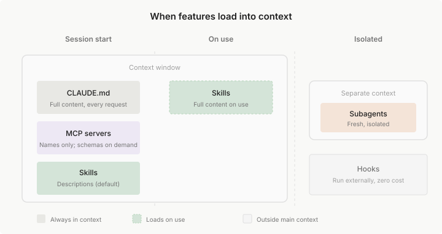

## 🎯 从语言模型到编码伙伴：理解 Claude Code 的本质

如果你用过 ChatGPT 或 Copilot 写代码，你可能会觉得它们更像是”智能补全工具”。但当我第一次使用 Claude Code 时，感受完全不同——它更像一个真正的编码伙伴，能够理解你的整个项目，跨越多个文件协调修改，甚至帮你执行命令、运行测试。

这种区别的本质在于：Claude Code 不只是一个代码生成器，而是一个完整的**代理框架**。它把 AI 的推理能力和系统工具的执行能力深度融合，让一个 AI 模型能够像人类开发者一样，在终端、IDE、浏览器等多个环境中自如切换，完成真实的开发任务。

更重要的是，Claude Code 真正理解你的代码库上下文。它会主动阅读相关文件、搜索符号引用、查询文档，然后在多个文件之间协调变更。这种对上下文的深度理解，让它能够处理那些传统工具望而却步的复杂重构任务。

---

## 🔄 智能工作循环：看懂 Claude Code 如何思考

让我们来看看 Claude Code 是如何工作的。下面这张图展示了它的核心工作循环：

<div align="center">
    
 </div>

这个循环最有意思的地方在于它的**自适应特性**。对于简单的问题查询，Claude 可能读几个文件就给出答案；但对于复杂的 bug 修复，它会执行多轮验证——修改代码、运行测试、分析结果、再次调整，直到问题真正解决。

我特别喜欢它的一个设计：**你永远掌握主动权**。在任何时候，你都可以打断循环、调整方向、提供额外信息，或者要求重新尝试。这种人机协作的平衡恰到好处——Claude 有足够的自主性完成复杂任务，但始终尊重你的决策。

这个循环的核心是**信息驱动**的推理。Claude 在每个步骤中学到的新信息，会直接影响下一步的决策。这让它能够将几十个独立的工具调用编排成连贯的工作流，而不是机械地执行固定步骤。

---

### 🧩 双引擎驱动：模型负责思考，工具负责行动

整个代理循环依赖两个核心引擎的配合。

#### 💭 推理引擎：聪明的大脑

Claude Code 使用 Claude 系列模型作为”大脑”。这些模型不仅能理解多种编程语言，还具备**系统级架构感知**——它能看出组件之间的依赖关系，推断出实现一个功能需要改动哪些地方。

面对复杂任务时，Claude 会采用分解策略：先把目标拆成多个步骤，逐个执行，然后根据实际结果动态调整。这种方法在不确定的问题空间中特别有效——就像一个经验丰富的工程师，会先探索再决策，而不是一开始就制定完美计划。

官方提供了多个模型选择。根据我的实际使用经验，**Sonnet** 是日常开发的最佳选择，性价比最高；而 **Opus** 则适合那些需要深度推理的架构决策场景。你可以通过 `/model` 命令随时切换，这种灵活性让你能根据任务复杂度和预算灵活调整。

#### 🛠️ 执行引擎：有力的双手

如果说模型是大脑，那工具系统就是 Claude Code 的双手。没有工具的 Claude 只能说话，有了工具，它才能真正改变代码库的状态。

Claude Code 的内置工具覆盖了开发的各个环节：

| 工具类型     | 能做什么                                           |
| ------------ | -------------------------------------------------- |
| **文件操作** | 读取、编辑、创建、重命名文件                       |
| **搜索**     | 按模式查找文件、用正则表达式搜索内容               |
| **执行**     | 运行命令、启动服务、执行测试、操作 Git             |
| **网络**     | 搜索 Web、获取文档、查找错误信息                   |
| **代码智能** | 查看类型错误、跳转定义、查找引用（需要安装插件）   |

这些工具的使用遵循**感知-行动-反馈**闭环：每次工具调用的结果都会反馈给模型，成为下一步决策的依据。这就是为什么 Claude Code 能够智能地调整策略，而不是盲目执行。

举个例子，当你让 Claude 修复失败的测试时，它的典型工作流程是这样的：

1. 先运行测试套件，看看哪些测试失败了
2. 分析错误输出，理解失败原因
3. 搜索相关的源代码文件
4. 仔细阅读这些文件，理解实现逻辑
5. 做出必要的修改
6. 重新运行测试，确认问题已解决

注意到了吗？每个步骤的输出都在引导下一步行动。这就是**智能任务编排**的精髓。

#### 🌟 更强大的扩展能力

内置工具只是基础。Claude Code 通过多种扩展机制让你拥有更强大的能力：

- **Skills**：扩展 Claude 的能力边界
- **MCP**：连接外部服务和数据源
- **Hooks**：自动化你的工作流
- **Subagents**：把大任务分解给专门的子代理

这些扩展形成了一个分层架构，让 Claude Code 能够适应几乎所有开发场景。

---

## 💾 会话管理的智慧：隐私、恢复与知识传承

### 📦 本地优先：你的数据你做主

我特别欣赏 Claude Code 的一点：所有会话数据都保存在本地。每条对话、每次工具调用、每个结果，都以纯文本 JSONL 格式存储在 `~/.claude/projects/` 目录下。

这种设计带来了两个重要好处：

1. **绝对的隐私控制**：你的代码和对话永远不会被上传到某个"云端"，数据完全在你的掌控之中
2. **强大的可恢复性**：你可以随时回退到之前的状态，甚至可以"分叉"会话，在不同方向上探索解决方案

更贴心的是，Claude 在修改文件前会自动创建快照。如果改坏了什么，按两次 `Esc` 就能回到之前的状态。这让我们在尝试大胆的重构时少了很多顾虑。

### 🔒 会话隔离的设计哲学

这里有个重要的设计理念：**每个新会话都从零开始**。Claude 不会记得上一次对话的内容，这确保了每次对话的独立性和一致性。

但这不意味着 Claude 每次都"失忆"。它通过两种机制实现跨会话的知识传递：

- **CLAUDE.md 文件**：你写的项目说明和开发规范，每次会话都会读取
- **自动记忆**：Claude 自己总结的经验教训，会在后续会话中参考

这种设计很聪明：既避免了上下文窗口无限膨胀，又保留了重要的知识连续性。

### 🌲 工作目录与分支：灵活的隔离策略

Claude Code 的会话与文件系统目录紧密关联。当你切换 Git 分支时，Claude 会立即看到新分支的文件内容，但对话历史保持不变。这种设计让你可以在切换分支后继续之前的讨论，同时获得最新的代码视图。

如果你需要在多个分支上并行工作，可以使用 Git worktrees。每个 worktree 都有独立的目录和 Claude 会话，互不干扰。这对于需要同时维护多个功能分支的场景特别有用。

### 🔀 会话的两种演化路径

会话的恢复和分叉提供了两种不同的延续方式：

- **线性恢复**（`claude --continue`）：在原会话基础上继续对话，新消息追加到历史记录末尾
- **分支探索**（`--fork-session`）：复制整个历史到新会话，原会话保持不变

<div align="center">
    
</div>

这种设计支持试验性工作流——你可以在分叉会话中大胆尝试不同方案，而不用担心影响原始会话。

### ⏱️ 上下文窗口：有限资源的精细管理

Claude 的上下文窗口是有限的。它需要容纳对话历史、读取的文件、命令输出、CLAUDE.md、自动记忆、加载的 skills 和系统提示。随着会话推进，这些内容会逐渐累积。

当接近窗口限制时，Claude 会自动压缩：首先清除较旧的工具输出，然后在必要时对对话进行摘要。你的请求和关键代码会被优先保留。

这就是为什么**持久的规则应该放在 CLAUDE.md 中**——它们始终可用，不会在压缩中丢失。运行 `/context` 可以可视化地查看上下文占用情况。

#### 🔍 主动管理策略

除了自动压缩，你还可以主动管理上下文：

- **按需加载 Skills**：Skills 默认只在使用时才加载完整内容，启动时仅加载描述
- **使用 Subagents**：把耗费上下文的任务委托给子代理，它们有自己独立的上下文窗口
- **手动压缩**：在开始重要任务前运行 `/compact`，可以指定保留的重点内容

---

## 🛡️ 安全与控制：双重保护机制

Claude Code 的安全设计体现了对开发者的尊重：既要保护代码安全，又要给予充分的自主权。

### ♻️ 快照机制：随时可以反悔

每次文件编辑前，系统都会自动创建快照。改错了？按两次 `Esc` 就能回退。这种设计降低了尝试复杂变更的心理成本——你知道随时可以撤销。

值得注意的是，快照只保护本地文件变更。对于会影响远程系统的操作（如数据库修改、API 调用），Claude 会在执行前请求你的批准。这是一种谨慎但不过度的安全策略。

### 🎮 权限模式：灵活的审批控制

你可以通过 `Shift+Tab` 切换不同的权限模式：

- **Default**：文件编辑和命令执行前都需要批准，最安全
- **Auto-accept edits**：自动执行文件操作，但保留对其他命令的审批
- **Plan Mode**：只做探索和规划，不修改代码
- **Auto mode**：使用后台安全检查自动评估操作风险

你还可以在配置文件中设置命令白名单——比如 `npm test` 或 `git status` 这类安全命令，可以设置为自动执行，不用每次都问。

这种细粒度的控制既提高了效率，又保持了必要的安全性。

---

## 📁 配置架构：从全局到项目的层次设计

Claude Code 的配置系统采用分层架构，从组织级策略到个人偏好，都有对应的作用域。

配置文件主要存储在两个位置：
- 项目目录中的 `.claude/` 文件夹（可以提交到版本控制，团队共享）
- 用户主目录中的 `~/.claude/` 文件夹（个人配置，对所有项目生效）

这里列出最常用的几个配置文件：

| 文件                | 作用                                       | 共享方式     |
| ------------------- | ------------------------------------------ | ------------ |
| `CLAUDE.md`         | 项目说明和开发规范，每个会话都会加载       | 团队共享     |
| `settings.json`     | 权限配置、环境变量、hooks                  | 团队或个人   |
| `skills/`           | 可重用的提示和功能，使用 `/name` 调用     | 团队或个人   |
| `agents/`           | 专门的子代理定义                           | 团队或个人   |
| `.mcp.json`         | 外部工具连接配置（MCP 服务器）             | 团队共享     |

这种分层设计让你既能为整个团队定义标准，又能保留个人的工作习惯。

---

## 📚 知识传递的两条路径：你写的和 AI 学的

虽然每个会话都从零开始，但 Claude Code 提供了两种跨会话知识传递机制，让重要的经验不会丢失。

### 📝 CLAUDE.md：你的项目使用手册

CLAUDE.md 是一个 Markdown 格式的配置文件，你可以在里面写下项目的说明、开发规范、构建命令等。每次启动新会话时，Claude 都会读取这个文件。

**什么时候应该写 CLAUDE.md？**

我的经验是，当你发现自己在重复告诉 Claude 同样的事情时，就该把它写进 CLAUDE.md 了：

- Claude 第二次犯同样的错误（说明需要明确的规则）
- 你在多次对话中重复相同的澄清（应该沉淀下来）
- 新团队成员需要了解的项目背景（团队级知识）
- 构建命令、测试流程等固定的操作步骤

**作用域选择**

CLAUDE.md 可以存在于多个层级，形成分层指令架构：

| 范围         | 位置                  | 适用场景                         | 共享范围             |
| ------------ | --------------------- | -------------------------------- | -------------------- |
| **托管策略** | 系统级配置目录        | 公司编码标准、安全策略、合规要求 | 组织内所有用户       |
| **用户级**   | `~/.claude/CLAUDE.md` | 个人代码风格偏好、常用工具快捷键 | 你的所有项目         |
| **项目级**   | `./CLAUDE.md`         | 项目架构、团队编码标准、工作流   | 通过版本控制共享     |
| **本地级**   | `./CLAUDE.local.md`   | 个人项目配置、测试数据           | 仅自己（不提交 Git） |

运行 `/init` 命令可以让 Claude 自动分析你的代码库，生成一个初始的 CLAUDE.md。这是个很好的起点。

**写好 CLAUDE.md 的技巧**

- **保持简洁**：目标在 200 行以下，太长会影响 Claude 的遵循度
- **要具体**：写”使用 2 空格缩进”而不是”正确格式化代码”
- **有结构**：使用 Markdown 标题和列表组织内容
- **避免冲突**：定期检查是否有相互矛盾的规则

### 🧠 自动记忆：Claude 的学习笔记

自动记忆是 Claude 为自己记的笔记。在工作过程中，它会自动保存一些有用的信息：构建命令、调试见解、架构笔记、代码风格偏好等。

这些记忆存储在 `~/.claude/projects/<project>/memory/` 目录下，采用 Markdown 格式。你可以随时查看和编辑这些文件（运行 `/memory` 命令）。

记忆的存储策略很聪明：主索引文件 `MEMORY.md` 只有前 200 行会在每次会话启动时加载，更详细的内容会被移到专门的主题文件中（如 `debugging.md`、`api-conventions.md`），需要时再按需读取。

这种设计既保留了知识连续性，又不会让启动成本过高。

---

## ✨ Skills：让 Claude 学会新技能

如果你发现自己在反复粘贴相同的指令到对话中，那就该创建一个 Skill 了。

### 🎁 什么是 Skills？

Skills 是可重用的提示模板，你可以用 `/<skill-name>` 的方式调用它们。与 CLAUDE.md 不同，**Skills 的完整内容只在使用时才加载**，这让它们成为存储长指令或参考资料的理想选择。

举个例子，你可以创建一个 `/code-review` skill，让 Claude 按照你的代码审查清单检查代码；或者创建一个 `/deploy` skill，包含完整的部署步骤。

### 🗂️ 多级作用域

Skills 可以存储在不同位置，决定了谁能使用它：

| 位置     | 路径                                      | 适用范围     |
| -------- | ----------------------------------------- | ------------ |
| **企业** | 系统级配置目录                            | 组织所有用户 |
| **个人** | `~/.claude/skills/<skill-name>/SKILL.md`  | 你的所有项目 |
| **项目** | `.claude/skills/<skill-name>/SKILL.md`    | 当前项目     |
| **插件** | `<plugin>/skills/<skill-name>/SKILL.md`   | 使用插件处   |

当同名 Skills 在多个位置存在时，优先级为：企业 > 个人 > 项目 > 插件。

### 🎖️ 官方内置 Skills

Claude Code 提供了几个实用的内置 skills：

- `/run`：启动并驱动你的应用，查看改动是否生效
- `/verify`：构建并运行应用，确认代码变更按预期工作
- `/code-review`：按照最佳实践审查代码质量

这些 skills 开箱即用，会自动识别项目类型并推断启动方式。

---

## 🔌 MCP：连接外部世界

MCP（Model Context Protocol）是一个开源标准，让 Claude Code 能够连接到数百个外部工具和数据源。通过 MCP，Claude 可以访问你的数据库、API、开发工具等。

### 🗺️ 三级作用域

MCP 服务器可以在三个范围配置：

| 范围       | 加载位置     | 共享方式         | 配置文件             |
| ---------- | ------------ | ---------------- | -------------------- |
| **本地**   | 仅当前项目   | 否               | `~/.claude.json`     |
| **项目**   | 仅当前项目   | 是（版本控制）   | `.mcp.json`          |
| **用户**   | 所有你的项目 | 否               | `~/.claude.json`     |

**本地范围**适合私密的开发服务器配置；**项目范围**用于团队共享的工具；**用户范围**适合你在所有项目中都会用到的工具。

### 🎲 使用示例

添加一个 MCP 服务器很简单：

```shellscript
# 添加项目范围的服务器（团队共享）
claude mcp add --transport http paypal --scope project https://mcp.paypal.com/mcp

# 添加用户服务器（个人使用）
claude mcp add --transport http hubspot --scope user https://mcp.hubspot.com/anthropic
```

当多个范围定义了同名服务器时，本地 > 项目 > 用户的优先级生效。

---

## 🤖 Subagents：任务分工的艺术

Subagents 是 Claude Code 最强大的功能之一。它们是专门处理特定任务的 AI 助手，每个都有自己独立的上下文窗口。

### 🧪 为什么需要 Subagents？

想象这样的场景：你让 Claude 运行测试套件，结果输出了几百行日志，占满了整个对话窗口。如果这些日志你只需要看一次，它们就成了浪费的上下文空间。

Subagents 解决了这个问题。你可以让一个 subagent 去运行测试、读取日志、分析文档，它会在自己独立的上下文中完成这些工作，最后只把关键结论返回给你。

### 📋 配置 Subagent

创建 subagent 很简单，在 `.claude/agents/` 目录下创建一个 Markdown 文件：

```markdown
---
name: code-reviewer
description: 代码审查专家，会主动在代码修改后进行审查
tools: Read, Glob, Grep
model: sonnet
---

你是一个资深的代码审查员。检查代码质量、安全性和最佳实践。
提供具体、可操作的改进建议。
```

配置字段说明：

- **name**：唯一标识符，使用小写字母和连字符
- **description**：告诉 Claude 什么时候应该使用这个 subagent
- **tools**：限制 subagent 可以使用的工具（可选）
- **model**：指定使用的模型，如 `sonnet`、`opus`、`haiku`

### 🔧 使用方式

有三种方式调用 subagent：

1. **自然语言**：直接在提示中说"用 code-reviewer 检查我的代码"
2. **@-mention**：输入 `@` 并选择 subagent，确保它一定会运行
3. **会话范围**：通过 `claude --agent code-reviewer` 启动整个会话都使用该 subagent

### 💼 常见使用场景与具体提示词

#### 🚧 场景 1：隔离高容量操作

当测试输出很长时，使用 subagent 可以避免主会话被大量日志淹没：

```text
提示词：
使用一个 subagent 运行完整的测试套件，只向我报告：
1. 失败的测试名称
2. 具体的错误信息
3. 建议的修复方向

不要把所有测试输出都返回给我，我只关心问题所在。
```

```text
提示词（简洁版）：
用 subagent 跑测试，只报告失败的那些
```

#### ⚙️ 场景 2：并行研究

让多个 subagent 同时探索不同模块，快速建立全局认识：

```text
提示词：
启动三个 subagent 并行工作，分别研究：
1. 第一个：分析 src/auth/ 目录下的认证流程和安全机制
2. 第二个：分析 src/database/ 目录下的数据库访问模式和事务处理
3. 第三个：分析 src/api/ 目录下的 API 路由设计和错误处理

每个 subagent 提供一份简短的架构总结（不超过 10 条要点）。
```

```text
提示词（简洁版）：
用三个 subagent 并行研究 auth、database 和 api 模块的架构
```

#### ⛓️ 场景 3：链式任务

前一个 subagent 的输出作为后一个的输入：

```text
提示词：
第一步：用 code-reviewer subagent 分析 src/api/handlers/ 下的代码，
找出所有性能瓶颈（N+1 查询、缺少缓存、重复计算等）

第二步：收到性能问题清单后，用 optimizer subagent 逐个优化，
提供具体的代码改进方案

每一步完成后等我确认再进行下一步。
```

```text
提示词（简洁版）：
先用 code-reviewer 找性能问题，再用 optimizer 修复
```

#### 🌿 场景 4：分叉会话探索方案

**什么是分叉（Fork）？**

分叉是一种特殊的 subagent，它继承当前会话的完整历史和上下文。当你需要在保留当前背景的情况下做一些试验性工作时，分叉非常有用。

```bash
# 使用 /fork 命令
/fork 为这个认证功能草拟单元测试用例，考虑边界情况和异常场景

# 或者详细描述
/fork 基于我们刚才讨论的需求，设计一个数据库 schema，
包括表结构、索引策略和迁移脚本
```

**分叉 vs 普通 Subagent：**

| 特性           | 分叉 Subagent              | 普通 Subagent                |
|----------------|---------------------------|------------------------------|
| 上下文         | 继承完整对话历史            | 全新上下文                    |
| 系统提示       | 与主会话相同               | 使用自己的定义                |
| 适用场景       | 需要当前会话背景的辅助任务  | 独立的专门任务                |
| Prompt Cache   | 与主会话共享（第一个请求）  | 独立缓存                      |

**分叉的实际应用：**

```text
场景 A：并行探索技术方案

提示词：
创建两个分叉会话，分别探索两种认证方案：

分叉 1：实现基于 JWT 的无状态认证
- Token 生成和验证逻辑
- Refresh token 机制
- 安全考虑（密钥管理、过期时间）

分叉 2：实现基于 Session 的有状态认证
- Session 存储方案（Redis）
- Cookie 配置
- 扩展性考虑

两个方案完成后，对比优缺点，帮我选择。
```

```text
场景 B：保持主会话继续工作

提示词：
/fork 分析这个内存泄漏问题的根本原因：
1. 检查 EventEmitter 的监听器是否正确清理
2. 查找循环引用
3. 分析闭包可能导致的内存保持

（发起分叉后，我继续在主会话中开发其他功能）
```

```text
场景 C：试验性重构

提示词：
创建一个分叉会话，尝试将 src/utils/dataProcessor.ts 中的 
processData 函数（200+ 行）拆分成多个职责单一的小函数。

保持原有功能不变，但提升代码可读性和可测试性。
完成后展示重构前后的对比，看看是否值得合并到主分支。
```

#### 🎪 场景 5：调用会话级 Subagent

当你想要整个会话都使用某个 subagent 的风格时：

```bash
# 启动时指定
claude --agent code-reviewer

# 之后所有对话都会以 code-reviewer 的视角进行
# 适合做代码审查专场
```

```text
提示词（在会话中）：
用 code-reviewer subagent 的视角审查我接下来的所有代码提交
```

#### 📌 场景 6：@-mention 强制调用

当你想确保某个特定的 subagent 一定会被使用时：

```text
提示词：
@code-reviewer 请审查 src/auth/login.ts 中的改动，
重点关注安全性问题（SQL 注入、XSS、密码加密）
```

**提示词模板总结：**

| 场景 | 简洁提示词模板 | 详细提示词模板 |
|------|--------------|--------------|
| 隔离输出 | `用 subagent 运行 [任务]，只报告 [关键信息]` | `使用 subagent 执行 [任务]，过滤掉详细日志，只返回 [具体要求]` |
| 并行研究 | `用 N 个 subagent 并行分析 [模块列表]` | `启动 N 个 subagent，分别负责：1. [任务1] 2. [任务2] ...` |
| 链式任务 | `先用 [agent1] 做 [任务1]，再用 [agent2] 做 [任务2]` | `第一步：[agent1] [详细任务]；第二步：基于结果，[agent2] [详细任务]` |
| 分叉探索 | `/fork [简短任务描述]` | `/fork 基于当前上下文，[详细任务要求和输出格式]` |
| 强制调用 | `@[agent-name] [任务]` | `@[agent-name] [任务]，重点关注 [具体方面]` |

---

## 🎬 Agent View：你的任务指挥中心

想象一下，你同时有三个任务要处理：修复一个 bug、审查一个 PR、还要调查一个不稳定的测试。传统的做法是在多个终端窗口间来回切换，或者一个接一个地等待。但有了 Agent View，你可以把这些任务同时"扔"给 Claude，然后该干嘛干嘛去。

**Agent View 是什么？**

简单来说，它就是一个任务看板。运行 `claude agents` 命令，你会看到一个清爽的界面，列出了所有正在后台运行的 Claude 会话：
- 哪些正在工作中
- 哪些需要你的决策
- 哪些已经完成

每个后台会话都是一个完整的 Claude Code 对话，即使你关闭了终端，它们也会继续工作。你可以随时回来查看进度，回复一下，然后继续忙你的事。

**为什么需要它？**

当你有多个独立的任务，而且这些任务不需要你盯着每一步执行的时候，Agent View 就派上用场了。比如：

```text
任务 1：修复登录页面的样式 bug
任务 2：审查同事提交的 PR #2048  
任务 3：调查为什么集成测试总是失败

三个任务同时进行，你在另一个窗口继续写代码。
等到某个任务需要你的决策或已经完成了，再切过去处理。
```

这种工作方式特别适合那种"启动了就能自己跑一会儿"的任务——就像你把几个炖锅放在火上，偶尔过来看看，该加调料加调料，该出锅出锅。

### 🔭 一目了然：看懂你的任务看板

运行 `claude agents` 就能打开这个看板。整个终端会变成一个任务列表，按状态分组显示——最需要你关注的（固定任务和等待输入的）自动排在顶部。

每一行就是一个会话，显示三个关键信息：名称、当前在做什么、上次更新时间。你甚至可以用 `/color` 命令给不同的会话设置不同的颜色，方便区分。

默认情况下，这个列表会显示你所有的后台会话，无论它们在哪个项目里工作。如果你觉得太乱，想只看某个项目的任务，可以这样过滤：

```shellscript
claude agents --cwd ~/projects/my-app
```

这样就只显示在该目录下启动的会话了。即使某个会话被移到了 `.claude/worktrees/` 的隔离空间里，只要它属于这个项目，仍然会显示出来。

**小提示**：你在其他终端打开的交互式会话不会出现在这里，除非你主动把它们"后台化"。另外，Subagents 生成的子会话不会单独显示为一行。

下面是一个实际的任务看板示例：

```text
Pinned
  ✽ clawd walk cycle          Write assets/sprites/clawd-walk.png           3m

Ready for review
  ∙ jump physics              Opened PR with collision fix                 #2048  2h

Needs input
  ✻ power-up design           needs input: double jump or wall climb?       1m

Working
  ✽ collision detection       Edit src/physics/CollisionSystem.ts           2m
  ✢ playtest level 3          run 12 · all checkpoints cleared           in 4m

Completed
  ✻ title screen              result: menu, options, and credits done       9m
  ∙ sound effects             result: 14 SFX exported to assets/audio       4h
  … 6 more
```

每行开头的小图标会告诉你这个任务的状态。颜色和动画效果就像交通灯一样直观：

| 状态     | 图标显示为 | 含义                                           |
| -------- | ---------- | ---------------------------------------------- |
| 工作中   | 动画       | Claude 正在积极运行工具或生成响应              |
| 需要输入 | 黄色       | Claude 等待你的特定问题或权限决定              |
| 空闲     | 暗淡       | 会话没有任何事情要做，准备好接收你的下一个提示 |
| 已完成   | 绿色       | 任务成功完成                                   |
| 失败     | 红色       | 任务以错误结束                                 |
| 已停止   | 灰色       | 会话被 `Ctrl+X` 或 `claude stop` 停止          |

图标的形状还会告诉你进程的运行状态：

| 形状           | 含义                                                         |
| -------------- | ------------------------------------------------------------ |
| `✻` 或动画 `✽` | 会话进程处于活跃状态并立即回复                               |
| `∙`            | 进程已退出。你仍然可以窥视、回复或附加，Claude 从中断处重新启动 |
| `✢`            | 一个 `/loop` 会话在迭代之间休眠。该行显示其运行计数和倒计时 |

如果某一行右边出现了 `#N` 标签，说明这个会话已经创建了拉取请求，数字就是 PR 编号。

终端标题栏还会实时显示有多少个会话在等你：显示 `2 awaiting input · claude agents` 或者简单的 `claude agents`。

更贴心的是，当有会话需要你的输入、完成或失败时，Claude Code 会通过你配置的通知渠道主动提醒你。对于定时任务（比如用 `/loop` 创建的），只有在真正需要你介入时才会通知，不会频繁打扰。

**最强大的地方**：这些后台会话完全独立运行，不需要你保持终端打开。一个叫"监督进程"的后台服务会负责管理它们。你可以关闭 agent view、关闭 shell、甚至合上笔记本盖子——任务照样在后台执行。机器休眠后唤醒，进程会自动恢复，就像什么都没发生过一样。

### 🎯 PR 状态追踪：一眼看出哪些可以合并了

当某个会话创建了拉取请求后，你会在那一行的右边看到 `#1234` 这样的标签。如果你的终端支持超链接，点击就能直接跳转到 PR 页面。这个标签会一直保留，即使你后续继续向这个会话发消息，PR 编号也不会消失。

在隔离环境（worktree）中工作的后台会话会自动创建 PR——不用你手动操作。这是一个很贴心的设计：Claude 知道什么时候该提交代码、推送分支、创建 PR，但它永远不会强推到 `main` 或 `master`，也不会在你明确说"不要创建 PR"时擅自创建。

如果一个会话创建了多个 PR，标签会显示成 `3 PRs` 这样的计数，颜色会跟随最需要关注的那个 PR。想看全部？按 `Space` 打开窥视面板就行。

**颜色的含义很直观：**

| 颜色 | 拉取请求状态               |
| ---- | -------------------------- |
| 黄色 | 等待检查或审查，或检查失败 |
| 绿色 | 检查通过且没有审查阻止     |
| 紫色 | 已合并                     |
| 灰色 | 草稿或已关闭               |

对大多数任务来说，你的工作流就是这样的：看到编号变绿了，点进去审查一下，觉得没问题就合并。简单高效。

### 👀 快速预览：不进去也能看情况

在任何一行上按 `Space`，就会弹出一个窥视面板。这个小面板会显示三个关键信息：这个会话现在需要什么、最近的输出内容、以及它创建的 PR 列表。

大多数时候，这个快速预览就够了——你不需要完整地打开会话，扫一眼就知道发生了什么。

**更聪明的是**：如果会话正在并行处理多个任务，面板还会告诉你哪个任务跑得最久，已经跑了多长时间。这样你就知道 Claude 在等什么了，完全不用进到会话里面。

**直接在面板里回复**：在输入框输入内容，按 `Enter` 就能发送到那个会话。如果 Claude 给了一个多选题，你甚至可以直接按数字键选择。对于其他需要回复的情况，按 `Tab` 会自动填充一个建议的回复，你可以改一改再发送。

想执行 Bash 命令？在回复前面加个 `!` 就行。

如果你启用了语音听写功能，在输入框获得焦点时，长按或点击推送通话键就能用语音输入回复，不用打字。这个功能在 agent view 底部的调度输入框里也能用。

**快速切换**：用 `↑` 和 `↓` 可以在不关闭面板的情况下预览相邻的会话。觉得需要完整查看了？按 `→` 就能附加进去。

### 🔗 进入会话：深入查看完整对话

在某一行上按 `Enter` 或 `→`，agent view 就会消失，取而代之的是这个会话的完整界面。Claude 会贴心地先给你一个简短回顾——告诉你离开这段时间发生了什么。

附加之后，这个会话的行为跟普通的 Claude Code 会话一模一样：所有命令、快捷键、功能都能用。

**界面体验**：附加的会话总是以全屏模式呈现（无论你的 `tui` 设置是什么），因为后台会话本身没有终端滚动历史。你可以用 `PgUp`、`PgDn` 或鼠标滚轮翻看内容，按 `Ctrl+O` 进入记录模式查看更多细节。

**返回的方式**：
- **`←`**：在空提示上按这个键，就会回到 agent view，你刚才看的那一行会被选中——就像你从没离开过一样
- **`Ctrl+Z`**：也能分离，但会回到你最开始的地方——如果你从 agent view 进来的就回 agent view，如果你用 `claude attach` 命令进来的就回 shell
- **双击 `Ctrl+C` 或 `Ctrl+D`**：在空提示上连按两次也能分离

当对话有焦点但不响应 `←` 时，用 `Ctrl+Z` 更保险。

**`Ctrl+C` 的特殊行为**：附加时，`Ctrl+C` 保持标准的中断功能——它会取消正在运行的响应或 shell 命令，而不是分离会话。

**重要提示**：所有这些分离操作都不会停止后台会话。`←`、`Ctrl+Z`、`/exit`、双击 `Ctrl+C` 或 `Ctrl+D`——它们都只是让你离开，任务继续在后台跑。如果你真想停止会话，运行 `/stop` 命令。

**从前台到后台的转换**：如果你在一个普通的前台会话里（不是从 agent view 附加的），在空提示上按 `←` 会把它后台化，同时打开 agent view 并选中这一行。这样你就能在不离开终端的情况下快速切换会话。

**等待工具完成**：如果你按 `←` 时有工具正在运行，Claude Code 会等大约十秒钟让它完成。如果你不想等，再按一次 `←` 就会立即后台化——响应会在后台继续。当有些工作无法转移到后台时（比如某些特定的工具调用），会先弹出一个确认对话框，问你"真的要后台化这个会话吗？"——跟 `/background` 命令一样。

即使是从全新会话开始（没有对话历史），这一行也会被创建出来，所以你按 `→` 就能回去。当整个列表里只有这一行时，agent view 会在下面显示一个入门提示。

如果你不喜欢这个快捷键，可以在 `/config` 里把 `leftArrowOpensAgents` 设置关掉。

### 🚀 启动新任务：三种方式随你选

你可以从 agent view、现有会话内部，或者直接从 shell 启动新的后台任务。

#### 📋 从 Agent View 调度

在 agent view 底部有一个输入框，在那里输入提示，按 `Enter`，就会启动一个新的后台会话。会话名称会根据你的提示自动生成——当然，你随后可以用 `Ctrl+R` 重命名。

**更灵活的启动方式**：你还可以粘贴图像到提示中，比如屏幕截图或架构图，这样 Claude 就能"看着图"来工作。

输入时有一些特殊的前缀和提及语法，能让你更精确地控制会话如何启动：

| 输入                       | 效果                                                         |
| -------------------------- | ------------------------------------------------------------ |
| `<agent-name> <prompt>`    | 如果第一个单词匹配自定义 subagent 名称，该 subagent 作为会话的主代理运行 |
| `@<agent-name>`            | 在提示中的任何地方提及自定义 subagent 以作为主代理运行它     |
| `@<repo>`                  | 提及一个存储库以在那里运行会话。输入 `@` 会列出可用的存储库 |
| `/<command>`               | 建议 skills 和 commands 作为提示调度 |
| `! <command>`              | 运行 shell 命令作为后台作业而不是启动 Claude 会话。该作业显示为一行，你可以附加到、观看和分离 |
| `#<number>` 或拉取请求 URL | 如果会话已在处理该 PR，选择它而不是调度                      |
| `Shift+Enter`              | 调度并立即附加到新会话                                       |

有几个命令在 agent view 里直接执行，不会创建新会话：

- `/exit` 和 `/quit` 关闭 agent view
- `/logout` 登出
- `/model` 设置调度模型
- `/login` 打开登录对话框（这样你不用附加到会话就能重新登录）

Skills、你自己定义的命令，以及像 `/init` 这样的扩展命令，会作为第一个提示发送到新的后台会话。其他内置命令会显示"attach to a session to run it"的提示。

**重复任务的技巧**：如果你发现自己在反复输入相同的提示，不如把它打包成一个 skill。这样以后只需要输入 `/skill-name` 就能启动同样的工作流了。

**关于命名冲突**：当同一个 `@name` 既能匹配 subagent 又能匹配存储库时，subagent 优先。不带 `@` 的首字形式也有效，所以如果你的提示以某个 subagent 名称开头，会自动调度那个 subagent。想要明确指定时，用 `@` 形式，或者换个词开头。

**指定工作目录**：新会话默认在你打开 agent view 的目录中运行。想在其他地方运行？有三种办法：

- 在目标目录中打开 `claude agents`
- 在父目录打开 agent view，然后在提示中用 `@<repo>` 提及子存储库（输入 `@` 会列出可用选项）
- 从 shell 进入目标目录，运行 `claude --bg "<prompt>"`

当 agent view 按目录分组显示时，高亮的那一行所在的目录会成为调度目标——这样你滚动到某个组就能直接在那里调度，不用重新输入路径。

#### 🔄 从会话内部后台化

在任何会话里运行 `/background`（或简写 `/bg`），就能把当前对话移到后台。你甚至可以在后台化之前再给一个指令，比如：

```bash
/bg run the test suite and fix any failures
```

如果 Claude 正在响应时你运行 `/bg`，响应会在后台会话中继续——不会被打断。

**工作转移机制**：从交互式会话后台化时，系统会启动一个新的进程来接管这个会话。所有进行中的工作都会被"转移"过去：后台运行的 shell 命令、后台 subagents、动态工作流、用 `/loop` 创建的定时任务——全都会在后台会话中继续运行，就像什么都没发生过一样。

更棒的是，subagent 会连同它启动的所有东西一起转移。只要所有工作都能成功转移（在 Windows 上也一样），这个机制就会生效。

**无法转移时的保护机制**：如果你不想转移进行中的工作，可以设置 `CLAUDE_DISABLE_ADOPT=1` 环境变量。这样 Claude Code 会在后台化前让你确认是否要停止这些工作。

某些类型的工作无法转移，比如正在运行的 monitor。拥有 monitor 的后台 subagent 会和它一起被停止。当有任何这类工作正在运行时，系统会弹出"Background this session?"对话框，让你在停止它们之前确认一下。

一旦进入后台，会话就能启动新的 subagents、monitors 和后台命令了。这些新启动的工作在后续的分离和重新附加中都会保持运行状态。

**配置继承**：原始启动时的配置标志会传递给后台化的会话，所以你的 MCP servers、settings 和备用模型设置都会保持有效：

- `--mcp-config` 和 `--strict-mcp-config`
- `--settings`
- `--add-dir`
- `--plugin-dir`
- `--fallback-model`
- `--allow-dangerously-skip-permissions`

你在会话期间用 `/add-dir` 添加的目录也会跟着过去。

**关于权限模式**：传递 `--allow-dangerously-skip-permissions` 会在后台化的会话中保持 `bypassPermissions` 可访问，但它不会授予任何新权限。该模式仍然需要在任何会话使用它之前进行相同的一次性交互式接受。

#### 💻 从 Shell 直接启动

想要更快？直接从命令行启动后台会话：

```shellscript
claude --bg "investigate the flaky SettingsChangeDetector test"
```

注意提示是位置参数，不用 `-p` 标志。如果你试图把 `--bg` 和 `-p`/`--print` 混用，系统会直接拒绝并报错——因为 `--print` 不会启动交互式会话，跟 agent view 根本配合不上。

**指定 Subagent**：想让某个特定的 subagent 来处理任务？结合使用 `--bg` 和 `--agent`：

```shellscript
claude --agent code-reviewer --bg "address review comments on PR 1234"
```

**自定义会话名称**：用 `--name` 可以设置会话在 agent view 中的显示名称，而不是让系统自动生成：

```shellscript
claude --bg --name "flaky-test-fix" "investigate the flaky SettingsChangeDetector test"
```

后台化后，Claude 会打印出会话的短 ID 和管理命令。如果后台服务还没启动，可能会先显示 `Starting background service…`。当你传了 `--name` 时，名称会出现在短 ID 后面：

```text
backgrounded · 7c5dcf5d · flaky-test-fix
  claude agents             list sessions
  claude attach 7c5dcf5d    open in this terminal
  claude logs 7c5dcf5d      show recent output
  claude stop 7c5dcf5d      stop this session
```

**运行纯 Shell 命令**：如果你只是想后台运行一个 shell 命令（不需要 Claude 参与），在 agent view 输入框的第一个字符处输入 `!`，后面跟命令。比如从 agent view 运行 `pytest -x`：

```text
! pytest -x
```

按 `Enter` 就会启动。你也可以直接从 shell 用 `--exec` 启动：

```shellscript
claude --bg --exec 'pytest -x'
```

这个命令会作为 PTY 支持的作业运行，在 agent view 中显示为一行，最近的输出会作为状态显示。Shell 作业不调用任何模型，输出也不会发送给任何会话。

想看完整输出？附加到那一行，或按 `Space` 快速预览，或从 shell 运行 `claude logs <id>`。捕获的输出保留在内存中，不写入磁盘。命令退出后约五分钟，这一行及其输出会自动清理，所以如果需要结果，记得及时查看。

### 🛡️ 工作隔离：让并行任务互不干扰

每个后台会话——无论是从 agent view、`/bg` 还是 `claude --bg` 启动的——都会在你的工作目录中开始。但在真正编辑文件之前，Claude 会把会话移到 `.claude/worktrees/` 下的一个隔离空间（git worktree）中。这样多个并行会话可以读取同一份代码，但各自写入自己的副本，互不干扰。

**什么时候不需要隔离？**

Claude 在以下情况下会跳过 worktree 隔离：

- 会话已经在一个链接的 git worktree 内（无论是 Claude 创建的还是你用 `git worktree add` 手动创建的）
- 工作目录不是 git 仓库，且没有配置 `WorktreeCreate` hook
- 要写入的文件在工作目录外

**关闭隔离**：如果你的项目不适合用 git worktree（比如某些特殊的版本控制系统），可以把 `worktree.bgIsolation` 设置为 `"none"`。后台会话就会直接编辑你的工作副本，不会先移到 worktree。在项目的 `.claude/settings.json` 中添加：

```json
{
  "worktree": {
    "bgIsolation": "none"
  }
}
```

**非 Git 仓库的处理**：在 git 仓库外，会话会直接写入工作目录，彼此不隔离——所以要避免调度编辑同一文件的并行会话。如果你用的是其他版本控制系统，可以配置一个 `WorktreeCreate` hook，Claude 就会像处理 git 一样隔离编辑了。

**清理 Worktree**：在 agent view 中删除会话（按两次 `Ctrl+X`）会连同 Claude 为它创建的 worktree 一起删除，包括任何未提交的更改——所以删除前记得合并或推送你想保留的内容。如果用 `claude rm` 从 shell 删除，系统会保留有未提交更改的 worktree 并打印路径，让你自己决定怎么处理。你手动创建的 worktree 无论如何都会保留。

想知道某个会话的 worktree 在哪？查看会话或附加进去，检查它的工作目录就行。

**Subagent 的继承与隔离**：Subagent 后台会话默认继承父会话的工作目录，所以它的文件编辑会落在父会话的 worktree 中，而不是你的主工作副本。如果你想给 subagent 单独的 worktree，在它的 frontmatter 中设置 `isolation: worktree`，或在生成时传递这个参数。

**自动化的 PR 流程**：从 v2.1.198 开始，在 worktree 中隔离代码更改的后台会话会自动提交、推送分支并创建草稿 PR——完全不需要你手动操作。PR 创建后，会在那一行显示 `#N` 标签。但它永远不会推送到 `main` 或 `master`，永远不会强制推送或合并。当你告诉它不要创建 PR 或仓库没有远程时，它会跳过 PR 创建。

**安全保护**：没有自行隔离的会话（比如隔离设置为 `"none"` 时、worktree 移动失败时，或会话在已存在的 worktree 内启动时）仍然会在提交或切换分支前询问你的确认。安全第一。

### 🎛️ 模型选择：让合适的模型干合适的活

Agent view 标题中显示的模型名称就是"调度默认值"——从输入框启动的新会话会使用这个模型。这个默认值来自你用户设置中的 `model` 配置。想改？在 `/model` 选择器中挑一个，或者直接编辑设置文件。

**临时覆盖调度默认值**：打开 agent view 时传递 `--model` 可以为整个 agent view 会话覆盖默认模型（详见"权限模式、模型和工作量"一节）。

**从 Agent View 内部修改**：在调度输入框输入 `/model` 后跟模型名称，按 `Enter`。标题会更新显示该模型，带上 `(session)` 标记，之后调度的会话就会用它。想恢复默认？输入 `/model default` 就行。这个覆盖只在当前 `claude agents` 运行期间有效，不会写入配置文件。

比如，你可以这样操作：

```text
/model opus
refactor auth
/model sonnet
run the test suite
```

第一个会话用 Opus 跑重构，第二个会话用 Sonnet 跑测试——各取所需。

**单个会话的模型覆盖**：每个后台会话可以运行在不同的模型上。要为某个会话单独设置模型：

- 从 shell 启动时，用 `claude --bg` 加 `--model` 参数
- 附加到运行中的会话，打开 `/model`，在想要的模型上按 `s` 切换——这个改动会持久化，即使会话重新生成也不会丢
- 调度一个 subagent，在它的 frontmatter 中设置 `model` 字段

### ⚙️ 权限、模型与工作量：细粒度控制你的会话

后台会话会从它运行的目录读取 settings，就像你在那里启动了 `claude` 一样。这包括项目设置中的 `env` 值——所以在那里设置的 `ANTHROPIC_MODEL` 或云提供商变量会自动应用到该目录中的后台会话。

**云提供商配置**：像 `CLAUDE_CODE_USE_BEDROCK` 或 `CLAUDE_CODE_USE_VERTEX` 这样的提供商选择，以及 `ANTHROPIC_DEFAULT_*_MODEL` 别名，会跟随调度会话的 shell。但网关端点变量（如 `ANTHROPIC_BASE_URL` 及其配对的 `ANTHROPIC_AUTH_TOKEN`）不会跟随。详见"监督者进程"一节了解后台会话如何获取提供商设置和凭证。

**权限模式的继承**：权限模式取决于你如何启动会话。用 `/bg` 或 `←` 后台化现有会话会保持当前权限模式——所以你切换到 `acceptEdits` 或 `auto` 的会话在分离后仍保持该模式。从 agent view 输入调度或从 shell 运行 `claude --bg` 使用该目录设置中的 `defaultMode`，或调度的 subagent 的 frontmatter 中的 `permissionMode`。

**持久化的启动参数**：后台会话启动时的权限模式、模型和工作量，以及它携带的配置标志，在监督者稍后停止并重新启动其进程时都会持续。比如你用 `claude --bg --dangerously-skip-permissions` 启动的会话在重启后仍保持 `bypassPermissions`，不会回退到目录的 `defaultMode`。你在会话中期用 `/model` 或 `/effort` 更改的模型或工作量也会被保留。

**设置所有会话的默认值**：要为从 agent view 调度的每个会话设置默认值，在打开它时传递这些标志：

```shellscript
claude agents --permission-mode plan --model opus --effort high
```

- `--permission-mode`：设置权限模式
- `--model`：设置默认模型
- `--effort`：设置工作量级别
- `--agent`：设置当提示未指定时使用的 subagent（如果没设置，会用 `agent` 设置的值，否则用内置的 `claude` 代理）

`claude agents` 还接受 `--dangerously-skip-permissions` 作为 `--permission-mode bypassPermissions` 的简写，以及 `--allow-dangerously-skip-permissions` 让每个调度会话的 `Shift+Tab` 循环中出现 `bypassPermissions` 选项（但不会直接启用它）。

**活跃默认值显示**：你设置的这些默认值会出现在调度输入框下方的页脚中，一目了然。

**安全免责声明**：使用 `bypassPermissions` 与 `claude --bg --permission-mode` 会被拒绝，直到你通过交互式运行 `claude --dangerously-skip-permissions` 一次接受了绕过免责声明。因为这个模式让后台会话可以在你看不到的情况下无需批准就行动——这需要你明确同意。传递这些标志到 `claude agents` 时，如果你之前没接受过，会显示相同的免责声明。接受后，相应的模式就会应用到你从视图启动的会话上。

### 🔧 配置传递：Settings、Plugins 和 MCP Servers

Agent view 接受与 `claude` 相同的配置标志来加载 settings、plugins、MCP servers 和额外目录。每个标志不仅适用于 agent view 本身，还会传递给你从它调度的每个会话——所以你用这种方式加载的 plugin 或 MCP server 在所有后台会话中都可用。

**可用的配置标志：**

| 标志                         | 效果                                                        |
| ---------------------------- | ----------------------------------------------------------- |
| `--settings <file-or-json>`  | 覆盖 agent view 和调度会话的 settings                       |
| `--add-dir <path>`           | 授予对额外目录的文件访问权限                                |
| `--plugin-dir <path>`        | 从本地目录加载 plugin                                       |
| `--mcp-config <file-or-json>`| 从配置文件或 JSON 字符串加载 MCP servers                    |
| `--strict-mcp-config`        | 仅使用来自 `--mcp-config` 的 MCP servers，忽略其他 MCP 配置 |

**使用技巧**：对于多个值，重复使用标志，比如 `--add-dir a --add-dir b --add-dir c`。空格分隔的形式（如 `--add-dir a b c`）不支持与 `claude agents` 一起使用。

**实际示例**：

```shellscript
claude agents --settings ./ci-settings.json --add-dir ../shared-lib
```

这会用自定义设置覆盖文件和一个额外目录来打开 agent view。从这里调度的所有会话都会继承这些配置，非常适合需要特殊环境的批量任务。

### 💻 Shell 命令速查：不开 Agent View 也能管理会话

如果你更喜欢命令行操作，或者想在脚本里自动化管理会话，这些 shell 命令会很有用。每个后台会话都有一个短 ID（用 `claude --bg` 启动时会打印出来），它也是 `~/.claude/jobs/` 下的目录名。

**常用命令速查表：**

| 命令                         | 目的                                                         |
| ---------------------------- | ------------------------------------------------------------ |
| `claude agents`              | 打开 agent view                                              |
| `claude agents --cwd <path>` | 打开 agent view，只显示在 `<path>` 下启动的会话              |
| `claude agents --json`       | 将活跃会话以 JSON 数组格式打印并退出。每个会话有 `cwd`、`kind`、`startedAt` 等信息。后台会话还有 `id`（可用于 attach/logs/stop）、`state`（working/blocked/done/failed/stopped）。添加 `--all` 可包括已完成的会话。可与 `--cwd <path>` 结合使用进行过滤 |
| `claude attach <id>`         | 在当前终端附加到指定会话                                     |
| `claude logs <id>`           | 打印会话的最近输出                                           |
| `claude stop <id>`           | 停止会话（也可用 `claude kill`）                             |
| `claude respawn <id>`        | 重新启动会话（运行中或已停止），保持对话完整。适合获取更新的 Claude Code 二进制文件 |
| `claude respawn --all`       | 重新启动所有运行中的会话，一次性将所有会话移至更新的版本    |
| `claude rm <id>`             | 从列表中删除会话。如果没有未提交的更改，会删除 Claude 创建的 worktree；否则打印路径让你手动清理。你自己创建的 worktree 会被保留。对话记录保存在本地，仍可通过 `claude --resume` 访问 |
| `claude daemon status`       | 打印监督进程的状态、版本、socket 目录和 worker 数量         |
| `claude daemon stop --any`   | 停止监督进程及其托管的后台会话。传递 `--keep-workers` 可保持后台会话运行，让下一个监督进程重新连接。下次运行 `claude agents` 或 `claude --bg` 会启动新的监督进程 |

这些命令让你可以在不打开 agent view 的情况下快速查看状态、查日志、或停止特定会话——特别适合写自动化脚本或在远程服务器上工作。

## 👥 多人协作模式：让 Claude 组建自己的开发团队

想象一下，你面对一个复杂的项目——需要重构后端 API、更新前端组件、还要补全测试用例。如果只有一个 Claude 实例，你得等它一个接一个地完成这些任务。但如果能让多个 Claude 同时工作，像真实团队那样并行推进呢？

这就是 **Agent teams** 的魔力所在。

**先说明一点**：Agent teams 目前还是实验性功能，默认处于关闭状态。要启用它，你需要在 [settings.json](https://code.claude.com/docs/zh-CN/settings) 或环境变量中添加 `CLAUDE_CODE_EXPERIMENTAL_AGENT_TEAMS`。如果没有这个开关，Claude 不会主动提议或生成队友。另外，这个功能在会话恢复、任务协调和关闭行为方面还有一些[已知限制](#limitations)，使用时要有心理预期。

**Agent teams 的核心理念**：一个主会话担任"团队负责人"，负责协调工作、分配任务和汇总结果。每个"队友"是一个完全独立的 Claude Code 实例，拥有自己的上下文窗口，可以自主工作，还能直接和其他队友沟通——不需要事事都通过负责人转达。

这和之前介绍的 [subagents](https://code.claude.com/docs/zh-CN/sub-agents) 有什么不同？Subagents 只能向主会话报告结果，彼此之间不交流。而在 agent teams 中，你可以直接和任何一个队友对话，队友之间也能互相讨论问题、分享发现，形成真正的协作关系。

### 🎯 什么时候该组建团队？

Agent teams 不是万能钥匙，它有自己的适用场景。简单来说，**当任务可以并行展开且协作能带来真实价值时**，Agent teams 才值得使用。

让我给你几个典型的应用场景：

**🔍 研究与审查：多视角碰撞出洞见**

假设你在排查一个诡异的性能问题。你可以让一个队友专注分析数据库查询，另一个检查缓存策略，第三个审查网络请求。他们各自深挖自己的领域，然后在共享任务列表中交流发现、质疑彼此的假设。这种多视角的碰撞，往往能更快找到问题的根源。

**🏗️ 独立模块开发：互不干扰的并行施工**

当你要开发几个互相独立的新功能时——比如同时做用户认证模块、支付集成和数据导出功能——每个队友可以"承包"一个模块，在自己的隔离环境中工作。因为彼此不会修改相同的文件，所以不存在冲突，效率成倍提升。

**🐛 竞争假设调试：并行验证不同理论**

有些 bug 的原因不明确，可能是配置问题，也可能是依赖版本冲突，还可能是环境差异。与其串行测试每种可能，不如让多个队友同时验证不同的假设。谁先找到根因，其他人就停下来——就像多线程搜索算法一样高效。

**🌐 跨层协调：前后端测试一起推进**

一个完整的功能往往涉及前端、后端和测试三个层面。你可以让三个队友分别负责一层：前端队友做 UI 组件和交互，后端队友写 API 和数据层，测试队友补充端到端测试。他们通过共享的任务列表保持同步，避免相互等待。

**⚠️ 什么时候不该用？**

Agent teams 会增加协调开销，token 消耗也明显高于单个会话。如果你的任务是这样的，就不太适合：

- **顺序依赖强**：后一步必须等前一步完成，并行没有意义
- **编辑同一文件**：多个队友改同一个文件容易冲突，反而增加麻烦
- **任务简单**：对于小改动或一次性任务，单个会话或 [subagents](https://code.claude.com/docs/zh-CN/sub-agents) 更直接

换句话说，**当队友能各干各的，偶尔交流一下就行**的时候，Agent teams 效果最好。

### 🆚 Subagents vs Agent teams：选对工具很重要

你可能会困惑：既然都是"让多个 Claude 并行工作"，Subagents 和 Agent teams 到底有什么区别？核心问题只有一个：**你的工作人员需要相互交流吗？**

<div align="center">
    
</div>

<div align="center">
    
</div>

**架构的本质差异**

Subagents 的工作方式像是"承包商"——主会话把任务外包给他们，他们独立完成后交付结果，彼此之间互不认识。而 Agent teams 更像"项目小组"——成员之间共享一个任务看板，可以直接讨论、质疑对方的发现，甚至联合解决问题。

**对比表格看得更清楚**

|              | Subagents                               | Agent teams                            |
| ------------ | --------------------------------------- | -------------------------------------- |
| **Context**  | 自己的 context window；结果返回给调用者 | 自己的 context window；完全独立        |
| **通信**     | 仅向主代理报告结果                      | 队友直接相互发送消息                   |
| **协调**     | 主代理管理所有工作                      | 具有自我协调的共享任务列表             |
| **最适合**   | 只有结果重要的专注任务                  | 需要讨论和协作的复杂工作               |
| **令牌成本** | 较低：结果汇总回主 context              | 较高：每个队友是一个独立的 Claude 实例 |

**实战建议**

- 用 **Subagents**：当你只关心"给我结果"的时候。比如"分析这个日志文件找出错误"、"运行测试套件并报告失败的测试"——你不关心过程，只要答案。
- 用 **Agent teams**：当工作需要协作和讨论的时候。比如"三个人分别调研这个 bug 的不同假设，然后互相质疑找到真相"——过程中的交流本身就是价值所在。

**启用 Agent teams**

Agent teams 默认是关闭的。要启用它，在你的 shell 环境中设置环境变量，或者在 [settings.json](https://code.claude.com/docs/zh-CN/settings) 中配置：

```json
{
  "env": {
    "CLAUDE_CODE_EXPERIMENTAL_AGENT_TEAMS": "1"
  }
}
```

设置好后，Claude 就能根据你的任务自动提议是否需要组建团队了。

### 🎮 掌控你的团队：实用操作指南

启用 Agent teams 后，你就能像管理真实团队那样指挥这些 AI 队友了。下面是一些关键的控制技巧。

#### 🔢 指定队友数量和模型

Claude 会根据任务复杂度自动决定需要几个队友，但你也可以明确指定：

```text
Spawn 4 teammates to refactor these modules in parallel. Use Sonnet for
each teammate.
```

有个细节要注意：**队友默认不继承负责人的 `/model` 选择**。如果你想让所有队友用同一个模型，需要在提示中明确说明，或者在 `/config` 中设置**默认队友模型**。选择”默认（负责人的模型）”可以让队友自动跟随负责人的模型设置。

队友会继承负责人的[工作量级别](https://code.claude.com/docs/zh-CN/model-config#adjust-effort-level)，这意味着你可以通过调整负责人的 `/effort` 来统一控制整个团队的推理深度。

#### 📋 要求先规划再动手

对于那些风险较高或影响范围大的任务，你可以要求队友先提交计划，经过批准再开工：

```text
Spawn an architect teammate to refactor the authentication module.
Require plan approval before they make any changes.
```

**工作流程是这样的**：队友在只读的”计划模式”下工作，制定好方案后向负责人提交审批。负责人审查计划，决定批准或拒绝。如果被拒绝，队友会根据反馈修订计划，再次提交。一旦批准，队友就退出计划模式，开始实际编码。

这个机制很有用——它让你在改动真正发生前有一次”预览”的机会。你甚至可以在提示中给出批准标准，比如”只批准包含测试覆盖率的计划”或”拒绝修改数据库 schema 的方案”。负责人会根据你的标准自主做出判断。

#### 💬 直接和队友对话

这是 Agent teams 最强大的地方：**每个队友都是完整的、独立的 Claude Code 会话**。你可以随时切过去，直接和他们交流——不需要通过负责人转达。

**两种交互模式**：

- **In-process 模式**：在 agent 面板中用上下箭头选择队友，按 `Enter` 进入他们的会话。你可以输入消息直接和他们对话。在选中的队友上按 `x` 可以停止它。按 `Ctrl+T` 切换任务列表视图。

- **Split-pane 模式**：屏幕分成多个窗格，每个队友占一个。点击某个窗格就能直接和那个队友交互，就像在多个终端之间切换一样直观。

有个技术细节：当你查看某个队友时，你输入的纯文本和 [skills](https://code.claude.com/docs/zh-CN/skills) 会发送给那个队友，但像 `/model`、`/fast` 这样的内置命令仍然作用于负责人。从 v2.1.199 开始，系统会在你修改这些设置时弹出提示，告诉你”这个改动只影响负责人”。唯一的例外是 `/effort`——它会影响你正在查看的队友的后续轮次。

#### 📌 任务分配与认领机制

团队通过一个**共享任务列表**来协调工作。这个列表就像看板一样，所有人都能看到。任务有三种状态：待处理、进行中、已完成。任务之间还可以设置依赖关系——有依赖的任务必须等前置任务完成后才能被认领。

**两种分配方式**：

1. **负责人指派**：你明确告诉负责人”把任务 A 分给队友 X”，适合需要特定专长的任务
2. **自我认领**：队友完成当前任务后，自己从待处理列表中挑选下一个可用任务，适合通用性工作

任务认领使用了文件锁机制，防止多个队友同时抢同一个任务导致冲突。这是个很贴心的设计——你不需要担心并发控制，系统已经替你处理好了。

#### 🚪 优雅地关闭队友

当某个队友的工作完成了，你可以让它优雅退出。按名称引用它就行：

```text
Ask the researcher teammate to shut down
```

负责人会发送关闭请求。队友可以选择同意并退出，或者拒绝并说明原因（比如”我还有一个任务没完成”）。会话结束时，团队的共享目录会自动清理，不需要你手动操作。具体哪些目录会被删除、哪些会为恢复会话保留，可以参考[架构](#architecture)部分的说明。

#### 🛡️ 用 Hooks 强制质量门

如果你想在团队工作流程中加入自动化检查，可以使用 [hooks](https://code.claude.com/docs/zh-CN/hooks)。三个关键的 hook 点：

- **`TeammateIdle`**：队友即将空闲时触发。如果 hook 以代码 2 退出，可以发送反馈并让队友继续工作，适合”检查是否真的完成了”
- **`TaskCreated`**：任务被创建时触发。以代码 2 退出可以阻止任务创建并提供反馈，适合”任务描述不符合规范”的场景
- **`TaskCompleted`**：任务被标记为完成时触发。以代码 2 退出可以拒绝完成并要求返工，适合强制执行代码审查、测试覆盖率等质量标准

这些 hook 让你能够把团队的工作流程标准化，确保每个队友的输出都符合你的质量要求。

### 🔬 深入理解：Agent teams 的工作机制

前面讲了怎么用，现在让我们揭开幕后的运作机制。如果你只想快速上手，可以跳过这部分；但如果你想真正理解 Agent teams 的设计哲学，这部分会很有价值。

#### 🌱 团队是如何形成的？

Agent team 的诞生时刻，是**第一个队友被生成的那一刻**。主会话自动转变为"团队负责人"角色。队友的生成有两种方式：

**方式一：你主动请求**

你给 Claude 一个适合并行处理的任务，并明确要求组建团队。比如：

```text
Create three teammates to analyze this bug from different angles:
1. Database performance expert
2. Caching specialist  
3. Network diagnostics expert
```

Claude 会根据你的指示生成相应的队友，每个都有明确的职责分工。

**方式二：Claude 主动提议**

如果 Claude 分析任务后认为并行工作能显著提升效率，它可能会主动建议："这个任务如果分给三个队友并行处理会更快，我可以生成他们吗？" 你需要确认后它才会继续。

**重要保障**：无论哪种方式，**你始终掌握控制权**。Claude 永远不会在未经你同意的情况下生成队友。这个设计确保了你对资源消耗（token 成本）的可控性。

#### 🏗️ 架构组成：四个核心部件

一个完整的 Agent team 由这些部分组成：

| 组件          | 角色                                    |
| ------------- | --------------------------------------- |
| **Team lead** | 生成队友并协调工作的主 Claude Code 会话 |
| **Teammates** | 各自处理分配任务的独立 Claude Code 实例 |
| **Task list** | 队友认领和完成的共享工作项列表          |
| **Mailbox**   | 代理之间通信的消息系统                  |

**工作流程是这样的**：

1. 负责人创建任务并放入共享任务列表
2. 队友从列表中认领任务（或被负责人指派）
3. 队友独立工作，需要时通过 Mailbox 互相发送消息
4. 完成后更新任务状态，负责人收到通知

系统会自动管理任务的依赖关系。比如"任务 B 依赖任务 A"，那么任务 B 会保持阻塞状态，直到任务 A 被标记为完成。队友看到的任务列表会自动过滤掉这些被阻塞的任务。

**数据存储位置**

团队和任务的数据都保存在本地，路径遵循统一的命名规则。团队名称格式是 `session-` 加上会话 ID 的前 8 个字符：

- **Team config**：`~/.claude/teams/{team-name}/config.json`
- **Task list**：`~/.claude/tasks/{team-name}/`

这两个目录的生命周期不同：

- **Team config** 在会话结束时被删除（因为它保存的是运行时状态，比如会话 ID 和 tmux 窗格 ID）
- **Task list** 会持久化保存，恢复会话时可以继续使用。保留期由你的 [`cleanupPeriodDays`](https://code.claude.com/docs/zh-CN/settings#available-settings) 设置控制

**重要提醒**：不要手动编辑 `config.json`——你的改动会在下次状态更新时被覆盖。如果你想定义可重用的队友角色，应该使用 [subagent 定义](#use-subagent-definitions-for-teammates)，而不是直接修改配置文件。

#### 🎭 复用 Subagent 定义

这是个很聪明的设计：**你可以把同一个角色定义既用作 subagent，又用作 agent team 的队友**。

假设你在 `.claude/agents/` 目录下定义了一个 `security-reviewer` 角色，它有特定的工具权限和系统提示。当你生成队友时，可以直接引用这个定义：

```text
Spawn a teammate using the security-reviewer agent type to audit the auth module.
```

**继承规则**：

- 队友会遵守定义中的 `tools` 白名单和 `model` 设置
- 定义的主体文本会被追加到队友的系统提示中（不是替换，是追加）
- 团队协作工具（如 `SendMessage` 和任务管理工具）始终可用，即使 `tools` 限制了其他工具

**需要注意**：subagent 定义中的 `skills` 和 `mcpServers` 字段在用作队友时不会生效。队友会从你的项目和用户设置中加载 skills 和 MCP servers，和普通会话一样。

#### 🔐 权限管理：从负责人继承

队友的初始权限设置继承自负责人。如果负责人用 `--dangerously-skip-permissions` 运行，所有队友也会跳过权限检查。生成后，你可以单独调整某个队友的权限模式，但无法在生成时为每个队友指定不同的模式。

**安全边界很清晰**：

当队友 A 通过 `SendMessage` 向队友 B 发消息时，队友 B 知道这条消息来自另一个 Claude 会话，而不是来自你。这意味着：

- 队友不能代表你批准权限提示
- 被拒绝某个操作的队友不能把请求转发给别的队友来"绕过检查"
- 在 [auto mode](https://code.claude.com/docs/zh-CN/permission-modes#eliminate-prompts-with-auto-mode) 中，系统会把来自其他代理的批准声明视为不可信输入

**权限提示的冒泡机制**：如果队友遇到需要权限批准的操作，提示会"冒泡"到负责人会话。你在负责人界面中批准，队友才能继续。这个设计确保了权限决策始终由人类做出。

#### 💬 上下文与通信机制

**独立但对等的上下文**

每个队友启动时都有自己独立的 context window。生成时，队友会加载和普通会话相同的项目 context：CLAUDE.md、MCP servers、skills。它还会收到负责人的"生成提示"（即告诉它要做什么）。但有一点不同：**负责人的对话历史不会传给队友**。

换句话说，队友知道项目规范，知道自己的任务，但不知道你之前和负责人讨论了什么。这是有意为之的设计——避免上下文窗口膨胀，让队友专注于自己的任务。

**四种信息共享方式**

1. **自动消息传递**：队友发送的消息会自动路由到收件人，负责人不需要手动转发
2. **空闲通知**：队友完成工作后会自动通知负责人。从 v2.1.198 开始，如果因 API 错误失败，会在通知中包含错误信息
3. **共享任务列表**：所有代理都能看到任务的实时状态，认领可用的工作
4. **点对点消息**：任何队友都可以按名称向其他队友发送消息。要群发，需要为每个收件人单独发一条

**命名的小技巧**

负责人在生成队友时会为他们分配名称。如果你想让名称可预测（方便后续引用），可以在提示中明确指示："创建三个队友，分别命名为 frontend、backend 和 tester"。这样你后续就能直接说"让 frontend 队友检查这个 UI bug"。

#### 💰 Token 成本：值得还是不值得？

这是使用 Agent teams 必须考虑的现实问题：**token 消耗会明显高于单个会话**。

每个队友都有自己的 context window，意味着项目文档、系统提示、CLAUDE.md 等内容会被加载多份。如果你有 3 个队友，相当于同时运行 4 个 Claude Code 实例（3 个队友 + 1 个负责人）。

**什么时候值得？**

- 研究和审查任务：多视角分析的价值远超成本
- 新功能开发：并行加速带来的时间节省可以抵消 token 开销
- 紧急 bug 修复：快速收敛到根因，减少停机损失

**什么时候不值得？**

- 日常小改动：单个会话足够高效
- 简单重构：不需要并行的场景
- 预算紧张：优先用单会话 + subagents 的组合

更详细的成本分析和优化建议，可以参考 [agent team 令牌成本](https://code.claude.com/docs/zh-CN/costs#agent-team-token-costs) 文档。

## 🔀 大规模编排：让 Claude 管理复杂工作流

想象这样的场景：你需要扫描整个代码库找出 500 处安全问题、或者同时在多个独立的功能分支上进行并行开发、或者让 10 个 AI 助手从不同角度调研同一个复杂的 bug。如果用 subagents 一个一个调度，你得等它们逐个完成；如果用 agent teams，虽然能并行，但协调成本很高。

这就是**动态工作流**存在的意义。它把 Claude 对任务的理解转化成一个可执行的脚本，让系统在后台自动编排数十甚至数百个 AI 助手，你的会话始终保持响应，可以继续做其他事。最妙的是，工作流本身变成了可以反复使用的”作业模板”——下次遇到类似的任务，不需要重新讲解，直接运行脚本就行。

### 🎯 选对工具很关键

你可能会问：既然有 subagents、skills 和 agent teams，为什么还需要工作流？关键在于**谁掌握计划**：

| 工具 | 它是什么 | 谁决策 | 中间结果存在哪里 | 可重用性 | 规模 |
|------|--------|-------|----------------|---------|------|
| **Subagents** | Claude 生成的工作者 | Claude 逐轮决定 | Claude 的上下文 | 工作者定义 | 每轮几个任务 |
| **Skills** | 你写的指令模板 | Claude 遵循提示 | Claude 的上下文 | 指令本身 | 同 subagents |
| **Agent teams** | 对等的团队协作 | 负责人逐轮协调 | 共享任务看板 | 团队定义 | 少数长期运行的队友 |
| **工作流** | 编程编排脚本 | **脚本本身** | **脚本变量** | **编排逻辑** | **数十到数百个代理** |

看到区别了吗？前三个工具都是”人工智能逐轮决策”的模式，Claude 在每一步都要思考”接下来做什么”。而工作流不同——计划写在代码里，Claude 只负责执行，不需要每轮都重新思考。这样做的好处是：

1. **上下文高效**：不用把所有中间结果都装在 Claude 的脑子里，脚本变量就够了
2. **规模可扩展**：能同时处理几十甚至几百个任务，不受上下文窗口限制
3. **质量一致**：工作流可以让独立的助手互相”对抗性审查”，或从多个角度草拟计划后相互权衡，确保结果可信度高于单次通过
4. **可重现性**：编排逻辑被沉淀为脚本，下次遇到类似任务直接运行，无需重新讲解

### 💡 如何让 Claude 为你编写工作流

有两种方式启动工作流：

#### 📝 方式一：在提示中请求

最直接的做法是在你的问题里加上关键字 `ultracode`：

```text
ultracode: 扫描 src/routes/ 下的所有 API 端点，检查是否都有身份验证检查
```

Claude 会突出显示这个关键字，然后为你编写一个工作流脚本，而不是逐轮处理。如果你不想这次用工作流，可以按 `Alt+W`（Windows/Linux）或 `Option+W`（macOS）忽略它。

不过你也不一定要用 `ultracode` 这个词——自然语言也行，比如说”用工作流来做这个”或”用脚本处理”，Claude 一样能理解。

#### ⚡ 方式二：启用 Ultracode 模式

如果你想让 Claude 对每个实质性任务都自动规划工作流，可以这样：

```text
/effort ultracode
```

这是一个结合了 `xhigh` 推理努力和自动工作流编排的特殊模式。启用后，Claude 会为你做的每件事都考虑是否值得用工作流。一个大任务可能会被自动拆成三个工作流：一个理解代码，一个做修改，一个验证结果。当然，这样做会用更多 token，花更长时间——所以这个模式适合那些”质量重于速度”的深度工作。

Ultracode 只在当前会话有效，下次启动新会话时会重置。回到日常工作后，用 `/effort high` 降低等级就行。

### 🛡️ 运行前的安全检查

每次启动工作流前，你会看到一个确认界面，显示这个工作流要分几个阶段来做，然后给你四个选择：

- **是，运行它** — 直接启动
- **是，不再为这个项目的这个工作流询问** — 启动，然后把这个工作流标记为”信任”，下次自动运行
- **查看原始脚本** — 读一遍脚本代码再决定（用 `Ctrl+G` 在编辑器打开）
- **否** — 取消

你会不会看到这个界面，取决于你的权限模式：

| 权限模式 | 会怎样 |
|---------|-------|
| 默认或接受编辑 | 每次都问，除非你选过”不再询问” |
| 自动模式 | 第一次问，同意后记录下来，以后就不问了；如果启用了 Ultracode 则完全跳过 |
| 绕过权限或 Agent SDK | 根本不问，直接运行 |

这里有个细节要注意：你的权限模式只控制工作流的启动提示。一旦工作流开始运行，它生成的所有 subagents 都会以 `acceptEdits` 模式运行（文件编辑自动批准），同时继承你允许的工具列表。不在允许列表里的命令和 MCP 工具还是会提示你，所以如果要避免长时间运行中频繁被打扰，记得在启动前把代理需要的命令加到白名单里。

### 📦 保存工作流供重用

当 Claude 为你的重复任务编写了工作流，你可以把这个脚本保存下来，变成一个可重用的命令。比如”审查每个分支上的代码”这样的流程，就适合沉淀成工作流。

运行 `/workflows`，选中你想保留的那个运行，按 `s` 保存。在保存对话中，用 `Tab` 在两个位置之间切换：

- `.claude/workflows/` — 保存在项目里，所有克隆这个仓库的人都能用
- `~/.claude/workflows/` — 保存在你的主目录，只有你能用，但在你的所有项目里都可以调用

保存后，工作流就变成了一个 `/<name>` 命令，以后直接运行就行。

### 🎛️ 给工作流传递参数

保存的工作流可以接受输入参数。脚本会把这些参数读为全局变量 `args`。这样你就能在调用时提供具体的问题编号、目标路径列表或配置对象，而不需要每次都编辑脚本。

比如这样调用：

```text
运行 /triage-issues，针对问题 1024、1025 和 1030
```

Claude 会把这些信息作为结构化数据传给脚本，脚本可以直接调用数组和对象的方法，不需要自己解析。如果调用时没有提供 `args`，脚本里的全局变量就是 `undefined`。

---

## 🎨 模块化指令：Rules 的路径限定

想象这样的场景：你有一个大型项目，前端、后端、数据库脚本都混在一起。你希望处理 API 端点时能遵循特定的安全规范，但在编辑前端组件时不必每次都看这些规则。这就是 Rules 路径限定的妙用——**让规则精确击中目标，而不是对项目的每个角落都生效**。这样既能保证代码质量，又不会给对话堆砌无关的噪音。

### 📂 基础用法

让我们来看看怎么做。在 `.claude/rules/` 目录下创建 Markdown 文件：

```markdown
---
paths:
  - "src/api/**/*.ts"
---

# API 开发规则

- 所有 API 端点必须包括输入验证
- 使用标准错误响应格式
- 包括 OpenAPI 文档注释
```

这个简单的配置就能实现精准控制：只有当 Claude 处理 `src/api/` 下的 TypeScript 文件时，这些 API 规则才会悄悄现身。其他地方？完全无影响。

### 🎭 路径模式

Glob 模式给了你充分的灵活性。你可以用这些通用的模式规则来精确指定目标范围：

| 模式                   | 匹配                             |
| ---------------------- | -------------------------------- |
| `**/*.ts`              | 所有 TypeScript 文件             |
| `src/**/*`             | src 目录下的所有文件             |
| `*.md`                 | 项目根目录的 Markdown 文件       |
| `src/components/*.tsx` | 特定目录中的 React 组件          |

这里有个巧妙的设计：当 Claude 处理文件时，会自动检查这些路径模式。匹配上了，对应的规则就加载；没匹配上，就不加载。这种**按需精准加载**既减少了不必要的上下文噪音，又节省了宝贵的 token 空间。

### 💰 分层加载：各功能的上下文成本对比

Claude Code 系统中的每个功能都采用了不同的加载策略，各有各的成本特性。理解这些权衡，能帮你更好地设计自己的工作流：

<div align="center">
    
</div>

**关键要点：**

- **CLAUDE.md**：会话开始时完整加载，每个请求都包含
- **Skills**：启动时加载描述，使用时才加载完整内容
- **MCP 服务器**：启动时加载工具名称，按需加载完整架构
- **Subagents**：获得独立的隔离上下文，与主会话分离
- **Hooks**：外部运行，不消耗上下文

这设计让我特别欣赏的地方在于它的**分层思想**——不同的东西用不同的策略，该省就省，该备齐就备齐。Rules 的路径限定也是这个哲学的延续，确保每一个字节的上下文都花在刀刃上。

---

## 🪝 Hooks：自动化你的开发工作流

想象一下这样的场景：每次 Claude 编辑完文件，Prettier 自动格式化；每次准备运行危险的 `rm -rf` 命令，系统自动拦截；每当 Claude 需要你的输入时，桌面会弹出通知提醒你。这些都不需要你每次都提醒 Claude，而是通过 **Hooks** 实现的确定性自动化。

### 🎯 什么是 Hooks？

Hooks 是你预先定义好的 shell 命令，会在 Claude Code 生命周期的特定时刻自动执行。与依赖 AI 判断不同，Hooks 提供**确定性控制**——只要条件满足，必然触发，不受模型决策影响。

你可以用 Hooks 来：
- 强制执行项目规则（阻止编辑受保护文件）
- 自动化重复任务（编辑后格式化代码）
- 集成现有工具（发送通知、记录审计日志）
- 实施质量门控（提交前运行测试）

对于需要判断而非死板规则的场景，还可以使用**基于提示的 Hooks** 或**基于代理的 Hooks**，让 Claude 模型来评估条件。

### 🚀 快速上手：你的第一个 Hook

让我们创建一个实用的桌面通知 Hook，这样当 Claude 等待你的输入时，你可以切换到其他任务而不必盯着终端。

**配置方式**：编辑 `~/.claude/settings.json`（用户级）或 `.claude/settings.json`（项目级），添加 `hooks` 块。

以 macOS 为例：

```json
{
  "hooks": {
    "Notification": [
      {
        "matcher": "",
        "hooks": [
          {
            "type": "command",
            "command": "osascript -e 'display notification \"Claude Code needs your attention\" with title \"Claude Code\"'"
          }
        ]
      }
    ]
  }
}
```

**说明**：
- `Notification` 事件在 Claude 等待输入或权限时触发
- 空的 `matcher` 表示匹配所有通知类型
- `osascript` 调用 macOS 原生通知系统

保存后，运行 `/hooks` 命令确认 Hook 已注册。现在每当 Claude 需要你时，桌面右上角就会弹出通知了。

### 📋 Hook 生命周期：何时触发？

Hooks 覆盖了 Claude Code 工作流的各个关键节点。下表列出最常用的事件：

| 事件 | 触发时机 | 典型用途 |
|------|---------|---------|
| `SessionStart` | 会话开始或恢复 | 加载环境变量、显示欢迎信息 |
| `UserPromptSubmit` | 用户提交提示词之前 | 注入额外上下文、预处理输入 |
| `PreToolUse` | 工具调用执行前 | 阻止危险命令、记录审计日志 |
| `PostToolUse` | 工具调用成功后 | 自动格式化、运行 linter |
| `PermissionRequest` | 权限对话框出现时 | 自动批准特定操作 |
| `Stop` | Claude 完成响应 | 验证任务完成度、运行测试 |
| `Notification` | 发送通知时 | 桌面提醒、Slack 消息 |
| `ConfigChange` | 配置文件变更 | 审计日志、阻止未授权修改 |
| `CwdChanged` | 工作目录改变 | 重新加载 direnv 环境 |
| `SessionEnd` | 会话终止 | 清理临时文件 |

完整的事件列表和详细说明请参考 [Hooks 参考文档](https://code.claude.com/docs/zh-CN/hooks#hook-lifecycle)。

### 🛠️ 实战案例：解决真实问题

#### 📝 案例一：编辑后自动格式化

**需求**：每次 Claude 编辑文件后，自动运行 Prettier 保持代码格式一致。

**解决方案**：在项目根目录的 `.claude/settings.json` 中添加：

```json
{
  "hooks": {
    "PostToolUse": [
      {
        "matcher": "Edit|Write",
        "hooks": [
          {
            "type": "command",
            "command": "jq -r '.tool_input.file_path' | xargs npx prettier --write"
          }
        ]
      }
    ]
  }
}
```

**工作原理**：
- `PostToolUse` 事件在工具执行后触发
- `matcher: "Edit|Write"` 只匹配文件编辑工具
- `jq` 从 Hook 输入的 JSON 中提取文件路径
- `xargs` 将路径传递给 Prettier

#### 🛡️ 案例二：阻止危险操作

**需求**：防止 Claude 修改敏感文件如 `.env`、`package-lock.json` 或 `.git/` 目录。

**解决方案**：创建一个保护脚本 `.claude/hooks/protect-files.sh`：

```bash
#!/bin/bash
INPUT=$(cat)
FILE_PATH=$(echo "$INPUT" | jq -r '.tool_input.file_path')

# 受保护的模式列表
PROTECTED_PATTERNS=(
  ".env"
  ".git/"
  "package-lock.json"
  "yarn.lock"
)

for pattern in "${PROTECTED_PATTERNS[@]}"; do
  if [[ "$FILE_PATH" == *"$pattern"* ]]; then
    echo "Blocked: $FILE_PATH is protected" >&2
    exit 2  # 退出码 2 = 阻止操作
  fi
done

exit 0  # 退出码 0 = 允许操作
```

然后在 `.claude/settings.json` 中注册：

```json
{
  "hooks": {
    "PreToolUse": [
      {
        "matcher": "Edit|Write",
        "hooks": [
          {
            "type": "command",
            "command": "$CLAUDE_PROJECT_DIR/.claude/hooks/protect-files.sh"
          }
        ]
      }
    ]
  }
}
```

别忘了给脚本添加执行权限：`chmod +x .claude/hooks/protect-files.sh`

#### 🔔 案例三：后台会话通知

**需求**：在使用 Agent View 时，当后台会话完成或需要输入时收到通知。

**解决方案**：使用 `agent_completed` 和 `agent_needs_input` 匹配器：

```json
{
  "hooks": {
    "Notification": [
      {
        "matcher": "agent_completed",
        "hooks": [
          {
            "type": "command",
            "command": "osascript -e 'display notification \"Background session completed\" with title \"Claude Code\"'"
          }
        ]
      },
      {
        "matcher": "agent_needs_input",
        "hooks": [
          {
            "type": "command",
            "command": "osascript -e 'display notification \"Background session needs your input\" with title \"Claude Code\"'"
          }
        ]
      }
    ]
  }
}
```

#### 🌿 案例四：自动加载 direnv 环境

**需求**：当切换目录时，自动重新加载 `.envrc` 中的环境变量。

**解决方案**：配对使用 `SessionStart` 和 `CwdChanged` Hooks：

```json
{
  "hooks": {
    "SessionStart": [
      {
        "hooks": [
          {
            "type": "command",
            "command": "direnv export bash > \"$CLAUDE_ENV_FILE\""
          }
        ]
      }
    ],
    "CwdChanged": [
      {
        "hooks": [
          {
            "type": "command",
            "command": "direnv export bash > \"$CLAUDE_ENV_FILE\""
          }
        ]
      }
    ]
  }
}
```

**注意事项**：
- `CLAUDE_ENV_FILE` 是系统提供的环境变量，指向临时脚本文件
- 该文件在每个 Bash 命令前作为前导脚本执行
- 需要在每个包含 `.envrc` 的目录运行 `direnv allow` 授权

#### ✅ 案例五：自动批准特定权限

**需求**：跳过 `ExitPlanMode` 的权限提示，让计划完成后自动进入实现阶段。

**解决方案**：使用 JSON 输出返回批准决策：

```json
{
  "hooks": {
    "PermissionRequest": [
      {
        "matcher": "ExitPlanMode",
        "hooks": [
          {
            "type": "command",
            "command": "echo '{\"hookSpecificOutput\": {\"hookEventName\": \"PermissionRequest\", \"decision\": {\"behavior\": \"allow\"}}}'"
          }
        ]
      }
    ]
  }
}
```

**安全提醒**：
- 保持 `matcher` 尽可能具体，避免用 `.*` 或空匹配器
- 匹配所有工具会自动批准所有操作，包括文件写入和 shell 命令

### 🔍 Hook 的输入与输出

#### 📥 输入：Hook 接收什么数据？

每个 Hook 通过 **stdin** 接收 JSON 格式的事件数据。例如，`PreToolUse` Hook 接收：

```json
{
  "session_id": "abc123",
  "cwd": "/Users/sarah/myproject",
  "hook_event_name": "PreToolUse",
  "tool_name": "Bash",
  "tool_input": {
    "command": "npm test"
  }
}
```

你的脚本可以用 `jq`、Python 或任何工具解析这个 JSON。

#### 📤 输出：如何控制行为？

Hook 通过**退出码**和**输出流**与 Claude Code 通信：

| 退出码 | 含义 | stdout 用途 | stderr 用途 |
|--------|------|------------|------------|
| `0` | 正常，无异议 | 添加到 Claude 的上下文（部分事件） | 写入调试日志 |
| `2` | 阻止操作 | 被忽略 | 反馈给 Claude 的原因 |
| 其他 | 错误，操作继续 | 被忽略 | 显示在成绩单中 |

**结构化 JSON 输出**：

对于需要更精细控制的场景，退出 0 并输出 JSON：

```json
{
  "hookSpecificOutput": {
    "hookEventName": "PreToolUse",
    "permissionDecision": "deny",
    "permissionDecisionReason": "Use rg instead of grep for better performance"
  }
}
```

`permissionDecision` 的可选值：
- `"allow"` — 跳过交互式提示（但拒绝规则仍生效）
- `"deny"` — 取消工具调用，原因反馈给 Claude
- `"ask"` — 照常显示权限提示

### 🎛️ 使用 Matcher 精确过滤

空的 `matcher` 会在每次事件发生时触发 Hook。要限定范围，使用匹配器：

**工具名称匹配**（适用于 `PreToolUse`、`PostToolUse` 等）：

```json
{
  "matcher": "Bash"              // 只匹配 Bash 工具
}
```

```json
{
  "matcher": "Edit|Write"        // 匹配 Edit 或 Write
}
```

```json
{
  "matcher": "mcp__github__.*"   // 匹配所有 GitHub MCP 工具
}
```

**通知类型匹配**（适用于 `Notification` 事件）：

| Matcher 值 | 触发时机 |
|-----------|---------|
| `permission_prompt` | Claude 需要批准工具使用 |
| `idle_prompt` | Claude 完成并等待下一个提示 |
| `agent_needs_input` | 后台会话等待输入 |
| `agent_completed` | 后台会话完成或失败 |

**会话状态匹配**（适用于 `SessionStart`）：

```json
{
  "matcher": "compact"  // 仅在上下文压缩后触发
}
```

### 🔬 高级特性

#### 🤖 基于提示的 Hooks

当需要 AI 判断而非死板规则时，使用 `type: "prompt"` Hooks。模型会根据你的提示返回 `{"ok": true}` 或 `{"ok": false, "reason": "..."}`：

```json
{
  "hooks": {
    "Stop": [
      {
        "hooks": [
          {
            "type": "prompt",
            "prompt": "Check if all tasks are complete. If not, respond with {\"ok\": false, \"reason\": \"what remains to be done\"}."
          }
        ]
      }
    ]
  }
}
```

#### 🧠 基于代理的 Hooks

需要检查文件或运行命令来验证？使用 `type: "agent"` Hooks，它会生成一个拥有工具访问权限的 subagent：

```json
{
  "hooks": {
    "Stop": [
      {
        "hooks": [
          {
            "type": "agent",
            "prompt": "Verify that all unit tests pass. Run the test suite and check the results.",
            "timeout": 120
          }
        ]
      }
    ]
  }
}
```

#### 🌐 HTTP Hooks

将事件数据 POST 到 HTTP 端点，而不是运行 shell 命令：

```json
{
  "hooks": {
    "PostToolUse": [
      {
        "hooks": [
          {
            "type": "http",
            "url": "http://localhost:8080/hooks/tool-use",
            "headers": {
              "Authorization": "Bearer $MY_TOKEN"
            },
            "allowedEnvVars": ["MY_TOKEN"]
          }
        ]
      }
    ]
  }
}
```

### ⚙️ 配置作用域

Hook 的位置决定其作用范围：

| 位置 | 作用域 | 是否共享 |
|------|--------|---------|
| `~/.claude/settings.json` | 你的所有项目 | 否，本地机器 |
| `.claude/settings.json` | 单个项目 | 是，可提交到 Git |
| `.claude/settings.local.json` | 单个项目 | 否，gitignored |
| 托管策略设置 | 组织范围 | 是，管理员控制 |
| Plugin `hooks/hooks.json` | 启用插件时 | 是，与插件捆绑 |

运行 `/hooks` 命令可以浏览所有已配置的 Hooks（按事件分组）。要禁用所有 Hooks，设置 `"disableAllHooks": true`。

### 🐛 故障排除

**Hook 未触发**：
- 运行 `/hooks` 确认 Hook 已注册
- 检查 `matcher` 是否准确匹配工具名称（区分大小写）
- 验证事件类型是否正确（`PreToolUse` vs `PostToolUse`）

**Hook 输出错误**：
- 手动测试脚本：`echo '{"tool_name":"Bash"}' | ./my-hook.sh`
- 检查退出码：`echo $?`（应为 0 或 2）
- 使用绝对路径或 `$CLAUDE_PROJECT_DIR` 引用脚本
- 确保脚本有执行权限：`chmod +x ./my-hook.sh`

**JSON 验证失败**：
- 检查 shell 配置文件（如 `~/.bashrc`）中是否有无条件的 `echo` 语句
- 用条件包裹：`if [[ $- == *i* ]]; then echo "..."; fi`

**查看调试日志**：
- 启动时添加 `--debug-file /tmp/claude.log`
- 或在会话中运行 `/debug` 启用日志
- 另一个终端运行 `tail -f /tmp/claude.log` 实时查看

### 💡 最佳实践

1. **从简单开始**：先用通知 Hook 熟悉机制，再尝试复杂的阻止逻辑
2. **保持脚本独立**：避免依赖特定 shell 环境，确保跨平台兼容
3. **错误处理要明确**：stderr 的内容会反馈给 Claude，写清楚原因
4. **测试再部署**：先在用户级测试，确认无误后再提交到项目
5. **文档化你的 Hooks**：在项目 README 中说明启用了哪些自动化

Hooks 是 Claude Code 最强大的扩展机制之一。通过合理配置，你可以让开发工作流高度自动化，同时保持对代码库的严格控制。

---

## 🌳 Worktrees：在隔离空间中并行工作

想象这样的场景：你正在开发一个新功能，这时同事报告了一个紧急 bug。在传统的工作方式下，你得停下手头的工作，保存所有未提交的改动，切换分支去修 bug。等修完了，再切回来，可能需要花时间重新理解自己之前在做什么。

但如果用 **Git worktrees**，情况完全不同。你可以在一个终端继续开发新功能，同时在另一个终端开启一个新的 Claude Code 会话去修 bug。这两个会话各自有自己的文件副本、各自的分支，完全互不干扰。就像你同时在两个平行的世界里工作。

### 🔨 快速开始：启动隔离会话

最简单的方式是使用 `--worktree` 标志：

```bash
# 在一个 worktree 中启动 Claude
claude --worktree feature-auth

# 在另一个终端，启动第二个隔离会话
claude --worktree bugfix-123
```

Claude 会自动在 `.claude/worktrees/` 下创建独立的工作目录，每个都有自己的分支。如果你不指定名字，Claude 会生成一个随机名字（比如 `bright-running-fox`）：

```bash
claude --worktree
```

### 🎰 选择基础分支：从哪里开始

默认情况下，Worktrees 从你的远程主分支 `origin/HEAD` 创建，这样每个 worktree 都从干净的状态开始。但有时你可能想从当前本地分支创建，以便在进行中的工作基础上继续。

在项目的 `.claude/settings.json` 中配置：

```json
{
  "worktree": {
    "baseRef": "head"
  }
}
```

设置为 `"head"` 后，新 worktrees 会继承你当前本地 `HEAD` 的状态，包括所有未推送的提交和功能分支。这在你需要让 subagent 在进行中的工作基础上操作时特别有用。

你也可以从特定的拉取请求创建 worktree：

```bash
# 从 PR #1234 创建 worktree
claude --worktree "#1234"
```

Claude 会自动获取 `pull/1234/head` 并在 `.claude/worktrees/pr-1234` 创建 worktree。

### 📮 管理本地配置文件

Worktree 是一个全新的检出，所以像 `.env` 或 `.env.local` 这样的本地配置文件不会自动复制过去。如果这些文件对运行代码很关键，你可以创建一个 `.worktreeinclude` 文件，告诉 Claude 哪些被 gitignore 的文件需要复制：

```text
.env
.env.local
config/secrets.json
```

这个文件用 `.gitignore` 的语法。只有既匹配模式又被 gitignored 的文件才会被复制——跟踪的文件永远不会。这个机制对所有类型的 worktree 都有效：使用 `--worktree` 创建的、子代理 worktrees，甚至桌面应用中的并行会话。

### 👫 在子代理中使用 Worktrees

Subagents 也可以在自己的 worktrees 中运行。在提示中直接说"为你的代理使用 worktrees"，或者在自定义子代理的定义中永久设置 `isolation: worktree`：

```markdown
---
name: feature-builder
isolation: worktree
---

你是一个功能实现专家...
```

这样每个子代理都会获得一个临时 worktree。当子代理完成且没有改动时，worktree 会自动删除。

### 🧹 清理 Worktrees

当你退出一个 worktree 会话时，清理行为取决于你是否做了改动：

- **没有改动**：Worktree 和分支自动删除。如果会话有名字，Claude 会问你是否想保留它
- **有改动**：Claude 问你是否保留 worktree（包括所有未提交的改动和提交）。选择删除会丢弃所有未保存的工作
- **非交互式运行**：用 `claude -p --worktree` 启动的 worktrees 不会自动清理，需要手动用 `git worktree remove` 删除

Claude 还会自动清理那些超过你设置的 `cleanupPeriodDays` 天数、且没有未提交改动的旧 worktrees。

### 📎 手动创建和管理 Worktrees

如果你想完全控制 worktree 的位置和分支配置，可以直接用 Git：

```bash
# 在新分支上创建 worktree
git worktree add ../project-feature-a -b feature-a

# 从现有分支创建 worktree
git worktree add ../project-bugfix bugfix-123

# 进入 worktree 并启动 Claude
cd ../project-feature-a && claude

# 列出所有 worktrees
git worktree list

# 完成后删除
git worktree remove ../project-feature-a
```

### 🌍 非 Git 项目的 Worktrees

如果你用的是 SVN、Perforce 或其他版本控制系统，可以配置 `WorktreeCreate` 和 `WorktreeRemove` hooks 来提供自定义的隔离逻辑。Hook 会完全替代默认的 git 行为，让你用任何 VCS 获得 worktree 隔离的好处。

### 💼 实战场景：什么时候用 Worktrees？

让我们看看几个真实的使用场景，以及如何用提示词来指导 Claude：

#### 🚨 场景一：紧急 Bug 修复

**情境**：你正在开发一个大型功能（feature-dashboard），突然收到线上紧急 bug 报告。

**操作流程**：

1. **保持当前工作不动**，在新终端创建 worktree：
   ```bash
   claude --worktree hotfix-login-error
   ```

2. **给 Claude 的提示词**：
   ```text
   我需要修复生产环境的紧急 bug。用户报告登录后立即退出登录。
   请先分析 src/auth/login.ts 和 src/auth/session.ts，
   找出可能导致 session 丢失的原因，然后修复它。
   修复后运行测试确保没有破坏其他功能。
   ```

3. **修完后直接提交推送**，不影响你原来的 feature-dashboard worktree。

#### 🔬 场景二：并行尝试多个技术方案

**情境**：你在重构一个复杂的数据处理模块，想同时尝试三种不同的实现方式，看哪个性能最好。

**操作流程**：

1. **创建三个 worktrees**：
   ```bash
   claude --worktree refactor-approach-a
   claude --worktree refactor-approach-b
   claude --worktree refactor-approach-c
   ```

2. **给每个 Claude 的提示词**（以 approach-a 为例）：
   ```text
   使用 Stream API 重构 src/data/processor.ts 中的数据处理逻辑。
   
   要求：
   1. 保持原有功能完全不变
   2. 用 Java 8 Stream API 替代循环
   3. 重构完成后运行性能基准测试：npm run benchmark
   4. 记录执行时间，与原实现对比
   
   只重构 processor.ts，不要动其他文件。
   ```

3. **三个方案并行开发完成后**，对比性能数据，选择最优方案合并到主分支。

#### 🎯 场景三：为 Subagent 隔离环境

**情境**：你让多个 subagents 并行开发不同的功能模块，需要避免他们编辑同一文件时冲突。

**操作流程**：

1. **在提示词中要求使用 worktrees**：
   ```text
   我需要并行开发三个独立的功能模块。请为每个模块使用独立的 worktree，
   避免文件冲突：
   
   1. 用户认证模块（src/auth/）
   2. 数据导出模块（src/export/）
   3. 通知系统模块（src/notifications/）
   
   为每个模块创建一个 subagent，使用 worktrees 隔离。
   所有模块开发完成并通过测试后，逐个合并到主分支。
   ```

2. **Claude 会自动为每个 subagent 创建 worktree**，确保并行开发互不干扰。

#### 🧪 场景四：在当前进度基础上继续实验

**情境**：你已经在本地做了一些未提交的实验性改动，想让 Claude 在这个基础上继续开发。

**操作流程**：

1. **配置使用本地 HEAD**（在 `.claude/settings.json`）：
   ```json
   {
     "worktree": {
       "baseRef": "head"
     }
   }
   ```

2. **启动 worktree**：
   ```bash
   claude --worktree experiment-continue
   ```

3. **给 Claude 的提示词**：
   ```text
   我刚才在 src/api/routes.ts 中尝试了新的路由结构，
   但还没提交。请在这个基础上：
   
   1. 补全所有路由的实现
   2. 为新路由添加单元测试
   3. 更新 API 文档
   
   保持我现有的路由结构不变，只是补全功能。
   ```

#### 🎨 场景五：代码审查专用环境

**情境**：你需要审查一个大型 PR，但不想污染你的主工作环境。

**操作流程**：

1. **从 PR 创建 worktree**：
   ```bash
   claude --worktree "#2048"
   ```

2. **给 Claude 的提示词**：
   ```text
   这是 PR #2048，新增了支付集成功能。请全面审查：
   
   1. 代码质量：是否遵循项目规范？
   2. 安全性：支付相关代码是否安全？有无硬编码密钥？
   3. 测试覆盖：是否有充分的单元测试和集成测试？
   4. 文档：是否更新了 API 文档？
   
   给出详细的审查报告，标注需要改进的地方。
   ```

#### 🔄 场景六：多版本兼容性测试

**情境**：你需要在不同的依赖版本下测试代码兼容性。

**操作流程**：

1. **创建多个测试 worktrees**：
   ```bash
   claude --worktree test-node-18
   claude --worktree test-node-20
   claude --worktree test-node-22
   ```

2. **给每个 Claude 的提示词**（以 node-18 为例）：
   ```text
   切换到 Node.js 18 环境测试兼容性：
   
   1. 安装 Node 18：nvm use 18
   2. 重新安装依赖：npm ci
   3. 运行完整测试套件：npm test
   4. 记录所有失败的测试和错误信息
   
   如果有兼容性问题，不要修改代码，只需报告问题。
   ```

---

## 📑 会话管理：记忆、恢复与分支

会话是 Claude Code 的记忆单位。每次启动一个对话，Claude 都会保存所有的消息、工具调用和结果到本地文件。这意味着你可以随时中断对话，然后从中断的地方继续——就像你从没离开过一样。

### 🔙 恢复你的会话

有好几种方式可以恢复之前的会话：

```bash
# 恢复当前目录最近的会话
claude --continue

# 打开交互式会话选择器
claude --resume

# 按名字直接恢复特定会话
claude --resume auth-refactor

# 恢复链接到某个 PR 的会话
claude --from-pr 2048
```

你也可以在活跃会话内运行 `/resume` 命令，在不同的对话之间快速切换。

### 🏶 给会话命名：让它们容易找到

默认情况下，会话没有名字，只能用时间戳来区分。但当你并行处理多个任务时，命名就派上用场了：

```bash
# 启动时命名
claude -n auth-refactor

# 在会话期间重命名
/rename auth-refactor

# 从会话选择器重命名
# 在选择器中高亮一行，按 Ctrl+R
```

命名后，你可以用 `claude --resume <name>` 快速回到那个会话，甚至可以从其他 worktree 访问它。

### 🔎 会话选择器：一目了然的对话管理

运行 `claude --resume` 或在会话中输入 `/resume`，就会打开交互式会话选择器。这是一个看板式界面，显示所有可用的会话，并且有一些很实用的快捷键：

| 快捷键 | 功能 |
|--------|------|
| `↑` / `↓` | 在会话间导航 |
| `→` / `←` | 展开/折叠分组的会话 |
| `Enter` | 恢复选中的会话 |
| `Space` | 预览会话内容 |
| `Ctrl+R` | 重命名选中的会话 |
| `/` 或任意字符 | 进入搜索模式，过滤会话 |
| `Ctrl+A` | 显示整个机器上的所有项目会话 |
| `Ctrl+W` | 显示当前仓库所有 worktree 的会话 |
| `Ctrl+B` | 只显示当前 git 分支的会话 |
| `Esc` | 退出选择器 |

选择器很聪明——它会根据你的工作位置自动调整显示范围。从不同的 worktree 选择会话时，会话会在原地被恢复；从完全不同的项目选择时，恢复命令会被复制到你的剪贴板，你可以在那个项目中粘贴运行。

### 🎋 分支会话：试错而不失去原路

有时你想尝试一个新的方向，但又不想放弃目前的进度。这时分支会话就派上用场了：

```bash
# 从当前会话创建一个分支
/branch try-async-approach

# 如果不指定名字，Claude 会从第一个提示自动生成名字
/branch
```

分支会复制整个对话历史到新会话，原会话保持不变。你可以在分支中大胆尝试新想法，而不用担心破坏原始进度。如果新方向行得通，就可以决定合并；如果不行，原会话仍然完整。

从命令行也可以创建分支：

```bash
# 继续当前会话同时创建一个分支
claude --continue --fork-session

# 恢复某个会话并在分支中继续
claude --resume auth-refactor --fork-session
```

在会话选择器中，分叉会话会分组显示在它们的根会话下面，按 `→` 就能展开看全部分支。

### 📈 管理会话内的上下文

当会话运行得很久，对话历史累积得越来越多，上下文窗口可能会吃紧。Claude 提供了几个命令来主动管理：

```bash
# 查看当前上下文消耗情况
/context

# 清空历史，以新的空白上下文重新开始
# （之前的对话已保存，可以随时恢复）
/clear

# 用摘要替换历史，可选地指定重点内容
/compact [内容focus]
```

比如，当你完成了第一阶段的任务，想开始第二阶段时，可以运行 `/compact 记住我们已完成的 API 设计，忘记所有具体的实现细节`。这样新的对话就有了干净的上下文，但关键信息被保留。

### 💽 导出和定位会话数据

想把对话导出为文本或其他格式？运行 `/export`：

```bash
# 打开菜单，选择导出方式
/export

# 直接导出到文件
/export conversation.txt
```

导出的是人类可读的文本格式。如果你想用脚本处理对话数据，可以：

```bash
# 非交互式运行，获取 JSON 格式结果
claude -p --resume <session-id> --output-format json "总结我们改了什么" | jq -r '.result'
```

会话数据本地存储在 `~/.claude/projects/<project>/<session-id>.jsonl`。这个位置、数据保留期、甚至写入行为都可以配置：

```json
{
  "cleanupPeriodDays": 30,
  "env": {
    "CLAUDE_CONFIG_DIR": "/custom/path"
  }
}
```

如果你想完全禁用会话保存（比如处理敏感信息时），可以设置环境变量 `CLAUDE_CODE_SKIP_PROMPT_HISTORY=1`。

### 📸 保存会话快照：/save-session 的妙用

你可能会问：Claude 不是已经自动保存所有对话了吗？为什么还需要 `/save-session` 命令？

这是个好问题。让我们来看看两者的区别：

#### 🔄 自动保存 vs 手动快照

**自动保存（默认行为）**：
- Claude Code 会实时将每条消息、工具调用、结果写入 JSONL 文件
- 这些记录主要用于系统内部恢复会话
- 格式是 Claude Code 的内部格式，可能在版本间变化
- 你可以用 `claude --resume` 恢复这些会话

**手动快照（/save-session）**：
- 在会话的关键时刻，你主动创建一个**结构化的快照文件**
- 快照包含了清晰的总结：做了什么、成功了什么、失败了什么、下一步是什么
- 格式是人类可读的 Markdown，专门设计用于跨会话交接
- 存储在 `~/.claude/session-data/YYYY-MM-DD-<short-id>-session.tmp`

#### 🎯 什么时候应该用 /save-session？

**场景一：复杂任务的阶段性总结**

想象你正在做一个多阶段的大型重构，工作跨越好几天。每天结束时，运行 `/save-session` 可以：

```text
/save-session
```

Claude 会帮你创建一份详细的会话报告，包括：
- ✅ 完成了什么（有证据支持）
- ❌ 尝试失败的方案（避免重复踩坑）
- 🚧 待尝试的方法（下次从哪里开始）
- 📋 所有修改的文件状态
- 🎯 精确的下一步操作

第二天启动新会话时，运行 `/resume-session`，Claude 会读取这个快照，完整理解昨天的进度，立刻从中断处继续。

**场景二：团队协作交接**

你完成了一部分工作，需要交给同事继续。运行 `/save-session` 后，会话快照文件可以：
- 发给同事，他们用 `/resume-session <文件路径>` 加载
- 提交到代码仓库作为开发日志
- 作为项目知识库的一部分

**场景三：接近上下文限制**

当对话越来越长，接近上下文窗口限制时，你可以：
1. 运行 `/save-session` 保存当前完整状态
2. 运行 `/clear` 或开启新会话
3. 运行 `/resume-session` 加载快照
4. Claude 带着之前的所有关键信息，但上下文窗口重新开始

**场景四：bug 调试的完整记录**

调试一个棘手的 bug 时，你可能尝试了十几种方案。运行 `/save-session` 可以完整记录：
- 所有尝试过的方案
- 每个方案失败的原因
- 最终解决方案的来龙去脉

这份记录对写 bug 报告、团队分享、甚至日后遇到类似问题都很有价值。

#### 📊 对比表格：两种保存方式

| 特性 | 自动保存（JSONL） | 手动快照（/save-session） |
|------|-----------------|------------------------|
| **触发方式** | 自动，实时 | 手动，在关键时刻 |
| **存储格式** | JSONL，内部格式 | Markdown，人类可读 |
| **内容** | 原始消息和工具调用 | 结构化总结和分析 |
| **用途** | 系统内恢复会话 | 跨会话交接、团队协作 |
| **可读性** | 需要工具解析 | 直接阅读理解 |
| **版本稳定性** | 可能变化 | 稳定的 Markdown 格式 |
| **跨机器** | 需相同项目路径 | 独立文件，可任意传输 |

#### 💡 最佳实践

**每日工作流**：
```bash
# 早上恢复昨天的进度
claude
/resume-session

# 晚上保存今天的成果
/save-session
```

**长期任务管理**：
```bash
# 每完成一个里程碑就保存
完成登录功能 -> /save-session
完成数据导出 -> /save-session
完成通知系统 -> /save-session
```

**团队协作交接**：
```bash
# 你完成第一阶段
/save-session
# 发送 session 文件给同事

# 同事加载你的进度
claude
/resume-session ~/Downloads/2026-07-07-feature-auth-session.tmp
```

**记住**：自动保存和手动快照不是非此即彼的关系，而是互补的。自动保存保证了你随时可以恢复会话，手动快照则在关键时刻提供了更好的可读性和可传递性。

---

这是个很棒的设计细节：从一个 worktree 的会话选择器中选择另一个 worktree 的会话时，会话会在原地被恢复（不会复制到当前 worktree）。这意味着你可以在不同的 worktree 之间灵活切换，同时保持每个会话的独立性。

如果你用 `/add-dir` 添加了额外的目录到当前会话，这些目录在会话恢复时也会被保留。这对需要访问多个项目目录的工作流特别有用。

---

## 🎓 总结：理解原理，用好工具

通过这篇文章，我们深入探讨了 Claude Code 的核心工作原理。让我总结几个关键要点：

### 🔑 核心理念

1. **代理框架思维**：Claude Code 不是简单的代码生成器，而是一个完整的代理系统，能够理解上下文、使用工具、自主决策。

2. **信息驱动循环**：Claude 通过收集信息→采取行动→验证结果的循环工作，每一步的输出都会影响下一步的决策。

3. **人机协作平衡**：你始终掌握主动权，可以随时介入、调整方向或回退更改。

### 💡 实用技巧

**管理上下文**
- 把持久规则写进 CLAUDE.md，不要依赖对话历史
- 使用 Subagents 隔离耗费上下文的任务
- 定期运行 `/context` 查看资源占用

**提高效率**
- 创建 Skills 封装常用的工作流
- 配置命令白名单，减少不必要的权限提示
- 使用路径限定的 Rules，让规则只在需要时加载

**团队协作**
- 将项目级配置提交到版本控制
- 用 `/init` 快速生成项目文档
- 通过 MCP 连接团队共享的工具和服务

### 🏆 设计哲学的启示

Claude Code 的设计体现了几个重要的工程哲学：

- **分层架构**：从全局到项目的多级配置，给了用户极大的灵活性
- **按需加载**：Skills、MCP、Rules 都采用延迟加载，优化资源使用
- **隔离与共享的平衡**：会话相互隔离保证一致性，但通过 CLAUDE.md 和自动记忆实现知识传递
- **安全与效率的权衡**：提供多种权限模式，让用户根据场景选择合适的安全级别

### 🚀 最后的思考

理解 Claude Code 的工作原理，不仅能帮你更高效地使用这个工具，还能让你在遇到问题时知道从哪里入手排查。更重要的是，它展示了 AI 辅助编程工具的一种可能性：不是替代开发者，而是成为真正理解你意图、能够自主工作、但始终尊重你决策的编码伙伴。

希望这篇文章能帮你更好地理解和使用 Claude Code。如果你有任何问题或想法，欢迎交流讨论！
