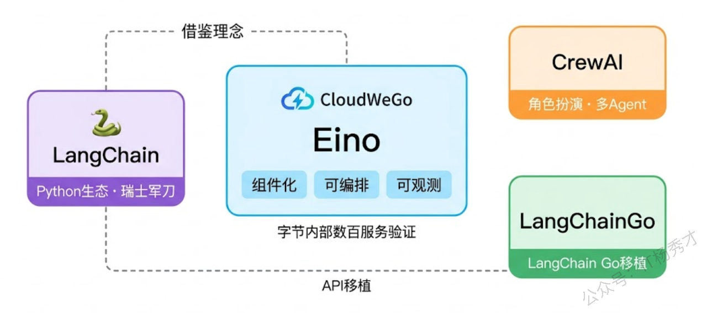
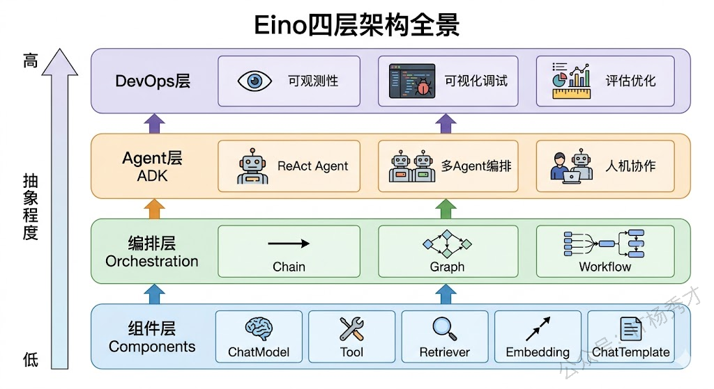
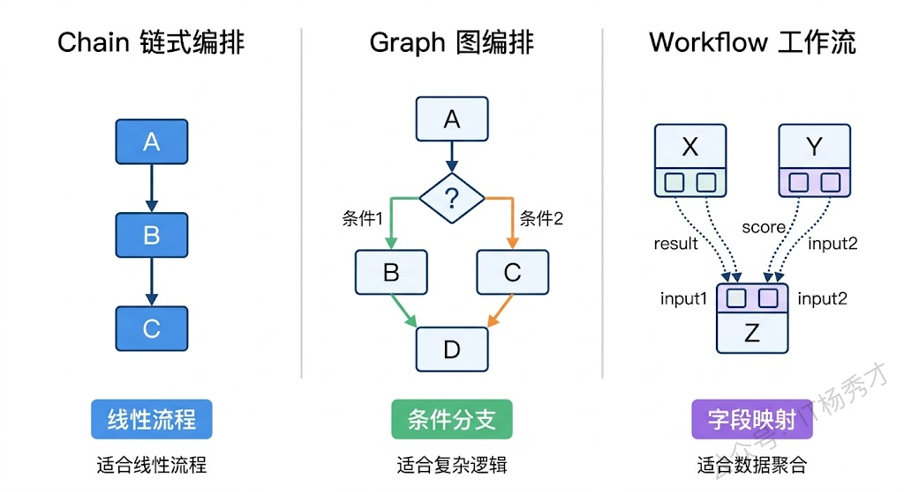

## 🌟 初识 Eino

最近在研究大模型应用开发时，发现了字节跳动开源的 Eino 框架。作为一个 Go 开发者，之前一直羡慕 Python 生态的 LangChain，但总觉得用 Go 写 LLM 应用缺少趁手的工具。Eino 的出现填补了这个空白。

Eino 背靠豆包、抖音等字节内部应用的实践经验，目标是成为 Go 生态下构建大模型应用的首选方案。它的设计理念很清晰： **组件化、可编排、可观测** 。简单说就是你可以像搭积木一样组合各种能力，用 Chain、Graph、Workflow 三种方式把组件串联起来，框架层面还帮你解决了日志和链路追踪的问题。

GitHub 仓库地址是 `github.com/cloudwego/eino`，配套的扩展库是 `github.com/cloudwego/eino-ext`。

---

## 🎭 为什么不是 LangChain 的 Go 版本

说到 LLM 应用开发框架，大家第一反应可能是 Python 圈的 LangChain。确实，LangChain 是这个领域的先行者，生态也非常成熟。但 Eino 并不是简单地把 LangChain 翻译成 Go——它借鉴了 LangChain、Google ADK 等框架的设计理念，但整个架构是按照 Go 的惯例从头设计的。

这体现在几个方面：

- **接口抽象组件**：用 Go 的接口来定义组件契约，而不是 Python 的鸭子类型
- **强类型编排**：利用 Go 的类型系统在编译期做编排校验，提前发现类型不匹配的问题
- **并行编排**：天然利用 goroutine 实现并行执行，而不是依赖 asyncio

这些都是 Go 语言本身的优势，而不是硬套 Python 的设计模式。

<div align="center">
  
</div>

---

## 🏗️ 四层架构设计

Eino 的整体架构可以拆分成四个层次，从底到顶分别是： **组件层、编排层、Agent 层、DevOps 层** 。越往上抽象程度越高，使用起来也越简单。

<div align="center">
  
</div>

### 🧩 组件层：应用的基本构成元素

Eino 应用的基础是各种功能组件，就像足球队由不同位置角色的队员组成。每个组件都有明确的职责和统一的接口定义：

| 组件名 | 组件功能 |
| --- | --- |
| ChatModel | 与大模型交互，输入 Message 上下文，得到模型的输出 Message |
| Tool | 与世界交互，根据模型的输出，执行对应的动作 |
| Retriever | 获取相关的上下文，让模型的输出基于高质量的事实 |
| ChatTemplate | 接收外界输入，转化成预设格式的 prompt 交给模型 |
| Document Loader | 加载指定的文本 |
| Document Transformer | 按照特定规则转化指定的文本 |
| Indexer | 存储文件并建立索引，供后续 Retriever 使用 |
| Embedding | Retriever 和 Indexer 的共同依赖，文本转向量，捕获文本语义 |
| Lambda | 用户定制 function |

这里的关键设计理念是 **面向接口编程**。Eino 不是把所有功能写死在框架里，而是定义好接口契约，让社区和用户自由实现。这和 Go 语言 `io.Reader`、`io.Writer` 的设计哲学一脉相承——你只要满足接口定义，框架就能帮你把一切串联起来。

#### 🤖 ChatModel 组件

这是最基础的组件，负责和大模型交互。你给它一组消息，它返回模型的回复。Eino 定义了 `model.ChatModel` 接口，不管你底层用的是通义千问、GPT 还是 Claude，只要实现了这个接口就能无缝切换。`eino-ext` 仓库里已经提供了 OpenAI 兼容接口、Ollama、Ark（字节火山方舟）等多种实现。

我在实际使用中发现这种抽象特别有用，比如开发时用 Ollama 本地调试，生产环境切换到云端的 GPT-4，只需要改一行配置，代码不用动。

#### 🔨 Tool 工具组件

Tool 是工具组件，对应 Agent 里的 Function Calling 能力。Eino 定义了 `tool.InvokableTool` 和 `tool.StreamableTool` 两个接口，前者用于普通的请求-响应式工具调用，后者用于流式输出的工具。

你可以用 `utils.NewTool` 这个辅助函数快速把一个 Go 函数包装成工具。比如我想给 AI 加个查询天气的能力，只需要写一个 `GetWeather(city string) string` 函数，然后用 `NewTool` 包装一下就行了。

#### 🔎 Retriever 检索组件

Retriever 是检索组件，主要用在 RAG（检索增强生成）场景。它负责根据查询条件从知识库中检索相关文档。Embedding 组件则负责把文本转换成向量，通常和 Retriever 配合使用。

在实际场景中，比如做一个基于公司文档的问答系统，Retriever 会先根据用户的问题检索出最相关的几段文档，然后和问题一起喂给 ChatModel，这样模型的回答就有了事实依据，不会胡编乱造。

#### 📋 ChatTemplate 提示词组件

ChatTemplate 是提示词模板组件，帮你管理复杂的 Prompt 构建逻辑，支持变量替换、消息占位符等功能。

我之前手写 Prompt 拼接时经常出错，尤其是涉及多轮对话时，消息顺序一乱就容易出问题。用 ChatTemplate 之后，把模板定义好，运行时直接填变量就行，省心多了。

---

### 🔗 编排层：把组件串联起来

有了组件之后，下一个问题就是怎么把它们串联起来。一个真实的大模型应用往往不是"调一下模型就完了"，而是需要经过 Prompt 构建 → 模型调用 → 工具执行 → 结果整合这样的多步骤流程。

在 Eino 编排场景中，每个组件成为了"节点"（Node），节点之间的流转关系成为了"边"（Edge）。Eino 提供了三种编排方式来应对不同复杂度的场景。

#### 🚂 Chain 编排

Chain 是最简单的编排方式，就是把组件像流水线一样一个接一个串起来。上一个组件的输出就是下一个组件的输入，中间没有分支也没有条件判断。

如果你的业务逻辑是线性的——比如"拼 Prompt → 调模型 → 解析结果"，用 Chain 就够了。我最开始做一个简单的问答应用时就用的 Chain，代码非常直观。

#### 🕸️ Graph 编排

Graph 是功能最强大的编排方式，它把组件当作"节点"，用"边"来定义节点之间的连接关系，支持条件分支、并行执行和循环。

你可以在图中加入 `Branch` 节点，根据上一个节点的输出决定走哪条路。比如我做过一个客服机器人，需要先判断用户问题的类型（技术问题、账号问题、投诉），然后分别走不同的处理流程，这种场景用 Graph 就很合适。

Graph 的威力在于它几乎能表达任何业务流程，而且 Eino 在 `Compile` 阶段会做完整的类型检查——如果上游节点的输出类型和下游节点的输入类型不匹配，编译时就报错，不用等到运行时才发现问题。这对我这种强类型爱好者来说简直是福音。

#### ⚙️ Workflow 编排

Workflow 和 Graph 很像，区别在于它支持"字段级别的数据映射"。Graph 里节点之间传递的是完整的数据对象，而 Workflow 允许你把上游节点输出的某个字段映射到下游节点输入的某个字段。

这在数据流比较复杂、多个节点输出需要合并成一个输入的场景下特别有用。举个例子，我可能有三个并行的分析节点，分别输出技术评分、商业评分、风险评分，然后需要把这三个分数合并成一个结构体传给下游的决策节点。用 Workflow 就能优雅地实现这种字段级的数据组装。

<div align="center">
  
</div>

---

### 🎯 Agent 层：让 AI 自主决策

编排层已经能搞定大部分流程化的需求了，但 Agent 场景有个特殊之处：Agent 的行为不是预先确定的，而是由大模型在运行时动态决策的——模型自己决定调用哪个工具、什么时候停止。

为了让 Agent 开发更简单，Eino 在编排层之上提供了一套 ADK（Agent Development Kit）。注意这里的 ADK 是 Eino 框架自带的一个模块（`github.com/cloudwego/eino/adk`），它不仅是一个工具库，更是一套完整的智能体开发体系。

ADK 的核心价值在于：

- **少写胶水代码**：统一接口与事件流，复杂任务拆解更自然
- **快速编排**：预设范式 + 工作流，分分钟搭好管线
- **更可控**：可中断、可恢复、可审计，Agent 协作过程"看得见"

#### 💭 ChatModelAgent

这是最基础的 Agent 类型，内部实现了 ReAct 模式——模型接收输入后，自行决定是否调用工具，拿到工具结果后再决定下一步，直到得出最终答案。

它的运行循环是这样的：

1. **Reason**：调用 LLM 进行推理
2. **Action**：LLM 返回工具调用请求
3. **Act**：ChatModelAgent 执行工具
4. **Observation**：将工具结果返回给 LLM，结合之前的上下文继续生成，直到模型判断不需要调用 Tool 后结束

你只需要配置模型和工具列表，Agent 的推理循环由框架自动管理。我第一次用的时候惊讶于它的简单——以前要自己写循环逻辑，现在全交给框架了。

#### 🔗 SequentialAgent

SequentialAgent 把多个 Agent 串联成一条流水线，前一个 Agent 的输出自动作为后一个 Agent 的输入。适合"分析 → 总结 → 生成报告"这种分阶段处理的场景。

它遵循以下原则：

- **线性执行**：严格按照 SubAgents 数组的顺序执行
- **运行结果传递**：每个 Agent 都能获取完整输入以及前序 Agent 的输出
- **支持提前退出**：如果任何一个子 Agent 产生退出/中断动作，整个流程会立即终止

我用它做过一个文章生成系统：第一个 Agent 负责信息收集，第二个 Agent 负责内容组织，第三个 Agent 负责润色优化。每个 Agent 专注做好一件事，整体效果比单个 Agent 好很多。

#### 🔀 ParallelAgent

ParallelAgent 让多个 Agent 同时执行，适合"从多个角度同时分析同一个问题"的场景。

它的运行原则是：

- **并发执行**：所有子 Agent 同时启动，在独立的 goroutine 中并行执行
- **共享输入**：所有子 Agent 接收相同的初始输入
- **等待与结果聚合**：内部使用 `sync.WaitGroup` 等待所有子 Agent 执行完成，收集所有结果并输出到 `AsyncIterator` 中

比如你想对一篇论文做多角度评审，可以让三个 Agent 同时从技术严谨性、创新性、可读性三个维度分析，然后汇总结果。这比串行执行快多了。

#### 🔄 LoopAgent

LoopAgent 让一个 Agent 反复执行直到满足某个退出条件，适合需要自我迭代优化的场景。

它的运行原则是：

- **循环执行**：重复执行 SubAgents 序列，每次循环都是一个完整的 Sequential 执行过程
- **运行结果累积**：每次迭代的结果都会累积，后续迭代可以访问所有历史信息
- **条件退出**：支持通过输出 `ExitAction` 事件或达到最大迭代次数来终止循环

我用它做过一个代码优化 Agent：让它生成代码 → 运行测试 → 分析错误 → 修复代码，循环往复直到所有测试通过。这种迭代优化的场景用 LoopAgent 非常合适。

这些 Agent 模式可以任意嵌套组合。比如你可以创建一个 `SequentialAgent`，第一步是一个单独的 `ChatModelAgent` 做分析，第二步是一个 `ParallelAgent` 同时从多个角度生成内容，第三步再是一个 `ChatModelAgent` 做汇总——这种灵活的组合能力是 Eino ADK 的核心优势。

---

### 🛠️ DevOps 层：调试与监控

框架好不好用，调试体验占了很大比重。Eino 的 DevOps 层提供了两个关键能力。

#### 📞 回调机制

Eino 内置了 `callbacks.HandlerBuilder`，允许你在组件执行的各个阶段注入自定义逻辑：

- **OnStart**：执行前
- **OnEnd**：执行后
- **OnError**：出错时

以及对应的流式版本。

你可以用它来记录每次模型调用的耗时和 Token 用量，追踪工具调用的输入输出，或者接入 OpenTelemetry 做分布式链路追踪。我在生产环境里用回调机制记录了所有模型调用的成本，这对成本控制非常有帮助。

#### 🎨 可视化调试

`eino-ext/devops` 模块提供了可视化开发和调试界面，让你能直观地看到 Graph 的执行流程、每个节点的输入输出、以及数据在节点间的流转情况。

这个功能对我这种视觉型学习者特别友好。刚接触 Eino 的时候，我就是先用可视化界面跑了几个示例，看着数据在节点间流动，一下子就理解了整个编排的逻辑。

---

## 🚀 快速上手

说了这么多理论，最后来个实战例子。安装 Eino 非常简单：

```bash
go get github.com/cloudwego/eino@latest
go get github.com/cloudwego/eino-ext/components/model/openai@latest
```

后续我会继续分享 Eino 的实战应用，包括如何用它构建 RAG 应用、实现 Agent 协作等。如果你也在用 Go 做 LLM 应用开发，Eino 绝对值得一试。
