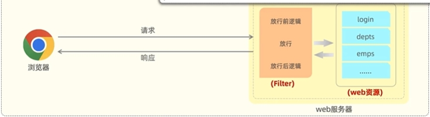

## 概述

Filter 过滤器是JavaWeb 三大组件(Servlet、Filter、Listener)之一。

**作用**：过滤器可以把对资源的请求拦截下来，从而实现一些特殊的功能。

**使用场景**：过滤器一般完成一些通用的操作，比如:登录校验、统一编码处理、敏感字符处理等。

## 具体实现

1. 定义Filter类：实现 Filter接口，并重写其所有方法。

   ```java
   @WebFilter(urlPatterns ="/*")
   public class DemoFilter implements Filter {
        //初始化方法,Web服务器启动,创建Filter时调用，只调用一次
   	public void init (Filterconfig filterconfig)throws ServletException {
          Filter.super.init(filterConfig);
       }
       ///拦截到请求时,调用该方法,可调用多次
   	public void doFilter (ServletRequest request, servletResponse response, Filterchain chain){
           System.out.println("拦截方法执行，拦截到了请求...");
           System.out.println("执行放行前的逻辑...");
       	chain.doFilter(request,response);// 放行请求
           System.out.println("执行放行后的逻辑...");
       }
       //销毁方法，服务器关闭时调用，只调用一次
       public void destroy(){
           Filter.super.destroy();
       }
   }
   ```
2. 配置Filter：使用@WebFilter注解，配置拦截资源的路径。
3. 引导类上加 @ServletComponentScan 开启Servlet组件支持。

   ```java
   @ServletComponentScan
   @SpringBootApplication
   public class TliasWebManagementApplication{public static void main(stringl] args){
   	SpringApplication.run(TliasWebManagementApplication.class, args);
   }
   ```

   


## 执行流程



1. 过滤器拦截到请求
2. 过滤器执行doFilter()之前的部分作为放行前的逻辑
3. 过滤器执行doFilter()放行请求
4. 过滤器执行doFilter()之后的部分作为放行后的逻辑



- 放行后访问对应资源，资源访问完成后，还会回到Filter中
- 回到Filter中执行放行后的逻辑



## 拦截路径

Filter 可以根据需求，配置不同的拦截资源路径

|   拦截路径   | urlPattern |            含义             |
| :----------: | :--------: | :-------------------------: |
| 拦截具体路径 |   /login   |   只有访问/login才被拦截    |
|   目录拦截   |   /emp/*   | 访问emp目录下的资源都被拦截 |
|   拦截所有   |     /*     |    访问所有资源都被拦截     |

## 过滤器链

一个web应用中，可以配置多个过滤器，这多个过滤器就形成了一个过滤器链

**顺序**：注解配置的Filter，优先级是按照过滤器类名(字符串)的自然排序