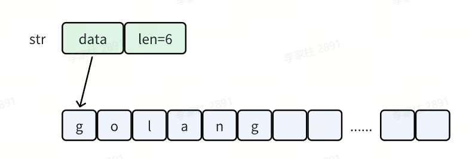

## string的特点

- string是不可变的，是一个只读的字符数组，类似于Java
- 每个字符串的长度虽然也是固定的，但是字符串的长度并不是字符串类型的一部分。
- 字符串的编码为UTF8 ，源代码中的文本字符串通常被解释为采用 UTF8 编码的 Unicode 码点（rune）序列。因此字符串可以包含任意的数据

## 底层原理

string在Go中的源码如下，本质上是一个结构体

```Go
type StringHeader struct {
    Data uintptr
    Len  int
}
```



## 常见操作

- **`len(var string)`** ：输出字符串的长度
- strings包下的操作
  - **`strings.Contains(var string1，var string2)`** ：子串1是否包含子串2
  - **`strings.Count(var1 string,var1 string`** ：子串1包含子串2的计数
  - **`strings.Split(var1 string, var2 string)`** ：用子串2分割子串1
  - **`strings.HasPrefix(var1 string,var2 string)`** ：是否以子串2作为前缀
  - **`strings.HasSuffix(var1 string,var2 string)`** ：是否以子串2作为前缀
  - **`strings.Index(var1 string,var2 string2)`** ： 查找子串的位置
  - **`strings.Repeat(var1 string, var int)`** ：重复打印
  - **`strings.Replace(var1 string, var2 string, var2 string, var int))`** ：子串替换
  - 大小写转换
    - **`strings.ToLower("GO")    // go`**
    - **`strings.ToUpper("java")   // JAVA`**
  - **`strings.Trim("#hello #go#", "#"))`**  ：去除两头的特殊字符
  - 字符串拼接
    - 性能要求不高，平时一般采用 **`fmt.Sprinf`** ：
    - 性能要求高的场景使用 **`string.Builder`** 的 **`WriteString`** 方法进行拼接，然后使用 **`builder.String()`** 得到拼接后的字符串
