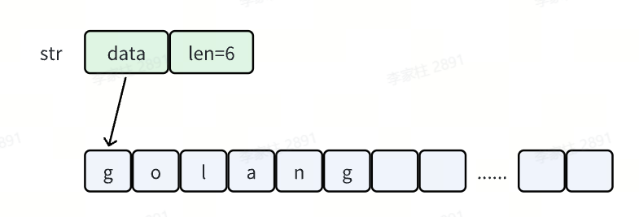
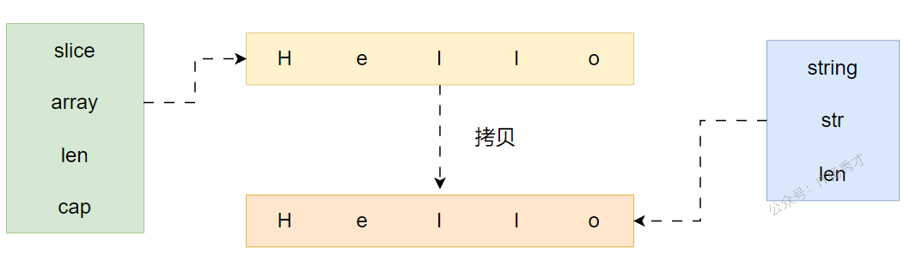
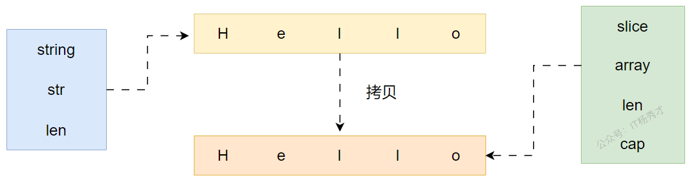

## 📝 string的特点

- **string是不可变的**，是一个只读的字符数组，类似于 Java
- 每个字符串的长度虽然也是固定的，但是字符串的长度并不是字符串类型的一部分
- 字符串的编码为 **UTF-8**，源代码中的文本字符串通常被解释为采用 UTF-8 编码的 Unicode 码点（rune）序列，因此字符串可以包含任意的数据

---

## 🔧 底层原理

### 📋 string 的本质

在 Go 语言中，字符串其实就是一串由 **UTF-8** 编码的字符序列。让我们看一下官方库对 `string` 的描述：

```go
// string is the set of all strings of 8-bit bytes, conventionally but not
// necessarily representing UTF-8-encoded text. A string may be empty, but
// not nil. Values of string type are immutable.
type string string
```

从源码注释可以理解：
- 字符串是所有 **8bit** 字节的集合，但不一定是 **UTF-8** 编码的文本
- 字符串可以为 **empty**，但不能为 **nil**，empty 字符串就是一个没有任何字符的空串 `""`
- 字符串不可以被修改，所以字符串类型的值是**不可变**的

### 🏗️ string 的数据结构

string 在 Go 中的源码如下，本质上是一个结构体：

```go
type StringHeader struct {
    Data uintptr
    Len  int
}
```

在 `src/runtime/string.go` 文件中，还定义了 `stringStruct` 结构：

```go
type stringStruct struct {
    str unsafe.Pointer
    len int
}
```

这两个结构体字段含义：
- **Data/str**：指向底层字符数组的首地址
- **Len/len**：表示字符串的长度（字节数）

<div align="center">
  
</div>

**重要说明**：
- `StringHeader` 是字符串在反射包中的表现
- `stringStruct` 是字符串在运行时状态下的表现
- `Len` 字段存储的是实际的**字节数**，而不是字符数，所以对于非单字节编码的字符，其结果可能多于字符个数

### 🔄 字符串的创建过程

当我们创建一个 `string` 的时候，可以理解为有两步：

1. 根据给定的字符创建出 `stringStruct` 结构
2. 将 `stringStruct` 结构转化为 `string` 类型

通过观察字符串的结构定义我们可以发现，其定义中并没有一个表示容量（Cap）的字段，所以意味着字符串类型并不能被扩容，字符串上的写操作包括拼接、追加等等都是通过**拷贝**来实现的。

### 🎯 string 修改 vs 重新赋值

前面我们说了，`string` 是只读的，不可以被改变，但是我们在编码过程中，进行重新赋值也是很正常的，既然可以重新赋值，为什么说不能被修改呢，这不是互相矛盾吗？

这里要弄清楚一个概念：**字符串修改并不等于重新赋值**。

```go
str := "Hello"
str = "Golang"   // 重新赋值，允许
str[0] = "I"     // 修改，不允许
```

示例：

```go
package main

import "fmt"

func main() {
   var ss string
   ss = "Hello"
   ss[1] = "A"  // 编译错误
   fmt.Println(ss)
}
```

运行结果：

```
./main.go:10:12: cannot assign to ss[1]
```

程序会报错，提示 `string` 是不可修改的。

---

## 🛠️ 常见操作

### 📏 获取字符串长度

- **`len(str)`**：输出字符串的长度（字节数）

### 📦 strings 包常用操作

| 方法 | 功能说明 |
|------|----------|
| **`strings.Contains(s, substr)`** | 判断字符串 s 是否包含子串 substr |
| **`strings.Count(s, substr)`** | 统计子串 substr 在 s 中出现的次数 |
| **`strings.Split(s, sep)`** | 使用分隔符 sep 分割字符串 s |
| **`strings.HasPrefix(s, prefix)`** | 判断 s 是否以 prefix 开头 |
| **`strings.HasSuffix(s, suffix)`** | 判断 s 是否以 suffix 结尾 |
| **`strings.Index(s, substr)`** | 查找子串 substr 在 s 中首次出现的位置 |
| **`strings.Repeat(s, count)`** | 将字符串 s 重复 count 次 |
| **`strings.Replace(s, old, new, n)`** | 将 s 中的 old 替换为 new，最多替换 n 次 |

### 🔤 大小写转换

- **`strings.ToLower("GO")`** → `go`
- **`strings.ToUpper("java")`** → `JAVA`

### ✂️ 去除字符

- **`strings.Trim("#hello #go#", "#")`**：去除字符串两端的指定字符

### 🔄 字符数组转换

string 可以被转换为 **`[]byte`** 和 **`[]rune`**：

- **`[]byte`**：适合处理 ASCII 字符
- **`[]rune`**：适合处理包含中文、emoji 等多字节字符

### 🔍 访问字符

- **`s[i]`**：直接访问底层字符数组的第 i 个 **byte**

### 📝 字符串声明方式

Go 语言中以字面量来声明字符串有两种方式，**双引号**和**反引号**：

```go
str1 := "Hello World"
str2 := `Hello
Golang`
```

#### 🗨️ 双引号声明

使用双引号声明的字符串和其他语言中的字符串没有太多的区别，但是这种使用双引号的字符串只能用于单行字符串的初始化，当字符串里使用到一些特殊字符，比如双引号、换行符等等需要用 `\` 进行转义。

#### 📎 反引号声明

反引号声明的字符串没有这些限制，字符内容即为字符串里的原始内容，所以一般用反引号来声明比较复杂的字符串，比如 **JSON 串**。

```go
json := `{"hello": "golang", "name": ["zhangsan"]}`
```

**使用场景对比**：
- **双引号**：适合简单的单行字符串，需要转义特殊字符
- **反引号**：适合多行字符串、JSON、正则表达式等复杂字符串，无需转义

---

## 🔄 string 与 []byte 的转换原理

### 📖 转换语法

既然 `string` 是不可修改的，那可不可以将字符串转化为字节数组，然后通过下标修改字节数组，再转化回字符串呢？答案是可行的。

```go
package main

import "fmt"

func main() {
   var ss string
   ss = "Hello"
   strByte := []byte(ss)
   strByte[1] = 65
   fmt.Println(string(strByte))
}
```

运行结果：

```
HAllo
```

`Hello` 变成了 `HAllo`，好像达到了我们的目的。这里需要注意，虽然这种方式看似可行，修改了字符串 `Hello`，但其实并不是我们所见的这样。最终得到的只是 `ss` 字符串的一个**拷贝**，源字符串并没有变化。

### 🧬 转换底层原理

`string` 与 `[]byte` 的转换其实会发生一次**内存拷贝**，并申请一块新的切片内存空间。

#### []byte 转 string

`byte` 切片转化为 `string`，大致过程分为三步：

1. 新申请切片内存空间，构建内存地址为 `addr`，长度为 `len`
2. 构建 `string` 对象，指针地址为 `addr`，`len` 字段赋值为 `len`（`string.str = addr；string.len = len；`）
3. 将原切片中数据拷贝到新申请的 `string` 中指针指向的内存空间

<div align="center">
  
</div>

#### 🔁 string 转 []byte

`string` 转化为 `byte` 数组同样简单，大致分为两步：

1. 新申请切片内存空间
2. 将 `string` 中指针执行内存区域的内容拷贝到新切片

<div align="center">
  
</div>

### ⚡ 转换优化场景

很多场景中会用到 `[]byte` 转化为 `string`，但是并不是每一次转化，都会像上述过程一样，发生一次内存拷贝。在什么情况下不会发生拷贝呢？

转化为的字符串被用于**临时场景**，举几个例子：

1. **字符串比较**：`string(ss) == "Hello"`
2. **字符串拼接**：`"Hello" + string(ss) + "world"`
3. **用作查找**：比如 `map` 的 `key`，`val := map[string(ss)]`

这几种情况下，`[]byte` 转化成的字符串并不会被后面程序用到，只是在当前场景下被临时用到，所以并不会拷贝内存，而是直接返回一个 `string`，这个 `string` 的指针（`string.str`）指向切片的内存。

---

## 🔗 字符串拼接

在 Go 语言中，字符串拼接有多种方式，不同方式的性能差异很大。

### 📊 五种拼接方式对比

#### ➕ 使用 `+` 运算符

```go
s1 := "Hello"
s2 := "World"
result := s1 + " " + s2
```

**特点**：
- 使用简单，直观易懂
- **性能最差**：每次拼接都会创建新的字符串，涉及内存分配和拷贝
- 不适合大量字符串拼接场景

---

#### 🧾 使用 `fmt.Sprintf`

```go
name := "Go"
version := 1.18
result := fmt.Sprintf("Language: %s, Version: %.2f", name, version)
```

**特点**：
- 支持格式化输出，灵活性高
- **性能一般**：需要解析格式字符串，有额外开销
- 适合需要格式化输出的场景

---

#### 🏗️ 使用 `strings.Builder`（推荐）

```go
var builder strings.Builder
builder.WriteString("Hello")
builder.WriteString(" ")
builder.WriteString("World")
result := builder.String()
```

**核心方法**：
- **`WriteString(str string)`**：添加字符串
- **`WriteRune(r rune)`**：添加单个 Unicode 字符
- **`WriteByte(b byte)`**：添加单个字节
- **`Grow(n int)`**：预分配 n 字节的内存空间

**特点**：
- **性能最好**：预分配内存，避免重复分配和拷贝
- 专门用于字符串拼接场景
- **推荐使用**在性能敏感的场景

**性能优化技巧**：
```go
var builder strings.Builder
// 预分配内存，避免动态扩容
builder.Grow(100)  
builder.WriteString("预先知道大概长度时，使用Grow预分配内存")
result := builder.String()
```

---

#### 🪣 使用 `bytes.Buffer`

```go
var buffer bytes.Buffer
buffer.WriteString("Hello")
buffer.WriteString(" ")
buffer.WriteString("World")
result := buffer.String()
```

**特点**：
- 功能与 `strings.Builder` 类似
- **性能稍差**：有额外的接口开销
- 如果需要同时处理字节和字符串，可以使用

---

#### 🧱 使用 `[]byte` 切片

```go
var buf []byte
buf = append(buf, "Hello"...)
buf = append(buf, ' ')
buf = append(buf, "World"...)
result := string(buf)
```

**特点**：
- **性能较好**：直接操作字节切片
- 需要手动管理内存
- 适合对性能有极高要求的场景

---

### ⚡ 性能对比总结

| 拼接方式 | 性能 | 适用场景 |
|----------|------|----------|
| `+` 运算符 | ⭐ | 少量字符串拼接，简单场景 |
| `fmt.Sprintf` | ⭐⭐ | 需要格式化输出的场景 |
| `strings.Builder` | ⭐⭐⭐⭐⭐ | **大量字符串拼接，性能敏感场景** |
| `bytes.Buffer` | ⭐⭐⭐⭐ | 需要同时处理字节和字符串 |
| `[]byte` | ⭐⭐⭐⭐ | 对性能有极高要求，手动管理内存 |

### 💡 最佳实践建议

1. **简单拼接**：少量字符串（2-3个）直接使用 `+` 即可
2. **循环拼接**：在循环中拼接字符串时，**必须使用** `strings.Builder`
3. **预分配内存**：如果知道最终字符串的大致长度，使用 `Grow()` 预分配内存
4. **格式化输出**：需要格式化时使用 `fmt.Sprintf`，否则优先使用 `strings.Builder`

### 🧪 性能测试详解

#### 🧪 测试代码

采用 `testing` 包下的 `benchmark` 测试其性能：

```go
package main

import (
    "bytes"
    "fmt"
    "strings"
    "testing"
)

var loremIpsum = `
Lorem ipsum dolor sit amet, consectetur adipiscing elit. Maecenas non odio eget quam gravida laoreet vitae id est. Cras sit amet porta dui. Pellentesque at pulvinar ante. Pellentesque leo dolor, tristique a diam vel, posuere rhoncus ex. Mauris gravida, orci eu molestie pharetra, mi nibh bibendum arcu, in bibendum augue neque ac nulla. Phasellus consectetur turpis et neque tincidunt molestie. Vestibulum diam quam, sodales quis nulla eget, volutpat euismod mauris.
`

var strSlice = make([]string, LIMIT)

const LIMIT = 1000

func init() {
    for i := 0; i < LIMIT; i++ {
       strSlice[i] = loremIpsum
    }
}

func BenchmarkConcatenationOperator(b *testing.B) {
    for i := 0; i < b.N; i++ {
       var q string
       for _, v := range strSlice {
          q = q + v
       }
    }
    b.ReportAllocs()
}

func BenchmarkFmtSprint(b *testing.B) {
    for i := 0; i < b.N; i++ {
       var q string
       for _, v := range strSlice {
          q = fmt.Sprint(q, v)
       }
    }
    b.ReportAllocs()
}

func BenchmarkBytesBuffer(b *testing.B) {
    for i := 0; i < b.N; i++ {
       var q bytes.Buffer

       q.Grow(len(loremIpsum) * len(strSlice))

       for _, v := range strSlice {
          q.WriteString(v)
       }
       _ = q.String()
    }
    b.ReportAllocs()
}

func BenchmarkStringBuilder(b *testing.B) {
    for i := 0; i < b.N; i++ {
       var q strings.Builder

       q.Grow(len(loremIpsum) * len(strSlice))

       for _, v := range strSlice {
          q.WriteString(v)
       }
       _ = q.String()
    }
    b.ReportAllocs()
}

func BenchmarkAppend(b *testing.B) {
    for i := 0; i < b.N; i++ {
       var q []byte
       for _, v := range strSlice {
          q = append(q, v...)
       }
       _ = string(q)
    }
    b.ReportAllocs()
}

func BenchmarkJoin(b *testing.B) {
    for i := 0; i < b.N; i++ {
       var q string
       q = strings.Join(strSlice, "")
       _ = q
    }
    b.ReportAllocs()
}
```

#### 📊 测试结果

```
goos: windows
goarch: amd64
pkg: gostudy/test
cpu: AMD Ryzen 7 7745HX with Radeon Graphics
BenchmarkConcatenationOperator
BenchmarkConcatenationOperator-16             54          18706593 ns/op
        238063081 B/op      1010 allocs/op
BenchmarkFmtSprint
BenchmarkFmtSprint-16                         24          63046967 ns/op
        488318771 B/op      4275 allocs/op
BenchmarkBytesBuffer
BenchmarkBytesBuffer-16                    15199             74857 ns/op
          950280 B/op          2 allocs/op
BenchmarkStringBuilder
BenchmarkStringBuilder-16                  30217             37815 ns/op
          475140 B/op          1 allocs/op
BenchmarkAppend
BenchmarkAppend-16                          5632            307936 ns/op
         3011173 B/op         24 allocs/op
BenchmarkJoin
BenchmarkJoin-16                           32806             42271 ns/op
          475140 B/op          1 allocs/op
PASS
```

可以看到，采用 `fmt.Sprintf` 拼接字符串性能是最差的，性能最好的方式是 `strings.Builder` 和 `strings.Join`。

#### 🔬 性能原理分析

| 方法 | 说明 |
| --- | --- |
| **+** | `+` 拼接 2 个字符串时，会生成一个新的字符串，开辟一段新的内存空间，新空间的大小是原来两个字符串的大小之和，所以每拼接一次就要开辟一段空间，性能很差 |
| **fmt.Sprintf** | `Sprintf` 会从临时对象池中获取一个对象，然后格式化操作，最后转化为 string，释放对象，实现很复杂，性能也很差 |
| **strings.Builder** | 底层存储使用 `[]byte`，转化为字符串时可复用，每次分配内存的时候，支持预分配内存并且自动扩容，所以总体来说，开辟内存的次数就少，性能最好 |
| **bytes.Buffer** | 底层存储使用 `[]byte`，转化为字符串时不可复用，底层实现和 `strings.Builder` 差不多，性能比 `strings.Builder` 略差一点，区别是 `bytes.Buffer` 转化为字符串时重新申请了一块空间，存放生成的字符串变量，而 `strings.Builder` 直接将底层的 `[]byte` 转换成了字符串类型返回了回来，性能仅次于 `strings.Builder` |
| **append** | 直接使用 `[]byte` 扩容机制，可复用，支持预分配内存和自动扩容，性能只比 `+` 和 `Sprintf` 好，但是如果能提前分配好内存的话，性能将会仅次于 `strings.Builder` |
| **strings.Join** | `strings.Join` 的性能约等于 `strings.Builder`，在已知字符串 slice 的时候可以使用，未知时不建议使用，构造切片也是会有性能损耗的 |

#### 📌 性能对比总结

> **性能对比**：`strings.Builder` ≈ `strings.Join` > `bytes.Buffer` > `append` > `+` > `fmt.Sprintf`

**使用建议**：
- 如果进行少量的字符串拼接时，直接使用 `+` 操作符是最方便也算是性能最高的，就无需使用 `strings.Builder`
- 如果进行大量的字符串拼接时，使用 `strings.Builder` 是最佳选择

---

## 🤔 为什么这么设计

可能大家都会考虑到，为什么一个普通的字符串要设计这么复杂，还需要使用指针。暂时没找到官方文档的说明。

个人猜想，当遇到一个非常长的字符时，这样做使得 `string` 变得非常轻量，可以很方便的进行传递而不用担心内存拷贝。虽然在 Go 中，不管是引用类型还是值类型参数传递都是值传递，但指针明显比值传递更节省内存。

---

## 📚 总结

### 🎯 核心要点

- string 是**不可变**的只读字符数组，采用 **UTF-8** 编码
- 底层通过 `StringHeader` 结构体实现，包含数据指针和长度
- 字符串操作主要使用 **`strings`** 包提供的丰富 API
- 字符串拼接优先使用 **`strings.Builder`**，在性能敏感场景下预分配内存

### 🧠 关键原理

- **底层结构**：`string` 本质是一个结构体，包含指向字节数组的指针和长度
- **不可变性**：字符串不能被修改，所有操作都是通过拷贝实现
- **转换开销**：`string` 与 `[]byte` 转换会发生内存拷贝，但在临时场景下会优化
- **性能选择**：根据场景选择合适的拼接方式，大量拼接使用 `strings.Builder`

### ✅ 最佳实践

1. **少量拼接**：使用 `+` 操作符
2. **大量拼接**：使用 `strings.Builder` 并预分配内存
3. **格式化输出**：使用 `fmt.Sprintf`
4. **复杂字符串**：使用反引号声明，避免转义
5. **性能敏感**：注意转换开销，利用临时场景优化
