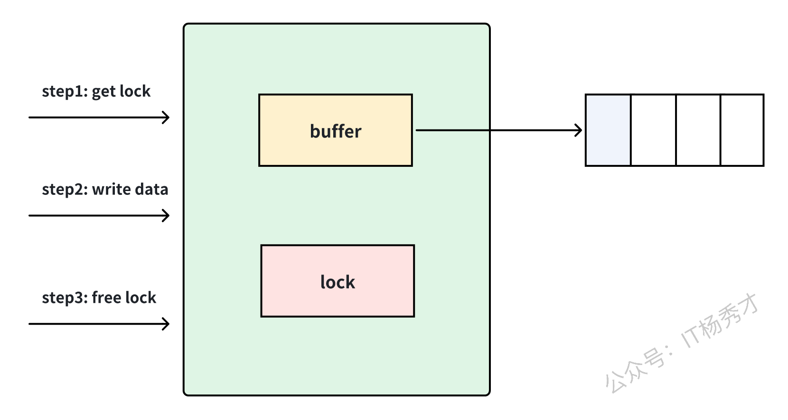
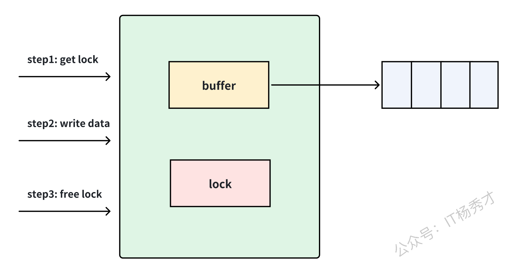
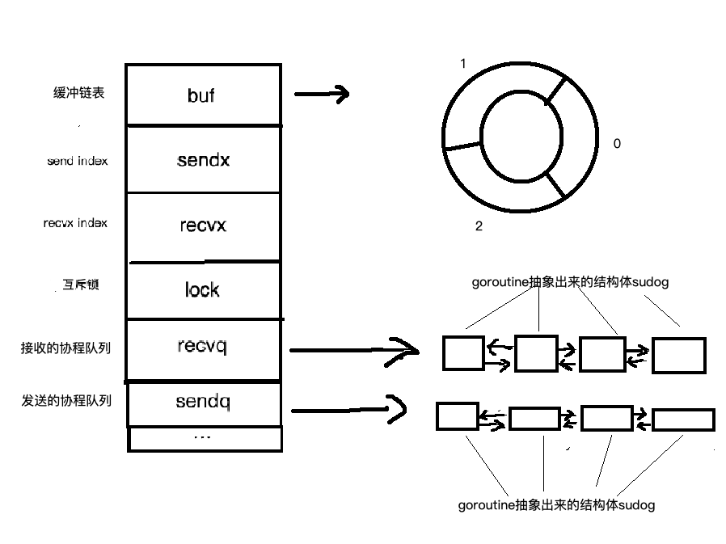
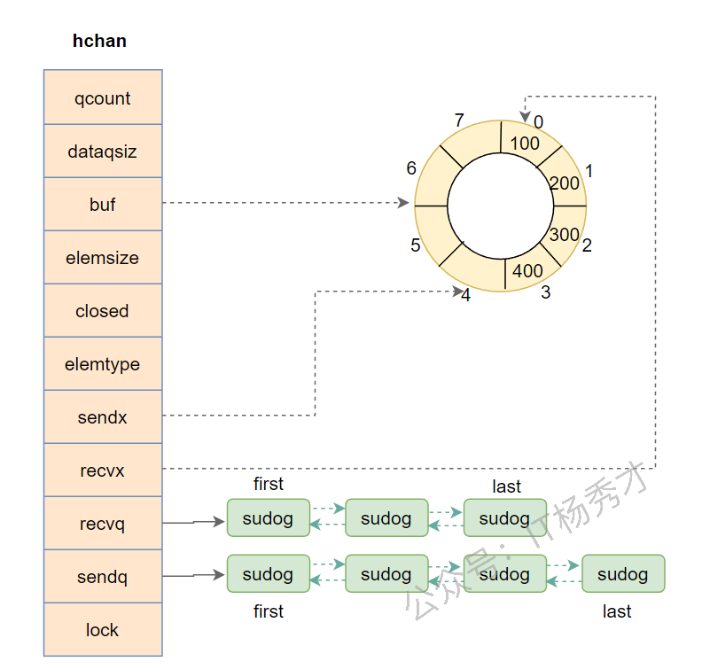
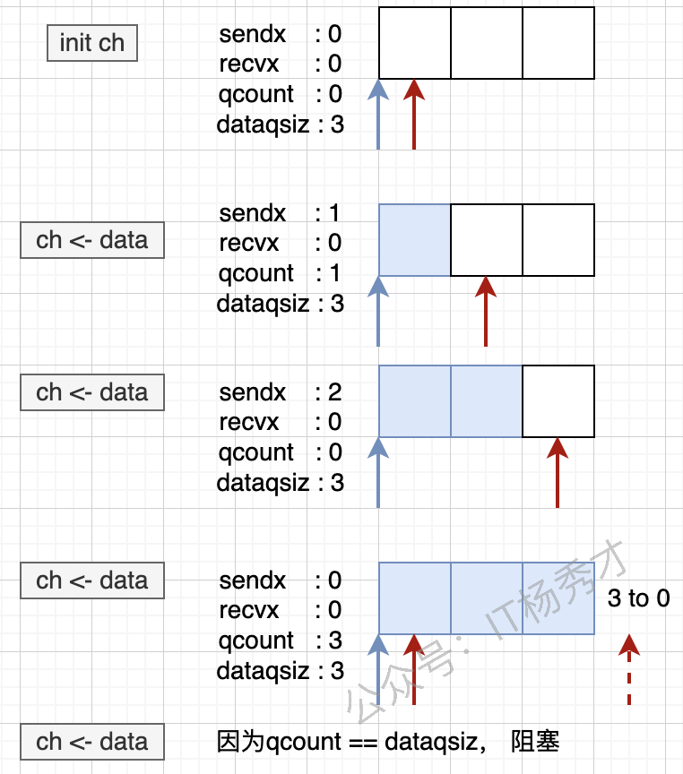
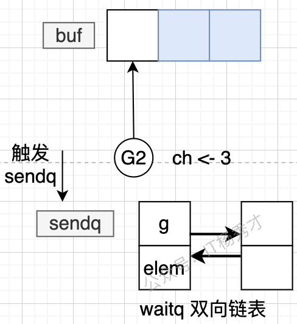
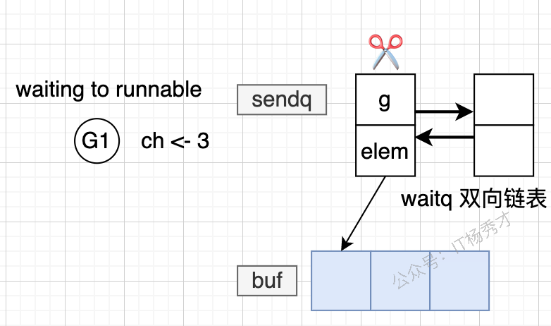
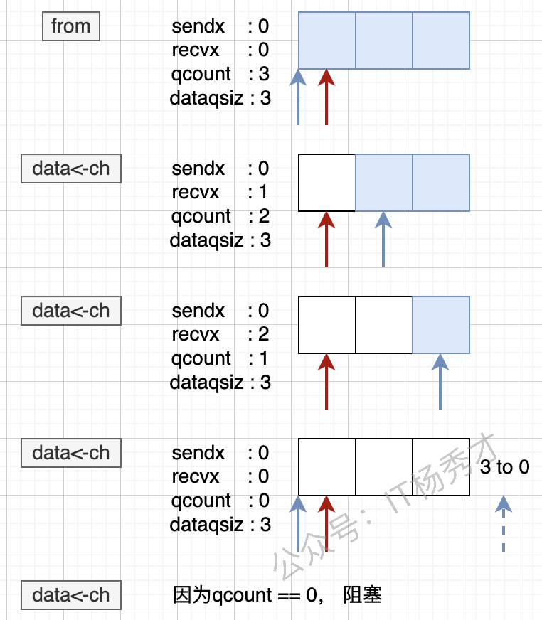

## 🧠 前言

可以通过 `go` 关键字开启一个 `goroutine`，让不同任务并发执行。但仅有并发还不够，真正困难的是让多个 `goroutine` 之间安全地交换数据、协调执行顺序，而这正是 **`Channel`** 的价值所在。

Go 语言强调的核心理念是：**不要通过共享内存来通信，而要通过通信来共享内存**。`Channel` 就是这一理念最直接的体现，它让 `goroutine` 之间的数据传递、同步与协作变得清晰、自然且安全。

---

## 📡 Channel 是什么

Go 官方对 `Channel` 的定义是：

> Channels are a typed conduit through which you can send and receive values with the channel operator.

可以把 **`Channel`** 理解为一个带类型的通信管道。发送方通过它写入数据，接收方通过它读取数据，`goroutine` 之间借此完成通信。

`Channel` 的几个关键特征如下：

- **带类型**：`chan int`、`chan string`、`chan User` 都只能传递对应类型的数据。
- **可同步**：无缓冲 `Channel` 天生具备同步语义。
- **可缓冲**：有缓冲 `Channel` 可以在一定程度上解耦发送方和接收方。
- **并发安全**：多个 `goroutine` 可以同时操作同一个 `Channel`。

### 🧩 Channel 与 CSP

`Channel` 背后对应的是 Go 一直强调的 **CSP（Communicating Sequential Processes）** 思想，也就是“通过通信共享内存，而不是通过共享内存来通信”。

从这个角度看，`goroutine` 更像独立执行的顺序进程，而 `Channel` 则是它们之间传递消息和同步状态的通信通道。这样设计有几个很直接的好处：

- **避免直接共享内存**：不同协程尽量不直接改同一份状态，减少竞态条件。
- **天然带同步语义**：发送和接收本身就能形成协作点，很多场景下不必再手动加锁。
- **更容易组合并发模式**：像生产者消费者、管道、超时控制、取消传播，都可以围绕 `Channel` 组合出来。

---

## ⚙️ Channel 的实现位置

`Channel` 完全由 Go 运行时在**用户态**实现，这是 Go 并发模型高效的重要原因之一。

### ✨ 用户态实现的优势

- **避免内核态切换**：`Channel` 操作本身不依赖系统调用。
- **调度成本更低**：阻塞和唤醒由 Go 调度器完成。
- **通信更轻量**：相比内核级管道、`socket` 等机制开销更小。
- **缓冲区在堆上**：底层缓冲区由 Go 运行时分配和管理。

### 🚀 性能意义

由于 `Channel` 的阻塞、唤醒、排队、数据拷贝等逻辑都在运行时内部完成，所以 Go 能用更低成本支撑大量协程并发执行。

---

## ⚖️ 有缓冲 Channel 与无缓冲 Channel

`Channel` 主要分为两类：**无缓冲 `Channel`** 和 **有缓冲 `Channel`**。

### 🔒 无缓冲 Channel

无缓冲 `Channel` 可以理解为**同步通信**。发送方写入数据时，如果没有接收方准备好，就会立刻阻塞；接收方读取数据时，如果没有发送方，也会阻塞。

### 📦 有缓冲 Channel

有缓冲 `Channel` 可以理解为**异步通信**。只要缓冲区未满，发送方就可以继续写入，而不必马上等待接收方读取。

先看正常写入时的状态：

<div align="center">
  
</div>

当缓冲区被写满之后，发送方同样会阻塞：

<div align="center">
  
</div>

因此，有缓冲 `Channel` 只是把阻塞点后移，而不是完全消除阻塞。

---

## 🔍 Channel 底层原理

### 🧱 底层数据结构

`Channel` 在 Go 运行时中由 `runtime.hchan` 表示。调用 `make(chan T, size)` 时，运行时会在堆上分配一个 `hchan` 结构，并返回对它的引用，因此 `Channel` 本质上是**引用类型**。

之所以分配在堆上，而不是栈上，是因为 `Channel` 通常需要在多个 `goroutine` 之间共享，其生命周期往往超过某一个函数调用栈的范围。

先看整体结构示意图：

<div align="center">
  
</div>

`hchan` 的定义如下：

```go
type hchan struct {
   qcount   uint           // 循环队列中的数据总数
   dataqsiz uint           // 循环队列大小
   buf      unsafe.Pointer // 指向循环队列的指针
   elemsize uint16         // 每个元素的大小
   closed   uint32         // 标记 channel 是否关闭
   elemtype *_type         // 元素类型
   sendx    uint           // 发送索引
   recvx    uint           // 接收索引
   recvq    waitq          // 等待接收的 sudog 队列
   sendq    waitq          // 等待发送的 sudog 队列
   lock     mutex          // 互斥锁
}
```

### 📋 关键字段说明

- **`qcount`**：当前缓冲区中已有的元素数量。
- **`dataqsiz`**：缓冲区容量，无缓冲 `Channel` 该值为 `0`。
- **`buf`**：指向底层环形缓冲区。
- **`elemsize`**：单个元素的大小。
- **`closed`**：标识 `Channel` 是否已关闭。
- **`elemtype`**：元素类型信息，供运行时和 GC 使用。
- **`sendx` / `recvx`**：环形队列中的写入索引和读取索引。
- **`sendq` / `recvq`**：保存阻塞发送者和阻塞接收者。
- **`lock`**：保证并发操作安全。

### 🧩 等待队列与 `sudog`

阻塞中的 `goroutine` 不会直接挂在 `Channel` 上，而是会被封装成 `sudog` 节点，再进入 `sendq` 或 `recvq` 等待队列。

`waitq` 的结构如下：

```go
type waitq struct {
    first *sudog
    last  *sudog
}
```

`sudog` 的核心结构如下：

```go
type sudog struct {
   g *g
   next *sudog
   prev *sudog
   elem unsafe.Pointer
   acquiretime int64
   releasetime int64
   ticket      uint32
   isSelect    bool
   success     bool
   parent   *sudog
   waitlink *sudog
   waittail *sudog
   c        *hchan
}
```

这里最关键的字段是 `elem`：

- **发送时**：`elem` 指向待发送的数据。
- **接收时**：`elem` 指向接收结果写入的位置。

再看一张更直观的结构示意图：

<div align="center">
  
</div>

在这张图里，缓冲区容量是 `8`，当前已有 `4` 个元素，因此 `sendx` 指向下一个写入位置，`recvx` 指向下一个读取位置。

### 🔐 线程安全性

`Channel` 是多 `goroutine` 并发安全的，核心依赖于 `hchan` 中的 `lock`。

#### 🔒 锁保护机制

- **发送操作**：进入发送逻辑前先加锁，完成后解锁。
- **接收操作**：进入接收逻辑前先加锁，完成后解锁。
- **关闭操作**：修改 `closed` 状态前先加锁，处理完成后解锁。

#### 📌 等待队列保护

- **`sendq`**：保证发送者阻塞与唤醒顺序安全。
- **`recvq`**：保证接收者阻塞与唤醒顺序安全。
- **缓冲区**：通过锁保护 `buf`、`sendx`、`recvx` 和 `qcount`，避免并发写乱序。

---

## 🔧 Channel 基础操作

### 📝 声明与初始化

先声明，再通过 `make` 初始化：

```go
var channelName chan int
var channelArray [3]chan int
```

此时 `channelName` 的值是 `nil`，还不能直接使用，需要进一步初始化：

```go
ch1 := make(chan int)
ch2 := make(chan int, 3)
```

- **`make(chan int)`**：创建无缓冲 `Channel`。
- **`make(chan int, 3)`**：创建容量为 `3` 的有缓冲 `Channel`。

### 📤 发送数据

```go
ch <- v
```

### 📥 读取数据

最常见的读取方式如下：

```go
v := <-ch
```

### 🔍 判定读取

当我们需要区分“读到的是零值”还是“`Channel` 已关闭”时，可以使用 `ok` 判断：

```go
package main

import (
    "fmt"
    "time"
)

func main() {
    ch := make(chan int, 5)
    ch <- 1
    close(ch)

    go func() {
        for i := 0; i < 5; i++ {
            v, ok := <-ch
            if ok {
                fmt.Printf("v=%d\n", v)
            } else {
                fmt.Printf("channel 数据已读完，v=%d\n", v)
            }
        }
    }()

    time.Sleep(2 * time.Second)
}
```

**运行结果**：

```text
v=1
channel 数据已读完，v=0
channel 数据已读完，v=0
channel 数据已读完，v=0
channel 数据已读完，v=0
```

当 `ok` 为 `true` 时，表示本次确实读到了有效数据；当 `ok` 为 `false` 时，表示 `Channel` 已关闭且数据已经读空。

### 🔁 `for range` 读取

如果我们不确定要读取多少次，而是希望“只要有数据就继续读，直到发送方关闭 `Channel`”，那么 `for range` 是最自然的写法：

```go
package main

import (
    "fmt"
    "time"
)

func main() {
    ch := make(chan int, 5)
    ch <- 1
    ch <- 2
    close(ch)

    go func() {
        for v := range ch {
            fmt.Printf("v=%d\n", v)
        }
    }()

    time.Sleep(2 * time.Second)
}
```

**运行结果**：

```text
v=1
v=2
```

### 🔒 关闭管道

```go
close(ch)
```

关闭 `Channel` 后，接收方仍然可以继续读取已经存在于缓冲区中的数据；只有在数据全部读空之后，后续读取才会得到零值。

```go
package main

import (
    "fmt"
    "time"
)

func main() {
    ch := make(chan int, 5)
    ch <- 1
    close(ch)

    go func() {
        for i := 0; i < 5; i++ {
            v := <-ch
            fmt.Printf("v=%d\n", v)
        }
    }()

    time.Sleep(2 * time.Second)
}
```

**运行结果**：

```text
v=1
v=0
v=0
v=0
v=0
```

---

## 🏗️ Channel 操作的底层原理

### 🧱 运行时初始化

业务代码调用的是 `make(chan T, size)`，真正完成初始化的是 `runtime.makechan`。

```go
func makechan(t *chantype, size int) *hchan {
    elem := t.elem
    mem, overflow := math.MulUintptr(elem.size, uintptr(size))
    if overflow || mem > maxAlloc-hchanSize || size < 0 {
        panic(plainError("makechan: size out of range"))
    }

    var c *hchan
    switch {
    case mem == 0:
        c = (*hchan)(mallocgc(hchanSize, nil, true))
        c.buf = c.raceaddr()
    case elem.ptrdata == 0:
        c = (*hchan)(mallocgc(hchanSize+mem, nil, true))
        c.buf = add(unsafe.Pointer(c), hchanSize)
    default:
        c = new(hchan)
        c.buf = mallocgc(mem, elem, true)
    }

    c.elemsize = uint16(elem.size)
    c.elemtype = elem
    c.dataqsiz = uint(size)
    lockInit(&c.lock, lockRankHchan)
    return c
}
```

这里最值得关注的是三种分配策略：

- **无缓冲 `Channel`**：只分配 `hchan` 本身。
- **有缓冲且元素不含指针**：`hchan` 与缓冲区连续分配。
- **有缓冲且元素含指针**：`hchan` 与缓冲区分开分配，便于 GC 处理。

### 📤 Channel 发送流程

发送操作最终会进入 `runtime.chansend`：

```go
func chansend(c *hchan, ep unsafe.Pointer, block bool, callerpc uintptr) bool {
    if c == nil {
        if !block {
            return false
        }
        gopark(nil, nil, waitReasonChanSendNilChan, traceEvGoStop, 2)
        throw("unreachable")
    }

    lock(&c.lock)
    if c.closed != 0 {
        unlock(&c.lock)
        panic(plainError("send on closed channel"))
    }

    if sg := c.recvq.dequeue(); sg != nil {
        send(c, sg, ep, func() { unlock(&c.lock) }, 3)
        return true
    }

    if c.qcount < c.dataqsiz {
        qp := chanbuf(c, c.sendx)
        typedmemmove(c.elemtype, qp, ep)
        c.sendx++
        if c.sendx == c.dataqsiz {
            c.sendx = 0
        }
        c.qcount++
        unlock(&c.lock)
        return true
    }

    if !block {
        unlock(&c.lock)
        return false
    }

    // 构造 sudog，加入 sendq，挂起当前 goroutine
    ...
}
```

发送流程可以概括为三条路径：

1. **直接发送**：如果已有接收者在 `recvq` 等待，数据直接交给接收方。
2. **缓冲发送**：如果缓冲区未满，数据写入 `buf`。
3. **阻塞发送**：如果没有接收者且缓冲区已满，发送方进入 `sendq` 等待。

先看整体发送路径：

<div align="center">
  
</div>

当发送方因为缓冲区满而阻塞时，运行时会创建一个 `sudog` 节点，把当前 `goroutine` 挂到 `sendq` 上：

<div align="center">
  
</div>

等到其他 `goroutine` 消费数据后，运行时会把等待中的发送者重新唤醒：

<div align="center">
  
</div>

完成数据回填与调度恢复之后，发送方会从等待队列中移除：

<div align="center">
  
</div>

如果是无缓冲 `Channel`，数据不会进入 `buf`，而是直接从发送方拷贝到接收方内存区域，只是调度流程仍然类似。

如果这时 `recvq` 中已经挂着等待接收的 `goroutine`，发送方会先取出对应的 `sudog`，然后把待发送的数据直接拷贝到对方 `elem` 指向的地址上。这个地址通常就是接收方栈上的目标变量，因此很多面试题里会强调一句话：无缓冲 `Channel` 的一次发送，本质上可能是“一个协程把数据直接写进另一个协程的接收位置”，随后再通过 `goready` 把对方唤醒。

针对不同状态，发送结果如下：

| **操作** | **Channel 状态** | **结果** |
| --- | --- | --- |
| **发送** | **`nil`** | **阻塞** |
| **发送** | **有缓冲且未满** | **成功写入缓冲区** |
| **发送** | **无缓冲且无接收者** | **阻塞** |
| **发送** | **有缓冲但已满** | **阻塞** |
| **发送** | **已关闭** | **panic** |

### 📥 Channel 接收流程

接收操作最终会进入 `runtime.chanrecv`：

```go
func chanrecv(c *hchan, ep unsafe.Pointer, block bool) (selected, received bool) {
    if c == nil {
        if !block {
            return
        }
        gopark(nil, nil, waitReasonChanReceiveNilChan, traceEvGoStop, 2)
        throw("unreachable")
    }

    lock(&c.lock)
    if c.closed != 0 && c.qcount == 0 {
        unlock(&c.lock)
        if ep != nil {
            typedmemclr(c.elemtype, ep)
        }
        return true, false
    }

    if sg := c.sendq.dequeue(); sg != nil {
        recv(c, sg, ep, func() { unlock(&c.lock) }, 3)
        return true, true
    }

    if c.qcount > 0 {
        qp := chanbuf(c, c.recvx)
        if ep != nil {
            typedmemmove(c.elemtype, ep, qp)
        }
        typedmemclr(c.elemtype, qp)
        c.recvx++
        if c.recvx == c.dataqsiz {
            c.recvx = 0
        }
        c.qcount--
        unlock(&c.lock)
        return true, true
    }

    if !block {
        unlock(&c.lock)
        return false, false
    }

    // 构造 sudog，加入 recvq，挂起当前 goroutine
    ...
}
```

接收流程的判断顺序如下：

1. **已关闭且缓冲区为空**：直接返回零值。
2. **有等待中的发送者**：优先和发送者直接配对。
3. **缓冲区中有数据**：从 `buf` 拷贝数据到接收变量。
4. **无数据可读**：如果是阻塞模式，当前接收方进入 `recvq` 等待。

下面这张图更直观地展示了消费过程：

<div align="center">
  
</div>

从行为层面看，可以总结为：

1. **从空 `Channel` 接收数据**：当前 `goroutine` 会阻塞。
2. **发送队列中已有发送者**：接收方会优先直接取走对应数据。
3. **缓冲区有数据**：接收方直接从缓冲区读取。
4. **缓冲区为空且无发送者**：接收方进入等待队列。

针对不同状态，接收结果如下：

| **操作** | **Channel 状态** | **结果** |
| --- | --- | --- |
| **接收** | **`nil`** | **阻塞** |
| **接收** | **打开且缓冲区有数据** | **读取到正常值** |
| **接收** | **打开但没有数据** | **阻塞** |
| **接收** | **已关闭且数据已读空** | **读取到零值** |

### 🔒 Channel 关闭流程

关闭 `Channel` 的语法很简单：

```go
ch := make(chan int)
close(ch)
```

运行时实际调用的是 `runtime.closechan`：

```go
func closechan(c *hchan) {
    if c == nil {
        panic(plainError("close of nil channel"))
    }

    lock(&c.lock)
    if c.closed != 0 {
        unlock(&c.lock)
        panic(plainError("close of closed channel"))
    }

    c.closed = 1

    var glist gList

    for {
        sg := c.recvq.dequeue()
        if sg == nil {
            break
        }
        sg.success = false
        glist.push(sg.g)
    }

    for {
        sg := c.sendq.dequeue()
        if sg == nil {
            break
        }
        sg.success = false
        glist.push(sg.g)
    }
    unlock(&c.lock)

    for !glist.empty() {
        gp := glist.pop()
        goready(gp, 3)
    }
}
```

关闭时要特别注意以下规则：

- **关闭 `nil Channel` 会 `panic`**。
- **重复关闭同一个 `Channel` 会 `panic`**。
- **向已关闭 `Channel` 发送数据会 `panic`**。
- **从已关闭 `Channel` 接收数据不会 `panic`**，但读空后只会得到零值。
- **只能关闭发送方持有的通道**：如果变量类型是 `<-chan T`，连 `close` 都无法调用，会在编译期直接报错。


🧩 为什么关闭会唤醒等待中的协程

因为等待中的接收者和发送者分别挂在 `recvq` 与 `sendq` 上。`closechan` 会把这些等待节点全部摘下，再重新放入调度队列：

- **等待接收的 `goroutine`** 会被唤醒，并感知到 `Channel` 已关闭。
- **等待发送的 `goroutine`** 会被唤醒，但恢复执行后会因为“向已关闭 `Channel` 发送数据”而触发异常。


---

## 🔀 双向 Channel 和单向 Channel

从类型角度看，`Channel` 又可以分成**双向 `Channel`** 与**单向 `Channel`**。

- **双向 `Channel`**：既能发送，也能接收。
- **单向 `Channel`**：只能发送，或者只能接收。

### 📥 定义单向读 Channel

```go
var ch = make(chan int)
type RChannel = <-chan int
var rec RChannel = ch
```

### 📤 定义单向写 Channel

```go
var ch = make(chan int)
type SChannel = chan<- int
var send SChannel = ch
```

### 💡 使用说明

读 `Channel` 和写 `Channel` 的区别只在 `<-` 的位置：

- **`<-chan T`**：只读。
- **`chan<- T`**：只写。

### 💻 代码示例

```go
package main

import (
    "fmt"
    "time"
)

type SChannel = chan<- int
type RChannel = <-chan int

func main() {
    var ch = make(chan int)

    go func() {
        var send SChannel = ch
        fmt.Println("send: 100")
        send <- 100
    }()

    go func() {
        var rec RChannel = ch
        num := <-rec
        fmt.Printf("receive: %d", num)
    }()

    time.Sleep(2 * time.Second)
}
```

**运行结果**：

```text
send: 100
receive: 100
```

---

## 🔄 无缓冲 Channel 的状态转换

无缓冲 `Channel` 的核心特点是：**发送与接收必须配对发生**。没有匹配对象时，双方都会阻塞。

### 🚦 读写阻塞机制

- **写阻塞**：发送时没有接收者，发送方进入 `sendq`。
- **读阻塞**：接收时没有发送者，接收方进入 `recvq`。

### 🔁 状态转换过程

1. **发送操作**：
   - 检查 `recvq` 是否存在等待接收者。
   - 如果有，直接把数据交给接收方，双方恢复可运行状态。
   - 如果没有，发送方进入 `waiting` 状态。

2. **接收操作**：
   - 检查 `sendq` 是否存在等待发送者。
   - 如果有，直接从发送方读取数据，双方恢复可运行状态。
   - 如果没有，接收方进入 `waiting` 状态。

### 🎯 关键特点

- **直接传递**：数据直接从发送方交给接收方，不经过缓冲区。
- **同步语义**：双方必须同时就绪。
- **状态切换清晰**：`running` -> `waiting` -> `runnable`。

---

## 🔐 Channel 与锁

### 🧱 用 Channel 实现锁操作

当缓冲区容量为 `1` 时，`Channel` 可以近似实现一个简化版互斥锁：

```go
package main

import (
    "fmt"
    "time"
)

func add(ch chan bool, num *int) {
    ch <- true
    *num = *num + 1
    <-ch
}

func main() {
    ch := make(chan bool, 1)

    var num int
    for i := 0; i < 100; i++ {
        go add(ch, &num)
    }

    time.Sleep(2 * time.Second)
    fmt.Println("num 的值：", num)
}
```

**运行结果**：

```text
num 的值：100
```

这里的 `ch <- true` 相当于加锁，`<-ch` 相当于解锁。因为缓冲区容量只有 `1`，所以同一时刻只有一个 `goroutine` 能顺利进入临界区。

---

## ⚠️ Channel 的死锁场景

`Channel` 产生死锁的典型原因是：所有 `goroutine` 都在等待 `Channel` 操作完成，但没有任何一个 `goroutine` 能继续推进流程。

### 💀 典型死锁示例

```go
func main() {
    ch := make(chan int)
    ch <- 1
    fmt.Println(<-ch)
}
```

**运行结果**：

```text
fatal error: all goroutines are asleep - deadlock!
```

### 📋 常见死锁场景

1. **无缓冲 `Channel` 单向阻塞**：
   - 主 `goroutine` 发送数据，但没有接收者。
   - 主 `goroutine` 接收数据，但没有发送者。

2. **循环等待**：

```go
func main() {
    ch1 := make(chan int)
    ch2 := make(chan int)

    go func() {
        <-ch1
        ch2 <- 1
    }()

    ch1 <- 1
    <-ch2
}
```

3. **`goroutine` 泄漏引发阻塞**：
   - 某个本应发送或接收的协程提前退出，导致另一端永久等待。

### 🛡️ 如何避免死锁

- **确保配对**：每个发送都应有对应接收。
- **适当加缓冲**：减轻发送与接收的强耦合。
- **使用超时控制**：通过 `select` 和 `time.After` 兜底。
- **正确关闭 `Channel`**：让接收方有机会退出等待。

### 🧠 Channel 为什么会引出内存泄漏

`Channel` 本身通常不是“泄漏对象”，更常见的问题是它把某个 `goroutine` 永久卡住，进而导致 **goroutine 泄漏**，最后表现成内存迟迟不释放。

典型场景有这些：

- 接收方一直等数据，但发送方已经提前退出。
- 发送方一直等接收者，但接收端已经没人再读。
- `select` 没有 `default`，也没有超时或取消分支，所有 `case` 又都长期不可执行。

一旦协程一直挂在 `sendq`、`recvq` 或相关等待路径上，它引用的变量、闭包环境和调用栈就都没法及时被回收，所以线上排查时经常会把这类问题描述成“Channel 导致的内存泄漏”。

---

## 📊 Channel 与协程通信示例

`Channel` 最常见的用途就是让多个 `goroutine` 交换结果：

```go
package main

import "fmt"

func sum(s []int, c chan int) {
    sum := 0
    for _, v := range s {
        sum += v
    }
    c <- sum
}

func main() {
    s := []int{7, 2, 8, -9, 4, 0}

    c := make(chan int)
    go sum(s[:len(s)/2], c)
    go sum(s[len(s)/2:], c)

    x, y := <-c, <-c
    fmt.Println(x, y, x+y)
}
```

**运行结果**：

```text
-5 17 12
```

这个例子展示了主协程如何通过 `Channel` 汇总两个子协程的计算结果。

---

## 🔀 `select` 语句

`select` 是 Go 层面提供的**多路复用机制**，用于同时监听多个 `Channel` 的读写事件。

### 📖 `select` 是什么

`select` 可以同时等待多个 `Channel` 操作，只要其中某个 `case` 就绪，就执行对应分支。如果没有任何分支可执行：

- **存在 `default`**：执行 `default`。
- **不存在 `default`**：当前 `goroutine` 阻塞。

### 🔁 `select` 与 I/O 多路复用

`select` 的思想与 Linux 中的 `select`、`poll`、`epoll` 类似，都是“一个执行流同时等待多个事件”。

#### 🔄 传统阻塞 I/O

- **优点**：逻辑直观。
- **缺点**：每个连接都需要独立线程，开销较大。

#### ⚡ I/O 多路复用

- **优点**：可以复用一个线程处理多个事件，资源利用率更高。
- **缺点**：连接数少时，收益未必明显。

Go 的 `select` 并不直接等同于内核 I/O 多路复用，但在思维模型上非常相似。

### 📝 基本语法

```go
select {
case <-ch1:
    // 从 ch1 接收数据
case v := <-ch2:
    // 从 ch2 接收数据并赋值给 v
case ch3 <- x:
    // 向 ch3 发送数据
default:
    // 没有就绪的 Channel 时执行
}
```

### ⭐ 核心特性

- **随机选择**：多个 `case` 同时就绪时，会随机选一个执行。
- **非阻塞控制**：配合 `default` 可实现非阻塞读写。
- **超时控制**：配合 `time.After` 可实现超时退出。
- **取消传播**：配合 `context.Done()` 可实现协程停止控制。

### 🎯 使用场景详解

#### 🚫 空 `select` 永久阻塞

```go
package main

func main() {
    select {}
}
```

**运行结果**：

```text
fatal error: all goroutines are asleep - deadlock!
```

#### ⚠️ 没有 `default` 且所有 `case` 都不可执行

```go
package main

import "fmt"

func main() {
    ch1 := make(chan int, 1)
    ch2 := make(chan int, 1)

    select {
    case <-ch1:
        fmt.Printf("received from ch1")
    case num := <-ch2:
        fmt.Printf("num is: %d", num)
    }
}
```

**运行结果**：

```text
fatal error: all goroutines are asleep - deadlock!
```

#### ✅ 单一 `case` 加 `default`

```go
package main

import "fmt"

func main() {
    ch := make(chan int, 1)
    select {
    case <-ch:
        fmt.Println("received from ch")
    default:
        fmt.Println("default!!!")
    }
}
```

**运行结果**：

```text
default!!!
```

#### 🎯 多个 `case` 加 `default`

```go
package main

import (
    "fmt"
    "time"
)

func main() {
    ch1 := make(chan int, 1)
    ch2 := make(chan int, 1)

    go func() {
        time.Sleep(time.Second)
        for i := 0; i < 3; i++ {
            select {
            case v := <-ch1:
                fmt.Printf("Received from ch1, val = %d\n", v)
            case v := <-ch2:
                fmt.Printf("Received from ch2, val = %d\n", v)
            default:
                fmt.Println("default!!!")
            }
            time.Sleep(time.Second)
        }
    }()

    ch1 <- 1
    time.Sleep(time.Second)
    ch2 <- 2
    time.Sleep(4 * time.Second)
}
```

**运行结果**：

```text
Received from ch1, val = 1
Received from ch2, val = 2
default!!!
```

### 🎲 `select` 的随机性

如果多个 `case` 同时就绪，`select` 会随机选择一个执行，因此不能依赖分支执行顺序：

```go
package main

import "fmt"

func main() {
    ch1 := make(chan int, 1)
    ch2 := make(chan int, 1)
    ch1 <- 5
    ch2 <- 6

    select {
    case v := <-ch1:
        fmt.Printf("Received from ch1, val = %d\n", v)
    case v := <-ch2:
        fmt.Printf("Received from ch2, val = %d\n", v)
    default:
        fmt.Println("default!!!")
    }
}
```

### ⏱️ 超时控制示例

```go
select {
case v := <-ch:
    fmt.Println("接收到数据:", v)
case <-time.After(2 * time.Second):
    fmt.Println("超时")
}
```

### 🚀 非阻塞操作

```go
select {
case v := <-ch:
    fmt.Println("接收到数据:", v)
default:
    fmt.Println("没有数据可读")
}
```

### 📊 性能特点

- **随机重排**：运行时会对多个 `case` 做随机化处理，降低饥饿风险。
- **只执行一个分支**：一次 `select` 最多执行一个就绪 `case`。
- **天然适合并发控制**：特别适合超时、取消、优先级选择等场景。

### ⚙️ `select` 的运行时实现

在 runtime 层面，`select` 最终会落到 `selectgo`。编译器会先把每个 `case` 转成内部结构，再把这些结构交给运行时统一处理。

运行时里每个分支可以抽象成一个 `scase`，它会记录当前分支关联的 `Channel`、操作类型，以及发送或接收所需的数据地址。可以把它理解成“供调度器消费的 `case` 描述对象”。

```go
type scase struct {
    c    *hchan
    elem unsafe.Pointer
    kind uint16
    pc   uintptr
    releasetime int64
}
```

`selectgo` 的核心执行思路可以概括为三步：

1. 先把多个 `case` 随机打散，尽量避免总是优先命中同一个分支。
2. 第一轮扫描所有 `case`，只要发现某个分支已经就绪，就直接执行。
3. 如果第一轮一个都没命中，并且也没有 `default`，就把当前 `goroutine` 挂到相关 `Channel` 的等待队列里，进入阻塞；后续一旦有某个分支被唤醒，再把它从其他等待队列中摘掉，只执行最终命中的那个分支。

所以从运行时视角看，`select` 的关键不是“语法糖”，而是“随机化 + 两轮扫描 + 挂队列等待”的组合策略。

---

## 🔗 Channel 与 Context

`Context` 常被用来传递取消信号、超时信息和请求范围数据，而它的取消机制底层就离不开 `Channel`。

### 📋 `Done` 方法

```go
type Context interface {
    Deadline() (deadline time.Time, ok bool)
    Done() <-chan struct{}
    Err() error
    Value(key any) any
}
```

`Done()` 返回的是一个只读 `Channel`。当 `Context` 被取消或超时时，这个 `Channel` 会被关闭，所有监听 `<-ctx.Done()` 的 `goroutine` 都能立刻感知到。

### 🛠️ 取消机制实现

```go
func worker(ctx context.Context) {
    for {
        select {
        case <-ctx.Done():
            fmt.Println("收到取消信号，退出")
            return
        default:
            // 执行工作任务
        }
    }
}

func main() {
    ctx, cancel := context.WithCancel(context.Background())
    go worker(ctx)

    time.Sleep(2 * time.Second)
    cancel()
    time.Sleep(1 * time.Second)
}
```

### 🔄 取消流程

1. **关闭 `done` `Channel`**。
2. **唤醒所有监听该 `Channel` 的协程**。
3. **递归取消子 `Context`**。
4. **解除与父 `Context` 的关联，避免内存泄漏**。

### ⏰ 超时控制

```go
ctx, cancel := context.WithTimeout(context.Background(), 2*time.Second)
defer cancel()

select {
case <-ctx.Done():
    fmt.Println("超时或取消")
case result := <-ch:
    fmt.Println("收到结果:", result)
}
```

---

## ⚠️ 基本注意事项

- **关闭未初始化的 `Channel` 会 `panic`**。
- **同一个 `Channel` 只能关闭一次**。
- **向已关闭的 `Channel` 发送数据会 `panic`**。
- **从已关闭的 `Channel` 继续读取不会 `panic`**，但数据读空后只能得到零值。
- **一个 `Channel` 可以同时被多个 `goroutine` 读写**，但关闭时机必须明确。
- **`Channel` 是并发安全的**，但业务逻辑上的协作顺序仍然需要开发者自己设计清楚。

---

## 📝 小结

`Channel` 不只是一个“管道”，它其实是 Go 并发模型中最核心的抽象之一。理解 `Channel`，需要同时掌握三层内容：

- **语法层**：如何声明、发送、接收、关闭。
- **语义层**：无缓冲与有缓冲分别意味着什么。
- **运行时层**：底层的 `hchan`、等待队列、调度与唤醒到底如何工作。

当你能把这三层联系起来时，很多并发代码中的阻塞、死锁、性能差异和设计取舍都会变得更容易理解。
