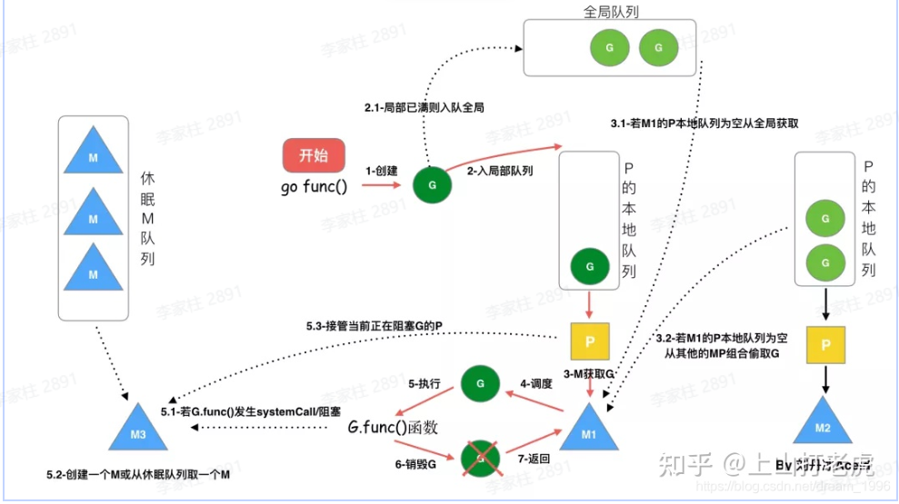
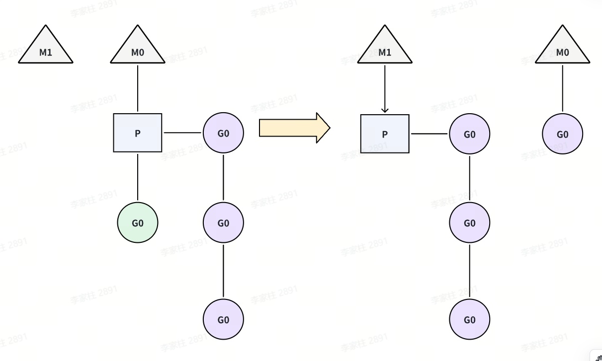
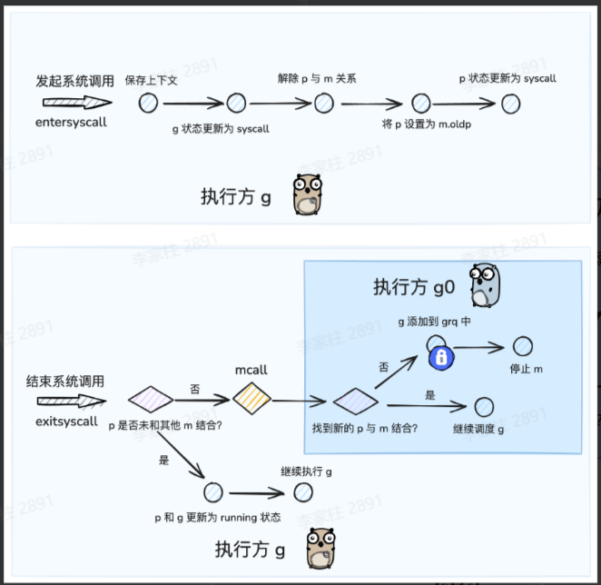

## 🚀 Goroutine

> 传统的线程调度有以下问题：
>
> - 资源消耗大：每个线程需要 2MB-8MB 栈空间、创建和销毁需要大量系统调用
> - 性能开销高：频繁的用户态/内核态切换、上下文切换成本高（寄存器、缓存、TLB）
> - 编程复杂：需要手动管理线程生命周期、同步原语（锁、信号量）使用复杂

goroutine 是由 Go runtime 管理的轻量级线程。

- 轻量级：Go runtime 管理的用户级线程，初始栈空间 2KB（线程 1MB+），支持百万级创建，启动销毁成本低。
- 高效调度机制：Go runtime 负责调度，上下文切换延迟 0.2 微秒（线程 1-2 微秒），仅保存必要寄存器状态。
- 灵活内存管理：动态栈设计（2KB-1GB），按需伸缩，包含程序计数器、栈空间、调度状态等基础功能

### 💻 具体使用

在调用函数的时候在前面加上go关键字，就可以为一个函数创建一个goroutine。

```Go
func hello() {
    fmt.Println("Hello Goroutine!")
}

func main() {
    hello()
    fmt.Println("main goroutine done!")
}

func main1() {
    go hello() // 启动一个goroutine去执行hello函数
    fmt.Println("main goroutine done!")
}

func main2() {
    go hello()
    fmt.Println("main goroutine done!")
    time.Sleep(time.Second) // 等待hello函数返回
}
```

在程序启动时，Go程序就会为main()函数创建一个默认的goroutine。当main()函数返回的时候该goroutine就结束了，所有在main()函数中启动的goroutine会一同结束，所以在实际使用goroutine时需要特别注意其调度。

在循环中创建goroutine时需要尤其注意，goroutine 会捕获循环变量的引用，而非值。若循环内未正确处理，所有 goroutine 可能最终使用同一变量的最终值（而非各自迭代时的值）。

解决方案

- **通过参数传递数据到协程**

```Go
func hello(i int) {
    fmt.Println("Hello Goroutine!", i)
}

func main() {
    for i := 0; i < 10; i++ {
        go func(idx int) {
            hello(idx)
        }(i)
    }
    time.Sleep(time.Second)
}
```

- **定义临时变量**

```Go
func hello(i int) {
    fmt.Println("Hello Goroutine!", i)
}

func main() {
    for i := 0; i < 10; i++ {
        val := i
        go func() {
            hello(val)
        }()
    }
    time.Sleep(time.Second)
}
```

### 🔄 调度模型

线程模型：根据运行的环境和调度者的身份，线程可分为用户级线程和内核级线程，用户级线程在用户态创建、同步和销毁，由**线程库**来调度。内核级线程则运行在内核空间，由**内核**来调度，在有的系统上也称为LWP(轻量级进程）。当进程的一个内核级线程获得CPU的使用权时，它就加载并运行一个用户级线程，可见，内核级线程相当于用户级线程的容器，一个进程可以拥有M个用户级线程和N个内核级线程。按照M:N的取值，可分为三种线程模型

- N:1 模型：即N个协程对应1个内核级线程。该模型完全在用户空间实现，线程库负责管理所有的执行线程，比如线程的优先级、时间片等。线程库利用longjmp来切换线程的执行，使得看起来像是并发执行，但实际上内核仍然是把整个进程作为最小单元调度的，该进程的所有执行线程共享进程的时间片，对外表现出相同的优先级。
  - 优点：线程切换在用户态完成，创建和调度线程都无需内核的干预，不会对系统性能造成明显的影响
  - 缺点
    - 对于多处理器系统，一个进程的多个线程无法运行在不同的CPU上，无法充分利用CPU多核的算力。
    - 1个进程的所有协程都绑定在1个线程上，一旦某协程阻塞，造成线程阻塞，本进程的其他协程都无法执行了，无并发能力
- 1:1 模型：即每个用户级线程对应一个内核级线程例如 **`Java Thread`** 。该模型完全由内核创建和调度线程，用户空间的线程库不需要进行进程管理。
  - 优点：充分利用CPU的算力资源，支持多核
  - 缺点：开销大，线程切换要陷入内核导致线程上下文切换较慢，数量上限受内核限制
- N:M 模型：即前两种模型的结合，M个用户线程对应N个内核级线程的双层调度模式。该模式内核调度M个内核线程，线程库调度N个用户线程。Go语言采用这种模型
  - 优点：充分结合前两种模式的优点，不但不过分消耗内核资源，而且线程切换速度也比较快，充分利用多处理器的优势 
  - 缺点：该模型的调度算法复杂。

<div align="center">
  
</div>

### 🏗️ GMP模型

#### ❓ 为什么需要P——Go1.1之前的GM模型

在 Go 1.1版本之前，其实用的就是GM模型。

- **G**：协程，通常在代码里用  **`go`** 关键字执行一个方法，那么就等于起了一个 **`G`** 。
- **M**，内核线程，操作系统内核其实看不见 **`G`** 和 **`P`** ，只知道自己在执行一个线程。**`G`** 和 **`P`** 都是在**用户层**上的实现。

除了 **`G`** 和 **`M`** 以外，还有一个**全局协程队列**，这个全局队列里放的是多个处于**可运行状态**的 **`G`** 。**`M`** 如果想要获取 **`G`** ，就需要访问一个**全局队列**。同时，内核线程`M`是可以同时存在多个的，因此访问时还需要考虑**并发**安全问题。因此这个全局队列有一把**全局的大锁**，每次访问都需要去获取这把大锁。并发量小的时候还好，当并发量大了，这把大锁，就成为了**性能瓶颈**。

#### 📊 调度模型

<div align="center">
  
</div>

**`gmp = goroutine(G) + machine(M) + processor(P)`**

- **`M(machine)`** : OS线程抽象，代表着真正执行计算的资源，由内核进行调度，**`M`** 需要和 **`P`** 进行结合，从而进入到GMP调度体系之中
- **`P(processor)`** : Go定义的一个抽象概念，包含运行Go代码的必要资源，也有调度goroutine的能力，可以理解为 **`M`** 的执行代理。对**`G`** 来说，P相当于CPU核，**`G`** 只有绑定到 **`P`** (在P的local runq中)才能被调度。对M来说，P提供了相关的执行环境(Context)，如内存分配状态(mcache)，任务队列(G)等，P的数量决定了系统内最大可并行的G的数量（前提：物理CPU核数 >= P的数量），P的数量由用户设置的 **`GOMAXPROCS`** 决定，但是不论 **`GOMAXPROCS`** 设置为多大，P的数量最大为256
  - **`M`** 需要与 **`P`** 绑定后，才会进入到 gmp 调度模式当中；因此P的数量决定了G最大并行数量
  - **`P`** 是 **`G`** 的存储容器，其自带一个本地 g 队列（ **`local run queue`** ），承载着一系列等待被调度的G
- **`G(goroutine)`** : Go协程，通过go关键字会创建一个协程，有自己的运行栈、生命周期状态、以及执行的任务函数。G并非执行体，每个G需要绑定到P才能被调度执行。



我们可以把GMP理解为一个任务调度系统.

- G就是这个系统中所谓的 **任务** ，是一种需要被分配和执行的"资源"
- M就是这个系统中的"引擎"，当M和P结合后，就限定了**引擎**的运行是围绕着GMP这条轨道进行的，使得**引擎**运行着两个周而复始、不断交替的步骤——寻找任务（执行g0），执行任务（执行g）
- P就是这个系统中的"中枢"，当其和作为"引擎" 的M结合后，才会引导**引擎**进入GMP的运行模式；同时 p 也是这个系统中存储"任务"的"容器"，为"引擎"提供了用于执行的任务资源。

P和M的数量

- P的数量：由启动时环境变量 **`$GOMAXPROCS`** 或者是由 **`runtime`** 的方法 **`GOMAXPROCS()`**决定。这意味着在程序执行的任意时刻都只有 **`$GOMAXPROCS`** 个goroutine在同时运行。
- M的数量
  -  go语言本身的限制：go程序启动时，会设置M的最大数量，默认10000.但是内核很难支持这么多的线程数，所以这个限制可以忽略。
  - runtime/debug中的 **`SetMaxThreads`** 函数，设置M的最大数量
  - 一个M阻塞了，会创建新的M。

M0和G0

- **`M0`** 是启动程序后的编号为0的主线程，这个M对应的实例会在全局变量 **`runtime.m0`** 中，不需要在heap上分配，M0负责执行初始化操作和启动第一个G（main）， 在之后M0就和其他的M一样了。
- **`G0`** 是每次启动一个M都会第一个创建的goroutine，G0仅用于负责调度的G，G0不指向任何可执行的函数, 每个M都会有一个自己的G0。在调度或系统调用时会使用G0的栈空间, 全局变量的G0是M0的G0



<div align="center">
  
</div>

上图中有三个工作线程M，每个工作线程M持有一个处理器P，并且每个M持有一个协程G正在运行。每个处理器P持有一个运行队列，包含待调度的协程G，除此以外，还会有一个全局的队列，包含待调度的协程，被多个处理器P共享。

通常而言，每个处理器P上的协程G，若要创建新的协程，新创建的协程会放入到本地的运行队列中。当本地的队列满了，或者阻塞的协程被唤醒，协程会被放到全局的队列中。处理器P除了会消费本地队列中的协程P以外，还会周期性的消费全局队列中的协程G，避免全局队列中的协程P"饿死"。

#### ⚙️ 调度策略

<div align="center">
  
</div>

- **队列轮转**：每个处理器P维护一个待调度协程G的队列，依次调度协程G到M中执行。同时，每个P会周期性的查看全局队列中的待运行协程G，防止全局队列中的G长时间得不到调度机会而饿死。

- **系统调用**：当线程执行系统调用的时候，可能会被阻塞。对应到调度器模型中，如果一个协程G发起了系统调用被阻塞时，对应处理器P的运行队列就会被阻塞，整个队列中的所有协程都会被阻塞。如图所示，当绿色的协程G0发生系统调用，M0将释放P，进而冗余的M1将会获取P，继续执行P队列中剩下的待调度的协程G。M0由于系统调用，陷入阻塞。M1可能来自于缓存池，也可能是新创建的，当G0结束系统调用时，M0会根据是否可以获取到P，而对M0进行不同的处理，如果获取到P，则继续执行；如果没获取到，则将G0放入全局队列等待调度，M0将进入缓存池休眠。

<div align="center">
  
</div>

- **协程窃取**：每个协程中产生的新协程，会被优先调度到本地的运行队列中，因此可能会出现，部分处理器P本地队列很大，部分处理器本地队列很小甚至为空的情况，因此go调度器实现了当处理器p本地队列为空时，窃取别的队列中的协程G的策略。如图所示，M1对应的本地队列为空，此时它会查看全局队列中是否有协程需要调度，如果也没有，则会从别的正在运行的P中窃取一半的协程G，窃取结果如图所示。

<div align="center">
  
</div>

  - **避免 P/M 空转** ：保证所有核都能被充分利用。
  - **任务分布均衡** ：防止某个 P 堆积大量 goroutine，拖慢调度。
  - **减少全局锁竞争** ：大多数情况下 P 直接用本地队列，只有偷任务或全局队列时才涉及共享资源。

- **抢占式调度**：为避免某个协程长时间执行，而阻碍别的协程被调度，监控线程sysmons会监控每个协程的运行时间，一旦运行时间过长（超过10ms）且有其他协程在等待时，会将运行中的协程暂停，转而调度等待的协程，达到类似于时间片轮转的效果

<div align="center">
  
</div>



为什么P的逻辑不加在M上？

主要还是因为 **`M`** 其实是**内核**线程，内核只知道自己在跑线程，而`golang`的运行时（包括调度，垃圾回收等）其实都是**用户空间**里的逻辑。操作系统内核哪里还知道，也不需要知道用户空间的golang应用的内部。这一切逻辑交给应用层自己去做就好，毕竟改内核线程的逻辑也不合适啊。



#### 🔄 hand off机制

设计背景：在 GMP 模型中 **M（线程）** 要绑定 **P（处理器）** 才能执行 G（goroutine）。但在某些情况下，M 无法继续运行了。例如：当前 goroutine 调用了 **阻塞系统调用**（例如 **`syscall`**、阻塞 I/O）。当前 M 被阻塞住，无法再继续执行 P 上的其他 G。这时候，如果不做处理会导致这个 M 被卡住，它绑定的 **P 就会闲置**，导致其他 G 不能被调度执行。所以为了避免浪费 CPU 核心资源，Go 调度器会触发 **handoff 机制**。

**hand off机制** ：将发起 syscall 的 g 和 m 绑定，但是解除 p 与 m 的绑定关系，使得此期间 p 存在和其他 m 结合的机会。保证这个 P 上的 G 还能继续被执行。

<div align="center">
  
</div>

- 原本持有 P 的 M（被阻塞）会失去 P（解除P和M的调用关系）
- 调度器会找一个新的或空闲的 M，把 P 分配给它。
- 新的 M 继续负责运行 P 队列里的 goroutine。



GMP 调度过程中存在哪些阻塞

- I/O，select
- block on syscall
- channel
- 等待锁
- runtime.Gosched()


