## 🧠 为什么要理解 Go 的内存管理

很多开发者在学习 **Go 语言** 时，会把注意力放在 **goroutine**、**channel**、接口设计这些更“看得见”的特性上，但真正影响程序性能和稳定性的，往往是更底层的内存管理机制。

在 **C/C++** 这类语言里，程序员需要自己申请和释放内存；而在 **Go** 里，这部分工作由编译器、运行时分配器和 **GC（Garbage Collection，垃圾回收）** 共同完成。表面上看，开发者不需要再手动管理内存了，但这并不意味着内存问题就消失了。

实际开发中，很多性能问题最终都能追到下面几个现象：

- **对象频繁逃逸到堆上**
- **短生命周期对象过多，导致 GC 压力变大**
- **大对象分配不合理，引发额外开销**
- **代码写法不当，导致本可栈分配的对象进入堆中**

所以，理解 **Go 的内存管理**，本质上是在回答三个问题：

1. 一个对象为什么会分配在栈上，或者逃逸到堆上？
2. 如果对象进入堆，运行时是如何给它分配内存的？
3. 当对象不再使用后，Go 又是如何把它回收掉的？

本文就按照这条主线，系统梳理 **Go 的内存管理和垃圾回收机制**。

---

## 🔍 逃逸分析：对象是上栈还是上堆

### 📖 什么是逃逸分析

**逃逸分析** 是编译器在编译阶段做的一项静态分析，用来决定一个变量应该分配在 **栈** 上还是 **堆** 上。

如果把 **栈** 和 **堆** 比作两种“住址”，那逃逸分析做的事情就是先判断：这个对象到底是只在当前函数里短暂停留，还是离开当前函数后还会继续被别人访问。

这是因为：

- **栈分配** 的成本很低，通常只需要简单地移动栈指针
- **堆分配** 的成本更高，需要运行时参与分配，并且最终还要由 **GC** 回收

因此，**尽可能让对象留在栈上**，通常意味着更低的分配成本和更小的 GC 压力。

### 🔑 栈和堆到底有什么区别

在理解逃逸分析之前，最好先把 **栈** 和 **堆** 的差别真正分清楚。

**栈** 更适合存放：

- 局部变量
- 函数参数
- 返回地址
- 一些生命周期很短的临时数据

**堆** 更适合存放：

- 生命周期不容易在编译期确定的对象
- 需要跨函数、跨协程继续存活的数据
- 体积较大或者需要动态扩展的数据结构

它们最关键的差别可以概括成下面几条：

- **生命周期不同**：栈上的数据通常跟随函数调用结束而释放，堆上的对象要等 GC 判断不可达后才回收
- **分配速度不同**：栈分配通常更快，堆分配通常更重
- **可见性不同**：栈更偏线程或协程私有，堆上的对象更容易被共享
- **管理方式不同**：栈主要由编译器和运行时自动维护，堆更多依赖分配器和 GC

### 🎯 Go 编译器判断逃逸的核心原则

Go 编译器不会让开发者手动指定“这个对象必须放栈上”或者“这个对象必须放堆上”，而是通过代码特征来推断。

最核心的判断原则可以概括为两条：

- **函数外部不会再引用的对象，优先放栈上**
- **函数返回后仍然可能被使用的对象，必须放堆上**

也就是说，编译器关注的不是“你写了指针”本身，而是这个对象的**生命周期**是否超出了当前栈帧。

### 🏷️ 常见的逃逸场景

#### 🔧 返回局部变量指针

这是最典型的逃逸场景。

```go
package main

type Student struct {
    Name string
    Age  int
}

func NewStudent(name string, age int) *Student {
    s := Student{Name: name, Age: age}
    return &s
}
```

在这段代码里，`s` 是函数内部的局部变量，但函数返回了它的地址。函数调用结束后，调用方还要继续使用它，所以编译器只能把它分配到堆上。

#### 🔥 大对象导致栈空间不足

有些对象即使没有被返回，也可能因为太大而进入堆。

```go
func MakeSlice() {
    s := make([]int, 10000, 10000)
    _ = s
}
```

切片底层数组过大时，编译器通常不会把它直接放到栈上，而是交给堆来管理。

#### 🎭 接口调用与动态类型导致逃逸

当值被装箱到 **interface** 中时，编译器往往很难在编译阶段完全确定它的最终使用方式，因此容易出现逃逸。

例如 `fmt.Println`、`fmt.Printf` 这类函数都带有可变参数接口：

```go
func Println(a ...interface{}) (n int, err error)
```

当一个值传入这类接口参数时，就有可能发生逃逸。这也是为什么在高频、性能敏感路径里，滥用接口和格式化输出往往会带来额外开销。

#### 💻 指针被放进引用类型或跨协程传递

除了“返回局部变量指针”之外，还有几类场景也很容易让对象逃逸：

- **把指针放进 slice 或 map**
- **向 channel 发送指针**
- **闭包捕获外部变量**
- **对象引用被其他 goroutine 持有**

这些场景的共同点都很明显：**当前函数结束后，这个对象仍然可能在别的地方继续被访问。** 对编译器来说，只要存在这种可能性，就更倾向于把对象放到堆上。

如果把这个结论再说得更具体一点，可以记成一句话：**只要对象的引用关系被放进了更长生命周期的容器，或者被交给了当前栈帧之外的执行单元，它就更容易逃逸。**

像下面这些写法，都属于这类思路的典型展开：

- **局部对象的地址被追加进 slice**
- **局部对象的地址被放进 map**
- **局部对象的地址通过 channel 发送出去**
- **闭包把外层变量捕获后延长了它的生命周期**
- **对象被 goroutine 异步使用，编译器无法再把它视为当前函数内的短生命周期对象**

#### ❓ 大小在编译期无法确定

如果对象大小在编译期无法确定，编译器通常也会更保守地选择堆分配。

```go
func MakeSlice(length int) {
    s := make([]int, length, length)
    _ = s
}
```

这里的 `length` 是运行期参数，编译器无法在编译时确定这块内存到底需要多大，因此更容易把对象分配到堆上。

### 📉 逃逸分析对性能的影响

逃逸分析之所以重要，是因为它直接决定了对象是否会参与堆分配和 GC。

如果一个对象放在栈上：

- 分配快
- 回收快
- 不需要 GC 追踪

如果一个对象逃逸到堆上：

- 需要运行时分配
- 会增加堆对象数量
- 会增加 GC 的扫描和回收压力
- 大对象场景下还更容易带来额外的内存碎片和复用成本

除此之外，逃逸还会带来一个更隐蔽的问题：**缓存命中率下降**。栈内存通常更连续、局部性更好，而堆对象往往更分散。



并不是“使用指针就一定差”，而是要警惕“本来可以放栈上的对象，因为写法问题逃逸到了堆上”。



### 🔭 如何查看逃逸分析结果

Go 提供了非常直接的方式查看逃逸分析结果：

```bash
go build -gcflags="-m -l" main.go
```

如果编译输出里出现：

```text
escapes to heap
```

就表示对应对象发生了逃逸。

在性能分析场景里，这个命令很实用，直接看编译器输出比“靠感觉优化”更可靠。

下面这类编译输出，就是典型的逃逸分析结果：

<div align="center">
  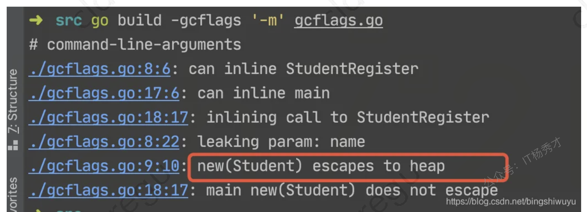
</div>

---

## 🧱 内存分配：Go 如何管理堆内存

### 🏎️ 从 TCMalloc 说起

Go 运行时的内存分配器，整体设计大量借鉴了 **TCMalloc**。

TCMalloc 的核心思想并不复杂：**把不同大小的内存块分层缓存起来，优先在本地快速分配，只有在本地不够时才向更高层申请。**

这样做的好处是：

- 减少频繁向操作系统申请内存的成本
- 降低锁竞争
- 提高小对象分配性能

Go 在这个思想基础上，结合自己的调度模型做了改造。

<div align="center">
  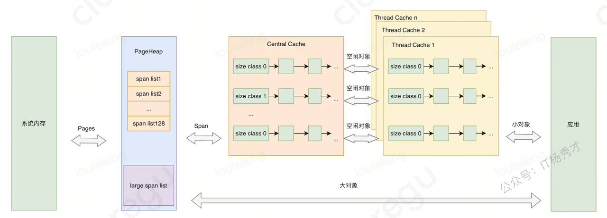
</div>

### 🏗️ Go 内存分配器的核心结构

Go 运行时里，几个最关键的角色分别是 **Page**、**Span**、**mcache**、**mcentral** 和 **mheap**。

很多同学第一次看到这些名词会觉得有点乱，其实可以先按“本地缓存 -> 中心缓存 -> 堆管理器”这条线来理解，整体结构如下：

<div align="center">
  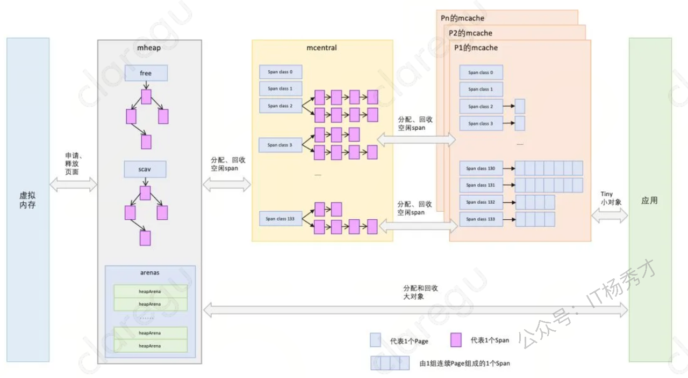
</div>

#### 🧩 Page 和 Span

**Page** 可以理解为内存管理的基本页单位，而 **Span** 是由一组连续 **Page** 组成的更大管理单元。

在 Go 里，真正用于分配和回收管理的核心单位其实是 **Span**。不同的 **Span** 会对应不同大小规格的对象。

在运行时实现里，**mspan** 才是最重要的内存管理单元，可以把它理解成“一段已经切分好、准备按某种规格反复分配的小内存仓库”。

这里有几个值得记住的细节：

- 一个 **mspan** 会管理若干个 page
- 每个 page 通常按 **8KB** 这个粒度参与运行时管理
- 真正回收对象时，很多情况下并不是立刻把内存还给操作系统，而是先放回 span 和分配器体系里等待复用

- **Page** 是底层物理单位
- **Span** 是运行时真正拿来组织内存的逻辑单位

#### 💫 mcache

**mcache** 是每个 **P** 私有的本地缓存。

小对象分配时，优先从当前 **P** 绑定的 **mcache** 中拿内存，这个过程通常**不需要加锁**，所以非常快。

#### 🔗 mcentral

**mcentral** 是多个 **mcache** 共享的中心缓存。

当某个 **mcache** 的某个规格 **Span** 用完后，就会向对应的 **mcentral** 申请新的 **Span**。由于它是共享结构，所以访问时需要加锁。

- **mcache** 是线程本地小仓库
- **mcentral** 是公共中转仓库

#### 🌐 mheap

**mheap** 是更上层的堆内存管理者。

当 **mcentral** 也拿不到合适的 **Span** 时，就会继续向 **mheap** 请求；如果 **mheap** 还不够，就再向操作系统申请内存页。

所以整体分配路径通常是：

```text
mcache -> mcentral -> mheap -> OS
```

这里还有一个很重要但很容易被忽略的事实：

> **对象被“回收”以后，很多时候只是回到了 Go 运行时预先管理的大块内存里，并不是立刻还给操作系统。**

这样做的好处是下一次分配时可以直接复用，避免频繁系统调用。只有当某些内存长期闲置时，运行时才会尝试把一部分空间归还给操作系统。

### 📊 小对象、Tiny 对象和大对象的分配路径

Go 会根据对象大小走不同分配路径。

- **Tiny 对象**：通常指 `16B` 以内且不包含指针的对象，会走更激进的合并分配策略
- **小对象**：一般指 `16B ~ 32KB` 的对象，按 size class 分配到对应规格的 **Span**
- **大对象**：大于 `32KB` 的对象，通常直接从 **mheap** 分配

这种分类的意义在于：**对象大小不同，分配策略也不同。**

如果把分配路径画成一张更直观的图，大致可以理解成下面这样：

<div align="center">
  
</div>

再总结成一句话：

- **Tiny 对象**：优先在当前 `P` 的 tiny 分配器里复用小块空间，多个微小对象可能共享同一块内存
- **小对象**：按照 size class 落到对应的 `mspan`，优先从 `mcache` 分配，不够再逐层向 `mcentral`、`mheap` 申请
- **大对象**：不再走小对象规格池，而是直接向 `mheap` 申请连续页

### 💡 为什么 channel 这类运行时对象通常在堆上

有一个很容易被问到的问题是：**`channel` 一般分配在栈上还是堆上？**

更贴近运行时语义的回答是：**通常分配在堆上。**

原因并不复杂：

- `channel` 的生命周期通常会跨越当前函数调用
- 它天然用于 **goroutine** 之间通信，引用关系往往不止存在于当前栈帧
- 运行时还需要为它维护缓冲区、发送队列、接收队列、锁等内部结构

所以从编译器和运行时角度看，这类对象天然更适合交给堆来管理，而不是放在当前函数的栈空间里短暂存活。

### 🏹 为什么 Go 的分配器能降低碎片问题

前面讲常见 GC 算法时经常会提到“内存碎片”问题。Go 之所以没有像很多语言那样强依赖“复制”或“标记整理”来解决碎片，一个重要原因就是它的分配器本身已经在努力降低碎片率。

原因主要有三点：

- **按 size class 分类分配**，相同大小对象尽量放在同规格的 Span 中
- **本地缓存优先分配**，减少全局竞争
- **Span 作为统一管理单位**，便于回收和复用

这并不代表 Go 完全没有碎片问题，而是说：**Go 通过分配器设计，已经把碎片问题控制在了相对可接受的范围内。**

### ⚙️ 代码层面如何减少分配开销

理解分配器之后，再回到写代码这件事，最常见的优化点其实很集中：

- **预分配容量**：像 `make([]int, 0, 100)` 这类写法，可以减少切片反复扩容
- **减少不必要的内存拷贝**：尤其是在热点路径里
- **按对象大小思考分配路径**：小对象更依赖本地缓存，大对象更要避免频繁创建
- **注意结构体字段顺序**：尽量把大字段、同类字段放在一起，减少 padding

最后这一点经常被忽略。虽然 **Go 编译器** 会自动处理内存对齐，但字段顺序不合理时，结构体还是可能更大，进而放大内存占用和 GC 扫描成本。

### 📐 内存对齐为什么也和性能有关

很多人第一次听到 **内存对齐**，会觉得这只是编译器帮我们处理的小细节，其实它和性能、内存占用都直接相关。

先抓住三个结论：

- **字段起始地址通常要满足自身类型的对齐要求**
- **字段顺序不合理时，编译器会插入 padding**
- **整个结构体的大小，通常也要对齐到最大字段的对齐倍数**

例如一个 `int32` 字段，通常希望出现在 **4 字节对齐** 的地址上；如果前一个字段结束后当前位置不满足这个要求，编译器就会自动补空白字节。

这里可以顺手区分三个很容易混在一起的概念：

- **字段对齐**：单个字段的起始地址要满足该类型的对齐要求
- **填充字节（padding）**：为了让后续字段满足对齐要求，编译器插入的空白字节
- **结构体整体对齐**：结构体总大小通常也要补齐到最大字段对齐值的倍数

这样做不是为了“格式整齐”，而是为了两件事：

1. **硬件访问效率**：很多 CPU 架构更适合读取对齐后的数据，未对齐访问可能需要额外拆分和重组
2. **跨平台一致性**：不同平台的 ABI 规则不同，编译器需要按目标平台规则生成正确布局

所以更准确地说，内存对齐不是操作系统在运行期临时决定的，而是**编译器根据目标平台 ABI 规则提前布好的内存布局**。

如果想直观看到字段顺序的影响，可以看一个简化例子：

```go
type Bad struct {
    A bool
    B int64
    C bool
}

type Good struct {
    B int64
    A bool
    C bool
}
```

这两个结构体表达的信息几乎一样，但 `Bad` 的字段顺序更容易产生额外 padding，而 `Good` 往往会更紧凑。业务里单个结构体多出几个字节看起来不大，可一旦对象数量上来，就会同时放大：

- **内存占用**
- **缓存行利用率**
- **GC 扫描成本**



结构体字段优化里最常见的经验规则就是：**大字段尽量靠前、相同类型尽量放一起**。这样往往能减少 padding，让结构体更紧凑。



---

## ♻️ 垃圾回收：Go 如何找到并回收垃圾

### ✨ 什么是垃圾回收

**GC（Garbage Collection）** 的本质，就是自动找出程序里那些**已经不再被使用的堆内存**，然后把它们回收掉，让这部分空间重新变得可用。

这里要特别注意一点：

> **GC 主要处理的是堆内存，而不是栈内存。**

栈上的对象会随着函数调用结束自动释放，不需要 GC 介入；真正需要 GC 管理的是那些生命周期更复杂的堆对象。

下面这张图就很适合建立直觉：有些堆对象虽然已经分配了，但如果已经没有任何根引用能够到达它，它就是 GC 眼里的“垃圾”。

<div align="center">
  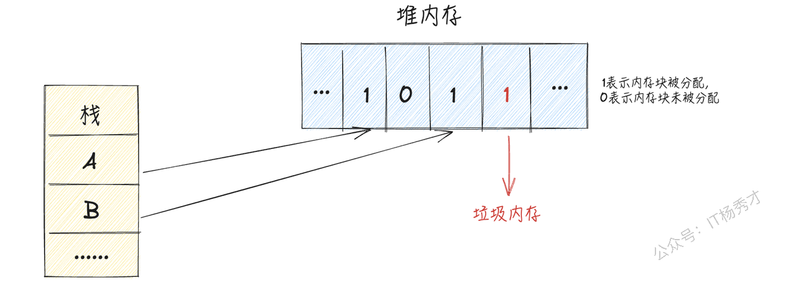
</div>


### 🎯 为什么 Go 需要 GC

如果没有 GC，程序员就需要像写 **C/C++** 一样手动释放对象。

但一旦对象引用关系复杂起来，手动释放几乎必然伴随着两类问题：

- **释放早了**，产生悬挂指针
- **释放晚了或者忘了释放**，产生内存泄漏

Go 选择自动垃圾回收，本质上是在用运行时成本换开发效率和安全性。

一个最典型的错误就是悬挂指针。局部变量在函数结束后会随栈帧一起失效，如果还继续返回它的地址，程序就会进入危险状态：

```c
int * func(void) {
    int a = 100;
    return &a;
}
```

真实业务里的问题通常更复杂。你以为沿着一条调用链把对象顺序 `free` 掉就够了，但另一个分支可能还在引用其中某个对象，这时就会把“还在使用的内存”误删掉。

<div align="center">
  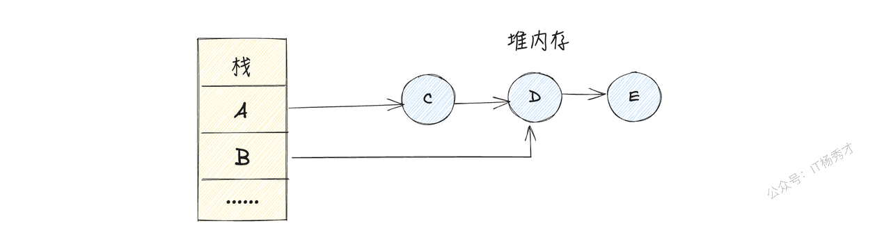
</div>

<div align="center">
  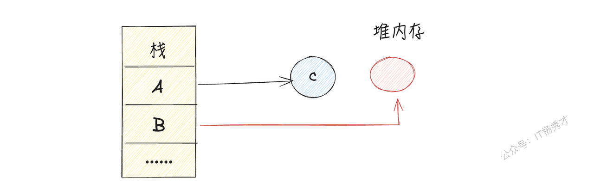
</div>

这也是为什么现代语言更倾向于把“找垃圾”和“回收垃圾”交给运行时，而不是要求开发者手工维护整张对象关系图。

### 🏛️ 栈区对象在 GC 中如何处理

栈区对象有两个非常明显的特点：

- **数量多**
- **访问频率高**

如果对栈上的每一次指针修改都加写屏障，运行时开销会非常大，所以 **Go 并不会像处理堆对象那样处理栈对象**。

更准确地说，Go 对栈区对象采用的是一套更偏工程化的折中方案：

1. **GC 标记开始时，会先把栈上当前可达的对象视为活跃对象**
2. **并发标记过程中，新出现在栈上的对象通常直接按活跃对象处理**
3. **栈上的引用变化不会像堆对象那样逐次走写屏障**

这样做的核心目的不是"绝对精确"，而是**避免为了栈对象引入过高的写屏障成本和额外的 STW 开销**。简单说就是：**堆对象追求精细跟踪，栈对象更偏向保守处理。**

### 🚀 GC 的触发条件

Go 的 **GC** 常见触发方式可以整理成下面几类：

- **主动触发**：手动调用 `runtime.GC()`
- **基于堆增长自动触发**：当新分配堆内存的增长超过阈值时触发，这个阈值和 **`GOGC`** 有关，Go runtime 自动判断当前堆大小是否超过阈值（即GOGC参数）当新分配的堆内存增⻓超过上次 GC 后存活堆大小的 **GOGC%** 时，触发下一次 GC
- **定时触发**：后台运行时会在一定时间后做一次兜底触发
- **内存压力触发**：系统内存压力较大时，运行时也可能更积极地触发 GC

其中最常见的还是第二种，也就是堆增长到一定比例后自动触发下一轮 GC。

如果再贴近运行时实现一点，还可以这样理解：

- **`runtime.sysmon`** 会在后台监控系统状态，长时间没有 GC 时会触发兜底回收
- **`runtime.mallocgc`** 在分配堆内存时会检查当前堆增长情况，必要时主动推进 GC

另外还有两个容易记的经验值：

- 默认 **`GOGC=100`**，也就是堆相对上次存活堆增长到大约一倍时，会触发下一轮 GC
- 第一轮 GC 的初始触发临界值通常比较小，常见认知里大约是 **4MB** 级别

所以 Go 的 GC 不是"定时器到了再收"，也不是"内存满了再收"，而是**后台监控 + 分配时检查 + 步调参数**共同决定的。

### 📑 常见 GC 算法回顾

在理解 Go 的 GC 之前，先快速看一下几种经典思路。

#### 📖 引用计数

引用计数会为每个对象维护一个“被引用次数”，当计数归零时就立即回收。

优点是简单直接，缺点也非常明显：

- 需要额外维护计数
- 很难解决**循环引用**

- 在并发场景里，引用计数的增减往往需要额外同步甚至原子操作
- 这会带来明显的 **CPU 开销** 和 **cache 竞争**

这也是很多现代运行时没有把“纯引用计数”作为核心方案的原因之一。

它的直觉很简单：谁还在引用我，我就把计数加一；没人引用我了，计数归零，就可以回收。

<div align="center">
  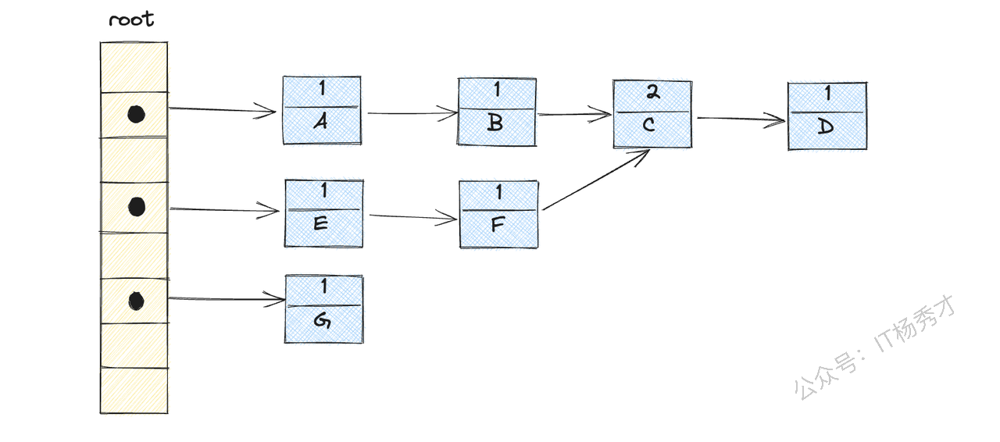
</div>

真正麻烦的是循环引用。两个对象即使业务上已经不用了，只要它们还彼此引用，单看计数就依然不为零。

<div align="center">
  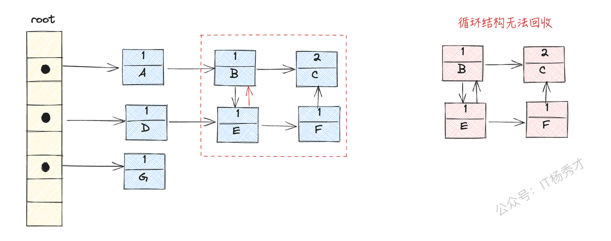
</div>

#### ⚖️ 标记清除

标记清除分成两步：

1. 从根对象出发，标记所有可达对象
2. 回收那些没有被标记的对象

它的优点是实现相对直接，但缺点是容易产生**内存碎片**。

<div align="center">
  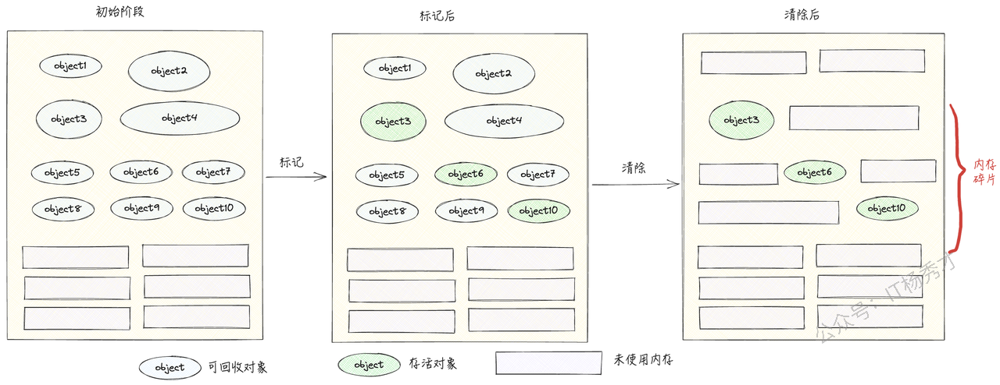
</div>

#### 📋 标记复制

标记复制把内存分成两块，每次只用一块；回收时把存活对象复制到另一块，再整体清理原区域。

优点是碎片少，缺点是：

- 内存利用率低
- 存活对象多时复制成本高

<div align="center">
  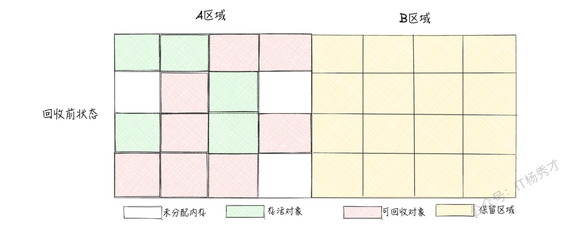
</div>

<div align="center">
  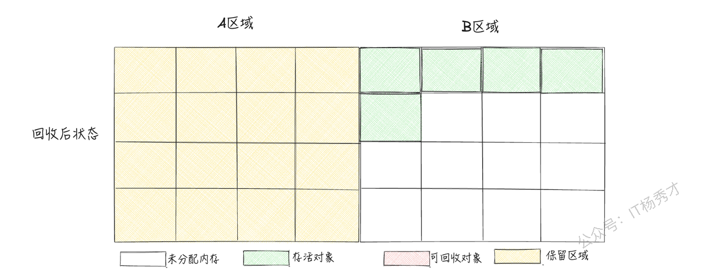
</div>

#### 🔄 标记整理

标记整理和标记清除类似，但在标记完成后会把存活对象向一端压缩整理，再回收尾部空间。

这样能缓解碎片问题，但对象移动和引用更新的成本也更高。

<div align="center">
  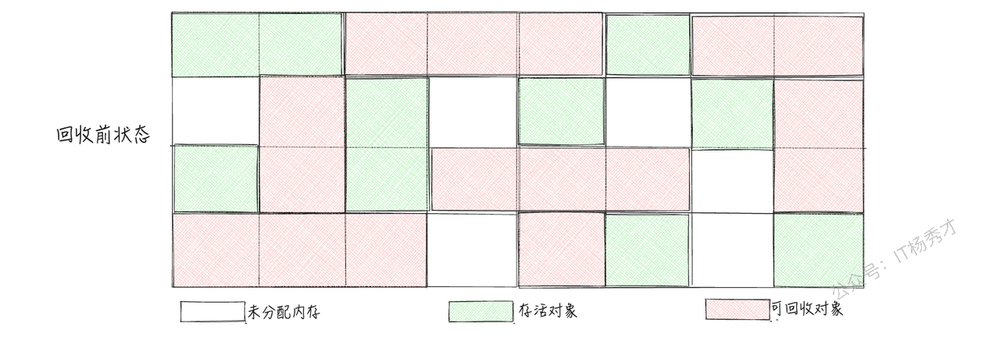
</div>

<div align="center">
  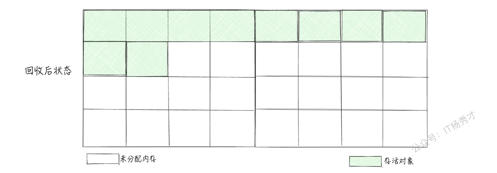
</div>

如果再往前推一步，其实还有 **分代 GC** 这条经典路线。它的思路是按对象生命周期分区处理，让短命对象多的区域使用复制算法，长命对象多的区域使用标记清除或标记整理。

### 🎪 并发三色标记算法

Go 当前 GC 的核心思路是：

> **并发三色标记 + 写屏障 + 标记清除**

Go 没有采用典型的**分代 GC**，也没有把“对象压缩整理”作为常规路径，原因大致有两个：

1. **Go 有逃逸分析**，很多短生命周期对象在编译期就被留在栈上，分代 GC 的收益没有其他语言那么明显
2. **Go 的分配器已经在降低碎片率**，所以没有强依赖对象复制或整理来维持可用性

Go 的重点不是“尽可能把垃圾收得多么彻底”，而是**在正确性和停顿时间之间取得平衡**。

换句话说，Go 没有把分代和整理作为主路径，不是因为它们没价值，而是因为：

- **Go 的分配器已经在尽量控制碎片**
- **Go 的逃逸分析已经让很多短命对象根本不进堆**
- **分代引入更复杂的代际引用维护，也意味着更重的写屏障开销**

在服务端高并发场景里，Go 更重视停顿时间、吞吐量和实现复杂度之间的平衡，所以最终选了**并发三色标记 + 写屏障**这条路线。

#### 🎯 三色标记的基本过程

三色标记会把对象分成三种颜色：

- **白色**：还没有被访问到的对象，可能是垃圾
- **灰色**：已经被访问到，但它引用的对象还没有扫描完
- **黑色**：已经被访问到，并且它引用的对象也都扫描完了

可以先看整体对象关系，再看标记后的结果，理解会更直观。

<div align="center">
  
</div>

标记过程可以概括为：

1. 一开始所有对象都是白色
2. 从根对象出发，把可达对象染成灰色
3. 不断处理灰色对象，把它引用的白色对象继续染灰，然后把自己染黑
4. 当没有灰色对象时，剩下的白色对象就是垃圾

这种做法比“直接整体扫描再整体清理”更适合并发执行。

当灰色对象都处理完成后，整体效果大致如下：

<div align="center">
  
</div>


先看对象关系整体图：

<div align="center">
  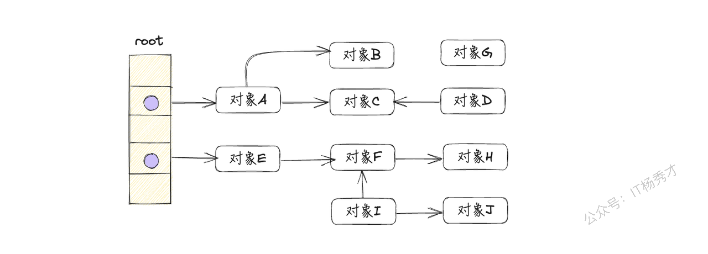
</div>

开始时，所有对象都是白色：

<div align="center">
  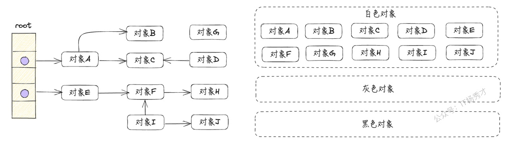
</div>

扫描根对象，把第一批可达对象染成灰色：

<div align="center">
  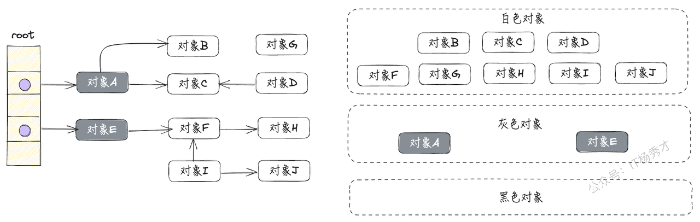
</div>

继续处理灰色对象，把它们引用到的白色对象染灰，并把自己染黑：

<div align="center">
  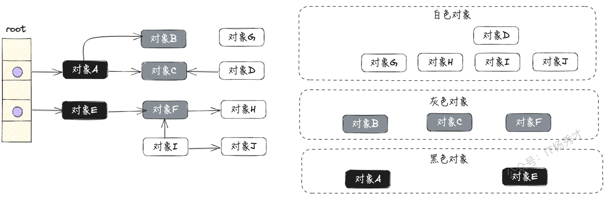
</div>

重复这个过程，直到灰色集合为空：

<div align="center">
  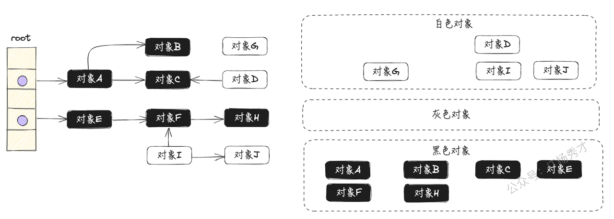
</div>

最后剩下的白色对象就是垃圾，统一回收：

<div align="center">
  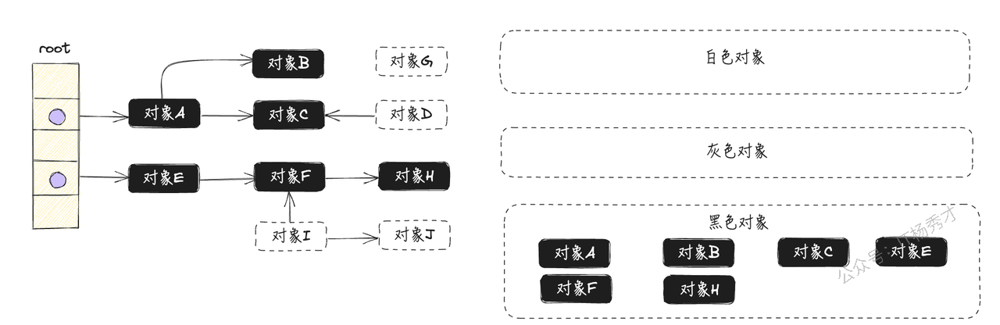
</div>


GC 并不是从任意对象开始扫，而是从一组确定的 GC Roots 开始。在 Go 里，根对象通常包括：
- 全局变量
- 各个 goroutine 栈上的对象或指针
- 寄存器中保存的指针
从这些根对象出发，可达的对象就被视为 “还活着”；不可达的对象才会被回收。


#### ⚠️ 没有 STW 的三色标记

如果 GC 和用户代码并发执行，就会出现一个问题：

GC 正在标记对象图的同时，用户代码还在不断修改引用关系。

如果在这个过程中：

- 一个**黑色对象**新引用了一个**白色对象**
- 同时原本能到达这个白色对象的**灰色路径被切断**

那么这个白色对象就可能被 GC 错误地当成垃圾回收。

这就是并发标记必须解决的核心正确性问题。


假设某一轮标记进行到下面这个阶段，灰色对象 `F` 还通过指针 `p` 指向白色对象 `H`：

<div align="center">
  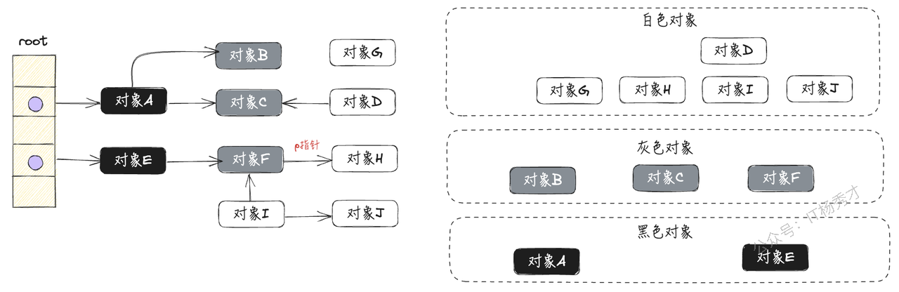
</div>

这时，已经扫描完的黑色对象 `E` 新增了一个指向 `H` 的引用：

<div align="center">
  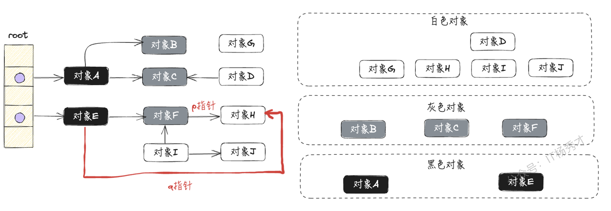
</div>

同时，灰色对象 `F` 又删掉了原来指向 `H` 的那条边：

<div align="center">
  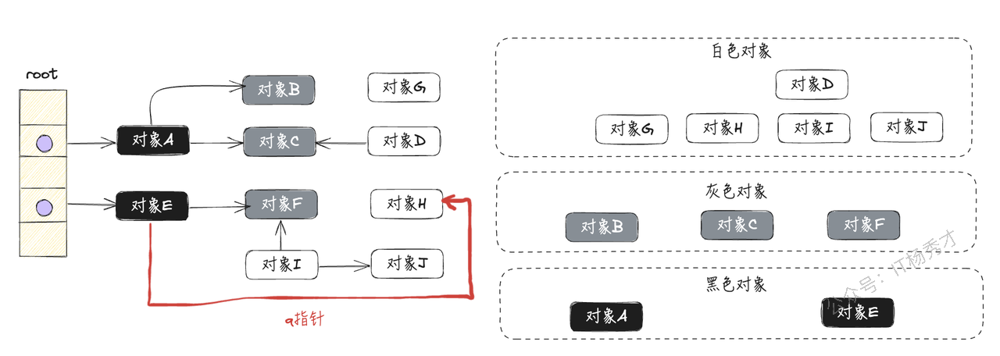
</div>

结果就是：`H` 明明还被 `E` 引用着，但由于它不再处在灰色对象的后续扫描路径里，最终可能会被错误清理掉。

<div align="center">
  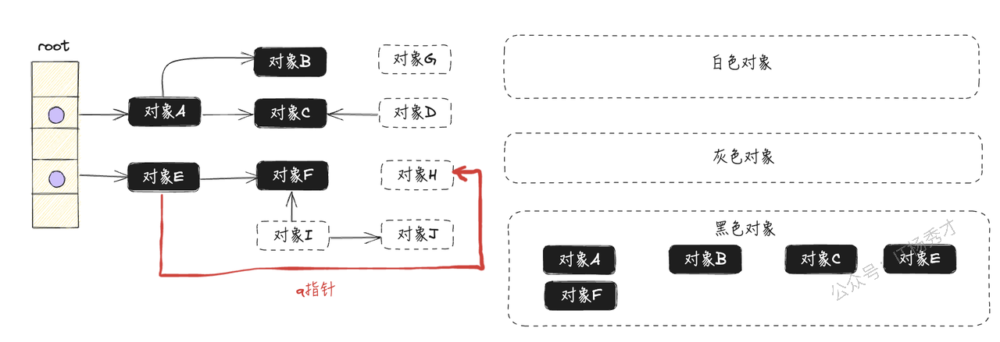
</div>

所以在没有额外保护时，错误回收一般来自两个条件同时成立：

- **黑色对象引用了白色对象**
- **灰色对象到这个白色对象的可达路径被破坏**

#### 💠 三色标记在运行时里的真实落地方式

三色标记里的“白、灰、黑”并不是 Go 运行时里真的有三个颜色字段。它更像一套帮助理解的抽象模型。

在实现上，运行时主要依赖的是：

- **对象所在 span 上的标记位（`gcmarkBits`）**
- **待扫描工作队列**

可以粗略理解成：

- **白色对象**：标记位还是 `0`，并且也不在扫描队列里
- **灰色对象**：标记位已经置为 `1`，但还在扫描队列里等着处理
- **黑色对象**：标记位已经置为 `1`，并且已经从扫描队列里取出、处理完成

也就是说，颜色是理解模型，**位图 + 队列** 才是程序里的真实结构。

### 🔐 内存屏障

为了解决并发标记期间的引用变化问题，Go 引入了**内存屏障**。
内存屏障本质上是一种**赋值器技术**。编译器会在编译阶段给某些堆指针写操作插入一段额外代码，运行时在 GC 标记阶段通过这段 hook 拦截写入动作，决定是否需要补标对象。可以理解为：

> **在程序执行某些指针写操作时，额外插入一小段运行时代码，用来配合 GC 维持标记正确性。**

从机制上看，它主要做三件事：

1. **拦截指针写入**
2. **记录旧值和新值**
3. **把需要补标的对象放进后续扫描流程**

把它简化成伪代码，大致可以理解成：

```go
if runtime.writeBarrier.enabled {
    runtime.gcWriteBarrier(ptr, val)
} else {
    *ptr = val
}
```

所以写屏障不是"所有堆写都会无脑执行的一段逻辑"，而是在 GC 相关阶段打开后，才真正接管一部分指针写入。Go 运行时里还有一个和写屏障强相关的结构叫 **`wbBuf`**。可以把它理解成每个 **P** 私有的小缓冲队列，写屏障先把需要处理的旧指针、新指针记进去，攒到一定数量后再批量刷新到扫描队列里，从而摊平降低每次写屏障的即时开销。

#### 🔑 强弱三色不变性
- **强三色不变性**：黑色对象不能直接指向白色对象
- **弱三色不变性**：如果黑色对象指向白色对象，那这个白色对象也必须仍然处于灰色对象的保护链路上

只要满足其中一种，就能避免对象被错误回收。

<div align="center">
  
</div>

<div align="center">
  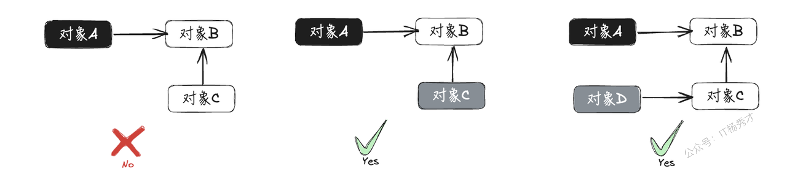
</div>

只要破坏“黑对象挂白对象”和“灰对象失去对白对象保护路径”这两个条件同时成立，错误回收就不会发生。Go 正是通过写屏障去尽量维持这两种不变性。


#### 💫 插入写屏障（Dijistra Insertion Barrier）

插入写屏障的思路是：

- 当一个对象要把某个白色对象挂到自己下面时，先把这个白色对象标记成灰色

这样就能避免“黑指向白”的情况直接出现。

它更偏向维护**强三色不变性**。

对应的简化伪代码可以写成：

```go
func DijkstraWritePointer(slot *unsafe.Pointer, ptr unsafe.Pointer) {
    shade(ptr)
    *slot = ptr
}
```
上述伪代码可以翻译如下：

```go
添加下游对象(当前下游对象slot, 新下游对象ptr) {   
  //step 1
  将新的下游对象ptr标记为灰色   
  
  //step 2
  当前下游对象slot = 新下游对象ptr                    
}
```

它最适合的场景有两类：

- **新增下游对象**：比如 A 原本没有下游，现在新增一个 B
- **替换下游对象**：比如 A 原来指向 C，现在改成 B

由于**指针修改时，指向的新对象要被强制标灰** ，所以它维护 **强三色不变性**。


1. 程序初始阶段，所有对象均标记为白色，将所有对象放入到白色集合

<div align="center">
  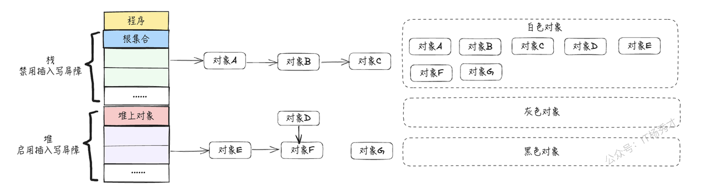
</div>

* 根节点开始遍历，把遍历到的对象标记为灰色（只遍历一次），放到灰色标记集合中，如下图所示：

<div align="center">
  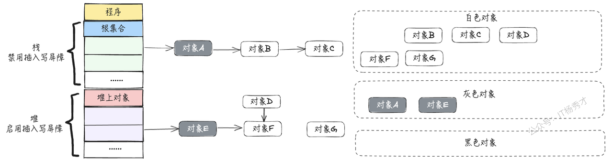
</div>

* 遍历灰色集合，将可达对象从白色标记为灰色， 放入灰色集合，并将自身标记为黑色放入黑色集合

<div align="center">
  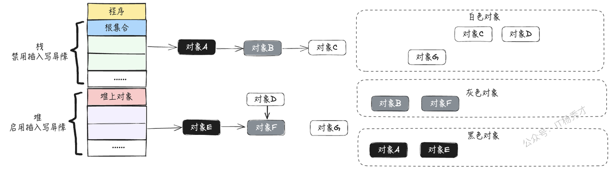
</div>

* 由于是并发进行标记，此时对象E指向一个新的对H，对象A指向一个新的对象I，对象E在堆区，出发插入写屏障，对象A在栈区，不触发插入写屏障

<div align="center">
  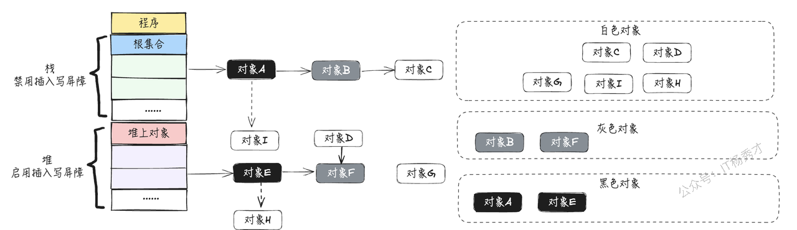
</div>

* 插入写屏障的作用（黑色对象添加白色对象，将白色对象标记为灰色），对象H被标记为灰色，由于栈上没有开启写屏障，所以对象I仍然为白色

<div align="center">
  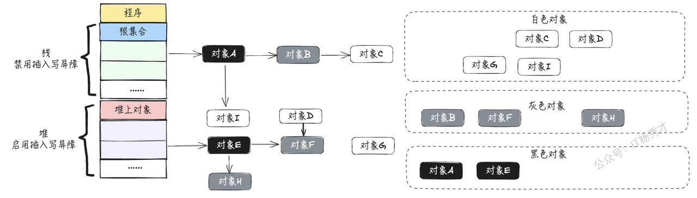
</div>

* 循环执行上述流程，直到灰色集合没有节点

<div align="center">
  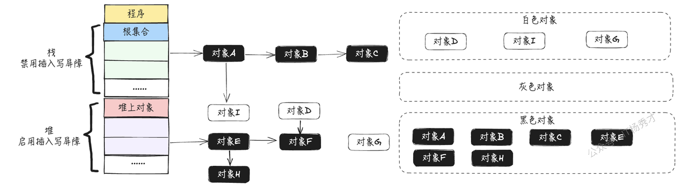
</div>

可以看到出现了黑色对象A指向白色对象I的情况，会出现错误回收，这是由于在栈上没有开启写屏障导致的，所以在全部三色标记扫描之后，要对栈重新进行三色标记扫描, 但这次为了对象不丢失, 要对本次标记扫描启动STW. 直到栈空间的三色标记结束

* 在正式开始回收工作之前，此时开启STW，开始重新扫描一次栈上对象

<div align="center">
  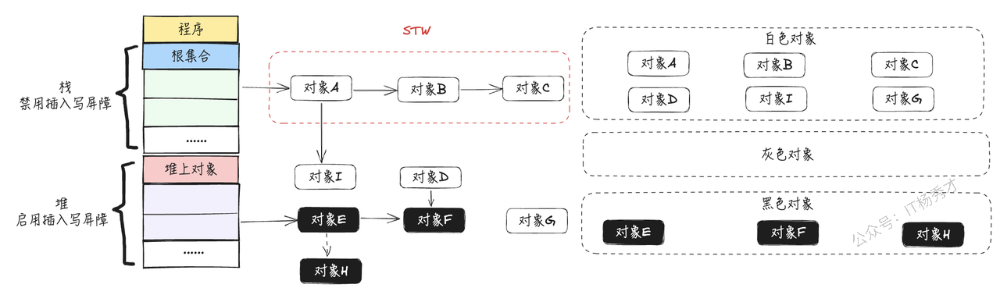
</div>

* 对栈上的对象进行三色标记，直至没有灰色对象了

<div align="center">
  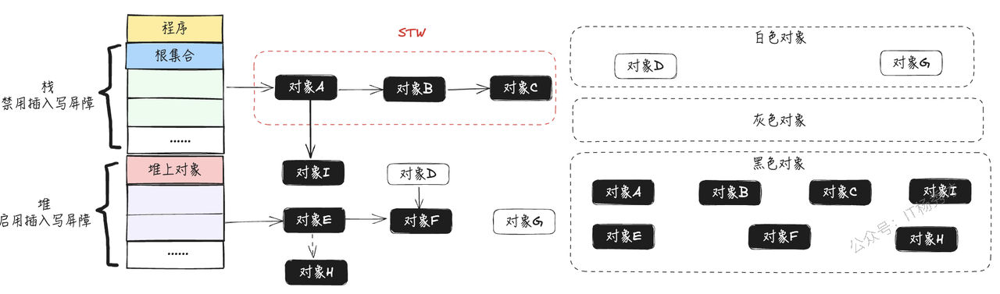
</div>

* 停止STW，这次STW大约的时间在10\~100ms之间，栈重扫完成后，才能安全结束这轮回收。

<div align="center">
  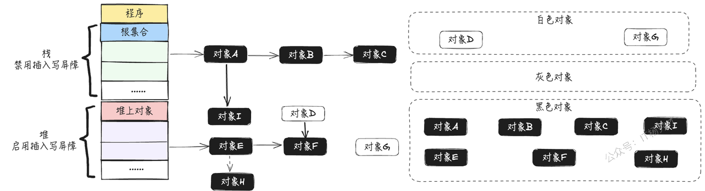
</div>

* 补标结束以后，剩下的白色对象才真正可以被视为垃圾。将剩余的白色节点全部清除，即可完成这轮回收工作

<div align="center">
  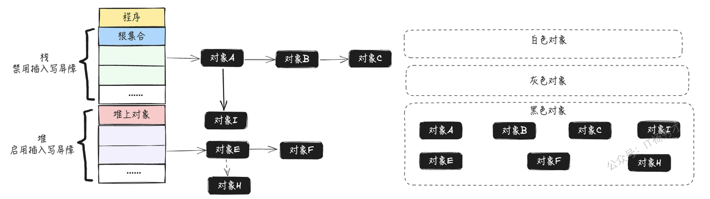
</div>

#### 💥 删除写屏障（Yuasa Deletion Barrier）

删除写屏障的思路是：

- 当某个对象即将失去对另一个对象的引用时，先把被删除引用的那个对象标灰

这样即使原引用关系被删掉了，对象也仍然能被 GC 后续扫描到。

它更偏向维护**弱三色不变性**。

对应的简化伪代码可以写成：

```go
func YuasaWB(slot *unsafe.Pointer, ptr unsafe.Pointer) {
    shade(*slot)
    *slot = ptr
}
```

上述伪代码可以翻译如下：

```go
添加下游对象(当前下游对象slot， 新下游对象ptr) {
  //step 1
  if (当前下游对象slot是灰色 || 当前下游对象slot是白色){
      标记灰色(当前下游对象slot)     //slot为当前下游对象，即将被删除， 标记为灰色
  }
  
  }  
  //step 2
  当前下游对象slot = 新下游对象ptr
}
```

它适合的也是两类场景：

- **删除下游对象**：比如 A 原来指向 B，现在不再指向它
- **替换下游对象**：比如 A 原来指向 C，现在改成 B，旧的 C 会先被保护起来

因为**指针修改时，修改前指向的对象要标灰，即被删除的对象，如果自身为灰色或者白色，那么被标记为灰色旧对象会在断开引用前先被标灰**，所以它维护**弱三色不变性**。

图示过程如下：

1. 初始阶段，所有对象还是白色。

<div align="center">
  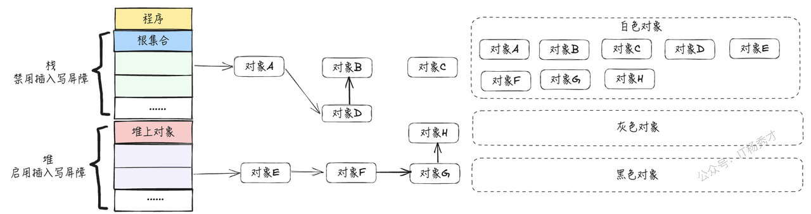
</div>

* 从根节点开始按照三色标记遍历，标记到如下图所示的状态

<div align="center">
  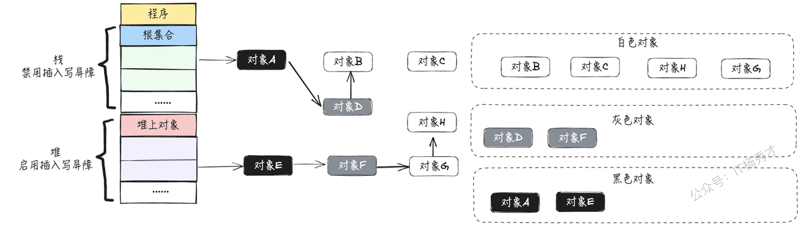
</div>

* 此时用户程序将原本对象E指向对象F的指针指向对象G，即对象E删除对象F，添加对象；触发删除写屏障，由于对象F已经被标记为灰色，所以不做改变，如下图所示

<div align="center">
  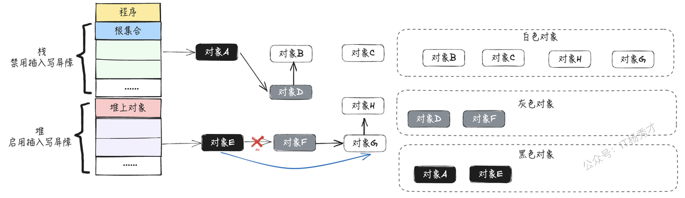
</div>

* 用户程序将对象F指向对象G的指针删除，触发删除写屏障，对象G被标记为灰色，如下图所示：

<div align="center">
  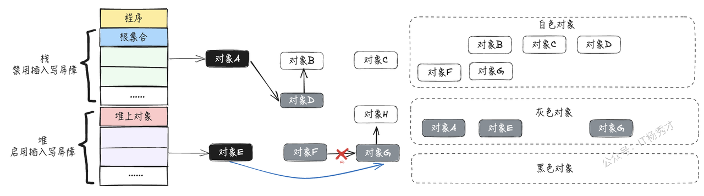
</div>

* 再继续推进三色标记，就能避免错误回收。

<div align="center">
  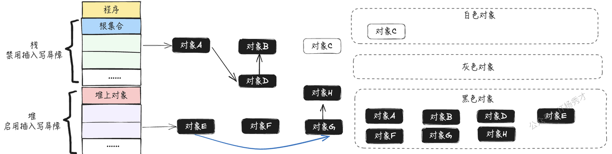
</div>

它能避免错误回收，但代价是**回收精度更保守**。某些已经逻辑失效的对象，因为在删除引用时被重新染灰，可能会多活一轮 GC。同时注意看上图，对象F其实是一个孤立的对象，不会再使用了，却最终被标记为了黑色，没有被回收掉，只能通过下一轮GC的时候将其回收，所以，删除写屏障存在回收精度低的问题

另外，删除写屏障也不是完全不需要 **STW**。删除写屏障又叫做基于其实快照的解决方案（snapshot-at-the-begining）。删除写屏障（基于起始快照的写屏障）在使用的时候有一个前提条件，就是必须起始的时候，把整个根部扫描一遍，做一次快照，让所有的可达对象全都在灰色保护下（根对象全为黑，下一级在堆上的对象全灰），之后利用删除写屏障拦截内存写操作，确保弱三色不变式不被破坏，这样就绝对不会有被误回收的对象，就可以保证垃圾回收的正确性。

经过了STW快照之后的，删除写屏障过程

<div align="center">
  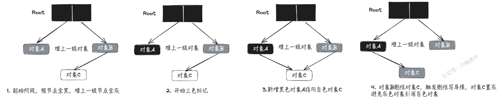
</div>

如果试图一个栈一个栈地暂停，而不是一次性暂停全部 goroutine，也仍然会漏标，因为跨栈引用关系会在你扫描的间隙继续变化。具体例子如下

1. 对象A 是 goroutine1 里栈上的一个对象，goroutine1里的栈空间已经扫描完了，并且 对象C 也扫描完标记为黑色的对象；

2. 对象B 是 goroutine2里 栈上的对象，指向了goroutine1里的对象 C 和goroutine2里的对象 D，由于goroutine2 还没有完全扫描，对象B 是一个灰色对象，对象D 是白色对象

<div align="center">
  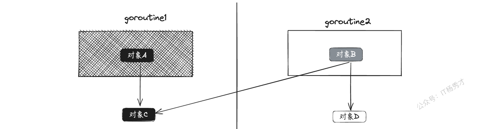
</div>

问题就在于，另一个 goroutine 还没被扫描完之前，跨栈引用关系已经继续发生变化了。
此时假设执行以下步骤：

第一步：goroutine2 进行赋值变更，把 对象C 指向 D 对象，此时黑色对象 C 就指向了白色的 D（这里是删除屏障，而不是插入写屏障，所以新增引用不会触发任何操作）

第二步：删除对象 B 到对象D的引用，由于是栈对象操作，不会触发删除写屏障

执行完上述两个，结果如下图：

<div align="center">
  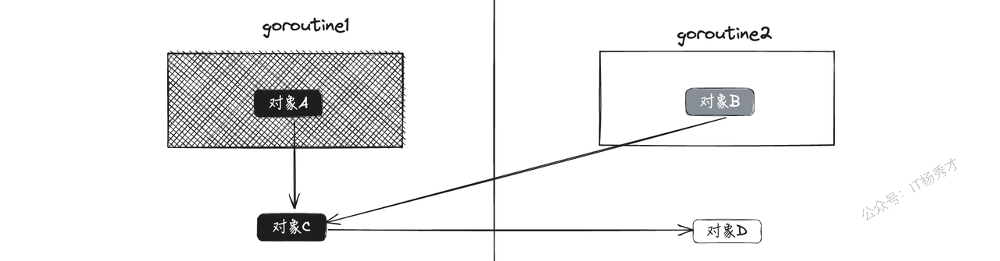
</div>

所以删除写屏障不是“完全摆脱 STW”，而是把 STW 集中到了起始快照这一步，同时用更保守的回收精度换来了正确性。

#### 🔮 混合写屏障

Go 现在采用的是**混合写屏障**，把插入写屏障和删除写屏障的思路结合起来。

它的目标很明确：

- 降低大范围 **STW（Stop The World）** 的时间
- 让 GC 标记阶段能尽量和用户代码并发执行
- 在正确性和性能之间做更现实的平衡

- **插入写屏障**，主要防止“黑对象新挂白对象”
- **删除写屏障**，主要防止“灰对象原来能到达的白对象被断开”
- **混合写屏障**，就是两边一起管，尽量同时避免这两类漏标风险

可以把它概括成一句话：

> **混合写屏障 = 删除写屏障 + 插入写屏障**

对应的简化伪代码如下：

```go
func HybridWritePointerSimple(slot *unsafe.Pointer, ptr unsafe.Pointer) {
    shade(*slot)
    shade(ptr)
    *slot = ptr
}
```

可以做如下翻译

```go
添加下游对象(当前下游对象slot, 新下游对象ptr) {
//step1 
标记灰色(当前下游对象slot)    //只要当前下游对象被移走，就标记灰色

//step2 
标记灰色(新下游对象ptr)      //新下游对象标记为灰色

//3step
当前下游对象slot = 新下游对象ptr
}
```

混合写屏障的核心可以总结成四条：

- **GC 开始时，逐个扫描栈并把当前栈上可达对象标黑**
- **GC 期间新出现在栈上的对象直接按存活对象处理，任何在栈上创建的新对象，均标记为黑色**
- **被删除的堆对象要标灰**
- **被新增引用到的堆对象也要标灰**

它的图示流程适合按下面顺序理解：

1. 初始状态下先看整体对象关系。

<div align="center">
  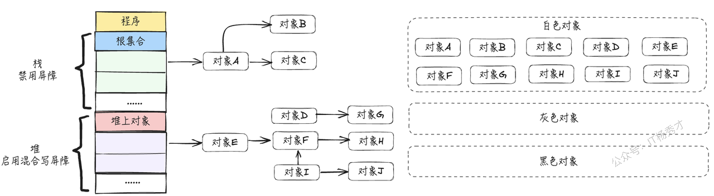
</div>

2. GC 开始后，逐个扫描栈，将所有栈上可达对象A,B,C标记为黑色

<div align="center">
  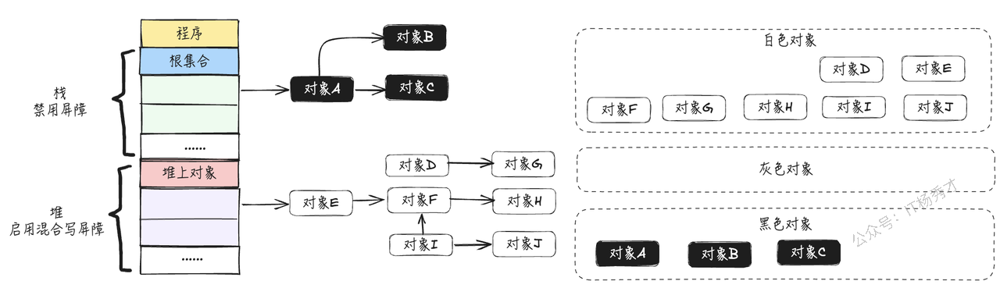
</div>

3. GC 期间新出现在栈上的对象，也直接按活跃对象处理。期间栈上新创建的对象K被标记为黑色

<div align="center">
  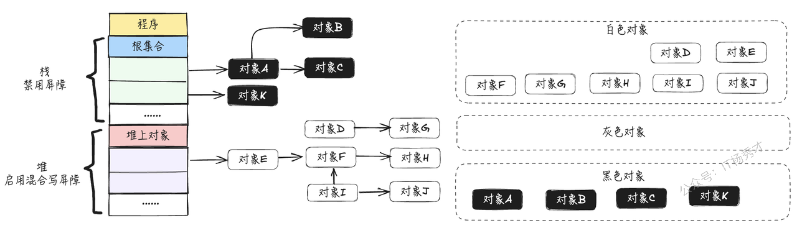
</div>

4. 并发标记推进到中间态后，堆上的新旧引用变化都会被屏障捕获。对象E被标记为黑色，对象F被标记为灰色

<div align="center">
  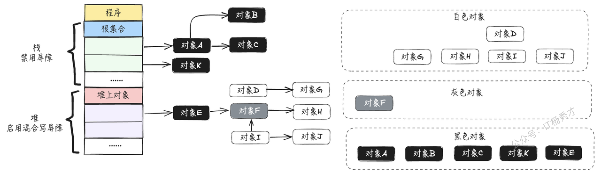
</div>

5. 此时，对象E新增指针指向对象I，对象F删除对对象H的指针引用，触发混合写屏障，对象I标记为灰色，对象H标记为灰色

<div align="center">
  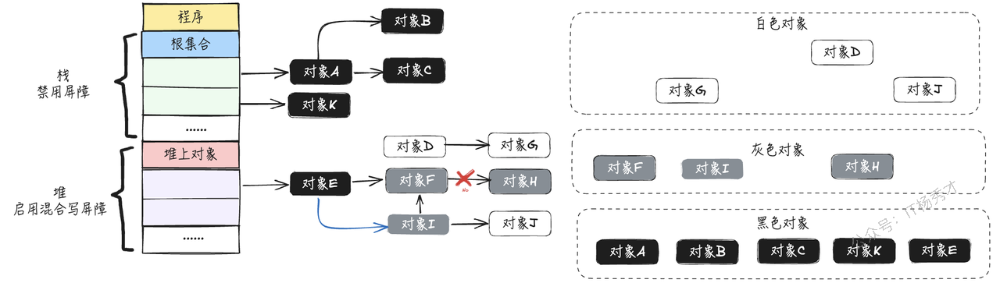
</div>

6. 按照三色标记法和混合写屏障的的步骤继续往下执行，最终得到的结果如下图所示：

<div align="center">
  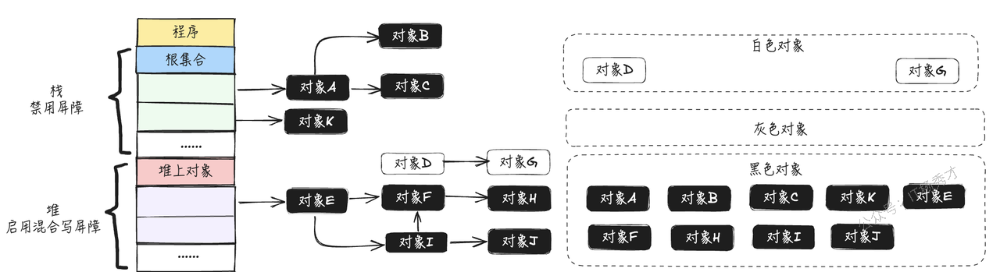
</div>

最终垃圾对象为白色对象D,G，将会被垃圾回收器清理掉

它最终成了 Go 的选择，原因也很直接：

- 不需要像删除写屏障那样依赖大范围起始 STW 快照
- 不需要像早期插入写屏障那样在末尾重扫整个栈
- 在正确性、停顿时间和实现复杂度之间达成了更现实的平衡

### 📜 一次完整 GC 大致会经历哪些阶段

如果把一轮现代 Go **GC** 按运行时阶段拆开来看，大致可以分成 4 个部分。相关代码主要在 `runtime/mgc.go` 里，对应 `SweepTermination`、`Mark`、`MarkTermination` 和 `Sweep` 四个阶段。

整条主线其实不复杂：先收尾上一个周期，再并发找出还活着的对象，接着做一次短暂的终止收口，最后把没标记到的对象清扫掉。

#### 🧹 清除终止（SweepTermination）

这个阶段的任务，是把上一个 **GC** 周期还没彻底做完的清扫工作收尾，并为新一轮标记做准备。

- **先执行一次 STW**：让所有 `P` 进入安全点，保证阶段切换时运行时状态一致。
- **补完残留清扫工作**：正常情况下，上一个周期的大部分清扫已经并发完成；只有本轮 **GC** 被提前触发时，才可能残留少量未清扫的 `span`。
- **重置相关状态**：把清扫阶段用到的计数、标记和调度状态整理干净，准备进入标记期。

#### 🔍 并发标记（Concurrent Mark and Scan）

这是整轮 **GC** 最核心的阶段，目标是找出“这轮结束时仍然可达”的对象。

- **切换 GC 状态并打开写屏障**：运行时会把状态从 `_GCoff` 切到 `_GCmark`，同时开启 **写屏障（Write Barrier）** 和 **mutator assists**，然后把根对象压入待处理队列。
- **恢复业务协程运行**：用户代码继续执行，后台标记 worker 和协助线程同时工作，尽量把停顿压短。
- **不断处理灰色对象**：扫描灰色对象，把它们染成黑色，并把它们引用到的对象继续染成灰色。
- **并发期间靠写屏障兜底**：如果对象引用关系在标记过程中发生变化，写屏障会把相关对象重新纳入标记流程，避免“明明还活着却被漏标”的情况。
- **检测是否可以结束标记**：运行时会通过分布式终止算法判断系统里是否还存在灰色对象或待处理根任务；如果没有，就进入下一阶段。

这里有一个关键点：**写屏障的开启必须放在 STW 保护下完成**。原因很简单，只有确保所有 `P` 都已经感知到“现在必须执行写屏障”，并发标记才是安全的。

#### 🧾 标记终止（MarkTermination）

并发标记结束以后，还需要一个很短的收口阶段，把这轮标记正式封账。

- **再次执行 STW**：暂停用户程序，避免最后收尾时对象图继续变化。
- **切换到终止态**：运行时会把状态切到 `_GCmarktermination`，关闭后台标记 worker 和 `mutator assists`。
- **整理本地缓存**：刷新各个 `P` 上的本地分配缓存和 **GC** 相关缓存，例如 `mcache`，让标记结果和后续清扫状态对齐。
- **准备进入清扫阶段**：到这一步，哪些对象活着、哪些对象该回收，已经基本确定了。

这也是一轮 **GC** 里第二个比较重要的 **STW** 点。很多线上服务能感知到的卡顿，往往就集中在这里和标记开始前的那一次停顿。

#### ♻️ 清除（Sweep）

最后一个阶段负责把“这一轮没有被标记到”的对象真正清理掉，并把空间重新还给分配器。

- **切回 `_GCoff`**：运行时关闭写屏障，初始化新一轮清扫状态。
- **恢复正常分配**：用户程序继续运行，此后新创建的对象重新按普通分配路径处理。
- **后台并发清扫 `span`**：运行时会逐步清理未标记对象所在的内存块，把可复用空间重新挂回分配体系。
- **按需触发辅助清扫**：如果业务 goroutine 在堆上申请新内存，也可能顺手推进部分清扫工作。


从整体节奏看，Go 的 **GC** 并不是“停下来一次性全做完”，而是把最重的工作放到并发标记和并发清扫里，只在阶段切换时保留两个尽量短的 **STW** 点。



### 🕐 Go GC 的演进过程

Go 的 GC 也不是一开始就这么成熟，大致经历了几个阶段：

- **Go 1.3 及之前**：更传统的标记清除，停顿更明显
- **Go 1.5**：引入并发三色标记
- **Go 1.8**：引入混合写屏障，进一步降低 STW

这条演进路线的核心方向始终一致：

> **减少停顿时间，让 GC 更适合服务端高并发场景。**

- 先从“整段暂停”走向“并发标记”
- 再从“并发标记但补偿成本较高”走向“混合写屏障下更平衡的实现”

所以 Go GC 的升级方向一直都非常明确，不是无限追求回收精度，而是持续优化**停顿时间、吞吐量和实现复杂度**之间的平衡。

### 🚨 哪些内存看起来没用了却不会立刻被回收

理解 Go 的 GC，还有一个很容易踩坑的点：

**“逻辑上不用了”不等于“GC 一定能回收”。**

例如下面这种切片缩容：

```go
type Student struct {
    ID   int64
    Name string
}

func main() {
    slice := make([]Student, 6)
    slice = slice[:3]
    _ = slice
}
```

虽然当前切片长度变成了 `3`，但底层数组仍然还在，后面的元素依然处于可达内存范围内，因此 GC 不会立刻把那部分底层空间单独回收。

切片最开始会持有底层数组里的 6 个元素：

<div align="center">
  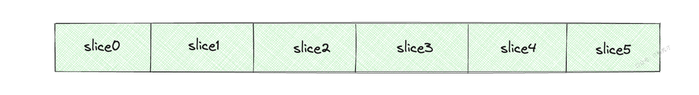
</div>

当切片缩成 `3` 个元素以后，业务上你确实“看不到”后半部分了，但底层数组仍然还挂在切片头上，因此从 **GC** 视角看，它依旧是可达的。

<div align="center">
  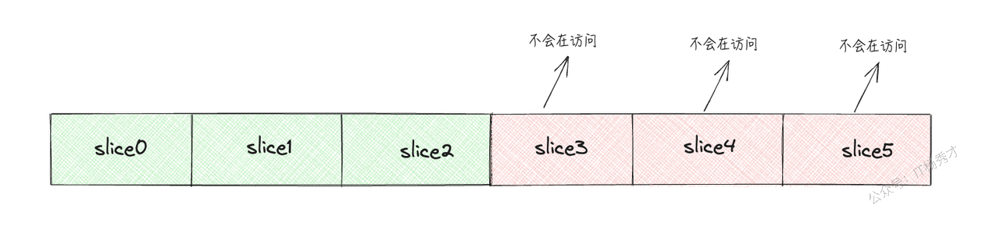
</div>

类似的问题在真实项目里还有几种很常见的变体：

- **小切片引用了一个很大的底层数组**
- **切片被挂在全局变量或长生命周期结构体上**
- **切片作为 map 的 value 长期存在**
- **闭包捕获了切片，导致底层数组一直存活**

这些场景的共同点都是：**你以为数据“逻辑上不用了”，但运行时从引用关系上看，它仍然是可达的。**

`map` 里删除某个 key 也有类似问题。逻辑上你觉得那份数据已经删掉了，但如果底层结构还没及时释放、复用或重建，GC 也未必会立刻把相关空间交还出来。



很多内存问题不是“GC 不工作”，而是**对象在语义上看起来没用了，但在引用关系上依然可达**。只要还能被根对象间接找到，GC 就不会回收它。




---

## 📝 开发建议与总结

### 🧪 如何减少不必要的逃逸

在日常开发中，可以从下面几个方向减少不必要的堆分配：

- **不要盲目返回局部变量指针**
- **性能敏感路径中谨慎使用 interface**
- **避免把很小的值一律改成指针传递**
- **尽量让对象大小在编译期可知**
- **用 `go build -gcflags="-m -l"` 观察真实逃逸结果**

有时候“传指针减少拷贝”未必比“值拷贝留在栈上”更高效。尤其是**带指针的结构体**，不仅更容易逃逸，还会增加 GC 的扫描压力。

### 💪 如何减轻 GC 压力

如果想减少 GC 带来的运行时开销，重点通常不是“手动干预 GC”，而是从对象创建模式入手：

- **减少短生命周期临时对象**
- **复用可以复用的对象**
- **控制大对象分配频率**
- **避免无意义的切片扩容和接口装箱**
- **让更多对象停留在栈上而不是进入堆**

进一步落到代码层面，最常见的做法有这些：

- **临时对象复用**：频繁创建的小对象可以考虑 `sync.Pool`
- **字符串拼接减少临时对象**：高频拼接时优先考虑 `strings.Builder`
- **缓冲区和中间对象复用**：尤其是 HTTP、编解码、日志处理这类场景

优化 GC 的第一步，往往不是研究参数，而是先减少“本来就没必要产生的垃圾”。

### 📐 如何监控和分析 GC 性能

通常最值得关注的几类指标有：

- **GC 停顿时间**：单次停顿有多长，平均值和最大值分别是多少
- **GC 触发频率**：单位时间内触发了多少次 GC
- **堆内存使用量**：当前堆用了多少、增长速度如何
- **对象分配速率**：程序是不是在疯狂制造临时对象
- **GC CPU 占比**：GC 是否已经开始明显抢占业务 CPU 时间

Go 里常用的观察手段有这些：

- **`runtime`**：查看内存统计信息
- **`pprof`**：分析堆内存、分配热点和 CPU 开销
- **`go tool trace`**：看运行时事件、调度和 GC 过程
- **`GODEBUG=gctrace=1`**：直接输出详细 GC 日志

如果再往“定位内存泄漏”这类实战问题上走，最常用的几类入口是：

- **`go tool pprof http://host:port/debug/pprof/heap`**：看堆对象到底集中分配在哪些函数
- **`go tool pprof http://host:port/debug/pprof/goroutine`**：看 goroutine 数量是否异常增长、阻塞在哪里
- **`runtime.ReadMemStats()`**：观察堆内存、对象数、GC 次数的变化趋势
- **`runtime.NumGoroutine()`**：快速确认 goroutine 是否存在持续上涨

很多时候，问题并不在“单次 GC 没收掉”，而在于**对象一直处于可达状态**。这类场景最典型的几个来源包括：

- **goroutine 泄漏**：协程没有退出条件，长期阻塞在 `select`、`channel`、网络读写上
- **channel 泄漏**：生产者结束了，但 channel 没关闭，消费者一直等
- **小 slice 持有大数组**：逻辑上只用一小段，但底层整块数组都还活着
- **map 曾经很大后来删了很多元素**：逻辑上数据变少了，但桶不会自动缩回去
- **定时器或 ticker 没有停止**：运行时结构仍被引用，内存与 goroutine 都可能被拖住

如果只是想快速确认“程序是不是 GC 太频繁”，`gctrace` 往往是最直接的入口；如果已经确定有内存热点，再进一步看 **heap profile** 和 **alloc profile**。

一个很实用的经验判断是：**Go 的 GC 卡顿通常不是出在并发清扫阶段，而主要出现在标记开始前和重新标记这两个 STW 点。**

也就是说，如果你的服务在某些时刻有明显抖动，重点要先怀疑：

- 堆是不是太大了
- 分配速率是不是太高了
- 对象图是不是太复杂了
- 写屏障压力是不是偏大了

除了“分配太多”，还要警惕另一类问题：**生命周期被意外拉长**。在 Go 里常见的内存泄漏来源包括：

- **goroutine 泄漏**：协程因为缺少退出条件长期挂着
- **channel 长期阻塞**：读写两端没有正确收口
- **全局 map 或缓存无限增长**
- **外部资源没及时释放**：文件句柄、连接、流对象等

这类问题单靠 GC 不会自动解决，因为从运行时视角看，它们往往仍然是“可达的”。

### 🌟 一句话串起 Go 的内存管理主线

最后可以用一句话把全文串起来：

> **Go 会先通过逃逸分析决定对象放栈上还是堆上；进入堆的对象由分配器按层级高效管理；当这些堆对象不再可达时，再由并发三色标记 GC 配合写屏障完成回收。**
