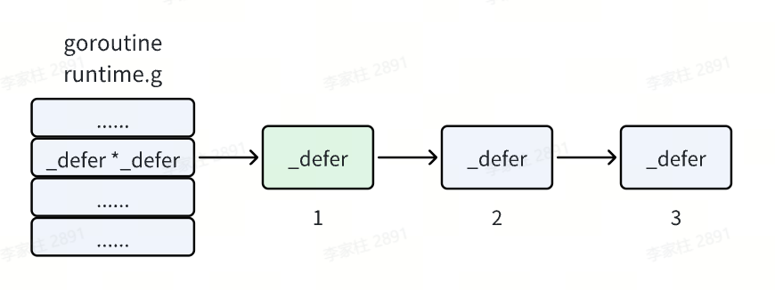

## 函数的定义

函数是基本的代码块，用于执行一个任务。

### 声明方式

```go
func function_name( [parameter list] ) [return_types] {
   函数体
}
```

- **`func`** ：函数由 func 开始声明
- **`function_name`** ：函数名称，参数列表和返回值类型构成了函数签名。
- **`parameter list`** ：参数列表，参数就像一个占位符，当函数被调用时，你可以将值传递给参数，这个值被称为实际参数。参数列表指定的是参数类型、顺序、及参数个数。参数是可选的，也就是说函数也可以不包含参数。
- **`return_types`** ：返回类型，函数返回一列值。**`return_types`** 是该列值的数据类型。有些功能不需要返回值，这种情况下 **`return_types`** 不是必须的。
- 函数体：函数定义的代码集合。

### 注意事项

- 数据类型在参数名后面
- 当连续两个或多个函数的已命名形参类型相同时，除最后一个类型以外，其它都可以省略。

```Go
func add(x, y int) int {
        return x + y
}
```

- 函数可以返回任意数量的返回值，对于不需要的返回值使用 **`_`** 代替
- Go 的返回值可被命名，它们会被视作定义在函数顶部的变量。没有参数的 `return` 语句会直接返回已命名的返回值，也就是「裸」返回值。

```Go
func split(sum int) (x, y int) {
        x = sum * 4 / 9
        y = sum - x
        return
}
```

## 函数式编程

go支持匿名函数，主要有以下两个用法

- 将匿名函数作为另一个函数的参数：回调函数
- 将匿名函数作为另一个函数的返回值：闭包

### 回调函数

回调函数：callback，就是将一个函数 func2 作为函数 func1 的一个参数。那么 func2 叫做回调函数，func1 叫做高阶函数。

```go
type Callback func(x, y int) int

// 根据传入的回调函数进行算术运算
func oper(a, b int, callbackFunc Callback) int {
    res := callbackFunc(a, b)
    return res
}

// 加法运算回调函数
func add(a, b int) int {
    return a + b
}

// 减法运算回调函数
func sub(a, b int) int {
    return a - b
}

func main() {
    // 将 add 作为回调函数传入 oper
    res1 := oper(10, 20, add)
    fmt.Println(res1)

    // 将 sub 作为回调函数传入 oper
    res2 := oper(5, 2, sub)
    fmt.Println(res2)
}
```

### 闭包

闭包：一个外层函数中，有内层函数，该内层函数中，会操作外层函数的局部变量，并且该外层函数的返回值就是这个内层函数。那么这个内层函数和外层函数的局部变量，统称为闭包结构。

闭包 = 函数 + 引用环境

```go
package main

import "fmt"

func getSequence() func() int {
   i:=0
   return func() int {
      i+=1
     return i  
   }
}

func main(){
   /* nextNumber 为一个函数，函数 i 为 0 */
   nextNumber := getSequence()  

   /* 调用 nextNumber 函数，i 变量自增 1 并返回 */
   fmt.Println(nextNumber())
   fmt.Println(nextNumber())
   fmt.Println(nextNumber())
   
   /* 创建新的函数 nextNumber1，并查看结果 */
   nextNumber1 := getSequence()  
   fmt.Println(nextNumber1())
   fmt.Println(nextNumber1())
}
```

## 延迟函数

在 Go 语言中，**延迟函数（defer）是一种在函数返回前自动执行的机制**，通常用于释放资源、解锁、关闭文件等操作。

当函数执行到最后时，这些 defer 语句会按照逆序执行，最后该函数返回。

```go
defer functionName()
```

示例代码

```go
func main() {
    fmt.Println("Start")
    defer fmt.Println("Defer 1")
    defer fmt.Println("Defer 2")
    fmt.Println("End")
}

// Start
// End
// Defer 2
// Defer 1
```

### 底层原理

```Go
type _defer struct {
    siz     int32     // 参数和返回值共占多少字节，这段空间会直接分配在_defer结构体后面，用于在注册时保存参数，并在执行时拷贝到调用者参数与返回值空间
    started bool      // 标记defer是否已经执行
    sp      uintptr   // 记录注册这个defer的函数栈指针（调用者栈指针），函数可以通过它判断自己注册的defer是否已经执行完了
    pc      uintptr   // deferproc的返回地址
    fn      *funcval  // 注册的function value函数
    _panic  *_panic
    link    *_defer   // 链接到前一个注册的defer结构体
}
```

### defer的注册

```go
func A() {
    defer B()
    //code to do something
}
```

编译后的伪指令是下面这样的。defer 指令对应到两部分内容，其中 **`deferproc`** 负责把要执行的函数信息保存起来，称之为 **defer 注册**

```go
func A() {
    r = deferproc(8, B)    // 1.注册
    
    //code to do something
    
    runtime.deferreturn()  // 2.调用
    return
}
```

在 defer 注册完成后，程序就会执行后面的逻辑，直到返回之前通过 **`defer return`** 执行注册的 defer 函数，即 **defer 调用**。正是因为先注册后调用，才实现了 defer 延迟执行的效果。

defer 注册部分，defer 注册的信息会注册到一个链表，而当前执行的 goroutine 会持有这个链表的头指针。每个 goroutine 在运行时都有一个对应的结构体 g，其中有一个字段就指向 defer 链表头。

defer 链表链起来的是一个一个 **`_defer`** 结构体，新注册的 defer 会添加到链表头，执行时也是从头开始，这也就是 defer 会表现为倒序执行的原因。



## 可变参数

类似于Java，可变参数放在参数列表最后一个，且只支持一个可变参数

```Go
// 使用 ... （三个点）就可以实现可变参数
func funcName(args ...type){

}
```

## 参数传递机制

类似于Java，go的参数传递机制也只有值传递一种

- 值传递：值传递实际上就是一份拷贝，函数内部对该值的修改，不会影响函数外部的值
- 引用传递：引用传递本质上也是值传递，只不过这份值是一个指针（地址）。 所以我们在函数内对这份值的修改，其实不是改这个值，而是去修改这个值所指向的数据，所以是会影响到函数外部的值的。

## 方法

方法就是一个包含了接受者的函数，接受者可以是命名类型或者结构体类型的一个值或者是一个指针。用于实现面向对象的方法

```go
func (variable_name variable_data_type) function_name() [return_type]{
   /* 函数体*/
}
```

示例代码

```go
package main

import (
   "fmt"  
)

/* 定义结构体 */
type Circle struct {
  radius float64
}

func main() {
  var c1 Circle
  c1.radius = 10.00
  fmt.Println("圆的面积 = ", c1.getArea())
}

//该 method 属于 Circle 类型对象中的方法
func (c Circle) getArea() float64 {
  //c.radius 即为 Circle 类型对象中的属性
  return 3.14 * c.radius * c.radius
}
```

