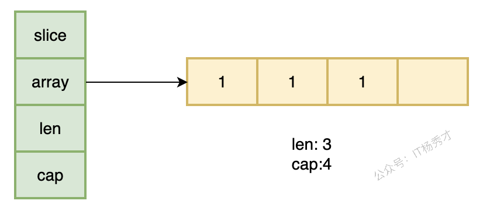
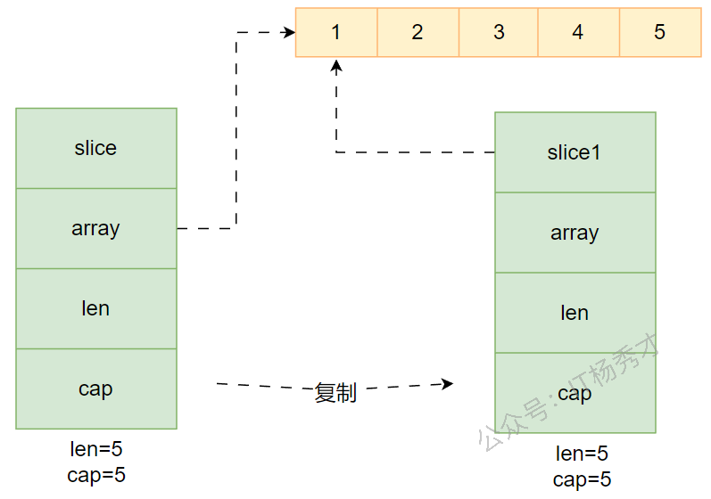
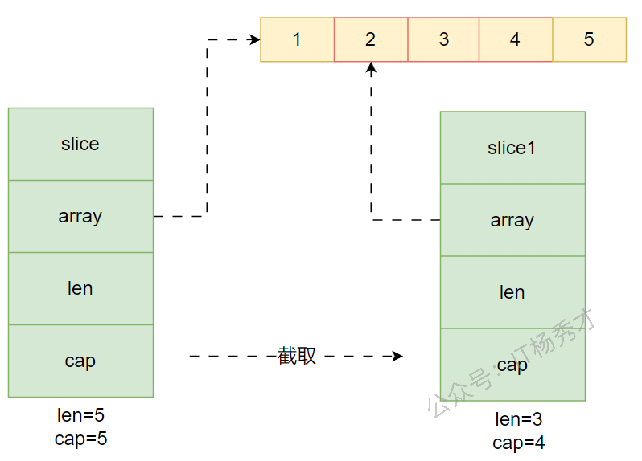
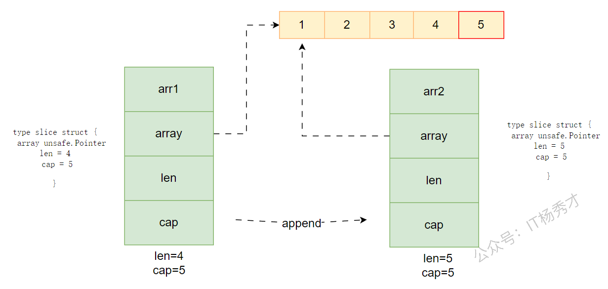
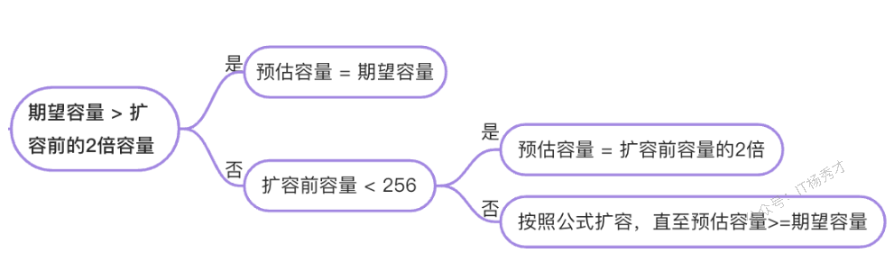

## 🗄️ 数组：固定长度的"储物柜"

### 📖 什么是数组？

在 **Go 语言**中，数组是一种固定长度的数据结构，它存储**相同类型**的元素。数组的长度在定义时就必须确定，并且之后不能改变。

想象一下，数组就像一个固定大小的储物柜，有着明确数量的格子，每个格子只能存放相同类型的物品。一旦这个储物柜建好了，格子的数量就不能改变了。

### 📝 如何定义数组

在 **Go 语言**中，定义数组有多种方式：

```go
// 1. 最基础的定义方式
var scores [3]int  // 定义一个能存放3个整数的数组

// 2. 定义时直接赋值
var prices = [3]float64{10.99, 20.99, 30.99}

// 3. 让编译器自动计算长度
names := [...]string{"张三", "李四", "王五"}

// 4. 指定特定位置的值
colors := [5]string{0: "红", 2: "蓝", 4: "绿"}  // [红 "" 蓝 "" 绿]
```

### ⚡ 数组的特点

1. **长度固定**：一旦定义，长度不可改变
2. **类型固定**：同一个数组只能存储相同类型的元素
3. **长度是类型的一部分**：`[3]int` 和 `[5]int` 是不同的类型

### 💻 实战小例子

```go
package main

import "fmt"

func main() {
    // 成绩管理系统
    var scores [5]int = [5]int{95, 89, 92, 88, 96}
    
    // 计算平均分
    sum := 0
    for _, score := range scores {
        sum += score
    }
    average := float64(sum) / float64(len(scores))
    fmt.Printf("平均分：%.2f\n", average)
}
```

运行结果：
```
平均分：92.00
```

---

## 🧩 切片是什么

如果说数组是固定大小的储物柜，那么切片就像是一个可以随时扩展的**"魔法储物柜"**。它的大小是可以动态调整的，这让我们在处理不确定数量的数据时更加灵活。

当你在开发中需要存储**动态数量**的元素时，数组就无法满足了。例如：
- 存储用户列表，但用户数量不确定
- 处理用户输入的数据，数量未知
- 需要频繁添加或删除元素

这时，切片（Slice）就派上用场了！

Go 语言中切片是对数组的抽象。

Go 数组的长度不可改变，在特定场景中这样的集合就不太适用。Go 提供了一种灵活、功能强悍的内置类型切片（"动态数组"）。与数组相比，切片的长度是不固定的，可以追加元素，在追加时还可能触发扩容。切片可以理解为对底层数组的一个动态视图。Go 切片有三个属性：**指针**（pointer，指向底层数组中切片起始位置）、**长度**（len）和**容量**（cap，表示从起始位置到底层数组末尾的容量）。

**核心特点：**

- 切片就像数组的引用。切片并不存储任何数据，它只是描述了底层数组中的一段。
- 更改切片的元素会修改其底层数组中对应的元素。
- 和它共享底层数组的切片都会观测到这些修改。

---

## 🛠️ 切片的声明与创建

- **声明切片**：**`var identifier []type`**，此时为 nil 切片（还未指向数组）

- **创建切片**

  - **截取数组**

    - **`arr[startIndex:endIndex]`** ：将 arr 中从下标 startIndex 到 endIndex-1 下的元素创建为一个新的切片
    - 默认 `startIndex` 时表示从 arr 的第一个元素开始
    - 默认 `endIndex` 时表示一直到 arr 的最后一个元素

    ```go
    arr := [5]int{1, 2, 3, 4, 5}
    s := arr[1:4]  // s = [2 3 4]，len=3，cap=4
    ```

  - **使用 `make` 函数**

    - **`make([]var_type, length)`**
    - **`make([]var_type, length, capacity)`**

    ```go
    var slice1 []type = make([]type, len)
    // 也可以简写为
    slice1 := make([]type, len)
    ```

  - **字面量初始化**：**`s := []string{"Go", "Rust", "Java"}`**

  - **通过切片 s 初始化切片 s1**：**`s1 := s[startIndex:endIndex]`**

### 🔑 切片的三个核心概念

切片有三个核心概念，需要深入理解：

1. **指针**：指向底层数组的第一个可见元素
2. **长度**：切片当前的元素个数（`len`）
3. **容量**：从切片起始位置到底层数组末尾的元素个数（`cap`）

在运行时里，切片底层可以抽象成下面这个结构：

```go
type slice struct {
    array unsafe.Pointer
    len   int
    cap   int
}
```

<div align="center">
  
</div>

其中：

- **`array`**：指向一块连续的底层数组
- **`len`**：当前切片里实际可访问的元素个数
- **`cap`**：从切片起始位置到底层数组末尾，可容纳的元素个数

**注意：** `cap` 一定大于等于 `len`。当 `cap > len` 时，说明后面还有预留空间，只是这部分元素暂时不属于当前切片。

```go
package main

import "fmt"

func main() {
    s := []int{1, 2, 3, 4, 5}
    fmt.Printf("长度: %d, 容量: %d\n", len(s), cap(s))
    
    // 从数组创建切片
    arr := [5]int{1, 2, 3, 4, 5}
    slice := arr[1:4]  // [2 3 4]
    fmt.Printf("切片: %v, 长度: %d, 容量: %d\n", slice, len(slice), cap(slice))
}
```

运行结果：
```
长度: 5, 容量: 5
切片: [2 3 4], 长度: 3, 容量: 4
```

### 🛠️ 切片的创建方式

```go
// 1. 直接创建
fruits := []string{"苹果", "香蕉", "橙子"}

// 2. 使用 make 函数创建
numbers := make([]int, 3, 5)  // 长度为 3，容量为 5 的切片

// 3. 从数组创建
arr := [5]int{1, 2, 3, 4, 5}
slice := arr[1:4]  // [2 3 4]
```

### ⚠️ 切片的注意事项

1. **切片是引用类型**：多个切片可能共享同一个底层数组
2. **`append` 可能触发扩容**：`append` 可能导致重新分配内存，生成新的底层数组
3. **使用 make 创建切片时**：可以指定容量来减少内存重新分配的次数

---



nil 切片与空切片是不同的：

- nil 切片 ：不会创建底层数组，指针为 nil
- 空切片 ：会创建一个空的底层数组（长度为 0），指针指向一个特殊的内存地址（通常是 runtime.zerobase）



---

## ⚙️ 基本操作

### ✂️ 切片截取

切片底层是一块连续的内存空间，所以和数组一样，也可以通过下标范围来截取。

截取规则是**前闭后开**：

- **`s[i:j]`** 包含下标 `i`
- **`s[i:j]`** 不包含下标 `j`

```go
package main

import "fmt"

func main() {
    arr1 := []int{1, 2, 3, 4, 5, 6, 7, 8}
    arr2 := arr1[2:4] // 前闭后开，不包含下标 4
    fmt.Printf("arr1=%v, cap=%d\n", arr1, cap(arr1))
    fmt.Printf("arr2=%v, cap=%d\n", arr2, cap(arr2))
    arr2[0] = 100
    fmt.Printf("arr1=%v, cap=%d\n", arr1, cap(arr1))
    fmt.Printf("arr2=%v, cap=%d\n", arr2, cap(arr2))
}
```

运行结果：

```go
arr1=[1 2 3 4 5 6 7 8], cap=8
arr2=[3 4], cap=6
arr1=[1 2 100 4 5 6 7 8], cap=8
arr2=[100 4], cap=6
```

从这个例子可以看出两点：

- **新切片的容量**：从新切片起始元素开始，一直到原底层数组末尾
- **新切片共享原底层数组**：所以修改 `arr2[0]` 会直接影响 `arr1`

### 🔄 追加元素

```go
func append(s []T, vs ...T) []T
```

- **`s`** 是一个元素类型为 **`T`** 的切片
- 其余类型为 **`T`** 的值将会追加到该切片的末尾。

### 🔍 遍历元素

```go
func main() {
      for i, v := range pow {
           fmt.Printf("2**%d = %d\n", i, v)
      }
}
```

**`for`** 循环的 **`range`** 形式可遍历切片或映射。

当使用 **`for`** 循环遍历切片时，每次迭代都会返回两个值。 

- 第一个值为当前元素的下标
- 第二个值为该下标所对应元素的一份副本。

注意事项

- 可以将下标或值赋予 **`_`** 来忽略它。

```go
for i := range pow {
                pow[i] = 1 << uint(i) // == 2**i
        }
for _, value := range pow {
                fmt.Printf("%d\n", value)
        }
```



在循环中 append 的陷阱（ **`for-range`** 每次迭代都使用同一个变量）

在 Go 的 **`for i, v := range slice`** 循环中：

- **`v`** 是 **每次循环复用的同一个变量**，只是其值在变。
- 所以 **`&v`** 每次取的其实是 **同一个地址**。
- 所以你 **`append(&v)`** 多次，实际上是把 **相同地址的指针**添加了多次。

错误示例

```go
func example5() {
    slice := []int{1, 2, 3}
    newSlice := make([]*int, 0)

    for _, v := range slice {
        newSlice = append(newSlice, &v) // 错误：所有指针都指向同一个变量
    }
}
```

正确示例

定义一个局部变量来捕获每个元素

```go
func solution5() {
    slice := []int{1, 2, 3}
    newSlice := make([]*int, 0)
    
    for _, v := range slice {
        value := v // 创建新变量
        newSlice = append(newSlice, &value)
    }
}
```




### 🗑️ 删除元素

Go 没有内置的删除元素语法，需要手动实现

- 删除尾部元素：移动尾部指针

```go
a = a[:len(a)-1]   // 删除尾部 1 个元素
a = a[:len(a)-N]   // 删除尾部 N 个元素
```

- 删除首部元素：移动首部指针

```go
a = a[1:] // 删除开头 1 个元素
a = a[N:] // 删除开头 N 个元素
```

- 删除中间元素（第i个元素）

```go
a = append(a[:i], a[i+1:]...) // 删除中间 1 个元素
a = append(a[:i], a[i+N:]...) // 删除中间 N 个元素
```

### 📏 获取长度和容量

切片是可索引的，并且可以由 **`len()`** 方法获取长度。

切片提供了计算容量的方法 **`cap()`** 可以测量切片最长可以达到多少。

- **`func len(var_name []T)`**
- **`func cap(var_name []T)`**

### 📋 复制切片

```go
func copy(dst, src []T) int
```

- **`dst`** ：目标切片（目标空间）。

- **`src`** ：源切片（被复制的数据源）。

- 返回值：成功复制的元素数量（即 **`min(len(dst), len(src))`**）。

先看最容易混淆的一点：**`slice` 的赋值复制**和**数组的赋值复制**并不一样。

```go
package main

import "fmt"

func main() {
    arr1 := []int{1, 2, 3, 4, 5}
    arr2 := arr1
    arr2[0] = 100
    fmt.Printf("arr1=%v\n", arr1)
    fmt.Printf("arr2=%v\n", arr2)

    arr3 := [3]int{1, 2, 3}
    arr4 := arr3
    arr4[0] = 100
    fmt.Printf("arr3=%v\n", arr3)
    fmt.Printf("arr4=%v\n", arr4)
}
```

运行结果：

```go
arr1=[100 2 3 4 5]
arr2=[100 2 3 4 5]
arr3=[1 2 3]
arr4=[100 2 3]
```

这说明：

- **切片赋值**：复制的是切片头部结构，底层数组仍然共享
- **数组赋值**：复制的是整块数组数据，互不影响

如果你只是写出 `b := a`，复制的并不是底层数组，而只是切片头部结构，因此两个切片仍然会共享同一块底层内存。

```go
func main() {
    arr1 := []int{1, 2, 3, 4, 5}
    arr2 := arr1
    arr2[0] = 100
    fmt.Printf("arr1=%v\n", arr1)
    fmt.Printf("arr2=%v\n", arr2)
}
```

运行结果：
```go
arr1=[100 2 3 4 5]
arr2=[100 2 3 4 5]
```

<div align="center">
  
</div>

如果你想要一份真正独立的新切片，就需要先分配新空间，再用 `copy` 复制内容：

```go
func main() {
    arr := []int{1, 2, 3, 4}
    arr1 := make([]int, 3)
    cnt := copy(arr1, arr)
    fmt.Printf("cnt=%d\n", cnt)
    fmt.Printf("arr1=%v\n", arr1)
}
```

运行结果：
```go
cnt=3
arr1=[1 2 3]
```

这里返回的 `cnt` 表示实际复制的元素个数，也就是 `min(len(dst), len(src))`。

### 🔓 切片展开

在 Go 里，**`...`** 主要有 **两个核心用途**，意义完全取决于它出现的位置

#### 🔀 可变参数

表示**可变参数**（variadic parameter），也就是这个参数可以接收**任意数量**的值。

```go
func sum(nums ...int) int {
    total := 0
    for _, n := range nums {
        total += n
    }
    return total
}

func main() {
    fmt.Println(sum(1, 2))        // 3
    fmt.Println(sum(1, 2, 3, 4)) // 10
}
```

#### 📤 切片展开

表示**展开切片**（slice expansion），把切片里的元素依次当作独立的参数传入。

```go
func printAll(a ...string) {
    for _, s := range a {
        fmt.Println(s)
    }
}

func main() {
    words := []string{"Go", "is", "cool"}
    printAll(words...) // 展开切片传入
}
```

**`append`** 中表示把一个切片的元素依次追加/传入

```go
a := []int{1, 2}
b := []int{3, 4}
a = append(a, b...) // 把 b 展开后追加到 a
fmt.Println(a) // [1 2 3 4]
```

---

## 🛠️ `slice` 和 `slice` 指针的区别

- 当 slice 作为函数参数时，就是一个普通的结构体。在调用者看来，实参 slice 并不会被函数中的操作改变
- 当 slice 指针作为函数参数，在调用者看来，是会被改变原 slice 的。

值得注意的是，不管传的是 slice 还是 slice 指针，如果改变了 slice 底层数组的数据，都会反映到实参 slice 的底层数据。因为底层数据在 slice 结构体里本来就是一个指针。即使 slice 结构体自身没有被替换，仍然可以通过这个底层数组指针修改元素内容。

- 传 slice 和 slice 指针，如果对 slice 数组里面的数据做修改，都会改变 slice 底层数据
- 传 slice 是拷贝，在函数内部修改，不会修改 slice 的结构，**`len`** 和 **`cap`** 不变；传 slice 指针时，则可以直接修改其 slice 结构。

因此要想真的改变外层 slice，只有将返回的新的 slice 赋值到原始 slice，或者向函数传递一个指向 slice 的指针。

---

## ⚙️ nil 切片、值为 nil 的切片与空切片

- **nil 切片**：底层指向数组为 nil，常见于声明阶段 **`var s []int`**
- **空切片**：底层指向数组为空数组（非 nil），常见于初始化阶段 **`s := []int{}`**

---

## ⚠️ 踩坑实录总结

### 🔧 误用slice预分配空间

下面代码预期创建**容量**为2的[]int，实际创建了**长度**为2的[]int。

```go
package main

import "fmt"

func main() {
    a := make([]int, 2)
    a = append(a, 1)
    a = append(a, 1)
    fmt.Println(a)
}
// 运行结果
[0 0 1 1]

Process finished with the exit code 0
```

**问题原因：**

`make()` 函数可以创建 slice：

- **`make([]T, length, capacity)`**：创建初始容量为 capacity、初始长度为 length（用零值填充）、类型为 `[]T` 的 slice
- **`make([]T, length)`**：创建初始长度为 length（用零值填充）、类型为 `[]T` 的 slice

**`length`** 表示初始长度，也就是 slice 已经包含数据的个数，默认会用零值填充；

**`capacity`** 表示初始容量，也就是 slice 当前最多可容纳的数据个数，满足一定条件后会自动扩容。

**更准确的写法：** 如果你只是想预留容量，而不是先放入零值元素，就应该把长度设为 `0`：

```go
func main() {
    a := make([]int, 0, 2)
    a = append(a, 1)
    a = append(a, 1)
    fmt.Println(a)
}
```

### 🔄 注意slice和底层数组的关系

slice底层数据结构：

- **`array`** ：用于存储数据，指向一块连续的内存空间；
- **`len`** ：大小，表示已存储数据的数量；
- **`cap`** ：容量，表示连续内存空间的大小

对数组进行截取操作后赋值给切片（并没有拷贝），与原数组共用内存空间，所以修改切片也会修改原数组对应的数据。

使用 **`append`** 添加数据后，触发扩容产生新的array，与原数组不是同一个内存空间，所以修改原数组不会对切片产生影响。

<div align="center">
  
</div>

### ❓ 从一个切片截取另一个切片，修改新切片的值会影响原来的切片内容吗？

**答案：** 会影响，因为两个切片共享同一个底层数组。

**分析：**

当从一个切片截取另一个切片时，新切片和原切片会共享同一个底层数组。这是因为切片的本质是对底层数组的一个视图，它包含三个字段：指向底层数组的指针、长度和容量。

```go
// 示例代码
func main() {
    // 创建一个原始切片
    original := []int{1, 2, 3, 4, 5}
    // 从原始切片截取一个新切片
    newSlice := original[1:4] // 新切片包含元素 [2, 3, 4]
    
    // 修改新切片的值
    newSlice[0] = 10
    
    // 打印原始切片
    fmt.Println(original) // 输出: [1 10 3 4 5]
}
```

在上面的例子中，当我们修改新切片 `newSlice` 的第一个元素时，原始切片 `original` 的对应元素也被修改了。这是因为两个切片共享同一个底层数组，修改其中一个会影响另一个。

**注意：** 如果对新切片进行 `append` 操作，当容量不足时会触发扩容，此时新切片会指向一个新的底层数组，与原切片不再共享内存，修改新切片就不会影响原切片了。

```go
// 示例代码
func main() {
    // 创建一个原始切片，长度和容量都是3
    original := []int{1, 2, 3}
    // 从原始切片截取一个新切片，长度为2，容量为2
    newSlice := original[0:2] // 新切片包含元素 [1, 2]
    
    // 对新切片进行append操作，触发扩容
    newSlice = append(newSlice, 4, 5, 6)
    
    // 修改新切片的值
    newSlice[0] = 10
    
    // 打印原始切片
    fmt.Println(original) // 输出: [1 2 3]，不受影响
    // 打印新切片
    fmt.Println(newSlice) // 输出: [10 2 4 5 6]
}
```

在这个例子中，当对新切片进行 `append` 操作时，由于容量不足触发了扩容，新切片指向了一个新的底层数组，所以修改新切片不会影响原切片。

---

## 🔬 底层原理

### 🧱 数据结构
切片的底层结构体如下：

```go
type slice struct {
    ptr *T
    len int
    cap int
}
```
<div align="center">
  
</div>


### 🧩 slice 追加扩容

切片是一个小结构体，`append` 又是值传递，所以每次调用 `append` 时，复制的是切片头，不是底层数组本身。

如果多个切片头仍然指向同一块底层数组，而且容量还够，那么后续 `append` 很可能直接写到同一块数组里，互相覆盖。

```go
package main

import "fmt"

func main() {
    arr1 := make([]int, 0, 4)
    arr1 = append(arr1, 1)
    arr2 := append(arr1, 2)
    arr3 := append(arr1, 3)
    fmt.Printf("arr1=%v, addr1=%p\n", arr1, &arr1)
    fmt.Printf("arr2=%v, addr2=%p\n", arr2, &arr2)
    fmt.Printf("arr3=%v, addr3=%p\n", arr3, &arr3)
}
```

运行结果：

```go
arr1=[1], addr1=0xc000098060
arr2=[1 3], addr2=0xc000098078
arr3=[1 3], addr3=0xc000098090
```

#### 🤔 为什么 arr2 和 arr3 都是 [1,3]？

从运行结果可以看到，`arr2` 和 `arr3` 的值都是 `[1,3]`，而不是预期的 `arr2=[1,2]` 和 `arr3=[1,3]`。原因就在于它们共享同一块底层数组。

#### 💡 执行过程详解

让我们逐步分析代码的执行过程：

**步骤 1：创建切片**

```go
arr1 := make([]int, 0, 4)
```

- 创建一个长度为 0、容量为 4 的切片
- 底层数组：`[_, _, _, _]`（未初始化）
- arr1：`len=0, cap=4`

**步骤 2：追加元素 1**

```go
arr1 = append(arr1, 1)
```

- 底层数组：`[1, _, _, _]`
- arr1：`len=1, cap=4`，值为 `[1]`

**步骤 3：追加元素 2（关键！）**

```go
arr2 := append(arr1, 2)
```

- **append 是值传递**，返回一个新的 slice 结构体
- 新的 slice 结构体（arr2）：
  - `ptr`：指向同一个底层数组
  - `len`：2（arr1.len + 1）
  - `cap`：4
- 底层数组变为：`[1, 2, _, _]`
- arr2：`len=2, cap=4`，值为 `[1, 2]`
- **注意**：arr1 的 len 仍然是 1，值为 `[1]`

**步骤 4：追加元素 3（问题出现！）**

```go
arr3 := append(arr1, 3)
```

- arr1 的 `len=1, cap=4`
- append 在 arr1 的基础上追加，会在底层数组的**第 2 个位置**写入 3
- **关键**：这个位置原本是 arr2 写入的 2！
- 底层数组变为：`[1, 3, _, _]`（2 被 3 覆盖了！）
- arr3：`len=2, cap=4`，值为 `[1, 3]`
- **副作用**：arr2 也指向这个底层数组，所以 arr2 也变成了 `[1, 3]`！

#### 📐 内存变化示意图

```
初始状态：
底层数组: [_, _, _, _]
arr1: ptr → 底层数组, len=0, cap=4

执行 arr1 = append(arr1, 1):
底层数组: [1, _, _, _]
arr1: ptr → 底层数组, len=1, cap=4, 值=[1]

执行 arr2 := append(arr1, 2):
底层数组: [1, 2, _, _]
arr1: ptr → 底层数组, len=1, cap=4, 值=[1]
arr2: ptr → 底层数组, len=2, cap=4, 值=[1, 2]

执行 arr3 := append(arr1, 3):
底层数组: [1, 3, _, _]  ← 2 被 3 覆盖！
arr1: ptr → 底层数组, len=1, cap=4, 值=[1]
arr2: ptr → 底层数组, len=2, cap=4, 值=[1, 3]  ← 受影响！
arr3: ptr → 底层数组, len=2, cap=4, 值=[1, 3]
```

<div align="center">
  
</div>

#### ⚠️ 关键要点

1. **append 返回新 slice 结构体**：每次 append 都会返回一个新的 slice 结构体，但它们**共享底层数组**

2. **len 决定可见范围**：arr1 的 len=1，所以 arr1 只能看到第一个元素 `[1]`

3. **append 写入位置**：append 在 `arr1[len]` 的位置写入新元素，即底层数组的第 2 个位置

4. **共享底层数组的副作用**：多个 slice 共享同一个底层数组时，一个 slice 的修改会影响其他 slice

#### ✅ 正确写法

如果希望 arr2 和 arr3 独立，应该使用**完整切片表达式**或**复制**：

**方法 1：使用完整切片表达式**

```go
arr2 := append(arr1[:1:1], 2)  // 限制容量为 1，强制扩容
arr3 := append(arr1[:1:1], 3)
```

**方法 2：使用 copy**

```go
arr2 := make([]int, len(arr1))
copy(arr2, arr1)
arr2 = append(arr2, 2)

arr3 := make([]int, len(arr1))
copy(arr3, arr1)
arr3 = append(arr3, 3)
```

Go 语言内置函数 append 参数是值传递，所以 append 函数在追加新元素到切片时，append 会生成一个新切片，并且将原切片的值拷贝到新切片。注意这里的新切片并不是指底层的数据结构，而是指 `slice` 这个结构体。所以我们每调用一次 append 函数，都会产生一个新的 slice 结构体，但是他们底层都指向同一块连续的内存区域，即共享底层数组，这里 `arr2` 原本追加的是 `2`，但随后 `arr3 := append(arr1, 3)` 复用了同一块底层数组，把对应位置覆盖成了 `3`。

### 📈 扩容机制

当容量不足时，Go 会创建一个新的底层数组，把老数据拷贝过去，然后返回新的切片头。

#### ⏮️ Go 1.18之前

```go
// src/runtime/slice.go

func growslice(et *_type, old slice, cap int) slice {
    // ...

    newcap := old.cap
    doublecap := newcap + newcap
    if cap > doublecap {
        newcap = cap
    } else {
        if old.cap < 1024 {
            newcap = doublecap
        } else {
            // Check 0 < newcap to detect overflow
            // and prevent an infinite loop.
            for 0 < newcap && newcap < cap {
                newcap += newcap / 4
            }
            // Set newcap to the requested cap when
            // the newcap calculation overflowed.
            if newcap <= 0 {
                newcap = cap
            }
        }
    }

    // ...

    return slice{p, old.len, newcap}
}
```

- 扩容逻辑
  - 请求的容量大于当前容量的两倍则扩容到请求的容量
  - 若请求的容量小于当前容量的两倍
    - 当前容量小于1024 时扩容到原来的两倍
    - 当前容量大于 1024 时扩容到原来的1.25倍

#### ⏭️ Go 1.18之后

```go
// src/runtime/slice.go

func growslice(et *_type, old slice, cap int) slice {
    // ...

    newcap := old.cap
    doublecap := newcap + newcap
    if cap > doublecap {
        newcap = cap
    } else {
        const threshold = 256
        if old.cap < threshold {
            newcap = doublecap
        } else {
            // Check 0 < newcap to detect overflow
            // and prevent an infinite loop.
            for 0 < newcap && newcap < cap {
                // Transition from growing 2x for small slices
                // to growing 1.25x for large slices. This formula
                // gives a smooth-ish transition between the two.
                newcap += (newcap + 3*threshold) / 4
            }
            // Set newcap to the requested cap when
            // the newcap calculation overflowed.
            if newcap <= 0 {
                newcap = cap
            }
        }
    }

    // ...

    return slice{p, old.len, newcap}
}
```

**扩容逻辑：**

- 请求的容量大于当前容量的两倍则扩容到请求的容量
- 当前容量小于 256 时直接扩容到原来的两倍
- 当前容量大于 256 时逐步扩容，**逐步增加约 1.25 倍**。
- 除上述逻辑外，Go 还会根据切片中的元素大小对齐内存，因此扩容不总是精确的 2 倍或 1.25 倍

运行时源码里对应的平滑增长公式可以概括为：

```text
newcap = oldcap + (oldcap + 3*256) / 4
```

<div align="center">
  
</div>

简单看一个触发扩容的例子：

```go
package main

import "fmt"

func main() {
    arr := make([]int, 4, 4)
    fmt.Printf("cap = %d\n", cap(arr))
    arr = append(arr, 1)
    fmt.Printf("cap = %d\n", cap(arr))
}
```

运行结果：

```go
cap = 4
cap = 8
```

这个例子里容量从 `4` 扩到了 `8`，属于小切片场景下的直接翻倍。
