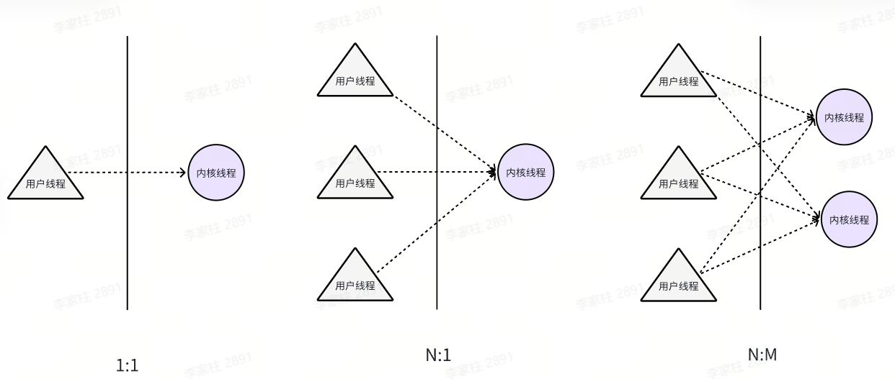
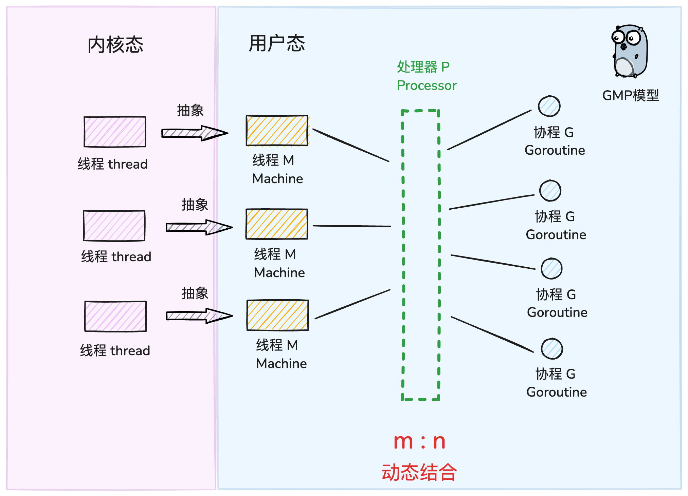
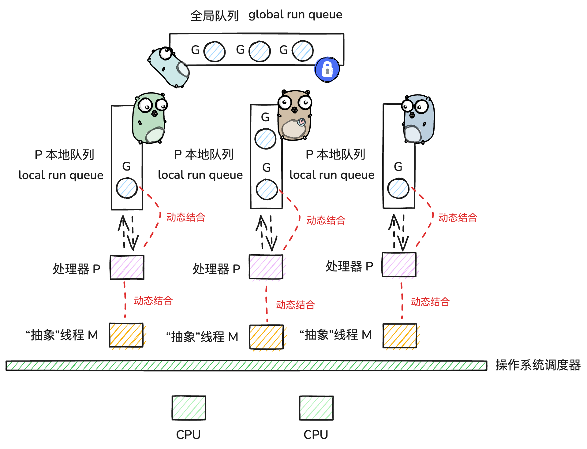

## 基本概念

- 进程：程序是指编译过的、可执行的二进制代码。进程指正在运行的程序。进程包括二进制镜像，加载到内存中，还涉及很多其他方面：虚拟内存实例、内核资源如打开的文件、安全上下文如关联的用户，以及一个或多个线程。
- 线程：线程是进程内的活动单元，每个线程包含自己的虚拟存储器，包括栈、进程状态如寄存器，以及指令指针。在单线程进程中，进程即线程，一个进程只有一个虚拟内存实例，一个虚拟处理器。在多线程的进程中，一个进程有多个线程，由于虚拟内存是和进程关联的，所有线程会共享相同的内存地址空间
- 协程：协程可以理解为一种轻量级线程，与线程相比，协程不受操作系统调度。协程调度器完全由用户应用程序提供，协程调度器按照调度策略把协程调度到线程中运行。

## Goroutine

> 传统的线程调度有以下问题：
>
> - 资源消耗大：每个线程需要 2MB-8MB 栈空间、创建和销毁需要大量系统调用
> - 性能开销高：频繁的用户态/内核态切换、上下文切换成本高（寄存器、缓存、TLB）
> - 编程复杂：需要手动管理线程生命周期、同步原语（锁、信号量）使用复杂

goroutine 是由 Go runtime 管理的轻量级线程。

- 轻量级：Go runtime 管理的用户级线程，初始栈空间 2KB（线程 1MB+），支持百万级创建，启动销毁成本低。
- 高效调度机制：Go runtime 负责调度，上下文切换延迟 0.2 微秒（线程 1-2 微秒），仅保存必要寄存器状态。
- 灵活内存管理：动态栈设计（2KB-1GB），按需伸缩，包含程序计数器、栈空间、调度状态等基础功能

### 具体使用

在调用函数的时候在前面加上go关键字，就可以为一个函数创建一个goroutine。

```Go
func hello() {
    fmt.Println("Hello Goroutine!")
}

func main() {
    hello()
    fmt.Println("main goroutine done!")
}

func main1() {
    go hello() // 启动一个goroutine去执行hello函数
    fmt.Println("main goroutine done!")
}

func main2() {
    go hello()
    fmt.Println("main goroutine done!")
    time.Sleep(time.Second) // 等待hello函数返回
}
```

在程序启动时，Go程序就会为main()函数创建一个默认的goroutine。当main()函数返回的时候该goroutine就结束了，所有在main()函数中启动的goroutine会一同结束，所以在实际使用goroutine时需要特别注意其调度。

在循环中创建goroutine时需要尤其注意，goroutine 会捕获循环变量的引用，而非值。若循环内未正确处理，所有 goroutine 可能最终使用同一变量的最终值（而非各自迭代时的值）。

解决方案

- 通过参数传递数据到协程

```Go
func hello(i int) {
    fmt.Println("Hello Goroutine!", i)
}

func main() {
    for i := 0; i < 10; i++ {
        go func(idx int) {
            hello(idx)
        }(i)
    }
    time.Sleep(time.Second)
}
```

- 定义临时变量

```Go
func hello(i int) {
    fmt.Println("Hello Goroutine!", i)
}

func main() {
    for i := 0; i < 10; i++ {
        val := i
        go func() {
            hello(val)
        }()
    }
    time.Sleep(time.Second)
}
```

### 调度模型

线程模型：根据运行的环境和调度者的身份，线程可分为用户级线程和内核级线程，用户级线程在用户态创建、同步和销毁，由**线程库**来调度。内核级线程则运行在内核空间，由**内核**来调度，在有的系统上也称为LWP(轻量级进程）。当进程的一个内核级线程获得CPU的使用权时，它就加载并运行一个用户级线程，可见，内核级线程相当于用户级线程的容器，一个进程可以拥有M个用户级线程和N个内核级线程。按照M:N的取值，可分为三种线程模型

- N:1 模型：即N个用户线程对应1个内核级线程。该模型完全在用户空间实现，线程库负责管理所有的执行线程，比如线程的优先级、时间片等。线程库利用longjmp来切换线程的执行，使得看起来像是并发执行，但实际上内核仍然是把整个进程作为最小单元调度的，该进程的所有执行线程共享进程的时间片，对外表现出相同的优先级。
  - 优点：线程切换在用户态完成，创建和调度线程都无需内核的干预，不会对系统性能造成明显的影响
  - 缺点：对于多处理器系统，一个进程的多个线程无法运行在不同的CPU上，无法充分利用CPU多核的算力。一个线程阻塞，所有用户线程都挂起
- 1:1 模型：即每个用户级线程对应一个内核级线程例如 **`Java Thread`** 。该模型完全由内核创建和调度线程，用户空间的线程库不需要进行进程管理。
  - 优点：充分利用CPU的算力资源，支持多核
  - 缺点：开销大，线程切换要陷入内核导致线程上下文切换较慢，数量上限受内核限制
- N:M 模型：即前两种模型的结合，M个用户线程对应N个内核级线程的双层调度模式。该模式内核调度M个内核线程，线程库调度N个用户线程。Go语言采用这种模型
  - 优点：充分结合前两种模式的优点，不但不过分消耗内核资源，而且线程切换速度也比较快，充分利用多处理器的优势 
  - 缺点：该模型的调度算法复杂。



### GMP模型



**`gmp = goroutine(G) + machine(M) + processor(P)`**

- **`M(machine)`** : 工作线程，由内核进行调度，m 需要和 p 进行结合，从而进入到 gmp 调度体系之中
- **`P(processor)`** : Go定义的一个抽象概念，包含运行Go代码的必要资源，也有调度goroutine的能力，可以理解为 m 的执行代理。
  - m 需要与 p 绑定后，才会进入到 gmp 调度模式当中；因此 p 的数量决定了 g 最大并行数量
  - p 是 g 的存储容器，其自带一个本地 g 队列（local run queue，简称 lrq），承载着一系列等待被调度的 g
- **`G(goroutine)`** : Go协程，通过go关键字会创建一个协程，有自己的运行栈、生命周期状态、以及执行的任务函数



我们可以把 gmp 理解为一个任务调度系统.

- g 就是这个系统中所谓的 **任务** ，是一种需要被分配和执行的“资源”
- m 就是这个系统中的”引擎“，当 m 和 p 结合后，就限定了**引擎**的运行是围绕着 gmp 这条轨道进行的，使得**引擎**运行着两个周而复始、不断交替的步骤——寻找任务（执行g0），执行任务（执行g）
- p 就是这个系统中的”中枢“，当其和作为”引擎“ 的 m 结合后，才会引导**引擎**进入 gmp 的运行模式；同时 p 也是这个系统中存储“任务”的“容器”，为“引擎”提供了用于执行的任务资源.





上图中有三个工作线程M，每个工作线程M持有一个处理器P，并且每个M持有一个协程G正在运行。每个处理器P持有一个运行队列，包含待调度的协程G，除此以外，还会有一个全局的队列，包含待调度的协程，被多个处理器P共享。

## 锁

### 互斥锁sync.Mutex

互斥锁保证同一时间**只有一个 goroutine** 能进入临界区，适合**写多读少**的场景。

```go
var mu sync.Mutex
mu.Lock()
// 临界区
mu.Unlock()
```

注意事项

- 避免重复加锁而不解锁
- 锁未释放前再次访问需要该锁的代码
- 避免对未锁定的互斥锁解锁（会导致panic）
- goroutine被加锁后需要及时解锁否则其他goroutine无法拿到锁

### 读写锁sync.RWMutex

读写锁指读操作和写操作分开,可以分别对读操作和写操作进行加锁,一般用在大量读操作少量写操作的情况

```go
var rw sync.RWMutex
rw.RLock()   // 读锁
rw.RUnlock() // 读操作

rw.Lock()    // 写锁
rw.Unlock()  // 写操作
```

读写锁的使用有以下几个原则

- 同时只有一个 goroutine 能获得写锁,
- 同时可以有多个 goroutine 获得读锁,
- 同时只能存在写锁定和读锁定,

通俗理解就是可以多个goroutine同时读,但是只有一个goroutine能写,共享资源要么在被一个或多个goroutine读
取,要么在被一个goroutine写入,读写不能同时进行。

## 并发操作

### 一次执行sync.Once

保证某个操作**只会执行一次**，并且是并发安全的。无论有多少个 goroutine 同时调用它，都不会重复执行。

常用于单例模式、初始化资源等。

```go
var once sync.Once
once.Do(func() {
    fmt.Println("只执行一次")
})
```

核心方法

```go
func (o *Once) Do(f func())
```

- `f`：要执行的一段函数
- 多个 goroutine 并发调用 `Do` 时，只有 **第一次** 调用会执行 `f`，后面的调用会直接跳过。
- 保证了**并发安全**（内部用了互斥锁和标志位）。

注意事项

- **`Do`** 里传入的函数**必须是幂等的**（即多次调用不会出错），虽然它理论上只执行一次，但业务逻辑最好可重复。
- 不能在 `Do` 的函数里再次调用同一个 **`once.Do`**（会死锁）。
- 不能直接复制 **`sync.Once`**，应始终用指针或包级变量。

###  条件变量sync.Cond

**`sync.Cond`** 是 Go 里的**条件变量**，用来在多个 goroutine 之间进行 **等待** 和 **通知**。
 它本身不控制互斥，而是依赖于一个锁（ **`sync.Mutex`** 或 **`sync.RWMutex`**）来保护共享状态。

简单来说：

> 当某个条件不满足时，goroutine 可以等待；
>  当另一个 goroutine 改变了条件并发出信号，等待的 goroutine 才会继续执行。

创建条件变量

```go
cond := sync.NewCond(&sync.Mutex{})
```

| 方法                   | 作用                                                         |
| ---------------------- | ------------------------------------------------------------ |
| **`cond.Wait()`**      | 等待条件成立，释放锁并阻塞，直到被 `Signal()` 或 `Broadcast()` 唤醒，然后会重新加锁返回。 |
| **`cond.Signal()`**    | 唤醒**一个**正在等待的 goroutine。                           |
| **`cond.Broadcast()`** | 唤醒**所有**正在等待的 goroutine。                           |

生产者-消费者示例

```go
package main

import (
    "fmt"
    "sync"
)

var (
    mu   sync.Mutex
    cond = sync.NewCond(&mu)
    data []int
)

func producer() {
    for i := 1; i <= 5; i++ {
        mu.Lock()
        data = append(data, i)
        fmt.Println("生产:", i)
        cond.Signal() // 通知一个等待的消费者
        mu.Unlock()
    }
}

func consumer(id int) {
    for {
        mu.Lock()
        for len(data) == 0 { // 条件不满足，等待
            cond.Wait()
        }
        x := data[0]
        data = data[1:]
        fmt.Printf("消费者%d 消费: %d\n", id, x)
        mu.Unlock()
    }
}

func main() {
    go consumer(1)
    go consumer(2)

    producer()
}
```

注意事项

- **必须配合锁使用**：`Wait()` 调用前需要加锁，它会在内部自动释放锁并阻塞，唤醒后会重新加锁。
- **要用循环检查条件**：因为即使被唤醒，条件也可能依旧不满足（虚假唤醒）。

### 原子操作sync/atomic

所谓原子操作就是这一系列的操作在cpu上执行是一个不可分割的整体,显然要要么全部执行,要么全部不执行,不会受到其他操作的影响,也就不会存在并发问题。

- 提供无锁的原子操作，比如原子加减、交换、比较并交换（CAS）。
- 适合需要高性能并发计数、标志位控制的场景。

```go
import "sync/atomic"

var counter int64
atomic.AddInt64(&counter, 1)
```

常见方法

```go
func AddT(addr *T,delta T)(new T) // 原子地将 delta 加到 *addr 上，并返回更新后的新值。
func storeT(addr *T, val T) // 原子地将 val 存储到 *addr，替代直接赋值 *addr = val，保证写入在并发下可见。
func LoadT(addr *T)(val T) // 原子地读取 *addr 的值，保证读到的是一致的有效数据（避免竞争条件）。
func swapT(addr *T, new T)(old T) // 原子地将 *addr 设置为 new，并返回原先的旧值。
func compareAndswapT(addr *T,old, new T)(swapped bool) // 比较 *addr 是否等于 old，如果相等则原子地更新为 new，返回 true；否则返回 false。
```

T的类型是 **`int32`** 、**`int64`** 、**`uint32`** 、**`uint64`** 和 **`uintptr`** 中的任意一种。

