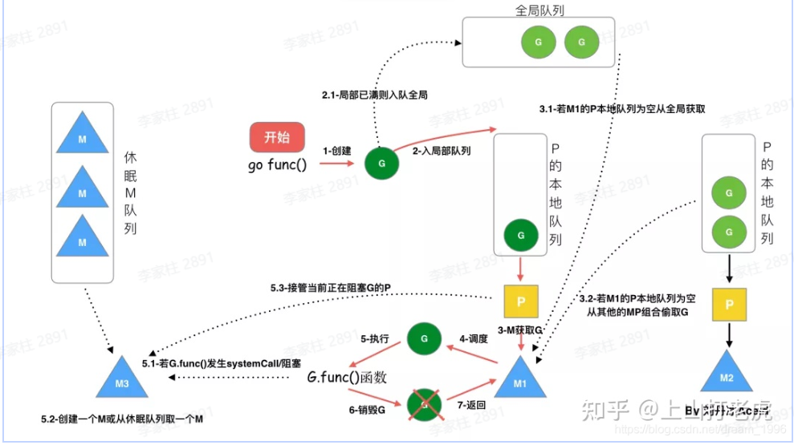
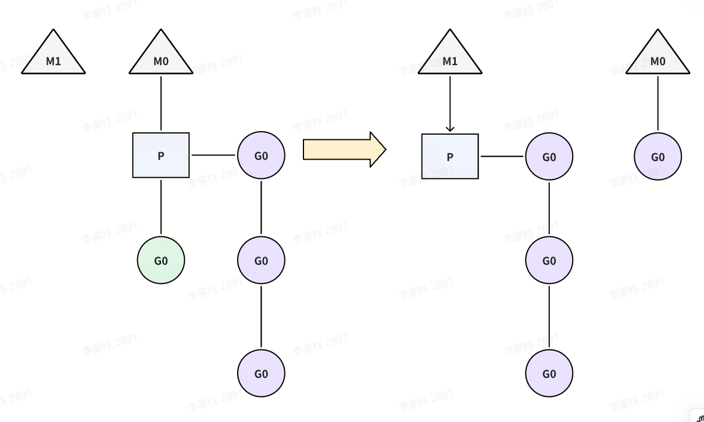
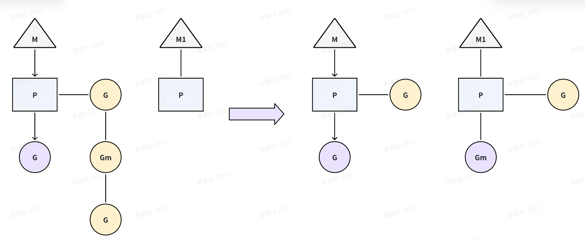
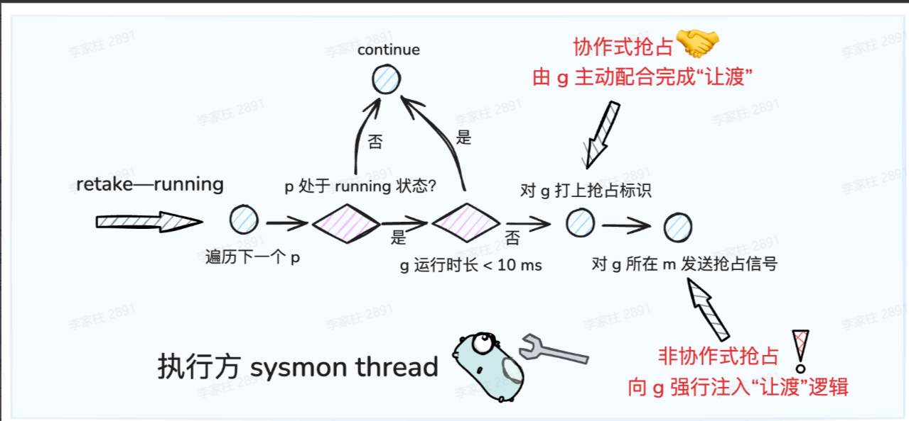
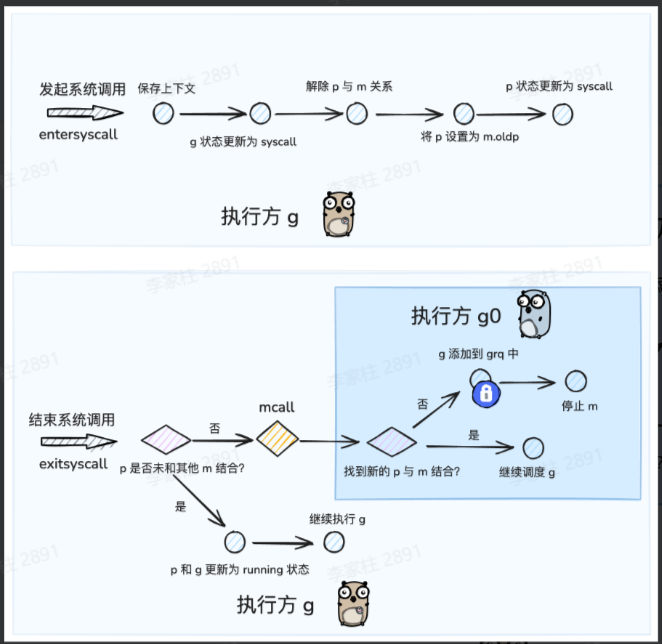
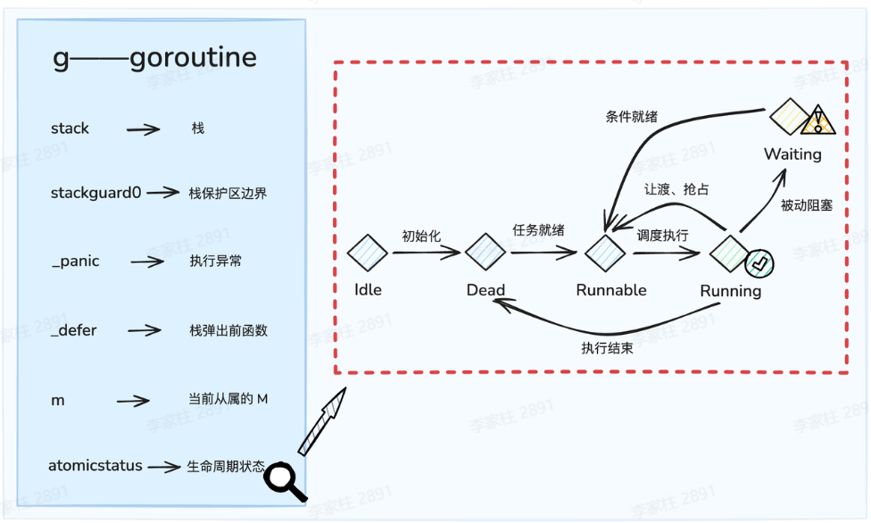
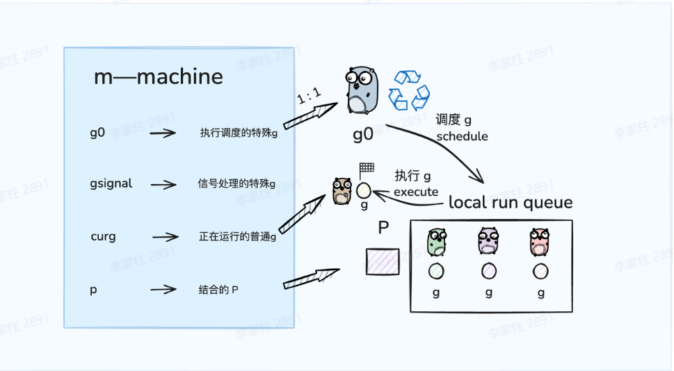

## 基本概念

- 进程：程序是指编译过的、可执行的二进制代码。进程指正在运行的程序。进程包括二进制镜像，加载到内存中，还涉及很多其他方面：虚拟内存实例、内核资源如打开的文件、安全上下文如关联的用户，以及一个或多个线程。
- 线程：线程是进程内的活动单元，每个线程包含自己的虚拟存储器，包括栈、进程状态如寄存器，以及指令指针。在单线程进程中，进程即线程，一个进程只有一个虚拟内存实例，一个虚拟处理器。在多线程的进程中，一个进程有多个线程，由于虚拟内存是和进程关联的，所有线程会共享相同的内存地址空间
- 协程：协程可以理解为一种轻量级线程，与线程相比，协程不受操作系统调度。协程调度器完全由用户应用程序提供，协程调度器按照调度策略把协程调度到线程中运行。

## Goroutine

> 传统的线程调度有以下问题：
>
> - 资源消耗大：每个线程需要 2MB-8MB 栈空间、创建和销毁需要大量系统调用
> - 性能开销高：频繁的用户态/内核态切换、上下文切换成本高（寄存器、缓存、TLB）
> - 编程复杂：需要手动管理线程生命周期、同步原语（锁、信号量）使用复杂

goroutine 是由 Go runtime 管理的轻量级线程。

- 轻量级：Go runtime 管理的用户级线程，初始栈空间 2KB（线程 1MB+），支持百万级创建，启动销毁成本低。
- 高效调度机制：Go runtime 负责调度，上下文切换延迟 0.2 微秒（线程 1-2 微秒），仅保存必要寄存器状态。
- 灵活内存管理：动态栈设计（2KB-1GB），按需伸缩，包含程序计数器、栈空间、调度状态等基础功能

### 具体使用

在调用函数的时候在前面加上go关键字，就可以为一个函数创建一个goroutine。

```Go
func hello() {
    fmt.Println("Hello Goroutine!")
}

func main() {
    hello()
    fmt.Println("main goroutine done!")
}

func main1() {
    go hello() // 启动一个goroutine去执行hello函数
    fmt.Println("main goroutine done!")
}

func main2() {
    go hello()
    fmt.Println("main goroutine done!")
    time.Sleep(time.Second) // 等待hello函数返回
}
```

在程序启动时，Go程序就会为main()函数创建一个默认的goroutine。当main()函数返回的时候该goroutine就结束了，所有在main()函数中启动的goroutine会一同结束，所以在实际使用goroutine时需要特别注意其调度。

在循环中创建goroutine时需要尤其注意，goroutine 会捕获循环变量的引用，而非值。若循环内未正确处理，所有 goroutine 可能最终使用同一变量的最终值（而非各自迭代时的值）。

解决方案

- 通过参数传递数据到协程

```Go
func hello(i int) {
    fmt.Println("Hello Goroutine!", i)
}

func main() {
    for i := 0; i < 10; i++ {
        go func(idx int) {
            hello(idx)
        }(i)
    }
    time.Sleep(time.Second)
}
```

- 定义临时变量

```Go
func hello(i int) {
    fmt.Println("Hello Goroutine!", i)
}

func main() {
    for i := 0; i < 10; i++ {
        val := i
        go func() {
            hello(val)
        }()
    }
    time.Sleep(time.Second)
}
```

### 调度模型

线程模型：根据运行的环境和调度者的身份，线程可分为用户级线程和内核级线程，用户级线程在用户态创建、同步和销毁，由**线程库**来调度。内核级线程则运行在内核空间，由**内核**来调度，在有的系统上也称为LWP(轻量级进程）。当进程的一个内核级线程获得CPU的使用权时，它就加载并运行一个用户级线程，可见，内核级线程相当于用户级线程的容器，一个进程可以拥有M个用户级线程和N个内核级线程。按照M:N的取值，可分为三种线程模型

- N:1 模型：即N个协程对应1个内核级线程。该模型完全在用户空间实现，线程库负责管理所有的执行线程，比如线程的优先级、时间片等。线程库利用longjmp来切换线程的执行，使得看起来像是并发执行，但实际上内核仍然是把整个进程作为最小单元调度的，该进程的所有执行线程共享进程的时间片，对外表现出相同的优先级。
  - 优点：线程切换在用户态完成，创建和调度线程都无需内核的干预，不会对系统性能造成明显的影响
  - 缺点
    - 对于多处理器系统，一个进程的多个线程无法运行在不同的CPU上，无法充分利用CPU多核的算力。
    - 1个进程的所有协程都绑定在1个线程上，一旦某协程阻塞，造成线程阻塞，本进程的其他协程都无法执行了，无并发能力
- 1:1 模型：即每个用户级线程对应一个内核级线程例如 **`Java Thread`** 。该模型完全由内核创建和调度线程，用户空间的线程库不需要进行进程管理。
  - 优点：充分利用CPU的算力资源，支持多核
  - 缺点：开销大，线程切换要陷入内核导致线程上下文切换较慢，数量上限受内核限制
- N:M 模型：即前两种模型的结合，M个用户线程对应N个内核级线程的双层调度模式。该模式内核调度M个内核线程，线程库调度N个用户线程。Go语言采用这种模型
  - 优点：充分结合前两种模式的优点，不但不过分消耗内核资源，而且线程切换速度也比较快，充分利用多处理器的优势 
  - 缺点：该模型的调度算法复杂。


### GMP模型

#### 为什么需要P——Go1.1之前的GM模型

在 Go 1.1版本之前，其实用的就是GM模型。

- **G**：协程，通常在代码里用  **`go`** 关键字执行一个方法，那么就等于起了一个 **`G`** 。
- **M**，内核线程，操作系统内核其实看不见 **`G`** 和 **`P`** ，只知道自己在执行一个线程。**`G`** 和 **`P`** 都是在**用户层**上的实现。

除了 **`G`** 和 **`M`** 以外，还有一个**全局协程队列**，这个全局队列里放的是多个处于**可运行状态**的 **`G`** 。**`M`** 如果想要获取 **`G`** ，就需要访问一个**全局队列**。同时，内核线程`M`是可以同时存在多个的，因此访问时还需要考虑**并发**安全问题。因此这个全局队列有一把**全局的大锁**，每次访问都需要去获取这把大锁。并发量小的时候还好，当并发量大了，这把大锁，就成为了**性能瓶颈**。

#### 调度模型


**`gmp = goroutine(G) + machine(M) + processor(P)`**

- **`M(machine)`** : OS线程抽象，代表着真正执行计算的资源，由内核进行调度，**`M`** 需要和 **`P`** 进行结合，从而进入到GMP调度体系之中
- **`P(processor)`** : Go定义的一个抽象概念，包含运行Go代码的必要资源，也有调度goroutine的能力，可以理解为 **`M`** 的执行代理。对**`G`** 来说，P相当于CPU核，**`G`** 只有绑定到 **`P`** (在P的local runq中)才能被调度。对M来说，P提供了相关的执行环境(Context)，如内存分配状态(mcache)，任务队列(G)等，P的数量决定了系统内最大可并行的G的数量（前提：物理CPU核数 >= P的数量），P的数量由用户设置的 **`GOMAXPROCS`** 决定，但是不论 **`GOMAXPROCS`** 设置为多大，P的数量最大为256
  - **`M`** 需要与 **`P`** 绑定后，才会进入到 gmp 调度模式当中；因此P的数量决定了G最大并行数量
  - **`P`** 是 **`G`** 的存储容器，其自带一个本地 g 队列（ **`local run queue`** ），承载着一系列等待被调度的G
- **`G(goroutine)`** : Go协程，通过go关键字会创建一个协程，有自己的运行栈、生命周期状态、以及执行的任务函数。G并非执行体，每个G需要绑定到P才能被调度执行。



我们可以把GMP理解为一个任务调度系统.

- G就是这个系统中所谓的 **任务** ，是一种需要被分配和执行的“资源”
- M就是这个系统中的”引擎“，当M和P结合后，就限定了**引擎**的运行是围绕着GMP这条轨道进行的，使得**引擎**运行着两个周而复始、不断交替的步骤——寻找任务（执行g0），执行任务（执行g）
- P就是这个系统中的”中枢“，当其和作为”引擎“ 的M结合后，才会引导**引擎**进入GMP的运行模式；同时 p 也是这个系统中存储“任务”的“容器”，为“引擎”提供了用于执行的任务资源。

P和M的数量

- P的数量：由启动时环境变量 **`$GOMAXPROCS`** 或者是由 **`runtime`** 的方法 **`GOMAXPROCS()`**决定。这意味着在程序执行的任意时刻都只有 **`$GOMAXPROCS`** 个goroutine在同时运行。
- M的数量
  -  go语言本身的限制：go程序启动时，会设置M的最大数量，默认10000.但是内核很难支持这么多的线程数，所以这个限制可以忽略。
  - runtime/debug中的 **`SetMaxThreads`** 函数，设置M的最大数量
  - 一个M阻塞了，会创建新的M。

M0和G0

- **`M0`** 是启动程序后的编号为0的主线程，这个M对应的实例会在全局变量 **`runtime.m0`** 中，不需要在heap上分配，M0负责执行初始化操作和启动第一个G（main）， 在之后M0就和其他的M一样了。
- **`G0`** 是每次启动一个M都会第一个创建的goroutine，G0仅用于负责调度的G，G0不指向任何可执行的函数, 每个M都会有一个自己的G0。在调度或系统调用时会使用G0的栈空间, 全局变量的G0是M0的G0




上图中有三个工作线程M，每个工作线程M持有一个处理器P，并且每个M持有一个协程G正在运行。每个处理器P持有一个运行队列，包含待调度的协程G，除此以外，还会有一个全局的队列，包含待调度的协程，被多个处理器P共享。

通常而言，每个处理器P上的协程G，若要创建新的协程，新创建的协程会放入到本地的运行队列中。当本地的队列满了，或者阻塞的协程被唤醒，协程会被放到全局的队列中。处理器P除了会消费本地队列中的协程P以外，还会周期性的消费全局队列中的协程G，避免全局队列中的协程P“饿死”。

#### 调度策略



- 队列轮转：每个处理器P维护一个待调度协程G的队列，依次调度协程G到M中执行。同时，每个P会周期性的查看全局队列中的待运行协程G，防止全局队列中的G长时间得不到调度机会而饿死。

- 系统调用：当线程执行系统调用的时候，可能会被阻塞。对应到调度器模型中，如果一个协程G发起了系统调用被阻塞时，对应处理器P的运行队列就会被阻塞，整个队列中的所有协程都会被阻塞。如图所示，当绿色的协程G0发生系统调用，M0将释放P，进而冗余的M1将会获取P，继续执行P队列中剩下的待调度的协程G。M0由于系统调用，陷入阻塞。M1可能来自于缓存池，也可能是新创建的，当G0结束系统调用时，M0会根据是否可以获取到P，而对M0进行不同的处理，如果获取到P，则继续执行；如果没获取到，则将G0放入全局队列等待调度，M0将进入缓存池休眠。

- 协程窃取：每个协程中产生的新协程，会被优先调度到本地的运行队列中，因此可能会出现，部分处理器P本地队列很大，部分处理器本地队列很小甚至为空的情况，因此go调度器实现了当处理器p本地队列为空时，窃取别的队列中的协程G的策略。如图所示，M1对应的本地队列为空，此时它会查看全局队列中是否有协程需要调度，如果也没有，则会从别的正在运行的P中窃取一半的协程G，窃取结果如图所示。、

  

  - **避免 P/M 空转** ：保证所有核都能被充分利用。
  - **任务分布均衡** ：防止某个 P 堆积大量 goroutine，拖慢调度。
  - **减少全局锁竞争** ：大多数情况下 P 直接用本地队列，只有偷任务或全局队列时才涉及共享资源。

- 抢占式调度：为避免某个协程长时间执行，而阻碍别的协程被调度，监控线程sysmons会监控每个协程的运行时间，一旦运行时间过长（超过10ms）且有其他协程在等待时，会将运行中的协程暂停，转而调度等待的协程，达到类似于时间片轮转的效果





为什么P的逻辑不加在M上？

主要还是因为 **`M`** 其实是**内核**线程，内核只知道自己在跑线程，而`golang`的运行时（包括调度，垃圾回收等）其实都是**用户空间**里的逻辑。操作系统内核哪里还知道，也不需要知道用户空间的golang应用的内部。这一切逻辑交给应用层自己去做就好，毕竟改内核线程的逻辑也不合适啊。



#### hand off机制

设计背景：在 GMP 模型中 **M（线程）** 要绑定 **P（处理器）** 才能执行 G（goroutine）。但在某些情况下，M 无法继续运行了。例如：当前 goroutine 调用了 **阻塞系统调用**（例如 **`syscall`**、阻塞 I/O）。当前 M 被阻塞住，无法再继续执行 P 上的其他 G。这时候，如果不做处理会导致这个 M 被卡住，它绑定的 **P 就会闲置**，导致其他 G 不能被调度执行。所以为了避免浪费 CPU 核心资源，Go 调度器会触发 **handoff 机制**。

**hand off机制** ：将发起 syscall 的 g 和 m 绑定，但是解除 p 与 m 的绑定关系，使得此期间 p 存在和其他 m 结合的机会。保证这个 P 上的 G 还能继续被执行。



- 原本持有 P 的 M（被阻塞）会失去 P（解除P和M的调用关系）
- 调度器会找一个新的或空闲的 M，把 P 分配给它。
- 新的 M 继续负责运行 P 队列里的 goroutine。



GMP 调度过程中存在哪些阻塞

- I/O，select
- block on syscall
- channel
- 等待锁
- runtime.Gosched()



#### 监控线程

**`sysmon`** 也叫监控线程，变动的周期性检查，主要作用

- 释放闲置超过5 分钟的 span 物理内存；
- 如果超过2 分钟没有垃圾回收，强制执行；
- 将长时间未处理的 netpoll 添加到全局队列；
- 向长时间运行的 G 任务发出抢占调度(超过10ms的 g，会进行 retake)；
- 收回因 syscall 长时间阻塞的 P

#### 底层数据结构

**G**



```go
// 一个 goroutine 的具象类
type g struct{
    // g 的执行栈空间
    stack       stack   
    /*
        栈空间保护区边界，用于探测是否执行栈扩容
        在 g 超时抢占过程中，用于传递抢占标识
    */
    stackguard0 uintptr
    // ...

    // 记录 g 执行过程中遇到的异常    
    _panic    *_panic 
    // g 中挂载的 defer 函数，是一个 LIFO 的链表结构
    _defer    *_defer 

    // g 从属的 m
    m         *m      
    // ...  
    /*
        g 的状态
        // g 实例刚被分配还未完成初始化
        _Gidle = iota // 0

        // g 处于就绪态.  可以被调度 
        _Grunnable // 1

        // g 正在被调度运行过程中
        _Grunning // 2

        // g 正在执行系统调用
        _Gsyscall // 3

        // g 处于阻塞态，需要等待其他外部条件达成后，才能重新恢复成就绪态
        _Gwaiting // 4

        // 生死本是一个轮回. 当 g 调度结束生命终结，或者刚被初始化准备迎接新生前，都会处于此状态
        _Gdead // 6
    */
    atomicstatus uint32
    // ...
    // 进入全局队列 grq 时指向相邻 g 的 next 指针
    schedlink    guintptr
    // ...
}
```

**M**

```go
type m struct{
    // 用于调度普通 g 的特殊 g，与每个 m 一一对应
    g0      *g     
    // ...
    // m 的唯一 id
    procid        uint64
    // 用于处理信号的特殊 g，与每个 m 一一对应
    gsignal       *g              
    // ...
    // m 上正在运行的 g
    curg          *g       
    // m 关联的 p
    p             puintptr 
    // ...
    // 进入 schedt midle 链表时指向相邻 m 的 next 指针 
    schedlink     muintptr
    // ...
}
```



**P**

```go
type p struct{
    id          int32
    /*
        p 的状态
        // p 因缺少 g 而进入空闲模式，此时会被添加到全局的 idle p 队列中
        _Pidle = iota // 0

        // p 正在运行中，被 m 所持有，可能在运行普通 g，也可能在运行 g0
        _Prunning // 1

        // p 所关联的 m 正在执行系统调用. 此时 p 可能被窃取并与其他 m 关联
        _Psyscall // 2

        // p 已被终止
        _Pdead // 4
    */
    status      uint32// one of pidle/prunning/...
    // 进入 schedt pidle 链表时指向相邻 p 的 next 指针
    link        puintptr        
    // ...
    // p 所关联的 m. 若 p 为 idle 状态，可能为 nil
    m           muintptr   // back-link to associated m (nil if idle)


    // lrq 的队首
    runqhead uint32
    // lrq 的队尾
    runqtail uint32
    // q 的本地 g 队列——lrq
    runq     [256]guintptr
    // 下一个调度的 g. 可以理解为 lrq 中的特等席
    runnext guintptr
    // ...
}
```

**schedule**

```go
// 全局调度模块
type schedt struct{
    // ...
    // 互斥锁
    lock mutex

    // 空闲 m 队列
    midle        muintptr // idle m's waiting for work
    // ...
    // 空闲 p 队列
    pidle      puintptr // idle p's
    // ...

    // 全局 g 队列——grq
    runq     gQueue
    // grq 中存量 g 的个数
    runqsize int32
    // ...
}
```


## 锁

### 互斥锁sync.Mutex

互斥锁保证同一时间**只有一个 goroutine** 能进入临界区，适合**写多读少**的场景。

```go
var mu sync.Mutex
mu.Lock()
// 临界区
mu.Unlock()
```

注意事项

- 避免重复加锁而不解锁
- 锁未释放前不能再次访问需要该锁的代码（mutex是不可重入锁，自己加锁后没有释放锁，继续加锁，就死锁了）
- 避免对未锁定的互斥锁解锁（会导致panic）
- goroutine被加锁后需要及时解锁否则其他goroutine无法拿到锁
- 如果要保证两个协程同一个锁，那么应该传递指针，不要拷贝mutex

#### 底层原理

```go
type Mutex struct{
    state int32
    sema uint32
}
```


### 读写锁sync.RWMutex

读写锁指读操作和写操作分开,可以分别对读操作和写操作进行加锁,一般用在大量读操作少量写操作的情况

```go
var rw sync.RWMutex
rw.RLock()   // 读锁
rw.RUnlock() // 读操作

rw.Lock()    // 写锁
rw.Unlock()  // 写操作
```

读写锁的使用有以下几个原则

- 同时只有一个 goroutine 能获得写锁,
- 同时可以有多个 goroutine 获得读锁,
- 同时只能存在写锁定和读锁定,

通俗理解就是可以多个goroutine同时读,但是只有一个goroutine能写,共享资源要么在被一个或多个goroutine读
取,要么在被一个goroutine写入,读写不能同时进行。

## 并发操作

### 一次执行sync.Once

保证某个操作**只会执行一次**，并且是并发安全的。无论有多少个 goroutine 同时调用它，都不会重复执行。

常用于单例模式、初始化资源等。

```go
var once sync.Once
once.Do(func() {
    fmt.Println("只执行一次")
})
```

核心方法

```go
func (o *Once) Do(f func())
```

- `f`：要执行的一段函数
- 多个 goroutine 并发调用 `Do` 时，只有 **第一次** 调用会执行 `f`，后面的调用会直接跳过。
- 保证了**并发安全**（内部用了互斥锁和标志位）。

注意事项

- **`Do`** 里传入的函数**必须是幂等的**（即多次调用不会出错），虽然它理论上只执行一次，但业务逻辑最好可重复。
- 不能在 `Do` 的函数里再次调用同一个 **`once.Do`**（会死锁）。
- 不能直接复制 **`sync.Once`**，应始终用指针或包级变量。

###  条件变量sync.Cond

**`sync.Cond`** 是 Go 里的**条件变量**，用来在多个 goroutine 之间进行 **等待** 和 **通知**。
 它本身不控制互斥，而是依赖于一个锁（ **`sync.Mutex`** 或 **`sync.RWMutex`**）来保护共享状态。

简单来说：

> 当某个条件不满足时，goroutine 可以等待；
>  当另一个 goroutine 改变了条件并发出信号，等待的 goroutine 才会继续执行。

创建条件变量

```go
cond := sync.NewCond(&sync.Mutex{})
```

| 方法                   | 作用                                                         |
| ---------------------- | ------------------------------------------------------------ |
| **`cond.Wait()`**      | 等待条件成立，释放锁并阻塞，直到被 `Signal()` 或 `Broadcast()` 唤醒，然后会重新加锁返回。 |
| **`cond.Signal()`**    | 唤醒**一个**正在等待的 goroutine。                           |
| **`cond.Broadcast()`** | 唤醒**所有**正在等待的 goroutine。                           |

生产者-消费者示例

```go
package main

import (
    "fmt"
    "sync"
)

var (
    mu   sync.Mutex
    cond = sync.NewCond(&mu)
    data []int
)

func producer() {
    for i := 1; i <= 5; i++ {
        mu.Lock()
        data = append(data, i)
        fmt.Println("生产:", i)
        cond.Signal() // 通知一个等待的消费者
        mu.Unlock()
    }
}

func consumer(id int) {
    for {
        mu.Lock()
        for len(data) == 0 { // 条件不满足，等待
            cond.Wait()
        }
        x := data[0]
        data = data[1:]
        fmt.Printf("消费者%d 消费: %d\n", id, x)
        mu.Unlock()
    }
}

func main() {
    go consumer(1)
    go consumer(2)

    producer()
}
```

注意事项

- **必须配合锁使用**：`Wait()` 调用前需要加锁，它会在内部自动释放锁并阻塞，唤醒后会重新加锁。
- **要用循环检查条件**：因为即使被唤醒，条件也可能依旧不满足（虚假唤醒）。

### 原子操作sync/atomic

所谓原子操作就是这一系列的操作在cpu上执行是一个不可分割的整体,显然要要么全部执行,要么全部不执行,不会受到其他操作的影响,也就不会存在并发问题。

- 提供无锁的原子操作，比如原子加减、交换、比较并交换（CAS）。
- 适合需要高性能并发计数、标志位控制的场景。

```go
import "sync/atomic"

var counter int64
atomic.AddInt64(&counter, 1)
```

常见方法

```go
func AddT(addr *T,delta T)(new T) // 原子地将 delta 加到 *addr 上，并返回更新后的新值。
func storeT(addr *T, val T) // 原子地将 val 存储到 *addr，替代直接赋值 *addr = val，保证写入在并发下可见。
func LoadT(addr *T)(val T) // 原子地读取 *addr 的值，保证读到的是一致的有效数据（避免竞争条件）。
func swapT(addr *T, new T)(old T) // 原子地将 *addr 设置为 new，并返回原先的旧值。
func compareAndswapT(addr *T,old, new T)(swapped bool) // 比较 *addr 是否等于 old，如果相等则原子地更新为 new，返回 true；否则返回 false。
```

T的类型是 **`int32`** 、**`int64`** 、**`uint32`** 、**`uint64`** 和 **`uintptr`** 中的任意一种。

## 通道Channel
