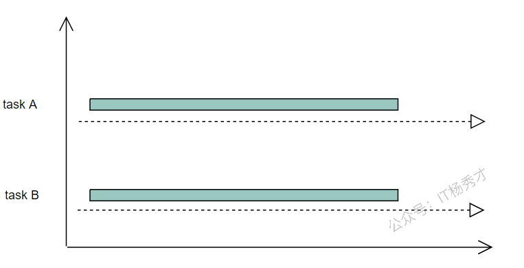
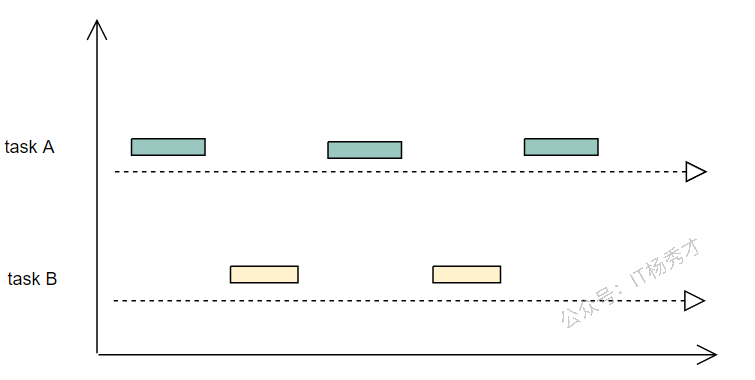

## 📝 基本概念

- 进程：程序是指编译过的、可执行的二进制代码。进程指正在运行的程序。进程包括二进制镜像，加载到内存中，还涉及很多其他方面：虚拟内存实例、内核资源如打开的文件、安全上下文如关联的用户，以及一个或多个线程。
- 线程：线程是进程内的活动单元，每个线程包含自己的虚拟存储器，包括栈、进程状态如寄存器，以及指令指针。在单线程进程中，进程即线程，一个进程只有一个虚拟内存实例，一个虚拟处理器。在多线程的进程中，一个进程有多个线程，由于虚拟内存是和进程关联的，所有线程会共享相同的内存地址空间
- 协程：协程可以理解为一种轻量级线程，与线程相比，协程不受操作系统调度。协程调度器完全由用户应用程序提供，协程调度器按照调度策略把协程调度到线程中运行。

---

## 🔄 并发与并行

很多开发者对于**并发**和**并行**的概念还比较模糊，其实只需要根据一点来判断即可：**能不能同时运行**。

- **并行**：两个任务能同时运行就是并行
- **并发**：不能同时运行，而是每个任务执行一小段，交叉执行，这种模式就是并发

<div align="center">
  
</div>

**并行**（Parallelism）：两个任务一直运行，切实同时运行着。要注意并行的话一定要有多个 CPU 核心的支持，因为只有一个 CPU 的话，同一时间只能跑一个任务。

<div align="center">
  
</div>

**并发**（Concurrency）：两个任务，每次只执行一小段，这样交叉的执行，就是并发模式。并发模式在单核 CPU 上是可以完成的。

---

## 🔒 互斥锁与读写锁

### 🔐 互斥锁sync.Mutex

互斥锁保证同一时间**只有一个 goroutine** 能进入临界区，适合**写多读少**的场景。

```go
var mu sync.Mutex
mu.Lock()
// 临界区
mu.Unlock()
```

**注意事项**：

- 避免重复加锁而不解锁
- 锁未释放前不能再次访问需要该锁的代码（mutex 是不可重入锁，自己加锁后没有释放锁，继续加锁，就死锁了）
- 避免对未锁定的互斥锁解锁（会导致 panic）
- goroutine 被加锁后需要及时解锁否则其他 goroutine 无法拿到锁
- 如果要保证两个协程同一个锁，那么应该传递指针，不要拷贝 mutex

### 💀 死锁

提到锁，就有一个绕不开的话题：**死锁**。死锁就是一种状态，当两个或以上的 **goroutine** 在执行过程中，因争夺共享资源处在互相等待的状态，如果没有外部干涉将会一直处于这种阻塞状态。

**死锁场景一：Lock/Unlock 不成对**

最常见的场景就是对锁进行拷贝使用：

```go
package main

import (
    "fmt"
    "sync"
)

func main() {
    var mu sync.Mutex
    mu.Lock()
    defer mu.Unlock()
    copyMutex(mu)
}

func copyMutex(mu sync.Mutex) {
    mu.Lock()
    defer mu.Unlock()
    fmt.Println("ok")
}
```

运行结果：
```
fatal error: all goroutines are asleep - deadlock!
```

如果将带有锁结构的变量赋值给其他变量，锁的状态会复制。复制后的新锁拥有了原来的锁状态，那么在 `copyMutex` 函数内执行 `mu.Lock()` 的时候会一直阻塞，因为外层的 `main` 函数已经 `Lock()` 了一次，但是并没有机会 `Unlock()`，导致内层函数会一直等待 `Lock()`，而外层函数一直等待 `Unlock()`，这样就造成了死锁。

**死锁场景二：循环等待**

A 等 B，B 等 C，C 等 A，循环等待：

```go
package main

import (
    "sync"
    "time"
)

func main() {
    var mu1, mu2 sync.Mutex
    var wg sync.WaitGroup

    wg.Add(2)
    go func() {
        defer wg.Done()
        mu1.Lock()
        defer mu1.Unlock()
        time.Sleep(1 * time.Second)

        mu2.Lock()
        defer mu2.Unlock()
    }()

    go func() {
        defer wg.Done()
        mu2.Lock()
        defer mu2.Unlock()
        time.Sleep(1 * time.Second)
        mu1.Lock()
        defer mu1.Unlock()
    }()
    wg.Wait()
}
```

运行结果：
```
fatal error: all goroutines are asleep - deadlock!
```

两个 **goroutine**，一个先锁 `mu1`，再锁 `mu2`，另一个先锁 `mu2`，再锁 `mu1`，但是它们进行第二次加锁操作的时候，彼此等待对方释放锁，这样就造成了循环等待，一直阻塞，形成死锁。

**避免死锁的建议**：

- 尽量避免锁拷贝，并且保证 Lock() 和 Unlock() 成对出现
- 尽量养成如下使用习惯：
```go
mu.Lock()
defer mu.Unlock()
```

### 📖 读写锁sync.RWMutex

读写锁指读操作和写操作分开，可以分别对读操作和写操作进行加锁，一般用在**大量读操作、少量写操作**的情况。

```go
var rw sync.RWMutex
rw.RLock()   // 读锁
rw.RUnlock() // 读操作

rw.Lock()    // 写锁
rw.Unlock()  // 写操作
```

**读写锁的使用原则**：

1. 同时只有一个 goroutine 能够获得写锁
2. 同时可以有任意多个 goroutine 获得读锁
3. 同时只能存在写锁定和读锁定（读和写互斥）

通俗理解就是可以多个 **goroutine** 同时读，但是只有一个 **goroutine** 能写，共享资源要么在被一个或多个 **goroutine** 读取，要么在被一个 **goroutine** 写入，读写不能同时进行。

---

## ⏳ 等待组sync.WaitGroup

在 Go 语言并发编程中，经常需要等待多个 **goroutine** 执行完成。**`sync.WaitGroup`** 就是用于等待一组 **goroutine** 完成任务的同步原语。

`sync.WaitGroup` 是一个结构体，内部维护着一个计数器，通过三个方法配合使用：

| 方法 | 作用 |
|------|------|
| **`Add(delta int)`** | 计数器增加 delta |
| **`Done()`** | 计数器减 1，等价于 `Add(-1)` |
| **`Wait()`** | 阻塞当前协程，直到计数器归零 |

### 💡 基本使用

```go
package main

import (
    "fmt"
    "sync"
)

var wg sync.WaitGroup

func myGoroutine() {
    defer wg.Done()
    fmt.Println("myGoroutine!")
}

func main() {
    wg.Add(10)
    for i := 0; i < 10; i++ {
        go myGoroutine()
    }
    wg.Wait()
    fmt.Println("end!!!")
}
```

运行结果：
```
myGoroutine!
myGoroutine!
myGoroutine!
myGoroutine!
myGoroutine!
myGoroutine!
myGoroutine!
myGoroutine!
myGoroutine!
myGoroutine!
end!!!
```

**注意**：`sync.WaitGroup` 的计数器不能为负数，否则会 **panic**。

---

## ⏱️ 一次执行sync.Once

**`sync.Once`** 保证某个操作**只会执行一次**，并且是并发安全的。无论有多少个 goroutine 同时调用它，都不会重复执行。

常用于单例模式、配置文件加载等只需要执行一次的场景。

```go
var once sync.Once
once.Do(func() {
    fmt.Println("只执行一次")
})
```

**核心方法**：

```go
func (o *Once) Do(f func())
```

- `f`：要执行的函数
- 多个 goroutine 并发调用 `Do` 时，只有**第一次**调用会执行 `f`，后面的调用会直接跳过
- 保证了**并发安全**（内部用了互斥锁和标志位）

**注意事项**：

- **`Do`** 里传入的函数**必须是幂等的**（即多次调用不会出错）
- 不能在 `Do` 的函数里再次调用同一个 **`once.Do`**（会死锁）
- 不能直接复制 **`sync.Once`**，应始终用指针或包级变量

### 🔀 sync.Once 与 init() 的区别

有时候我们使用 **`init()`** 方法进行初始化。**`init()`** 方法是在其所在的 package 首次加载时执行的，而 **sync.Once** 可以在代码的任意位置初始化和调用，是在第一次用到它的时候才会初始化。

**`sync.Once`** 最大的作用就是**延迟初始化**。设想一下，如果是在程序刚开始就加载配置，若迟迟未被使用，则既浪费了内存，又延长了程序加载时间，而 **`sync.Once`** 就刚好解决了这个问题。

---

## 🔔 条件变量sync.Cond

**`sync.Cond`** 是 Go 里的**条件变量**，用来在多个 goroutine 之间进行**等待**和**通知**。它本身不控制互斥，而是依赖于一个锁（**`sync.Mutex`** 或 **`sync.RWMutex`**）来保护共享状态。

简单来说：

> 当某个条件不满足时，goroutine 可以等待；
> 当另一个 goroutine 改变了条件并发出信号，等待的 goroutine 才会继续执行。

### 🔧 创建条件变量

```go
cond := sync.NewCond(&sync.Mutex{})
```

| 方法 | 作用 |
|------|------|
| **`cond.Wait()`** | 等待条件成立，释放锁并阻塞，直到被 `Signal()` 或 `Broadcast()` 唤醒，然后会重新加锁返回 |
| **`cond.Signal()`** | 唤醒**一个**正在等待的 goroutine |
| **`cond.Broadcast()`** | 唤醒**所有**正在等待的 goroutine |

### 📋 生产者-消费者示例

```go
package main

import (
    "fmt"
    "sync"
)

var (
    mu   sync.Mutex
    cond = sync.NewCond(&mu)
    data []int
)

func producer() {
    for i := 1; i <= 5; i++ {
        mu.Lock()
        data = append(data, i)
        fmt.Println("生产:", i)
        cond.Signal()
        mu.Unlock()
    }
}

func consumer(id int) {
    for {
        mu.Lock()
        for len(data) == 0 {
            cond.Wait()
        }
        x := data[0]
        data = data[1:]
        fmt.Printf("消费者%d 消费: %d\n", id, x)
        mu.Unlock()
    }
}

func main() {
    go consumer(1)
    go consumer(2)

    producer()
}
```

**注意事项**：

- **必须配合锁使用**：`Wait()` 调用前需要加锁，它会在内部自动释放锁并阻塞，唤醒后会重新加锁
- **要用循环检查条件**：因为即使被唤醒，条件也可能依旧不满足（虚假唤醒）

---

## ⚛️ 原子操作sync/atomic

所谓**原子操作**就是这一系列的操作在 CPU 上执行是一个不可分割的整体，显然要么全部执行，要么全部不执行，不会受到其他操作的影响，也就不会存在并发问题。

- 提供无锁的原子操作，比如原子加减、交换、比较并交换（CAS）
- 适合需要高性能并发计数、标志位控制的场景

### 🔄 atomic 与 mutex 的区别

1. **使用方式**：通常 **mutex** 用于保护一段执行逻辑，而 **atomic** 主要是对变量进行操作
2. **底层实现**：**mutex** 由操作系统调度器实现，而 **atomic** 操作由底层硬件指令支持，保证在 CPU 上执行不中断。所以 **atomic** 的性能也能随 CPU 的个数增加线性提升

### 📜 常见方法

```go
func AddT(addr *T, delta T)(new T)        // 原子地将 delta 加到 *addr 上，并返回更新后的新值
func StoreT(addr *T, val T)               // 原子地将 val 存储到 *addr
func LoadT(addr *T)(val T)                // 原子地读取 *addr 的值
func SwapT(addr *T, new T)(old T)          // 原子地将 *addr 设置为 new，并返回原先的旧值
func CompareAndSwapT(addr *T, old, new T) // 比较 *addr 是否等于 old，如果相等则原子地更新为 new
```

T 的类型是 **`int32`**、**`int64`**、**`uint32`**、**`uint64`** 和 **`uintptr`** 中的任意一种。

### 💻 示例

```go
package main

import (
    "fmt"
    "sync"
    "sync/atomic"
)

func main() {
    var sum int32 = 0
    var wg sync.WaitGroup

    for i := 0; i < 100; i++ {
        wg.Add(1)
        go func() {
            defer wg.Done()
            atomic.AddInt32(&sum, 1)
        }()
    }
    wg.Wait()
    fmt.Printf("sum is %d\n", sum)
}
```

100 个 goroutine，每个 goroutine 都对 sum +1，最后结果为 100。

### 🎯 atomic.Value

上面展示的 **`AddT`**、**`StoreT`** 等方法都是针对基本数据类型做的操作。如果想对多个变量进行同步保护，例如对一个 **struct** 这样的复合类型用原子操作，Go 语言里的 **`atomic.Value`** 支持任意接口类型进行原子操作。

**`atomic.Value`** 提供了以下方法：

| 方法 | 作用 |
|------|------|
| **`Load()`** | 从 **Value** 读出数据 |
| **`Store(val any)`** | 向 **Value** 写入数据 |
| **`Swap(new any)`** | 用 **new** 交换 **Value** 中存储的数据，返回原先的旧数据 |
| **`CompareAndSwap(old, new any)`** | 比较 **Value** 中存储的数据和 **old** 是否相同，相同则替换为 **new**，返回 **true** |

```go
package main

import (
    "fmt"
    "sync/atomic"
)

type Student struct {
    Name string
    Age  int
}

func main() {
    st1 := Student{Name: "zhangsan", Age: 18}
    st2 := Student{Name: "lisi", Age: 19}
    st3 := Student{Name: "wangwu", Age: 20}

    var v atomic.Value
    v.Store(st1)
    fmt.Println(v.Load().(Student))

    old := v.Swap(st2)
    fmt.Printf("after swap: v=%v, old=%v\n", v.Load().(Student), old)

    swapped := v.CompareAndSwap(st1, st3) // v 中存储的和 st1 不相同，交换失败
    fmt.Printf("compare st1 and v: %v, %v\n", swapped, v.Load().(Student))

    swapped = v.CompareAndSwap(st2, st3) // v 中存储的和 st2 相同，交换成功
    fmt.Printf("compare st2 and v: %v, %v\n", swapped, v.Load().(Student))
}
```

运行结果：
```
{zhangsan 18}
after swap: v={lisi 19}, old={zhangsan 18}
compare st1 and v: false, {lisi 19}
compare st2 and v: true, {wangwu 20}
```

---

## 🗺️ 并发安全mapsync.Map

Go 语言内置的 **Map** 并不是并发安全的，在多个 **goroutine** 同时操作 **map** 的时候，会有并发问题。

### ⚠️ 普通 map 的并发问题

```go
package main

import (
    "fmt"
    "strconv"
    "sync"
)

var m = make(map[string]int)

func getVal(key string) int {
    return m[key]
}

func setVal(key string, value int) {
    m[key] = value
}

func main() {
    wg := sync.WaitGroup{}
    wg.Add(10)
    for i := 0; i < 10; i++ {
        go func(num int) {
            defer wg.Done()
            key := strconv.Itoa(num)
            setVal(key, num)
            fmt.Printf("key=%v, val=%v\n", key, getVal(key))
        }(i)
    }
    wg.Wait()
}
```

运行结果：
```
fatal error: concurrent map writes
```

程序报错了，说明 **map** 不能同时被多个 **goroutine** 读写。

### 🔐 解决方案一：使用互斥锁保护 map

```go
package main

import (
    "fmt"
    "strconv"
    "sync"
)

var m = make(map[string]int)
var mu sync.Mutex

func setVal(key string, value int) {
    mu.Lock()
    defer mu.Unlock()
    m[key] = value
}
```

### 🗺️ 解决方案二：使用 sync.Map

Go 语言 **sync** 包提供了开箱即用的并发安全版 **map**——**`sync.Map`**，在 Go 1.9 引入。**`sync.Map`** 不用初始化就可以使用，内置了诸多操作方法：

| 方法 | 作用 |
|------|------|
| **`Store(key, value)`** | 写入键值对 |
| **`Load(key)`** | 读取值，返回 `(value, ok)` |
| **`LoadOrStore(key, value)`** | 读取或写入，返回 `(value, loaded)` |
| **`Delete(key)`** | 删除键值对 |
| **`Range(f func(key, value) bool)`** | 遍历所有键值对 |

```go
package main

import (
    "fmt"
    "sync"
)

func main() {
    var m sync.Map

    // 写入
    m.Store("name", "zhangsan")
    m.Store("age", 18)

    // 读取
    age, _ := m.Load("age")
    fmt.Println(age.(int))

    // 遍历
    m.Range(func(key, value interface{}) bool {
        fmt.Printf("key=%v, val=%v\n", key, value)
        return true
    })

    // 删除
    m.Delete("age")
    age, ok := m.Load("age")
    fmt.Println(age, ok)

    // 读取或写入
    m.LoadOrStore("name", "zhangsan")
    name, _ := m.Load("name")
    fmt.Println(name)
}
```

运行结果：
```
18
key=name, val=zhangsan
key=age, val=18
<nil> false
zhangsan
```

**注意**：

- **`sync.Map`** 没有提供获取 **map** 数量的方法，需要在遍历时自行计算
- **`sync.Map`** 为了保证并发安全有一些性能损失，因此在非并发情况下，使用原生 **map** 相比使用 **sync.Map** 会有更好的性能

### 💡 sync.Map 特点

- **无锁读** ：大部分读操作无需加锁，通过原子操作直接访问 **`read`**，性能极高。
- **延迟删除** ：删除操作仅标记 **`entry`** 为 **`nil`** ，在 **`dirty`** 提升时才真正删除，减少锁竞争。
- **读写分离**：**`read`** 存储热点数据，**`dirty`** 存储最新数据，通过 **`amended`** 标记协调两者。
- **自动迁移**：当 **`misses`** 达到阈值时，**`dirty`** 自动提升为 **`read`**，后续写操作重建 **`dirty`**，避免 **`dirty`** 长期积累大量数据。

### 🔧 sync.Map 底层原理

#### 📊 数据结构

```go
type Map struct{
    mu Mutex                   // 保护 dirty 的互斥锁
    read atomic.Value          // 无锁读的 readOnly 结构
    dirty map[interface{}]*entry // 包含最新数据的 map
    misses int                 // 记录从 read 读取失败的次数
}

type readOnly struct {
    m       map[interface{}]*entry
    amended bool // 标记 dirty 中是否存在 read 中没有的键
}

type entry struct {
    p unsafe.Pointer // 指向 interface{} 类型的值
}
```

- **`read`** ：使用 **`atomic.Value`** 存储 **`readOnly`** 结构，支持无锁读操作。
- **`dirty`**：包含最新数据的普通哈希表，写操作优先更新此表，但需加锁。
- **`entry.p`** ：三种状态：
  1. 指向实际值：正常状态
  2. **`nil`** ：键被删除，但 **`dirty`** 中可能存在
  3. **`expunged`** ：键被彻底删除，仅存在于 **`read`** 中

#### ⬆️ dirty提升

用于将 **`dirty`** 哈希表中的数据同步到 **`read`** 视图，从而减少后续读操作的锁竞争。

当满足以下条件时，**`dirty`** 会被提升为新的 **`read`** ：

- **`read` 中找不到键**：读操作（如 **`Load`** ）在 **`read`** 中未找到目标键，且 **`amended=true`**（表示 **`dirty`** 包含新数据）。
- **misses 计数器达到阈值**：连续多次（次数等于 **`len(dirty)`** ）从 `dirty` 读取数据后，触发提升。

```go
func (m *Map) missLocked() {
    m.misses++
    if m.misses < len(m.dirty) {
        return
    }
    // 将 dirty 提升为 read
    m.read.Store(readOnly{m: m.dirty})
    m.dirty = nil
    m.misses = 0
}
```

- **复制 `dirty` 到 `read`**：将 **`dirty`** 的引用直接赋值给 **`read`**，并重置 **`amended`** 为 **`false`** 。
- **清空 `dirty`**：将 **`dirty`** 置为 **`nil`**，等待下次写操作时重建。
- **重置 `misses`**：计数器归零，准备下一轮统计。

#### 📖 读取流程

```go
func (m *Map) Load(key interface{}) (value interface{}, ok bool) {
    read, _ := m.read.Load().(readOnly)
    e, ok := read.m[key]
    if !ok && read.amended { // read 中不存在且 dirty 有新数据
        m.mu.Lock()
        // 双重检查，避免加锁前 dirty 已提升为 read
        read, _ = m.read.Load().(readOnly)
        e, ok = read.m[key]
        if !ok && read.amended {
            e, ok = m.dirty[key]
            m.missLocked() // 记录一次 miss
        }
        m.mu.Unlock()
    }
    if !ok {
        return nil, false
    }
    return e.load() // 从 entry 中加载值
}
```

- 优先从 **`read`** 无锁读取，若存在直接返回。
- 若 **`read`** 中不存在且 **`amended=true`**（表示 **`dirty`** 有新数据），加锁从 **`dirty`** 读取，并记录一次 **`miss`** 。
- 当 **`misses`** 累计达到 **`len(dirty)`** 时，触发 **`dirty`** 提升为 **`read`**，避免频繁加锁。

#### 💾 存储流程

```go
func (m *Map) Store(key, value interface{}) {
    read, _ := m.read.Load().(readOnly)
    if e, ok := read.m[key]; ok && e.tryStore(&value) {
        return // 若 read 中存在且未被标记为 expunged，直接更新
    }

    m.mu.Lock()
    read, _ = m.read.Load().(readOnly)
    if e, ok := read.m[key]; ok {
        if e.unexpungeLocked() { // 若 entry 被标记为 expunged，需恢复并加入 dirty
            m.dirty[key] = e
        }
        e.storeLocked(&value) // 更新 entry
    } else if e, ok := m.dirty[key]; ok {
        e.storeLocked(&value) // dirty 中存在，直接更新
    } else {
        if !read.amended { // 首次写入 dirty，需复制 read 中的所有未删除 entry
            m.dirtyLocked()
            m.read.Store(readOnly{m: read.m, amended: true})
        }
        m.dirty[key] = newEntry(value) // 将新 entry 加入 dirty
    }
    m.mu.Unlock()
}
```

- 尝试无锁更新 **`read`** 中的 **`entry`**（若存在且未被删除）。
- 若 **`read`** 中不存在或已被标记为 **`expunged`** ，加锁操作：
  - 若 **`dirty`** 中存在该键，直接更新。
  - 若 **`dirty`** 中不存在：
    - 首次写入 **`dirty`** 时，将 **`read`** 中所有未删除的 **`entry`** 复制到 **`dirty`** 。
    - 将新 **`entry`** 加入 **`dirty`**，并标记 **`amended=true`** 。

#### 🗑️ 删除流程

```go
func (m *Map) Delete(key interface{}) {
    read, _ := m.read.Load().(readOnly)
    e, ok := read.m[key]
    if !ok && read.amended {
        m.mu.Lock()
        read, _ = m.read.Load().(readOnly)
        e, ok = read.m[key]
        if !ok && read.amended {
            delete(m.dirty, key) // 直接从 dirty 中删除
        }
        m.mu.Unlock()
    } else if ok {
        e.delete() // 标记 entry 为 nil（逻辑删除）
    }
}
```

- 若 **`read`** 中存在该键，标记 **`entry.p=nil`**（逻辑删除）。
- 若 **`read`** 中不存在且 **`amended=true`**，加锁从 **`dirty`** 中物理删除该键。

**💡 面试要点：sync.Map 的适用场景**

- 读多写少
- key 集合相对稳定
- 写多读少时性能不如加锁的 map

---

## 🏊 对象池sync.Pool

**`sync.Pool`** 是在 **sync** 包下的一个**内存池组件**，用来实现对象的复用，避免重复创建相同的对象，造成频繁的内存分配和 GC，以达到提升程序性能的目的。

虽然池子中的对象可以被复用，但是 **`sync.Pool`** 并不会永久保存这个对象，池子中的对象会在一定时间后被 GC 回收，这个时间是随机的。所以，用 **`sync.Pool`** 来持久化存储对象是不可取的。

另外，**`sync.Pool`** 本身是**并发安全**的，支持多个 **goroutine** 并发地往 **sync.Pool** 存取数据。

### 📖 基本使用方法

关于 **`sync.Pool`** 的使用，一般是通过三个方法来完成的：

| 方法 | 说明 |
|------|------|
| **`New`** | **sync.Pool** 的构造函数，用于指定 **sync.Pool** 中缓存的数据类型，当调用 **Get** 方法从对象池中获取对象的时候，对象池中如果没有，会调用 **New** 方法创建一个新的对象 |
| **`Get`** | 从对象池取对象 |
| **`Put`** | 往对象池放对象，下次 **Get** 的时候可以复用 |

```go
package main

import (
    "fmt"
    "sync"
)

type Student struct {
    Name string
    Age  int
}

func main() {
    pool := sync.Pool{
        New: func() interface{} {
            return &Student{
                Name: "zhangsan",
                Age:  18,
            }
        },
    }

    st := pool.Get().(*Student)
    println(st.Name, st.Age)
    fmt.Printf("addr is %p\n", st)

    pool.Put(st)

    st1 := pool.Get().(*Student)
    println(st1.Name, st1.Age)
    fmt.Printf("addr1 is %p\n", st1)
}
```

运行结果：
```
zhangsan 18
addr is 0x140000a0018
zhangsan 18
addr1 is 0x140000a0018
```

第一次调用 `pool.Get().(*Student)` 时，由于池子内没有对象，所以会通过 **New** 方法创建一个。**注意**：`pool.Get()` 返回的是一个 `interface{}`，所以我们需要断言成对应类型。使用完对象后，调用 **Put** 方法将对象放回池子内，可以看到两次取出的对象地址是同一个，说明 **sync.Pool** 有缓存对象的功能。

### ♻️ 对象复用注意事项

如果取出对象后进行修改，需要在放回池子之前进行 **Reset** 操作，将对象值复原：

```go
package main

import (
    "fmt"
    "sync"
)

type Student struct {
    Name string
    Age  int
}

func main() {
    pool := sync.Pool{
        New: func() interface{} {
            return &Student{
                Name: "zhangsan",
                Age:  18,
            }
        },
    }

    st := pool.Get().(*Student)

    // 修改
    st.Name = "lisi"
    st.Age = 20

    // 回收前需要 Reset
    st.Name = "zhangsan"
    st.Age = 18

    pool.Put(st)

    st1 := pool.Get().(*Student)
    println(st1.Name, st1.Age)
    fmt.Printf("addr1 is %p\n", st1)
}
```

### 🎯 使用场景

1. **降低 GC 压力**：`sync.Pool` 主要是通过对象复用来降低 GC 带来的性能损耗，所以在高并发场景下，由于每个 **goroutine** 都可能过于频繁地创建一些大对象，造成 GC 压力很大。所以在高并发业务场景下出现 GC 问题时，可以使用 **`sync.Pool`** 减少 GC 负担

2. **不适合存储带状态的对象**：比如 socket 连接、数据库连接等，因为里面的对象随时可能会被 GC 回收释放掉

3. **不适合需要控制缓存对象个数的场景**：因为 **Pool** 池里面的对象个数是随机变化的，池子里的对象是会被 GC 的，且释放时机是随机的
