## 📝 基本概念

- 进程：程序是指编译过的、可执行的二进制代码。进程指正在运行的程序。进程包括二进制镜像，加载到内存中，还涉及很多其他方面：虚拟内存实例、内核资源如打开的文件、安全上下文如关联的用户，以及一个或多个线程。
- 线程：线程是进程内的活动单元，每个线程包含自己的虚拟存储器，包括栈、进程状态如寄存器，以及指令指针。在单线程进程中，进程即线程，一个进程只有一个虚拟内存实例，一个虚拟处理器。在多线程的进程中，一个进程有多个线程，由于虚拟内存是和进程关联的，所有线程会共享相同的内存地址空间
- 协程：协程可以理解为一种轻量级线程，与线程相比，协程不受操作系统调度。协程调度器完全由用户应用程序提供，协程调度器按照调度策略把协程调度到线程中运行。


goroutine、线程、进程到底怎么区分

很多场景下，面试官并不是要你背定义，而是想确认你是否知道三者的**调度者、资源成本和隔离级别**。

| 维度 | 进程 | 线程 | goroutine |
|------|------|------|-----------|
| 调度主体 | 操作系统 | 操作系统 | Go 运行时调度器 |
| 地址空间 | 独立 | 共享所属进程地址空间 | 共享所属进程地址空间 |
| 创建/切换成本 | 高 | 中 | 低 |
| 初始栈 | 通常较大 | 通常较大 | 很小，按需增长 |
| 通信方式 | IPC | 共享内存、锁 | **`channel`**、共享内存、锁 |
| 典型数量级 | 少 | 中 | 可非常多 |

可以这样理解：

- **进程**强调资源隔离，稳定但重
- **线程**强调同进程内并发执行，切换比进程轻
- **goroutine** 是 Go 在用户态进一步做的抽象，核心目标是让开发者以更低成本启动海量并发任务


goroutine 不是“Go 版线程”，它更接近“由 Go runtime 托管的轻量任务”。它最终仍然要映射到操作系统线程上运行，只是中间多了一层 Go 自己的调度。


---

## 🔄 并发与并行

很多开发者对于**并发**和**并行**的概念还比较模糊，其实只需要根据一点来判断即可：**能不能同时运行**。

- **并行**：两个任务能同时运行就是并行
- **并发**：不能同时运行，而是每个任务执行一小段，交叉执行，这种模式就是并发

<div align="center">
  
</div>

**并行**（Parallelism）：两个任务一直运行，切实同时运行着。要注意并行的话一定要有多个 CPU 核心的支持，因为只有一个 CPU 的话，同一时间只能跑一个任务。

<div align="center">
  
</div>

**并发**（Concurrency）：两个任务，每次只执行一小段，这样交叉的执行，就是并发模式。并发模式在单核 CPU 上是可以完成的。

---

## 🔒 互斥锁与读写锁

### 🔐 互斥锁sync.Mutex

互斥锁保证同一时间**只有一个 goroutine** 能进入临界区，适合**写多读少**的场景。

```go
var mu sync.Mutex
mu.Lock()
// 临界区
mu.Unlock()
```

**注意事项**：

- 避免重复加锁而不解锁
- 锁未释放前不能再次访问需要该锁的代码（mutex 是不可重入锁，自己加锁后没有释放锁，继续加锁，就死锁了）
- 避免对未锁定的互斥锁解锁（会导致 panic）
- goroutine 被加锁后需要及时解锁否则其他 goroutine 无法拿到锁
- 如果要保证两个协程同一个锁，那么应该传递指针，不要拷贝 mutex

#### ⚙️ Mutex 底层实现

Go 里的 `sync.Mutex` 并不是只有“一把锁”这么简单，它底层实际上是 **原子操作 + 信号量** 的组合：

```go
type Mutex struct {
    state int32
    sema  uint32
}
```

- `state`：记录锁当前处于什么状态，比如是否已加锁、是否有 goroutine 被唤醒、是否进入饥饿模式，以及等待者数量等。
- `sema`：对应运行时里的信号量，用来把抢不到锁的 goroutine 挂起，并在合适的时候唤醒。

`state` 的位语义可以用下面这张图理解：

<div align="center">
  
</div>

而阻塞和唤醒这条链路，最终会落到 `sema` 这类运行时信号量机制上：

<div align="center">
  
</div>

从实现思路上看可以概括成一句话：**先用 CAS 抢锁，抢不到再决定是短暂自旋，还是进入信号量等待队列休眠。**

#### 🗂️ 从版本演进看 Mutex

如果按 runtime 的演进去理解，`sync.Mutex` 可以粗略看成“原子抢锁 + 自旋 + 信号量阻塞/唤醒”的混合模型一直在持续优化。

- 常见资料会把 **Go 1.18 前后**作为一个比较明显的分界点来看：后续版本对饥饿模式和公平性交接的行为描述更明确。
- 一个很关键的阈值是**等待时间接近 `1ms`** 时，运行时会更倾向于从“优先吞吐”切到“优先公平”的处理方式。
- 一旦进入更强公平性的路径，新来的 goroutine 就不再适合继续插队竞争，而是更倾向于排队等待，由解锁方把锁尽快交到等待最久的 goroutine 手里。

不用死记某个小版本的实现细节，真正该记住的是：**Go 的 Mutex 不是单一策略，而是在吞吐、自旋成本和公平性之间动态折中。**

#### ⚖️ 悲观锁与乐观锁

从锁设计思想看，`sync.Mutex` 属于典型的**悲观锁**。

- **悲观锁**：默认先假设冲突会发生，所以访问共享资源前先上锁。
- **乐观锁**：默认先假设冲突不常发生，先直接操作，提交时再检查是否冲突，典型手段是 CAS 重试。

所以可以这样区分：

- `Mutex` 更适合冲突频繁、临界区明确的场景。
- 原子操作和 CAS 更接近乐观锁思路，适合单变量、低冲突、追求性能的场景。

#### 🔄 Mutex 的两种模式

`Mutex` 主要有两种运行模式：

1. **正常模式（Normal Mode）**：新来的 goroutine 可以和等待队列头部的 goroutine 竞争锁，追求更高吞吐量。
2. **饥饿模式（Starvation Mode）**：如果某个等待者长期拿不到锁，Mutex 会切到更公平的模式，直接把锁移交给等待队列头部。

这两种模式会动态切换。你可以把它理解成：**平时优先性能，等有人等太久了再优先公平。**

#### 🌀 自旋与公平性

在正常模式下，抢锁失败的 goroutine 不一定立刻睡眠，它可能会先自旋几次。这样做不是浪费 CPU，而是在赌“锁马上就释放”，用一次很短的忙等，换掉一次昂贵的挂起与唤醒。

不过自旋并不是无限制发生的，运行时会结合 CPU 核数、当前是否繁忙、是否值得继续争抢等条件来决定。也正因为有这套机制：

- **正常模式**下，刚来的 goroutine 可能“插队”抢到锁，吞吐更高，但不完全公平。
- **饥饿模式**下，锁会直接交给等待最久的 goroutine，更公平，但吞吐量会下降一点。

### 💀 死锁

提到锁，就有一个绕不开的话题：**死锁**。死锁就是一种状态，当两个或以上的 **goroutine** 在执行过程中，因争夺共享资源处在互相等待的状态，如果没有外部干涉将会一直处于这种阻塞状态。

#### 死锁场景一：Lock/Unlock 不成对

最常见的场景就是对锁进行拷贝使用：

```go
package main

import (
    "fmt"
    "sync"
)

func main() {
    var mu sync.Mutex
    mu.Lock()
    defer mu.Unlock()
    copyMutex(mu)
}

func copyMutex(mu sync.Mutex) {
    mu.Lock()
    defer mu.Unlock()
    fmt.Println("ok")
}
```

运行结果：
```
fatal error: all goroutines are asleep - deadlock!
```

如果将带有锁结构的变量赋值给其他变量，锁的状态会复制。复制后的新锁拥有了原来的锁状态，那么在 `copyMutex` 函数内执行 `mu.Lock()` 的时候会一直阻塞，因为外层的 `main` 函数已经 `Lock()` 了一次，但是并没有机会 `Unlock()`，导致内层函数会一直等待 `Lock()`，而外层函数一直等待 `Unlock()`，这样就造成了死锁。

#### 死锁场景二：循环等待

A 等 B，B 等 C，C 等 A，循环等待：

```go
package main

import (
    "sync"
    "time"
)

func main() {
    var mu1, mu2 sync.Mutex
    var wg sync.WaitGroup

    wg.Add(2)
    go func() {
        defer wg.Done()
        mu1.Lock()
        defer mu1.Unlock()
        time.Sleep(1 * time.Second)

        mu2.Lock()
        defer mu2.Unlock()
    }()

    go func() {
        defer wg.Done()
        mu2.Lock()
        defer mu2.Unlock()
        time.Sleep(1 * time.Second)
        mu1.Lock()
        defer mu1.Unlock()
    }()
    wg.Wait()
}
```

运行结果：
```
fatal error: all goroutines are asleep - deadlock!
```

两个 **goroutine**，一个先锁 `mu1`，再锁 `mu2`，另一个先锁 `mu2`，再锁 `mu1`，但是它们进行第二次加锁操作的时候，彼此等待对方释放锁，这样就造成了循环等待，一直阻塞，形成死锁。

**避免死锁的建议**：

- 尽量避免锁拷贝，并且保证 Lock() 和 Unlock() 成对出现
- 尽量养成如下使用习惯：
```go
mu.Lock()
defer mu.Unlock()
```

### 📖 读写锁sync.RWMutex

读写锁指读操作和写操作分开，可以分别对读操作和写操作进行加锁，一般用在**大量读操作、少量写操作**的情况。

```go
var rw sync.RWMutex
rw.RLock()   // 读锁
rw.RUnlock() // 读操作

rw.Lock()    // 写锁
rw.Unlock()  // 写操作
```

**读写锁的使用原则**：

1. 同时只有一个 goroutine 能够获得写锁
2. 同时可以有任意多个 goroutine 获得读锁
3. 同时只能存在写锁定和读锁定（读和写互斥）

通俗理解就是可以多个 **goroutine** 同时读，但是只有一个 **goroutine** 能写，共享资源要么在被一个或多个 **goroutine** 读取，要么在被一个 **goroutine** 写入，读写不能同时进行。

#### ⚙️ RWMutex 底层思路

`RWMutex` 的底层并不是两套完全独立的锁，而是建立在互斥锁基础上的扩展协调机制。常见理解方式是：

- 复用 `Mutex` 作为写锁的基础能力。
- 用 `readerCount` 记录当前读者数量。
- 用 `readerWait` 记录写锁到来后，还需要等待多少读者退出。

可以把它理解成这样：

- **读锁获取**：如果当前没有写锁占用，就增加读者计数，允许多个读者并发进入。
- **写锁获取**：先阻止新的读者继续进入，再等待已有读者全部退出，随后独占资源。
- **锁释放**：读锁释放时递减读者计数；写锁释放时恢复读路径，让后续读者或写者继续竞争。

这也是为什么 `RWMutex` 适合“读多写少”的根本原因：它不是让读写都更快，而是让“多个读操作能同时成立”。

### 🧭 除了 Mutex 还能怎么安全读写共享变量

锁不是唯一方案。实际工程里，常见选择还有这些：

- **`channel`**：通过传递数据所有权来避免直接竞争，更适合流程编排和协程间协作。
- **`sync/atomic`**：适合计数器、状态位、指针切换这类简单共享状态，性能通常最好。
- **信号量类控制**：本质上更偏“限制并发数”或“协调资源配额”，适合连接池、任务池之类的场景。

怎么选取决于你要保护的到底是什么：

- 如果要保护一段复杂逻辑或多个变量一致性，用锁。
- 如果只是改单个标志位或计数器，用原子操作。
- 如果更希望通过消息传递来解耦协作流程，用 `channel`。

---

## ⏳ 等待组sync.WaitGroup

在 Go 语言并发编程中，经常需要等待多个 **goroutine** 执行完成。**`sync.WaitGroup`** 就是用于等待一组 **goroutine** 完成任务的同步原语。

`sync.WaitGroup` 是一个结构体，内部维护着一个计数器，通过三个方法配合使用：

| 方法 | 作用 |
|------|------|
| **`Add(delta int)`** | 计数器增加 delta |
| **`Done()`** | 计数器减 1，等价于 `Add(-1)` |
| **`Wait()`** | 阻塞当前协程，直到计数器归零 |

### 💡 基本使用

```go
package main

import (
    "fmt"
    "sync"
)

var wg sync.WaitGroup

func myGoroutine() {
    defer wg.Done()
    fmt.Println("myGoroutine!")
}

func main() {
    wg.Add(10)
    for i := 0; i < 10; i++ {
        go myGoroutine()
    }
    wg.Wait()
    fmt.Println("end!!!")
}
```

运行结果：
```
myGoroutine!
myGoroutine!
myGoroutine!
myGoroutine!
myGoroutine!
myGoroutine!
myGoroutine!
myGoroutine!
myGoroutine!
myGoroutine!
end!!!
```

**注意**：`sync.WaitGroup` 的计数器不能为负数，否则会 **panic**。

### 🧱 WaitGroup 底层结构

`WaitGroup` 的核心并不是“轮询等待”，而是 **原子计数器 + 信号量唤醒**：

```go
type WaitGroup struct {
        noCopy noCopy
        state atomic.Uint64
        sema uint32
}
```

- `noCopy`：给 `go vet` 这类工具用的，提醒开发者 `WaitGroup` 不能在使用后被复制。
- `state`：64 位状态值，高 32 位通常记录任务计数器，低 32 位记录等待中的 goroutine 数量。
- `sema`：当 `Wait()` 需要阻塞时，运行时会借助它把当前 goroutine 挂起；等计数归零后，再统一唤醒等待者。

所以它的运行逻辑可以概括为：

1. `Add()` 增减任务计数。
2. `Done()` 本质上就是 `Add(-1)`。
3. `Wait()` 发现计数还没归零，就进入等待。
4. 最后一个 `Done()` 把计数减到零时，负责唤醒所有正在 `Wait()` 的 goroutine。

### ⚠️ WaitGroup 使用陷阱

除了“计数器不能减成负数”之外，`WaitGroup` 还有两个特别常见的坑：

1. **循环里直接捕获循环变量**：这不是 `WaitGroup` 独有的问题，但它经常和 `wg.Add/Done/Wait` 一起出现，最终表现成输出值不对或者并发任务逻辑错乱。
2. **一定要先 `Add` 再启动 goroutine**：如果 goroutine 先跑起来，而主协程还没来得及把计数加上，`Wait()` 就可能先看到计数是 `0`，从而提前返回，造成竞态。

稳妥写法通常就是：

```go
for i := 0; i < n; i++ {
    i := i
    wg.Add(1)
    go func() {
        defer wg.Done()
        fmt.Println(i)
    }()
}
wg.Wait()
```

另外，`Done()` 最好总是配合 `defer` 使用，这样即便中间出现提前返回，也不容易把计数漏掉。

---

## ⏱️ 一次执行sync.Once

**`sync.Once`** 保证某个操作**只会执行一次**，并且是并发安全的。无论有多少个 goroutine 同时调用它，都不会重复执行。

常用于单例模式、配置文件加载等只需要执行一次的场景。

```go
var once sync.Once
once.Do(func() {
    fmt.Println("只执行一次")
})
```

**核心方法**：

```go
func (o *Once) Do(f func())
```

- `f`：要执行的函数
- 多个 goroutine 并发调用 `Do` 时，只有**第一次**调用会执行 `f`，后面的调用会直接跳过
- 保证了**并发安全**（内部用了互斥锁和标志位）

**注意事项**：

- **`Do`** 里传入的函数**必须是幂等的**（即多次调用不会出错）
- 不能在 `Do` 的函数里再次调用同一个 **`once.Do`**（会死锁）
- 不能直接复制 **`sync.Once`**，应始终用指针或包级变量

### 🔍 sync.Once 底层原理

`sync.Once` 的核心结构非常简单，本质上是一个“是否执行过”的标志位配合一把锁：

```go
type Once struct {
    done uint32
    m    Mutex
}
```

它的实现思路是“**快路径原子读，慢路径加锁双检**”：

1. 先通过原子读取检查 `done` 是否已经是 `1`。
2. 如果已经执行过，直接返回，这条路径完全无锁。
3. 如果还没执行过，就进入慢路径加锁。
4. 加锁后再检查一次 `done`，防止多个 goroutine 同时闯入。
5. 只有真正第一个拿到执行资格的 goroutine 才会运行传入函数，并在完成后把 `done` 原子写成 `1`。

这也是为什么 `sync.Once` 同时兼顾了正确性和性能：已经初始化完成后的大多数调用，成本非常低。

### 🔀 sync.Once 与 init() 的区别

有时候我们使用 **`init()`** 方法进行初始化。**`init()`** 方法是在其所在的 package 首次加载时执行的，而 **sync.Once** 可以在代码的任意位置初始化和调用，是在第一次用到它的时候才会初始化。

**`sync.Once`** 最大的作用就是**延迟初始化**。设想一下，如果是在程序刚开始就加载配置，若迟迟未被使用，则既浪费了内存，又延长了程序加载时间，而 **`sync.Once`** 就刚好解决了这个问题。

---

## 🔔 条件变量sync.Cond

**`sync.Cond`** 是 Go 里的**条件变量**，用来在多个 goroutine 之间进行**等待**和**通知**。它本身不控制互斥，而是依赖于一个锁（**`sync.Mutex`** 或 **`sync.RWMutex`**）来保护共享状态。

简单来说：

> 当某个条件不满足时，goroutine 可以等待；
> 当另一个 goroutine 改变了条件并发出信号，等待的 goroutine 才会继续执行。

### 🔧 创建条件变量

```go
cond := sync.NewCond(&sync.Mutex{})
```

| 方法 | 作用 |
|------|------|
| **`cond.Wait()`** | 等待条件成立，释放锁并阻塞，直到被 `Signal()` 或 `Broadcast()` 唤醒，然后会重新加锁返回 |
| **`cond.Signal()`** | 唤醒**一个**正在等待的 goroutine |
| **`cond.Broadcast()`** | 唤醒**所有**正在等待的 goroutine |

### 📋 生产者-消费者示例

```go
package main

import (
    "fmt"
    "sync"
)

var (
    mu   sync.Mutex
    cond = sync.NewCond(&mu)
    data []int
)

func producer() {
    for i := 1; i <= 5; i++ {
        mu.Lock()
        data = append(data, i)
        fmt.Println("生产:", i)
        cond.Signal()
        mu.Unlock()
    }
}

func consumer(id int) {
    for {
        mu.Lock()
        for len(data) == 0 {
            cond.Wait()
        }
        x := data[0]
        data = data[1:]
        fmt.Printf("消费者%d 消费: %d\n", id, x)
        mu.Unlock()
    }
}

func main() {
    go consumer(1)
    go consumer(2)

    producer()
}
```

**注意事项**：

- **必须配合锁使用**：`Wait()` 调用前需要加锁，它会在内部自动释放锁并阻塞，唤醒后会重新加锁
- **要用循环检查条件**：因为即使被唤醒，条件也可能依旧不满足（虚假唤醒）

---

## ⚛️ 原子操作sync/atomic

所谓**原子操作**就是这一系列的操作在 CPU 上执行是一个不可分割的整体，显然要么全部执行，要么全部不执行，不会受到其他操作的影响，也就不会存在并发问题。

- 提供无锁的原子操作，比如原子加减、交换、比较并交换（CAS）
- 适合需要高性能并发计数、标志位控制的场景

从底层看，Go 的 `sync/atomic` 并不是靠“大锁”来模拟原子性，而是依赖 CPU 硬件提供的原子指令。也就是说，像 `atomic.AddInt64` 这类操作，在不同平台上最终会被编译成对应的原子机器指令，由硬件来保证“这一步不可分割”。

更具体一点说，底层常见依赖的是 **CAS（Compare-And-Swap）**、**LL/SC（Load-Linked/Store-Conditional）** 这类硬件原子指令。`sync/atomic` 只是把这些平台相关细节封装成了统一 API，让我们在 Go 层面直接使用。

### 🔄 atomic 与 mutex 的区别

1. **使用方式**：通常 **mutex** 用于保护一段执行逻辑，而 **atomic** 主要是对变量进行操作
2. **底层实现**：**mutex** 由操作系统调度器实现，而 **atomic** 操作由底层硬件指令支持，保证在 CPU 上执行不中断。所以 **atomic** 的性能也能随 CPU 的个数增加线性提升

### 📜 常见方法

```go
func AddT(addr *T, delta T)(new T)        // 原子地将 delta 加到 *addr 上，并返回更新后的新值
func StoreT(addr *T, val T)               // 原子地将 val 存储到 *addr
func LoadT(addr *T)(val T)                // 原子地读取 *addr 的值
func SwapT(addr *T, new T)(old T)          // 原子地将 *addr 设置为 new，并返回原先的旧值
func CompareAndSwapT(addr *T, old, new T) // 比较 *addr 是否等于 old，如果相等则原子地更新为 new
```

T 的类型是 **`int32`**、**`int64`**、**`uint32`**、**`uint64`** 和 **`uintptr`** 中的任意一种。

### 💻 示例

```go
package main

import (
    "fmt"
    "sync"
    "sync/atomic"
)

func main() {
    var sum int32 = 0
    var wg sync.WaitGroup

    for i := 0; i < 100; i++ {
        wg.Add(1)
        go func() {
            defer wg.Done()
            atomic.AddInt32(&sum, 1)
        }()
    }
    wg.Wait()
    fmt.Printf("sum is %d\n", sum)
}
```

100 个 goroutine，每个 goroutine 都对 sum +1，最后结果为 100。

### 🎯 atomic.Value

上面展示的 **`AddT`**、**`StoreT`** 等方法都是针对基本数据类型做的操作。如果想对多个变量进行同步保护，例如对一个 **struct** 这样的复合类型用原子操作，Go 语言里的 **`atomic.Value`** 支持任意接口类型进行原子操作。

**`atomic.Value`** 提供了以下方法：

| 方法 | 作用 |
|------|------|
| **`Load()`** | 从 **Value** 读出数据 |
| **`Store(val any)`** | 向 **Value** 写入数据 |
| **`Swap(new any)`** | 用 **new** 交换 **Value** 中存储的数据，返回原先的旧数据 |
| **`CompareAndSwap(old, new any)`** | 比较 **Value** 中存储的数据和 **old** 是否相同，相同则替换为 **new**，返回 **true** |

```go
package main

import (
    "fmt"
    "sync/atomic"
)

type Student struct {
    Name string
    Age  int
}

func main() {
    st1 := Student{Name: "zhangsan", Age: 18}
    st2 := Student{Name: "lisi", Age: 19}
    st3 := Student{Name: "wangwu", Age: 20}

    var v atomic.Value
    v.Store(st1)
    fmt.Println(v.Load().(Student))

    old := v.Swap(st2)
    fmt.Printf("after swap: v=%v, old=%v\n", v.Load().(Student), old)

    swapped := v.CompareAndSwap(st1, st3) // v 中存储的和 st1 不相同，交换失败
    fmt.Printf("compare st1 and v: %v, %v\n", swapped, v.Load().(Student))

    swapped = v.CompareAndSwap(st2, st3) // v 中存储的和 st2 相同，交换成功
    fmt.Printf("compare st2 and v: %v, %v\n", swapped, v.Load().(Student))
}
```

运行结果：
```
{zhangsan 18}
after swap: v={lisi 19}, old={zhangsan 18}
compare st1 and v: false, {lisi 19}
compare st2 and v: true, {wangwu 20}
```

---

## 🗺️ 并发安全映射 sync.Map

Go 语言内置的 **Map** 并不是并发安全的，在多个 **goroutine** 同时操作 **map** 的时候，会有并发问题。

### ⚠️ 普通 map 的并发问题

```go
package main

import (
    "fmt"
    "strconv"
    "sync"
)

var m = make(map[string]int)

func getVal(key string) int {
    return m[key]
}

func setVal(key string, value int) {
    m[key] = value
}

func main() {
    wg := sync.WaitGroup{}
    wg.Add(10)
    for i := 0; i < 10; i++ {
        go func(num int) {
            defer wg.Done()
            key := strconv.Itoa(num)
            setVal(key, num)
            fmt.Printf("key=%v, val=%v\n", key, getVal(key))
        }(i)
    }
    wg.Wait()
}
```

运行结果：
```
fatal error: concurrent map writes
```

程序报错了，说明 **map** 不能同时被多个 **goroutine** 读写。

**解决方案一：使用互斥锁保护 map**

```go
package main

import (
    "fmt"
    "strconv"
    "sync"
)

var m = make(map[string]int)
var mu sync.Mutex

func setVal(key string, value int) {
    mu.Lock()
    defer mu.Unlock()
    m[key] = value
}
```

### 🗺️ sync.Map 的基本使用

Go 语言 **sync** 包提供了开箱即用的并发安全版 **map**——**`sync.Map`**，在 Go 1.9 引入。**`sync.Map`** 不用初始化就可以使用，内置了诸多操作方法：

| 方法 | 作用 |
|------|------|
| **`Store(key, value)`** | 写入键值对 |
| **`Load(key)`** | 读取值，返回 `(value, ok)` |
| **`LoadOrStore(key, value)`** | 读取或写入，返回 `(value, loaded)` |
| **`Delete(key)`** | 删除键值对 |
| **`Range(f func(key, value) bool)`** | 遍历所有键值对 |

```go
package main

import (
    "fmt"
    "sync"
)

func main() {
    var m sync.Map

    // 写入
    m.Store("name", "zhangsan")
    m.Store("age", 18)

    // 读取
    age, _ := m.Load("age")
    fmt.Println(age.(int))

    // 遍历
    m.Range(func(key, value interface{}) bool {
        fmt.Printf("key=%v, val=%v\n", key, value)
        return true
    })

    // 删除
    m.Delete("age")
    age, ok := m.Load("age")
    fmt.Println(age, ok)

    // 读取或写入
    m.LoadOrStore("name", "zhangsan")
    name, _ := m.Load("name")
    fmt.Println(name)
}
```

运行结果：
```
18
key=name, val=zhangsan
key=age, val=18
<nil> false
zhangsan
```

**注意**：

- **`sync.Map`** 没有提供获取 **map** 数量的方法，需要在遍历时自行计算
- **`sync.Map`** 为了保证并发安全有一些性能损失，因此在非并发情况下，使用原生 **map** 相比使用 **sync.Map** 会有更好的性能

**sync.Map 的核心特点**

- **无锁读**：大部分读操作直接命中 `read`，不需要加锁。
- **读写分离**：`read` 负责热点读，`dirty` 承接新写入和 read 未命中的数据。
- **延迟删除**：key 在 `read` 中时，多数删除是“标记删除”，不是立刻物理删除。
- **空间换时间**：内部维护 `read` 和 `dirty` 两张表，用更多空间换更少锁竞争。
- **自动提升**：当 `read` 连续未命中到一定程度后，`dirty` 会提升成新的 `read`。

### 🎯 sync.Map 适用场景

`sync.Map` 不是通用替代品，它更适合这些场景：

- **读多写少**：大部分请求都能直接命中 `read`，这样无锁读的优势才能发挥出来。
- **key 集合相对稳定**：如果 key 频繁新增、删除、重建，`dirty` 和 `read` 之间的同步成本会变高。
- **更看重并发读性能**：如果写操作很多，`sync.Map` 往往会越来越接近“互斥锁 + map”的效果，优势就不明显了。

### 🔧 sync.Map 核心原理

#### 📊 数据结构

```go
type Map struct {
   mu Mutex             //  用于保护dirty字段的锁
   read atomic.Value    // 只读字段，其实际的数据类型是一个readOnly结构
   dirty map[interface{}]*entry  //需要加锁才能访问的map，其中包含在read中除了被expunged(删除)以外的所有元素以及新加入的元素
   misses int // 计数器，记录在从read中读取数据的时候，没有命中的次数，当misses值等于dirty长度时，dirty提升为read
}

// readOnly is an immutable struct stored atomically in the Map.read field.
type readOnly struct {
   m       map[interface{}]*entry   // key为任意可比较类型，value位为entry指针的一个map
   amended bool // amended为true，表明dirty中包含read中没有的数据，为false表明dirty中的数据在read中都存在

type entry struct {
    p unsafe.Pointer  // p指向真正的value所在的地址
}
```

- `read`：通过 `atomic.Value` 原子保存 `readOnly`，大多数读请求都走这里。
- `dirty`：普通 map，写操作和 read 未命中后的补充读取会走这里，需要加锁。
- `misses`：记录从 `read` 未命中并回退到 `dirty` 的次数，用来判断是否该把 `dirty` 提升为新的 `read`。

`entry.p`` 有三种状态：

1. 指向真实 value：正常状态。
2. `nil`：逻辑删除状态，说明这个 key 被标记删除了。
3. `expunged`：更彻底的删除标记，表示这个 key 只留在 `read` 中，不在 `dirty` 中。

sync.Map 的整体结构如下：

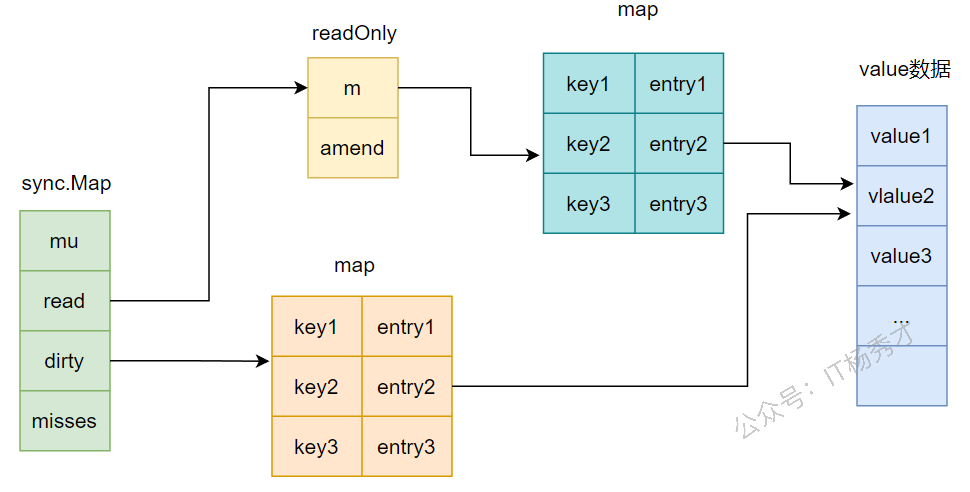

有一个很关键的点：`read.m` 和 `dirty` 这两张表里，相同 key 对应的 value 往往不是两份数据，而是同一个 `entry` 指针。因此改了 `entry.p`，两边看到的是同一份结果。

#### ⬆️ dirty 提升

`dirty` 提升的目的，是把最近经常需要加锁访问的数据同步成新的只读视图，减少后续锁竞争。

触发时机可以简单记成一句话：**read 老是读不到，misses 又越来越多，就该让 dirty 顶上来了。**

```go
func (m *Map) missLocked() {
    m.misses++
    if m.misses < len(m.dirty) {
        return
    }
    m.read.Store(readOnly{m: m.dirty})
    m.dirty = nil
    m.misses = 0
}
```

提升后会发生三件事：

- `dirty` 直接成为新的 `read`
- 原来的 `dirty` 被置为 `nil`
- `misses` 清零，等待下一轮统计

#### 📖 读取流程

```go
func (m *Map) Load(key interface{}) (value interface{}, ok bool) {
    read, _ := m.read.Load().(readOnly)
    e, ok := read.m[key]
    if !ok && read.amended { // read 中不存在且 dirty 有新数据
        m.mu.Lock()
        // 双重检查，避免加锁前 dirty 已提升为 read
        read, _ = m.read.Load().(readOnly)
        e, ok = read.m[key]
        if !ok && read.amended {
            e, ok = m.dirty[key]
            m.missLocked() // 记录一次 miss
        }
        m.mu.Unlock()
    }
    if !ok {
        return nil, false
    }
    return e.load()
}
```

- 先从 `read` 无锁读取。
- 如果 `read` 没命中，并且 `amended=true`，说明 `dirty` 里有 read 没有的数据，这时才加锁去 `dirty` 查。
- 只要走了 `dirty`，就会累计一次 `miss`。
- 当 `misses >= len(dirty)` 时，`dirty` 会被提升成新的 `read`。

读取流程图：

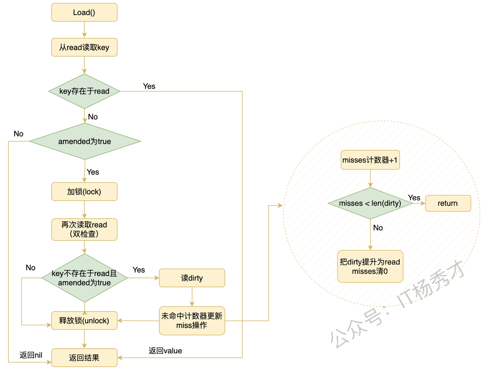

#### 💾 存储流程

```go
func (m *Map) Store(key, value interface{}) {
    read, _ := m.read.Load().(readOnly)
    if e, ok := read.m[key]; ok && e.tryStore(&value) {
        return // 若 read 中存在且未被标记为 expunged，直接更新
    }

    m.mu.Lock()
    read, _ = m.read.Load().(readOnly)
    if e, ok := read.m[key]; ok {
        if e.unexpungeLocked() { // 若 entry 被标记为 expunged，需恢复并加入 dirty
            m.dirty[key] = e
        }
        e.storeLocked(&value) // 更新 entry
    } else if e, ok := m.dirty[key]; ok {
        e.storeLocked(&value) // dirty 中存在，直接更新
    } else {
        if !read.amended { // 首次写入 dirty，需复制 read 中的所有未删除 entry
            m.dirtyLocked()
            m.read.Store(readOnly{m: read.m, amended: true})
        }
        m.dirty[key] = newEntry(value)
    }
    m.mu.Unlock()
}
```

- 如果 key 已经存在于 `read`，且 entry 没被 `expunged`，会优先尝试无锁更新。
- 如果 key 处于 `expunged` 状态，就不能只改 `read`，因为这说明 dirty 和 read 的 key 集已经分叉了，必须加锁把这个 key 重新并回 dirty。
- 如果 key 是全新的：
  - `dirty == nil` 时，要先根据 `read` 重建 dirty；
  - 然后再把新 key 插入 dirty，并把 `read.amended` 设为 `true`。

`p == expunged` 时的结构可以用下面这张图理解：

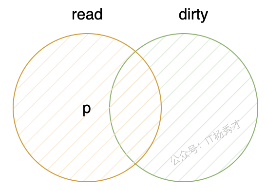

存储流程图：

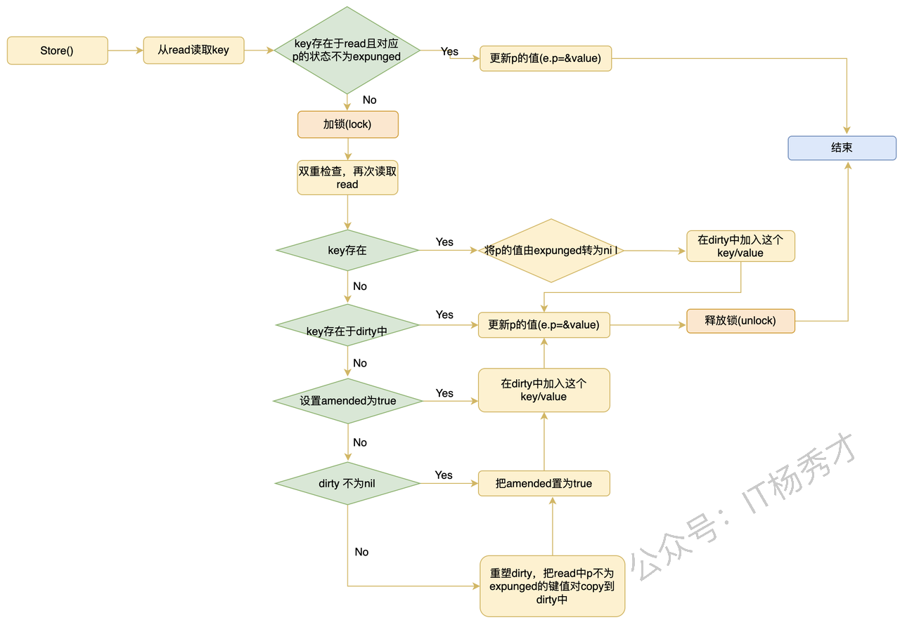

#### 🗑️ 删除流程

```go
func (m *Map) Delete(key interface{}) {
    read, _ := m.read.Load().(readOnly)
    e, ok := read.m[key]
    if !ok && read.amended {
        m.mu.Lock()
        read, _ = m.read.Load().(readOnly)
        e, ok = read.m[key]
        if !ok && read.amended {
            delete(m.dirty, key) // 直接从 dirty 中删除
        }
        m.mu.Unlock()
    } else if ok {
        e.delete()
    }
}
```

- 如果 key 在 `read` 中，删除通常是**延迟删除**：
  - 只是把 `entry.p` 标成 `nil`
  - 并没有立刻从 map 结构里把这个 key 移除
- 如果 key 不在 `read` 中，而是在 `dirty` 中，才会直接 `delete(m.dirty, key)` 做物理删除。

所以可以把它记成：

- **从 read 删除：延迟删除**
- **从 dirty 删除：直接删除**

删除流程图：

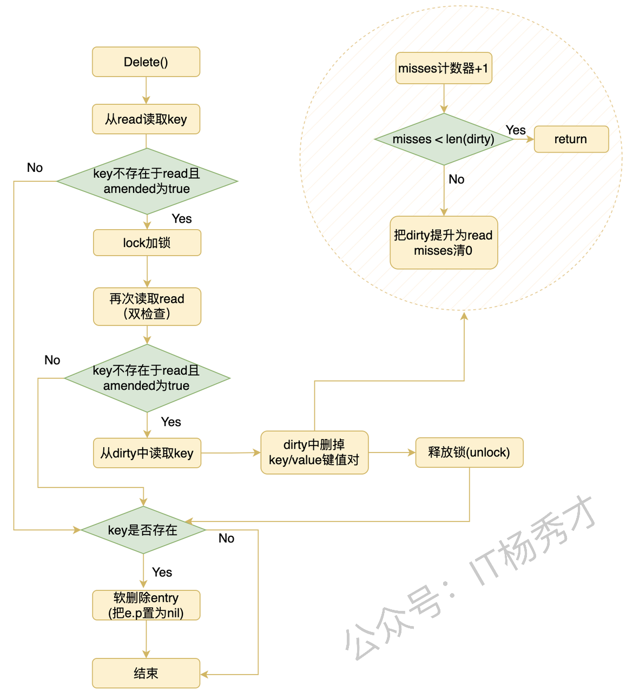

#### 🔁 Range 流程

`Range` 的处理方式和前面几个方法不太一样。它的目标不是“尽量只看 read”，而是要确保遍历到 map 中所有当前有效的 key。

核心逻辑是：

- 如果 `read.amended=false`，说明 `dirty` 里没有 read 没有的数据，直接遍历 `read` 就够了。
- 如果 `read.amended=true`，说明 `dirty` 里有 read 里没有的新 key，这时会先把 `dirty` 提升成新的 `read`，再遍历。

```go
func (m *Map) Range(f func(key, value interface{}) bool) {
   read, _ := m.read.Load().(readOnly)
   if read.amended {
      m.mu.Lock()
      read, _ = m.read.Load().(readOnly)
      if read.amended {
         read = readOnly{m: m.dirty}
         m.read.Store(read)
         m.dirty = nil
         m.misses = 0
      }
      m.mu.Unlock()
   }

   for k, e := range read.m {
      v, ok := e.load()
      if !ok {
         continue
      }
      if !f(k, v) {
         break
      }
   }
}
```

Range 流程图：

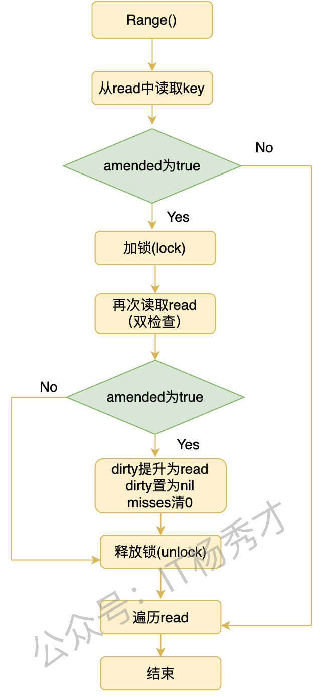

#### 🔄 p 的状态变化

`sync.Map` 里最容易讲清楚底层行为的地方，就是 `entry.p` 在 `正常值 -> nil -> expunged -> 恢复` 之间如何切换。

可以按一条具体链路来理解：

1. 一开始向空的 `sync.Map` 写入 `key1/value1` 和 `key2/value2`，新数据先进入 `dirty`。

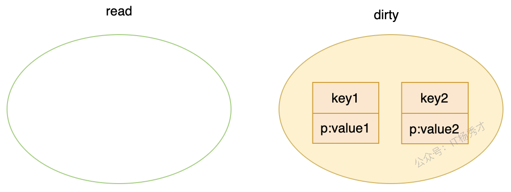

2. 连续读取这些 key，`read` 多次未命中，`misses` 达到阈值后，`dirty` 提升为 `read`，`dirty=nil`。

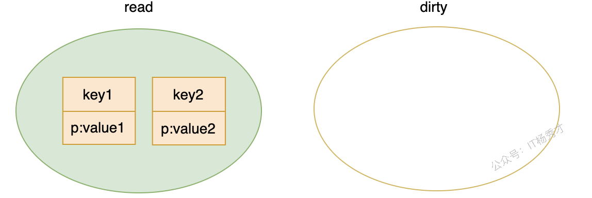

3. 删除 `key1` 后，因为它存在于 `read` 中，所以只是把 `key1` 对应的 `p` 标成 `nil`，属于逻辑删除。

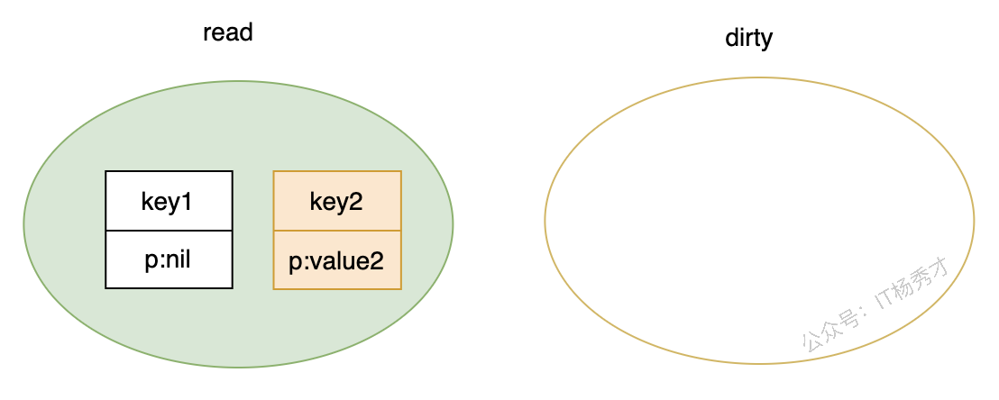

4. 这时如果再插入 `key3`，由于 `dirty` 为空，运行时会基于 `read` 重建 `dirty`。重建过程中，原来 `p=nil` 的 `key1` 会被进一步标为 `expunged`，表示这个 key 只留在 `read` 中，不再进 dirty。

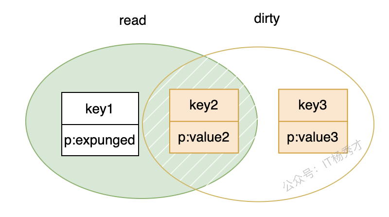

5. 如果之后又重新 `Store(key1, value0)`，发现它在 `read` 中但状态是 `expunged`，就不能只操作 `read`，而必须先把状态从 `expunged` 恢复，再重新加入 `dirty`，最后更新值。

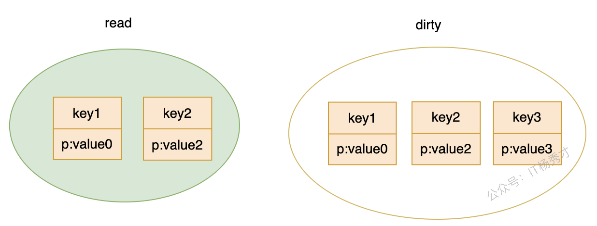

这套状态设计的核心目的，是把“是否需要加锁同步 dirty”区分得更细：

- `p == nil`：可以理解为“逻辑删了，但 dirty 可能还跟得上”
- `p == expunged`：可以理解为“这个 key 已经和 dirty 脱钩了，再操作它必须带上 dirty 一起处理”

**✅ sync.Map 总结**

- `sync.Map` 的核心不是“简单地给 map 加一把大锁”，而是通过 `read + dirty` 两张表做读写分离。
- 读路径优先无锁命中 `read`，这是它在读多写少场景里性能好的根本原因。
- 写路径主要落在 `dirty`，并在必要时重建或同步 `dirty`。
- 删除分成延迟删除和直接删除两种，取决于 key 当前位于 `read` 还是 `dirty`。
- `entry.p` 的 `nil / expunged / 正常值` 三种状态，是理解 `sync.Map` 行为的关键。

上面这几点也解释了为什么 `sync.Map` 的推荐场景通常就是：读多写少、key 集合相对稳定；一旦写操作明显变多，它的收益就会迅速下降。

---

## 🏊 对象池sync.Pool

**`sync.Pool`** 是在 **sync** 包下的一个**内存池组件**，用来实现对象的复用，避免重复创建相同的对象，造成频繁的内存分配和 GC，以达到提升程序性能的目的。

虽然池子中的对象可以被复用，但是 **`sync.Pool`** 并不会永久保存这个对象，池子中的对象会在一定时间后被 GC 回收，这个时间是随机的。所以，用 **`sync.Pool`** 来持久化存储对象是不可取的。

另外，**`sync.Pool`** 本身是**并发安全**的，支持多个 **goroutine** 并发地往 **sync.Pool** 存取数据。

### 📖 基本使用方法

关于 **`sync.Pool`** 的使用，一般是通过三个方法来完成的：

| 方法 | 说明 |
|------|------|
| **`New`** | **sync.Pool** 的构造函数，用于指定 **sync.Pool** 中缓存的数据类型，当调用 **Get** 方法从对象池中获取对象的时候，对象池中如果没有，会调用 **New** 方法创建一个新的对象 |
| **`Get`** | 从对象池取对象 |
| **`Put`** | 往对象池放对象，下次 **Get** 的时候可以复用 |

```go
package main

import (
    "fmt"
    "sync"
)

type Student struct {
    Name string
    Age  int
}

func main() {
    pool := sync.Pool{
        New: func() interface{} {
            return &Student{
                Name: "zhangsan",
                Age:  18,
            }
        },
    }

    st := pool.Get().(*Student)
    println(st.Name, st.Age)
    fmt.Printf("addr is %p\n", st)

    pool.Put(st)

    st1 := pool.Get().(*Student)
    println(st1.Name, st1.Age)
    fmt.Printf("addr1 is %p\n", st1)
}
```

运行结果：
```
zhangsan 18
addr is 0x140000a0018
zhangsan 18
addr1 is 0x140000a0018
```

第一次调用 `pool.Get().(*Student)` 时，由于池子内没有对象，所以会通过 **New** 方法创建一个。**注意**：`pool.Get()` 返回的是一个 `interface{}`，所以我们需要断言成对应类型。使用完对象后，调用 **Put** 方法将对象放回池子内，可以看到两次取出的对象地址是同一个，说明 **sync.Pool** 有缓存对象的功能。

### ♻️ 对象复用注意事项

如果取出对象后进行修改，需要在放回池子之前进行 **Reset** 操作，将对象值复原：

```go
package main

import (
    "fmt"
    "sync"
)

type Student struct {
    Name string
    Age  int
}

func main() {
    pool := sync.Pool{
        New: func() interface{} {
            return &Student{
                Name: "zhangsan",
                Age:  18,
            }
        },
    }

    st := pool.Get().(*Student)

    // 修改
    st.Name = "lisi"
    st.Age = 20

    // 回收前需要 Reset
    st.Name = "zhangsan"
    st.Age = 18

    pool.Put(st)

    st1 := pool.Get().(*Student)
    println(st1.Name, st1.Age)
    fmt.Printf("addr1 is %p\n", st1)
}
```

### 🎯 使用场景

1. **降低 GC 压力**：`sync.Pool` 主要是通过对象复用来降低 GC 带来的性能损耗，所以在高并发场景下，由于每个 **goroutine** 都可能过于频繁地创建一些大对象，造成 GC 压力很大。所以在高并发业务场景下出现 GC 问题时，可以使用 **`sync.Pool`** 减少 GC 负担

2. **不适合存储带状态的对象**：比如 socket 连接、数据库连接等，因为里面的对象随时可能会被 GC 回收释放掉

3. **不适合需要控制缓存对象个数的场景**：因为 **Pool** 池里面的对象个数是随机变化的，池子里的对象是会被 GC 的，且释放时机是随机的
