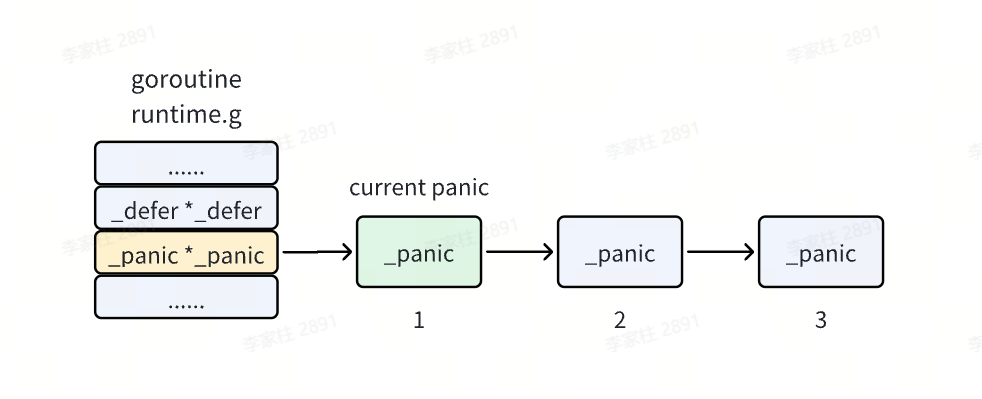
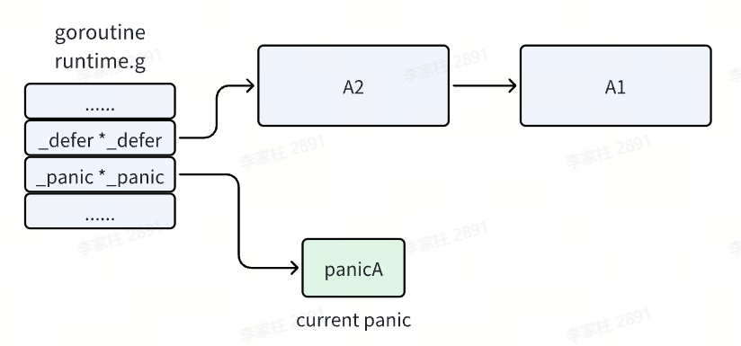
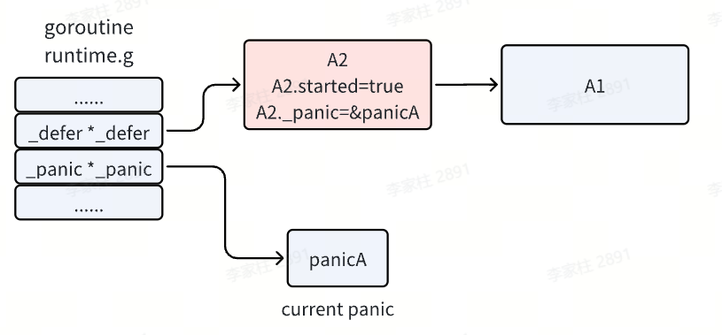
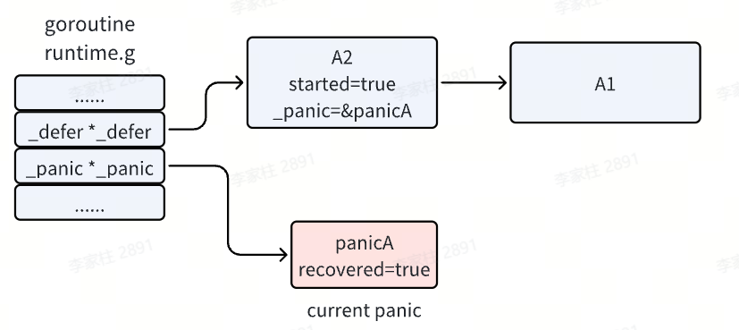

## Go的错误处理思路

Go 语言通过内置的错误接口提供了非常简单的错误处理机制。

Go 语言的错误处理采用显式返回错误的方式，而非传统的异常处理机制。这种设计使代码逻辑更清晰，便于开发者在编译时或运行时明确处理错误。

**Go 的错误处理主要围绕以下机制展开：**

- **`error` 接口**：标准的错误表示。
- **显式返回值**：通过函数的返回值返回错误。
- **自定义错误**：可以通过标准库或自定义的方式创建错误。
- **`panic` 和 `recover`**：处理不可恢复的严重错误。

### error接口

Go 标准库定义了一个 error 接口，表示一个错误的抽象。error 类型是一个接口类型，定义如下

```go
type error interface {
    Error() string
}
```

- **实现 `error` 接口**：任何实现了 **`Error()`** 方法的类型都可以作为错误。
- **`Error()`** 方法返回一个描述错误的字符串。

创建错误

- **`func Errorf(format string, a ...any) error`** ：
  - **`format`** ：格式字符串（类似于 **`fmt.Sprintf`** ）。
  - **`a ...any`** ：格式化参数。
  - 返回值：一个实现了 **`error`** 接口的对象（即 **`error`** 类型）
- **`func New(text string) error`**
  - **`text`** ：错误信息字符串。
  - 返回值：一个实现了 **`error`** 接口的对象。

```go
package main

import (
    "errors"
    "fmt"
)

func main() {
    err := errors.New("this is an error")
    fmt.Println(err) // 输出：this is an error
}
```

### 显式返回错误

Go 中，错误通常作为函数的返回值返回，开发者需要显式检查并处理。

```go
package main

import (
        "errors"
        "fmt"
)

func divide(a, b int) (int, error) {
        if b == 0 {
                return 0, errors.New("division by zero")
        }
        return a / b, nil
}

func main() {
        result, err := divide(10, 0)
        if err != nil {
                fmt.Println("Error:", err)
        } else {
                fmt.Println("Result:", result)
        }
}
// 输出：Error: division by zero
```

### 自定义错误

通过定义自定义类型，可以实现 error 接口

```go
package main

import (
        "fmt"
)

type DivideError struct {
        Dividend int
        Divisor  int
}

func (e *DivideError) Error() string {
        return fmt.Sprintf("cannot divide %d by %d", e.Dividend, e.Divisor)
}

func divide(a, b int) (int, error) {
        if b == 0 {
                return 0, &DivideError{Dividend: a, Divisor: b}
        }
        return a / b, nil
}

func main() {
        _, err := divide(10, 0)
        if err != nil {
                fmt.Println(err) // 输出：cannot divide 10 by 0
        }
}
```

**`fmt`** 包提供了对错误的格式化输出支持：

- **`%v`** ：默认格式。
- **`%+v`** ：如果支持，显示详细的错误信息。
- **`%s`** ：作为字符串输出。

### 错误链的处理

**`func Is(err, target error) bool`** ：检查某个错误是否是特定错误或由该错误包装而成。

- **`err`** ：实际的错误（可能是包装过的）。
- **`target`** ：希望判断的目标错误。

```go
package main

import (
        "errors"
        "fmt"
)

var ErrNotFound = errors.New("not found")

func findItem(id int) error {
        return fmt.Errorf("database error: %w", ErrNotFound)
}

func main() {
        err := findItem(1)
        if errors.Is(err, ErrNotFound) {
                fmt.Println("Item not found")
        } else {
                fmt.Println("Other error:", err)
        }
}
```

**`func As(err error, target any) bool`** ：将错误转换为特定类型以便进一步处理。

- **`err`**：你要检查的错误（可能是包装过的）。
- **`target`** ：**指向具体类型的指针**，如 **`*MyError`** 或 **`*os.PathError`** 。
- **`true`** 表示找到了该类型的错误，并已赋值给 **`target`** 指向的变量。

```go
package main

import (
        "errors"
        "fmt"
)

type MyError struct {
        Code int
        Msg  string
}

func (e *MyError) Error() string {
        return fmt.Sprintf("Code: %d, Msg: %s", e.Code, e.Msg)
}

func getError() error {
        return &MyError{Code: 404, Msg: "Not Found"}
}

func main() {
        err := getError()
        var myErr *MyError
        if errors.As(err, &myErr) {
                fmt.Printf("Custom error - Code: %d, Msg: %s\n", myErr.Code, myErr.Msg)
        }
}
```

## panic和recover

Go 的 panic 用于处理不可恢复的错误，recover 用于从 panic 中恢复。

**`panic`** ：**`panic`** 用于主动抛出一个运行时恐慌，这会导致程序的执行立即停止，并开始展开调用栈，执行所有被延迟（defer）的函数，直到遇到 **`recover`** 。**`panic`** 会导致程序的退出，平时开发中不要随便使用，它通常用于表示不可恢复的错误情况，比如无法获取必要的资源、违反了内部的不可违背的逻辑等。

```go
//只会打印panic的信息，不会打印最后一句话
func A() {
    panic("this is an panic")
    fmt.Println("this is a func")
}
```

**`recover`** ：捕获 **`panic`**，用于捕获并恢复由 panic 引发的运行时恐慌，它只能在被 **`defer`** 的函数内部使用。当在 **`defer`** 函数中调用 **`recover`** 时，如果当前的 **`goroutine`** 正在经历 **`panic`** ，**`recover`** 会停止恐慌的展开，并返回传递给 **`panic`** 的值。如果当前 goroutine 没有处于恐慌状态，**`recover`** 会返回 nil 。

```go
package main

import "fmt"

func safeFunction() {
        defer func() {
                if r := recover(); r != nil {
                        fmt.Println("Recovered from panic:", r)
                }
        }()
        panic("something went wrong")
}

func main() {
        fmt.Println("Starting program...")
        safeFunction()
        fmt.Println("Program continued after panic")
}

// 输出：Starting program...
// Recovered from panic: something went wrong
// Program continued after panic
```

- **`defer`** 需要放在 **`panic`** 之前定义，另外 **`recover`** 只有在 **`defer`** 调用的函数中才会生效。
- **`recover`** 处理异常后，逻辑并不会恢复到 **`panic`** 的那个点去。
- 多个 **`defer`** 会形成栈，后定义的 **`defer`** 会先执行。

### 底层原理

当前执行的 **`goroutine`** 中有一个 **`defer`** 链表的头指针，其实它也会有一个 **`panic`** 链表头指针，**`panic`** 链表链起来的是一个个的 **`_panic`** 结构体。

**`panic`** 链表和 **`defer`** 链表类似，也是在链表头上插入新的 **`_panic`** 结构体，所以链表头上的 **`panic`** 就是当前正在执行的那一个。



```go
type _panic struct {
    argp        unsafe.Pointer    // 存储当前要执行的defer的函数参数地址
    arg         interface{}       // panic的参数
    link        *_panic           //链接到之前发生的panic
    recovered   bool              //标记panic是否被恢复
    aborted     bool              //标记panic会否被终止
}
```

以下面的代码为例

```go
func A() {
    defer A1()
    defer A2()
    // ......
    panic("panicA")
    // code to do something
}
```

执行流程如下

- 函数 A 注册了两个 **`defer`** 函数 A1 和 A2 后发生了 **`panic`**，执行完两个 **`defer`** 注册后，**`defer`** 链表中已经注册了 A1 和 A2 函数。
- 发生了 panic，并且 panic 之后的代码不会再执行了，而是进入了 panic 的处理逻辑。首先会在 panic 链表中增加一项，我们将它记作 **`panicA`**，它就是我们当前执行的 **`panic`** 。



- 接着执行 **`defer`** 链表了，即从头开始执行。**`panic`** 执行 **`defer`** 时，会先将其 **`started`** 置为 true，即标记它已经开始执行了。并且会把 **`_panic`** 字段指向当前执行的 **`panic`** ，标识这个 **`defer`** 是由这个 **`panic`** 触发的。



- 如果函数 A2 能正常结束，则这一项就会被移除，继续执行下一个 defer。
- 当 **`def`** 函数中存在 **`recover`** 时，此时就会把当前执行的 panicA 置为已恢复，然后 recover 函数的任务就完成了。程序会继续往下执行 Println 语句，并打印 **`panic`** 的信息，直到 A2 函数执行结束。


