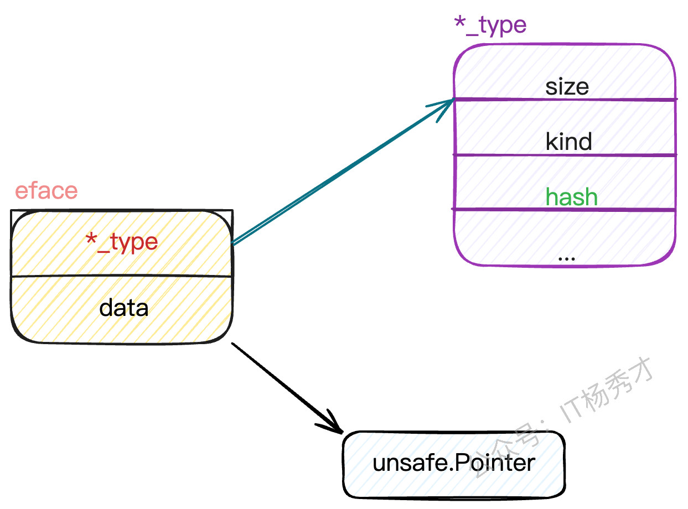
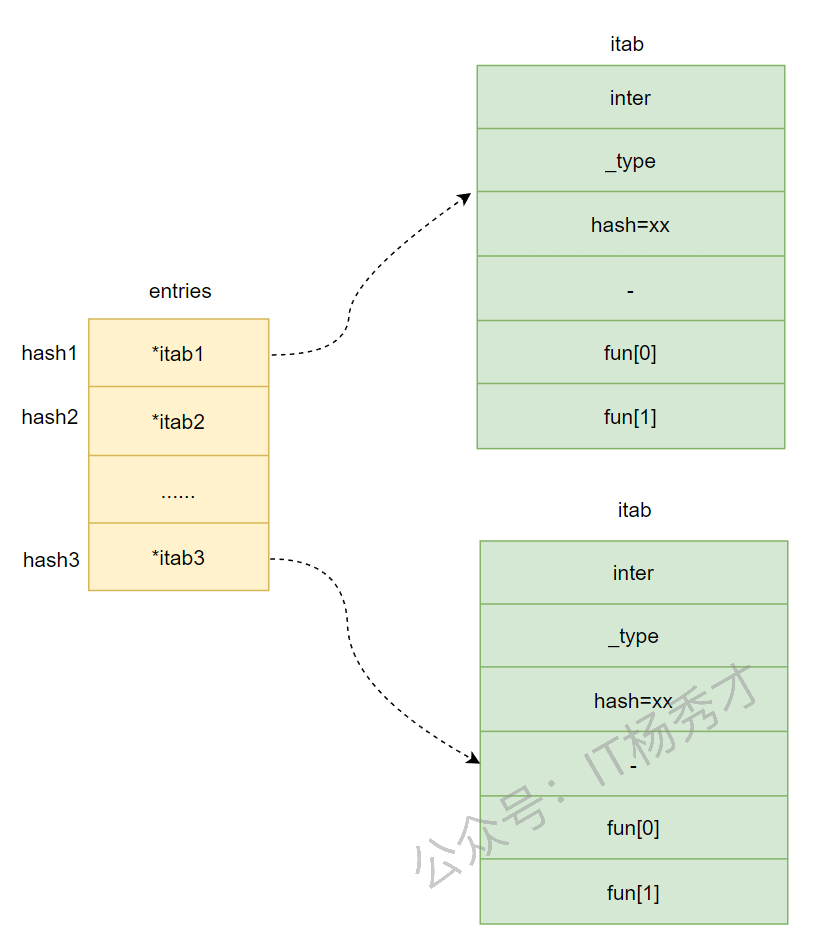

## 📝 变量的声明方式

声明变量的一般形式是使用 **`var`** 关键字，有以下使用方法：

---

### 📦 单变量声明

#### 1️⃣ 指定变量类型

声明后若不赋值，使用默认值。

```go
var var_name var_type
```

#### 2️⃣ 类型推导

根据值自行判定变量类型。

```go
var v_name = value
```

#### 3️⃣ 短变量声明

省略 **`var`**，使用 **`:=`** 初始化声明。

```go
v_name := value
```

**注意事项**：
- **`:=`** 左侧的变量不应该是已经声明过的，否则会导致编译错误
- 在定义变量 a 之前使用它，则会得到编译错误 `undefined: a`
- 声明了一个局部变量却没有在相同的代码块中使用它，同样会得到编译错误
- 只可以在函数内使用，不能用于声明全局变量

#### 💻 示例代码

```go
package main

import "fmt"

func main() {
    // 第一种：使用默认值
    var a int
    fmt.Printf("a = %d\n", a)

    // 第二种：指定类型和值
    var b int = 10
    fmt.Printf("b = %d\n", b)

    // 第三种：省略类型，自动匹配
    var c = 20
    fmt.Printf("c = %d\n", c)

    // 第四种：短变量声明
    d := 3.14
    fmt.Printf("d = %f\n", d)
}
```

---

### 📦 多变量声明

#### 🌍 全局变量分解写法

```go
var x, y int
var ( // 分解的写法，一般用于声明全局变量
    a int
    b bool
)
```

#### ⚡ 函数内多变量声明

```go
var c, d int = 1, 2
var e, f = 123, "liudanbing"
g, h := 123, "hello" // 只能在函数体内使用
```

**💡 补充说明：注意事项**

**1. 已声明变量不能再次使用 `:=`**

如果变量已经使用 **`var`** 声明过了，再使用 `:=` 声明变量，就会产生编译错误。

```go
var intVal int
intVal := 1 // ❌ 编译错误：no new variables on left side of :=

// 正确做法
intVal = 1 // ✅ 这是赋值语句，不是声明
```

**2. 空白标识符 `_`**

空白标识符 **`_`** 也被用于抛弃值，如值 `5` 在 `_, b = 5, 7` 中被抛弃。**`_`** 实际上是一个只写变量，你不能得到它的值。这样做是因为 **Go 语言**中你必须使用所有被声明的变量，但有时你并不需要使用从一个函数得到的所有返回值。

```go
// 忽略某个返回值
_, err := someFunction()
```

**3. 并行赋值**

多变量可以在同一行进行赋值，右边的值以相同的顺序赋值给左边的变量。

```go
var a, b int
var c string
a, b, c = 5, 7, "abc"
```

如果想要交换两个变量的值，可以简单地使用 **`a, b = b, a`**，两个变量的类型必须是相同。

**💡 面试要点：make 和 new 的区别？**

**回答：**

**`make`** 和 **`new`** 都是用于内存分配的内建函数，但使用场景不同：

| 特性 | **`make`** | **`new`** |
|:----:|:----------:|:---------:|
| 用途 | 初始化 slice、map、channel | 分配任意类型的内存 |
| 返回值 | 返回初始化后的值（非指针） | 返回指向零值的指针 |
| 初始化 | 会初始化内部结构 | 只分配内存，不初始化 |
| 零值 | 返回可用的数据结构 | 返回指针指向零值 |

**示例：**

```go
// make：初始化 slice
s := make([]int, 5, 10)  // 返回 []int，已初始化

// make：初始化 map
m := make(map[string]int)  // 返回 map[string]int，已初始化

// make：初始化 channel
ch := make(chan int)  // 返回 chan int，已初始化

// new：分配内存
p := new(int)  // 返回 *int，指向零值 0
fmt.Println(*p)  // 输出：0

// new：分配结构体
type Person struct {
    Name string
    Age  int
}
person := new(Person)  // 返回 *Person
fmt.Println(person.Name)  // 输出：""（零值）
```

**关键区别：**
- **`make`** 只能用于 slice、map、channel，返回初始化后可直接使用的值
- **`new`** 可用于任何类型，返回指针，指向该类型的零值

---

## 🏷️ 命名规范

在 **Go 语言**中，任何标识符，包括变量、常量、函数名、方法名、接口名以及自定义类型等，都应该遵循以下规则。

### 📝 基本规则

- 一个名字必须以一个字母（Unicode 字母）或下划线开头，后面可以跟任意数量的字母、数字或下划线
- 大写字母和小写字母是不同的：**`heapSort`** 和 **`Heapsort`** 是两个不同的名字
- **Go 语言**程序员推荐使用**驼峰式**命名，当名字由几个单词组成时优先使用大小写分隔，而不是优先用下划线分隔

### 🔤 命名区分大小写

**Go 语言**是一种区分大小写的编程语言。其命名规则涵盖了变量、常量、全局函数、结构体、接口、方法等元素。

- **大写字母开头**：如 **`Analysize`**，将成为外部包代码可以访问的对象（类似于面向对象语言中的 **public**），这种方式被称为"导出"
- **小写字母开头**：该标识符仅对当前包内可见并可使用，无法被包外访问（类似于面向对象语言中的 **private**）

### 📦 包名称

包名必须全部为小写单词，无下划线，也不要混合大小写，越短越好，尽量不要与标准库重名。并且包名最好和目录保持一致，这样可读性强。

```go
package domain
package service
package model
```

### 📄 文件名

文件名同样遵循简短有意义的原则，文件名必须为小写单词，允许加下划线 **`_`** 组合方式，但是头尾不能为下划线。

```go
order_service.go
```

虽然 **Go** 文件命名允许出现下划线，但是为了代码的整洁性，以及避免与一些系统规定的特定后缀冲突，还是建议少使用下划线，能不用尽量不用。

比如以 **`_test`** 为后缀的 **Go** 编译器会认为是测试文件，不会编译到工程里面。

### 🔢 常量名

**1. 驼峰命名**

常量&枚举名规范起见，采用大小写混排的驼峰模式（**Go** 官方要求），不要出现下划线。

```go
const (
    TypeBooks  = iota // 0
    TypePhone         // 1
    TypeCoin          // 2
)
```

**2. 分类组织**

常量的定义应根据功能对类型进行分类，而不是将所有类型归为一组。此外，建议将公共常量放在私有常量之前。

```go
const (
    TypePage = "page"

    // The rest are node types; home page, sections etc.
    TypeHome         = "home"
    TypeSection      = "section"
    TypeTaxonomy     = "taxonomy"
    TypeTaxonomyTerm = "taxonomyTerm"

    // Temporary state.
    TypeUnknown = "unknown"

    // The following are (currently) temporary nodes.
    TypeRSS       = "RSS"
    TypeSitemap   = "sitemap"
    TypeRoboTypeXT = "roboTypeXT"
    Type404       = "404"
)
```

**3. 枚举类型**

如果常量类型是枚举类型，需要先创建相应类型。

```go
type TypeCompareType int

const (
    TypeEq TypeCompareType = iota
    TypeNe
    TypeGt
    TypeGe
    TypeLt
    TypeLe
)
```

### 📋 变量名

变量名称通常遵循驼峰命名法，首字母根据访问控制原则决定是大写还是小写。但对于特定名词，需遵循以下规则：

**1. 私有变量**

如果变量是私有的，且特定名词位于名称的首位，则应使用小写字母（例如 **`appService`**）。

**2. 布尔类型变量**

如果变量类型为 **`bool`**，则名称应以 **`Has`**、**`Is`**、**`Can`** 或 **`Allow`** 开头。

```go
var isExist bool
var hasConflict bool
var canManage bool
var allowGitHook bool
```

### 🏗️ 结构体名

结构体命名同样应使用驼峰命名法，变量名的首字母根据访问控制规则决定是大写还是小写。

对于 **`struct`** 的声明和初始化，建议采用多行格式：

```go
type ServiceConfig struct {
    Port    string `json:"port"`
    Address string `json:"address"`
}

config := ServiceConfig{"8080", "111.222.333.444"}
```

### 🔌 接口名

接口的命名规则几乎和结构体相同，只是需要多注意一点：通常只包含单个函数的接口名以 **"er"** 作为后缀，例如 **`Reader`**、**`Writer`**。

```go
type Reader interface {
    Read(p []byte) (n int, err error)
}
```

### ⚙️ 函数名

**1. 驼峰命名**

函数名必须为大小写混排的驼峰模式。注意，函数名开头字母大写表示该函数是可导出的，可以在包外的其他地方被调用；如果函数名开头是小写的，则只能在包内被调用。另外还需要注意一点：函数名不应该与标准库中的函数名冲突。

```go
func DoJob() {}  // 暴露给包外部函数

func doJob() {}  // 包内部函数
```

**2. 命名要求**

函数名要求精简准确，并采用动词或动词短语：

```go
func save() {}
func delete() {}
func getUser() {}
```

---

## 📊 基本数据类型

Go 的数据类型分类与 Java 类似，分为**基本数据类型**和**派生数据类型**。

### 📋 数据类型概览

| 类型分类 | 具体类型 |
|---------|---------|
| **基本数据类型** | 数值型（整数、浮点）、字符型、布尔型、字符串 |
| **派生数据类型** | 指针、数组、结构体、管道、函数、切片、接口、map |

---

### 🔢 数值型

#### 🔢 整数型

**有符号整数**：

| 类型 | 有无符号 | 占用存储空间 | 数据范围 |
|:----:|:--------:|:------------:|:--------:|
| int8 | 有 | 1 个字节 | $-128$ ~ $127$ |
| int16 | 有 | 2 个字节 | $-2^{15}$ ~ $2^{15}-1$ |
| int32 | 有 | 4 个字节 | $-2^{31}$ ~ $2^{31}-1$ |
| int64 | 有 | 8 个字节 | $-2^{63}$ ~ $2^{63}-1$ |

**无符号整数**：

| 类型 | 有无符号 | 占用存储空间 | 数据范围 |
|:----:|:--------:|:------------:|:--------:|
| uint8 | 无 | 1 个字节 | $0$ ~ $255$ |
| uint16 | 无 | 2 个字节 | $0$ ~ $2^{16}-1$ |
| uint32 | 无 | 4 个字节 | $0$ ~ $2^{32}-1$ |
| uint64 | 无 | 8 个字节 | $0$ ~ $2^{64}-1$ |

**💡 面试要点：int 和 int32 有什么区别？**

**位宽与取值范围**

- **`int`**：平台相关
  - 64 位架构通常是 **`int64`**（64-bit）
  - 32 位架构是 **`int32`**（32-bit）
  
- **`int32`**：永远是 32 位有符号整数

**选择建议**

- 选 **`int`** 更适合索引和通用计数
- 选 **`int32`** 更适合需要固定宽度的协议和数据结构

**示例：**

```go
import "unsafe"

func main() {
    var a int
    var b int32
    
    fmt.Println(unsafe.Sizeof(a)) // 8（64位系统）
    fmt.Println(unsafe.Sizeof(b)) // 4
}
```

**其他整数类型**：

| 类型 | 有无符号 | 占用存储空间 | 说明 |
|:----:|:--------:|:------------:|:----:|
| int | 有 | 32 位系统 4 字节<br>64 位系统 8 字节 | 默认整数类型 |
| uint | 无 | 32 位系统 4 字节<br>64 位系统 8 字节 | 无符号默认类型 |
| rune | 有 | 4 个字节 | 等价 int32，表示 Unicode 码点 |
| byte | 无 | 1 个字节 | uint8 的别名，存储字符 |

#### 🔢 浮点数型

| 类型 | 占用存储空间 | 说明 |
|:----:|:------------:|:----:|
| float32 | 4 字节 | 单精度浮点 |
| float64 | 8 字节 | 双精度浮点（默认） |

**注意事项**：
- Go 浮点类型有固定的范围和字段长度，不受具体操作系统的影响
- Go 的浮点型**默认声明为 float64** 类型

---

### 🔤 字符型

Go 中没有专门的字符类型，如果要存储单个字符（字母），一般使用 **`byte`** 来保存。

```go
var x byte = 'a'
```

**常见转义字符**：

| 转义字符 | 含义 |
|:--------:|:----:|
| `\t` | 制表符 |
| `\n` | 换行符 |
| `\r` | 回车符 |

**注意事项**：
- Go 的字符采用 UTF-8 编码，字符本质上是一个整数
- 直接输出时输出的是字符的 UTF-8 码值
- 使用格式化输出 **`%c`** 才能输出字符值

**💡 面试要点：rune 和 byte 有什么区别？**

**类型定义：**

- **`byte`**：**`uint8`** 的别名，占用 1 字节
- **`rune`**：**`int32`** 的别名，占用 4 字节

**使用场景：**

- **`byte`**：处理 **ASCII 字符**或二进制数据
- **`rune`**：处理 **Unicode 字符**（如中文、emoji）

**示例：**

```go
s := "你好"

// byte 方式遍历（按字节）
for i := 0; i < len(s); i++ {
    fmt.Printf("%d: %x\n", i, s[i])
}
// 输出：
// 0: e4
// 1: bd
// 2: a0
// 3: e5
// 4: a5
// 5: bd

// rune 方式遍历（按字符）
for i, r := range s {
    fmt.Printf("%d: %c\n", i, r)
}
// 输出：
// 0: 你
// 3: 好
```

**总结：**
- 处理英文用 **`byte`** 足够
- 处理中文、emoji 等多字节字符，必须用 **`rune`**

---

### ✅ 布尔类型

布尔类型使用 **`bool`** 存储，大小为 1 个字节，只允许值为 **`true`** 和 **`false`**。

---

### 📜 字符串类型

字符串是一串固定长度的字符连接起来的字符序列。Go 的字符串是由单个字节连接起来的，采用 **UTF-8** 编码。

#### 🔧 底层原理

```go
type StringHeader struct {
    Data uintptr  // 指向字节数组的指针
    Len  int      // 字符串长度
}
```

**💡 面试要点：Go string 的底层实现原理**

Go 的字符串底层是一个**只读的字节数组**，通过 **`StringHeader`** 结构体描述：

- **`Data`**：指向底层字节数组的指针
- **`Len`**：字符串的字节长度（不是字符数）

**关键特性：**

1. **不可变性**：字符串内容不能修改，任何修改都会创建新字符串
2. **零拷贝切片**：字符串切片 **`s[i:j]`** 不复制数据，只创建新的 **`StringHeader`**
3. **字节长度**：**`len(s)`** 返回字节数，不是字符数

**示例：**

```go
s := "hello"
// 底层结构：
// Data -> ['h', 'e', 'l', 'l', 'o']
// Len  -> 5

// 切片操作（零拷贝）
sub := s[1:3]  // "el"
// sub 的 Data 仍指向原数组，只是偏移了 1 字节
```

**⚠️ 注意：中文字符串**

```go
s := "你好"
fmt.Println(len(s))  // 输出：6（UTF-8 编码，每个中文 3 字节）

// 获取字符数
fmt.Println(utf8.RuneCountInString(s))  // 输出：2
```

#### ⚠️ 注意事项

- 在 Go 中字符串是**不可变的**，类似 Java
- **双引号** `" "`：表示字符串，会识别转义字符
- **反引号** `` ` ` ``：以字符串的原生形式输出，包括换行和特殊字符
- 字符串之间使用 **`+`** 进行拼接
- 对于长字符串使用分行拼接处理，将 **`+`** 保留在上一行

---

## 🌐 作用域

Go 语言中变量可以在三个地方声明：

- **函数内定义的变量**：局部变量
- **函数外定义的变量**：全局变量
- **函数定义中的变量**：形式参数

### 📍 作用域分类

| 作用域类型 | 说明 |
|:----------:|:----:|
| **局部变量** | 在函数体内声明，作用域只在函数体内，参数和返回值变量也是局部变量 |
| **全局变量** | 在函数体外声明，可在整个包甚至外部包（被导出后）使用 |
| **形式参数** | 会作为函数的局部变量来使用 |

---

## ⏱️ 变量的生命周期

**Go 语言**中变量的生命周期分为两种：

- **全局变量**：生命周期是程序存活时间
- **局部变量**：在不发生内存逃逸的情况下，生命周期是函数存活时间

```go
package main

import "fmt"

var globalStr string
var globalInt int

func main() {
    var localStr string
    var localInt int
    localStr = "first local"
    localInt = 2021
    globalInt = 1024
    globalStr = "first global"
    fmt.Printf("globalStr is %s\n", globalStr)   // globalStr is first global
    fmt.Printf("globalInt is %d\n", globalInt)   // globalInt is 1024
    fmt.Printf("localStr is %s\n", localStr)     // localStr is first local
    fmt.Printf("localInt is %d\n", localInt)     // localInt is 2021
}
```

**💡 补充说明：内存逃逸**

在某些情况下，局部变量的生命周期可能会超出函数的作用域，这就是所谓的**内存逃逸**。编译器会自动分析变量的使用范围，决定是否将其分配在栈上或堆上。

常见发生逃逸的场景：
- 返回局部变量的指针
- 局部变量被闭包引用
- 动态分配大小的局部变量

---

## 🎯 基本数据类型的默认值

在 Go 中，数据类型都有一个默认值（零值）。

| 数据类型 | 默认值 |
|:--------:|:------:|
| int | 0 |
| float | 0 |
| string | "" |
| bool | false |

---

## 🔄 基本数据类型之间的相互转换

Go 和 Java 不同，**Go 不支持数据类型的自动转换**，需要显式转换。

### 📝 语法格式

```go
var i dataType
var j = newType(i)
```

### 📤 基本数据类型转 string

- **`fmt.Sprintf("%参数", 表达式)`**
- 使用 **`strconv`** 包中的函数：
  - `func FormatBool(b bool) string`
  - `func FormatInt(i int64, base int) string`
  - `func FormatFloat(f float64, fmt byte, prec, bitSize int) string`

### 📥 string 转基本类型

- 使用 **`strconv`** 包中的函数：
  - `func ParseBool(str string) (value bool, err error)`
  - `func ParseFloat(s string, bitSize int) (f float64, err error)`
  - `func ParseInt(s string, base int, bitSize int) (i int64, err error)`
  - `func ParseUint(s string, b int, bitSize int) (n uint64, err error)`

---

## 🔢 运算符

**Go 语言**的运算符大体上分为以下几种：

### ➕ 算术运算符

**A = 10，B = 20**

| 运算符 | 描述 | 实例 |
|:------:|:----:|:-----:|
| + | 相加 | A + B 输出结果 30 |
| - | 相减 | A - B 输出结果 -10 |
| * | 相乘 | A * B 输出结果 200 |
| / | 相除 | B / A 输出结果 2 |
| % | 求余 | B % A 输出结果 0 |
| ++ | 自增 | A++ 输出结果 11 |
| -- | 自减 | A-- 输出结果 9 |

```go
package main

import "fmt"

func main() {
    var a int = 21
    var b int = 10
    var c int

    c = a + b
    fmt.Printf("第一行 - c 的值为 %d\n", c)
    c = a - b
    fmt.Printf("第二行 - c 的值为 %d\n", c)
    c = a * b
    fmt.Printf("第三行 - c 的值为 %d\n", c)
    c = a / b
    fmt.Printf("第四行 - c 的值为 %d\n", c)
    c = a % b
    fmt.Printf("第五行 - c 的值为 %d\n", c)
    a++
    fmt.Printf("第六行 - a 的值为 %d\n", a)
    a = 21
    a--
    fmt.Printf("第七行 - a 的值为 %d\n", a)
}
```

运行结果：
```
第一行 - c 的值为 31
第二行 - c 的值为 11
第三行 - c 的值为 210
第四行 - c 的值为 2
第五行 - c 的值为 1
第六行 - a 的值为 22
第七行 - a 的值为 20
```

---

### 🔍 关系运算符

**A = 10，B = 20**

| 运算符 | 描述 | 实例 |
|:------:|:----:|:-----:|
| == | 相等 | A == B 输出结果 false |
| != | 不相等 | A != B 输出结果 true |
| > | 大于 | A > B 输出结果 false |
| < | 小于 | A < B 输出结果 true |
| >= | 大于等于 | A >= B 输出结果 false |
| <= | 小于等于 | A <= B 输出结果 true |

```go
package main

import "fmt"

func main() {
    var a int = 21
    var b int = 10

    if a == b {
        fmt.Printf("第一行 - a 等于 b\n")
    } else {
        fmt.Printf("第一行 - a 不等于 b\n")
    }
    if a < b {
        fmt.Printf("第二行 - a 小于 b\n")
    } else {
        fmt.Printf("第二行 - a 不小于 b\n")
    }
    if a > b {
        fmt.Printf("第三行 - a 大于 b\n")
    } else {
        fmt.Printf("第三行 - a 不大于 b\n")
    }
    a = 5
    b = 20
    if a <= b {
        fmt.Printf("第四行 - a 小于等于 b\n")
    }
    if b >= a {
        fmt.Printf("第五行 - b 大于等于 a\n")
    }
}
```

---

### 🔗 逻辑运算符

**A = 10，B = 20**

| 运算符 | 描述 | 实例 |
|:------:|:----:|:-----:|
| && | 逻辑 AND 运算符。如果两边的操作数都是 true，则条件为 true，否则为 false。 | (A && B) 为 false |
| \|\| | 逻辑 OR 运算符。如果两边的操作数有一个 true，则条件为 true，否则为 false。 | (A \|\| B) 为 true |
| ! | 逻辑 NOT 运算符。如果条件为 true，则逻辑 NOT 条件为 false，否则为 true。 | !(A && B) 为 true |

```go
package main

import "fmt"

func main() {
    var a bool = true
    var b bool = false
    if a && b {
        fmt.Printf("第一行 - 条件为 true\n")
    }
    if a || b {
        fmt.Printf("第二行 - 条件为 true\n")
    }
    a = false
    b = true
    if a && b {
        fmt.Printf("第三行 - 条件为 true\n")
    } else {
        fmt.Printf("第三行 - 条件为 false\n")
    }
    if !(a && b) {
        fmt.Printf("第四行 - 条件为 true\n")
    }
}
```

---

### 🔢 位运算符

位运算符是对内存中的二进制数进行按位运算。

**A = 60，B = 13**

| 运算符 | 描述 | 实例 |
|:------:|:----:|:-----:|
| & | 按位与运算符。参与运算的两数各对应的二进位相与。 | (A & B) 结果为 12 |
| \| | 按位或运算符。参与运算的两数各对应的二进位相或。 | (A \| B) 结果为 61 |
| ^ | 按位异或运算符。参与运算的两数各对应的二进位相异或。 | (A ^ B) 结果为 49 |
| << | 左移运算符。左移 n 位就是乘以 2 的 n 次方。 | A << 2 结果为 240 |
| >> | 右移运算符。右移 n 位就是除以 2 的 n 次方。 | A >> 2 结果为 15 |

```go
package main

import "fmt"

func main() {
    var a uint = 60  /* 60 = 0011 1100 */
    var b uint = 13  /* 13 = 0000 1101 */
    var c uint = 0

    c = a & b  /* 12 = 0000 1100 */
    fmt.Printf("第一行 - c 的值为 %d\n", c)

    c = a | b  /* 61 = 0011 1101 */
    fmt.Printf("第二行 - c 的值为 %d\n", c)

    c = a ^ b  /* 49 = 0011 0001 */
    fmt.Printf("第三行 - c 的值为 %d\n", c)

    c = a << 2  /* 240 = 1111 0000 */
    fmt.Printf("第四行 - c 的值为 %d\n", c)

    c = a >> 2  /* 15 = 0000 1111 */
    fmt.Printf("第五行 - c 的值为 %d\n", c)
}
```

---

### 📝 赋值运算符

| 运算符 | 描述 | 实例 |
|:------:|:----:|:-----:|
| = | 简单的赋值运算符，将一个表达式的值赋给一个左值 | C = A + B 将 A + B 表达式结果赋值给 C |
| += | 相加后再赋值 | C += A 等于 C = C + A |
| -= | 相减后再赋值 | C -= A 等于 C = C - A |
| *= | 相乘后再赋值 | C *= A 等于 C = C * A |
| /= | 相除后再赋值 | C /= A 等于 C = C / A |
| %= | 求余后再赋值 | C %= A 等于 C = C % A |
| <<= | 左移后赋值 | C <<= 2 等于 C = C << 2 |
| >>= | 右移后赋值 | C >>= 2 等于 C = C >> 2 |
| &= | 按位与后赋值 | C &= 2 等于 C = C & 2 |
| ^= | 按位异或后赋值 | C ^= 2 等于 C = C ^ 2 |
| \|= | 按位或后赋值 | C \|= 2 等于 C = C \| 2 |

---

### 🔧 其他运算符

**Go 语言**也有指针和地址的概念，所以会有取地址运算符 **&** 和指针运算符 *****。

| 运算符 | 描述 | 实例 |
|:------:|:----:|:-----:|
| & | 返回变量存储地址 | &a 将给出变量的实际地址 |
| * | 指针变量 | *a 是一个指针变量 |

```go
package main

import "fmt"

func main() {
    var a int = 4
    var ptr *int

    ptr = &a  /* ptr 包含了 a 变量的地址 */
    fmt.Printf("a 的值为 %d\n", a)
    fmt.Printf("*ptr 为 %d\n", *ptr)
}
```

---

### ⚖️ 运算符优先级

有些运算符拥有较高的优先级，二元运算符的运算方向均是从左至右。

| 优先级 | 运算符 |
|:------:|:-------|
| 1 | * / % << >> & &^ |
| 2 | + - \| ^ |
| 3 | == != < <= > >= |
| 4 | && |
| 5 | \|\| |

**跟其他语言一样，可以通过使用括号来临时提升某个表达式的整体运算优先级。**

```go
package main

import "fmt"

func main() {
    var a int = 20
    var b int = 10
    var c int = 15
    var d int = 5
    var e int

    e = (a + b) * c / d
    fmt.Printf("(a + b) * c / d 的值为: %d\n", e)

    e = ((a + b) * c) / d
    fmt.Printf("((a + b) * c) / d 的值为: %d\n", e)

    e = (a + b) * (c / d)
    fmt.Printf("(a + b) * (c / d) 的值为: %d\n", e)

    e = a + (b * c) / d
    fmt.Printf("a + (b * c) / d 的值为: %d\n", e)
}
```

运行结果：
```
(a + b) * c / d 的值为: 90
((a + b) * c) / d 的值为: 90
(a + b) * (c / d) 的值为: 90
a + (b * c) / d 的值为: 50
```

---

## 🔗 指针

类似于 C++，Go 保留了指针。

指针保存了值的内存地址，其零值为 **`nil`**。

- **取址符** **`&`**：生成一个指向其操作数的指针，获取地址
- **解引用** **`*`**：通过指针访问或修改它指向的值



- **需要修改原值**：如果希望函数里对参数的修改**直接作用到调用方的变量**，就需要传指针
- **避免复制大对象**：Go 的值传递会复制一份参数，如果结构体很大，复制成本高，可以传指针来避免拷贝



**💡 面试要点：Go 的参数传递是值传递还是引用传递？**

**回答：Go 只有值传递。**

**值传递**：函数调用时，实参的值被复制给形参，形参是实参的副本。

**示例：**

```go
// 传递 int（值类型）
func modifyInt(x int) {
    x = 100  // 修改的是副本
}
func main() {
    a := 10
    modifyInt(a)
    fmt.Println(a)  // 输出：10（原值未变）
}

// 传递指针（仍然是值传递，只是复制的是指针值）
func modifyPointer(x *int) {
    *x = 100  // 通过指针修改原值
}
func main() {
    a := 10
    modifyPointer(&a)
    fmt.Println(a)  // 输出：100（原值被修改）
}
```

**关键理解：**
- 传递指针时，**指针本身被复制**，但两个指针指向同一地址
- slice、map、channel 虽然表现得像引用传递，但本质仍是值传递（传递的是底层数据结构的副本）

**💡 面试要点：Go 有哪些引用类型？**

Go 的引用类型包括：

- **slice**：包含指向底层数组的指针
- **map**：指向哈希表的指针
- **channel**：指向通道结构的指针
- **interface**：包含类型信息和数据指针
- **func**：函数类型
- **指针**：**`*T`** 类型

**注意**：虽然叫"引用类型"，但传递时仍然是值传递（复制指针值）。

---

## 🏗️ 结构体

一个结构体（**`struct`**）就是一组字段（field）。

### 📝 创建和初始化

**Go 语言**的结构体支持两种初始化方式：

**1. 键值对初始化**

在初始化的时候以属性：值的方式完成，如果有的属性不写，则为默认值。

```go
package main

import "fmt"

type Student struct {
    ID    int
    Name  string
    Age   int
    Score int
}

func main() {
    st := Student{
        ID:    100,
        Name:  "zhangsan",
        Age:   18,
        Score: 98,
    }
    fmt.Printf("学生 st: %v\n", st)
}
```

运行结果：
```
学生 st: {100 zhangsan 18 98}
```

**2. 值列表初始化**

在初始化的时候直接按照属性顺序以属性值来初始化。

```go
package main

import "fmt"

type Student struct {
    ID    int
    Name  string
    Age   int
    Score int
}

func main() {
    st := Student{
        101,
        "lisi",
        20,
        97,
    }
    fmt.Printf("学生 st: %v\n", st)
}
```

运行结果：
```
学生 st: {101 lisi 20 97}
```

**⚠️ 注意**：以值列表的方式初始化结构体，值列表的个数必须等于结构体属性个数，且要按顺序，否则会报错。

---

### 🔑 成员访问

使用点号 **`.`** 操作符来访问结构体的成员，**`.`** 前可以是结构体变量或者结构体指针。

```go
package main

import "fmt"

type Student struct {
    ID    int
    Name  string
    Age   int
    Score int
}

func main() {
    // 结构体变量
    st1 := Student{
        ID:    100,
        Name:  "zhangsan",
        Age:   18,
        Score: 98,
    }
    fmt.Printf("学生1的姓名是: %s\n", st1.Name)

    // 结构体指针
    st2 := &Student{
        ID:    101,
        Name:  "lisi",
        Age:   20,
        Score: 97,
    }
    fmt.Printf("学生2的分数是: %d\n", st2.Score)
}
```

运行结果：
```
学生1的姓名是: zhangsan
学生2的分数是: 97
```

---

### 🏷️ 结构体标签（Tag）

虽然 Go 本身语法中没有类似 Java 中的 **`@Annotation`** 的注解机制，但结构体字段可以使用反引号（`）添加 tag，以传递元信息给反射或其他工具使用。

- 标签必须用**反引号（`）**包裹
- 每个 tag 是 **`key:"value"`** 形式，多个 tag 之间以空格分隔
- 每个 key 应唯一

```go
type User struct {
    ID    int    `json:"id" db:"user_id" validate:"required"`
    Name  string `json:"name" db:"username" comment:"用户姓名"`
    Email string `json:"email,omitempty" validate:"email"`
}
```

---

### 🔗 方法绑定

利用方法绑定可以实现类似 Java 的成员方法的效果。**方法绑定**指的是某个方法被**绑定（关联）到某个类型的值（value）或指针（pointer）上**。

```go
func (var_name varType) func_name(parameter_type parameterlist) return_type {
    // 方法体
}
```

- **值接收者**：传的是**副本**，原值不受影响
- **指针接收者**：可以修改原对象内容

---

### 🔄 JSON 解析

Go 通常使用标准库中的 **`encoding/json`** 做序列化和反序列化。

```go
package main

import (
    "encoding/json"
    "fmt"
)

type User struct {
    Name string `json:"name"` // 指定 JSON 字段名
    Age  int    `json:"age"`
}

func main() {
    // 序列化
    u := User{Name: "Alice", Age: 30}
    data, _ := json.Marshal(u)
    fmt.Println(string(data)) // {"name":"Alice","age":30}
    
    // 反序列化
    jsonStr := `{"name":"Bob","age":25}`
    var u2 User
    json.Unmarshal([]byte(jsonStr), &u2)
    fmt.Println(u2.Name, u2.Age) // Bob 25
}
```

**JSON Tag 属性**：
- `json:"name"`：将字段编码为指定名称
- `json:"name,omitempty"`：若字段为零值则忽略
- `json:"-"`：忽略该字段，不参与序列化

---

### 🔀 继承和聚合

Go 语言中没有类的概念，但可以通过**结构体嵌入**（匿名字段）来实现面向对象编程的某些特性。

```go
type Animal struct {
    Name string
}

func (a *Animal) speak() {
    fmt.Printf("%s speaks\n", a.Name)
}

type Dog struct {
    *Animal  // 嵌入 Animal
    Breed string
}

func (d *Dog) Bark() {
    fmt.Printf("%s the %s dog barks\n", d.Name, d.Breed)
}
```

---

## 🎯 结构体高级特性（面试重点）

### 🆚 struct 能不能比较？

在 Go 里，**struct 可以使用 `==` 和 `!=` 比较**，前提是 struct 内的**所有字段都是可比较的**（comparable）。

**可比较类型**：
- 基本类型（int、string、bool 等）
- 指针、channel、interface

**不可比较类型**：
- **slice、map、func** 不是可比较类型，只能与 nil 比较

```go
// ✅ 可以比较
type Person struct {
    Name string
    Age  int
}
p1 := Person{"Alice", 30}
p2 := Person{"Alice", 30}
fmt.Println(p1 == p2) // true

// ❌ 不能比较（包含 slice）
type Student struct {
    Name  string
    Scores []int  // slice 不可比较
}
```

---

### 🆚 两个 interface 能比较吗？

**可以比较，但有条件**：

1. 比较动态类型是否相同
2. 如果相同，再比较动态值
3. **如果底层类型不可比较（slice、map、func），会 panic**

```go
var a interface{} = []int{1, 2, 3}
var b interface{} = []int{1, 2, 3}
// fmt.Println(a == b) // ❌ panic：slice 不可比较
```

---

### ❓ Go 有没有 this 指针？

Go 语言里**没有像 Java 或 C++ 那样的 this 指针**，但它有一个等价但更灵活的概念：**方法的接收者（receiver）**。

Go 在定义方法时，**显式声明接收者**是谁：

```go
func (p Person) GetName() string {
    return p.Name  // p 就相当于 this
}
```

---

### ✅ 如何判断结构体是否实现了某接口？

使用**类型断言**来判断：

```go
var _ Speaker = (*Person)(nil)  // 编译期检查

// 或者运行时检查
var s Speaker = p
_, ok := s.(Person)
```

**如果结构体实现了接口的所有方法，就实现了该接口**（隐式实现）。

---

### 🔧 类型别名 vs 类型定义

| 特性 | 类型别名 `type A = B` | 类型定义 `type A B` |
|:----:|:---------------------:|:-------------------:|
| 兼容性 | 与原类型完全兼容 | 与原类型不兼容，需要显式转换 |
| 方法支持 | 不能添加方法 | 可以添加方法，实现接口 |
| 类型安全 | 允许隐式转换 | 更强的类型安全 |

```go
// 类型别名
type MyInt = int
var i MyInt = 12
var j int = 8
fmt.Println(i + j)  // ✅ 可以直接相加

// 类型定义
type MyInt2 int
var k MyInt2 = 12
// fmt.Println(k + j)  // ❌ 类型不匹配
fmt.Println(int(k) + j)  // ✅ 需要显式转换
```

---

### 🔗 结构体嵌入 vs 继承

**结构体嵌入**通过匿名字段实现：

```go
type Animal struct {
    Name string
}

type Dog struct {
    Animal  // 嵌入
    Breed string
}
```

**与继承的区别**：
- 嵌入是**组合关系**而非继承关系
- 外层结构体**不会获得内层的类型身份**
- 不能用于类型断言或接口实现
- 强调按需组合和松耦合设计

---

### 🎯 值接收者 vs 指针接收者

| 特性 | 值接收者 `(t T)` | 指针接收者 `(t *T)` |
|:----:|:----------------:|:-------------------:|
| 修改原对象 | ❌ 修改的是副本 | ✅ 可以修改原对象 |
| 拷贝开销 | 有（复制整个对象） | 小（只复制指针） |
| 方法集 | T 只包含值接收者方法 | *T 包含值和指针接收者方法 |
| nil 处理 | 可以调用 | 需要检查 nil |

**自动取址与解址**：
- 调用指针接收者方法时，如果接收者是值类型，编译器自动取址
- 调用值接收者方法时，如果接收者是指针类型，编译器自动解址

---

### 📦 空接口 interface{} 的底层实现

在 Go runtime 里，接口值本质上是 **"类型信息 + 数据指针"** 的二元组。

```go
type eface struct {  // 空接口的底层结构
    _type *_type        // 指向运行时类型信息
    data  unsafe.Pointer // 指向实际数据
}
```

**为什么空接口能接收任意类型？**

因为 `interface{}` 方法集合为空（0 个方法），所以**任何类型都天然实现空接口**。

---

### 🔍 类型断言的两种方式

#### 💥 直接断言（失败会 panic）

```go
v := x.(T)
```

#### ✅ Comma-ok 断言（失败不 panic）

```go
v, ok := x.(T)
if ok {
    // 类型断言成功
}
```

**建议**：在不确定类型时，**始终使用 comma-ok 形式**。

---

## 🔤 type 关键字

在 Go 语言中，`type` 是一个重要而且常用的关键字，可以用于定义结构体、类型别名、方法等。

### 📝 类型别名与类型定义

```go
// 类型别名
type MyInt = int

// 类型定义
type MyInt2 int
```

### 🔍 类型判断

```go
switch v := i.(type) {
case int:
    fmt.Println("int 类型，值是", v)
case string:
    fmt.Println("string 类型，值是", v)
default:
    fmt.Println("未知类型")
}
```

---

## 📚 数组

类型 `[n]T` 表示一个数组，它拥有 `n` 个类型为 `T` 的值。

### 📝 声明方法

```go
var a [n]T                    // 基本方式
primes := [6]int{2, 3, 5, 7, 11, 13}  // 字面量声明
balance := [...]float32{1000.0, 2.0}  // 编译器推断长度
```

### 📦 存储特点

- 数组的长度是其类型的一部分，因此数组**不能改变大小**
- 数组元素类型相同，在内存中**连续存储**
- 数组是**值类型**，赋值和传参会**复制整个数组**

### 🔄 遍历方式

```go
for i, v := range arr {
    fmt.Println(i, v)
}
```

**💡 面试要点：for range 的底层原理是什么？**

**回答：**

**`for range`** 是 Go 提供的迭代语法糖，底层实现：

**1. 对于 slice/array**

```go
// 源代码
for i, v := range arr {
    // ...
}

// 编译器展开后（伪代码）
len := len(arr)
for i := 0; i < len; i++ {
    v := arr[i]  // v 是副本
    // ...
}
```

**2. 对于 map**

- 使用 **`runtime.mapiterinit`** 初始化迭代器
- 使用 **`runtime.mapiternext`** 获取下一个元素
- 遍历顺序是**随机的**

**3. 对于 string**

- 按 **rune** 遍历，不是按字节
- **`i`** 是字节索引，**`v`** 是 rune 值

**⚠️ 常见陷阱：**

```go
// 陷阱1：v 是副本，修改不影响原数组
arr := []int{1, 2, 3}
for i, v := range arr {
    v = 100  // 只修改副本，不影响原数组
}
fmt.Println(arr)  // [1 2 3]

// 正确做法
for i := range arr {
    arr[i] = 100  // 直接修改原数组
}

// 陷阱2：循环变量复用
var funcs []func()
for i := 0; i < 3; i++ {
    funcs = append(funcs, func() { fmt.Println(i) })
}
for _, f := range funcs {
    f()  // 输出：3 3 3（i 被复用）
}

// 正确做法
for i := 0; i < 3; i++ {
    i := i  // 创建局部变量
    funcs = append(funcs, func() { fmt.Println(i) })
}
```

---

## 📊 值类型和引用类型

### 📍 值数据类型

变量直接指向存在内存中的值：

- 布尔：`bool`
- 字符串：`string`
- 数值型：`int`、`int8` ~ `int64`、`uint`、`float32`、`float64`、`complex64`、`complex128`
- 字符型：`byte`、`rune`
- 数组、结构体

### 📍 引用数据类型

变量存储的是变量所在的内存地址：

- 指针
- 切片（slice）
- 映射（map）
- 通道（channel）
- 接口（interface）
- 函数（func）

---

## 🔒 常量

常量是一个简单值的标识符，在程序运行时**不会被修改**。

### 📝 定义

```go
const identifier [type] = value
```

- `type` 可以省略，Go 可以通过类型推断
- 常量**不能用 `:=` 语法声明**

### 📈 自增长（iota）

**`iota`** 是一个特殊常量，可以认为是一个可以被编译器修改的常量。**`iota`** 在 **`const`** 关键字出现时将被重置为 **0**（const 内部的第一行之前），**`const`** 中每新增一行常量声明将使 **`iota`** 计数一次（**`iota`** 可理解为 **`const`** 语句块中的行索引）。

```go
const (
    a = iota  // 0
    b         // 1
    c         // 2
)
```

**💡 补充说明：iota 进阶用法**

**1. 常量用作枚举**

**Go 语言**不像 **C++**、**Java** 一样有专门的枚举类型，**Go 语言**的枚举一般用常量表示。

```go
const (
    Unknown = 0
    Success = 1
    Fail    = 2
)
```

**2. 常量表达式**

常量可以用 **`len()`**、**`cap()`**、**`unsafe.Sizeof()`** 函数计算表达式的值。**常量表达式中，必须是编译期可以确定的值**，否则编译不过。

```go
package main

import (
    "fmt"
    "unsafe"
)

const (
    a = "abc"
    b = len(a)
    c = unsafe.Sizeof(a)
)

func main() {
    fmt.Printf("a = %s, b = %d, c = %d\n", a, b, c)
}
```

运行结果：
```
a = abc, b = 3, c = 16
```



**💡 思考题：为什么字符串 "abc" 的 `unsafe.Sizeof()` 是 16 呢？**

实际上字符串类型的 **`unsafe.Sizeof()`** 一直是 **16**，因为字符串类型对应一个结构体，该结构体有两个域：

- 第一个域是指向该字符串的指针（8 字节）
- 第二个域是字符串的长度（8 字节）

但是**并不包含指针指向的字符串的内容**，这也就是为什么 **`sizeof`** 始终返回的是 **16**。

字符串可以理解成此结构体：

```c
typedef struct {
    char* buffer;    // 8字节
    size_t len;      // 8字节
} string;
```



**3. iota 跳值**

当某一行的常量值不是 **`iota`** 时，后续的 **`iota`** 会跳过该值继续计数。

```go
const (
    a = iota      // 0
    b             // 1
    c             // 2
    d = "ha"      // 独立值，iota = 3
    e             // "ha"，iota = 4
    f = 100       // iota = 5
    g             // 100，iota = 6
    h = iota      // 7，恢复计数
    i             // 8
)
fmt.Println(a, b, c, d, e, f, g, h, i)
// 输出：0 1 2 ha ha 100 100 7 8
```

**4. iota 左移运算**

**`iota`** 可以与左移运算符 **`<<`** 结合使用，实现更灵活的枚举值。

```go
const (
    i = 1 << iota    // iota = 0, i = 1 << 0 = 1
    j = 3 << iota    // iota = 1, j = 3 << 1 = 6
    k                // iota = 2, k = 3 << 2 = 12
    l                // iota = 3, l = 3 << 3 = 24
)
fmt.Println("i=", i)
fmt.Println("j=", j)
fmt.Println("k=", k)
fmt.Println("l=", l)
```

运行结果：
```
i= 1
j= 6
k= 12
l= 24
```

**原理解释**：

**`<<`** 表示左移，左移 n 位其实就是乘以 **2 的 n 次方**：

- **`i = 1`**：左移 0 位，不变仍为 1，即 $1 \times 2^0 = 1$
- **`j = 3`**：左移 1 位，变为二进制 **110**，即 $3 \times 2^1 = 6$
- **`k = 3`**：左移 2 位，变为二进制 **1100**，即 $3 \times 2^2 = 12$
- **`l = 3`**：左移 3 位，变为二进制 **11000**，即 $3 \times 2^3 = 24$

---

## 🔌 接口类型

在 Go 里，**接口（interface）**是一种**类型**，它定义了一组方法签名，但**不包含实现**。

### 📝 基本定义

```go
type Speaker interface {
    Speak() string
}
```

- 任何类型只要实现了接口中**所有方法**，就**自动**实现了该接口
- 这种实现是**隐式**的，不需要显式声明

### 🔄 实现多个接口

一种类型可以同时实现**多个接口**，请看下面例子：

```go
package main

import "fmt"

type MyWriter interface {
    MyWriter(s string)
}

type MyRead interface {
    MyReader()
}

type MyWriteReader struct{}

func (r MyWriteReader) MyWriter(s string) {
    fmt.Printf("call MyWriteReader MyWriter: %s\n", s)
}

func (r MyWriteReader) MyReader() {
    fmt.Printf("call MyWriteReader MyReader\n")
}

func main() {
    var myRead MyRead
    myRead = new(MyWriteReader)
    myRead.MyReader()

    var myWriter MyWriter
    myWriter = MyWriteReader{}
    myWriter.MyWriter("hello")
}
```

运行结果：
```
call MyWriteReader MyReader
call MyWriteReader MyWriter hello
```

上述例子定义了一个 **`MyWriter`** 接口和一个 **`MyRead`** 接口，然后定义了一个 **`MyWriteReader`** 结构体，同时实现了这两个接口的所有方法。所以 **`MyWriteReader`** 分别实现了两个不同的接口。

### 🔗 接口嵌套

接口嵌套就是一个接口中包含了其他接口，如果要实现外部接口，则需要实现内部嵌套的接口对应的所有方法。

```go
package main

import "fmt"

type A interface {
    run1()
}

type B interface {
    run2()
}

// 定义嵌套接口 C
type C interface {
    A
    B
    run3()
}

type Runner struct{}

// 实现嵌套接口 A 的方法
func (r Runner) run1() {
    fmt.Println("run1!!!!")
}

// 实现嵌套接口 B 的方法
func (r Runner) run2() {
    fmt.Println("run2!!!!")
}

func (r Runner) run3() {
    fmt.Println("run3!!!!")
}

func main() {
    var runner C
    runner = new(Runner)
    runner.run1()
    runner.run2()
    runner.run3()
}
```

运行结果：
```
run1!!!!
run2!!!!
run3!!!!
```

### 📦 空接口

```go
var x interface{}
```

空接口 `interface{}` 没有任何方法 → **任何类型**都实现了它，常用于存放任意类型数据。

### 💡 底层实现原理

一个接口值在运行时，本质上都包含两部分：

- **动态类型**：当前接口里装的到底是什么类型
- **动态值**：这个具体类型对应的那块数据

Go 的接口按底层结构分为两种。

**1. 空接口（`eface`）**

空接口没有方法集，所以只需要保存类型信息和数据指针。

```go
type eface struct {
    _type *_type
    data  unsafe.Pointer
}
```

- **`_type`**：指向动态类型的元数据
- **`data`**：指向动态值

例如：

```go
type Apple struct {
    PhoneName string
}

func main() {
    a := Apple{PhoneName: "apple"}
    var efc interface{}
    efc = a
    fmt.Println(efc)
}
```

把 `a` 赋值给 `efc` 之后，`efc` 内部就会记录：

- **动态类型**：`Apple`
- **动态值**：变量 `a` 的那份数据

<div align="center">
  
</div>

`_type` 对应的底层类型元数据可以抽象成运行时里的 `_type` 结构，里面保存了类型大小、对齐方式、哈希值、种类编号等信息：

```go
type _type struct {
    size       uintptr
    ptrdata    uintptr
    hash       uint32
    tflag      tflag
    align      uint8
    fieldAlign uint8
    kind       uint8
    equal      func(unsafe.Pointer, unsafe.Pointer) bool
    gcdata     *byte
    str        nameOff
    ptrToThis  typeOff
}
```

**2. 非空接口（`iface`）**

只要接口里定义了方法，运行时就不只要知道“值是什么”，还要知道“方法怎么调”。因此非空接口会额外持有一个 `itab`。

```go
type iface struct {
    tab  *itab
    data unsafe.Pointer
}

type itab struct {
    inter *interfacetype
    _type *_type
    hash  uint32
    _     [4]byte
    fun   [1]uintptr
}
```

- **`data`**：依然指向动态值
- **`tab`**：指向 `itab`，里面放接口类型、具体类型，以及方法地址表

`itab` 中的 `inter` 会指向 `interfacetype`，它描述了接口自身的方法集合：

```go
type interfacetype struct {
    typ     _type
    pkgpath name
    mhdr    []imethod
}
```

下面这个例子里，`Apple` 被赋值给 `Phone` 接口变量后，运行时会为它们建立方法映射关系：

```go
type Apple struct {
    PhoneName string
}

func (a Apple) Call() {
    fmt.Printf("%s 有打电话功能\n", a.PhoneName)
}

func (a Apple) SendMessage() {
    fmt.Printf("%s 有发短信功能\n", a.PhoneName)
}

type Phone interface {
    Call()
    SendMessage()
}
```

<div align="center">
  
</div>

**关键区别：**
- **`eface`**：只记录类型和数据，没有方法表
- **`iface`**：额外记录接口类型和方法表，用于动态派发方法调用

### 💡 itab 是怎么建立和复用的？

当具体类型赋值给非空接口时，运行时主要会做 3 件事：

1. 记录具体类型的元数据，也就是 `itab._type`
2. 记录接口自己的方法集合，也就是 `itab.inter`
3. 把具体类型中真正实现了接口的方法地址拷贝到 `itab.fun` 里

如果某个具体类型没有实现接口要求的全部方法，那么 `fun[0]` 会是 `0`，这意味着它不能赋值给该接口。

这里有一个很重要的性能点：**同一种接口类型 + 同一种具体类型，对应的 `itab` 可以复用**。

例如下面三次赋值，动态值不同，但接口类型和具体类型并没有变：

```go
var ifc Phone
a := Apple{PhoneName: "apple1"}
b := Apple{PhoneName: "apple2"}
c := Apple{PhoneName: "apple3"}

ifc = a
ifc = b
ifc = c
```

所以 Go 运行时不会每次都重新构造一份 `itab`，而是会把它缓存起来。运行时内部用 `itabTable` 这类结构维护缓存表：

```go
type itabTableType struct {
    size    uintptr
    count   uintptr
    entries [itabInitSize]*itab
}
```

查找时会把接口类型和具体类型的哈希值做异或，得到一个索引键：

```go
func itabHashFunc(inter *interfacetype, typ *_type) uintptr {
    return uintptr(inter.typ.hash ^ typ.hash)
}
```

<div align="center">
  
</div>

这也是为什么接口调用虽然有动态分发成本，但在大量重复使用同一组类型组合时，运行时不会每次都从零开始构造方法表。

### 💡 nil interface 和空 interface 的区别

**回答：**

这是一个常见的陷阱问题。

**nil interface**：接口值本身为 **`nil`**
- **`_type`** 为 **`nil`**
- **`data`** 为 **`nil`**

**空 interface**：接口值不为 **`nil`**，但存储的值为 **`nil`**
- **`_type`** 不为 **`nil`**（有类型信息）
- **`data`** 为 **`nil`**

**示例：**

```go
type Person struct {
    Name string
}

func main() {
    // nil interface
    var i interface{}
    fmt.Println(i == nil)  // true
    
    // 空 interface（陷阱！）
    var p *Person = nil
    var j interface{} = p
    fmt.Println(j == nil)  // false！
    // j 的 _type 不为 nil（是 *Person）
    // j 的 data 为 nil
}
```

**正确判断方式：**

```go
func IsNil(i interface{}) bool {
    if i == nil {
        return true
    }
    v := reflect.ValueOf(i)
    switch v.Kind() {
    case reflect.Ptr, reflect.Slice, reflect.Map, reflect.Chan, reflect.Func, reflect.Interface:
        return v.IsNil()
    }
    return false
}
```

### 💡 两个 interface 可以比较

**回答：可以比较，但有条件。**

**比较规则：**

1. **类型不同**：直接返回 **`false`**
2. **类型相同**：比较动态值
3. **动态值不可比较**：会 **`panic`**

**示例：**

```go
var a interface{} = []int{1, 2, 3}
var b interface{} = []int{1, 2, 3}

// fmt.Println(a == b)  // panic: comparing uncomparable type []int
```

**可比较的类型：**
- 基本类型：**`int`**、**`string`**、**`bool`** 等
- 指针、**`channel`**
- 结构体（所有字段可比较）
- 数组（元素可比较）

**不可比较的类型：**
- **`slice`**、**`map`**、**`func`**

**💡 面试要点：interface 的使用场景有哪些？**

**1. 空接口作为通用容器**

```go
func PrintAny(v interface{}) {
    fmt.Println(v)
}
```

**2. 接口作为函数参数（多态）**

```go
type Shape interface {
    Area() float64
}

func PrintArea(s Shape) {
    fmt.Println(s.Area())
}
```

**3. 接口组合**

```go
type Reader interface {
    Read(p []byte) (n int, err error)
}

type Writer interface {
    Write(p []byte) (n int, err error)
}

type ReadWriter interface {
    Reader
    Writer
}
```

**4. 接口断言（类型判断）**

```go
func Handle(v interface{}) {
    switch val := v.(type) {
    case int:
        fmt.Printf("int: %d\n", val)
    case string:
        fmt.Printf("string: %s\n", val)
    default:
        fmt.Printf("unknown type: %T\n", val)
    }
}
```

**最佳实践：**
- **小接口**：接口方法越少越好（1-3 个方法）
- **接收接口，返回结构体**：函数参数用接口，返回值用具体类型
- **避免空接口滥用**：空接口会丢失类型安全

---

## 🧬 类型系统

### 📋 组成部分

- **基本类型**：整数、浮点数、布尔、字符串
- **复合类型**：数组、切片、结构体、指针、映射
- **接口类型**：定义方法签名
- **类型别名**：为已有类型定义新名称

### 📊 类型元数据

每个类型都有对应的类型描述信息，称为**类型元数据**，构成 Go 语言的**类型系统**。

```go
type _type struct {
    size       uintptr
    ptrdata    uintptr
    hash       uint32
    tflag      tflag
    align      uint8
    fieldalign uint8
    kind       uint8
    // ...
}
```

---

## 🧪 面试高频补充

### 📦 空结构体 `struct{}`

空结构体是 Go 里一个很有代表性的“小而重要”的类型：

- **`struct{}{}`** 本身几乎不承载有效业务数据
- 常用于实现 **set**
- 常用于只传递“信号”而不传递“数据”的 **channel**

```go
set := map[string]struct{}{
    "go":   {},
    "java": {},
}

done := make(chan struct{})
go func() {
    // do work
    close(done)
}()
<-done
```

它的核心价值是：表达语义非常明确，同时避免无意义的数据负载。

### 🏷️ 结构体标签（Tag）

结构体标签本质上是附着在字段上的元信息，常用于序列化、参数绑定和校验：

```go
type User struct {
    ID    int    `json:"id" db:"user_id"`
    Name  string `json:"name" form:"name"`
    Email string `json:"email" binding:"required,email"`
}
```

常见用途：

- **`json`**：控制 JSON 编解码字段名
- **`db`**：映射数据库字段
- **`form`**：绑定表单或查询参数
- **`binding`** / **`validate`**：声明校验规则

### 🔍 `unsafe.Pointer` 和 `uintptr`

二者经常一起出现，但语义完全不同：

- **`unsafe.Pointer`**：通用指针，可以在不同指针类型之间桥接
- **`uintptr`**：普通整数，用来保存地址数值，便于做地址运算

最关键的区别是：

- **`unsafe.Pointer`** 仍然会被 GC 当作“指针”看待
- **`uintptr`** 只是数值，GC 不会把它当成引用

所以实践里要记住一个原则：

> 只有在非常明确地需要做底层内存操作时，才使用 `unsafe.Pointer` / `uintptr`，并且尽量缩小它们的作用范围。

---

## 📚 总结

| 特性 | 说明 |
|:----:|:----:|
| 变量声明 | `var`、`:=` 两种方式 |
| 基本类型 | 数值、字符、布尔、字符串 |
| 派生类型 | 指针、数组、切片、map、结构体、接口、channel |
| 结构体 | 支持嵌入（组合）、标签、方法绑定 |
| 接口 | 隐式实现、空接口可存任意类型 |
| 类型转换 | 必须显式转换，不支持自动转换 |
| 值 vs 引用 | 数组、结构体是值类型；slice、map、channel 是引用类型 |

**面试重点**：
- struct 可比较的条件
- 值接收者 vs 指针接收者的区别
- 类型别名 vs 类型定义的区别
- 结构体嵌入 vs 继承的区别
- 空接口的底层实现
