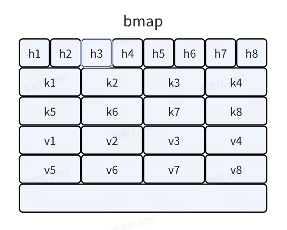
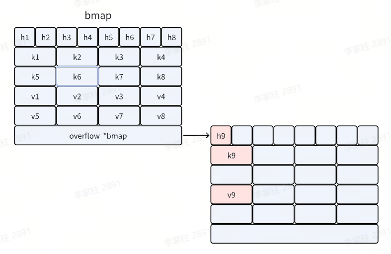
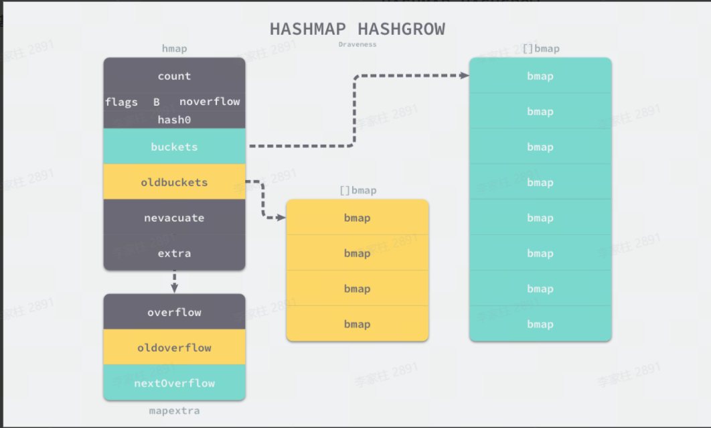
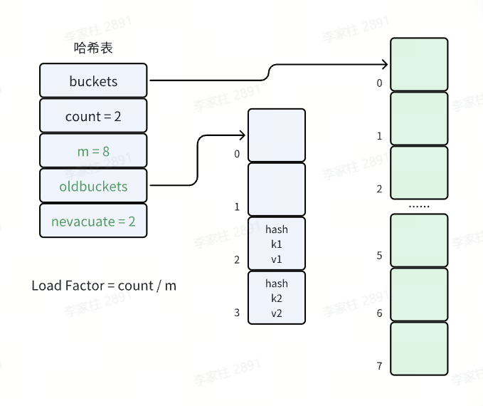
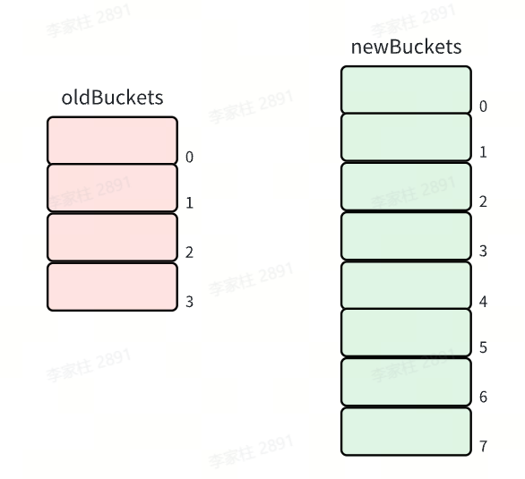
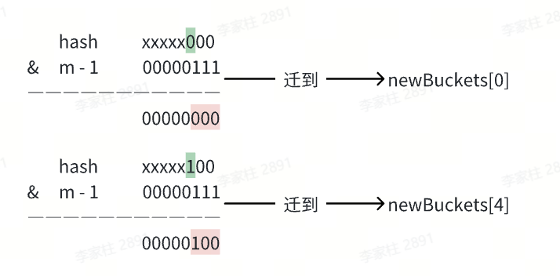
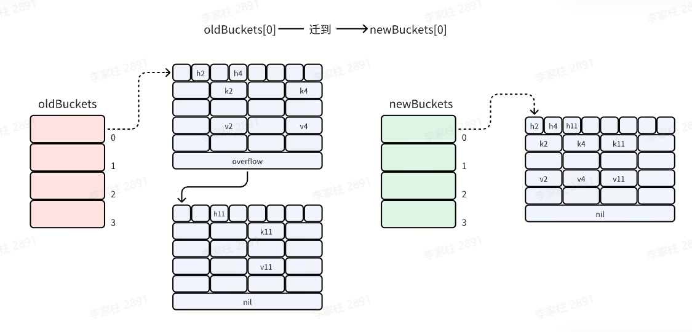

## Map的定义

Map 是一种无序的键值对的集合。Map 最重要的作用是通过 key 来快速检索数据，key 类似于索引，指向数据的值。Map 是一种集合，所以我们可以像迭代数组和切片那样迭代它。不过，Map 是无序的，遍历 Map 时返回的键值对的顺序是不确定的。在获取 Map 的值时，如果键不存在，返回该类型的零值

特点

- 非并发安全，如果在不同 goroutine 并发读写同一个 map，会导致竞态问题甚至崩溃（运行时检测会panic）并发读写需要并发安全的映射，可以加锁（使用 **`sync.Mutex`** ）或者使用 Go 的并发安全容器（如 **`sync.Map`** ）。
- 迭代顺序是随机的，不保证顺序
- 键必须是可比较的类型

## 基本操作

### 声明和初始化

- 声明映射：**`var m map[string]int`**

- 分配内存空间（初始化）：**`make(map[KeyType]ValueType, initialCapacity)`**

  - map 的零值是 nil，不能直接赋值元素，必须用 **`make`** 初始化

- 使用字面量创建Map

  ```go
  // 使用字面量创建 Map
  m := map[string]int{
      "apple": 1,
      "banana": 2,
      "orange": 3,
  }
  ```

### 获取和修改元素

- 获取元素（通过键来获取值）

  ```go
  v1 := m["apple"]
  v2, ok := m["pear"]  // 如果键不存在，ok 的值为 false，v2 的值为该类型的零值
  ```

- 修改/插入元素：**`m["apple"] = 5`**

- 获取长度：**`func len(var map) int`**

### 遍历map

使用range循环来遍历map，返回键k和值v

```go
for k, v := range m {
    fmt.Printf("key=%s, value=%d\n", k, v)
}
```

- Go 中遍历 map 的顺序是不确定的，每次运行可能会不同。

### 删除元素

- **`func delete(m map[Type]Type, key Type)`** ：从 **map 中删除键值对**
  - 删除不存在的键：不会报错
  - nil map 上使用 **`delete`** ：不会 **`panic`** 只是无效操作
  - 删除 key 操作只是将对应的 key-value 对标记为空，但不会释放桶（不会释放内存），也不会触发缩容

## 踩坑实录

### 直接操作nil map，发生panic

问题：直接操作未初始化的map，会触发panic

```Go
package main

func main() {
    var m map[string]string
    m["key"] = "value"
}
// 运行结果
panic: assignment to entry in nil map

goroutine 1 [running]:
main.main()
        .../main.go:5 +0x38

Process finished with the exit code 2
```

解决方法：使用map前，需对map进行初始化。

```Go
package main

func main() {
    m := map[string]string{}
    m["key"] = "value"

    n := make(map[string]string)
    n["key"] = "value"
}
```

## 底层原理

### 底层数据结构

在 Go 语言中，map 类型的底层实现就是哈希表，map 类型的变量 本质上是一个指针 **`*hmap`** ，指向 **`hmap`** 结构体。

- Go map 的底层是一个 **`buckets`** 数组
- 数组的每个元素都是一个桶（bucket）
- 每个桶可以存储 8 个 kv，当桶满时，会创建溢出桶

```go
// 其定义在 src/runtime/map.go 中
type hmap struct {
    count     int    // 元素个数
    flags     uint8  // 状态标志
    B         uint8  // 桶的数量的对数 (即桶数量为 2^B)
    noverflow uint16 // 溢出桶的数量
    hash0     uint32 // hash 种子，为hash函数引入随机性

    buckets    unsafe.Pointer // 指向桶数组的指针
    oldbuckets unsafe.Pointer // 扩容时指向旧桶的指针
    nevacuate  uintptr       // 扩容时的进度计数器

    extra *mapextra // 额外信息
}
```


Go 使用桶（bucket）存储 kv 信息，对应的数据结构是 bmap

```go
type bmap struct {
    tophash [8]uint8      // hash值的高8位
    keys    [8]keytype    // 键数组
    values  [8]valuetype  // 值数组
    overflow *bmap        // 溢出桶指针
}
```






为什么设置为8个k-v键值对

8 个键值对的大小正好接近 CPU 的缓存行大小（通常是 64 字节），可以一次将整个桶加载到 CPU 缓存中，减少了 CPU 缓存未命中的概率，提升了访问性能



最后是一个 bmap 型指针，指向一个溢出桶，溢出桶的内存布局与常规桶相同，是为了减少扩容次数而引入的。当一个桶存满了，还有可用的溢出桶时，就会在桶后面链一个溢出桶，继续往溢出桶里面存。



实际上如果哈希表要分配的桶的数目大于 $2^4$，就认为使用到溢出桶的几率较大，就会预分配 $2^{B-4}$ 个溢出桶备用，这些溢出桶与常规桶在内存中是连续的，只是前 $2^B$ 个用作常规桶，后面的用作溢出桶。

### 哈希定位原理

类似于Java的HashMap，参考[往期博客](https://tyritic.github.io/p/java%E4%B8%AD%E7%9A%84hashmap%E7%B1%BB%E5%8F%8A%E5%85%B6%E8%A1%8D%E7%94%9F%E7%B1%BB/#hash%E6%96%B9%E6%B3%95%E7%9A%84%E5%BA%95%E5%B1%82%E5%AE%9E%E7%8E%B0:~:text=Copy-,%E6%95%B0%E7%BB%84%E7%B4%A2%E5%BC%95%E8%AE%A1%E7%AE%97%E5%8E%9F%E7%90%86,-%E9%80%9A%E5%B8%B8%E5%9F%BA%E4%BA%8E%E5%93%88) map的哈希方法采用 **与运算：** **`hash & (m-1)`** 来定位哈希桶

需要注意的是，与运算方法如果想确保运算结果落在区间 [0, m-1] 而不会出现空桶，就要限制桶的个数 m 必须是 2 的整数次幂。这样 m 的二进制表示一定只有一位为 1，并且 m-1 的二进制表示一定是低于这一位的所有位均为 1。如果桶的数目不是 2 的整数次幂，就有可能出现有些桶绝对不会被选中的情况。


哈希定位过程

- Go 通过哈希函数，将 key 转成 hash（uint64）
- 桶的位置： **`bucketIndex = hash & (2^B - 1)`** ，等价于 **`hash & mask`**
- 桶内位置：使用 hash 的高 8 位（tophash）在桶内快速查找匹配的 key

### 哈希冲突

Go map 与 Java HashMap 类似，同样使用拉链法


冲突解决策略

- 当桶满时，会创建溢出桶（overflow bucket）
- 查找时会依次遍历链表上的所有桶
- 为了避免链表过长导致性能下降，当链表太长时会触发扩容

### 扩容机制

扩容的触发条件

- 负载因子超过 6.5 时，触发 **翻倍扩容**（kv 数量 / 桶的数量 > 6.5 时，桶的数量翻倍）
- 溢出桶过多时，触发 **等量扩容**（溢出桶过多，分布不均浪费内存，重建 map）

扩容期间的操作处理

- 读操作：检查新旧桶，不触发迁移
- 新增操作：触发迁移，在新桶中写入
- 更新操作：触发迁移，确保目标桶已迁移后，在新桶更新数据
- 删除操作：检查新旧桶，不触发迁移

#### 渐进式迁移



**`hmap`** 的源码如下

```go
// 其定义在 src/runtime/map.go 中
type hmap struct {
    count     int    // 元素个数
    flags     uint8  // 状态标志
    B         uint8  // 桶的数量的对数 (即桶数量为 2^B)
    noverflow uint16 // 溢出桶的数量
    hash0     uint32 // hash 种子，为hash函数引入随机性

    buckets    unsafe.Pointer // 指向桶数组的指针
    oldbuckets unsafe.Pointer // 扩容时指向旧桶的指针
    nevacuate  uintptr       // 扩容时的进度计数器

    extra *mapextra // 额外信息
}
```

在哈希表扩容时，先分配足够多的新桶，然后用一个字段记录 “旧桶” 的位置 **`oldbuckets`** ，再增加一个字段记录 “旧桶” 的迁移进度，例如记录下一个要迁移的 “旧桶” 编号 **`nevacuate`** 。



在哈希表每次读写操作时，如果检测到当前处于扩容阶段，就完成一部分键值对的迁移任务，直到所有的 “旧桶” 迁移完成，“旧桶” 不再使用才算真正完成了一次哈希表的扩容。把键值对迁移的时间分摊到多次哈希表操作中的方式，就是 “渐进式扩容” 了，可以避免一次性扩容带来的性能瞬时抖动。

#### 翻倍扩容

当负载因子大于 6.5，即 map 元素个数 / 桶个数 > 6.5 时，就会触发翻倍扩容

```go
func overLoadFactor(count int, B uint8) bool {
   return count > bucketCnt && uintptr(count) > loadFactor * bucketShift(B)
}
```

- **`bucketCnt`** = 8，一个桶可以装的最大元素个数
- **`loadFactor`** = 6.5，负载因子，平均每个桶的元素个数
- **`bucketShift(B)`** ：桶的个数

此时，**`buckets`** 就会指向刚分配出来的新桶，而 **`oldbuckets`** 则会指向旧桶，并且 **`nevacuate`** 为 0，标识接下来要迁移编号为 0 的旧桶，每个旧桶的键值对都会分流到新桶中。

同时这里体现出桶的个数设置为2的n次方的优点，当 **`Map`** 扩容时，通过容量为 2 的 n 次方，扩容时只需通过简单的位运算判断是否需要迁移，这减少了重新计算哈希值的开销，提升了重新哈希的效率。

例如，旧桶的数量为 4，那么翻倍扩容后新桶的数量就为 8。



不需要每个 **`bucket`** 重新 hash 算下标。因为元素的新位置只与高位有关

此时迁移桶只要判断原来的 hash 拓展后新增的位是 0 还是 1



若为 0 则保持在原来的位置（hash 1 保持为 0）

若为 1 则被移动到原来的位置加上旧数组长度的地方（hash 2 被移动到 0+4=4 处）

#### 等量扩容

如果负载因子没有超标，但是使用的溢出桶较多，也会触发扩容：

- 当常规桶数量不大于 $2^{15}$ 时（B <= 15），此时如果溢出桶总数 >= 常规桶总数（**`noverflow`** >= $2^B$），则认为溢出桶过多，就会触发等量扩容。
- 当常规桶数量大于 $2^{15}$ 时（B > 15），此时直接与 $2^{15}$ 比较，当溢出桶总数 >= $2^{15}$ 时（**`noverflow`** >= $2^{15}$），即认为溢出桶太多了，也会触发等量扩容。

```go
func tooManyOverflowBuckets(noverflow uint16, B uint8) bool {
    // If the threshold is too low, we do extraneous work.
    // If the threshold is too high, maps that grow and shrink can hold on to lots of unused memory.
    // "too many" means (approximately) as many overflow buckets as regular buckets.
    // See incrnoverflow for more details.
    if B > 15 {
        B = 15
    }
    // The compiler does not see here that B < 16; mask B to generate shorter shift code.
    return noverflow >= uint16(1)<<(B&15)
}
```

所谓等量扩容，就是创建和旧桶数量一样多的新桶，然后把原来的键值对迁移到新桶中。当有很多键值对被删除的时候，就有可能出现已经使用了很多溢出桶，但是负载因子仍没有超过上限值的情况。此时如果触发了等量扩容，则会分配等量的新桶。而旧桶的每一个桶则会迁移到对应的新桶中，迁移完后可以使每个键值对排列的更加紧凑，从而减少溢出桶的使用。



## Sync.Map

**`Map`** 不是并发安全的，Go在1.09版本引入了线程安全的 **`Sync.Map`** 。但是遇到写多读少的情况需要频繁加锁，可能比Map加锁使用时效果更差

```go
type Map struct{
    mu Mutex                   // 保护 dirty 的互斥锁
    read atomic.Value          // 无锁读的 readOnly 结构
    dirty map[interface{}]*entry // 包含最新数据的 map
    misses int                 // 记录从 read 读取失败的次数
}

type readOnly struct {
    m       map[interface{}]*entry
    amended bool // 标记 dirty 中是否存在 read 中没有的键
}

type entry struct {
    p unsafe.Pointer // 指向 interface{} 类型的值
}
```

- **`read`** ：使用 **`atomic.Value`** 存储 **`readOnly`** 结构，支持无锁读操作。
- **`dirty`**：包含最新数据的普通哈希表，写操作优先更新此表，但需加锁。
- **`entry.p`** ：三种状态：
  1. 指向实际值：正常状态
  2. **`nil`** ：键被删除，但 **`dirty`** 中可能存在
  3. **`expunged`** ：键被彻底删除，仅存在于 **`read`** 中

### 特点

- **无锁读** ：大部分读操作无需加锁，通过原子操作直接访问 **`read`**，性能极高。
- **延迟删除** ：删除操作仅标记 **`entry`** 为 **`nil`** ，在 **`dirty`** 提升时才真正删除，减少锁竞争。
- **读写分离**：**`read`** 存储热点数据，**`dirty`** 存储最新数据，通过 **`amended`** 标记协调两者。
- **自动迁移**：当 **`misses`** 达到阈值时，**`dirty`** 自动提升为 **`read`**，后续写操作重建 **`dirty`**，避免 **`dirty`** 长期积累大量数据。

### 基本操作

- 读取：**`func Load(key interface{}) (value interface{}, ok bool)`**
  - **`value`**：键对应的值（类型需自行转换）。
  - **`ok`** ：键是否存在的标志。

- 存储/更新：**`func Store(key, value interface{})`**
  - 若键已存在，新值会覆盖旧值；不支持存储 **`nil`**（会触发 panic）

- 删除键：**`func Delete(key interface{})`**
  - 实际为逻辑删除（标记 **`entry`** 为 **`nil`** ），在 `dirty` 提升时才物理删除。
  - 若键不存在，不会报错。

- 若存在则加载否则存储：**`func LoadOrStore(key, value interface{}) (actual interface{}, loaded bool)`**
  - **`actual`** ：键的当前值（无论是否新存入）。
  - **`loaded`** ：键是否已存在的标志（ **`true`** 表示已存在，直接加载；**`false`** 表示新存入）。

- 遍历：**`Sync.Map`** 有自带的**`Range`** ，**`Range(func(key, value any) bool`** ，**`any`**（即 **`interface{}`**），要用类型断言才能使用具体类型

  ```go
  m.Range(func(key, value any) bool {
      k := key.(string)
      v := value.(int)
      fmt.Printf("%s => %d\n", k, v)
      return true
  })
  ```

  

### 底层原理

#### dirty提升

用于将 **`dirty`** 哈希表中的数据同步到 **`read`** 视图，从而减少后续读操作的锁竞争。

当满足以下条件时，**`dirty`** 会被提升为新的 **`read`** ：

- **`read` 中找不到键**：读操作（如 **`Load`** ）在 **`read`** 中未找到目标键，且 **`amended=true`**（表示 **`dirty`** 包含新数据）。
- **misses 计数器达到阈值**：连续多次（次数等于 **`len(dirty)`** ）从 `dirty` 读取数据后，触发提升。

```go
func (m *Map) missLocked() {
    m.misses++
    if m.misses < len(m.dirty) {
        return
    }
    // 将 dirty 提升为 read
    m.read.Store(readOnly{m: m.dirty})
    m.dirty = nil
    m.misses = 0
}
```

- **复制 `dirty` 到 `read`**：将 **`dirty`** 的引用直接赋值给 **`read`**，并重置 **`amended`** 为 **`false`** 。
- **清空 `dirty`**：将 **`dirty`** 置为 **`nil`**，等待下次写操作时重建。
- **重置 `misses`**：计数器归零，准备下一轮统计。

#### 读取

```go
func (m *Map) Load(key interface{}) (value interface{}, ok bool) {
    read, _ := m.read.Load().(readOnly)
    e, ok := read.m[key]
    if !ok && read.amended { // read 中不存在且 dirty 有新数据
        m.mu.Lock()
        // 双重检查，避免加锁前 dirty 已提升为 read
        read, _ = m.read.Load().(readOnly)
        e, ok = read.m[key]
        if !ok && read.amended {
            e, ok = m.dirty[key]
            m.missLocked() // 记录一次 miss
        }
        m.mu.Unlock()
    }
    if !ok {
        return nil, false
    }
    return e.load() // 从 entry 中加载值
}
```

- 优先从 **`read`** 无锁读取，若存在直接返回。
- 若 **`read`** 中不存在且 **`amended=true`**（表示 **`dirty`** 有新数据），加锁从 **`dirty`** 读取，并记录一次 **`miss`** 。
- 当 **`misses`** 累计达到 **`len(dirty)`** 时，触发 **`dirty`** 提升为 **`read`**，避免频繁加锁。

#### 存储

```go
func (m *Map) Store(key, value interface{}) {
    read, _ := m.read.Load().(readOnly)
    if e, ok := read.m[key]; ok && e.tryStore(&value) {
        return // 若 read 中存在且未被标记为 expunged，直接更新
    }

    m.mu.Lock()
    read, _ = m.read.Load().(readOnly)
    if e, ok := read.m[key]; ok {
        if e.unexpungeLocked() { // 若 entry 被标记为 expunged，需恢复并加入 dirty
            m.dirty[key] = e
        }
        e.storeLocked(&value) // 更新 entry
    } else if e, ok := m.dirty[key]; ok {
        e.storeLocked(&value) // dirty 中存在，直接更新
    } else {
        if !read.amended { // 首次写入 dirty，需复制 read 中的所有未删除 entry
            m.dirtyLocked()
            m.read.Store(readOnly{m: read.m, amended: true})
        }
        m.dirty[key] = newEntry(value) // 将新 entry 加入 dirty
    }
    m.mu.Unlock()
}
```

- 尝试无锁更新 **`read`** 中的 **`entry`**（若存在且未被删除）。
- 若 **`read`** 中不存在或已被标记为 **`expunged`** ，加锁操作：
  - 若 **`dirty`** 中存在该键，直接更新。
  - 若 **`dirty`** 中不存在：
    - 首次写入 **`dirty`** 时，将 **`read`** 中所有未删除的 **`entry`** 复制到 **`dirty`** 。
    - 将新 **`entry`** 加入 **`dirty`**，并标记 **`amended=true`** 。

#### 删除

```go
func (m *Map) Delete(key interface{}) {
    read, _ := m.read.Load().(readOnly)
    e, ok := read.m[key]
    if !ok && read.amended {
        m.mu.Lock()
        read, _ = m.read.Load().(readOnly)
        e, ok = read.m[key]
        if !ok && read.amended {
            delete(m.dirty, key) // 直接从 dirty 中删除
        }
        m.mu.Unlock()
    } else if ok {
        e.delete() // 标记 entry 为 nil（逻辑删除）
    }
}
```

- 若 **`read`** 中存在该键，标记 **`entry.p=nil`**（逻辑删除）。
- 若 **`read`** 中不存在且 **`amended=true`**，加锁从 **`dirty`** 中物理删除该键。

