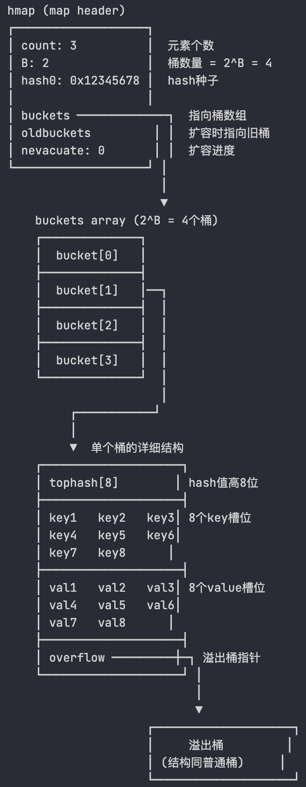
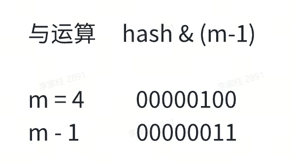
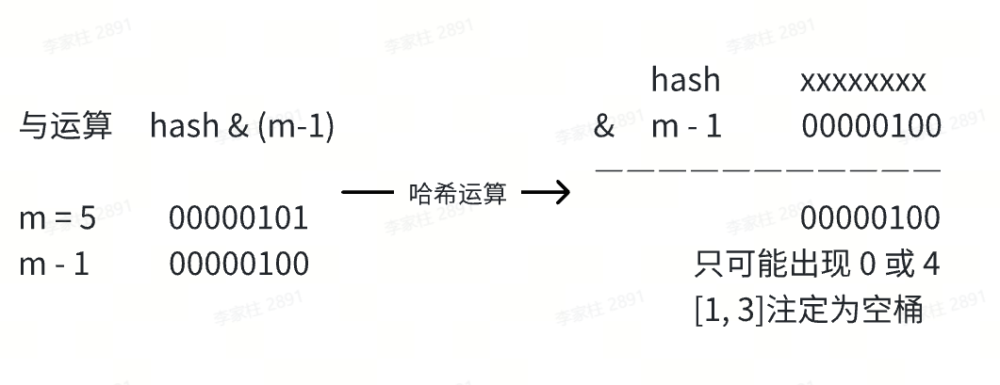
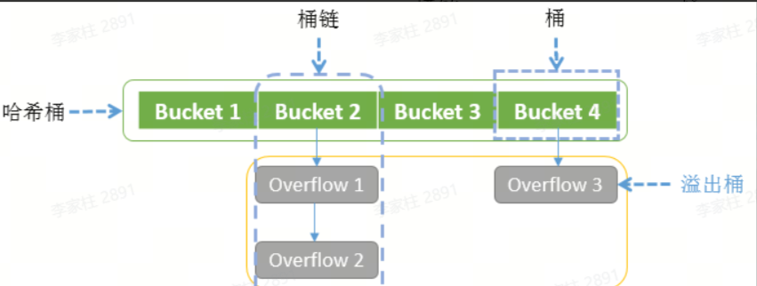

## Map的定义

Map 是一种无序的键值对的集合。Map 最重要的作用是通过 key 来快速检索数据，key 类似于索引，指向数据的值。Map 是一种集合，所以我们可以像迭代数组和切片那样迭代它。不过，Map 是无序的，遍历 Map 时返回的键值对的顺序是不确定的。在获取 Map 的值时，如果键不存在，返回该类型的零值

特点

- 非并发安全，如果在不同 goroutine 并发读写同一个 map，会导致竞态问题甚至崩溃（运行时检测会panic）并发读写需要并发安全的映射，可以加锁（使用 **`sync.Mutex`** ）或者使用 Go 的并发安全容器（如 **`sync.Map`** ）。
- 迭代顺序是随机的，不保证顺序
- 键必须是可比较的类型

## 基本操作

### 声明和初始化

- 声明映射：**`var m map[string]int`**

- 分配内存空间（初始化）：**`make(map[KeyType]ValueType, initialCapacity)`**

  - map 的零值是 nil，不能直接赋值元素，必须用 **`make`** 初始化

- 使用字面量创建Map

  ```go
  // 使用字面量创建 Map
  m := map[string]int{
      "apple": 1,
      "banana": 2,
      "orange": 3,
  }
  ```

### 获取和修改元素

- 获取元素（通过键来获取值）

  ```go
  v1 := m["apple"]
  v2, ok := m["pear"]  // 如果键不存在，ok 的值为 false，v2 的值为该类型的零值
  ```

- 修改/插入元素：**`m["apple"] = 5`**

- 获取长度：**`func len(var map) int`**

### 遍历map

使用range循环来遍历map，返回键k和值v

```go
for k, v := range m {
    fmt.Printf("key=%s, value=%d\n", k, v)
}
```

### 删除元素

- **`func delete(m map[Type]Type, key Type)`** ：从 **map 中删除键值对**
  - 删除不存在的键：不会报错
  - nil map 上使用 **`delete`** ：不会 **`panic`** 只是无效操作

## 底层原理

### 底层数据结构

在 Go 语言中，map 类型的底层实现就是哈希表，map 类型的变量 本质上是一个指针 **`*hmap`** ，指向 hmap 结构体。

```go
// 其定义在 src/runtime/map.go 中
type hmap struct {
    count     int    // 元素个数
    flags     uint8  // 状态标志
    B         uint8  // 桶的数量的对数 (即桶数量为 2^B)
    noverflow uint16 // 溢出桶的数量
    hash0     uint32 // hash seed

    buckets    unsafe.Pointer // 指向桶数组的指针
    oldbuckets unsafe.Pointer // 扩容时指向旧桶的指针
    nevacuate  uintptr       // 扩容时的进度计数器

    extra *mapextra // 额外信息
}
```

Go 使用桶（bucket）存储 kv 信息，对应的数据结构是 bmap

```go
type bmap struct {
    tophash [8]uint8      // hash值的高8位
    keys    [8]keytype    // 键数组
    values  [8]valuetype  // 值数组
    overflow *bmap        // 溢出桶指针
}
```



- Go map 的底层是一个 buckets 数组
- 数组的每个元素都是一个桶（bucket）
- 每个桶可以存储 8 个 kv，当桶满时，会创建溢出桶



为什么设置为8个k-v键值对

8 个键值对的大小正好接近 CPU 的缓存行大小（通常是 64 字节），可以一次将整个桶加载到 CPU 缓存中，减少了 CPU 缓存未命中的概率，提升了访问性能



### 哈希定位原理

类似于Java的HashMap，参考[往期博客](https://tyritic.github.io/p/java%E4%B8%AD%E7%9A%84hashmap%E7%B1%BB%E5%8F%8A%E5%85%B6%E8%A1%8D%E7%94%9F%E7%B1%BB/#hash%E6%96%B9%E6%B3%95%E7%9A%84%E5%BA%95%E5%B1%82%E5%AE%9E%E7%8E%B0:~:text=Copy-,%E6%95%B0%E7%BB%84%E7%B4%A2%E5%BC%95%E8%AE%A1%E7%AE%97%E5%8E%9F%E7%90%86,-%E9%80%9A%E5%B8%B8%E5%9F%BA%E4%BA%8E%E5%93%88) map的哈希方法采用 **与运算：** **`hash & (m-1)`** 来定位哈希桶

需要注意的是，与运算方法如果想确保运算结果落在区间 [0, m-1] 而不会出现空桶，就要限制桶的个数 m 必须是 2 的整数次幂。这样 m 的二进制表示一定只有一位为 1，并且 m-1 的二进制表示一定是低于这一位的所有位均为 1。如果桶的数目不是 2 的整数次幂，就有可能出现有些桶绝对不会被选中的情况。





哈希定位过程

- Go 通过哈希函数，将 key 转成 hash（uint64）
- 桶的位置： **`bucketIndex = hash & (2^B - 1)`** ，等价于 **`hash & mask`**
- 桶内位置：使用 hash 的高 8 位（tophash）在桶内快速查找匹配的 key

### 哈希冲突

Go map 与 Java HashMap 类似，同样使用拉链法



冲突解决策略

- 当桶满时，会创建溢出桶（overflow bucket）
- 查找时会依次遍历链表上的所有桶
- 为了避免链表过长导致性能下降，当链表太长时会触发扩容
