## 🧠 Map的定义

Map 是一种无序的**键值对**的集合。Map 最重要的作用是通过 **key** 来快速检索数据，**key** 类似于索引，指向数据的值。Map 是一种集合，所以我们可以像迭代数组和切片那样迭代它。不过，Map 是无序的，遍历 Map 时返回的键值对的顺序是不确定的。在获取 Map 的值时，如果键不存在，返回该类型的零值

特点

- 非并发安全，如果在不同 **goroutine** 并发读写同一个 **map**，会导致竞态问题甚至崩溃（运行时检测会 **panic**）并发读写需要并发安全的映射，可以加锁（使用 **`sync.Mutex`** ）或者使用 Go 的并发安全容器（如 **`sync.Map`** ）。
- 迭代顺序是随机的，不保证顺序
- 键必须是可比较的类型

**💡 面试要点：Map 的键类型有什么限制？**

Go 语言中，map 的键必须是**可比较的类型**（comparable）。

**可比较类型：**
- 基本类型：**`int`**、**`float`**、**`string`**、**`bool`**
- 指针、**`channel`**、**`interface`**
- 结构体（如果所有字段都可比较）
- 数组（如果元素类型可比较）

**不可比较类型：**
- **`slice`**、**`map`**、**`func`**

**为什么有这个限制？**
- map 的底层实现是哈希表，需要通过 **`==`** 比较键是否相等
- 如果键不可比较，就无法判断两个键是否相同

**示例：**

```go
// 正确：使用 string 作为键
m1 := make(map[string]int)

// 正确：使用 int 作为键
m2 := make(map[int]string)

// 错误：使用 slice 作为键
// m3 := make(map[[]int]int) // 编译错误：invalid map key type []int

// 正确：使用结构体作为键（字段都可比较）
type Key struct {
    Name string
    Age  int
}
m4 := make(map[Key]string)
```

---

## 📐 基本操作

### 📝 声明和初始化

- 声明映射：**`var m map[string]int`**

- 分配内存空间（初始化）：**`make(map[KeyType]ValueType, initialCapacity)`**

  - map 的零值是 nil，不能直接赋值元素，必须用 **`make`** 初始化

- 使用字面量创建Map

  ```go
  // 使用字面量创建 Map
  m := map[string]int{
      "apple": 1,
      "banana": 2,
      "orange": 3,
  }
  ```

**💡 面试要点：map 的容量可以指定吗？**

**可以**，使用 **`make`** 时指定初始容量可以减少扩容次数，提高性能。

```go
// 指定初始容量
m := make(map[string]int, 1000)

// 不指定，可能需要多次扩容
m2 := make(map[string]int)
```

**建议：**
- 如果知道大概的元素数量，建议指定容量
- 避免频繁扩容带来的性能开销

**💡 面试要点：Map 的性能优化建议**

1. **预分配容量**
   - 如果知道大概的元素数量，使用 **`make(map[K]V, hint)`** 预分配
   - 避免频繁扩容带来的性能开销

2. **避免大 value 类型**
   - map 的 value 存储在桶中，大 value 会增加内存占用
   - 考虑使用指针类型：**`map[K]*V`**

3. **合理使用 delete**
   - 删除元素不会缩容，如果大量删除后内存占用高，考虑重建 map

4. **并发场景选择合适的方案**
   - 读多写少：使用 **`sync.Map`**
   - 写多读少：使用 **`map + sync.RWMutex`**

**性能对比示例：**

```go
// 不指定容量：可能多次扩容
m1 := make(map[int]int)
for i := 0; i < 10000; i++ {
    m1[i] = i
}

// 指定容量：避免扩容
m2 := make(map[int]int, 10000)
for i := 0; i < 10000; i++ {
    m2[i] = i
}
```

### 🔍 获取和修改元素

- 获取元素（通过键来获取值）

  ```go
  v1 := m["apple"]
  v2, ok := m["pear"]  // 如果键不存在，ok 的值为 false，v2 的值为该类型的零值
  ```

- 修改/插入元素：**`m["apple"] = 5`**

- 获取长度：**`func len(var map) int`**

**💡 面试要点：如何判断 map 中是否存在某个 key？**

使用双返回值的方式：

```go
m := map[string]int{"a": 1}

// 正确方式
if v, ok := m["a"]; ok {
    fmt.Println("存在，值为：", v)
}

// 错误方式：无法区分零值和不存在
if m["b"] == 0 {
    fmt.Println("不存在或值为 0") // 无法确定
}
```

### 🔁 遍历map

使用range循环来遍历map，返回键k和值v

```go
for k, v := range m {
    fmt.Printf("key=%s, value=%d\n", k, v)
}
```

- Go 中遍历 map 的顺序是不确定的，每次运行可能会不同。

### 🗺️ 嵌套Map

Map 的值可以是另一个 Map，这样就形成了嵌套结构：

```go
package main

import "fmt"

func main() {
    // 创建一个存储学生成绩的嵌套map
    studentScores := map[string]map[string]int{
        "张三": {
            "数学": 95,
            "英语": 88,
            "语文": 92,
        },
        "李四": {
            "数学": 90,
            "英语": 85,
            "语文": 88,
        },
    }
    
    // 获取张三的英语成绩
    englishScore := studentScores["张三"]["英语"]
    fmt.Printf("张三的英语成绩是：%d\n", englishScore)
}
```

运行结果：
```
张三的英语成绩是：88
```

### 📤 Map作为函数参数

Map 是引用类型，作为函数参数时传递的是底层指针的拷贝：

```go
func updatePrice(prices map[string]float64, fruit string, price float64) {
    prices[fruit] = price
}

func main() {
    fruitPrices := map[string]float64{
        "苹果": 5.5,
        "香蕉": 3.8,
    }
    
    updatePrice(fruitPrices, "苹果", 6.0)
    fmt.Printf("更新后苹果的价格：%.2f\n", fruitPrices["苹果"])
}
```

**💡 面试要点：为什么 Go map 的遍历顺序是随机的？**

**1. 设计原因**

- **避免依赖顺序**：防止开发者依赖遍历顺序，提高代码可移植性
- **哈希表的天然特性**：哈希表本身就是无序的
- **安全性考虑**：避免攻击者利用顺序性进行攻击

**2. 实现原理**

Go 在遍历 map 时会：
- 随机选择一个起始桶
- 随机选择桶内的起始位置
- 每次遍历的顺序都可能不同

**代码示例：**

```go
m := map[string]int{
    "a": 1,
    "b": 2,
    "c": 3,
}

// 多次遍历，顺序可能不同
for i := 0; i < 3; i++ {
    for k, v := range m {
        fmt.Printf("%s:%d ", k, v)
    }
    fmt.Println()
}
```

**输出示例：**

```
b:2 a:1 c:3 
c:3 a:1 b:2 
a:1 c:3 b:2 
```

**3. 如果需要有序遍历怎么办？**

先将 key 排序，再按顺序遍历：

```go
keys := make([]string, 0, len(m))
for k := range m {
    keys = append(keys, k)
}
sort.Strings(keys)

for _, k := range keys {
    fmt.Printf("%s:%d\n", k, m[k])
}
```

### 🗑️ 删除元素

- **`func delete(m map[Type]Type, key Type)`** ：从 **map 中删除键值对**
  - 删除不存在的键：不会报错
  - nil map 上使用 **`delete`** ：不会 **`panic`** 只是无效操作
  - 删除 key 操作只是将对应的 key-value 对标记为空，但不会释放桶（不会释放内存），也不会触发缩容

**💡 面试要点：删除 map 中的元素会缩容吗？**

**不会缩容**。删除元素只是标记为空，不会释放桶的内存，也不会触发缩容。

**原因：**
- 缩容需要重新分配内存和迁移数据，成本较高
- 删除操作频繁时，缩容会导致性能下降
- 如果需要释放内存，只能创建新的 map 并复制需要的元素

---

## ⚠️ 踩坑实录

### 💥 直接操作nil map，发生panic

问题：直接操作未初始化的map，会触发panic

```Go
package main

func main() {
    var m map[string]string
    m["key"] = "value"
}
// 运行结果
panic: assignment to entry in nil map

goroutine 1 [running]:
main.main()
        .../main.go:5 +0x38

Process finished with the exit code 2
```

解决方法：使用map前，需对map进行初始化。

```Go
package main

func main() {
    m := map[string]string{}
    m["key"] = "value"

    n := make(map[string]string)
    n["key"] = "value"
}
```

### 🔢 float 类型作为 key 的问题

**问题：float 类型可以作为 map 的 key 吗？**

**回答：**

**可以**，但**不推荐**。

**原因：**
- float 类型存在精度问题，**`NaN`** 不等于自身
- 计算哈希时可能出现不稳定的结果
- 可能导致查找失败

**示例：**

```go
m := make(map[float64]string)
m[1.0] = "one"
m[math.NaN()] = "NaN"

// NaN 作为 key 无法查找
fmt.Println(m[math.NaN()]) // 输出空字符串
```

### 📋 map 的 value 为切片的问题

**问题：map 的 value 可以是切片吗？**

**回答：**

**可以**，但需要注意初始化。

**示例：**

```go
m := make(map[string][]int)

// 正确：先检查是否存在，再追加
key := "numbers"
if _, ok := m[key]; !ok {
    m[key] = []int{}
}
m[key] = append(m[key], 1, 2, 3)

// 更简洁的方式
m[key] = append(m[key], 4, 5, 6)
```

### ⚡ 并发读写 map 导致 panic

**问题：并发读写 map 会导致什么问题？**

**回答：**

Go map **不是并发安全的**。并发读写会导致 **`panic: concurrent map read and map write`** 或 **`panic: concurrent map writes`**。

**原因：**
- Go runtime 会检测并发访问，发现冲突时直接 panic
- 这是一种快速失败（fail-fast）机制，避免数据竞争导致的不确定行为

**解决方案：**

```go
// 方案1：使用互斥锁
var (
    m  = make(map[string]int)
    mu sync.RWMutex
)

func read(key string) int {
    mu.RLock()
    defer mu.RUnlock()
    return m[key]
}

func write(key string, value int) {
    mu.Lock()
    defer mu.Unlock()
    m[key] = value
}

// 方案2：使用 sync.Map（读多写少场景）
var m sync.Map

m.Store("key", "value")
if v, ok := m.Load("key"); ok {
    fmt.Println(v)
}
```

---

## 🔬 底层原理

### 🪣 数据结构与内存布局

在 Go 语言中，map 类型的底层实现就是哈希表，map 类型的变量 本质上是一个指针 **`*hmap`** ，指向 **`hmap`** 结构体。

- Go map 的底层是一个 **`buckets`** 数组
- 数组的每个元素都是一个桶（bucket）
- 每个桶可以存储 8 个 kv，当桶满时，会创建溢出桶

```go
// 其定义在 src/runtime/map.go 中
type hmap struct {
    count     int    // 元素个数
    flags     uint8  // 状态标志
    B         uint8  // 桶的数量的对数 (即桶数量为 2^B)
    noverflow uint16 // 溢出桶的数量
    hash0     uint32 // hash 种子，为hash函数引入随机性

    buckets    unsafe.Pointer // 指向桶数组的指针
    oldbuckets unsafe.Pointer // 扩容时指向旧桶的指针
    nevacuate  uintptr       // 扩容时的进度计数器

    extra *mapextra // 额外信息
}
```


Go 使用桶（bucket）存储 kv 信息，对应的数据结构是 bmap

```go
type bmap struct {
    tophash [8]uint8      // hash值的高8位
    keys    [8]keytype    // 键数组
    values  [8]valuetype  // 值数组
    overflow *bmap        // 溢出桶指针
}
```

<div align="center">
  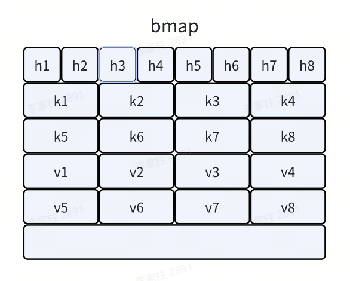
</div>




为什么设置为8个k-v键值对

8 个键值对的大小正好接近 CPU 的缓存行大小（通常是 64 字节），可以一次将整个桶加载到 CPU 缓存中，减少了 CPU 缓存未命中的概率，提升了访问性能



**💡 面试要点：Go map 的底层实现原理**

Go map 的底层实现是**哈希表**，核心数据结构是 **`hmap`**（hash map 的缩写），主要包含以下关键字段：

- **`count`**：当前 map 中元素的数量
- **`B`**：桶数量的对数，桶数量为 $2^B$
- **`buckets`**：指向桶数组的指针
- **`oldbuckets`**：扩容时指向旧桶数组的指针
- **`hash0`**：哈希种子，增加哈希的随机性

每个桶（**`bmap`**）可以存储 8 个键值对，包含：
- **`tophash`**：存储哈希值的高 8 位，用于快速定位
- **`keys`** 和 **`values`**：存储键值对
- **`overflow`**：指向溢出桶的指针

最后是一个 bmap 型指针，指向一个溢出桶，溢出桶的内存布局与常规桶相同，是为了减少扩容次数而引入的。当一个桶存满了，还有可用的溢出桶时，就会在桶后面链一个溢出桶，继续往溢出桶里面存。

<div align="center">
  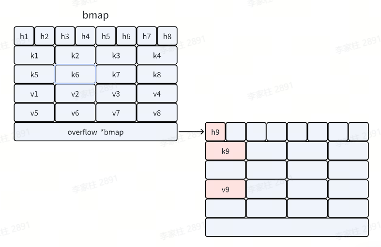
</div>

实际上如果哈希表要分配的桶的数目大于 $2^4$，就认为使用到溢出桶的几率较大，就会预分配 $2^{B-4}$ 个溢出桶备用，这些溢出桶与常规桶在内存中是连续的，只是前 $2^B$ 个用作常规桶，后面的用作溢出桶。

**🏗️ Go map 的整体结构图**

Go 运行时里的 map 本质上是一个指向 `hmap` 的指针，而 `hmap` 管理整张哈希表，真正存储数据的是桶数组和溢出桶链。

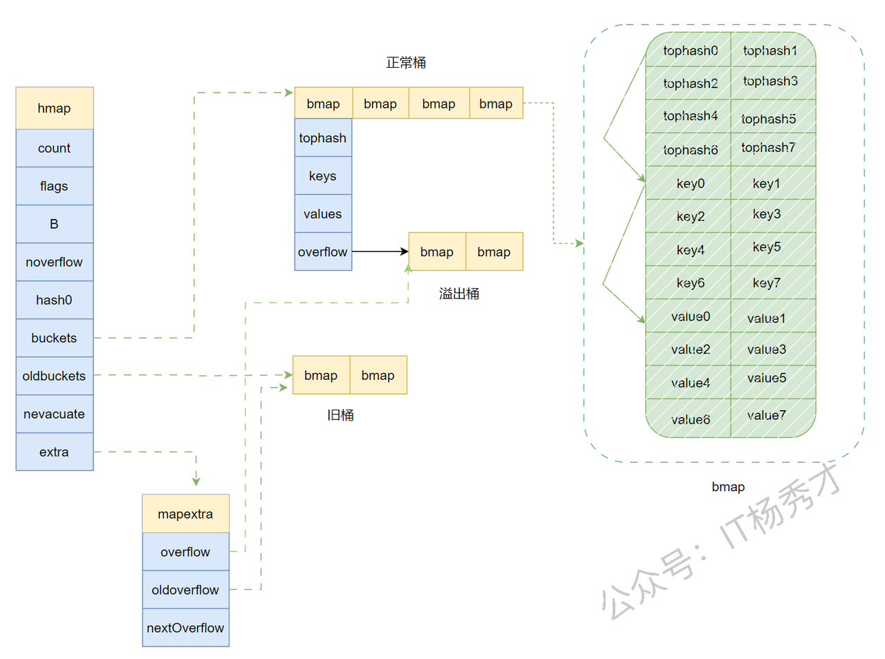

**📦 mapextra 与预分配溢出桶**

除了 `hmap` 和 `bmap`，运行时里还有一个很容易被忽略的结构：`mapextra`。它主要负责维护溢出桶，尤其是 key/value 不含指针时，运行时会把溢出桶集中挂在这里，避免 GC 扫描遗漏。

```go
type mapextra struct {
    overflow    *[]*bmap
    oldoverflow *[]*bmap
    nextOverflow *bmap
}
```

- **`overflow`**：当前桶数组使用到的溢出桶
- **`oldoverflow`**：扩容期间旧桶数组对应的溢出桶
- **`nextOverflow`**：预分配但尚未使用的下一个溢出桶

这也是为什么 Go map 在发生冲突时，并不总是现场申请一个新桶，而是可能直接复用已经预留好的溢出桶。

**🎯 tophash 与桶内布局补充**

Go 对每个 key 算出 hash 后，并不会一次性把整个 hash 都拿来比较，而是拆成两部分使用：

- 低位用于定位桶
- 高 8 位用于桶内快速过滤，也就是 `tophash`

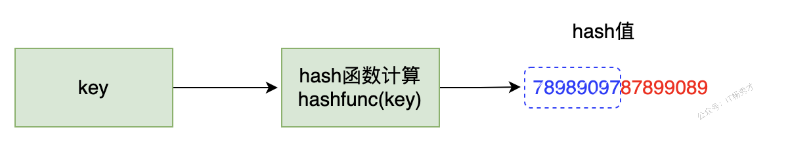

每个 `bmap` 会先连续存储 8 个 key，再连续存储 8 个 value，而不是 `key/value` 交替排列。这样可以减少内存对齐带来的浪费。

### 🎯 哈希定位与冲突处理

类似于 **Java** 的 **HashMap**，参考[往期博客](https://tyritic.github.io/p/java%E4%B8%AD%E7%9A%84hashmap%E7%B1%BB%E5%8F%8A%E5%85%B6%E8%A1%8D%E7%94%9F%E7%B1%BB/#hash%E6%96%B9%E6%B3%95%E7%9A%84%E5%BA%95%E5%B1%82%E5%AE%9E%E7%8E%B0:~:text=Copy-,%E6%95%B0%E7%BB%84%E7%B4%A2%E5%BC%95%E8%AE%A1%E7%AE%97%E5%8E%9F%E7%90%86,-%E9%80%9A%E5%B8%B8%E5%9F%BA%E4%BA%8E%E5%93%88) **map** 的哈希方法采用 **与运算：** **`hash & (m-1)`** 来定位哈希桶

需要注意的是，与运算方法如果想确保运算结果落在区间 [0, m-1] 而不会出现空桶，就要限制桶的个数 m 必须是 2 的整数次幂。这样 m 的二进制表示一定只有一位为 1，并且 m-1 的二进制表示一定是低于这一位的所有位均为 1。如果桶的数目不是 2 的整数次幂，就有可能出现有些桶绝对不会被选中的情况。

<div align="center">
  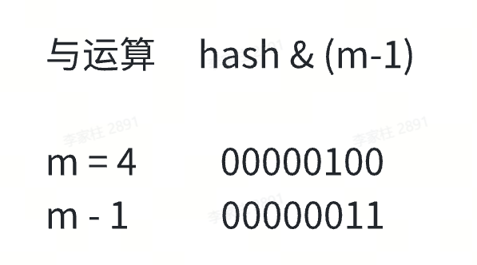
</div>

<div align="center">
  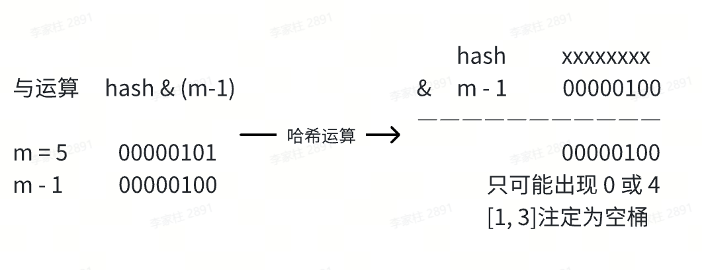
</div>

哈希定位过程

- Go 通过哈希函数，将 key 转成 hash（uint64）
- 桶的位置： **`bucketIndex = hash & (2^B - 1)`** ，等价于 **`hash & mask`**
- 桶内位置：使用 hash 的高 8 位（tophash）在桶内快速查找匹配的 key

这里的两个术语可以顺手说明一下：

- **hash 值**：指 key 经过运行时哈希函数计算后的结果。这个值不会被整体直接拿来当桶下标，而是拆开使用。
- **掩码（mask）**：指定位桶位置时使用的那个值，通常就是 **`2^B - 1`**。

其中：

- hash 的低位配合掩码来定位桶；
- hash 的高 8 位会放入 `tophash`，用于桶内快速过滤。

例如当 **`B = 3`** 时，桶数量是 **`2^3 = 8`**，那么掩码就是 **`8 - 1 = 7`**，二进制写成 **`111`**。这时：

```text
hash = 11010110
mask = 00000111
----------------
hash & mask = 00000110
```

结果是 `6`，说明这个 key 会落到第 6 号桶。也可以把它理解成：**掩码的作用就是把 hash 的低 B 位“抠出来”，用于快速计算桶下标。**

**💡 面试要点：哈希定位过程**

1. **为什么桶的个数必须是 2 的整数次幂？**
   - 使用与运算 **`hash & (m-1)`** 定位桶，要求 m 必须是 2 的幂
   - 这样 m-1 的二进制表示是低位全 1，确保哈希值能均匀分布到所有桶
   - 如果不是 2 的幂，会出现某些桶永远不会被选中的情况

2. **哈希定位的完整流程：**
   - 通过哈希函数计算 key 的哈希值（uint64）
   - 使用低 B 位定位桶：**`bucketIndex = hash & (2^B - 1)`**
   - 使用高 8 位（tophash）在桶内快速查找匹配的 key

**🔗 Go 为什么选拉链法，而不是开放地址法？**

在理解 Go map 的实现前，先看两种经典的哈希冲突处理方案。

**1. 拉链法**

拉链法的核心思想是：桶数组负责定位，冲突的数据通过额外结构串起来。传统实现常见的是“数组 + 链表”，而 Go 做了优化，不是一个节点只放一个键值对，而是一个桶里先放 8 个键值对，桶满了再通过 `overflow` 指针挂溢出桶。

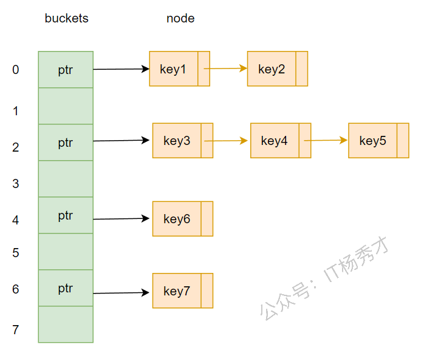

**2. 开放地址法**

开放地址法不再额外挂链，而是把元素都直接放在数组里。遇到冲突时，不断向后探测空槽位，直到找到可插入的位置。

```text
hash(key) = (hash1(key) + i) % len(buckets)
```

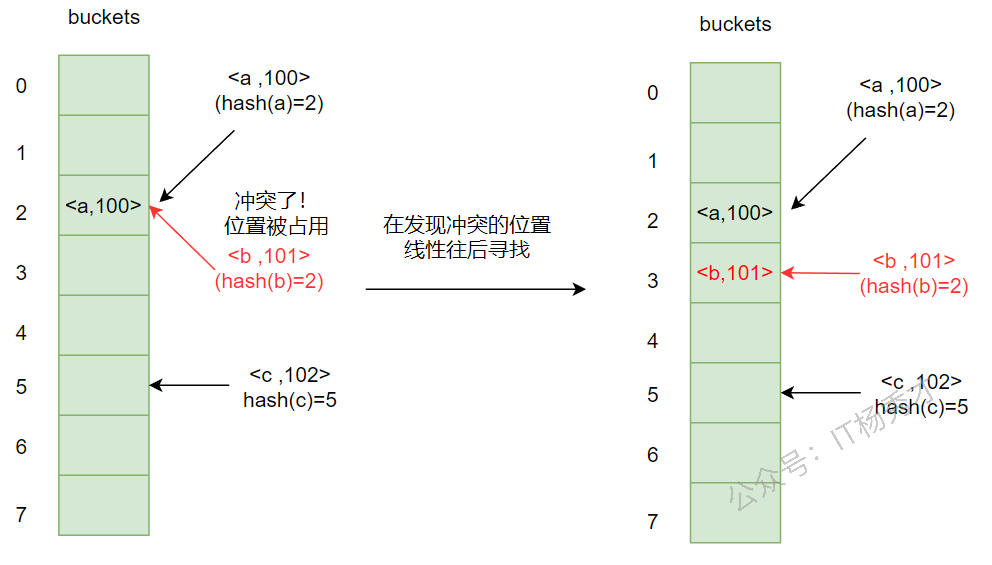

**Go 最终选择的是“桶 + 溢出桶”的变种拉链法。**这样既能把冲突控制在桶和溢出桶链上，又能兼顾缓存友好性和扩容迁移效率。

**⚔️ 哈希冲突**

**Go map** 与 **Java HashMap** 类似，同样使用拉链法

<div align="center">
  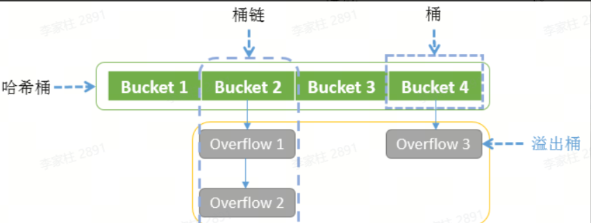
</div>

冲突解决策略

- 当桶满时，会创建溢出桶（overflow bucket）
- 查找时会依次遍历链表上的所有桶
- 为了避免链表过长导致性能下降，当链表太长时会触发扩容

**💡 面试要点：哈希冲突解决**

Go map 使用**拉链法**解决哈希冲突：
- 当桶满时，创建溢出桶（overflow bucket）
- 查找时依次遍历链表上的所有桶
- 为了避免链表过长导致性能下降，当链表太长时会触发扩容

### 📈 扩容与迁移

#### 🚀 扩容的触发条件

1. 负载因子超过 6.5 时，触发 **翻倍扩容**（kv 数量 / 桶的数量 > 6.5 时，桶的数量翻倍）
2. 溢出桶过多时，触发 **等量扩容**（溢出桶过多，分布不均浪费内存，重建 map）

扩容期间的操作处理

1. 读操作：检查新旧桶，不触发迁移
2. 新增操作：触发迁移，在新桶中写入
3. 更新操作：触发迁移，确保目标桶已迁移后，在新桶更新数据
4. 删除操作：检查新旧桶，不触发迁移

#### 🔄 渐进式迁移

<div align="center">
  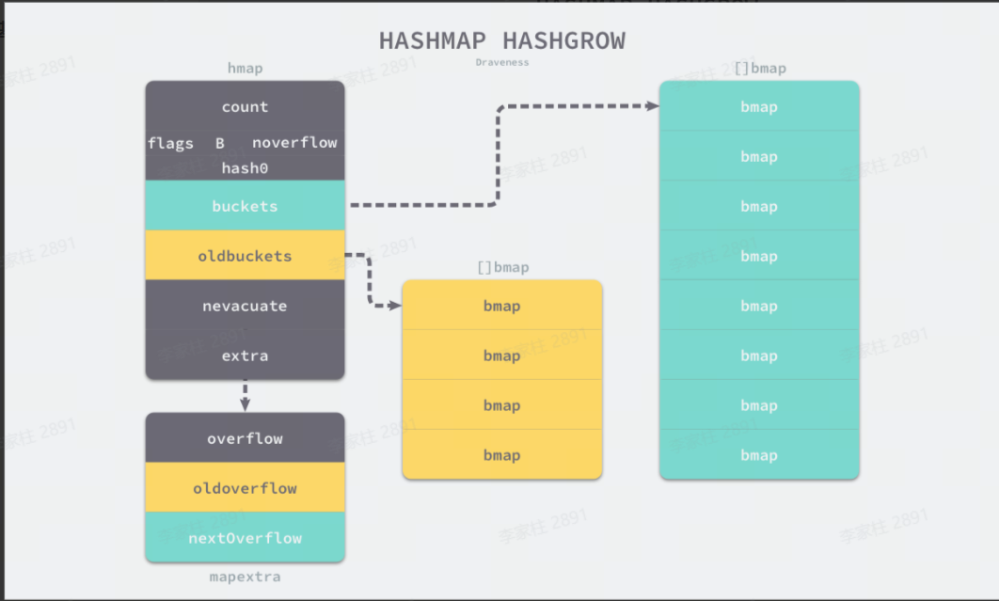
</div>

**`hmap`** 的源码如下

```go
// 其定义在 src/runtime/map.go 中
type hmap struct {
    count     int    // 元素个数
    flags     uint8  // 状态标志
    B         uint8  // 桶的数量的对数 (即桶数量为 2^B)
    noverflow uint16 // 溢出桶的数量
    hash0     uint32 // hash 种子，为hash函数引入随机性

    buckets    unsafe.Pointer // 指向桶数组的指针
    oldbuckets unsafe.Pointer // 扩容时指向旧桶的指针
    nevacuate  uintptr       // 扩容时的进度计数器

    extra *mapextra // 额外信息
}
```

在哈希表扩容时，先分配足够多的新桶，然后用一个字段记录 “旧桶” 的位置 **`oldbuckets`** ，再增加一个字段记录 “旧桶” 的迁移进度，例如记录下一个要迁移的 “旧桶” 编号 **`nevacuate`** 。

<div align="center">
  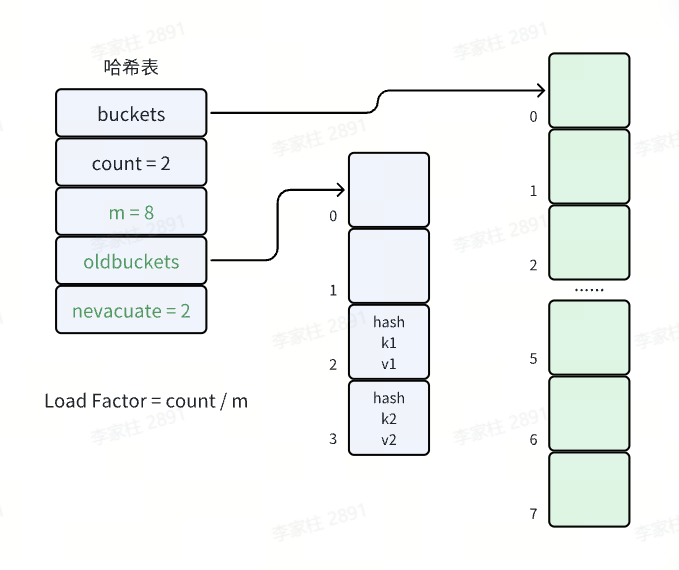
</div>

在哈希表每次读写操作时，如果检测到当前处于扩容阶段，就完成一部分键值对的迁移任务，直到所有的 “旧桶” 迁移完成，“旧桶” 不再使用才算真正完成了一次哈希表的扩容。把键值对迁移的时间分摊到多次哈希表操作中的方式，就是 “渐进式扩容” 了，可以避免一次性扩容带来的性能瞬时抖动。


#### ✨ 翻倍扩容

当负载因子大于 6.5，即 map 元素个数 / 桶个数 > 6.5 时，就会触发翻倍扩容

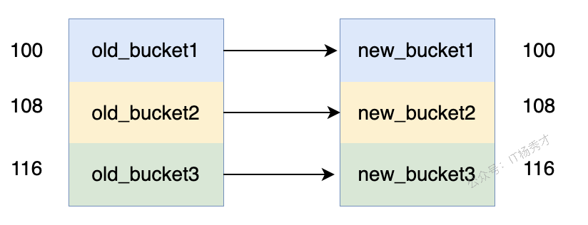

```go
func overLoadFactor(count int, B uint8) bool {
   return count > bucketCnt && uintptr(count) > loadFactor * bucketShift(B)
}
```

- **`bucketCnt`** = 8，一个桶可以装的最大元素个数
- **`loadFactor`** = 6.5，负载因子，平均每个桶的元素个数
- **`bucketShift(B)`** ：桶的个数

此时，**`buckets`** 就会指向刚分配出来的新桶，而 **`oldbuckets`** 则会指向旧桶，并且 **`nevacuate`** 为 0，标识接下来要迁移编号为 0 的旧桶，每个旧桶的键值对都会分流到新桶中。

同时这里体现出桶的个数设置为2的n次方的优点，当 **`Map`** 扩容时，通过容量为 2 的 n 次方，扩容时只需通过简单的位运算判断是否需要迁移，这减少了重新计算哈希值的开销，提升了重新哈希的效率。

例如，旧桶的数量为 4，那么翻倍扩容后新桶的数量就为 8。

<div align="center">
  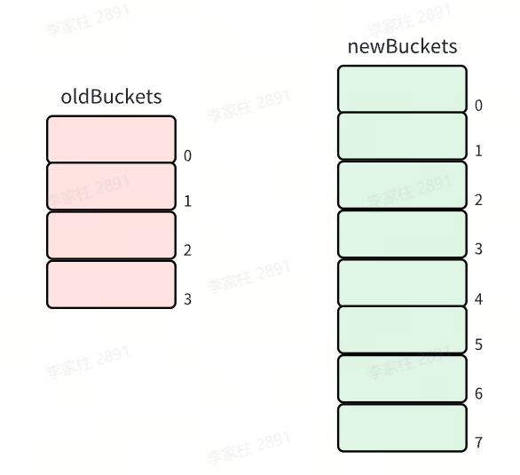
</div>

不需要每个 **`bucket`** 重新 hash 算下标。因为元素的新位置只与高位有关

此时迁移桶只要判断原来的 hash 拓展后新增的位是 0 还是 1

<div align="center">
  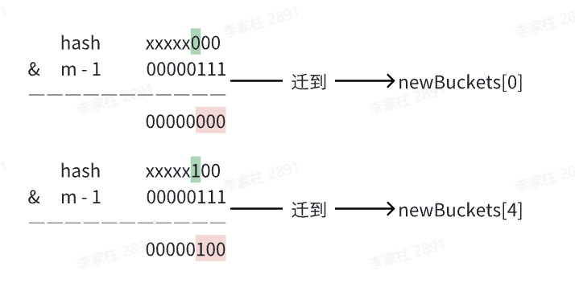
</div>

若为 0 则保持在原来的位置（hash 1 保持为 0）

若为 1 则被移动到原来的位置加上旧数组长度的地方（hash 2 被移动到 0+4=4 处）

#### 🔃 等量扩容

如果负载因子没有超标，但是使用的溢出桶较多，也会触发扩容：

1. 当常规桶数量不大于 $2^{15}$ 时（B <= 15），此时如果溢出桶总数 >= 常规桶总数（**`noverflow`** >= $2^B$），则认为溢出桶过多，就会触发等量扩容。
2. 当常规桶数量大于 $2^{15}$ 时（B > 15），此时直接与 $2^{15}$ 比较，当溢出桶总数 >= $2^{15}$ 时（**`noverflow`** >= $2^{15}$），即认为溢出桶太多了，也会触发等量扩容。

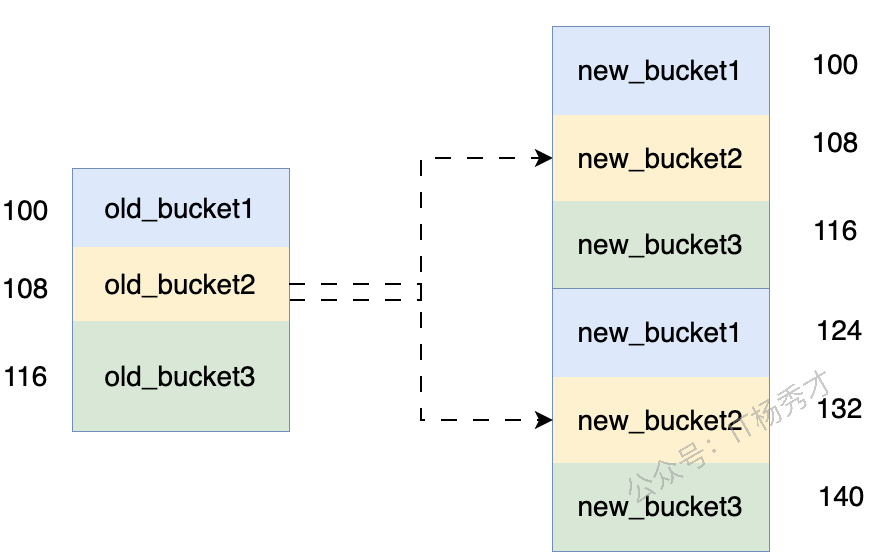

```go
func tooManyOverflowBuckets(noverflow uint16, B uint8) bool {
    // If the threshold is too low, we do extraneous work.
    // If the threshold is too high, maps that grow and shrink can hold on to lots of unused memory.
    // "too many" means (approximately) as many overflow buckets as regular buckets.
    // See incrnoverflow for more details.
    if B > 15 {
        B = 15
    }
    // The compiler does not see here that B < 16; mask B to generate shorter shift code.
    return noverflow >= uint16(1)<<(B&15)
}
```

所谓等量扩容，就是创建和旧桶数量一样多的新桶，然后把原来的键值对迁移到新桶中。当有很多键值对被删除的时候，就有可能出现已经使用了很多溢出桶，但是负载因子仍没有超过上限值的情况。此时如果触发了等量扩容，则会分配等量的新桶。而旧桶的每一个桶则会迁移到对应的新桶中，迁移完后可以使每个键值对排列的更加紧凑，从而减少溢出桶的使用。

<div align="center">
  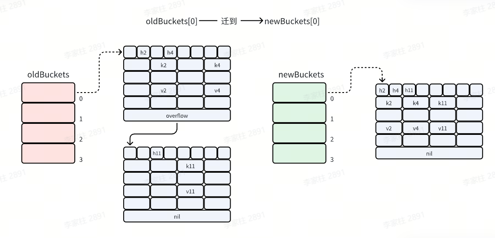
</div>

**💡 面试要点：Map 扩容机制**

1. **为什么使用渐进式扩容？**
   - 避免一次性扩容导致的性能抖动
   - 将迁移时间分摊到多次读写操作中

2. **扩容期间的操作：**
   - 读操作：检查新旧桶
   - 写操作：触发迁移后在新桶操作
   - 删除操作：检查新旧桶

3. **两种扩容方式的区别：**
   - **翻倍扩容**：负载因子 > 6.5 时触发，桶数量翻倍
   - **等量扩容**：溢出桶过多时触发，桶数量不变，重新整理数据

---

### ⚙️ 常见操作的运行时行为

#### 🔍 map 的访问原理

对 map 的读取，表面上只有两种写法：

```go
v := m[key]
v, ok := m[key]
```

这两种写法的返回形式不同，运行时走到的访问路径也不完全一样，但核心查找流程是一致的。

但运行时内部会做更多事情：

1. 先判断 map 是否为 `nil` 或元素数量是否为 0。
2. 做一次 **map 写检测**。如果当前 map 正处于写状态，运行时会直接报 `fatal error`，避免读写并发把哈希表状态破坏掉。
3. 计算 key 的哈希值和掩码，并用低位确定桶的位置。
4. 如果当前 map 正在扩容，需要先判断目标桶是否已经迁移：
   - 已迁移，就到新桶里找。
   - 未迁移，就先到旧桶里找。
5. 进入目标桶后，先用哈希值高 8 位的 `tophash` 做一次快速过滤，再决定是否继续比较真正的 key。
6. 遍历当前桶中的 8 个槽位：
   - `tophash` 相同，就继续比较 key 本身。
   - key 也相同，就直接返回对应 value。
   - `tophash` 不同，则继续看下一个槽位。
   - 如果遇到表示“后续为空”的状态位，可以直接提前结束查找，因为后面不可能再有这个 key。
7. 当前桶没找到，就沿着 `overflow` 指针继续遍历溢出桶，重复同样的查找过程。
8. 全部找完仍未命中时，返回 value 类型的零值；双返回值形式下，`ok` 为 `false`。

访问流程示意图：

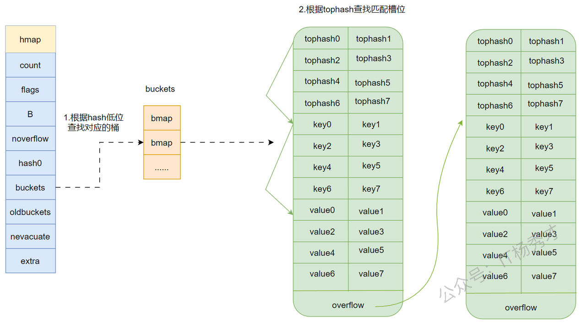

这里有两个容易忽略的细节：

- **读操作虽然不会修改 map 的逻辑内容，但在扩容阶段，访问旧桶时依然可能顺手触发部分桶迁移。** 这也是 Go 渐进式扩容的重要特征。
- 查找时并不是一上来就对每个 key 做完整比较，而是先看 `tophash`，只有高 8 位匹配时才继续比对真正的 key，这样可以明显降低桶内比较成本。

#### ✍️ map 的赋值原理

赋值入口看起来很简单：

```go
m[key] = value
```

但运行时内部会依次完成这些动作：

1. 检查 map 是否已初始化；对 `nil map` 赋值会直接 `panic`。
2. 检查写标志位，避免并发写破坏哈希表状态。
3. 计算哈希值，找到目标桶。
4. 如果目标桶处于扩容区间，先触发该桶迁移。
5. 在主桶和溢出桶里按 `tophash -> key` 的顺序查找。
6. 找到同 key 就覆盖 value；找不到且有空槽就插入；都满了就挂新的溢出桶。

补充了一个很适合面试时说的点：Go runtime 会维护一个写标志位 `hashWriting`。当一个 goroutine 正在写 map 时，另一个 goroutine 再写或者与读并发冲突，就可能触发：

```text
fatal error: concurrent map read and map write
```

所以 Go 的普通 map 从设计上就是**非并发安全**的。

#### 🗑️ map 的删除原理

`delete(m, key)` 的行为比很多人想象得更“温和”：

- 删除不存在的 key，不报错。
- 对 `nil map` 执行 `delete`，合法但无效果。
- 删除元素后，不会立刻归还桶内内存。

运行时内部删除时，会把对应槽位标成空状态。常见的两个状态可以这样理解：

- **`emptyOne`**：这个位置空了，但后面可能还有元素。
- **`emptyRest`**：从这个位置往后都可以视为没数据了，查找时可以提前结束。

删除动作对应的核心逻辑位于 `runtime.mapdelete`。在真正清空目标槽位之前，前置流程和访问、赋值类似，也会先做写检测、定位 bucket，并找到目标 key 所在的位置。

清空槽位时，运行时会把 `tophash` 状态向前收紧，核心代码类似下面这样：

```go
for {
   b.tophash[i] = emptyRest
   if i == 0 {
      if b == bOrig {
         break
      }
      c := b
      for b = bOrig; b.overflow(t) != c; b = b.overflow(t) {
      }
      i = bucketCnt - 1
   } else {
      i--
   }
   if b.tophash[i] != emptyOne {
      break
   }
}
```

这段逻辑的重点是：

1. 找到目标 key 后，会先清掉该槽位对应的 key/value。
2. 如果该槽位后面已经没有有效元素，就把当前位置从 `emptyOne` 进一步收紧为 `emptyRest`。
3. 然后继续向前检查前一个槽位：
   - 如果前一个槽位也只是普通空位 `emptyOne`，就继续把它推进成 `emptyRest`；
   - 一旦遇到前面还有有效元素，就停止。

这样做的目的，是尽量把“后续已经没有元素”这个事实向前传播。因为在查找时，一旦碰到 `emptyRest`，运行时就可以直接停止继续扫描当前桶或这段连续槽位，避免无意义比较。

举个更直观的例子：

- 假设当前 map 的状态如第一张图所示。
- `overflow bucket 2` 后面没有继续挂新的溢出桶，或者后续溢出桶里已经没有数据。
- 这时 `overflow bucket 2` 中第 `2`、`3`、`6` 个位置是普通空槽，也就是 `emptyOne`。

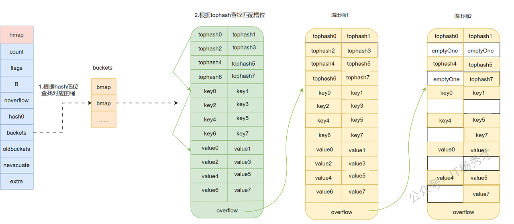

如果这时删除了 `overflow bucket 1` 中的 `key2`、`key4`，以及 `overflow bucket 2` 中的 `key7`，删除后的状态就会变成第二张图：

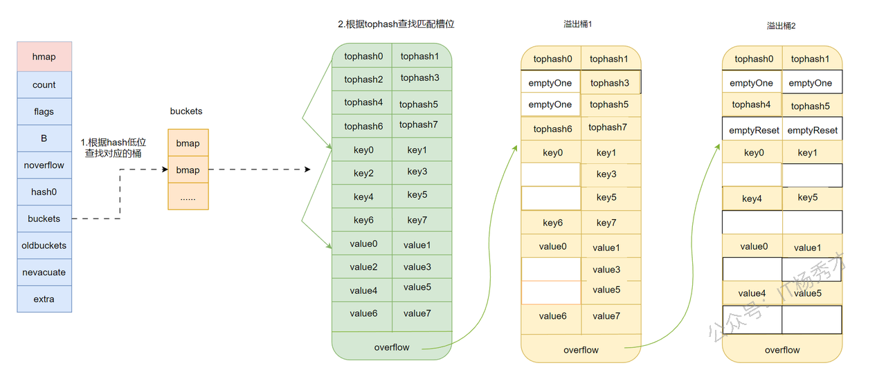

这个例子想说明的是：

1. 删除 key 之后，运行时不会简单地只把当前位置标空就结束。
2. 它会继续检查这个槽位后面是否还有有效元素。
3. 如果确认后面已经没有元素，就会把当前位置以及前面一段连续的 `emptyOne` 尽可能推进成 `emptyRest`。

这样处理之后，后续查找一旦扫到这段 `emptyRest`，就能立刻判断“后面不可能再有数据”，不需要继续往后遍历溢出桶里的剩余槽位。

**图例详解：按删除顺序看状态是怎么变化的**

可以按 `key2 -> key4 -> key7` 这三个删除动作来理解这两张图。

**第一次删除 `key2`**

- 运行时先定位到 `key2` 所在槽位，并把该位置清空。
- 但这时 `key2` 后面通常还挂着别的有效元素，比如后续槽位里的 `key4`，或者后面的溢出桶里还有 `key7`。
- 所以这个位置虽然空了，但还不能直接认定“后面都没数据了”。
- 这时它更可能保持为 **`emptyOne`**，意思是：这里空了，但后面可能还有元素，查找还不能停。

**第二次删除 `key4`**

- 删除 `key4` 后，运行时会继续判断 `key4` 后面是否还有有效元素。
- 如果这时后续溢出桶里仍然还有 `key7`，那么查找链路就还没断。
- 所以 `key4` 这个位置也不能直接升级成 **`emptyRest`**。
- 换句话说，前面虽然越来越空，但只要后面还存在有效元素，前面的空槽就只能算“普通空位”，不能算“尾部全空”。

**第三次删除 `key7`**

- 这是这个例子里最关键的一步，因为 `key7` 已经位于后面那段有效元素的尾部。
- 当 `key7` 被删掉后，运行时再往后看，发现后面已经没有任何有效元素了。
- 这时 `key7` 所在位置就可以标成 **`emptyRest`**。
- 接着，运行时会继续往前回看：
  - 如果前一个槽位原本只是 `emptyOne`，但它后面现在也已经彻底没有有效元素了；
  - 那它也可以从 `emptyOne` 进一步推进成 `emptyRest`。
- 于是就会出现一段连续空槽被“整体收紧”的效果。

这就是为什么源码里的删除逻辑不是“删完当前槽位就结束”，而是会继续向前扫描。它的目标不是只清空一个位置，而是尽可能把一段连续的普通空位压缩成“后续全空”的状态。

可以把这两个状态简单理解成：

- **`emptyOne`**：这里空，但后面也许还有货。
- **`emptyRest`**：这里开始，后面整段都空了，可以直接停止查找。

这里再补关键结论：**map 删除 key 采用的是标记为空的策略，不会立即释放对应内存。只有整个 map 不再被引用时，才由 GC 回收。** 这也解释了为什么大量删除后，如果很在意内存占用，通常需要重建一个新的 map。

#### 🔁 map 的遍历原理

Go 对 map 的遍历故意做成“无序”，不是副作用，而是设计目标。

运行时遍历依赖一个迭代器 `hiter`，它会记录：

- 当前遍历到哪个桶
- 从桶内哪个槽位开始
- 当前 map 是否处于扩容状态
- 当前桶对应的新旧桶信息

初始化迭代器时，运行时会做两次随机选择：

1. 随机选一个起始桶 `startBucket`
2. 随机选一个桶内起始槽位 `offset`

这就是为什么同一个 map 多次 `range`，顺序也可能不同。这样做的好处有两个：

- 防止开发者错误依赖遍历顺序
- 扩容是渐进式的，元素位置本来就可能变化，无序更符合真实语义

如果在遍历期间遇到还没迁移完的旧桶，运行时会优先从旧桶中筛出本轮应该返回的那部分 key，再继续推进遍历。


### 💡 补充结论

- `map` 的冲突处理不是简单链表，而是“一个桶放 8 个 kv + overflow 桶链”。
- `map` 扩容不是一次搬完，而是按访问逐步迁移。
- 读操作在扩容期间也可能触发迁移，这一点很容易被忽略。
- `delete` 只是标空，不会立刻释放桶内内存。
- 普通 `map` 的并发读写会被运行时直接判定为致命错误。

