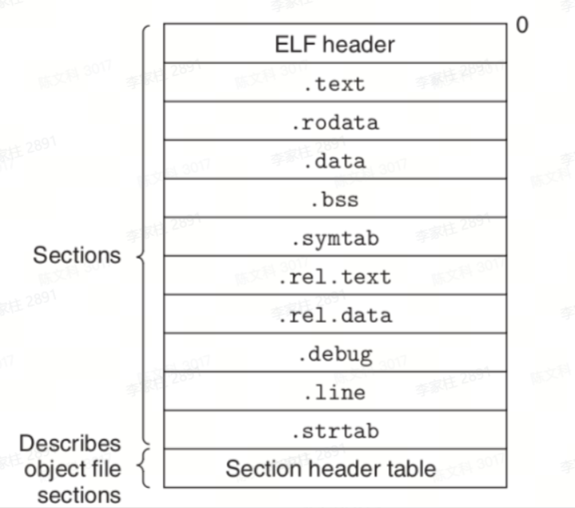
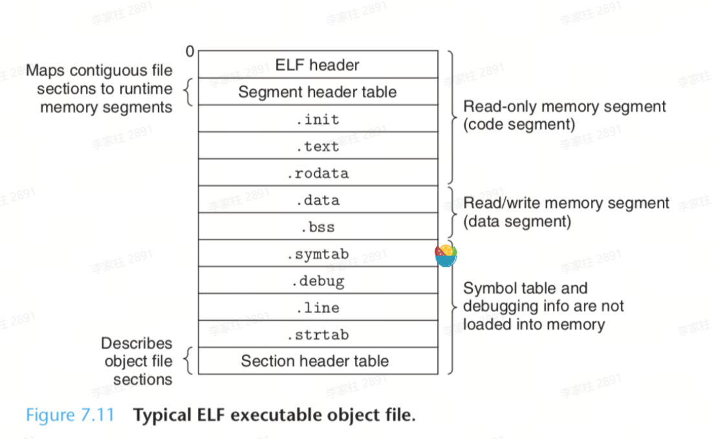

## 编译运行原理

使用 **`go run`** 命令可以快速运行 Go 文件，使用 **`go build`** 命令可以编译成可执行文件。

```go
go run main.go
go build -o myapp main.go
```

- 执行命令显示编译链接的过程： **`go build -v -x -work -o hello hello.go`**
  - -v： 打印所编译的包的名字
  - -x： 打印编译期间所执行的命令
  - -work: 打印编译期间用于存放中间文件的临时目录，并且编译结束时不删除

### 编译运行过程

go build分别调用了编译器( **`.../tool/os_arc/compile`** )和链接器( **`.../tool/os_arc/link`** )，分别来完成编译和链接的操作。



总而言之

- 编译：编译阶段逻辑上其实可以细分为 **预处理**，**编译**，**汇编** 三个阶段。整个编译阶段就是通过词法分析，语法分析和语义分析，把文本代码翻译成可重定位的目标文件(.o文件)的过程, 如上图。其中，编译优化也发生在这个阶段。
  - 预处理: 例如: 解析依赖库。
  - 编译：将预处理后的代码，翻译成汇编代码(.s文件)。
  - 汇编：将生成的汇编代码，翻译成可重定位的目标文件(.o文件，relocatable object file)。注意，目标文件纯粹就是字节块的集合。
- 链接：链接阶段主要是通过 **符号解析** 和 **重定位** 把编译阶段生成的.o文件，链接生成可执行目标文件。
  - 符号解析：目标文件定义和引用符号。符号解析的目的是将每个符号引用和一个符号定义联系起来。
  - 重定位：编译阶段生成的代码和数据节都是从地址零开始的，链接器通过把每个符号定义与一个存储器位置联系起来，然后修改所有对这些符号的引用，使得它们指向这个存储器位置，从而重定向这些节(section)。进而生成可执行目标文件



### 编译器优化

#### 内联函数

由于函数调用有一些固定的开销，例如函数调用栈和抢占检查(preemption check), 所以对于一些代码行比较少的函数，编译器倾向于把它们在编译时展开，这种行为被称为内联。

- 内联函数的缺点： 由于函数被展开了，无法设置断点，使得调试变得很困难。
- 查看编译器的优化决策可以使用选项: `-gcflags=-m`，也可以使用`-gcflags=-l`选项禁止编译器内联优化。

#### 逃逸分析

通常情况下，从栈上分配内存要比从堆中分配内存高效的多，对于golang来说，从goroutine的stack上分配内存比从堆上分配内存要高效的多，因为stack上的内存无需 **garbage collect** 。

- 从stack上分配的内存和从heap上分配的内存对于程序来说，主要区别在于生命周期的不同，因此只要编译器能够正确地判断出一个变量/对象的生命周期，就能“正确”地选择为这个变量/对象在stack还是heap上分配内存。Go 编译器会自动给超出函数生命周期的变量，在heap上分配内存，这个行为被称为: 逃逸到堆(the value *escapes* to the heap)。
- 可以通过编译选项: `-gcflags=-m`查看编译器的逃逸(escape)优化决策。

#### 削减无用代码

删除无用代码即通过代码静态分析工具，删除不可达的代码分支，或者移除无用的循环。

结合这项功能和`build tags`条件编译选项，可以优雅的屏蔽一些开销比较大的debug逻辑分支。

## Go Module

Go Module机制被用于管理复杂的依赖。类似于Java中的Maven，依赖管理文件为 **`go.mod`** 。其中 **`go.mod`** 文件记录了我们每个module对应的依赖库以及依赖库版本。

- 创建工程：**`go mod init`**
- 清理依赖：**`go mod tidy`**
- 添加依赖
  - **`go get`** ：没有指定版本就会拉取最新版本，且不会自动添加间接依赖的版本
  - **`go get -u`** ：除了拉取指定依赖版本外，还会拉取并添加间接依赖的最新版本，而不是直接依赖所依赖的版本，也不会回退间接依赖的版本。