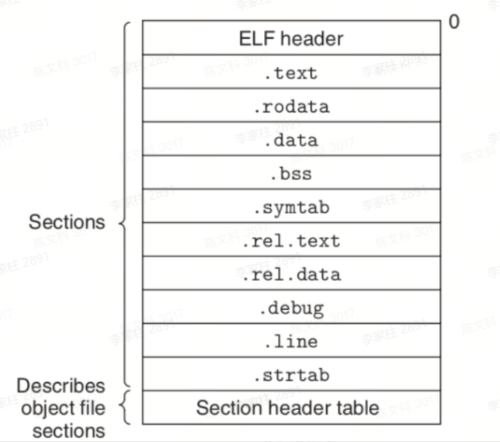
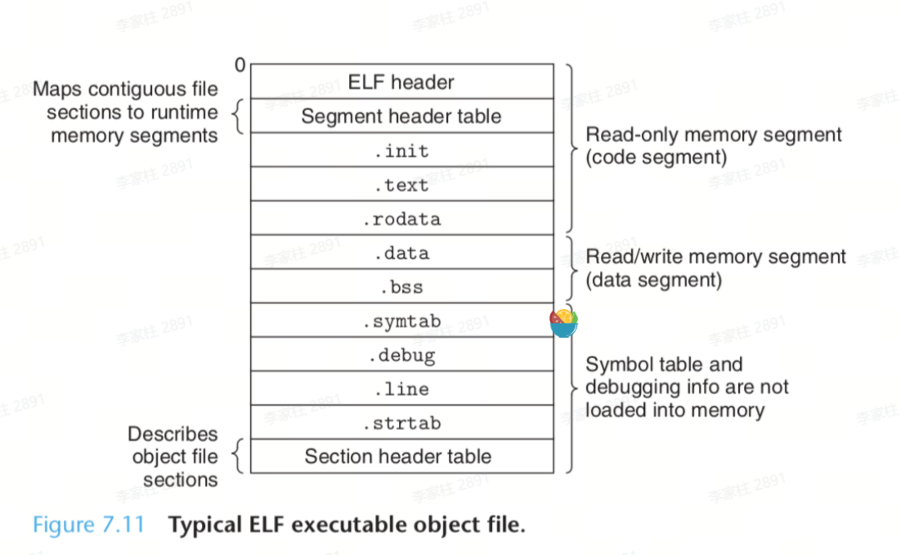

## ⚙️ 编译运行原理

使用 **`go run`** 命令可以快速运行 Go 文件，使用 **`go build`** 命令可以编译成可执行文件。

```go
go run main.go
go build -o myapp main.go
```

### 🔍 查看编译过程

执行命令显示编译链接的过程：**`go build -v -x -work -o hello hello.go`**

- **`-v`**：打印所编译的包的名字
- **`-x`**：打印编译期间所执行的命令
- **`-work`**：打印编译期间用于存放中间文件的临时目录，并且编译结束时不删除

---

### 📝 编译运行过程

**`go build`** 分别调用了编译器（**`.../tool/os_arc/compile`**）和链接器（**`.../tool/os_arc/link`**），分别来完成编译和链接的操作。

<div align="center">
  
</div>

#### 🔧 编译阶段

编译阶段逻辑上可以细分为**预处理**、**编译**、**汇编**三个阶段。整个编译阶段就是通过词法分析、语法分析和语义分析，把文本代码翻译成可重定位的目标文件（`.o` 文件）的过程。

- **预处理**：例如解析依赖库
- **编译**：将预处理后的代码，翻译成汇编代码（`.s` 文件）
- **汇编**：将生成的汇编代码，翻译成可重定位的目标文件（`.o` 文件，relocatable object file）

**注意**：目标文件纯粹就是字节块的集合。

编译优化也发生在这个阶段。

#### 🔗 链接阶段

链接阶段主要是通过**符号解析**和**重定位**把编译阶段生成的 `.o` 文件，链接生成可执行目标文件。

- **符号解析**：目标文件定义和引用符号。符号解析的目的是将每个符号引用和一个符号定义联系起来
- **重定位**：编译阶段生成的代码和数据节都是从地址零开始的，链接器通过把每个符号定义与一个存储器位置联系起来，然后修改所有对这些符号的引用，使得它们指向这个存储器位置，从而重定向这些节（section），进而生成可执行目标文件

<div align="center">
  
</div>

---

### ⚡ 编译器优化

#### 📦 内联函数

由于函数调用有一些固定的开销，例如函数调用栈和抢占检查（preemption check），所以对于一些代码行比较少的函数，编译器倾向于把它们在编译时展开，这种行为被称为**内联**。

- **内联函数的缺点**：由于函数被展开了，无法设置断点，使得调试变得很困难
- **查看编译器的优化决策**：可以使用选项 **`-gcflags=-m`**，也可以使用 **`-gcflags=-l`** 选项禁止编译器内联优化

```bash
go build -gcflags="-m -l" main.go
```

#### 🚀 逃逸分析

通常情况下，从栈上分配内存要比从堆中分配内存高效得多。对于 Golang 来说，从 goroutine 的 stack 上分配内存比从堆上分配内存要高效得多，因为 stack 上的内存无需 **garbage collect**。

- **stack vs heap**：从 stack 上分配的内存和从 heap 上分配的内存对于程序来说，主要区别在于生命周期的不同
- **逃逸分析**：只要编译器能够正确地判断出一个变量/对象的生命周期，就能"正确"地选择为这个变量/对象在 stack 还是 heap 上分配内存
- **逃逸到堆**：Go 编译器会自动给超出函数生命周期的变量，在 heap 上分配内存，这个行为被称为：**the value escapes to the heap**

可以通过编译选项 **`-gcflags=-m`** 查看编译器的逃逸（escape）优化决策。

```bash
go build -gcflags="-m" main.go
```

#### ✂️ 削减无用代码

删除无用代码即通过代码静态分析工具，删除不可达的代码分支，或者移除无用的循环。

结合这项功能和 **`build tags`** 条件编译选项，可以优雅地屏蔽一些开销比较大的 debug 逻辑分支。

```go
// +build debug

func debugLog(msg string) {
    fmt.Println("[DEBUG]", msg)
}
```

---

## 📦 Go Module

Go Module 机制被用于管理复杂的依赖。类似于 Java 中的 Maven，依赖管理文件为 **`go.mod`**。

**`go.mod`** 文件记录了我们每个 module 对应的依赖库以及依赖库版本。

### 🚀 基本命令

| 命令 | 功能 |
|:-----:|:----:|
| **`go mod init`** | 创建工程，初始化 go.mod |
| **`go mod tidy`** | 清理依赖，自动整理 go.mod 和 go.sum |
| **`go get`** | 添加依赖 |
| **`go mod download`** | 下载依赖到本地缓存 |
| **`go mod verify`** | 验证依赖的完整性 |

---

### 📥 添加依赖

#### go get 命令

- **`go get`**：没有指定版本就会拉取最新版本，且不会自动添加间接依赖的版本
- **`go get -u`**：除了拉取指定依赖版本外，还会拉取并添加间接依赖的最新版本，而不是直接依赖所依赖的版本，也不会回退间接依赖的版本

#### 版本指定

```bash
# 指定具体版本
go get github.com/gin-gonic/gin@v1.9.1

# 指定分支
go get github.com/gin-gonic/gin@master

# 指定 commit
go get github.com/gin-gonic/gin@e3702bed2
```

#### 依赖管理最佳实践

1. **使用 `go mod tidy`**：定期运行，保持 go.mod 整洁
2. **固定版本**：生产环境建议固定依赖版本，避免意外升级
3. **使用 `go.sum`**：确保依赖的完整性和一致性
4. **私有依赖**：配置 `GOPRIVATE` 环境变量处理私有仓库

---

### 📋 go.mod 文件结构

```go
module github.com/username/project

go 1.21

require (
    github.com/gin-gonic/gin v1.9.1
    github.com/stretchr/testify v1.8.4
)
```

- **module**：定义模块路径
- **go**：指定 Go 版本
- **require**：声明依赖及其版本
- **replace**：替换依赖（可选）
- **exclude**：排除特定版本（可选）

---

### 🔒 go.sum 文件

`go.sum` 文件记录了每个依赖的特定版本的加密哈希值，用于确保依赖的完整性和可重复构建。

**作用**：
- 防止依赖被篡改
- 确保团队成员使用相同的依赖版本
- 支持可重复构建

---

## 📚 总结

| 特性 | 说明 |
|:----:|:----:|
| **编译命令** | `go run`（快速运行）、`go build`（编译可执行文件） |
| **编译过程** | 预处理 → 编译 → 汇编 → 链接 |
| **编译器优化** | 内联函数、逃逸分析、削减无用代码 |
| **依赖管理** | Go Module（go.mod、go.sum） |
| **常用命令** | `go mod init`、`go mod tidy`、`go get` |

**面试重点**：
- Go 编译的四个阶段（预处理、编译、汇编、链接）
- 逃逸分析的原理和作用
- 内联函数的优缺点
- Go Module 的工作机制
- go.mod 和 go.sum 的作用
