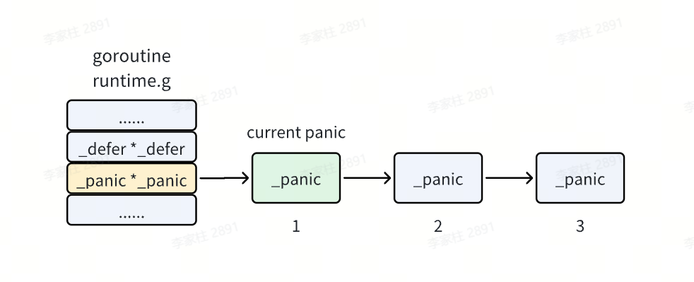
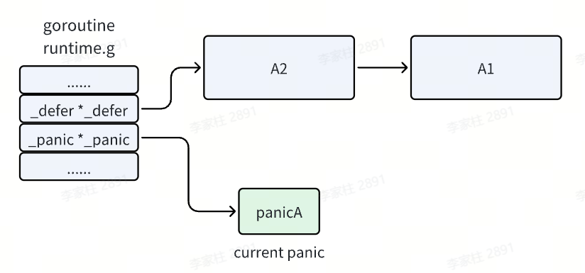
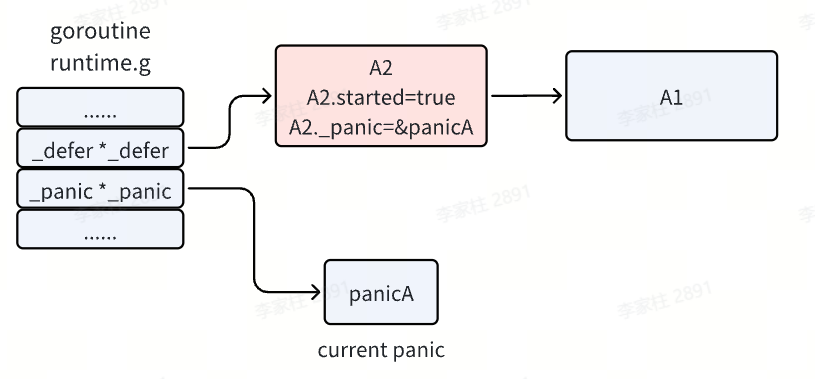
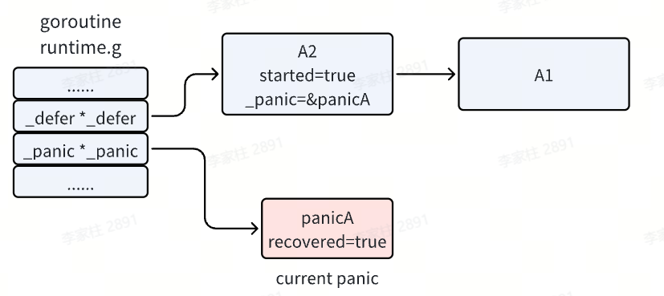

## 🧠 Go的错误处理机制

### 引言

在软件开发中，错误处理是一个不可避免的重要环节。不同的编程语言采用了不同的错误处理方式，而 Go 语言以其简洁、实用的错误处理机制著称。本文将深入探讨 Go 语言的错误处理机制，包括核心概念、最佳实践和常见模式，帮助开发者更好地理解和应用 Go 的错误处理。

---

### 核心概念

#### error 接口

在 Go 中，错误是通过 `error` 接口来表示的：

```go
type error interface {
    Error() string
}
```

这个接口非常简洁，只包含一个 `Error()` 方法，返回一个描述错误的字符串。任何实现了这个方法的类型都可以作为错误返回。

#### nil 值判断

在 Go 中，错误处理的标准模式是检查返回的错误是否为 `nil`：

```go
result, err := someFunction()
if err != nil {
    // 处理错误
    return err
}
// 继续执行
```

如果 `err` 不为 `nil`，说明函数执行过程中发生了错误，需要进行处理；如果 `err` 为 `nil`，说明函数执行成功。

---

### 错误返回模式

#### 单返回值错误

对于只返回错误的函数，通常直接返回 `error` 类型：

```go
func validateInput(input string) error {
    if input == "" {
        return errors.New("input cannot be empty")
    }
    return nil
}
```

#### 多返回值错误

对于需要返回结果和错误的函数，通常将错误作为最后一个返回值：

```go
func divide(a, b float64) (float64, error) {
    if b == 0 {
        return 0, errors.New("division by zero")
    }
    return a / b, nil
}
```

---

### 错误包装与上下文

#### 标准库错误包装

在 Go 1.13 及以上版本中，标准库提供了 `errors.Wrap` 和 `errors.Wrapf` 函数，用于包装错误并添加上下文信息：

```go
import "github.com/pkg/errors"

func processFile(filename string) error {
    data, err := readFile(filename)
    if err != nil {
        return errors.Wrap(err, "failed to read file")
    }
    // 处理数据
    return nil
}
```

#### Go 1.13+ 错误包装

Go 1.13 引入了标准库的错误包装功能，使用 `%w` 动词来包装错误：

```go
import "errors"

func processFile(filename string) error {
    data, err := readFile(filename)
    if err != nil {
        return fmt.Errorf("failed to read file: %w", err)
    }
    // 处理数据
    return nil
}
```

#### 错误链检查

使用 `errors.Is` 和 `errors.As` 函数可以检查错误链中的特定错误：

```go
if errors.Is(err, os.ErrNotExist) {
    // 处理文件不存在的错误
}

var pathError *os.PathError
if errors.As(err, &pathError) {
    // 处理路径错误
}
```

---

### 自定义错误类型

#### 简单自定义错误

可以通过实现 `error` 接口来创建自定义错误类型：

```go
type ValidationError struct {
    Field   string
    Message string
}

func (e *ValidationError) Error() string {
    return fmt.Sprintf("validation error on field %s: %s", e.Field, e.Message)
}
```

#### 带状态码的错误

对于需要携带更多信息的错误，可以在自定义错误类型中添加额外字段：

```go
type AppError struct {
    Code    int
    Message string
}

func (e *AppError) Error() string {
    return e.Message
}
```

---

### 错误处理最佳实践

#### 尽早返回

采用 "尽早返回" 的原则，一旦发生错误就立即返回，避免嵌套过深的代码：

```go
func process(data string) error {
    if err := validate(data); err != nil {
        return err
    }
    
    result, err := compute(data)
    if err != nil {
        return err
    }
    
    if err := save(result); err != nil {
        return err
    }
    
    return nil
}
```

#### 错误处理层次

在不同层次的代码中，错误处理的策略也不同：

- **底层函数**：返回原始错误
- **中间层函数**：包装错误并添加上下文
- **顶层函数**：处理错误并向用户展示

#### 日志记录

在适当的位置记录错误信息，便于调试和问题定位：

```go
if err != nil {
    log.Printf("Error processing request: %v", err)
    return err
}
```

---

### 常见陷阱

#### 忽略错误

永远不要忽略错误，即使你认为它不会发生：

```go
// 错误示例：忽略错误
result, _ := someFunction()

// 正确示例：检查错误
result, err := someFunction()
if err != nil {
    return err
}
```

#### 错误比较

不要直接比较错误字符串，应该使用 `errors.Is` 或类型断言：

```go
// 错误示例：比较错误字符串
if err.Error() == "file not found" {
    // 处理错误
}

// 正确示例：使用 errors.Is
if errors.Is(err, os.ErrNotExist) {
    // 处理错误
}
```

#### 过度包装

不要过度包装错误，只在需要添加有价值的上下文信息时才进行包装：

```go
// 错误示例：过度包装
func process() error {
    err := doSomething()
    if err != nil {
        return fmt.Errorf("process failed: %w", err)
    }
    return nil
}

// 正确示例：只在需要时包装
func processFile(filename string) error {
    err := readFile(filename)
    if err != nil {
        return fmt.Errorf("failed to read %s: %w", filename, err)
    }
    return nil
}
```

---

### panic和recover机制

#### 基本概念

在Go语言中，`panic`和`recover`是用于处理程序运行时严重错误的机制。`panic`用于触发一个运行时异常，导致程序执行流程中断并开始逐层回溯调用栈进行栈展开（stack unwinding），而`recover`是一个内置函数，用于在`defer`函数中捕获由`panic`引发的异常，从而阻止程序崩溃并恢复正常执行流程。

#### 实现原理

**panic**：Go运行时维护了一个与goroutine关联的`_g`结构体，其中包含一个`_panic`链表字段。每当发生panic时，runtime会创建一个新的`_panic`结构体节点，并将其插入到当前goroutine的panic链表头部。这个结构体记录了panic的值、是否已被recover捕获等信息。同时，runtime会保存当前的程序计数器（PC）和栈指针（SP），以便后续进行栈展开。随后，系统开始执行当前函数中所有已经defer但尚未执行的函数（LIFO顺序）。

**recover**：recover也是内置函数，在编译期间被特殊处理。它只能在defer函数体内有效调用。其内部逻辑是检查当前goroutine是否存在未被处理的`_panic`对象，并判断该`_panic`是否正在被当前defer函数处理。如果是，则将该`_panic`标记为"已recover"，并返回其value字段；否则返回nil。

**栈展开**：当panic发生后，Go运行时会从当前函数开始向上逐层退出函数调用帧。每退回到一个函数，就执行其defer列表中的函数。这一过程持续到某一层的defer函数成功调用recover为止。若一直没有recover，则最终到达main函数或goroutine入口，打印panic信息并退出程序。

#### defer执行顺序

- **先进后出（LIFO, Last In First Out）**：defer 注册的函数会被压入栈，在函数返回时按后进先出的顺序执行。
- **函数返回时触发**：defer 并不是立即执行，而是在包含它的函数返回时执行，包括正常返回和因 panic 异常返回。

#### defer修改返回值

在 Go 中，defer 可以修改返回值，但需要满足一定条件：函数必须有命名返回值。

- **匿名返回值**（直接 return expr）的情况：defer 无法直接修改返回值，因为返回值是函数返回语句时才确定的。
- **命名返回值**（func foo() (ret int) {}）：函数的返回值变量在函数体内是可见的，defer 可以直接修改这个变量的值。当执行 return 时，Go 会先执行 defer，再返回命名返回值的最终值。

#### 哪些异常不会被recover

- **运行时致命错误**（fatal runtime errors）
- **栈溢出**（stack overflow）
- **Go runtime 自身内部错误**（runtime panic 之外的致命错误）
- **程序直接调用 os.Exit()**

#### defer语句的主要用途

1. **释放资源**：defer 可以保证在函数退出时释放资源，常用于文件、网络连接、锁等资源的关闭或释放。
2. **保证执行顺序**：defer 是后进先出（LIFO），可以保证一组操作按相反顺序执行。
3. **错误处理与恢复**：与 recover 结合，可以捕获 panic，防止程序崩溃。

#### 在子协程中使用recover

建议在子协程（goroutine）中使用 recover，主要是为了防止整个程序因为子协程的 panic 而崩溃。

**原因**：每个 goroutine 是独立执行的线程单元。如果子协程内部发生 panic，而没有被 recover 捕获：
- panic 会沿着当前 goroutine 的调用栈向上传播
- 不会自动传播到其他 goroutine，但会终止整个程序

**作用**：
- **隔离子协程的错误**：使用 recover 可以捕获子协程的 panic，防止它终止整个程序。主程序可以继续执行，同时对子协程错误进行处理或重启。
- **实现容错与重启机制**：捕获 panic 后可以记录日志，上报错误，重启该子协程。

#### defer与return的执行顺序

return语句的执行是原子性的，它包含两个步骤：
1. **第一步**：为返回值赋值
2. **第二步**：执行defer语句
3. **第三步**：执行RET指令，返回到调用者

defer的操作步骤：
1. **注册阶段**：遇到defer时，将函数压入defer栈
2. **执行阶段**：在return的第二步执行，按照LIFO顺序

#### panic嵌套

在 Go 语言中，如果一个函数中发生了 panic，然后在 defer 中又发生了 panic，这被称为panic嵌套或二次 panic：
- 第一个 panic 触发
- 函数执行被中断
- 开始执行 defer 函数（按照 LIFO 顺序）
- 在 defer 中发生第二个 panic
- 当前的 panic 处理过程被中断
- 第二个 panic 会替代第一个 panic
- 第一个 panic 的信息会丢失
- 程序终止

如果没有外层的 recover，程序会崩溃，崩溃信息只显示第二个 panic。

#### 底层原理

当前执行的 **`goroutine`** 中有一个 **`defer`** 链表的头指针，其实它也会有一个 **`panic`** 链表头指针，**`panic`** 链表链起来的是一个个的 **`_panic`** 结构体。

**`panic`** 链表和 **`defer`** 链表类似，也是在链表头上插入新的 **`_panic`** 结构体，所以链表头上的 **`panic`** 就是当前正在执行的那一个。

<div align="center">
  
</div>

```go
type _panic struct {
    argp        unsafe.Pointer    // 存储当前要执行的defer的函数参数地址
    arg         interface{}       // panic的参数
    link        *_panic           //链接到之前发生的panic
    recovered   bool              //标记panic是否被恢复
    aborted     bool              //标记panic会否被终止
}
```

以下面的代码为例

```go
func A() {
    defer A1()
    defer A2()
    // ......
    panic("panicA")
    // code to do something
}
```

执行流程如下

- 函数 A 注册了两个 **`defer`** 函数 A1 和 A2 后发生了 **`panic`**，执行完两个 **`defer`** 注册后，**`defer`** 链表中已经注册了 A1 和 A2 函数。
- 发生了 panic，并且 panic 之后的代码不会再执行了，而是进入了 panic 的处理逻辑。首先会在 panic 链表中增加一项，我们将它记作 **`panicA`**，它就是我们当前执行的 **`panic`** 。

<div align="center">
  
</div>

- 接着执行 **`defer`** 链表了，即从头开始执行。**`panic`** 执行 **`defer`** 时，会先将其 **`started`** 置为 true，即标记它已经开始执行了。并且会把 **`_panic`** 字段指向当前执行的 **`panic`** ，标识这个 **`defer`** 是由这个 **`panic`** 触发的。

<div align="center">
  
</div>

- 如果函数 A2 能正常结束，则这一项就会被移除，继续执行下一个 defer。
- 当 **`def`** 函数中存在 **`recover`** 时，此时就会把当前执行的 panicA 置为已恢复，然后 recover 函数的任务就完成了。程序会继续往下执行 Println 语句，并打印 **`panic`** 的信息，直到 A2 函数执行结束。

<div align="center">
  
</div>

---

### 总结

Go 语言的错误处理机制以其简洁、实用的设计赢得了开发者的青睐。通过理解 `error` 接口、错误返回模式、错误包装与上下文、自定义错误类型以及最佳实践，开发者可以编写更加健壮、可维护的代码。

在实际开发中，应遵循以下原则：

1. **始终检查错误**：不要忽略任何错误返回
2. **尽早返回**：一旦发生错误就立即返回
3. **适当包装**：在需要时添加有价值的上下文信息
4. **正确比较**：使用 `errors.Is` 和 `errors.As` 检查错误
5. **合理记录**：在适当的位置记录错误信息

通过遵循这些原则，你可以在 Go 项目中实现更加优雅、高效的错误处理。
