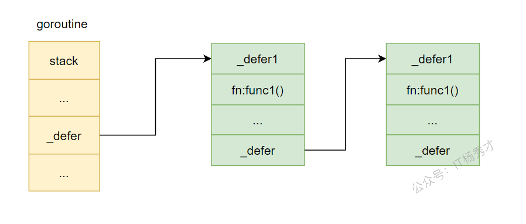
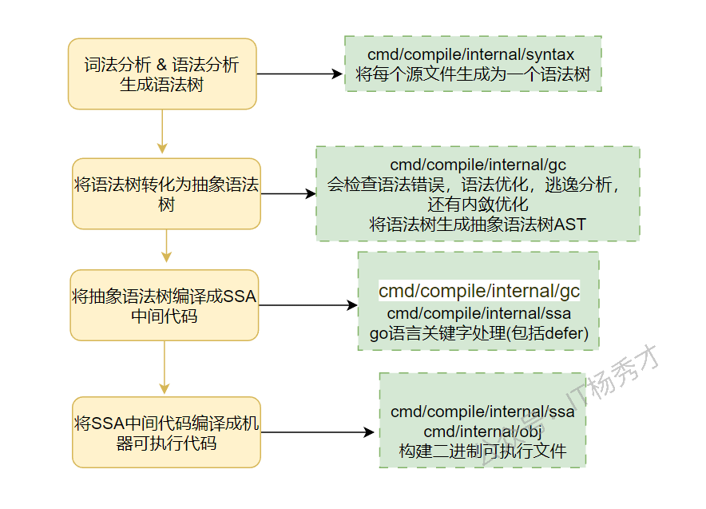

## 🧠 Go的错误处理机制

### 📖 引言

在软件开发中，错误处理是一个不可避免的重要环节。不同的编程语言采用了不同的错误处理方式，而 Go 语言以其简洁、实用的错误处理机制著称。本文将深入探讨 Go 语言的错误处理机制，包括核心概念、最佳实践和常见模式，帮助开发者更好地理解和应用 Go 的错误处理。

---

### 💡 核心概念

#### 🔍 error 接口

在 Go 中，错误是通过 `error` 接口来表示的：

```go
type error interface {
    Error() string
}
```

这个接口非常简洁，只包含一个 `Error()` 方法，返回一个描述错误的字符串。任何实现了这个方法的类型都可以作为错误返回。

#### ⚠️ nil 值判断

在 Go 中，错误处理的标准模式是检查返回的错误是否为 `nil`：

```go
result, err := someFunction()
if err != nil {
    // 处理错误
    return err
}
// 继续执行
```

如果 `err` 不为 `nil`，说明函数执行过程中发生了错误，需要进行处理；如果 `err` 为 `nil`，说明函数执行成功。

---

### 📝 错误返回模式

#### 📝 单返回值错误

对于只返回错误的函数，通常直接返回 `error` 类型：

```go
func validateInput(input string) error {
    if input == "" {
        return errors.New("input cannot be empty")
    }
    return nil
}
```

#### 📋 多返回值错误

对于需要返回结果和错误的函数，通常将错误作为最后一个返回值：

```go
func divide(a, b float64) (float64, error) {
    if b == 0 {
        return 0, errors.New("division by zero")
    }
    return a / b, nil
}
```

---

### 📦 错误包装与上下文

#### 📦 标准库错误包装

在 Go 1.13 及以上版本中，标准库提供了 `errors.Wrap` 和 `errors.Wrapf` 函数，用于包装错误并添加上下文信息：

```go
import "github.com/pkg/errors"

func processFile(filename string) error {
    data, err := readFile(filename)
    if err != nil {
        return errors.Wrap(err, "failed to read file")
    }
    // 处理数据
    return nil
}
```

#### 🔧 Go 1.13+ 错误包装

Go 1.13 引入了标准库的错误包装功能，使用 `%w` 动词来包装错误：

```go
import "errors"

func processFile(filename string) error {
    data, err := readFile(filename)
    if err != nil {
        return fmt.Errorf("failed to read file: %w", err)
    }
    // 处理数据
    return nil
}
```

#### 🔗 错误链检查

使用 `errors.Is` 和 `errors.As` 函数可以检查错误链中的特定错误：

```go
if errors.Is(err, os.ErrNotExist) {
    // 处理文件不存在的错误
}

var pathError *os.PathError
if errors.As(err, &pathError) {
    // 处理路径错误
}
```

---

### 🔧 自定义错误类型

#### 🛠️ 简单自定义错误

可以通过实现 `error` 接口来创建自定义错误类型：

```go
type ValidationError struct {
    Field   string
    Message string
}

func (e *ValidationError) Error() string {
    return fmt.Sprintf("validation error on field %s: %s", e.Field, e.Message)
}
```

#### 🔢 带状态码的错误

对于需要携带更多信息的错误，可以在自定义错误类型中添加额外字段：

```go
type AppError struct {
    Code    int
    Message string
}

func (e *AppError) Error() string {
    return e.Message
}
```

---

### ✅ 错误处理最佳实践

#### ⏮️ 尽早返回

采用 "尽早返回" 的原则，一旦发生错误就立即返回，避免嵌套过深的代码：

```go
func process(data string) error {
    if err := validate(data); err != nil {
        return err
    }
    
    result, err := compute(data)
    if err != nil {
        return err
    }
    
    if err := save(result); err != nil {
        return err
    }
    
    return nil
}
```

#### 🏗️ 错误处理层次

在不同层次的代码中，错误处理的策略也不同：

- **底层函数**：返回原始错误
- **中间层函数**：包装错误并添加上下文
- **顶层函数**：处理错误并向用户展示

#### 📝 日志记录

在适当的位置记录错误信息，便于调试和问题定位：

```go
if err != nil {
    log.Printf("Error processing request: %v", err)
    return err
}
```

---

### ⚠️ 常见陷阱

#### ⚠️ 忽略错误

永远不要忽略错误，即使你认为它不会发生：

```go
// 错误示例：忽略错误
result, _ := someFunction()

// 正确示例：检查错误
result, err := someFunction()
if err != nil {
    return err
}
```

#### 🔄 错误比较

**重要知识点**：`errors.New()` 和 `fmt.Errorf()` 创建的 error 对象是**不可以直接比较**的！

- `errors.New()` 返回的是一个地址（指针），不能用来做等值判断
- `fmt.Errorf()` 内部也是用到了 `errors.New()`，同样不可直接比较

```go
err3 := errors.New("hello")
err4 := errors.New("hello")
fmt.Println(err3 == err4)  // false，即使错误信息相同

// 正确做法：通过 Error() 方法比较字符串
fmt.Println(err3.Error() == err4.Error())  // true
```

不要直接比较错误字符串，应该使用 `errors.Is` 或类型断言：

```go
// 错误示例：比较错误字符串
if err.Error() == "file not found" {
    // 处理错误
}

// 正确示例：使用 errors.Is
if errors.Is(err, os.ErrNotExist) {
    // 处理错误
}
```

#### ⚖️ 过度包装

不要过度包装错误，只在需要添加有价值的上下文信息时才进行包装：

```go
// 错误示例：过度包装
func process() error {
    err := doSomething()
    if err != nil {
        return fmt.Errorf("process failed: %w", err)
    }
    return nil
}

// 正确示例：只在需要时包装
func processFile(filename string) error {
    err := readFile(filename)
    if err != nil {
        return fmt.Errorf("failed to read %s: %w", filename, err)
    }
    return nil
}
```

---

### 🚨 panic和recover机制

#### 💡 基本概念

在Go语言中，`panic`和`recover`是用于处理程序运行时严重错误的机制。`panic`用于触发一个运行时异常，导致程序执行流程中断并开始逐层回溯调用栈进行栈展开（stack unwinding），而`recover`是一个内置函数，用于在`defer`函数中捕获由`panic`引发的异常，从而阻止程序崩溃并恢复正常执行流程。

**📡 panic 传递机制**

当一个函数发生了 `panic` 之后，若在当前函数中没有 `recover`，会一直向外层传递直到主函数，如果迟迟没有 `recover` 的话，那么程序将终止。如果在过程中遇到了最近的 `recover`，则将被捕获。

```go
package main

import "fmt"

func testPanic1(){
   fmt.Println("testPanic1上半部分")
   testPanic2()
   fmt.Println("testPanic1下半部分")
}

func testPanic2(){
   defer func() {
      recover()
   }()
   fmt.Println("testPanic2上半部分")
   testPanic3()
   fmt.Println("testPanic2下半部分")
}

func testPanic3(){
   fmt.Println("testPanic3上半部分")
   panic("在testPanic3出现了panic")
   fmt.Println("testPanic3下半部分")
}

func main() {
   fmt.Println("程序开始")
   testPanic1()
   fmt.Println("程序结束")
}
```

运行结果：
```
程序开始
testPanic1上半部分
testPanic2上半部分
testPanic3上半部分
testPanic1下半部分
程序结束    
```

**解析：**
调用链：`main --> testPanic1 --> testPanic2 --> testPanic3`

1. 在 `testPanic3` 中发生了 `panic`，由于 `testPanic3` 没有 `recover`
2. 向上传递，在 `testPanic2` 中找到了 `recover`，`panic` 被捕获
3. 程序接着运行，`testPanic3` 发生 `panic` 后不再继续执行
4. `testPanic2` 捕获到 `panic` 后也不再继续执行
5. 跳出 `testPanic2`，到 `testPanic1` 接着运行

**📌 总结：**
1. `recover()` 只能恢复当前函数级或以当前函数为首的调用链中的函数中的 `panic()`，恢复后调用当前函数结束，但是调用此函数的函数继续执行
2. 函数发生了 `panic` 之后会一直向上传递，如果直至 `main` 函数都没有 `recover()`，程序将终止，如果是遇见了 `recover()`，将被 `recover` 捕获

#### ⚙️ 实现原理

**panic**：Go运行时维护了一个与goroutine关联的`_g`结构体，其中包含一个`_panic`链表字段。每当发生panic时，runtime会创建一个新的`_panic`结构体节点，并将其插入到当前goroutine的panic链表头部。这个结构体记录了panic的值、是否已被recover捕获等信息。同时，runtime会保存当前的程序计数器（PC）和栈指针（SP），以便后续进行栈展开。随后，系统开始执行当前函数中所有已经defer但尚未执行的函数（LIFO顺序）。

**recover**：recover也是内置函数，在编译期间被特殊处理。它只能在defer函数体内有效调用。其内部逻辑是检查当前goroutine是否存在未被处理的`_panic`对象，并判断该`_panic`是否正在被当前defer函数处理。如果是，则将该`_panic`标记为"已recover"，并返回其value字段；否则返回nil。

**栈展开**：当panic发生后，Go运行时会从当前函数开始向上逐层退出函数调用帧。每退回到一个函数，就执行其defer列表中的函数。这一过程持续到某一层的defer函数成功调用recover为止。若一直没有recover，则最终到达main函数或goroutine入口，打印panic信息并退出程序。

#### 🚫 哪些异常不会被recover

- **运行时致命错误**（fatal runtime errors）
- **栈溢出**（stack overflow）
- **Go runtime 自身内部错误**（runtime panic 之外的致命错误）
- **程序直接调用 os.Exit()**

#### 🌐 在子协程中使用recover

建议在子协程（goroutine）中使用 recover，主要是为了防止整个程序因为子协程的 panic 而崩溃。

**原因**：每个 goroutine 是独立执行的线程单元。如果子协程内部发生 panic，而没有被 recover 捕获：
- panic 会沿着当前 goroutine 的调用栈向上传播
- 不会自动传播到其他 goroutine，但会终止整个程序

**作用**：
- **隔离子协程的错误**：使用 recover 可以捕获子协程的 panic，防止它终止整个程序。主程序可以继续执行，同时对子协程错误进行处理或重启。
- **实现容错与重启机制**：捕获 panic 后可以记录日志，上报错误，重启该子协程。

#### 🔄 panic嵌套

在 Go 语言中，如果一个函数中发生了 panic，然后在 defer 中又发生了 panic，这被称为panic嵌套或二次 panic：
- 第一个 panic 触发
- 函数执行被中断
- 开始执行 defer 函数（按照 LIFO 顺序）
- 在 defer 中发生第二个 panic
- 当前的 panic 处理过程被中断
- 第二个 panic 会替代第一个 panic
- 第一个 panic 的信息会丢失
- 程序终止

如果没有外层的 recover，程序会崩溃，崩溃信息只显示第二个 panic。

#### ⚙️ 底层原理

当前执行的 **`goroutine`** 中有一个 **`defer`** 链表的头指针，其实它也会有一个 **`panic`** 链表头指针，**`panic`** 链表链起来的是一个个的 **`_panic`** 结构体。

**`panic`** 链表和 **`defer`** 链表类似，也是在链表头上插入新的 **`_panic`** 结构体，所以链表头上的 **`panic`** 就是当前正在执行的那一个。

<div align="center">
  
</div>

```go
type _panic struct {
    argp        unsafe.Pointer    // 存储当前要执行的defer的函数参数地址
    arg         interface{}       // panic的参数
    link        *_panic           //链接到之前发生的panic
    recovered   bool              //标记panic是否被恢复
    aborted     bool              //标记panic会否被终止
}
```

以下面的代码为例

```go
func A() {
    defer A1()
    defer A2()
    // ......
    panic("panicA")
    // code to do something
}
```

执行流程如下

- 函数 A 注册了两个 **`defer`** 函数 A1 和 A2 后发生了 **`panic`**，执行完两个 **`defer`** 注册后，**`defer`** 链表中已经注册了 A1 和 A2 函数。
- 发生了 panic，并且 panic 之后的代码不会再执行了，而是进入了 panic 的处理逻辑。首先会在 panic 链表中增加一项，我们将它记作 **`panicA`**，它就是我们当前执行的 **`panic`** 。

<div align="center">
  
</div>

- 接着执行 **`defer`** 链表了，即从头开始执行。**`panic`** 执行 **`defer`** 时，会先将其 **`started`** 置为 true，即标记它已经开始执行了。并且会把 **`_panic`** 字段指向当前执行的 **`panic`** ，标识这个 **`defer`** 是由这个 **`panic`** 触发的。

<div align="center">
  
</div>

- 如果函数 A2 能正常结束，则这一项就会被移除，继续执行下一个 defer。
- 当 **`def`** 函数中存在 **`recover`** 时，此时就会把当前执行的 panicA 置为已恢复，然后 recover 函数的任务就完成了。程序会继续往下执行 Println 语句，并打印 **`panic`** 的信息，直到 A2 函数执行结束。

<div align="center">
  
</div>

---

---

### 🧵 defer 原理详解

#### ❓ defer是什么

`defer` 是 Go 语言中的一个关键字，用来修饰函数调用。它的作用是让 `defer` 后面的函数或方法调用延迟到当前函数 `return` 或 `panic` 时再执行。

#### 🧪 defer 的使用形式

```go
defer func(args)
```

使用 `defer` 时，只需要在后面跟上具体的函数调用即可。编译器会注册一个延迟执行的函数，并在注册时确定函数名和参数，等当前函数退出时再执行。

#### 🧱 defer 的底层结构

进行 `defer` 函数调用时，底层其实会生成一个 `_defer` 结构。一个函数中可能有多次 `defer` 调用，因此会生成多个这样的 `_defer` 结构。这些 `_defer` 结构会以链表的形式存储，当前 `goroutine` 的 `_defer` 指针指向链表头节点。

`_defer` 的结构定义在 `src/runtime/runtime2.go` 中，源码如下：

```go
type _defer struct {
   started bool   // 标志位，标识 defer 函数是否已经开始执行，默认为 false
   heap    bool   // 标记当前 defer 结构是否分配在堆上
   openDefer bool // 标识当前 defer 是否以开放编码的方式实现
   sp        uintptr // 调用方的 sp 寄存器指针，即栈指针
   pc        uintptr // 调用方的程序计数器指针
   fn        func()  // defer 注册的延迟执行函数
   _panic    *_panic // 标识是否由 panic 触发，非 panic 触发时为 nil
   link      *_defer // defer 链表
   fd        unsafe.Pointer // defer 调用的相关参数
   varp      uintptr
   framepc   uintptr
}
```

底层存储如下图：

<div align="center">
  
</div>

`defer` 函数在注册时，创建的 `_defer` 结构会依次插入到 `_defer` 链表表头。在当前函数 `return` 时，再依次从链表表头取出 `_defer` 结构执行其中的 `fn` 函数。

#### ⚙️ defer 的执行过程

在探究 `defer` 的执行过程之前，可以先简单看一下 Go 程序的编译流程。Go 程序由 `.go` 文件编译成最终的二进制机器码时，`defer` 关键字主要在生成 SSA 中间代码阶段被处理。

<div align="center">
  
</div>

编译器遇到 `defer` 语句时，会插入两类函数：

1. `defer` 内存分配函数：`deferproc`（堆分配）或 `deferprocStack`（栈分配）
2. 执行函数：`deferreturn`

`defer` 的处理逻辑位于 `cmd/compile/internal/ssagen/ssa.go` 的 `state.stmt()` 方法中。下面是关键代码：

```go
case ir.ODEFER:     // 如果节点是 defer 节点
   n := n.(*ir.GoDeferStmt)
   if base.Debug.Defer > 0 {
      var defertype string
      if s.hasOpenDefers {
         defertype = "open-coded"  // 开放编码
      } else if n.Esc() == ir.EscNever {
         defertype = "stack-allocated"   // 栈分配
      } else {
         defertype = "heap-allocated"   // 堆分配
      }
      base.WarnfAt(n.Pos(), "%s defer", defertype)
   }
   if s.hasOpenDefers {  // 如果可以开放编码，即内联实现
      s.openDeferRecord(n.Call.(*ir.CallExpr))
   } else {
      d := callDefer       // 否则默认使用堆分配
      if n.Esc() == ir.EscNever {   // 没有内存逃逸，使用栈分配
         d = callDeferStack
      }
      s.callResult(n.Call.(*ir.CallExpr), d)
   }
```

从这段代码可以看出，`defer` 目前有三种实现方式：堆上分配、栈上分配，以及开放编码。Go 会优先使用开放编码；当开放编码不满足、但又没有发生内存逃逸时，会使用栈分配；其他情况下才退回到堆分配。这样做的核心目的就是提升性能。

**`_defer` 内存分配**

前面的分析已经说明，`_defer` 结构会根据场景分配在不同位置。堆上分配调用的是 `runtime.deferproc`，栈上分配调用的是 `runtime.deferprocStack`。

**堆上分配**

先看 `deferproc`，在 Go 1.13 之前只有这一种方式，也就是说那时 `_defer` 只能分配在堆上。

```go
func deferproc(fn func()) {
   gp := getg()      // 获取 goroutine，defer 在哪个 goroutine 中执行
   if gp.m.curg != gp {
      throw("defer on system stack")
   }

   d := newdefer()   // 在堆中新建一个 _defer 对象
   if d._panic != nil {
      throw("deferproc: d.panic != nil after newdefer")
   }
   d.link = gp._defer   // 加入到 goroutine 的 defer 链表头部
   gp._defer = d
   d.fn = fn
   d.pc = getcallerpc()
   d.sp = getcallersp()
   return0()
}
```

其中重点是 `newdefer()`：

```go
func newdefer() *_defer {
   var d *_defer
   mp := acquirem()
   pp := mp.p.ptr()    // 获取逻辑处理器 p
   if len(pp.deferpool) == 0 && sched.deferpool != nil {
      lock(&sched.deferlock)
      for len(pp.deferpool) < cap(pp.deferpool)/2 && sched.deferpool != nil {
         d := sched.deferpool
         sched.deferpool = d.link
         d.link = nil
         pp.deferpool = append(pp.deferpool, d)
      }
      unlock(&sched.deferlock)
   }
   if n := len(pp.deferpool); n > 0 {
      d = pp.deferpool[n-1]
      pp.deferpool[n-1] = nil
      pp.deferpool = pp.deferpool[:n-1]
   }
   releasem(mp)
   mp, pp = nil, nil
   if d == nil {
      d = new(_defer)
   }
   d.heap = true
   return d
}
```

可以看出，堆上 `defer` 的创建借助了内存复用和内存池的思想。创建过程是：优先从 `p` 的本地 `defer` 缓存池或全局缓存池中取可复用的 `_defer` 结构；找不到时，才会在堆上新建。

**栈上分配**

`runtime.deferprocStack` 是 Go 1.13 之后引入的优化方式。由于直接在栈上分配，效率通常会更高。

```go
// 在调用这个函数之前，defer 结构已经在栈上创建好，这里只是作为参数传进来赋值
func deferprocStack(d *_defer) {
   gp := getg()
   if gp.m.curg != gp {
      throw("defer on system stack")
   }
   d.started = false
   d.heap = false
   d.openDefer = false
   d.sp = getcallersp()
   d.pc = getcallerpc()
   d.framepc = 0
   d.varp = 0
   *(*uintptr)(unsafe.Pointer(&d._panic)) = 0
   *(*uintptr)(unsafe.Pointer(&d.fd)) = 0
   *(*uintptr)(unsafe.Pointer(&d.link)) = uintptr(unsafe.Pointer(gp._defer))
   *(*uintptr)(unsafe.Pointer(&gp._defer)) = uintptr(unsafe.Pointer(d))
   return0()
}
```

Go 在编译阶段生成 SSA 时，如果判断出 `_defer` 可以在栈上分配，编译器就会直接在函数调用栈上初始化 `_defer` 记录，并把它作为参数传给 `deferprocStack`。

**开放编码**

第三种方式是开放编码（open-coded defer），这是 Go 1.14 引入的进一步优化。它通过代码内联优化，让函数末尾直接调用 `defer` 函数，从而减少一次运行时函数调用开销。

`walkStmt()` 中的关键代码如下：

```go
case ir.ODEFER:
   n := n.(*ir.GoDeferStmt)
   ir.CurFunc.SetHasDefer(true)
   ir.CurFunc.NumDefers++
   if ir.CurFunc.NumDefers > maxOpenDefers {  // maxOpenDefers = 8
      ir.CurFunc.SetOpenCodedDeferDisallowed(true)
   }
   if n.Esc() != ir.EscNever {
      // If n.Esc is not EscNever, then this defer occurs in a loop,
      // so open-coded defers cannot be used in this function.
      ir.CurFunc.SetOpenCodedDeferDisallowed(true)
   }
   fallthrough
```

这里的 `n.Esc() != ir.EscNever` 实际上是在判断 `defer` 是否出现在循环体中。因为 `defer` 若出现在 `for` 循环中，编译器无法在编译期确定它会被执行多少次，这通常会触发逃逸，最终只能走堆分配。因此在性能敏感路径里，尽量不要在循环中使用 `defer`。

`buildssa()` 里的关键代码如下：

```go
s.hasOpenDefers = base.Flag.N == 0 && s.hasdefer && !s.curfn.OpenCodedDeferDisallowed()
switch {
case base.Debug.NoOpenDefer != 0:
   s.hasOpenDefers = false
case s.hasOpenDefers && (base.Ctxt.Flag_shared || base.Ctxt.Flag_dynlink) && base.Ctxt.Arch.Name == "386":
   s.hasOpenDefers = false
}
if s.hasOpenDefers && len(s.curfn.Exit) > 0 {
   s.hasOpenDefers = false
}
if s.hasOpenDefers {
   for _, f := range s.curfn.Type().Results().FieldSlice() {
      if !f.Nname.(*ir.Name).OnStack() {
         s.hasOpenDefers = false
         break
      }
   }
}
if s.hasOpenDefers &&
   s.curfn.NumReturns*s.curfn.NumDefers > 15 {
   s
```

总结一下，在 Go 1.14 之后，Go 会优先采用开放编码的方式处理 `defer`，但需要满足以下条件：

- `build` 编译时没有设置 `-N`
- `defer` 函数个数不超过 `8`
- `defer` 所在函数的返回值个数与 `defer` 函数个数的乘积不超过 `15`
- `defer` 没有出现在循环语句中

#### 🔁 defer函数执行

在给 `defer` 分配好内存之后，剩下的就是执行过程了。在函数退出时，`deferreturn` 会执行 `defer` 链表上的各个延迟函数。

```go
func deferreturn() {
   gp := getg()
   for {
      d := gp._defer
      if d == nil {
         return
      }
      sp := getcallersp()
      if d.sp != sp {
         return
      }
      if d.openDefer {
         done := runOpenDeferFrame(gp, d)
         if !done {
            throw("unfinished open-coded defers in deferreturn")
         }
         gp._defer = d.link
         freedefer(d)
         return
      }
      fn := d.fn
      d.fn = nil
      gp._defer = d.link
      freedefer(d)
      fn()
   }
}
```

当 Go 函数执行到 `return` 关键字时，会触发对 `deferreturn` 的调用。它的逻辑比较直接，就是遍历当前 `goroutine` 上的 `defer` 链表，从表头开始依次取出 `_defer` 结构，再执行其中保存的函数。

这里可以得到三个关键结论：

1. 遇到 `defer` 关键字时，编译器会在编译阶段插入 `deferproc()` 或 `deferprocStack()`，并在 `return` 前插入 `deferreturn()`
2. `defer` 的执行顺序是 LIFO，因为每次创建的 `_defer` 结构都会插入到链表表头
3. `defer` 目前主要有三种实现方式：堆上分配、栈上分配，以及开放编码

#### 🔢 defer执行顺序

- **先进后出（LIFO, Last In First Out）**：`defer` 注册的函数会被压入栈，在函数返回时按后进先出的顺序执行。
- **函数返回时触发**：`defer` 并不是立即执行，而是在包含它的函数返回时执行，包括正常返回和因 `panic` 异常返回。

#### ✏️ defer修改返回值

在 Go 中，`defer` 可以修改返回值，但需要满足一定条件：函数必须有命名返回值。

- **匿名返回值**：直接 `return expr` 时，`defer` 无法直接修改返回值，因为返回值是在函数返回语句执行时才确定的。
- **命名返回值**：如 `func foo() (ret int) {}`，返回值变量在函数体内可见，`defer` 可以直接修改它。执行 `return` 时，Go 会先执行 `defer`，再返回命名返回值的最终结果。

#### 💡 defer语句的主要用途

1. **释放资源**：`defer` 可以保证在函数退出时释放资源，常用于文件、网络连接、锁等资源的关闭或释放。
2. **保证执行顺序**：`defer` 是后进先出，可以保证一组操作按相反顺序执行。
3. **错误处理与恢复**：与 `recover` 结合时，可以捕获 `panic`，防止程序崩溃。

**📁 资源释放示例**

```go
func CopyFile(dstFile, srcFile string) (wr int64, err error) {
    src, err := os.Open(srcFile)
    if err != nil {
        return
    }
    defer src.Close()

    dst, err := os.Create(dstFile)
    if err != nil {
        return
    }
    defer dst.Close()

    wr, err = io.Copy(dst, src)
    return wr, err
}
```

只要我们正确打开了某个资源，在没有返回错误的情况下，都可以用 `defer` 延迟调用来关闭资源。这是 Go 语言中非常常见的一种资源关闭方式。

#### ⏱️ defer与return的执行顺序

`return` 语句的执行包含三个步骤：

1. **第一步**：为返回值赋值
2. **第二步**：执行 `defer` 语句
3. **第三步**：执行 `RET` 指令，返回到调用者

`defer` 的操作步骤如下：

1. **注册阶段**：遇到 `defer` 时，将函数压入 `defer` 栈
2. **执行阶段**：在 `return` 的第二步执行，按照 LIFO 顺序调用

**⚠️ 重要：defer 参数的确定性**

`defer` 定义的延迟函数参数，在 `defer` 语句出现时就已经确定下来了。

**示例 1：基本类型参数**

```go
func deferRun() {
    var num = 1
    defer fmt.Printf("num is %d", num)

    num = 2
    return
}

func main() {
    deferRun()
}
```

运行结果：`num is 1`

解析：延迟函数 `defer fmt.Printf("num is %d", num)` 的参数 `num` 在 `defer` 语句出现时就已经确定为 `1`，因此后续即使修改 `num`，最终传给 `defer` 函数的参数仍然是 `1`。

**示例 2：指针类型参数**

```go
func main() {
    deferRun()
}

func deferRun() {
    var arr = [4]int{1, 2, 3, 4}
    defer printArr(&arr)

    arr[0] = 100
    return
}

func printArr(arr *[4]int) {
    for i := range arr {
        fmt.Println(arr[i])
    }
}
```

运行结果：

```
100
2
3
4
```

解析：虽然参数在 `defer` 语句出现时就已确定，但这里传递的是地址。地址本身没变，不过地址指向的内容被改了，所以最终输出会体现修改后的值。

**示例 3：命名返回值 defer 修改**

```go
func main() {
    res := deferRun()
    fmt.Println(res)
}

func deferRun() (res int) {
    num := 1

    defer func() {
        res++
    }()

    return num
}
```

运行结果：`2`

解析：函数的 `return` 过程可以拆成三步：

1. 设置返回值，即 `res = num = 1`
2. 执行 `defer` 语句，即 `res++`，所以 `res = 2`
3. 返回结果，即返回 `res = 2`

所以最终结果是 `2`。

### 📚 总结

Go 语言的错误处理机制以其简洁、实用的设计赢得了开发者的青睐。通过理解 `error` 接口、错误返回模式、错误包装与上下文、自定义错误类型以及最佳实践，开发者可以编写更加健壮、可维护的代码。

在实际开发中，应遵循以下原则：

1. **始终检查错误**：不要忽略任何错误返回
2. **尽早返回**：一旦发生错误就立即返回
3. **适当包装**：在需要时添加有价值的上下文信息
4. **正确比较**：使用 `errors.Is` 和 `errors.As` 检查错误
5. **合理记录**：在适当的位置记录错误信息

通过遵循这些原则，你可以在 Go 项目中实现更加优雅、高效的错误处理。
