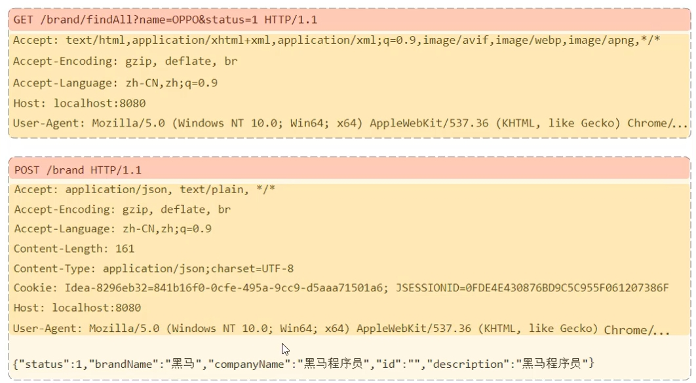

## 什么是HTTP协议

​	**HTTP协议（Hyper Text Transfer Protocol，超文本传输协议）**：规定了浏览器和服务器之间数据传输的规则。

### 	**特点**

- 在传输层上基于**TCP协议**

  TCP协议是面向连接的，安全性好。

- 基于请求-响应机制

- 无状态协议，对于事务的处理没有记忆，每次请求-响应都是独立的

  - **优点**：速度快
  - **缺点**：多次请求之间不能共享数据

## HTTP请求协议

### 请求报文结构



**请求行（红色部分）**：请求数据的第一行（请求方式/资源路径/协议版本）



常见的请求方式有

- **GET**：请求指定页面的信息
- **POST**：向指定资源提交数据进行处理请求，数据被包含在请求体
- **DELETE**：请求服务器删除指定的页面
- **PUT**：从客户端向服务端传输的数据取代指定的页面，向指定的位置上传最新的内容



**请求头（深黄色部分）**：以键值对的形式表现

**请求体（浅黄色部分）**：在POST请求中存放请求参数



GET请求没有请求体



**请求参数**

- **GET**：请求参数在请求行中，且GET请求没有请求体，GET请求大小有限制
- **POST**:请求参数在请求体中，POST请求大小没有限制

## HTTP响应协议

### 响应报文结构

​	

**响应行（红色部分）**：响应报文的第一行（协议版本，状态码，描述）



**http状态码**用于描述响应结果

分为以下几类

- **1XX（临时响应信息提示）**：这些状态代码表示临时的响应。客户端在收到常规响应之前，应准备接收一个或多个1xx
  - **100（继续）** ：请求者应当继续提出请求。服务器返回此代码表示已收到请求的第一部分，正在等待其余部分。
  - **101（切换协议）** ： 服务器将遵从客户的请求转换到另外一种协议
- **2XX（成功）**
  - **200（成功）**：服务器已成功处理了请求。
  - **201（已创建）**：请求成功并且服务器创建了新的资源。
  - **202（已接受）**：服务器已接受请求，但尚未处理。
- **3XX（重定向）**：表示要完成请求，需要进一步操作。客户端浏览器必须采取更多操作来实现请求。例如，浏览器可能不得不请求服务器上的不同的页面，或通过代理服务器重复该请求。 建议在每次请求中使用重定向不要超过 5次。
  - **300（多种选择）**：针对请求，服务器可执行多种操作。服务器可根据请求者 (user agent) 选择一项操作，或提供操作列表供请求者选择。
  - **301（永久移动）**：请求的网页已永久移动到新位置。服务器返回此响应（对 GET 或 HEAD 请求的响应）时，会自动将请求者转到新位置
- **4XX（请求错误）**：这些状态码表示请求可能出错，客户端似乎有问题。
  - **400（错误请求）**：服务器不理解请求的语法。
  - **401（未授权）**：请求要求身份验证。对于登录后请求的网页，服务器可能返回此响应。
  - **403（禁止）**：服务器拒绝请求。如果您在 Googlebot 尝试抓取您网站上的有效网页时看到此状态码(您可以在 Google网站管理员工具诊断下的网络抓取页面上看到此信息)，可能是您的服务器或主机拒绝了 Googlebot 访问。
  - **404（未找到）**：服务器找不到请求的网页。例如，对于服务器上不存在的网页经常会返回此代码。
- **5XX（服务器错误）**：服务器在处理请求时发生内部错误。这些错误可能是服务器本身的错误，而不是请求出错
  - **500 （服务器内部错误）** ：服务器遇到错误，无法完成请求。



**响应头（黄色部分）**：以键值对形式表现

**响应体（绿色部分）**：存放响应数据

## HTTP协议解析

​	

**Web服务器**：一个软件程序，对HTTP协议进行封装，使得开发者不必直接面对HTTP协议进行开发

### Tomcat服务器

#### 基本使用

**启动Tomcat服务器**：双击Tomcat服务器目录下的bin\startup.bat

**关闭Tomcat服务器**

- **CTRL+C**：正常关闭
- **直接关闭运行窗口**：强制关闭
- **双击Tomcat服务器目录下的bin\shutdown.bat**：正常关闭

**部署项目**：将应用放入webapps目录下

#### Tomcat服务器的目录结构

```
Tomcat/
|--bin（可执行文件）
|--conf（配置文件）
|--lib（Tomcat依赖的jar包）
|--logs（日志文件）
|--temp（测试代码资源）
|--webapps（应用发布目录）
|--resource（工作目录）
```


