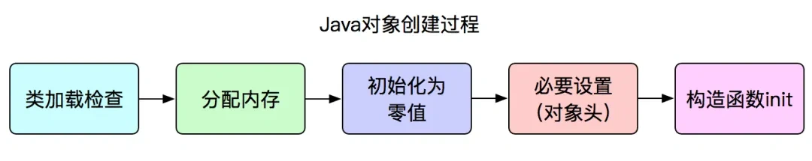

## JVM内存区域的划分

JVM内存区域被划分为以下部分

- **方法区** ：JVM 运行时数据区域的一块逻辑区域，是各个线程共享的内存区域。以元空间的形式实现方法区
- **堆**：堆内存是 JVM 所有线程共享的部分，在虚拟机启动的时候就已经创建。所有的对象实例和数组都在堆上分配，这部分空间可通过 GC 进行回收。
- **虚拟机栈** ：每个线程有一个私有的栈，随着线程的创建而创建。栈里面存着的是一种叫 “栈帧” 的东西，每个方法会创建一个栈帧，栈帧中存放了局部变量表（基本数据类型和对象引用）、操作数栈、方法出口等信息。栈的大小可以固定也可以动态扩展。
- **本地方法栈** ：与虚拟机栈类似，区别是虚拟机栈执行 Java 方法，本地方法栈执行 native 方法。
- **程序计数器**：程序计数器可以看成是当前线程所执行的字节码的行号指示器。在任何一个确定的时刻，一个处理器（对于多内核来说是一个内核）都只会执行一条线程中的指令。因此，为了线程切换后能恢复到正确的执行位置，每条线程都需要一个独立的程序计数器
- **直接内存** ：直接内存并不是虚拟机运行时数据区的一部分，也不是 Java 虚拟机规范中定义的内存区域。



**线程私有的：**

- 程序计数器
- 虚拟机栈
- 本地方法栈

**线程共享的：**

- 堆
- 方法区
- 直接内存 (非运行时数据区的一部分)



## 程序计数器

程序计数器是一块较小的内存空间，可以看作是当前线程所执行的字节码的行号指示器。字节码解释器工作时通过改变这个计数器的值来选取下一条需要执行的字节码指令，分支、循环、跳转、异常处理、线程恢复等功能都需要依赖这个计数器来完成。

另外，为了线程切换后能恢复到正确的执行位置，每条线程都需要有一个独立的程序计数器，各线程之间计数器互不影响，独立存储，我们称这类内存区域为“线程私有”的内存。

- 字节码解释器通过改变程序计数器来依次读取指令，从而实现代码的流程控制，如：顺序执行、选择、循环、异常处理。
- 在多线程的情况下，程序计数器用于记录当前线程执行的位置，从而当线程被切换回来的时候能够知道该线程上次运行到哪儿了。

## Java虚拟机栈

每个线程有一个私有的栈，随着线程的创建而创建。除了一些 Native 方法调用是通过本地方法栈实现的，其他所有的 Java 方法调用都是通过栈来实现的（也需要和其他运行时数据区域比如程序计数器配合）。方法调用的数据需要通过栈进行传递，每一次方法调用都会有一个对应的栈帧被压入栈中，每一个方法调用结束后，都会有一个栈帧被弹出。

栈由一个个栈帧组成，而每个栈帧中都对应一个被调用的方法。当线程执行一个方法时，会创建一个对应的栈帧，并将栈帧压入栈中。当方法执行完毕后，将栈帧从栈中移除。

栈帧的结构

- **局部变量表** ：主要存放了编译期可知的各种数据类型（boolean、byte、char、short、int、float、long、double）、对象引用（reference 类型，它不同于对象本身，可能是一个指向对象起始地址的引用指针，也可能是指向一个代表对象的句柄或其他与此对象相关的位置）。
  - 对于非静态方法，即使是一个完全空的方法，局部变量表中也会有一个用于存储 this 引用的变量。this 引用指向当前实例对象，在方法调用时被隐式传入。
  - 对于静态方法，由于不需要访问实例对象 this，因此在局部变量表中不会有任何变量

- **操作数栈** ：主要作为方法调用的中转站使用，用于存放方法执行过程中产生的中间计算结果。另外，计算过程中产生的临时变量也会放在操作数栈中。
- **动态链接** ：主要服务一个方法需要调用其他方法的场景。Class 文件的常量池里保存有大量的符号引用比如方法引用的符号引用。当一个方法要调用其他方法，需要将常量池中指向方法的符号引用转化为其在内存地址中的直接引用。动态链接的作用就是为了将符号引用转换为调用方法的直接引用，这个过程也被称为 **动态连接** 。
- **方法返回地址** 
- **指向运行时常量池的引用**

栈中存储的 **不是** 对象，而是 **对象的引用** 。对于栈来说，不存在垃圾回收。只要程序运行结束，栈的空间自然就会释放了。栈的生命周期和所处的线程是一致的。

## 本地方法栈

和虚拟机栈所发挥的作用非常相似，区别是：**虚拟机栈为虚拟机执行 Java 方法 （也就是字节码）服务，而本地方法栈则为虚拟机使用到的 Native 方法服务。**

本地方法被执行的时候，在本地方法栈也会创建一个栈帧，用于存放该本地方法的局部变量表、操作数栈、动态链接、出口信息。

## 堆区

Java 虚拟机所管理的内存中最大的一块，Java 堆是所有线程共享的一块内存区域，在虚拟机启动时创建。 **此内存区域的唯一目的就是存放对象实例，几乎所有的对象实例以及数组都在这里分配内存。**

堆区空间的进一步划分

- **新生代**
  - **Eden 区**：新对象最初会被分配到 Eden 区，频繁进行垃圾回收。
  - **Survivor 区**：通常分为两个相等大小的区域，称为S0（Survivor 0）和S1（Survivor 1）， S0 和 S1 交替使用，新对象在 Eden 区经过一次垃圾回收后存放到其中一个 Survivor 区，进一步存活的对象会移动到另一个 Survivor 区，最终晋升到老年代。
- **老年代** ：长生命周期对象经过多次垃圾回收后会被移到老年代，Major GC 在老年代进行，频率较低但耗时较长。
- **字符串常量池** ：为了提升性能和减少内存消耗针对字符串（String 类）专门开辟的一块区域，主要目的是为了避免字符串的重复创建。



堆区分代的原因

主要原因是为了提高垃圾回收效率，依据对象的生命周期特点来进行优化。

**对象的生命周期特点**：

- **大多数对象存活时间短** ：大部分对象会很快变成垃圾，不再被使用，这些短生命周期的对象会分配在新生代。
- **少部分对象存活时间长** ：一些长期存活的对象不会很快被回收，分配在新生代的对象经过多次垃圾回收仍存活的，将晋升到老年代。



## 堆区和栈区的区别

- 栈：主要用于存储局部变量和方法的调用信息（如返回地址、参数等）。在方法执行期间，局部变量（包括引用变量，但不包括它们引用的对象）被创建在栈上，并在方法结束时被销毁。
- 堆：用于存储对象实例和数组。每当使用 new 关键字创建对象时，JVM 都会在堆上为该对象分配内存空间。

## 方法区和元空间

方法区属于是 JVM 运行时数据区域的一块逻辑区域，是各个线程共享的内存区域。当虚拟机要使用一个类时，它需要读取并解析 Class 文件获取相关信息，再将信息存入到方法区。方法区会存储已被虚拟机加载的 **类信息、字段信息、方法信息、常量、静态变量、即时编译器编译后的代码缓存等数据**。

JDK 7 及之前，HotSpot 使用 **永久代** 实现方法区，主要存储类信息、静态变量等。

JDK 8 之后，永久代被移除，改为使用元空间，元空间使用本地内存来提高性能和避免 OOM 错误。元空间可以动态调整大小，而永久代大小是固定的。



为什么移除永久代引入元空间

- 整个永久代有一个 JVM 本身设置的固定大小上限，无法进行调整（也就是受到 JVM 内存的限制），而元空间使用的是本地内存，受本机可用内存的限制，虽然元空间仍旧可能溢出，但是比原来出现的几率会更小。
- 元空间里面存放的是类的元数据，这样加载多少类的元数据就不由 `MaxPermSize` 控制了, 而由系统的实际可用空间来控制，这样能加载的类就更多了



### 运行时常量池

在每个类或接口的 `Class` 文件中存储编译时生成的常量信息，并在类加载时进入 JVM 方法区。常量池主要 **用于减少重复对象的创建，节省内存并提高效率**

## 对象创建的过程

### 类加载检查

虚拟机遇到一条 new 指令时，首先将去检查这个指令的参数是否能在 **常量池** 中定位到一个类的 **符号引用** ，并且检查这个符号引用代表的类是否已被 **加载过、解析和初始化** 过。如果没有，那必须先执行相应的 **类加载过程** 。

### 分配内存

在类加载检查通过后，接下来虚拟机将为新生对象分配内存。对象所需的 **内存大小** 在 **类加载** 完成后便可确定，为对象分配空间的任务等同于把一块确定大小的内存从 Java 堆中划分出来。

内存分配有以下两种方式

- **指针碰撞**
  - 适用场合：堆内存规整（即没有内存碎片）的情况下。
  - 原理：用过的内存全部整合到一边，没有用过的内存放在另一边，中间有一个分界指针，只需要向着没用过的内存方向将该指针移动对象内存大小位置即可。
  - 使用该分配方式的 GC 收集器：Serial, ParNew
- **空闲列表**
  - 适用场合：堆内存不规整的情况下。
  - 原理：虚拟机会维护一个列表，该列表中会记录哪些内存块是可用的，在分配的时候，找一块儿足够大的内存块儿来划分给对象实例，最后更新列表记录。
  - 使用该分配方式的 GC 收集器：CMS

### 初始化零值

内存分配完成后，虚拟机需要将分配到的内存空间都初始化为零值（不包括对象头），保证了对象的实例字段在 Java 代码中可以不赋初始值就直接使用，程序能访问到这些字段的数据类型所对应的零值。

### 设置对象头

**虚拟机要对对象进行必要的设置**，例如这个对象是哪个类的实例、如何才能找到类的元数据信息、对象的哈希码、对象的 GC 分代年龄等信息。  **这些信息存放在对象头中。**

### 执行init方法

JVM 会执行构造方法 `<init>` 完成赋值操作

## 对象的内存结构

对象在内存中的布局可以分为 3 块区域：**对象头（Header）** 、**实例数据（Instance Data）** 和 **对齐填充（Padding）**。

### 对象头

对象头是对象存储在内存中的元信息和运行时数据。

- **Mark Word** ：用于存储运行时数据，例如对象的哈希码（HashCode）、GC 标记信息、锁状态标志等。它是一个多功能字段，会根据对象的状态动态变化。
- **类型指针（Class Pointer）** ：指向对象对应的类的元数据，用于确定该对象的类型。
- **数组长度（只有数组才有）**

### 实例数据

存储对象的实际数据，即类的字段（包括从父类继承的字段）。

### 对齐填充

为了满足内存对齐要求（一般是 8 字节对齐），JVM 可能会在对象末尾添加填充字节。例如，一个对象大小为 12 字节，JVM 会增加 4 字节填充，使其达到 16 字节对齐。

## 对象的访问定位

虚拟机访问对象的主要方式有以下方式

- **使用句柄**
- **直接指针**

### 句柄访问

 Java 堆中将会划分出一块内存来作为句柄池，reference 中存储的就是对象的句柄地址，而句柄中包含了对象实例数据与对象类型数据各自的具体地址信息。

### 直接指针

在直接指针访问中，引用直接存储对象的内存地址；对象的实例数据和类型信息都存储在堆中固定的内存区域。



句柄访问和直接指针访问的对比

- 使用句柄来访问的最大好处是引用中存储的是稳定的句柄地址，在对象被移动时只会改变句柄中的实例数据指针，而引用本身不需要修改。
- 使用直接指针访问方式最大的好处就是速度快，它节省了一次指针定位的时间开销。



## 对象的引用类型

对象的引用类型有以下四种

- 强引用
- 软引用
- 弱引用
- 虚引用

### 强引用

强引用是 Java 中最常见的引用类型。使用 new 关键字赋值的引用就是强引用，只要强引用关联着对象，垃圾收集器就不会回收这部分对象，即使内存不足。

### 软引用

软引用指的是那些有用但是不是必须要的对象。当系统内存不足时，垃圾回收器会回收软引用指向的对象，避免内存溢出。在内存充足时，这些对象不会被回收。软引用通常用于实现缓存机制，允许程序在不影响性能的情况下利用多余内存。

### 弱引用

弱引用是比软引用更弱的一种引用类型。只要垃圾回收器发现只有弱引用指向某个对象，该对象会立即被回收，无论系统内存是否充足。弱引用常用于防止内存泄漏，

典型应用是 **`WeakHashMap`** ，其中键是弱引用，当键不再被其他强引用持有时，键值对会被自动移除。它的优势在于避免对象长时间占用内存，适合短命对象或者临时缓存数据

### 虚引用

虚引用主要用来跟踪对象被垃圾回收的过程。虚引用对对象的生存时间没有任何影响。如果一个对象仅有虚引用，那么它与没有引用一样，随时会被垃圾回收。

## 内存泄漏和内存溢出

### 内存泄漏

内存泄漏是指程序在使用完内存后，未能及时释放，导致占用的内存无法再被使用。随着时间的推移，内存泄漏会导致可用内存逐渐减少

主要原因：通常是因为长期存活的对象持有短期存活对象的引用，又没有及时释放，从而导致短期存活对象无法被回收而导致的。

#### 内存泄漏的原因

- **静态集合**：使用静态数据结构（如`HashMap`或`ArrayList`）存储对象，且未清理。
- **事件监听**：未取消对事件源的监听，导致对象持续被引用。
- **线程**：未停止的线程可能持有对象引用，无法被回收。（ThreadLocal）

#### ThreadLocal 的内存泄漏问题

每个线程维护一个名为 `ThreadLocalMap` 的 map。 当使用 `ThreadLocal` 存储值时，实际上是将值存储在当前线程的 `ThreadLocalMap` 中，其中 `ThreadLocal` 实例本身作为 key，而要存储的值作为 value。

key和value具有不同的引用级别

- **key 是弱引用**：`ThreadLocalMap` 中的 key 是 `ThreadLocal` 的弱引用 (`WeakReference<ThreadLocal<?>>`)。 这意味着，如果 `ThreadLocal` 实例不再被任何强引用指向，垃圾回收器会在下次 GC 时回收该实例，导致 `ThreadLocalMap` 中对应的 key 变为 `null`。
- **value 是强引用**：`ThreadLocalMap` 中的 value 是强引用。 即使 key 被回收（变为 `null`），value 仍然存在于 `ThreadLocalMap` 中，被强引用，不会被回收。

当 `ThreadLocal` 实例失去强引用后，其对应的 value 仍然存在于 `ThreadLocalMap` 中，因为 `Entry` 对象强引用了它。如果线程持续存活（例如线程池中的线程），`ThreadLocalMap` 也会一直存在，导致 key 为 `null` 的 entry 无法被垃圾回收，造成内存泄漏。

### 内存溢出

内存溢出是指当程序请求分配内存时，由于没有足够的内存空间，从而抛出 OutOfMemoryError。

#### 内存溢出的常见情况

- **堆内存溢出**：原因是代码中可能存在大对象分配，或者发生了内存泄露，导致在多次GC之后，还是无法找到一块足够大的内存容纳当前对象。

  - 检查对象创建逻辑，确保及时释放无用对象，或增大堆内存大小（`-Xmx` 参数）

- **栈溢出**：如果我们写一段程序不断的进行递归调用，而且没有退出条件，就会导致不断地进行压栈。类似这种情况，JVM 实际会抛出 StackOverFlowError；当然，如果 JVM 试图去扩展栈空间的的时候失败，则会抛出 OutOfMemoryError。

- **元空间溢出**：系统会抛出Java.lang.OutOfMemoryError: Metaspace。出现这个异常的问题的原因是系统的代码非常多或引用的第三方包非常多或者通过动态代码生成类加载等方法，导致元空间的内存占用很大。

  - 增加元空间大小（`-XX:MaxMetaspaceSize`）；优化代码以减少类加载和反射的频率。

  
