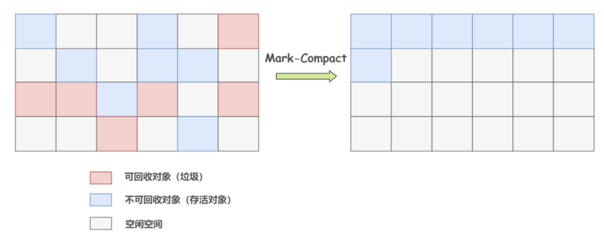

## 垃圾回收机制

垃圾回收（Garbage Collection，GC），顾名思义就是释放垃圾占用的空间，防止内存爆掉。有效的使用可以使用的内存，对内存中已经死亡的或者长时间没有使用的对象进行清除和回收。

垃圾回收的触发条件

- **内存不足时** ：当JVM检测到堆内存不足，无法为新的对象分配内存时，会自动触发垃圾回收。
- **手动请求** ：虽然垃圾回收是自动的，但是可以通过调用 `System.gc()` 或 `Runtime.getRuntime().gc()` 建议 JVM 进行垃圾回收。不过这只是一个建议，并不能保证立即执行。
- **JVM参数** ：启动 Java 应用时可以通过 JVM 参数来调整垃圾回收的行为，比如：`-Xmx`（最大堆大小）、`-Xms`（初始堆大小）等。
- **对象数量或内存使用达到阈值** ：垃圾收集器内部实现了一些策略，以监控对象的创建和内存使用，达到某个阈值时触发垃圾回收。

## 堆的空间分配

堆是垃圾收集器管理的主要区域。

在 JDK 7 版本及 JDK 7 版本之前，堆内存被通常分为下面三部分：

- 新生代(Young Generation)：存放新创建的对象。
  - Eden 区：所有新创建的对象首先分配到 Eden 区
  - Survivor 区：Eden 区中的存活对象会被复制到 Survivor 区（一般分为两个区域，S0 和 S1），经过多次 GC 存活的对象会逐渐晋升到老年代。
    - From区
    - To区
- 老生代(Old Generation)：存放存活时间较长的对象，通常是从新生代晋升过来的对象。
- 永久代(Permanent Generation)：存放类的元数据信息，包括类的静态变量、方法等

**JDK 8 版本之后 永久代已被 元空间 取代，元空间使用的是直接内存** 



分代回收的原因

主要是为了提高垃圾回收效率，依据对象的生命周期特点来进行优化。

**对象的生命周期特点**：

- **大多数对象存活时间短** ：大部分对象会很快变成垃圾，不再被使用，这些短生命周期的对象会分配在新生代。
- **少部分对象存活时间长** ：一些长期存活的对象不会很快被回收，分配在新生代的对象经过多次垃圾回收仍存活的，将晋升到老年代。

**不同的回收算法**：

- **新生代的回收** ：新生代通常采用 **复制算法**，因为新生代中大部分对象生命周期短，大部分会在一次 GC 中被回收，复制算法只需要在内存中保留少量存活对象，并将它们复制到 Survivor 空间，回收剩余区域。这种算法效率很高，适合新生代对象频繁创建和回收的特点。
- **老年代的回收**：老年代中对象存活时间长，回收频率低，使用  **标记-整理算法**  或 **标记-清除算法**，更加适合老年代对象的特性。



### 新生代

新生代用来接收新创建的对象

#### 新生代的分区逻辑

主要是为了提供内存利用率。

由于新生代对象朝生夕死的特性，天然适合复制算法。如果将新生代一分为二，划两块区域，每次只使用其中一个，GC 后将存活的复制到另一个区域，然后清理老区域非存活对象，这样替换使用两块区域可以避免内存碎片的存在。内存利用率只用一半

因此要将新生代划分为Eden区和Survivor区，其中Survivor区被分S0和S1两个区域来执行标记-复制算法，轮流执行标记-复制算法

#### Eden区

多数情况下，对象会在新生代 Eden 区中进行分配，当 Eden 区没有足够空间进行分配时，JVM 会发起一次 Minor GC，Minor GC 相比 Major GC 更频繁，回收速度也更快。

通过 Minor GC 之后，Eden 区中绝大部分对象会被回收，而那些无需回收的存活对象，将会进到 Survivor 的 From 区，如果 From 区不够，则直接进入 To 区。

#### Survivor区

Survivor 的存在意义就是减少被送到老年代的对象，进而减少 Major GC 的发生。Survivor 的预筛选保证，只有经历 16 次 Minor GC 还能在新生代中存活的对象，才会被送到老年代。

### 老年代

老年代占据着 2/3 的堆内存空间，只有在 Major GC 的时候才会进行清理，每次 GC 都会触发“Stop-The-World”。

由于复制算法在对象存活率较高的老年代会进行很多次的复制操作，效率很低，所以老年代这里采用的是标记整理算法。

对于某些对象直接进入老年代

- **大对象**： 需要大量连续内存空间的对象，这部分对象都会直接进到老年代。这样做主要是为了避免在 Eden 区及 2 个 Survivor 区之间发生大量的内存复制。
- **长期存活对象** ：虚拟机给每个对象定义了一个对象年龄（Age）计数器。正常情况下对象会不断的在 Survivor 的 From 区与 To 区之间移动，对象在 Survivor 区中每经历一次 Minor GC，年龄就增加 1 岁。当年龄增加到 15 岁时，这时候就会被转移到老年代。
- **动态对象年龄** ：如果 Survivor 空间中某个年龄段的对象总大小超过了 Survivor 空间的一半，那么该年龄段及以上年龄段的所有对象都会在下一次垃圾回收时被晋升到老年代，无需等到15岁。

## 垃圾判断算法

### 引用计数法

- **原理**：为每个对象分配一个引用计数器，每当有一个地方引用它时，计数器加1；当引用失效时，计数器减1。当计数器为0时，表示对象不再被任何变量引用，可以被回收。
- **缺点** ：无法处理循环引用的问题，两个对象互相引用时，引用计数器永远不会为 0

### 可达性分析算法

- **原理** ：从GC Roots（垃圾收集根）的对象出发，向下追溯它们引用的对象，以及这些对象引用的其他对象，以此类推。如果一个对象到GC Roots没有任何引用链相连（即从GC Roots到这个对象不可达），那么这个对象就被认为是不可达的，可以被回收。

- **前置操作（Stop the world）** ：在进行垃圾回收之前，JVM 会暂停所有正在执行的应用线程。可达性分析过程必须确保在执行分析时，内存中的对象关系不会被应用线程修改。如果不暂停应用线程，可能会出现对象引用的改变，导致垃圾回收过程中判断对象是否可达的结果不一致，从而引发严重的内存错误或数据丢失。



可以作为GC ROOT的对象

- **线程栈中的引用** ：每个线程栈中的局部变量、参数等。
- **类的静态变量** ：被类加载器加载后的类会存储在方法区，类的静态变量可以作为 GC Roots。
- **JNI 全局引用** ：通过 JNI 创建的全局引用可以作为 GC Roots。
- 运行时常量池中的常量（String 或 Class 类型）



## 垃圾回收算法

### 标记-清除算法

标记-清除算法是最基础的垃圾回收算法，分为“标记（Mark）”和“清除（Sweep）”阶段。

- 首先标记出所有不需要回收的对象

- 在标记完成后统一回收掉所有没有被标记的对象。

  

优缺点

- 优点：易于实现，可以处理所有对象
- 缺点
  - **效率问题** ：标记和清除的过程效率都不高
  - **内存碎片** ：清除结束后会造成大量的碎片空间。有可能会造成在申请大块内存的时候因为没有足够的连续空间导致再次 GC。

### 标记-复制算法

为了解决碎片空间的问题，出现了对标记-清除算法的改进。

原理：

- 将内存分成两块，每次申请内存时都使用其中的一块
- 当内存不够时，将这一块内存中所有存活的复制到另一块上。然后将然后再把已使用的内存整个清理掉。

优缺点

- 优点
  - 无需处理内存碎片，分配效率高。
- 缺点：
  - **内存利用率严重不足** ：需要双倍的内存空间，浪费了一半的空间。



新生代中主要使用标记复制算法



### 标记-整理算法

标记整理算法（Mark-Compact），标记过程仍然与标记清除算法一样，但后续步骤不是直接对可回收对象进行清理，而是让所有存活的对象都向一端移动，再清理掉端边界以外的内存区域。

## Stop The World

"Stop The World"是 Java 垃圾收集中的一个重要概念。在垃圾收集过程中，JVM 会暂停所有的用户线程.。主要原因是为了防止在垃圾收集过程中，用户线程修改了堆中的对象，导致垃圾收集器无法准确地收集垃圾。

## 分代垃圾回收机制

根据对象的分代机制，针对各代有不同的垃圾回收机制

- Young GC（Minor GC）：针对新生代的垃圾回收
- Major GC（Old GC）：针对老年代的垃圾回收
- Full GC：全堆垃圾回收
- Mix GC：混合垃圾回收，同时回收新生代和部分老年代区域

### Minor GC

- **作用范围**：只针对新生代进行回收，包括Eden区和两个Survivor区（S0和S1）。
- **触发条件**：
  - **Eden区空间不足** ：当Eden区空间不足时，JVM会触发一次Minor GC，回收新生代中不再使用的对象
  - **Eden 区和 Survivor 区的空间装满** ：如果 Eden 区和 Survivor 区的空间都不足以存放新分配的对象时，Young GC 也会被触发，清理空间并将幸存的对象转移到 Survivor 区或老年代。
- **特点**：通常发生得非常频繁，因为年轻代中对象的生命周期较短，回收效率高，暂停时间相对较短。

### Major GC

- **作用范围**：只针对老年代。
- **触发条件**：当老年代空间不足时触发，通常是当从新生代晋升到老年代的对象过多，或者老年代的存活对象数量达到一定阈值时。
- **执行方式**：只回收老年代的对象，新生代不受影响。
- **特点**：相比Minor GC，Major GC发生的频率较低，但每次回收可能需要更长的时间，因为老年代中的对象存活率较高。

### Full GC

- **作用范围**：对整个堆内存（包括新生代和老年代）进行回收。
- **触发条件**：
  - **命令调用** ：直接调用 `System.gc()` ,JVM会尝试执行Full GC。
  - **永久代（元空间）内存不足**：当永久代（Java 8之前的版本）或元空间（Java 8及以后的版本）空间不足时。
  - **新生代到老年代晋升失败** ：Minor GC（新生代垃圾回收）时，如果存活的对象无法全部放入老年代，或者老年代空间不足以容纳存活的对象，则会触发Full GC，对整个堆内存进行回收。
- **执行方式**：回收所有代（新生代、老年代）中的垃圾，并且可能会伴随着元空间的回收。
  - Full GC 会从 GC Root 出发，标记所有可达对象。新生代使用复制算法，清空 Eden 区。老年代使用标记-整理算法，回收对象并消除碎片。
- **特点**：回收时间最长，会触发整个 JVM 的停顿（Stop-The-World），对性能有较大影响，通常不希望频繁发生。

### Mixed GC

**Mixed GC**（仅适用于 G1 GC 的混合垃圾回收）：

- **作用范围**：同时回收新生代和部分老年代区域。
- **触发条件**：当 G1 垃圾回收器发现老年代区域的垃圾过多时触发。
- **执行方式**：混合回收新生代和部分老年代区域，主要目的是减少老年代中的垃圾积压。
- **特点**：结合了 YGC 的快速回收和 OGC 的深度回收，尽量减少停顿时间，适用于大内存应用。

## 垃圾收集器

### 新生代垃圾收集器

#### Serial 收集器

Serial（串行）收集器是最基本的垃圾收集器了。Serial收集器是单线程收集器，它只会使用一条垃圾收集线程去完成垃圾收集工作。同时在进行垃圾收集工作的时候必须触发 Stop-The-World（STW）操作，所有应用线程在 GC 时暂停。

**新生代采用标记-复制算法，老年代采用标记-整理算法。**

#### ParNew 收集器

ParNew 收集器是 Serial 收集器的多线程版本，除了使用多线程进行垃圾收集外，其余行为（控制参数、收集算法、回收策略等等）和 Serial 收集器完全一样。与 CMS 收集器配合使用时，通常会选择 ParNew 收集器作为新生代收集器。

**新生代采用标记-复制算法，老年代采用标记-整理算法。**

#### Parallel Scavenge 收集器

也称为 "吞吐量收集器"，追求最大化 CPU 时间的利用率。并行处理新生代垃圾回收，适合大规模后台任务处理，注重吞吐量而非延迟。

**新生代采用标记-复制算法，老年代采用标记-整理算法。**

### 老年代垃圾收集器

#### Serial Old 收集器

Serial 收集器的老年代版本，使用标记-整理（Mark-Compact）算法进行垃圾回收。

#### Parallel Old 收集器：

Parallel Scavenge 收集器的老年代版本，使用多线程并行标记-整理算法。

#### CMS收集器

**CMS收集器是一种以获取最短回收停顿时间为目标的收集器。它实现了让垃圾收集线程与用户线程（基本上）同时工作。**

工作流程：CMS 使用 **标记-清除** 算法进行垃圾收集

- **初始标记** ：标记所有从 GC Roots 直接可达的对象，这个阶段需要 STW，但速度很快
- **并发标记：**  同时开启 GC 和用户线程，用一个闭包结构去记录可达对象。但在这个阶段结束，这个闭包结构并不能保证包含当前所有的可达对象。因为用户线程可能会不断的更新引用域，所以 GC 线程无法保证可达性分析的实时性。所以这个算法里会跟踪记录这些发生引用更新的地方。
- **重新标记：**  重新标记阶段就是为了修正并发标记期间因为用户程序继续运行而导致标记产生变动的那一部分对象的标记记录，这个阶段的停顿时间一般会比初始标记阶段的时间稍长，远远比并发标记阶段时间短
- **并发清除**：清除未被标记的对象，回收它们占用的内存空间



三色标记法

**三色标记算法** 是垃圾回收器中常用的一种 **增量标记算法**

**三色标记的基本概念**：

- **白色对象** ：表示还没有被垃圾回收器访问到的对象，这些对象有可能是垃圾。
- **灰色对象** ：表示已经被访问到，但其引用的其他对象还没有被处理完。
- **黑色对象** ：表示已经被访问到且其引用的所有对象也都已经标记完毕，这些对象不会被回收。

**标记过程**：

- 初始标记：从 GC Roots 开始，标记所有直接可达的对象为灰色。
- 并发标记：在此阶段，标记所有灰色对象引用的对象为灰色，然后将灰色对象自身标记为黑色。这个过程是并发的，和应用线程同时进行。
- 重新标记：重新标记阶段的目标是处理并发标记阶段遗漏的引用变化。为了确保所有存活对象都被正确标记，remark 需要在 STW 暂停期间执行。
- 使用写屏障（Write Barrier）来捕捉并发标记阶段应用线程对对象引用的更新。通过遍历这些更新的引用来修正标记状态，确保遗漏的对象不会被错误地回收。

**缺点**

- 对 CPU 资源敏感
- 无法处理浮动垃圾
- 它使用的回收算法-“标记-清除”算法会导致收集结束时会有大量空间碎片产生。



#### G1收集器

**G1 (Garbage-First) 是一款面向服务器的垃圾收集器,主要针对配备多颗处理器及大容量内存的机器. 以极高概率满足 GC 停顿时间要求的同时,还具备高吞吐量性能特征。**

G1 把 Java 堆划分为多个大小相等的独立区域Region，每个区域都可以扮演新生代或老年代的角色。同时，G1 还有一个专门为大对象设计的 Region，叫 Humongous 区。

G1 基于**标记--整理** 算法, 不会产生空间碎片

**工作流程**

- **初始标记**： 短暂停顿（Stop-The-World，STW），标记从 GC Roots 可直接引用的对象，即标记所有直接可达的活跃对象
- **并发标记**，G1 通过并发标记的方式找出堆中的垃圾对象。并发标记阶段与应用线程同时执行，不会导致应用线程暂停。
- **混合收集**，在并发标记完成后，G1 会计算出哪些区域的回收价值最高（也就是包含最多垃圾的区域），然后优先回收这些区域。这种回收方式包括了部分新生代区域和老年代区域。选择回收成本低而收益高的区域进行回收，可以提高回收效率和减少停顿时间。
- **可预测的停顿** G1 在垃圾回收期间仍然需要「Stop the World」。不过，G1 在停顿时间上添加了预测机制，用户可以 JVM 启动时指定期望停顿时间，G1 会尽可能地在这个时间内完成垃圾回收。

**G1 收集器在后台维护了一个优先列表，每次根据允许的收集时间，优先选择回收价值最大的 Region(这也就是它的名字 Garbage-First 的由来)** 

### G1和CMS的区别和使用场景

#### 区别

- **使用范围不一样**
  - CMS收集器是老年代的收集器，可以配合新生代的Serial和ParNew收集器一起使用
  - G1收集器收集范围是老年代和新生代。不需要结合其他收集器使用
- **垃圾碎片**
  - CMS收集器是使用“标记-清除”算法进行的垃圾回收，容易产生内存碎片
  - G1收集器使用的是“标记-整理”算法，进行了空间整合，没有内存空间碎片。

#### 使用场景

CMS适用场景：

- **低延迟需求** ：适用于对停顿时间要求敏感的应用程序。
- **老生代收集** ：主要针对老年代的垃圾回收。
- **碎片化管理** ：容易出现内存碎片，可能需要定期进行Full GC来压缩内存空间。

G1适用场景：

- **大堆内存** ：适用于需要管理大内存堆的场景，能够有效处理数GB以上的堆内存。
- **对内存碎片敏感** ：G1通过紧凑整理来减少内存碎片，降低了碎片化对性能的影响。
- **比较平衡的性能** ：G1在提供较低停顿时间的同时，也保持了相对较高的吞吐量。