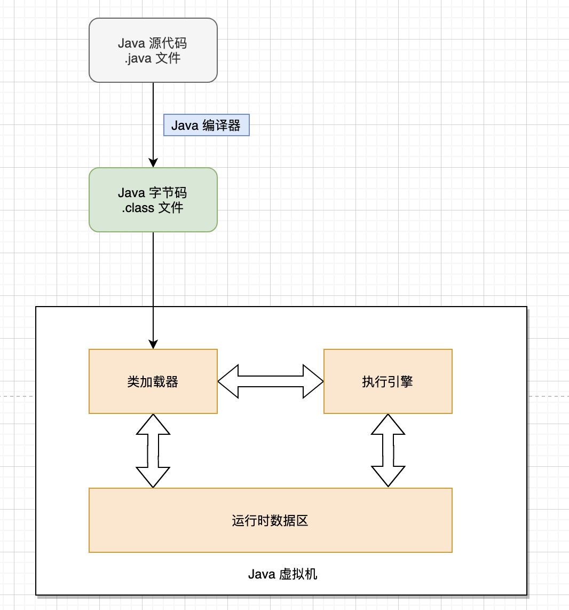
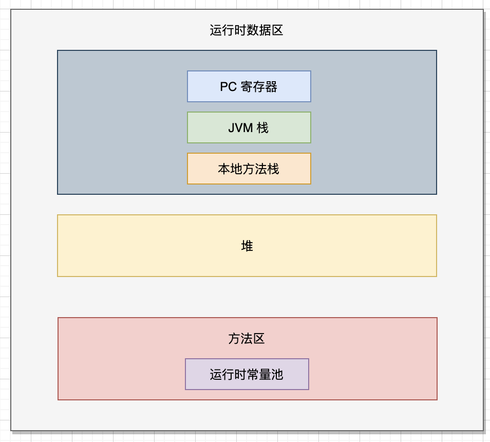

## Java程序的执行流程

Java 程序的执行流程经历了从编译到字节码的生成，再到类加载和 JIT 编译的过程，最终在 JVM 中执行。并且在程序运行过程中，JVM 负责内存管理、垃圾回收和线程调度等工作。

主要流程如下：

- 源代码：编写 .java 文件。
- 编译：使用 javac 编译器生成 .class 字节码文件。
- 类加载：JVM 的类加载器加载 .class 文件到内存中。
- 解释执行：JVM 将字节码转为机器码执行。
- JIT 编译：JVM 根据需要将热点代码编译为机器码。
- 运行：执行 main 方法中的逻辑。
- 垃圾回收：JVM 管理内存，并回收不再使用的对象。
- 程序结束：main 方法结束，JVM 清理资源，退出程序。



编译执行和解释执行

**编译执行**：是指程序在执行之前，首先通过编译器将源代码编译为机器代码，然后直接在 CPU 上运行。常见的编译语言如 C、C++。

- **优点**：编译后的程序运行速度快，因为机器代码是针对目标平台直接生成的，且不需要在运行时再进行翻译。
- **缺点**：程序必须针对每个平台重新编译，跨平台性差；另外，编译后生成的机器代码难以调试和逆向工程。

**解释执行**：解释执行是指源代码不经过编译器的预先编译，而是在运行时通过解释器逐行翻译并执行。常见的解释语言如 Python、Ruby。

- **优点**：跨平台性好，因为代码在每个平台上都是通过相应平台的解释器来运行的，且开发周期更短。
- **缺点**：运行速度较慢，因为每次执行时都需要进行动态翻译和解释。

**JVM** 采用 **编译执行** 和 **解释执行** 相结合的方式：

- **解释执行** ：JVM 会逐行解释执行字节码，尤其是程序初次运行时，这种方式有助于程序的跨平台性。
- **即时编译（JIT）** ：JVM 引入了即时编译器（Just-In-Time Compiler），在程序运行时将热代码（经常执行的代码）编译为本地机器码，避免反复解释，提升性能。因此，JVM 实际上是混合使用解释执行和编译执行。



## JVM的特性

- JVM 可以自动管理内存，通过垃圾回收器回收不再使用的对象并释放内存空间。
- JVM 包含一个即时编译器 JIT，它可以在运行时将热点代码缓存到 codeCache 中，下次执行的时候不用再一行一行的解释，而是直接执行缓存后的机器码，执行效率会大幅提高。
- JVM 会Java 程序在编译后生成字节码（`.class` 文件），而不是直接生成特定于某一操作系统的机器代码。在不同操作系统上都有各自实现的 JVM，负责将字节码翻译为特定平台的机器代码并执行。这使得同一份 Java 字节码可以在任何支持 JVM 的平台上运行。实现了 Java 一次编译，处处运行的特性

## JVM的组织架构

JVM 大致可以划分为三个部门，分别是类加载器（Class Loader）、运行时数据区（Runtime Data Areas）和执行引擎（Excution Engine）

### 类加载器

类加载器子系统负责将 `.class` 文件加载到 JVM 中。它负责将 Java 类从文件系统或网络中加载，并将它们转化为 JVM 能理解的数据结构。类加载器的主要过程包括：

- **加载（Loading）**：找到并加载类文件到 JVM。
- **链接（Linking）**：将类文件的数据合并到 JVM 中，分为验证（Verification）、准备（Preparation）和解析（Resolution）三个阶段。
- **初始化（Initialization）**：执行类的静态初始化块和静态变量赋值。

### 运行时数据区

JVM 定义了 Java 程序运行期间需要使用到的内存区域，简单来说，这块内存区域存放了字节码信息以及程序执行过程的数据，垃圾收集器]也会针对运行时数据区进行对象回收的工作。

### 执行引擎

执行引擎负责将字节码转换为机器指令并执行。执行引擎的主要组成部分包括：

- **解释器**：逐行解释字节码并执行，适用于程序首次运行时。
- **即时编译器**：将热点代码（频繁执行的代码）编译为机器码，提升执行效率。
- **垃圾回收器** ：用来回收堆内存中的垃圾对象

### 本地方法接口（JNI）

本地方法接口允许 Java 程序调用非 Java 代码（如 C/C++），便于与操作系统或其他本地库交互。JNI 提供了跨语言调用能力，使 Java 程序可以访问操作系统级别的功能或高性能库。