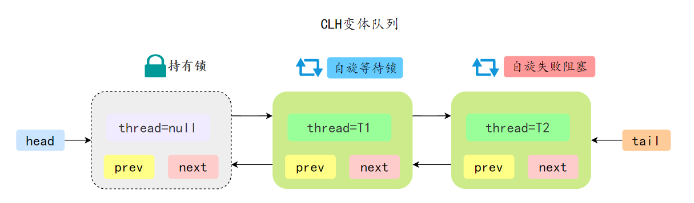

## 什么是AQS

**`AQS`** 全称 **`Abstract Queued Synchronizer`** 即 **抽象队列同步器**

可以从以下角度理解

- 抽象：抽象类，只实现一些主要逻辑，有些方法由子类实现；
- 队列：使用先进先出（FIFO）的队列存储数据；
- 同步：实现了同步的功能。

**`AQS`** 是一个用来构建锁和同步器的框架，使用 **`AQS`** 能简单且高效地构造出应用广泛的同步器

**`AQS`** 常见的实现类有 **`ReentrantLock、CountDownLatch、Semaphore`** 等等

## AQS的底层数据结构

### 状态

**`AQS`** 通过一个 **`volatile`** 类型的整数 **`state`** 来表示同步状态。

```java
/**
 * The synchronization state.
 */
private volatile int state;
```


### 双端队列

**`AQS`** 内部使用了一个先进先出（FIFO）的双端队列。用于管理等待获取同步状态的线程。每个节点（Node）代表一个等待的线程，节点之间通过 next 和 prev 指针链接。

```java
static final class Node {
    static final Node SHARED = new Node();
    static final Node EXCLUSIVE = null;
    volatile int waitStatus;
    volatile Node prev;
    volatile Node next;
    volatile Thread thread; // 保存等待的线程
    Node nextWaiter;
    .....
}
```

### 资源共享模式

**`AQS`** 支持两种同步方式：

- 独占模式：只有一个线程能获取同步状态，例如 **`ReentrantLock`** 。
- 共享模式：多个线程可以同时获取同步状态，例如 **`Semaphore`** 和 **`ReadWriteLock`**。

如果共享资源被占用，需要一种特定的阻塞等待唤醒机制来保证锁的分配，**`AQS`** 会将竞争共享资源失败的线程添加到一个 CLH 队列中。

在 CLH 锁中，当一个线程尝试获取锁并失败时，它会将自己添加到队列的尾部并自旋，等待前一个节点的线程释放锁。