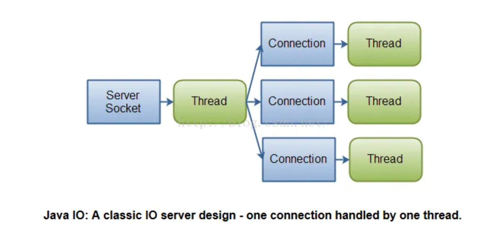
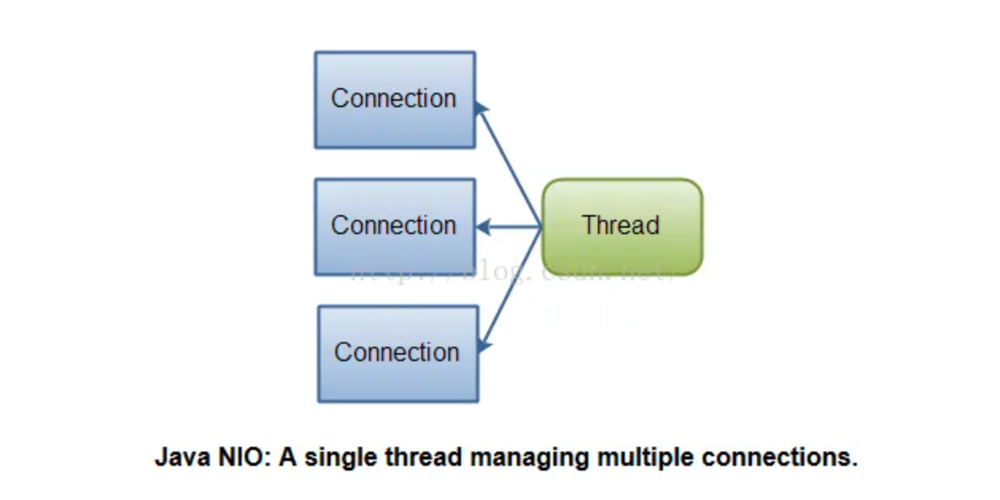

## 传统的BIO模式（**同步阻塞模式**）

在计算机网络中，**BIO (Blocking I/O)** 是一种同步的 I/O 模型。它的工作原理是：在 BIO 模式下，调用方在发起I/O操作时会被阻塞，直到操作完成后才继续执行

它通常用于基于传统 TCP/IP 协议的客户端和服务器通信。

### BIO模式的特点

- **阻塞模式**：在进行读取或写入操作时，线程会被阻塞，直到数据准备好或操作完成。对于每个客户端请求，都会分配一个线程来处理，直到请求完成后，线程才会释放。
- **简单易用**：因为阻塞 I/O 模型非常直观，它不需要复杂的线程管理或事件驱动机制，对于小型应用或简单的服务器来说，BIO 是一个相对简洁的选择。
- **性能瓶颈**：由于每个连接都需要单独的线程进行处理，BIO 会消耗更多的系统资源，并且当连接数增加时，会导致性能下降。特别是在并发量很大的情况下，BIO 的效率就变得较低。
- **适用于低并发的应用场景**：BIO 最适合用在连接数较少且并发请求量不大的应用中，比如传统的客户端-服务器模型，或者早期的网络服务。

### BIO 的缺点

- **线程资源浪费**：每个连接都需要一个单独的线程，线程管理和上下文切换会导致系统资源浪费，尤其在连接数较多时，会对系统性能产生负面影响。
- **不适合高并发应用**：对于高并发的场景，BIO 模型的性能会大幅下降，因为线程数过多时会导致线程切换和内存消耗过大，甚至可能导致服务器崩溃。

## 改进后的模式——NIO模式（**同步非阻塞模式**）

**NIO (New Input/Output)** 是 Java 1.4 引入的一种非阻塞式 I/O 模型，它相较于传统的 **BIO (Blocking I/O)** 模型，提供了更高效的 I/O 操作，特别是在处理大量并发连接时。NIO 通过支持非阻塞 I/O 操作、缓冲区、选择器等机制，N基于I/O多路复用实现的，它可以只用一个线程处理多个客户端I/O，线程不会在执行读取或写入操作时被阻塞。线程可以在等待数据时继续做其他事情，当数据准备好时，NIO 会通过回调机制告知应用程序，显著提高了系统的性能，尤其适用于高并发的网络编程。

### NIO的特点

- **非阻塞 I/O**：NIO 中的 I/O 操作是非阻塞的。也就是说，在进行读写操作时，线程不会被阻塞，线程可以继续处理其他任务，直到数据准备好。
- **双向读写**：`channel`作为I/O 操作的数据流通道，可以用于读写数据。
- **线程的多路复用**：**选择器（Selector）** 使得一个线程可以同时监控多个通道，检测哪些通道可以进行 I/O 操作。允许一个线程在多个通道之间进行多路复用。
- **缓冲机制**：NIO 中的所有数据读写操作都通过 **缓冲区（Buffer）** 来完成。缓冲区是一个在内存中临时存储数据的区域

### NIO 的主要组成部分

- **选择器（Selector）**：
  - **选择器**是 NIO 的核心组件之一，它允许单个线程同时监控多个 I/O 通道，检测哪些通道准备好进行读写操作。
  - 通过选择器，NIO 可以避免为每个连接创建一个线程，而是利用单个线程同时处理多个连接，提高了并发处理能力。
- **缓冲区（Buffer）**：
  - 在 NIO 中，数据读写通过 **缓冲区**（`Buffer`）进行操作。缓冲区是一个内存区域，它用于在数据与通道（`Channel`）之间传递数据。
  - 数据总是从通道读到缓冲区，或者从缓冲区写到通道。缓冲区是 NIO 中的一个重要概念，类似于传统 I/O 的字节流和字符流。
- **通道（Channel）**：
  - 通道是 NIO 中与数据源或数据目的地之间的连接通道，用于读取或写入数据。`Channel` 与传统的流不同，它是双向的，即既可以读，也可以写。
  - NIO 提供了多个具体的通道类，如 `FileChannel`（文件通道）、`SocketChannel`（套接字通道）和 `ServerSocketChannel`（服务器套接字通道）。
- **内存映射文件（Memory-mapped Files）**：
  - NIO 支持内存映射文件，可以通过 `MappedByteBuffer` 来将文件的部分或整个内容映射到内存中，允许程序像访问数组一样操作文件内容，提升了文件操作的效率。
- **SelectionKey**：
  - **SelectionKey** 是选择器与通道之间的桥梁，它表示通道在选择器上的注册状态，并且它指示通道准备好进行的操作（如读、写、连接等）。

### NIO的工作流程

- 创建通道并设置为非阻塞模式：在 NIO 中，所有的数据读取和写入操作都是通过 **通道（Channel）** 完成的。通道是一个连接 I/O 设备（如文件、网络套接字等）的双向数据传输通道。
- 将通道注册到选择器（Selector）：通道需要注册到 **选择器（Selector）** 上。选择器是一个核心组件，它允许单个线程监控多个通道的 I/O 状态。
- 轮询选择器（Selector）：在应用程序中，调用选择器的 `select()` 方法来阻塞并等待事件的发生。当至少一个通道准备好进行指定的 I/O 操作时，选择器会返回并且唤醒线程。
- 处理就绪的通道：一旦选择器检测到某些通道已经准备好进行 I/O 操作，就会返回这些通道的集合。
- 处理IO操作：在通道准备好后，应用程序通过 `ByteBuffer` 来读取或写入数据。
- 继续轮询并处理其他通道的 I/O 事件
- 关闭通道与选择器

### 核心组件

#### `Channel`接口

- 是双向的，可以同时支持读取和写入（读/写），与传统的I/O流相比更灵活。传统的流只能单向，要么是输入流要么是输出流。
- 常用于非阻塞I/O操作，可以结合Selector来实现多路复用，从而处理多个并发连接。

**种类**

- `SocketChannel`：用于基于TCP的网络通信，可以与服务器或客户端进行连接。
- `ServerSocketChannel`：用于监听TCP连接，类似于传统I/O中的ServerSocket。
- `DatagramChannel`：用于基于UDP的网络通信。
- `FileChannel`：用于从文件中读取或向文件中写入数据。

**常用方法**

- `SelectionKey register(Selector sel, int ops) throws ClosedChannelException`
  - `sel`：选择器对象，通道将会注册到该选择器上。
  - `ops`：感兴趣的操作，可以是 `SelectionKey.OP_READ`、`SelectionKey.OP_WRITE`、`SelectionKey.OP_CONNECT` 等。
  - **返回值**：返回一个 `SelectionKey`，表示通道在选择器中的状态。
- 创建对象
  - `public static FileChannel open(Path path, OpenOption... options) throws IOException;`
    - `path`: 要操作的文件路径，类型为 `Path`。
    - `options`: 文件打开选项，例如 `StandardOpenOption.READ`、`StandardOpenOption.WRITE` 等，可以传入多个选项。
  - `public static SocketChannel open() throws IOException;`
  - `public static ServerSocketChannel open() throws IOException;`
  - `public static DatagramChannel open() throws IOException;`
- 读取数据
  - `int read(ByteBuffer dst) throws IOException;`

#### `Selector`类

Selector 是Java NIO（New I/O）中用于实现**I/O多路复用**的组件，它可以通过一个单独的线程同时监视多个通道（Channel）的事件。

**Selector的作用**：

- **管理多个Channel**：通过一个`Selector`实例，程序可以同时监听多个通道的I/O事件（如可读、可写、连接就绪等），从而使一个线程管理多个连接变得高效。
- **非阻塞I/O**：`Selector`通常与非阻塞通道（如`SocketChannel`）配合使用，实现高效的非阻塞I/O操作。它使得程序无需为每个连接创建一个线程，减少了线程的开销。

**Selector的事件类型**：

- **OP_READ**：表示通道中有数据可读。
- **OP_WRITE**：表示通道可以向其中写入数据。
- **OP_CONNECT**：表示通道完成连接操作。
- **OP_ACCEPT**：表示通道可以接受新的连接

**Selector的常见方法**

- `int selectNow()`：不论是否有无事件发生，立即返回
- `int select(long timeout)`：至多阻塞 timeout 时间（或被唤醒），如果提早有事件发生，提早返回
- `int select()`：一直阻塞着，直到有事件发生（或被唤醒）

返回值就是就绪的通道数，一般判断大于 0 即可进行后续的操作。