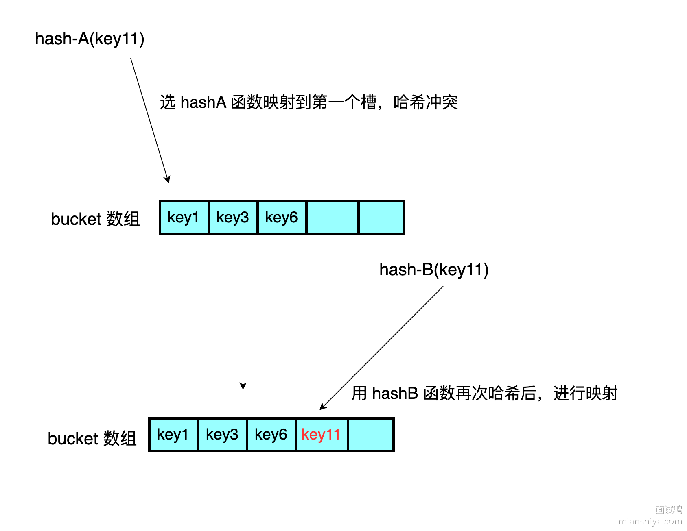
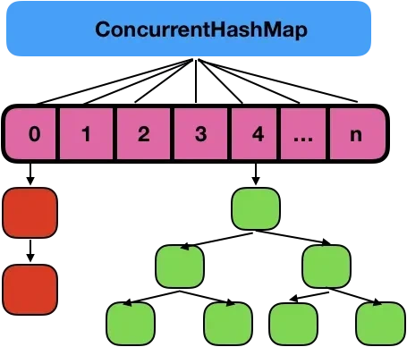

## HashMap的特点

**`HashMap`** 是 Java 中的一个基于 **哈希表** 的集合类，用于存储键值对（**`key-value`**）映射。

- **基于哈希表实现**：

  - 数据存储在数组中，每个数组位置对应一个链表或红黑树（JDK 1.8 及以上版本）。

  - 通过哈希值定位键值对的存储位置。（同时重写 **`equals()`** 方法和 **`hashcode()`** 方法

- **非线程安全**：

  - 多线程操作可能导致数据不一致问题。

- **允许 `null`**：

  - 键和值均可以为 **`null`**，但键只能有一个 **`null`**。

- **动态扩容**：

  - 默认初始容量为 **16**。

  - 加载因子为 **0.75**。

  - 当使用的存储空间超过阈值（`容量 × 加载因子`）时，**`HashMap`** 会动态扩容。

## HashMap提升性能的建议

- **合理设置初始容量**：如果在使用时可以预估 **`HashMap`** 存储的数据量大小，那么需要在创建时设置一个合适的初始容量，以避免频繁的扩容操作。Java 中 **`HashMap`** 默认初始容量是 **16**。
- **调整负载因子**：官方提供的默认负载因子是 **0.75**。可以根据具体应用场景调整这个值。较低的负载因子会减少冲突，提高查找效率，但会占用更多内存（更加容易触发扩容）。较高的负载因子则会减少内存消耗，但可能增加冲突的概率，降低查找效率。
  - **高并发读取场景**：可以降低负载因子，以减少哈希冲突，提高读取性能。
  - **内存受限场景**：可以提高负载因子，以减少扩容次数和内存消耗，但可能会降低写入和查询的性能。
- **确保 hashCode 均匀分布**：对应 key 的 **`hashCode()`** 方法生成的哈希值需均匀分布，减少哈希冲突。避免使用质量不高的哈希函数，防止大量键映射到相同的槽位上，造成性能瓶颈。

## HashMap的常用方法

### 构造方法

- **`public HashMap()`**：默认构造方法
- **`public HashMap(int initialCapacity)`**：指定初始容量的构造方法
- **`public HashMap(int initialCapacity, float loadFactor)`**：指定初始容量和加载因子的构造方法
- **`public HashMap(Map<? extends K, ? extends V> m)`**：从其他 `Map` 初始化的构造方法

### 添加键值对

- **`public V put(K key, V value)`**：添加或更新键值对 
- **`public void putAll(Map<? extends K, ? extends V> m)`**：批量添加键值对

### 删除键值对

- **`public V remove(Object key)`**：移除键值对
- **`public boolean remove(Object key, Object value)`**：按键值同时匹配移除

### 查询键值对

- **`public V get(Object key)`**：获取值
- **`public boolean containsKey(Object key)`**：检查是否包含键
- **`public boolean containsValue(Object value)`**：检查是否包含值
- **`public V getOrDefault(Object key, V defaultValue)`**：获取默认值

### 视图操作

- **`public Set<K> keySet()`**：获取所有键的集合
- **`public Collection<V> values()`**：获取所有值的集合
- **`public Set<Map.Entry<K, V>> entrySet()`**：获取所有键值对的集合

### 替换操作

- **`public V replace(K key, V value)`**：替换值
- **`public boolean replace(K key, V oldValue, V newValue)`**：条件替换值

### 遍历操作

#### 使用for-each循环和entrySet()方法

```java
import java.util.HashMap;
import java.util.Map;

public class MapTraversalExample {
    public static void main(String[] args) {
        Map<String, Integer> map = new HashMap<>();
        map.put("key1", 1);
        map.put("key2", 2);
        map.put("key3", 3);

        // 使用for-each循环和entrySet()遍历Map
        for (Map.Entry<String, Integer> entry : map.entrySet()) {
            System.out.println("Key: " + entry.getKey() + ", Value: " + entry.getValue());
        }
    }
}
```

#### 使用for-each循环和keySet()方法

```java
import java.util.HashMap;
import java.util.Map;

public class MapTraversalExample {
    public static void main(String[] args) {
        Map<String, Integer> map = new HashMap<>();
        map.put("key1", 1);
        map.put("key2", 2);
        map.put("key3", 3);

        // 使用for-each循环和keySet()遍历Map的键
        for (String key : map.keySet()) {
            System.out.println("Key: " + key + ", Value: " + map.get(key));
        }
    }
}
```

#### 使用 Lambda 表达式和forEach()方法

```java
import java.util.HashMap;
import java.util.Map;

public class MapTraversalExample {
    public static void main(String[] args) {
        Map<String, Integer> map = new HashMap<>();
        map.put("key1", 1);
        map.put("key2", 2);
        map.put("key3", 3);

        // 使用Lambda表达式和forEach()方法遍历Map
        map.forEach((key, value) -> System.out.println("Key: " + key + ", Value: " + value));
    }
}
```

## HashMap的底层原理

### 存储原理

#### JDK 1.7 以前

在 JDK 1.7 版本之前， **`HashMap`** 数据结构是数组和链表，**`HashMap`** 通过哈希算法将元素的键映射到数组中的槽位。如果多个键映射到同一个槽位，它们会以链表的形式存储在同一个槽位上，因为链表的查询时间是$O(n)$，所以冲突很严重，一个索引上的链表非常长，效率就很低了。

**`HashMap`** 的默认初始容量为 **16**，负载因子为 **0.75**。也就是说，当存储的元素数量超过 16 × 0.75 = 12 个时，**`HashMap`** 会触发扩容操作，

当要塞入一个键值对的时候，会根据一个 **`hash`** 算法计算 key 的 **`hash`** 值，然后通过数组大小 **`n-1 & hash`** 值之后，得到一个数组的下标，然后往那个位置塞入这键值对。当发生哈希冲突时会使用闭散列法

链表的插入采用的是头插法，即每当发生哈希冲突时，新的节点总是插入到链表的头部，老节点依次向后移动，形成新的链表结构。


在多线程环境下，头插法可能导致链表形成环，特别是在并发扩容时。当多个线程同时执行 put() 操作时，如果线程 A 正在进行头插，线程 B 也在同一时刻操作链表，可能导致链表结构出现**环路**，从而引发死循环，最终导致程序卡死或无限循环。


#### JDK 1.8以后

在 JDK 1.8 版本的时候做了优化，当一个链表的长度超过 **8** 且数组大小大于等于 **64** 的时候就转换数据结构，不再使用链表存储，而是使用**红黑树**，查找时使用红黑树，时间复杂度为$O(log n)$，可以提高查询性能，但是在红黑树节点数量较少时，即数量小于**6** 时，会将红黑树转换回链表。


在 JDK1.8 的时候，改成了尾插法，即新的节点插入到链表的尾部，保持插入的顺序。并且引入了红黑树。


### hash方法的底层实现

```java
static final int hash(Object key) {
    int h;
    return (key == null) ? 0 : (h = key.hashCode()) ^ (h >>> 16);
    // 如果键值为 null，则哈希码为 0（依旧是说如果键为 null，则存放在第一个位置）；
    // 否则，通过调用hashCode()方法获取键的哈希码，并将其与右移 16 位的哈希码进行异或运算。
}
```

**目的**：将 key 的 hashCode 值进行处理，得到最终的哈希值。**hash 方法就是为了增加随机性，让数据元素更加均衡的分布，减少碰撞**

将哈希值无符号右移 16 位，高位补0，意味着原哈希值的高 16 位被移到了低 16 位的位置。再与自身进行异或操作，从而使得原始哈希值的高 16 位和低 16 位就可以参与到最终用于索引计算的低位中。

**示例**

```
原始: 0001 0010 0011 0100 0101 0110 0111 1000
右移: 0000 0000 0000 0000 0001 0010 0011 0100
异或: ---------------------------------------
结果: 0001 0010 0011 0100 0100 0100 0100 1100
```

### 数组索引计算原理

通常基于哈希值计算数组下标使用该公式：**`hash % length`**，其中 **`hash`** 为以经过 **`hash()`** 方法优化后的哈希值， **`length`** 为数组容量

从二进制的角度上是获取 **`hash`** 的二进制表示中最低 n 位的值。

因此取余运算可以使用位运算代替，当 **`length`** 是 2 的幂时，**`n - 1`** 的二进制表示是全 **`1`**（如 **`n=16`**，**`n-1=15`**，即 **`1111`**），这样按位与操作实际上会相当于对 **`hash`** 的低 $log(length)$ 位进行保留。

故可得公式：**`hash & (length - 1) = hash % length = (length - 1) & hash`**

示例：**`hash`** 为 14，**`length`** 为 8，也就是**`n`**为3

```
  1110 (hash = 14)
& 0111 (length - 1 = 7)
  ----
  0110 (结果 = 6)
```




为什么数组长度（容量）设计为2的n次方

**`HashMap`** 采用 2 的 n 次方倍作为容量，主要是为了提高哈希值的分布均匀性和哈希计算的效率。

**`HashMap`** 通过 **`(length - 1) & hash`** 来计算元素存储的索引位置，这种位运算只有在数组容量是 2 的 n 次方时才能确保索引均匀分布。**位与运算的效率高于取模运算**（**`hash % length`**），提高了哈希计算的速度。

且当 **`HashMap`** 扩容时，通过容量为 2 的 n 次方，扩容时只需通过简单的位运算判断是否需要迁移，这减少了重新计算哈希值的开销，提升了重新哈希的效率。



### 哈希碰撞的解决方法

Hash 碰撞是指在使用哈希算法时，不同的输入数据通过哈希函数计算后，得到了相同的哈希值（即散列值）。因为哈希值相同，所以这些键会被映射到哈希表的同一个位置，从而引发“碰撞”。

**解决方法**

- **拉链法（闭散列法）**：将哈希表中每个槽的位置变成一个链表，当多个键的哈希值相同时，将它们存储在同一个链表中。
- **开放寻址法（开散列法）**：如果出现碰撞，寻找哈希表中的下一个可用位置。
- **再哈希法（双重哈希）**：在出现碰撞时，使用第二个哈希函数计算新的索引位置，减少碰撞的概率。

#### 拉链法（闭散列法）

使用链表来处理冲突，每个哈希表的槽不仅存储单个元素，而是存储指向链表头部的指针。所有具有相同哈希值的元素都会被放入到同一个链表中。!

优点：

- 简单易实现，扩展性好。
- 在处理大量数据时，性能更为稳定。

缺点：

- 如果碰撞频繁，链表会变长，导致查询性能下降。
- 需要额外的内存来存储链表的指针。


#### 开放寻址法（开散列法）

在哈希表中寻找下一个空闲的槽位以存储发生碰撞的元素。

- 线性探查法：在哈希表中查找下一个连续的空槽，将碰撞的键存入该槽中。
- 平方探查法：类似于线性探查，但探查的步长是二次方，减少了聚集问题。
- 双散列法：使用两个不同的哈希函数，第一次哈希决定初始位置，第二次哈希决定探查步长。

优点：

- 不需要额外的内存来存储指针或链表结构。
- 如果负载因子低，查找和插入的效率较高。

缺点：

- 随着哈希表的填充度增加，探查的次数会增加，导致性能下降。
- 删除元素时候，不能真的删除，只能打标，否则会导致查找错误。只能在下一个元素插入时，发现标记后才能替换原来的元素。

#### 再哈希法（双重哈希）

在出现碰撞时，使用第二个哈希函数计算新的索引位置，减少碰撞的概率



### 扩容机制

**`HashMap`**的默认负载因子为**0.75**，初始长度为**16**（初始化时可以指定容量，**`HashMap`** 会将这个值转换为大于或等于 17 的最小的 2 的幂。）

当 **`HashMap`** 中的键值对中的数量大于**容量*负载因子**时发生扩容，容量扩大为当前容量的**两倍**

扩容时，**`HashMap`** 需要重新计算所有元素的哈希值，并将它们重新分配到新的哈希桶中，这个过程称为 **`rehashing`** 。每个元素的存储位置会根据新容量的大小重新计算哈希值，并移动到新的数组中。

JDK 1.7以前，所有元素的哈希值，并将它们重新分配到新的哈希桶中

JDK 1.7以后，进行了优化。不需要每个节点重新 hash 算下标。因为元素的新位置只与高位有关

此时重新哈希只要判断原来的hash拓展后新增的位是0还是1

若为0则保持在原来的位置（hash 1 保持为 5）

若为1则被移动到原来的位置加上旧数组长度的地方（hash 2 被移动到 5+16=21 处）

### 插入原理（put方法）

- 根据要添加的键的哈希码（ **`hashcode()`** 方法+ **`hash`** 方法）计算在数组中的位置（索引）
- 检查该位置是否为空（即没有键值对存在）
  - 如果为空，则直接在该位置创建一个新的Entry对象来存储键值对。将要添加的键值对作为该Entry的键和值，并保存在数组的对应位置。
  - 如果不为空则遍历链表或者红黑树检查键值对的键是否与要添加的键值对的键相同（ **`equals()`** 方法）
    - 如果相同，则表示找到了相同的键，直接将新的值替换旧的值，完成更新操作。
    - 若不相同，根据对应的数据结构进行插入工作
- 检查链表长度是否达到阈值（默认为 **`8`**）：如果链表长度超过阈值，且 **`HashMap`** 的数组长度大于等于 **`64`**，则会将链表转换为红黑树，以提高查询效率
- 检查负载因子是否超过阈值（默认为 **`0.75`**）：如果键值对的数量（size）与数组的长度的比值大于阈值，则需要进行扩容操作
- 扩容操作：
  - 创建一个新的两倍大小的数组。
  - 将旧数组中的键值对重新计算哈希码并分配到新数组中的位置。
  - 更新 **`HashMap`** 的数组引用和阈值参数。
- 完成添加操作。

## equals方法和hashcode方法

 **`HashMap`** 在比较元素时

- 使用对象的 **`hashCode()`** 计算出桶的位置。

- 在该位置，通过 **`equals()`** 方法检查键是否相等。

所以 **`equals`** 相等的两个对象，**`hashCode`**一定相等。**`hashCode`**相等的两个对象，**`equals`** 不一定相等（比如散列冲突的情况）

重写了 **`equals()`** 方法，不重写 **`hashCode()`** 方法时，可能会出现 **`equals()`** 方法返回为true，而 **`hashCode()`** 方法却返回false，这样的话，这两个逻辑上相同的对象会被放到不同的桶中，这样就会导致 **`get()`** 的时候，找不到对应的值。

## JDK 1.8 的改动

- **改进了哈希函数的计算**：JDK 1.8 中优化了哈希函数，使得哈希值的分布更加均匀，减少了哈希冲突的发生。通过在生成哈希值时使用“扰动函数”，确保哈希值的高低位都能参与到桶的选择中。
- **扩容机制优化**：JDK 1.8 改进了扩容时的元素迁移机制。在扩容过程中不再对每个元素重新计算哈希值，而是根据原数组长度的高位来判断元素是留在原位置，还是迁移到新数组中的新位置。这一改动减少了不必要的计算，提升了扩容效率。
- **头插法变为尾插法**：头插法的好处就是插入的时候不需要遍历链表，直接替换成头结点，但是缺点是扩容的时候会逆序，而逆序在多线程操作下可能会出现环，产生死循环，于是改为尾插法。

## HashMap的线程安全问题

- JDK1.7中的 **`HashMap`** 使用头插法插入元素，在多线程的环境下，扩容的时候有可能导致环形链表的出现，形成死循环。因此，JDK1.8使用尾插法插入元素，在扩容时会保持链表元素原本的顺序，不会出现环形链表的问题。
- 多线程同时执行 **`put`** 操作，如果计算出来的索引位置是相同的，那会造成前一个 key 被后一个 key 覆盖，从而导致元素的丢失。

## 自定义HashMap

### 内部节点类

```java
 /**
     * 节点类
     *
     * @param <K>
     * @param <V>
     */
    class Node<K, V> {
        //键值对
        private K key;
        private V value;

        //链表，后继
        private Node<K, V> next;

        public Node(K key, V value) {
            this.key = key;
            this.value = value;
        }

        public Node(K key, V value, Node<K, V> next) {
            this.key = key;
            this.value = value;
            this.next = next;
        }
    }
```

### 成员变量

```java
 	//默认容量
    final int DEFAULT_CAPACITY = 16;
    //负载因子
    final float LOAD_FACTOR = 0.75f;
    //HashMap的大小
    private int size;
    //桶数组
    Node<K, V>[] buckets;
```

### 构造方法

```java
 	/**
     * 无参构造器，设置桶数组默认容量
     */
    public OwnHashMap() {
        buckets = new Node[DEFAULT_CAPACITY];
        size = 0;
    }

    /**
     * 有参构造器，指定桶数组容量
     *
     * @param capacity
     */
    public OwnHashMap(int capacity) {
        buckets = new Node[capacity];
        size = 0;
    }
```

### 哈希函数

```java
 /**
     * 哈希函数，获取地址
     *
     * @param key
     * @return
     */
    private int getIndex(K key, int length) {
        //获取hash code
        int hashCode = key.hashCode();
        //和桶数组长度取余
        int index = hashCode % length;
        return Math.abs(index);
    }
```

### 添加键值对

- 获取元素插入位置
- 当前位置为空，直接插入
- 位置不为空，发生冲突，遍历链表
  - 如果元素key和节点相同，覆盖
  - 否则新建节点插入链表头部

```java
/**
     * 将元素存入指定的node数组
     *
     * @param key
     * @param value
     * @param table
     */
    private void putVal(K key, V value, Node<K, V>[] table) {
        //获取位置
        int index = getIndex(key, table.length);
        Node node = table[index];
        //插入的位置为空
        if (node == null) {
            table[index] = new Node<>(key, value);
            size++;
            return;
        }
        //插入位置不为空，说明发生哈希冲突，使用闭散列法,遍历链表
        while (node != null) {
            //如果key相同，就覆盖掉
            if ((node.key.hashCode() == key.hashCode())
                    && (node.key == key || node.key.equals(key))) {
                node.value = value;
                return;
            }
            node = node.next;
        }
        //当前key不在链表中，插入链表头部
        Node newNode = new Node(key, value, table[index]);
        table[index] = newNode;
        size++;
    }
/**
     * put方法
     *
     * @param key
     * @param value
     * @return
     */
    public void put(K key, V value) {
        //判断是否需要进行扩容
        if (size >= buckets.length * LOAD_FACTOR) resize();
        putVal(key, value, buckets);
    }
```

### 扩容机制

- 创建两倍容量的新数组
- 将当前桶数组的元素重新散列到新的数组
- 新数组置为map的桶数组

```java
 /**
     * 扩容
     */
    private void resize() {
        //创建一个两倍容量的桶数组
        Node<K, V>[] newBuckets = new Node[buckets.length * 2];
        //将当前元素重新散列到新的桶数组
        rehash(newBuckets);
        buckets = newBuckets;
    }

    /**
     * 重新散列当前元素
     *
     * @param newBuckets
     */
    private void rehash(Node<K, V>[] newBuckets) {
        //map大小重新计算
        size = 0;
        //将旧的桶数组的元素全部刷到新的桶数组里
        for (int i = 0; i < buckets.length; i++) {
            //为空，跳过
            if (buckets[i] == null) {
                continue;
            }
            Node<K, V> node = buckets[i];
            while (node != null) {
                //将元素放入新数组
                putVal(node.key, node.value, newBuckets);
                node = node.next;
            }
        }
    }
```

### 获取键值对的值

```java
 /**
     * 获取元素
     *
     * @param key
     * @return
     */
    public V get(K key) {
        //获取key对应的地址
        int index = getIndex(key, buckets.length);
        if (buckets[index] == null) return null;
        Node<K, V> node = buckets[index];
        //查找链表
        while (node != null) {
            if ((node.key.hashCode() == key.hashCode())
                    && (node.key == key || node.key.equals(key))) {
                return node.value;
            }
            node = node.next;
        }
        return null;
    }
```


## HashMap的衍生类——LinkedHashMap类

**`LinkedHashMap`** 是 Java 集合框架中的一个实现类，它继承自 **`HashMap`**，并且**保留了键值对的插入顺序或访问顺序**。

它内部是通过维护了一个双向链表来记录元素的插入顺序或访问顺序。

### 底层实现

**`LinkedHashMap`** 内部追加了双向链表，来维护元素的插入顺序

```java
static class Entry<K,V> extends HashMap.Node<K,V> {
    Entry<K,V> before, after;
    Entry(int hash, K key, V value, Node<K,V> next) {
        super(hash, key, value, next);
    }
}
```

在 **`LinkedHashMap`** 中，链表中的节点顺序是按照插入顺序维护的。当使用 **`put()`** 方法向 **`LinkedHashMap`** 中添加键值对时，会将新节点插入到链表的尾部，并更新 **`before`** 和 **`after`** 属性，以保证链表的顺序关系

```java
/**
 * 将指定节点插入到链表的尾部
 *
 * @param p 要插入的节点
 */
private void linkNodeLast(LinkedHashMap.Entry<K,V> p) {
    LinkedHashMap.Entry<K,V> last = tail; // 获取链表的尾节点
    tail = p; // 将 p 设为尾节点
    if (last == null)
        head = p; // 如果链表为空，则将 p 设为头节点
    else {
        p.before = last; // 将 p 的前驱节点设为链表的尾节点
        last.after = p; // 将链表的尾节点的后继节点设为 p
    }
}
```

### 访问顺序

**`LinkedHashMap`** 不仅能够维持插入顺序，还能够维持访问顺序。访问包括调用 **`get()`** 方法、**`remove()`** 方法和 **`put()`** 方法。

只需要在**`LinkedHashMap`**的构造方法中加入一个 **`Boolean`** 参数

如果为 **`true`** 的话，就表示 **`LinkedHashMap`** 要维护访问顺序

如果为 **`false`** 的话，就表示 **`LinkedHashMap`** 要维护插入顺序。

默认是 **`false`**。

这样便于使用LRU算法

```java
public class LRUCache<K,V> {
    class Node<K,V> {
        K key;
        V value;
        Node<K,V> prev, next;
        public Node(){}
        public Node(K key, V value) {
            this.key = key;
            this.value = value;
        }
    }
    private int capacity;
    private HashMap<K,Node> map;
    // 虚拟头尾节点
    private Node<K,V> head;
    private Node<K,V> tail;
    public LRUCache(int capacity) {
        this.capacity = capacity;
        map = new HashMap<>(capacity);
        head = new Node<>();
        tail = new Node<>();
        head.next = tail;
        tail.prev = head;
    }

    public V get(K key) {
        Node<K,V> node = map.get(key);
        if (node == null) {
            return null;
        }
        moveNodeToHead(node);
        return node.value;
    }

    public void put(K key, V value) {
         Node<K,V> node = map.get(key);
       	 if (node == null) {
            if (map.size() >= capacity) {
                map.remove(tail.prev.key);
                removeTailNode();
            }
            Node<K,V> newNode = new Node<>(key, value);
            map.put(key, newNode);
            addToHead(newNode); //置于表头
        } else {
            node.value = value;
            moveNodeToHead(node);
        }
    }

    // 将节点添加到表头
    private void addToHead(Node<K,V> newNode) {
        // 新节点和head节点以及head节点的后驱节点双向链接
        newNode.prev = head;
        newNode.next = head.next;
        // head节点的后驱节点和新节点单向链接
        head.next.prev = newNode;
        // head节点和新节点单向链接
        head.next = newNode;
    }

    // 将当前节点移动到表头
    private void moveNodeToHead(Node<K,V> node) {
        removeNode(node);
        addToHead(node);
    }

    // 删除当前节点
    private void removeNode(Node<K,V> node) {
        // 当前节点的前驱节点和当前节点的后驱节点双向链接
        node.prev.next = node.next;
        node.next.prev = node.prev;
    }

    // 删除尾节点
    private void removeTailNode() {
        removeNode(tail.prev);
    }

    public static void main(String[] args) {
        LRUCache<Integer,Integer> lruCache = new LRUCache<>(3);
        lruCache.put(1,1);
        lruCache.put(2,2);
        lruCache.put(3,3);
        lruCache.get(1);
        lruCache.put(4,4);
        System.out.println(lruCache); 
    }
}
```

## HashMap的衍生类——TreeMap类

TreeMap 内部是通过红黑树实现的，可以让 key 的实现 **`Comparable`** 接口或者自定义实现一个 **`comparator`** 传入构造函数，这样塞入的节点就会根据你定义的规则进行排序。

### 基本特性：

- 数据结构：**`TreeMap`** 基于红黑树实现，红黑树是一种自平衡的二叉查找树，能够保证基本操作（插入、删除、查找）的时间复杂度为 $O(log n)$。
- 键的有序性：**`TreeMap`** 中的键是有序的，默认按自然顺序（键的 **`Comparable`** 实现）排序，也可以通过构造时提供的 **`Comparator`** 进行自定义排序。
- 不允许 **`null`** 键：**`TreeMap`** 不允许键为 **`null`**，但允许值为 **`null`**。

### 与HashMap的区别

- **`HashMap`** 是基于数组+链表+红黑树实现的，加入元素的时候会先计算 key 的哈希值，然后通过哈希值计算出元素在数组中的存放下标，然后将元素插入到指定的位置，如果发生哈希冲突，会使用链表来解决，如果链表长度大于 **8**，会转换为红黑树。

- **`TreeMap`** 是基于红黑树实现的，加入元素的时候会先判断根节点是否为空，如果为空，直接插入到根节点，如果不为空，会通过 key 的比较器来判断元素应该插入到左子树还是右子树。

- 在没有发生哈希冲突的情况下，**`HashMap`** 的查找效率是 $O(1)$。适用于查找操作比较频繁的场景。

- **`TreeMap`** 的查找效率是 $O(logn)$。并且保证了元素的顺序，因此适用于需要大量范围查找或者有序遍历的场景。

### 示例

```java
import java.util.Comparator;
import java.util.TreeSet;

class Person {
    String name;
    int age;

    Person(String name, int age) {
        this.name = name;
        this.age = age;
    }

    @Override
    public String toString() {
        return "Person{name='" + name + "', age=" + age + "}";
    }
}

public class TreeSetExample2 {
    public static void main(String[] args) {
        // 自定义排序规则：按名字字典序排列
        Comparator<Person> nameComparator = (p1, p2) -> p1.name.compareTo(p2.name);

        TreeSet<Person> treeSet = new TreeSet<>(nameComparator);
        treeSet.add(new Person("Alice", 30));
        treeSet.add(new Person("Charlie", 35));
        treeSet.add(new Person("Bob", 25));

        for (Person person : treeSet) {
            System.out.println(person);
        }
    }
}
```

## HashMap的衍生类——ConcurrentHashMap类

**`ConcurrentHashMap`** 是 Java 提供的一种线程安全的哈希表实现，位于 **`java.util.concurrent`** 包中，广泛用于高并发环境下。它与传统的 **`HashMap`** 不同，能够在多个线程并发操作时保持高效性和一致性。

### 特点

- **线程安全**：
  - 多线程可以同时操作不同的桶，提高并发性能。
- **高效性**：
  - 通过细粒度锁或无锁机制（CAS），在高并发场景下效率比 **`Hashtable`** 更高。
- **不允许 `null` 键和值**：
  - 如果尝试插入 **`null`** 键或 **`null`** 值，会抛出 **`NullPointerException`**。
- **支持部分并发操作**：
  - 可以在迭代期间执行插入或删除操作，不会抛出 **`ConcurrentModificationException`**。
- **不支持键或值为null**：

### 构造方法

- **`public ConcurrentHashMap()`**：创建一个默认的 **`ConcurrentHashMap`** 实例

- **`public ConcurrentHashMap(int initialCapacity, float loadFactor, int concurrencyLevel)`**
  - **`initialCapacity`**：初始容量。
  - **`loadFactor`**：负载因子。
  - **`concurrencyLevel`**：并发级别（用于估计并发线程数，JDK 1.8 后不再显式使用）。

### 底层实现

#### JDK 1.7之前

在 JDK 1.7 中它使用的是数组加链表的形式实现的

**实现思想**

基于 **分段锁机制（Segmented Locking）**，其核心思想是将整个哈希表分成多个段（ **`Segment`** ），每个段独立加锁，从而实现线程安全的高效访问。默认是 **16** 个 **`Segment`** ，所以最多有 **16** 个线程可以并发执行。

**核心数据结构**

一个 **`ConcurrentHashMap`** 里包含一个 **`Segment`** 数组，一个 **`Segment`** 里包含一个 **`HashEntry`** 数组，每个 **`HashEntry`** 是一个链表结构的元素。

- **`Segment`**：一种可重入锁，继承了 **`ReentrantLock`**，在 **`ConcurrentHashMap`** 里扮演锁的角色用来保护段内的数据安全。
- **`HashEntry`**：表示一个键值对节点，类似于 **`HashMap`** 的链表节点


分段锁技术将数据分成一段一段的存储，然后给每一段数据配一把锁，不同 **`Segment`** 之间的操作互不影响，从而提高并发性能。。当一个线程占用锁访问其中一个段数据的时候，其他段的数据也能被其他线程访问，能够实现真正的并发访问。

- 先通过 `key` 的 `hash` 函数判断得到 **`Segment`** 数组的下标，将这个 **`Segment`** 上锁
- 再次通过 `key` 的 `hash` 函数得到 **`Segment`** 里 **`HashEntry`** 数组的下标


可以简化理解：每个 **`Segment`** 数组存放的就是一个单独的 **HashMap**

**缺陷**

 **`Segment`** 数组一旦初始化了之后不会扩容，只有 **`HashEntry`** 数组会扩容，这就导致并发度过于死板，不能随着数据的增加而提高并发度

#### JDK 1.7以后

**`ConcurrentHashMap`** 做了更细粒度的锁控制，可以理解为 **`HashMap`** 的节点数组的每个位置都是一把锁，这样扩容了锁也会变多，并发度也会增加。



### 加锁机制

#### **分段锁加锁机制（JDK 1.7以前）**

在 **`ConcurrentHashMap`** 中，将整个数据结构分为多个 Segment，每个 **Segment** 都类似于一个小的 HashMap，每个 Segment 都有自己的锁，不同 **`Segment`** 之间的操作互不影响，从而提高并发性能。

- 不同 **`Segment`** 的并发写入（可以并发执行）
- 同一 **`Segment`** 的一写一读（可以并发执行）
- 同一 **`Segment`** 的并发写入（同一 **`Segment`** 的并发写入会被阻塞）

在 **`ConcurrentHashMap`** 中，对于插入、更新、删除等操作，需要先定位到具体的 **`Segment`**，然后再在该 **`Segment`** 上加锁，而不是像传统的 **`HashMap`** 一样对整个数据结构加锁。这样可以使得不同 **`Segment`** 之间的操作并行进行，提高了并发性能。

**get操作（读操作）**

​	**get**操作是无锁的。读操作不会阻塞写操作，从而提高了并发性能

- 通过 **`volatile`** 保证 **`HashEntry`** 的可见性，允许多个线程同时读取。
- 遍历链表或红黑树时无需加锁。

**put/remove操作（写操作）**

写操作如 **`put()`** 和 **`remove()`** 需要加锁，以确保写入时的线程安全性和一致性

- 根据哈希值找到目标 **`Segment`**。
- 使用 **`lock()`** 方法（可重入锁）锁定该 **`Segment`**。
- 在加锁状态下，检查是否存在相同键：
  - 存在：更新值。
  - 不存在：插入新节点。

**扩容机制**

- **基于 Segment**：**`ConcurrentHashMap`**是由多个 **`Segment`** 组成的，每个 **`Segment`** 中包含一个 **`HashMap`**。当某个**`Segment`** 内的 **`HashMap`** 达到扩容阈值时，单独为该 **`Segment`** 进行扩容，而不会影响其他 **`Segment`**。
- **扩容过程**：每个 **`Segment`** 维护自己的负载因子，当 **`Segment`** 中的元素数量超过阈值时，该 **`Segment`** 的 **`HashMap`** 会扩容，整体的  **`ConcurrentHashMap`** 并不是一次性全部扩容。

####  **悲观锁和乐观锁（JDK 1.7以后）**

**get操作（读操作）**

​		**get**操作是无锁的。

- 直接定位到目标桶，读取链表或红黑树中的数据。
- 由于数据节点的 **`value`** 是 **`volatile`** 修饰的，确保多线程下读取的数据一致性。

**put操作（写操作）**

- 计算键的哈希值，定位目标桶。
- 如果桶为空，尝试使用 **`volatile`** 和 **`CAS`**（乐观锁） 创建新节点。
- 如果 **`CAS`** 失败或桶非空，使用 **`synchronized`**（悲观锁）锁定该桶：
  - 遍历链表或者红黑树检查键值对的键是否与要添加的键值对的键相同（ **`equals()`** 方法）
    - 如果相同，则表示找到了相同的键，直接将新的值替换旧的值，完成更新操作。
    - 若不相同，根据对应的数据结构进行插入工作
- 如果链表长度超过阈值（**8**），将链表转换为红黑树。

**扩容机制**

- **全局扩容**：**`ConcurrentHashMap`**取消了**`Segment`**，变成了一个全局的数组（类似于 **`HashMap`**）。因此，当 **`ConcurrentHashMap`** 中任意位置的元素超过阈值时，整个 **`ConcurrentHashMap`** 的数组都会被扩容。
- **基于 CAS 的扩容**：在扩容时，**`ConcurrentHashMap`** 采用了类似 **`HashMap`** 的方式，但通过**CAS 操作**确保线程安全，避免了锁住整个数组。在扩容时，多个线程可以同时帮助完成扩容操作。
- **渐进式扩容**：JDK 1.8 的 **`ConcurrentHashMap`** 引入了渐进式扩容机制，扩容时并不是一次性将所有数据重新分配，而是多个线程共同参与，逐步迁移旧数据到新数组中，降低了扩容时的性能开销。

