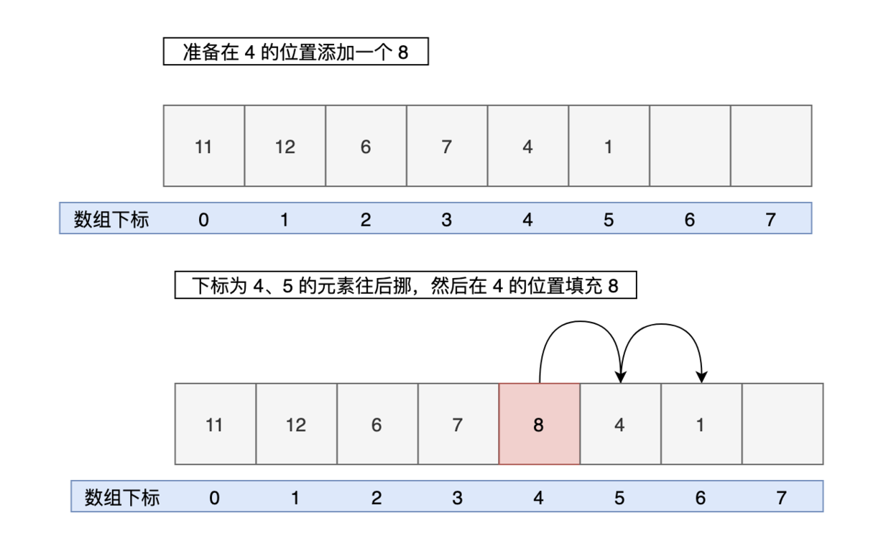

## ArrayList类

**`ArrayList`** 是 Java 集合框架中的一个类，属于 **`java.util`** 包，是一种 **基于动态数组实现的可变长度集合**。它实现了 **`List`** 接口，提供了一个可调整大小的数组，能够存储任意类型的对象（包括自定义类和基本类型的包装类）。

### 特点

- **动态数组：**
  - **`ArrayList`** 的大小是可变的，默认容量为 10。当元素数量超过当前容量时，`ArrayList` 会自动扩容，通常以 1.5 倍的速度增长。
- **有序：**
  - 元素按照插入的顺序存储，可以通过索引访问，顺序不会改变（除非显式调整）。
- **允许重复元素：**
  - **`ArrayList`** 允许存储重复的元素。
- **支持随机访问：**
  - 因为底层是数组，**`ArrayList`** 支持快速随机访问，时间复杂度为$ O(1)$。
- **线程不安全：**
  - **`ArrayList`** 是非同步的，因此在多线程环境下需要手动同步（可以使用 **`Collections.synchronizedList()`** 或 **`CopyOnWriteArrayList`** 替代）。

### 常见方法

#### 构造方法

- **`public ArrayList()`**：创建一个默认初始容量为 10 的空 **`ArrayList`**
- **`public ArrayList(int initialCapacity)`**：创建一个具有指定初始容量的空 `ArrayList`
- **`public ArrayList(Collection<? extends E> c)`**：创建一个包含指定集合中所有元素的 **`ArrayList`**，按照集合的迭代器顺序。

#### 添加元素

- **`boolean add(E e)`**：将指定的元素添加到列表的末尾
- **`void add(int index, E element)`**：将指定的元素插入到列表的指定位置
- **`boolean addAll(Collection<? extends E> c)`**：将指定集合中的所有元素添加到当前列表的末尾
- **`boolean addAll(int index, Collection<? extends E> c)`**：将指定集合中的所有元素插入到当前列表的指定位置。

#### 删除元素

- **`void clear()`**：删除全部元素
- **`E remove(int index)`**：删除列表中指定位置的元素
- **`boolean remove(Object o)`**：删除列表中第一次出现的指定元素。如果列表中没有该元素，则不做任何操作。
- **`boolean removeAll(Collection<?> c)`**：删除当前列表中所有与指定集合中的元素相同的元素
- **`void removeRange(int from,int to)`**：删除索引[from，to）之间的元素

#### 判断元素

- **`boolean contains(Object o)`**：判断列表中是否包含指定的元素
- **`boolean containsAll(Collection<?> c)`**：判断列表是否包含指定集合中的所有元素

#### 修改元素

- **`E set(int index, E element)`**：用指定的元素替换列表中指定位置的元素

#### 访问元素

- **`E get(int index)`**：返回指定位置的元素
- **`int indexOf(Object o)`**：返回指定元素在列表中的第一次出现位置的索引。如果列表中没有该元素，则返回 `-1`
- **`int lastIndexOf(Object o)`**：返回指定元素在列表中的最后一次出现位置的索引。如果列表中没有该元素，则返回 **`-1`**

#### 获取大小

- **`int size()`**：返回列表中元素的数量
- **`boolean isEmpty()`**：判断列表是否为空
- **`void ensureCapacity(int minCapacity)`**：确保列表能够容纳至少指定数量的元素，不会导致扩容。

### 扩容机制

#### 源码分析

- 往 **`ArrayList`** 中添加元素时会有 **`ensureCapacityInternal`** 的判断

  ```java
  public boolean add(E e) {
      ensureCapacityInternal(size + 1);  // Increments modCount!!
      elementData[size++] = e;
      return true;
  }
  ```

- **`ensureCapacityInternal`** 内部会调用 **`ensureExplicitCapacity`** 方法，若 `minCapacity - elementData.length > 0` 即容量不够了，则会调用 **`grow`** 方法：

  ```java
  /**
   * 检查并确保集合容量足够，如果需要则增加集合容量。
   *
   * @param minCapacity 所需最小容量
   */
  private void ensureExplicitCapacity(int minCapacity) {
      // 检查是否超出了数组范围，确保不会溢出
      if (minCapacity - elementData.length > 0)
          // 如果需要增加容量，则调用 grow 方法
          grow(minCapacity);
  }
  ```

- **`grow`** 扩容逻辑

  ```java
   /**
   * 扩容 ArrayList 的方法，确保能够容纳指定容量的元素
   * @param minCapacity 指定容量的最小值
   */
  private void grow(int minCapacity) {
      // 检查是否会导致溢出，oldCapacity 为当前数组长度
      int oldCapacity = elementData.length;
      int newCapacity = oldCapacity + (oldCapacity >> 1); // 扩容至原来的1.5倍
      if (newCapacity - minCapacity < 0) // 如果还是小于指定容量的最小值
          newCapacity = minCapacity; // 直接扩容至指定容量的最小值
      if (newCapacity - MAX_ARRAY_SIZE > 0) // 如果超出了数组的最大长度
          newCapacity = hugeCapacity(minCapacity); // 扩容至数组的最大长度
      // 将当前数组复制到一个新数组中，长度为 newCapacity
      elementData = Arrays.copyOf(elementData, newCapacity);
  }
  ```

#### 总结

当 **`ArrayList`** 中的元素数量超过其当前容量时，会触发扩容机制。

- 默认情况下，**`ArrayList`** 的初始容量为 **10**。

- 当发生扩容时，**`ArrayList`** 会创建一个新的数组，其容量为原数组的 1.5 倍（即 `oldCapacity + (oldCapacity >> 1)`），若还是小于指定容量的最小值会直接扩容到指定容量的最小值

- 然后将原数组中的元素复制到新数组中。复制过程是通过  **`Arrays.copyOf()`** 方法实现的。
- 更新引用：将 **`ArrayList`** 内部指向原数组的引用指向新数组。
- 完成扩容：扩容完成后，可以继续添加新元素。

### 线程安全问题

#### 为什么是线程不安全的

**`ArrayList`** 不是线程安全的。**`ArrayList`** 会暴露三个问题;

- 部分值为 **`null`**（我们并没有add null进去）
- 索引越界异常
  - 线程1走到扩容那里发现当前 **`size`** 是 **n**，数组容量是**n+1**不用扩容，cpu让出执行权
  - 线程2也发现不用扩容，这时候数组的容量就是**n+1**
  - 而线程1 set完之后 **`size++`**，这时候线程2再进来 **`size`** 就是 **n+1**，数组的大小只有**n+1**，而你要设置下标索引为**n+1**的就会越界（数组的下标索引 **`size`** 从0开始）；
- **`size`** 与add的数量不符
  - 因为 **`size++`** 本身不是原子操作，可以分为三步：
    - 获取 **size** 的值
    - 将 **size** 的值加1
    - 将新的 **size** 值覆盖掉原来的
  - 线程1和线程2拿到一样的 **size** 值加完了同时覆盖，就会导致一次没有加上，所以肯定不会与`add`的数量保持一致的；

#### 解决方法

- 使用Collections类的 **`synchronizedList`** 方法将 **`ArrayList`** 包装成线程安全的 **`List`**

  ```java
  import java.util.ArrayList;
  import java.util.Collections;
  import java.util.List;
  
  public class SynchronizedListExample {
      public static void main(String[] args) {
          List<Integer> list = Collections.synchronizedList(new ArrayList<>());
  
          // 同步块中操作列表，保证线程安全
          synchronized (list) {
              list.add(1);
              list.add(2);
              System.out.println(list);
          }
      }
  }
  ```

  

- 使用线程安全的替代类 **`CopyOnWriteArrayList`**

### 增删查改的机制

#### 查询

```java
/**
 * 返回列表中指定位置的元素。
 *
 * @param index 要返回的元素的索引
 * @return 列表中指定位置的元素
 * @throws IndexOutOfBoundsException 如果索引超出范围（index < 0 || index >= size()）
 */
public E get(int index) {
    rangeCheck(index); // 检查索引是否合法
    return elementData(index); // 调用 elementData 方法获取元素
}

/**
 * 返回列表中指定位置的元素。
 * 此方法不进行边界检查，因此只应由内部方法和迭代器调用。
 *
 * @param index 要返回的元素的索引
 * @return 列表中指定位置的元素
 */
E elementData(int index) {
    return (E) elementData[index]; // 返回指定索引位置上的元素
}
```

时间复杂度为$ O(1)$，因为 **`ArrayList`** 内部使用数组来存储元素，所以可以直接根据索引来访问元素。

#### 插入

添加一个元素（调用 **`add()`** 方法时）的时间复杂度最好情况为 $O(1)$，最坏情况为 $O(n)$。

- 如果在列表末尾添加元素，时间复杂度为 $O(1)$。
- 如果要在列表的中间或开头插入元素，则需要将插入位置之后的元素全部向后移动一位，时间复杂度为 $O(n)$。

```java
/**
 * 在指定位置插入一个元素。
 *
 * @param index   要插入元素的位置
 * @param element 要插入的元素
 * @throws IndexOutOfBoundsException 如果索引超出范围，则抛出此异常
 */
public void add(int index, E element) {
    rangeCheckForAdd(index); // 检查索引是否越界

    ensureCapacityInternal(size + 1);  // 确保容量足够，如果需要扩容就扩容
    System.arraycopy(elementData, index, elementData, index + 1,
            size - index); // 将 index 及其后面的元素向后移动一位
    elementData[index] = element; // 将元素插入到指定位置
    size++; // 元素个数加一
}
```



#### 修改

修改一个元素（调用 **`set()`** 方法时）可以直接根据索引来访问元素，时间复杂度为 $O(1)$。

```java
/**
 * 用指定元素替换列表中指定位置的元素。
 *
 * @param index 要替换元素的索引
 * @param element 要放入列表中的元素
 * @return 原来在指定位置上的元素
 * @throws IndexOutOfBoundsException 如果索引超出范围（index < 0 || index >= size()）
 */
public E set(int index, E element) {
    rangeCheck(index); // 检查索引是否合法

    E oldValue = elementData(index); // 获取原来在指定位置上的元素
    elementData[index] = element; // 将指定位置上的元素替换为新元素
    return oldValue; // 返回原来在指定位置上的元素
}
```

#### 删除

删除一个元素（调用 **`remove(Object)`** 方法时）的时间复杂度最好情况 $O(1)$，最坏情况 $O(n)$。

- 如果要删除列表末尾的元素，时间复杂度为 $O(1)$。
- 如果要删除列表中间或开头的元素，则需要将删除位置之后的元素全部向前移动一位，时间复杂度为 $O(n)$。

```java
/**
 * 删除指定位置的元素。
 *
 * @param index 要删除的元素的索引
 * @return 先前在指定位置的元素
 * @throws IndexOutOfBoundsException 如果索引超出范围，则抛出此异常
 */
public E remove(int index) {
    rangeCheck(index); // 检查索引是否越界

    E oldValue = elementData(index); // 获取要删除的元素

    int numMoved = size - index - 1; // 计算需要移动的元素个数
    if (numMoved > 0) // 如果需要移动元素，就用 System.arraycopy 方法实现
        System.arraycopy(elementData, index+1, elementData, index,
                numMoved);
    elementData[--size] = null; // 将数组末尾的元素置为 null，让 GC 回收该元素占用的空间

    return oldValue; // 返回被删除的元素
}

/**
 * 删除列表中第一次出现的指定元素（如果存在）。
 *
 * @param o 要删除的元素
 * @return 如果列表包含指定元素，则返回 true；否则返回 false
 */
public boolean remove(Object o) {
    if (o == null) { // 如果要删除的元素是 null
        for (int index = 0; index < size; index++) // 遍历列表
            if (elementData[index] == null) { // 如果找到了 null 元素
                fastRemove(index); // 调用 fastRemove 方法快速删除元素
                return true; // 返回 true，表示成功删除元素
            }
    } else { // 如果要删除的元素不是 null
        for (int index = 0; index < size; index++) // 遍历列表
            if (o.equals(elementData[index])) { // 如果找到了要删除的元素
                fastRemove(index); // 调用 fastRemove 方法快速删除元素
                return true; // 返回 true，表示成功删除元素
            }
    }
    return false; // 如果找不到要删除的元素，则返回 false
}
```

## LinkedList类

**`LinkedList`** 是 Java 集合框架中的一个类，位于 **`java.util`** 包下，它同时实现了 **`List`** 和 **`Deque`** 接口，是一种基于**双向链表**的数据结构。

### 特点

- **双向链表**：
  - 每个节点包含：
    - 一个存储数据的字段。
    - 两个指针，分别指向前一个节点和后一个节点。
- **动态容量**：
  - **`LinkedList`** 的大小可以动态变化，无需像数组那样预定义容量。
- **线程不安全：**
  - **`LinkedList`** 是非同步的，因此在多线程环境下需要手动同步
- **插入和删除效率高**：
  - **插入操作**：在链表任意位置插入元素的时间复杂度为 $O(1)$，只需调整指针即可（如果已定位到插入点）。
  - **删除操作**：删除元素也只需调整相关指针，时间复杂度为 $O(1)$。
- **有序：**
  - 元素按照插入的顺序存储，可以通过索引访问，顺序不会改变（除非显式调整）。
- **允许重复元素：**
  - **`ArrayList`** 允许存储重复的元素。

### 常见方法

#### 构造方法

- **`public LinkedList()`**：创建一个空的 `LinkedList` 实例
- **`public LinkedList(Collection<? extends E> c)`**：使用指定集合中的所有元素初始化 `LinkedList`

#### 添加元素

- **`boolean add(E e)`**：将指定的元素添加到链表的末尾
- **`void add(int index, E element)`**：将指定的元素插入到链表的指定位置
- **`void addFirst(E e)`**：在链表头部添加元素
- **`void addLast(E e)`**：在链表尾部添加元素

#### 访问元素

- **`E get(int index)`**：返回指定位置的元素
- **`E getFirst()`**：返回链表头部的第一个元素
- **`E getLast()`**：返回链表尾部的最后一个元素
- **`int indexOf(Object o)`**：返回指定元素在列表中的首次出现位置，如果列表中不包含该元素，返回  **-1**  。
- **`int lastIndexOf(Object o)`**：返回指定元素在列表中最后一次出现的位置，如果列表中不包含该元素，返回 **-1**  。

#### 删除元素

- **`E remove(int index)`**：删除指定位置的元素，并返回被删除的元素
- **`boolean remove(Object o)`**：删除链表中第一个匹配的元素
- **`E removeFirst()`**：删除并返回链表头部的第一个元素
- **`E removeLast()`**：删除并返回链表尾部的最后一个元素
- **`void clear()`**：删除全部元素

#### 判断元素

- **`boolean contains(Object o)`**：判断列表中是否包含指定的元素
- **`boolean containsAll(Collection<?> c)`**：判断列表是否包含指定集合中的所有元素

#### 获取大小

- **`int size()`**：返回列表中元素的数量
- **`boolean isEmpty()`**：判断列表是否为空

#### 修改元素

- **`E set(int index, E element)`**：用指定的元素替换列表中指定位置的元素

### 源码解析

#### 链表节点类

```java
/**
 * 链表中的节点类。
 */
private static class Node<E> {
    E item; // 节点中存储的元素
    Node<E> next; // 指向下一个节点的指针
    Node<E> prev; // 指向上一个节点的指针

    /**
     * 构造一个新的节点。
     *
     * @param prev 前一个节点
     * @param element 节点中要存储的元素
     * @param next 后一个节点
     */
    Node(Node<E> prev, E element, Node<E> next) {
        this.item = element; // 存储元素
        this.next = next; // 设置下一个节点
        this.prev = prev; // 设置上一个节点
    }
}
```

**组成结构**

- 节点上的元素
- 下一个节点
- 上一个节点

#### 插入节点

**`add`** 方法内部其实调用的是 **`linkLast`** 方法

```java
/**
 * 将指定的元素添加到列表的尾部。
 *
 * @param e 要添加到列表的元素
 * @return 始终为 true（根据 Java 集合框架规范）
 */
public boolean add(E e) {
    linkLast(e); // 在列表的尾部添加元素
    return true; // 添加元素成功，返回 true
}
```

**`linkLast`** 方法就是在链表的尾部添加元素（**尾插法**）

```java
/**
 * 在列表的尾部添加指定的元素。
 *
 * @param e 要添加到列表的元素
 */
void linkLast(E e) {
    final Node<E> l = last; // 获取链表的最后一个节点
    final Node<E> newNode = new Node<>(l, e, null); // 创建一个新的节点，并将其设置为链表的最后一个节点
    last = newNode; // 将新的节点设置为链表的最后一个节点
    if (l == null) // 如果链表为空，则将新节点设置为头节点
        first = newNode;
    else
        l.next = newNode; // 否则将新节点链接到链表的尾部
    size++; // 增加链表的元素个数
}
```

**`linkFirst`** 方法就是在链表的头部添加元素，把新的节点设为 **first**，并将新的 **first** 的 **next** 更新为之前的 **first**。（**头插法**）

```java
/**
 * 在列表的开头添加指定的元素。
 *
 * @param e 要添加到列表的元素
 */
private void linkFirst(E e) {
    final Node<E> f = first; // 获取链表的第一个节点
    final Node<E> newNode = new Node<>(null, e, f); // 创建一个新的节点，并将其设置为链表的第一个节点
    first = newNode; // 将新的节点设置为链表的第一个节点
    if (f == null) // 如果链表为空，则将新节点设置为尾节点
        last = newNode;
    else
        f.prev = newNode; // 否则将新节点链接到链表的头部
    size++; // 增加链表的元素个数
}
```

#### 删除节点

**`remove(int)`** 内部调用的是 **`unlink`** 方法

```java
/**
 * 删除指定位置上的元素。
 *
 * @param index 要删除的元素的索引
 * @return 从列表中删除的元素
 * @throws IndexOutOfBoundsException 如果索引越界（index &lt; 0 || index &gt;= size()）
 */
public E remove(int index) {
    checkElementIndex(index); // 检查索引是否越界
    return unlink(node(index)); // 删除指定位置的节点，并返回节点的元素
}
```

**`unlink`** 方法就是更新当前节点的 **`next`** 和 **`prev`**，然后把当前节点上的元素设为 **`null`**。

```java
/**
 * 从链表中删除指定节点。
 *
 * @param x 要删除的节点
 * @return 从链表中删除的节点的元素
 */
E unlink(Node<E> x) {
    final E element = x.item; // 获取要删除节点的元素
    final Node<E> next = x.next; // 获取要删除节点的下一个节点
    final Node<E> prev = x.prev; // 获取要删除节点的上一个节点

    if (prev == null) { // 如果要删除节点是第一个节点
        first = next; // 将链表的头节点设置为要删除节点的下一个节点
    } else {
        prev.next = next; // 将要删除节点的上一个节点指向要删除节点的下一个节点
        x.prev = null; // 将要删除节点的上一个节点设置为空
    }

    if (next == null) { // 如果要删除节点是最后一个节点
        last = prev; // 将链表的尾节点设置为要删除节点的上一个节点
    } else {
        next.prev = prev; // 将要删除节点的下一个节点指向要删除节点的上一个节点
        x.next = null; // 将要删除节点的下一个节点设置为空
    }

    x.item = null; // 将要删除节点的元素设置为空
    size--; // 减少链表的元素个数
    return element; // 返回被删除节点的元素
}
```

#### 修改节点

```java
/**
 * 将链表中指定位置的元素替换为指定元素，并返回原来的元素。
 *
 * @param index 要替换元素的位置（从 0 开始）
 * @param element 要插入的元素
 * @return 替换前的元素
 * @throws IndexOutOfBoundsException 如果索引超出范围（index < 0 || index >= size()）
 */
public E set(int index, E element) {
    checkElementIndex(index); // 检查索引是否超出范围
    Node<E> x = node(index); // 获取要替换的节点
    E oldVal = x.item; // 获取要替换节点的元素
    x.item = element; // 将要替换的节点的元素设置为指定元素
    return oldVal; // 返回替换前的元素
}
```

**`node()`**方法用于定位要替换的节点

```java
/**
 * 获取链表中指定位置的节点。
 *
 * @param index 节点的位置（从 0 开始）
 * @return 指定位置的节点
 * @throws IndexOutOfBoundsException 如果索引超出范围（index < 0 || index >= size()）
 */
Node<E> node(int index) {
    if (index < (size >> 1)) { // 如果索引在链表的前半部分
        Node<E> x = first;
        for (int i = 0; i < index; i++) // 从头节点开始向后遍历链表，直到找到指定位置的节点
            x = x.next;
        return x; // 返回指定位置的节点
    } else { // 如果索引在链表的后半部分
        Node<E> x = last;
        for (int i = size - 1; i > index; i--) // 从尾节点开始向前遍历链表，直到找到指定位置的节点
            x = x.prev;
        return x; // 返回指定位置的节点
    }
}
```

**`node`** 方法会对下标进行一个初步判断，如果靠近前半截，就从下标 0 开始遍历；如果靠近后半截，就从末尾开始遍历。

## Stack类

**`Stack`** 是 Java 集合框架中的一个类，位于 **`java.util`** 包中，作为 **`Vector`** 的子类间接实现了List接口，用于实现**栈（Stack）**数据结构

### 特点

- **`Stack`** 类继承自 **`Vector`** 类，因此它是一种**同步的（线程安全的）**集合。

### 常用方法

#### 入栈操作

- **`public E push(E item)`**：将元素压入栈顶

#### 出栈操作

- **`public synchronized E pop()`**
  - 移除并返回栈顶的元素。
  - 如果栈为空，则抛出 **`EmptyStackException`** 。

#### 查看栈顶元素

- **`public synchronized E peek()`**
  - 返回栈顶的元素，但不移除。
  - 如果栈为空，则抛出 **`EmptyStackException`** 。

#### 检查栈空

- **`public boolean empty()`**：判断栈是否为空

#### 搜索元素

- **`public synchronized int search(Object o)`**
  - 返回元素在栈中的位置（以 **1** 为基准）。
  - 如果元素不存在，则返回 **`-1`**。

## CopyOnWriteArrayList类

**`CopyOnWriteArrayList`** 是 Java 的一个**线程安全**的动态数组实现，属于 **`java.util.concurrent`** 包。

它通过**写时复制**机制，即在每次修改（写入）操作时，复制原始数组的内容来保证线程安全。

由于写操作涉及复制整个数组，所以它的写操作开销较大，但读取操作则完全无锁。这使得 **`CopyOnWriteArrayList`** 适合于**读多写少**的场景。

### 特点

- **写时复制**是一种保证数据一致性和线程安全的技术。核心思想是在进行写操作时，不直接修改原来的数据结构，而是先复制一份副本，在副本上进行修改，然后将修改后的副本替换原来的数据结构。
- **保证数据一致性和线程安全**

### 常见方法

#### 构造方法

- **`public CopyOnWriteArrayList()`**：创建一个空的 **`CopyOnWriteArrayList`**
- **`public CopyOnWriteArrayList(Collection<? extends E> c)`**：使用指定的集合初始化 **`CopyOnWriteArrayList`**
- **`public CopyOnWriteArrayList(E[] toCopyIn)`**：使用指定的数组初始化 **`CopyOnWriteArrayList`** 。

#### 添加元素

- **`boolean add(E e)`** ：将指定的元素添加到链表的末尾
- **`void add(int index, E element)`** ：将指定的元素插入到链表的指定位置
- **`void addFirst(E e)`** ：在链表头部添加元素
- **`void addLast(E e)`** ：在链表尾部添加元素

#### 访问元素

- **`E get(int index)`** ：返回指定位置的元素
- **`E getFirst()`** ：返回链表头部的第一个元素
- **`E getLast()`** ：返回链表尾部的最后一个元素
- **`int indexOf(Object o)`** ：返回指定元素在列表中的首次出现位置，如果列表中不包含该元素，返回 **-1**。
- **`int lastIndexOf(Object o)`**：返回指定元素在列表中最后一次出现的位置，如果列表中不包含该元素，返回 **-1**。

#### 删除元素

- **`E remove(int index)`**：删除指定位置的元素，并返回被删除的元素
- **`boolean remove(Object o)`**：删除链表中第一个匹配的元素
- **`E removeFirst()`**：删除并返回链表头部的第一个元素
- **`E removeLast()`**：删除并返回链表尾部的最后一个元素
- **`void clear()`**：删除全部元素

#### 判断元素

- **`boolean contains(Object o)`**：判断列表中是否包含指定的元素
- **`boolean containsAll(Collection<?> c)`**：判断列表是否包含指定集合中的所有元素

#### 获取大小

- **`int size()`**：返回列表中元素的数量
- **`boolean isEmpty()`**：判断列表是否为空

#### 修改元素

- **`E set(int index, E element)`**：用指定的元素替换列表中指定位置的元素

### 源码分析

**`CopyOnWriteArrayList`** 底层也是通过一个数组保存数据，使用 **`volatile`** 关键字修饰数组，保证当前线程对数组对象重新赋值后，其他线程可以及时感知到。

```java
private transient volatile Object[] array;
```

#### 写操作

```java
public boolean add(E e) {
    //获取锁
    final ReentrantLock lock = this.lock;
    //加锁
    lock.lock();
    try {
        //获取到当前List集合保存数据的数组
        Object[] elements = getArray();
        //获取该数组的长度（这是一个伏笔，同时len也是新数组的最后一个元素的索引值）
        int len = elements.length;
        //将当前数组拷贝一份的同时，让其长度加1
        Object[] newElements = Arrays.copyOf(elements, len + 1);
        //将加入的元素放在新数组最后一位，len不是旧数组长度吗，为什么现在用它当成新数组的最后一个元素的下标？建议自行画图推演，就很容易理解。
        newElements[len] = e;
        //替换引用，将数组的引用指向给新数组的地址
        setArray(newElements);
        return true;
    } finally {
        //释放锁
        lock.unlock();
    }
}
```

- 读取当前数组：首先读取当前的数组，这个数组是 **`CopyOnWriteArrayList`** 当前持有的数组。
- 复制数组：创建一个当前数组的副本（新的数组），这个副本会拷贝当前数组中的所有元素。
- 在副本上进行修改：在副本数组上进行写操作（如添加、删除元素）。
- 用新数组替换旧数组：将修改后的副本数组设置为 **`CopyOnWriteArrayList`** 持有的数组，旧数组将不再使用。

#### 读操作

```java
public E get(int index) {
    return get(getArray(), index);
}
```

所有读操作都可以无锁地直接读取 **`CopyOnWriteArrayList`** 当前持有的数组，**因为这个数组在读操作期间不会被修改**。

### `CopyOnWriteArrayList` 和 `Collections.synchronizedList` 的区别（面试题）

#### 回答要点

**CopyOnWriteArrayList**

是一个线程安全的 List 实现，特性就是**写时复制**。

每次对 **`List`** 的修改操作（如 add, set, remove）都会复制创建一个新的底层数组。读操作不需要加锁，写操作需要加锁。

优点：

- 读操作无锁：每次写操作都会创建并复制新数组，所以读写之间不冲突，因此读操作不需要加锁，能够提供非常高效的并发读性能。

缺点：

- 写操作开销大：每次写操作都会创建并复制新数组，且要将数据复制到新的数组中，在写操作频繁的场景下性能会较低。
- 内存消耗大：每次写操作都会创建并复制新数组，在数据量大的情况下，同一时刻会存在两倍 List 大小的内存占用，开销较大。

**Collections.synchronizedList**：

是一个包装方法，可以将任何 **`List`** 转换为线程安全的版本，它会对每个访问方法（如 get, set, add, remove）进行同步（加 **`synchronized`** 锁），从而保证线程安全。

优点：

- 方便：简单一个方法就可以将 List 变为线程安全版本，非常方便。

缺点：

- 并发低：读写操作都需要加锁，高并发场景下性能不高。

**`Collections.synchronizedList`** **适用于简单将 List 转为线程安全版本临时使用的场景**。特定的场景还需使用并发度高的 JUC 类。
