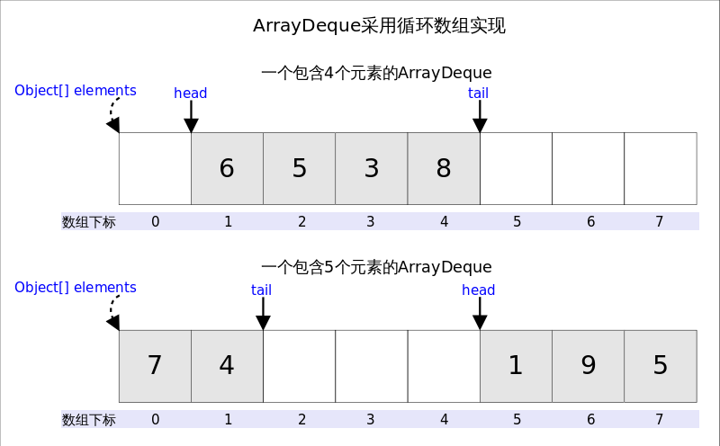

## Queue接口

`Queue` 是 Java 集合框架中的一个接口，位于 `java.util` 包下，用来表示 **单向队列数据结构**。队列通常遵循 **FIFO**（First In First Out，先进先出）的原则，即最先插入的元素最先被移除。

### 特点

- **FIFO 顺序**：队列通常按照先进先出的顺序处理元素。
- **不允许插入 `null` 值**：避免产生歧义

### 常见实现类

- `LinkedList`：实现了 `Queue` 接口，适用于一般队列操作。
- `PriorityQueue`：基于优先级的队列，元素按照优先级排序。
- `ArrayDeque`：高效的双端队列实现，也可以用作普通队列。

### 常见方法

#### 添加元素

- `boolean add(E e)`：将指定的元素插入队列。如果队列已满，会抛出 `IllegalStateException` 异常。
- `boolean offer(E e)`：将指定的元素插入队列。如果队列已满，返回 `false`。推荐使用此方法以避免异常。

#### 移除元素

- `E remove()`：移除并返回队列头部的元素。如果队列为空，抛出 `NoSuchElementException` 异常。
- `E poll()`：移除并返回队列头部的元素。如果队列为空，返回 `null`

#### 获取队头元素

- `E element()`：返回队列头部的元素，但不移除。如果队列为空，抛出 `NoSuchElementException` 异常。
- `E peek()`：返回队列头部的元素，但不移除。如果队列为空，返回 `null`。
- `boolean contains(Object o)`：检查队列中是否包含指定的元素。（继承自 `Collection` 接口）

## Deque接口

`Deque`（双端队列，Double-Ended Queue）是 Java 集合框架中的一个接口，位于 `java.util` 包下。它扩展了 `Queue` 接口，允许在 **队列的两端插入和移除元素**，既支持 **FIFO（先进先出）**，也支持 **LIFO（后进先出）** 操作。

### 特点

- **双端操作**：支持从头部或尾部插入、删除、查看元素。
- **灵活性**：可以用作 **队列** 或 **栈**。
- **不允许 `null` 元素**：为了避免歧义，`Deque` 不允许存储 `null`。

### 常见实现类

- `ArrayDeque`：基于数组实现，性能高效。
- `LinkedList`：基于链表实现，支持动态扩展。

### 常见方法

#### 队列操作

**添加元素**

- `void addFirst(E e)`：将指定元素插入到双端队列的头部。如果操作失败，抛出异常。
- `boolean offerFirst(E e)`：将指定元素插入到双端队列的头部。如果操作失败，返回 `false`
- `void addLast(E e)`：将指定元素插入到双端队列的尾部。如果操作失败，抛出异常
- `boolean offerLast(E e)`：将指定元素插入到双端队列的尾部。如果操作失败，返回 `false`

**删除元素**

- `E removeFirst()`：移除并返回头部的元素。如果双端队列为空，抛出异常。
- `E pollFirst()`：移除并返回头部的元素。如果双端队列为空，返回 `null`
- `E removeLast()`：移除并返回尾部的元素。如果双端队列为空，抛出异常
- `E pollLast()`：移除并返回尾部的元素。如果双端队列为空，返回 `null`

**获取元素**

- `E getFirst()`：返回头部的元素，但不移除。如果双端队列为空，抛出异常。
- `E peekFirst()`：返回头部的元素，但不移除。如果双端队列为空，返回 `null`
- `E getLast()`：返回尾部的元素，但不移除。如果双端队列为空，抛出异常
- `E peekLast()`：返回尾部的元素，但不移除。如果双端队列为空，返回 `null`

#### 栈操作

- `void push(E e)`：将元素压入到双端队列的头部，等价于入栈。
- `E pop()`：移除并返回双端队列头部的元素，等价于出栈
- `E peek()`：返回栈顶的元素

## ArrayDeque类

### 特点

**高效性**：

- 不像 `LinkedList`，`ArrayDeque` 不需要维护节点指针，因此在时间和空间上更高效。
- 插入和删除操作在队列的头部和尾部都具有 **O(1)** 的性能（在动态扩容时性能可能下降）。

**双端操作**：

- 允许在 **头部** 和 **尾部** 插入、删除元素。
- 支持队列（FIFO）和栈（LIFO）操作。

**动态扩容**：

- 底层通过动态数组实现，当存储空间不足时，会自动扩容为原来的两倍。

**不支持 `null` 元素**：

- 为了避免混淆（例如，返回值为 `null` 时无法判断是队列为空还是插入了 `null`），`ArrayDeque` 不允许存储 `null`。

**非线程安全**：

- `ArrayDeque` 没有内置的同步机制，若在多线程环境下使用，需要手动同步。

### 底层实现

`ArrayDeque`底层通过数组实现，为了满足可以同时在数组两端插入或删除元素的需求，该数组还必须是循环的，即**循环数组**，也就是说数组的任何一点都可能被看作起点或者终点。



**`head`指向首端第一个有效元素，**

**`tail`指向尾端第一个可以插入元素的空位**

#### `addFirst`方法

`addFirst(E e)`的作用是在*Deque*的首端插入元素，也就是在`head`的前面插入元素，在空间足够且下标没有越界的情况下，只需要将`elements[--head] = e`即可。

```java
//addFirst(E e)
public void addFirst(E e) {
    if (e == null)//不允许放入null
        throw new NullPointerException();
    elements[head = (head - 1) & (elements.length - 1)] = e;//2.下标是否越界
    if (head == tail)//1.空间是否够用
        doubleCapacity();//扩容
}
```

#### `addLast`方法

`addLast(E e)`的作用是在*Deque*的尾端插入元素，也就是在`tail`的位置插入元素，由于`tail`总是指向下一个可以插入的空位，因此只需要`elements[tail] = e;`即可

```java
public void addLast(E e) {
    if (e == null)//不允许放入null
        throw new NullPointerException();
    elements[tail] = e;//赋值
    if ( (tail = (tail + 1) & (elements.length - 1)) == head)//下标越界处理
        doubleCapacity();//扩容
}
```

#### `pollFirst`方法

`pollFirst()`的作用是删除并返回*Deque*首端元素，也即是`head`位置处的元素。如果容器不空，只需要直接返回`elements[head]`即可，当然还需要处理下标的问题。由于`ArrayDeque`中不允许放入`null`，当`elements[head] == null`时，意味着容器为空。

```java
public E pollFirst() {
    E result = elements[head];
    if (result == null)//null值意味着deque为空
        return null;
    elements[h] = null;//let GC work
    head = (head + 1) & (elements.length - 1);//下标越界处理
    return result;
}
```

#### `pollLast`方法

`pollLast()`的作用是删除并返回*Deque*尾端元素，也即是`tail`位置前面的那个元素

```java
public E pollLast() {
    int t = (tail - 1) & (elements.length - 1);//tail的上一个位置是最后一个元素
    E result = elements[t];
    if (result == null)//null值意味着deque为空
        return null;
    elements[t] = null;//let GC work
    tail = t;
    return result;
}
```

## PriorityQueue类

`PriorityQueue` 是 Java 集合框架中的一个队列实现类，位于 `java.util` 包下，用于实现基于 **优先级堆排序** 的队列。它按照元素的自然顺序（`Comparable`）或通过自定义比较器（`Comparator`）定义的顺序对队列进行排序，每次从队列中获取或移除的都是 **优先级最高的元素**。

### 特点

- **底层实现**：
  - `PriorityQueue` 底层基于 **小顶堆** 实现（默认为自然顺序），用一个动态调整大小的数组存储堆结构。
- **排序机制**：
  - 默认按照元素的自然顺序（需要实现 `Comparable` 接口）。
  - 可以通过构造器传入自定义的 `Comparator` 定义排序规则。
- **非线程安全**：
  - 适用于单线程环境，多线程环境下需要使用外部同步机制或使用线程安全的队列（如 `PriorityBlockingQueue`）。
- **允许 `null` 元素**：
  - 不允许插入 `null` 元素。
- **元素的去重**：
  - 不提供去重功能，允许重复元素。
- **动态扩容**：
  - 底层数组的容量会根据需求动态调整。

### 堆

堆是一种完全二叉树，堆的特点是根节点的值最小（小顶堆）或最大（大顶堆），并且任意非根节点i的值都不大于（或不小于）其父节点的值。

在堆中，每个节点的下标和其在数组中的下标是一一对应的，假设节点下标为i，则其父节点下标为(i-1)/2，其左子节点下标为2i+1，其右子节点下标为2i+2。

小顶堆

```
      1
     / \
    2   3
   / \ / \
  4  5 6  7
```

大顶堆

```
            8
          /   \
         7     5
        / \   / \
       6   4 2   1
```

### 示例

```java
import java.util.PriorityQueue;

class Task implements Comparable<Task> {
    private String name;
    private int priority;

    public Task(String name, int priority) {
        this.name = name;
        this.priority = priority;
    }

    public String getName() {
        return name;
    }

    @Override
    public int compareTo(Task other) {
        // 按优先级升序排序
        return Integer.compare(this.priority, other.priority);
    }

    @Override
    public String toString() {
        return "Task{name='" + name + "', priority=" + priority + '}';
    }
}

public class CustomObjectPriorityQueueExample {
    public static void main(String[] args) {
        PriorityQueue<Task> pq = new PriorityQueue<>();

        pq.add(new Task("Task1", 5));
        pq.add(new Task("Task2", 1));
        pq.add(new Task("Task3", 3));

        // 按优先级移除任务
        while (!pq.isEmpty()) {
            System.out.println(pq.poll());
        }
        // 输出顺序：Task2, Task3, Task1
    }
}
```

