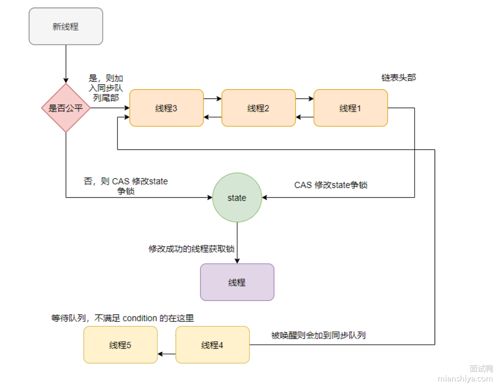

## ReentrantLock类

**`ReentrantLock`** 是 Java 并发包（java.util.concurrent.locks） 提供的一个可重入锁，比 **`synchronized`** 更灵活，支持公平锁、非公平锁、可中断锁、超时获取锁等特性。

## ReentrantLock类的常用方法

### 构造方法

- **`public ReentrantLock()`** ：// 创建一个非公平锁（默认）
- **`public ReentrantLock(boolean fair)`** ：// 创建一个公平锁或非公平锁

### 获取锁

- **`public void lock()`**  ：阻塞式地获取锁（如果锁被占用，会一直等待）。
- **`public boolean tryLock()`** ：尝试获取锁（不会阻塞，获取失败返回 **`false`**）。
- **`public boolean tryLock(long timeout, TimeUnit unit) throws InterruptedException`** ：在指定时间内尝试获取锁，超时返回 **`false`**。

使用 **`ReentrantLock`** 时，锁必须在 **`try`** 代码块开始之前获取，并且加锁之前不能有异常抛出，否则在 **`finally`** 块中就无法释放锁（**`ReentrantLock`** 的锁必须在 **`finally`** 中手动释放）。

### 判断锁的归属

- **`public boolean isLocked()`** ：判断锁是否被任何线程持有。
- **`public boolean isHeldByCurrentThread()`** ：判断锁是否被当前线程持有。

### 释放锁

- **`public void unlock()`** ：释放锁

## ReentrantLock 的实现原理

**`ReentrantLock`** 是基于 **`AQS`** 实现的可重入锁，内部实现依靠一个 **`state`** 变量和两个队列：**同步队列** 和 **等待队列**。

- 等待队列：条件 **`condition`** 不满足时候则入等待队列等待，是个单向链表。
- 同步队列：等待争抢锁的线程

线程利用 **`CAS`** 修改 **`state`** 来争抢锁。争抢不到则入同步队列等待，同步队列是一个双向链表。

是否是公平锁的区别在于：线程获取锁时是加入到同步队列尾部还是直接利用 CAS 争抢锁。



### 非公平锁的实现

#### 获取非公平锁

```java
final boolean nonfairTryAcquire(int acquires) {
    final Thread current = Thread.currentThread();
    int c = getState();
    //1. 如果该锁未被任何线程占有，该锁能被当前线程获取
    if (c == 0) {
        if (compareAndSetState(0, acquires)) {
            setExclusiveOwnerThread(current);
            return true;
        }
    }
    //2. 若被占有，检查占有线程是否是当前线程
    else if (current == getExclusiveOwnerThread()) {
	//3. 再次获取，计数加一
        int nextc = c + acquires;
        if (nextc < 0) // overflow
            throw new Error("Maximum lock count exceeded");
        setState(nextc);
        return true;
    }
    return false;
}
```

- 如果该锁未被任何线程占有，该锁能被当前线程获取
- 如果该锁已经被线程占有了，会继续检查占有线程是否为当前线程
  - 如果是的话，同步状态加 1 返回 true，表示可以再次获取成功。每次重新获取都会对同步状态进行加一的操作

#### 释放非公平锁

```java
protected final boolean tryRelease(int releases) {
	//1. 同步状态减1
    int c = getState() - releases;
   if (Thread.currentThread() != getExclusiveOwnerThread())
        throw new IllegalMonitorStateException();
    boolean free = false;
    if (c == 0) {
		//2. 只有当同步状态为0时，锁成功被释放，返回true
        free = true;
        setExclusiveOwnerThread(null);
    }
	// 3. 锁未被完全释放，返回false
    setState(c);
    return free;
}
```

由于锁会被获取 n 次，那么只有锁在被释放同样的 n 次之后，该锁才算是完全释放成功。

#### 总体逻辑

- **`CAS` 方式尝试将 `state` 从 `0` 变为 `1`**，如果成功，锁被当前线程获取。
- **如果失败（锁已被占用）**，则进入 AQS **同步队列**，等待唤醒。

### 公平锁的实现

#### 获取公平锁

```java
protected final boolean tryAcquire(int acquires) {
    final Thread current = Thread.currentThread();
    int c = getState();
    if (c == 0) {
        if (!hasQueuedPredecessors() &&
            compareAndSetState(0, acquires)) {
            setExclusiveOwnerThread(current);
            return true;
        }
    }
    else if (current == getExclusiveOwnerThread()) {
        int nextc = c + acquires;
        if (nextc < 0)
            throw new Error("Maximum lock count exceeded");
        setState(nextc);
        return true;
    }
    return false;
}
```

增加了 **`hasQueuedPredecessors`** 的逻辑判断，用来判断当前节点在同步队列中是否有前驱节点的

如果有前驱节点，说明有线程比当前线程更早的请求资源，根据公平性，当前线程请求资源失败。

如果当前节点没有前驱节点，才有做后面逻辑判断的必要性。

#### 总体逻辑

- 如果该锁未被任何线程占有，该锁能被当前线程获取
- 再检查 **`hasQueuedPredecessors()`** ，**判断当前线程前面是否有排队的线程**
  - 如果队列为空，才允许当前线程尝试获取锁（**严格遵循先来先得**）。
  - 如果队列中已有等待的线程，即使 **`state == 0`** 也不能直接获取锁。
- 如果该锁已经被线程占有了，会继续检查占有线程是否为当前线程
  - 如果是的话，同步状态加 1 返回 true，表示可以再次获取成功。每次重新获取都会对同步状态进行加一的操作

### 底层实现

**`ReentrantLock`** 是基于 **`AQS`** 实现的可重入锁，内部实现依靠一个 **`state`** 变量和两个队列：**同步队列** 和 **等待队列**。

- 内部通过一个计数器 **`state`** 来跟踪锁的状态和持有次数。
- 当线程调用 **`lock()`** 方法获取锁时，**`ReentrantLock`** 会检查 **`state`** 的值如果为 0
  - 通过 CAS 修改为 1，表示成功加锁。
  - 否则根据当前线程的公平性策略，加入到等待队列中。
- 线程首次获取锁时，**`state`** 值设为 1；如果同一个线程再次获取锁时，**`state`** 加 1；每释放一次锁，**`state`** 减 1。
- 如果 **`state = 0`** ，则释放锁，并唤醒等待队列中的线程来竞争锁。

## **ReentrantLock** 和 **synchronized** 的区别

- **用法不同**：**`synchronized`** 可用来修饰普通方法、静态方法和代码块，而 **`ReentrantLock`** 只能用在代码块上。
- **获取锁和释放锁方式不同**：**`synchronized`**  会自动加锁和释放锁，当进入 **`synchronized`**  修饰的代码块之后会自动加锁，当离开 **`synchronized`** 的代码段之后会自动释放锁。而 **`ReentrantLock`** 需要手动加锁和释放锁
- **锁类型不同**：**`synchronized`**  属于非公平锁，而 **`ReentrantLock`** 既可以是公平锁也可以是非公平锁。
- **响应中断不同**：**`ReentrantLock`** 可以响应中断，解决死锁的问题，而 **`synchronized`**  不能响应中断。
- **底层实现不同**：**`synchronized`**  是 JVM 层面通过监视器实现的，而 **`ReentrantLock`** 是基于 AQS 实现的。
- **实现多路选择通知** ：**`ReentrantLock`** 可以实现多路选择通知（可以绑定多个 Condition），而 **`synchronized`** 只能通过 wait 和 **`notify/notifyAll`** 方法唤醒一个线程或者唤醒全部线程（单路通知）