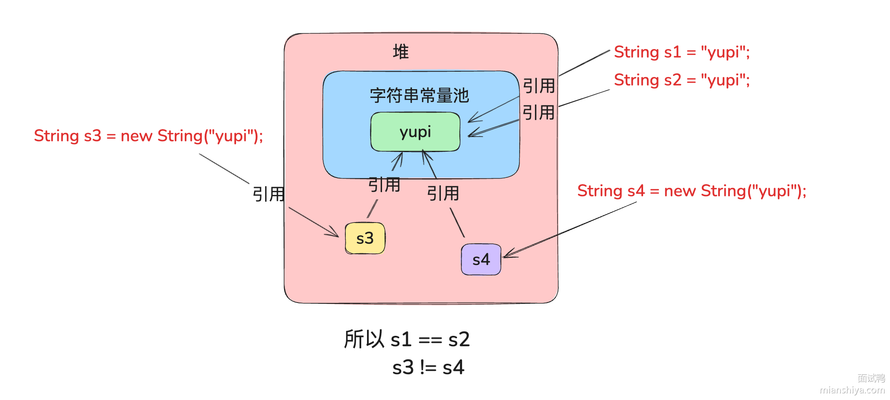
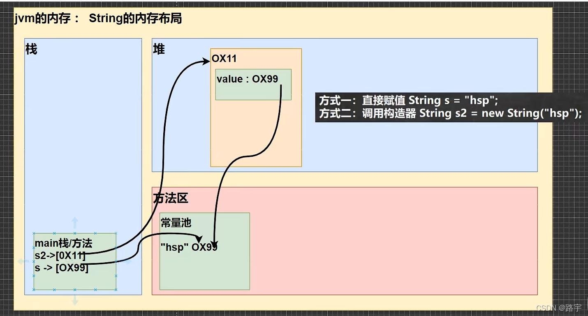

## String类型是不可变的

### 不可变的实现方式

- String类本身被`final`修饰表示该类不允许被继承
- 从JDK1.9开始String类底层已经不再使用`char[]`存储而是使用`byte[]`加上并一个字段 **`coder`** 来指示编码方式，同时这个`byte[]`数组被`private final`修饰，保证初始化后不再被更改

### 不可变性的体现

- 当对字符串重新赋值的时候，需要重新指定内存区域赋值，不能使用原来的内存区域
- `String`类是线程安全的
- 当对现有字符串进行修改的时候，需要重新指定内存区域赋值，不能使用原来的内存区域

## String对象的创建方式

### 通过构造函数创建（new+构造器）

#### 构造函数

- `public String()`：创建空白字符串
- `public String(String input)`：根据输入字符串`input`创建字符串
- `public String(char[] input)`：根据输入`char`数组`input`创建字符串
- `public String(byte[] input)`：根据输入`byte`数组`input`创建字符串

#### 底层实现

使用构造函数创建`String`对象的时候，先在**堆区**中创建一个新的`String`对象（引用常量池中的字面量），同时在字符串常量池中保存其字面量，在栈中保存字符串对象的引用。若常量池中存在相同的字面值则只会在堆区中创建新的`String`对象

[参考补充材料](https://www.mianshiya.com/bank/1787463103423897602/question/1780933294678896641#heading-1)

- 在**堆区**中创建一个新的`String`对象
  - 若常量池中不存在所需的字面量则在常量池中创建新的字面量并将堆区中的对象指向常量池中的字面量
  - 若存在则将堆区中的对象指向常量池中的字面量

### 通过字面量创建

#### 语法格式

```java
String s="abc"
```

#### 底层实现

使用字面量创建`String`对象的时候，会将在常量池中创建字面量。而不会在堆区创建`String`对象。若使用了相同的字面值则直接复用常量池中的字面量

- JVM检查该字符串的字面是否存在于常量池中
  - 若不存在则在常量池中创建新的字面量
  - 若存在则复用常量池中的字面量



### 两者创建方式的比较

- 使用字面量创建`String`对象不会在堆区创建对象
- 使用构造函数创建`String`对象会在堆区创建对象

#### 示例比较

```java
public class StringExercise01 {
    public static void main(String[] args) {
        //字面量创建对象
        String s1 = "abc";
        String s2 = "abc";
 
        //通过new+构造器的方式: 此时s3,s4保存的地址值，是数据在堆空间中开辟以后对应的地址值
        String s3 = new String("abc");
        String s4 = new String("abc");

        //s1 首先看常量池有没有abc
        //s2 首先看常量池有没有abc 有，就将b直接指向abc
        //所以地址值是一样的
        System.out.println(s1==s2);//true
        
        //s1在常量池中，s3和s4在堆区中，指向地址不同
        System.out.println(s1==s3);//false
        System.out.println(s1==s4);//false
        
        //s3和s4在堆区中，但是两个对象指向地址不同
        System.out.println(s3==s4);//false

    }
}
```

## String对象的拼接操作

- 常量与常量的拼接结果在常量池，且常量池中不会存在相同内容的常量
- 只要其中有一个结果是变量，结果就在堆中
- 如果拼接的结果调用`intern()`方法，返回值就在常量池中

```java
	String s1 = "Java";
        String s2 = "Android";
        String ss ="JavaAndroid";

        String s3 = "Java"+"Android";
        String s4 = s1 + "Android";
        String s5 = "Java" + s2;
        String s6 = s1 + s2;

        System.out.println(ss==s3);//true
        System.out.println(ss==s4); //false
        System.out.println(ss==s5);//false
        System.out.println(ss==s6);//false
        System.out.println(s4==s5);//false

        String s7=s4.intern();
        System.out.println(ss==s7);//true
```

## String的常见操作

### 字符串查找

#### 查找字符串中的字符

`charAt(int index)` 方法：用于返回字符串指定位置的字符，返回值为 **char** 类型，参数为 **int** 类型

```java
String str = new String("Hello World");
for (int i = 0; i < str.length(); i++) {
    System.out.println("下标为" + i + "的元素为：" + str.charAt(i));//打印的是每个字母
}
```

#### 查找字符串中下标

- `int indexOf(int ch)`	用于返回当前字符串中参数 ch 指定的字符第一次出现的下标
- `int indexOf(int ch, int fromIndex)`	用于从 fromIndex(包含) 位置开始查找ch指定的字符
- `int indexOf(String str)`	在字符串中检索 str 返回其第一次出现的位置，若找不到返回-1
- `int indexOf(String str, int fromIndex)`	表示从字符串的 fromIndex(包含) 位置开始检索str第一次出现的位置
- `int lastIndexOf(int ch)`	用于返回参数 ch 指定的字符最后一次出现的下标
- `int lastIndexOf(int ch, int fromIndex)`	用于从 fromIndex(包含) 位置开始反向查找 ch 指定字符出现的下标，若找不到返回-1
- `int lastIndexOf(String str)`	返回 str 指定字符串最后一次出现的下标
- `int lastIndexOf(String str, int fromIndex)`	用于从 fromIndex(包含) 位置开始反向搜索的第一次出现的下标

**示例代码**

```java
String str = "Good Good Study, Day Day Up!";
System.out.println(str.indexOf('g')); // -1  代表查找失败
System.out.println(str.indexOf('G')); // 0   该字符第一次出现的索引位置
System.out.println(str.indexOf('G', 0)); // 0
System.out.println(str.indexOf('G', 1)); // 5

// 查找字符串
System.out.println(str.indexOf("day")); // -1
System.out.println(str.indexOf("Day")); // 17   字符串中第一个字符的下标
System.out.println(str.indexOf("Day", 17)); // 17   字符串中第一个字符的下标
System.out.println(str.indexOf("Day", 18)); // 21   字符串中第一个字符的下标

// 字符串内容的反向查找
System.out.println(str.lastIndexOf("Day")); // 21
System.out.println(str.lastIndexOf("Day",  21)); // 21
System.out.println(str.lastIndexOf("Day", 20)); // 17
System.out.println(str.lastIndexOf("Day", 15)); // -1

```

### 字符串截取

- `substring(int beginIndex, int endIndex)` 方法：返回字符串中从下标 beginIndex(包括) 开始到 endIndex(不包括) 结束的子字符串，返回值为 String 类型，参数为 int 类型
- `substring(int beginIndex)` 方法：返回字符串中从下标 beginIndex(包括) 开始到字符串结尾的子字符串，返回值为 String 类型，参数为 int 类型

### 字符串比较

#### 判定是否相等

- `equals(Object anObject)` 方法：比较字符串内容是否相等并返回，返回值为 boolean 类型
- `equalsIgnoreCase(String anotherString)`方法：比较字符串内容是否相等并返回，返回值为 boolean 类型，不考虑大小写， 如：'A’和’a’是相等

#### 比较大小

- `compareTo(String anotherString)` 方法：比较调用对象和参数对象的大小关系，返回值为 int 类型
- `compareToIgnoreCase(String str)` 方法：比较调用对象和参数对象的大小关系，返回值为 int 类型，不考虑大小写，也就是’a’和’A’是相等的关系

**比较方法**

方法调用者的字符依次与方法参数的字符作比较，即用 A 的 ASCII码减去 B 的ASCII码；结果有三种：负整数、正整数、零。负整数即按字典顺序 A 在 B 之前，正整数即 A 在 B 之后，零则为字符串相等。注意：比较出大小就不往后进行，即从第一个字符串开始比较，相同则比较下一个，直到比较出大小或比较到最后一个字符。

#### 判定前缀/后缀

- `startsWith(String prefix)` 方法：判断字符串是否以参数字符串开头，返回值为 boolean 类型，参数为 String 类型
- `startsWith(String prefix, int toffset)` 方法：从指定位置开始是否以参数字符串开头，返回值为 boolean 类型，参数 prefix 为 String 类型，toffset 为 int 类型
- `endsWith(String suffix)` 方法：判断字符串是否以参数字符串结尾，返回值为 boolean 类型，参 数为 String 类型

**示例代码**

```java
String str = "Give you some color to see see";
System.out.println(str.startsWith("G"));//true
System.out.println(str.startsWith(" "));//false
System.out.println(str.startsWith("you", 5));//true
System.out.println(str.endsWith(" "));//false
System.out.println(str.endsWith("see"));//true
```

#### 判定子串

`contains(CharSequence s)` 方法：判断当前字符串是否包含参数指定的内容，返回值为 **boolean** 类型

```java
String str = "Give you some color to see see";
System.out.println(str.contains("some"));//true
System.out.println(str.contains("Some"));//false
```

### 字符串替换

- `replace(char oldChar, char newChar)` 方法：使用参数newChar替换此字符串中出现的所有参数oldChar，返回值为 String 类型，参数为 char 类型
- `replace(CharSequence target, CharSequence replacement)` 方法：用新字符串replacement替换所有的旧字符串target，返回值为 String 类型，参数为 CharSequence 接口

### 字符串拆分

- `split(String regex)`：根据给定的正则表达式分割此字符串，并返回一个String数组。
- `split(String regex,int limit)`：根据给定的正则表达式分割此字符串分割成limit组，并返回一个String数组。

### 字符串与其他类型的相互转换

#### 数字和字符串之间相互转换

- 数字转字符串：`String.valueOf(var var_name)`
- 字符串转数字
  - `Integer.valueOf(String var)`
  - `Integer.parseInt(String var)`

#### 字符串和char数组的相互转换

- 字符串转字符数组：`char[] toCharArray()` 方法：

#### 字符串转byte数组

`byte[] getBytes() `