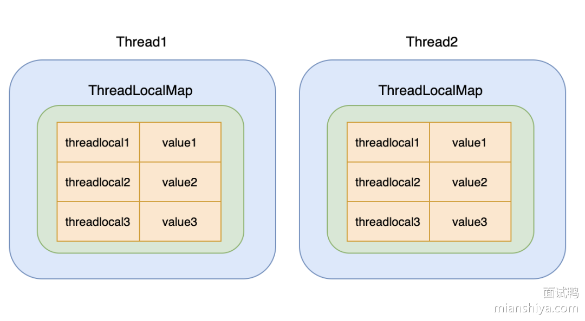

## 为什么需要  **ThreadLocal**

**`ThreadLocal`** 是 Java 中提供的一种用于实现线程局部变量的工具类。它允许每个线程都拥有自己的独立副本，从而实现线程隔离，用于解决多线程中共享对象的线程安全问题。

通常，使用 [synchronzed 关键字](https://tyritic.github.io/p/java%E4%B8%AD%E7%9A%84synchronized%E5%85%B3%E9%94%AE%E5%AD%97/) 或者 [lock](https://tyritic.github.io/p/java%E4%B8%AD%E7%9A%84reentrantlock%E7%B1%BB/) 来控制线程对临界区资源的同步顺序，但这种加锁的方式会让未获取到锁的线程进行阻塞，很显然，这种方式的时间效率不会特别高。

**线程安全问题的核心在于多个线程会对同一个临界区的共享资源进行访问**，那如果每个线程都拥有自己的“共享资源”，各用各的，互不影响，这样就不会出现线程安全的问题

**`ThreadLocal`** 就是线程的“本地变量”，即每个线程都拥有该变量的一个副本，达到人手一份的目的，这样就可以避免共享资源的竞争。

## **ThreadLocal** 的主要特性

- **每个线程都维护一份独立的变量副本**：不同线程之间的值互不影响。
- **变量的生命周期与线程一致**：线程结束后，**`ThreadLocal`** 变量会自动回收，避免内存泄漏。
- **适用于线程安全的场景**，尤其是在无锁并发编程中使用，如 **数据库连接、用户 Session、事务管理** 等。

## **ThreadLocal** 的主要方法

- `set(T value)`  **设置当前线程的变量值** 

- `get()`  **获取当前线程的变量值** 
- `remove()`  **删除当前线程的变量值，避免内存泄漏** 
- `withInitial(Supplier<T> supplier)`  **设置初始值**

## ThreadLocal 的实现原理

**`ThreadLocal`** 提供了一种线程内独享的变量机制，使每个线程都能有自己独立的变量副本。每个线程内部维护一个 **`ThreadLocalMap`**，这个 **`ThreadLocalMap`** 用于存储线程独立的变量副本。**`ThreadLocalMap`** 以 **`ThreadLocal`** 实例作为键，以线程独立的变量副本作为值。不同线程通过 **`ThreadLocal`** 获取各自的变量副本，而不会影响其他线程的数据。

**`ThreadLocal` 可以理解为 `ThreadLocalMap`的封装，传递了变量值。** 

**每个`Thread`中都具备一个`ThreadLocalMap`，而 `ThreadLocalMap` 可以存储以`ThreadLocal`为 key ，Object 对象为 value 的键值对。**




**`ThreadLocalMap`**  的引用情况

- **`key`** ：**`ThreadLocal`** 对 **`key`** 是弱引用
- **`value`**  ：**`ThreadLocalMap.Entry`**  对 **`value`** 强引用

**`ThreadLocal`** 对 **`key`** 的引用为弱引用的原因

- **防止内存泄漏** ：若 **`ThreadLocal`** 实例被不再需要的线程（尤其是在线程池中）持有为强引用，那么当该线程结束时，相关的 **`ThreadLocal`** 实例及其对应的数据可能无法被回收，导致内存持续占用。



## **ThreadLocal** 的使用场景

- 用于保存用户登录信息，这样在同一个线程中的任何地方都可以获取到登录信息。
- 用于保存数据库连接、Session 对象等，这样在同一个线程中的任何地方都可以获取到数据库连接、Session 对象等。
- 用于保存事务上下文，这样在同一个线程中的任何地方都可以获取到事务上下文。
- 用于保存线程中的变量，这样在同一个线程中的任何地方都可以获取到线程中的变量。

```java
public class UserAuthenticationService {

    // 创建一个ThreadLocal实例，用于保存用户登录信息
    private static ThreadLocal<User> currentUser = ThreadLocal.withInitial(() -> null);

    public static void main(String[] args) {
        // 模拟用户登录
        loginUser(new User("Alice", "password123"));
        System.out.println("User logged in: " + getCurrentUser().getUsername());

        // 模拟另一个线程处理另一个用户
        Runnable task = () -> {
            loginUser(new User("Bob", "password456"));
            System.out.println("User logged in: " + getCurrentUser().getUsername());
        };

        Thread thread = new Thread(task);
        thread.start();
    }

    // 模拟用户登录方法
    public static void loginUser(User user) {
        // 这里通常会有一些身份验证逻辑
        currentUser.set(user);
    }

    // 获取当前线程关联的用户信息
    public static User getCurrentUser() {
        return currentUser.get();
    }

    // 用户类
    public static class User {
        private final String username;
        private final String password;

        public User(String username, String password) {
            this.username = username;
            this.password = password;
        }

        public String getUsername() {
            return username;
        }

        // 其他getter和setter...
    }
}
```


## **ThreadLocal** 的缺点

### 内存泄漏问题

当 **`ThreadLocal`** 实例失去强引用后，由于 **`ThreadLocalMap`** 中的 **`key`** 是弱引用会被GC，而因为 **`Entry`** 对象强引用了其对应的 **`value`** 导致 **`value`** 仍然存在于 **`ThreadLocalMap`** 中。如果线程持续存活（例如线程池中的线程），**`ThreadLocalMap`** 也会一直存在，导致 **`key`** 为 `null` 的 entry 无法被垃圾回收，即会造成内存泄漏。

#### 底层原因

- **`key`** 是弱引用：**`ThreadLocalMap`** 中的 **`key`** 是 **`ThreadLocal`** 的弱引用 。 这意味着，如果 **`ThreadLocal`** 实例不再被任何强引用指向，垃圾回收器会在下次 GC 时回收该实例，导致 **`ThreadLocalMap`** 中对应的 **key** 变为 **`null`**
- **`value`** 是强引用： **`ThreadLocalMap`** 中的 **`value`** 是强引用。 即使 **`key`** 被回收（变为 **`null`**），**`value`** 仍然存在于 **`ThreadLocalMap`** 中，被强引用，不会被回收。

#### 内存泄漏的条件

- **`ThreadLocal`** 实例不再被强引用，导致 **`ThreadLocalMap`** 中对应的 **key** 变为 **`null`**
- 线程持续存活，导致 **`ThreadLocalMap`** 长期存在。

#### 解决方法

- 显式调用 **`remove()`** 方法

### 解决哈希冲突的策略可以优化

**`HashMap`** 是通过链表(红黑树)法来解决冲突，而 **`ThreadLocalMap`** 是通过开放寻址法来解决冲突。在哈希冲突多了，需要遍历的次数就多了

## 使用建议

- **避免内存泄漏**：
  - **`ThreadLocal`** 中的 **`key`** 是弱引用，但 **`value`** 是强引用，因此需要在适当的时机调用 **`remove()`** 方法来清除 **`ThreadLocal`** 的值，避免内存泄漏。尤其是在使用线程池时，线程对象会被重用，若不手动清理，容易导致内存泄漏。
- **使用静态变量存放 ThreadLocal**：
  - 将 **`ThreadLocal`** 作为类的静态变量保存，这样可以确保同一个线程的局部变量在线程的生命周期内都可以被访问，避免对象频繁创建。
