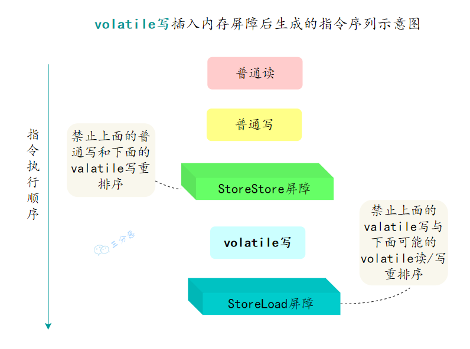
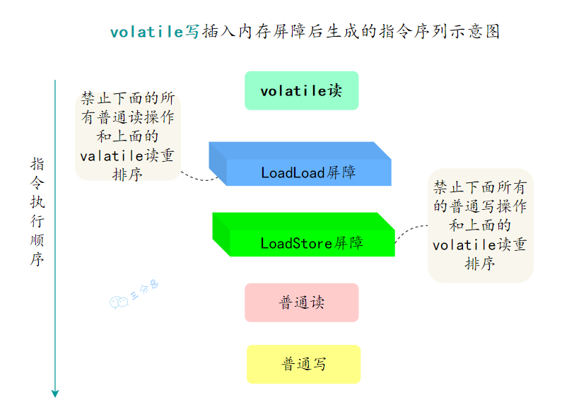

## **`volatile`** 关键字

**`volatile`** 是一个**修饰符**，用来修饰**共享变量**。它的作用是确保对该变量的读写操作直接在主存中进行，而不使用线程的本地缓存。这意味着所有线程访问 **`volatile`** 变量时都会看到该变量的最新值，避免了多线程环境下的内存可见性问题。

## **`volatile`**  关键字的作用

- **可见性（Visibility）**：
  - 当一个线程修改了 **`volatile`** 变量的值，新值会立即被刷新到主存中。
  - 当其他线程读取这个 **`volatile`** 变量时，**必须从主存读取新值**，而不是从本地缓存中读取。

- **禁止指令重排序（Ordering）**：
  - **`volatile`** 还通过内存屏障来禁止特定情况下的指令重排序，从而保证程序的执行顺序符合预期。
    - 对 **`volatile`** 变量的写操作会在其后插入一个写屏障（**写 `volatile` 变量**之前的所有操作，**必须在写操作之前完成** ）
    - 对 **`volatile`** 变量的读操作则会在其后插入一个 读屏障。（**读 `volatile` 变量**之后的所有操作，**必须在读操作之后执行**。）

**`volatile`** 可以保证 **可见性** ，但不保证 **原子性**

## **`volatile`** 保证数据可见性

**`volatile`** 关键字可以保证变量的可见性，如果将变量声明为 **`volatile`** ，这就指示 JVM，这个变量是共享且不稳定的，每次使用它都到主存中进行读取。


## **`volatile`** 保证指令有序性

在程序执行期间，为了提高性能，编译器和处理器会对指令进行重排序。但涉及到 **`volatile`** 变量时，它们必须遵循一定的规则：

- 写 **`volatile`** 变量的操作之前的操作不会被编译器重排序到写操作之后。
- 读 **`volatile`** 变量的操作之后的操作不会被编译器重排序到读操作之前。

这意味着 **`volatile`** 变量的写操作总是发生在任何后续读操作之前。

### 写屏障

**写 `volatile` 变量时，强制刷新到主内存**： 当一个线程对 **`volatile`** 变量进行写操作时，JVM 会插入一个 **写屏障（Store Barrier）**，确保所有修改都会立刻刷新到主内存，而不是保留在线程的本地缓存中。

这意味着，当线程 A 更新一个 **`volatile`** 变量时，其他线程（如线程 B）在读取该 **`volatile`** 变量时，可以看到线程 A 写入的最新值。



写屏障保证

- **`StoreStore`** 屏障： 屏障内的 **`volatile` 写操作** 不会和屏障外的可能的写操作重排序，确保了在 **`volatile` 写操作** 之前的所有写操作都已完成，防止了这些写操作被重排序到 **`volatile`写操作** 之后。
- **`StoreLoad`** 屏障：屏障外 **`volatile` 写操作** 不会和屏障内可能的读操作重排序，确保了在 **`volatile`** 写操作之后的所有读操作都不会被重排序到 **`volatile`写操作** 之前。

### 读屏障

当线程对 **`volatile`** 变量进行读操作时，JMM 会插入一个读屏障指令，这个指令会强制让本地内存中的变量值失效，从而重新从主内存中读取最新的值。



保证

- **`LoadLoad`** 屏障：屏障外的 **`volatile` 读操作** 不会和屏障内可能的读操作重排序，确保 **`volatile` 读操作** 之后的所有读操作必须在 **`volatile` 读操作** 之后执行，防止了这些读操作被重排序到 **`volatile`读操作** 之前。
- **`LoadStore`** 屏障：屏障外 **`volatile` 读操作** 不会和屏障内可能的写操作重排序，确保了 **`volatile`读操作** 之后的所有写操作必须在 **`volatile` 读操作** 之后执行，防止这个写操作被重排序到 **`volatile`读操作** 之前。

### 四种内存屏障的作用

- **StoreStore 屏障**：防止屏障内外写操作的重排序，确保写操作按顺序执行。
- **LoadLoad 屏障**：防止屏障内外读操作的重排序，确保读取操作按顺序执行。
- **StoreLoad 屏障**：确保屏障外写操作先完成，再进行后续的读操作。
- **LoadStore 屏障**：确保屏障外读操作完成后，再执行后续的写操作。

通用作用

- 它会强制将对缓存的修改操作立即写入主存；
- 如果是写操作，它会导致其他 CPU 中对应的缓存行无效。

## **`volatile`** 不保证原子性

虽然 **`volatile`** 保证了可见性和有序性，但它不能保证操作的原子性。原子性意味着一个操作不可分割，不能被中断。典型的例子是 **`i++`** 操作，这实际上分为读取 **`i`** 的值、递增、写回三个步骤。如果多个线程同时执行 **`i++`**，最终结果可能不正确，因为每个线程都可能读取到相同的初始值。

总而言之：**`volatile` 关键字能保证变量的可见性，但不能保证对变量的操作是原子性的**

因此 **`volatile`** 不能保证线程安全

解决方式

- 使用 **`AtomicInteger`** 
- 使用 **`synchronized`** 块

## **`volatile`** 与 **`synchronized`** 的对比

- **性能**
  - **`volatile`** 是一种轻量级的同步机制，开销较小，但它只能用于变量的可见性和禁止重排序，无法实现复杂的同步逻辑
  - **`synchronized`** 则是重量级的同步机制，可以保证代码块的原子性和可见性，但开销较大。
- **使用场景**：
  - **`volatile`** 适用于简单的状态标志、标记等场景
  -  **`synchronized`** 更适合复杂的临界区保护，需要确保多个操作的原子性时。

## **`volatile`** 关键字在单例模式中的应用

使用双重检查锁定实现的单例模式

```java
public class Penguin {
    private static volatile Penguin m_penguin = null; //类的静态变量，用来存储 Penguin 类的唯一实例。

    // 一个成员变量 money
    private int money = 10000;

    // 避免通过 new 初始化对象，构造方法应为 private
    private Penguin() {}

    public void beating() {
        System.out.println("打豆豆" + money);
    }

    // 对类的 Class 对象加锁，确保在多线程环境下，同时只能有一个线程进入同步代码块。
    public static Penguin getInstance() {
        if (m_penguin == null) {
            synchronized (Penguin.class) {
                if (m_penguin == null) {
                    m_penguin = new Penguin();
                }
            }
        }
        return m_penguin;
    }
}
```

**`volatile`** 关键字用于防止 **`m_penguin = new Penguin()`** 这一步被指令重排序。因为实际上，`new Penguin()` 这一行代码分为三个子步骤：

- 步骤 1：为 Penguin 对象分配足够的内存空间
- 步骤 2：调用 Penguin 的构造方法，初始化对象的成员变量
- 步骤 3：将内存地址赋值给 m_penguin 变量，使其指向新创建的对象

如果不使用 **`volatile`** 关键字，JVM 可能会对这三个子步骤进行指令重排

- 为 Penguin 对象分配内存
- 将对象赋值给引用 m_penguin
- 调用构造方法初始化成员变量

这种重排序会导致 m_penguin 引用在对象完全初始化之前就被其他线程访问到。