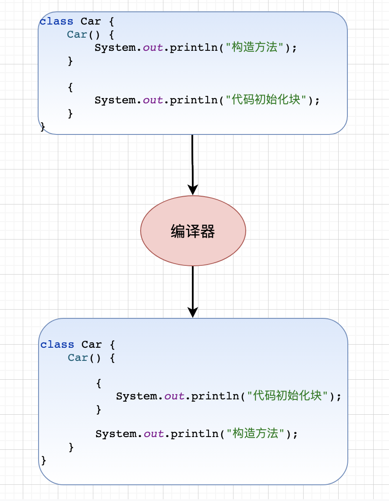

## 局部代码块

### 定义

**局部代码块** 是 Java 中一种由一对大括号 `{}` 包裹的代码块，通常用于限制变量的作用域，或者在某些情况下提供代码逻辑的分隔。

### 特点

- **作用域限制**：局部代码块中的变量只在代码块内有效，代码块外不可访问，因此可以避免变量命名冲突，增强代码的可读性和可维护性。
- **不影响程序的控制流**：局部代码块只是对代码逻辑的封装，不会改变程序的控制流。它通常是为了作用域控制或某些资源的临时管理。

### 示例代码

```java
public class Test {
    public static void main(String[] args) {
        int x = 10;
        
        // 局部代码块
        {
            int y = 20;  // y的作用域仅限于该局部代码块
            System.out.println("x = " + x);  // 可以访问外部的x
            System.out.println("y = " + y);  // 可以访问该代码块内定义的y
        }

        // System.out.println("y = " + y);  // 编译错误，y超出了作用域
    }
}

```

## 构造代码块

### 定义

**构造代码块** 是 Java 类中的一块独立代码，由一对大括号 `{}` 包裹，直接定义在类中，不属于任何方法或构造方法。当创建类的对象时，**构造代码块会在每次调用构造方法前自动执行**。

构造代码块的作用是将一些对象的**公共初始化逻辑**集中起来，避免在每个构造方法中重复编写相同的代码。

### 特点

- 构造代码块的书写位置在类的定义中，用于收集构造函数中的公共逻辑
- 类实例化的时候执行构造代码块，而且构造代码块内的逻辑在构造方法内的逻辑执行之前执行
- 代码初始化块里的执行顺序是从前到后的

### 构造代码块的实现原理

对象在初始化的时候会先调用构造方法，构造方法在执行的时候会把代码初始化块放在构造方法中其他代码之前

## 静态代码块

### 定义

**静态代码块**（Static Block）是 Java 中的一种特殊代码块，它用于在类加载时执行一次初始化操作。静态代码块由 `static` 关键字修饰，通常用于初始化类的静态变量，或者执行一些静态资源的初始化工作。

### 特点

- **只在类加载时执行一次**：
  静态代码块在类第一次被加载到内存时执行，不依赖于类的对象实例化。
- **在构造函数之前执行**：
  类的构造函数在对象创建时执行，而静态代码块在类加载时就执行，因此它会先于任何构造函数或实例方法执行。
- **可以访问类的静态成员**：
  静态代码块可以访问类的静态变量和静态方法，但不能访问实例变量和实例方法，因为此时类的实例尚未创建。
- **执行顺序**：
  如果类中有多个静态代码块，它们会按照定义的顺序依次执行。

### 语法格式

```java
class ClassName {
    static {
        // 静态代码块中的初始化代码
    }
}

```

### 示例代码

```java
public class Example {
    // 静态变量
    public static int staticVar = 1;
    // 实例变量
    public int instanceVar = 2;

    // 静态初始化块
    static {
        System.out.println("执行静态初始化块");
        staticVar = 3;
    }

    // 实例初始化块
    {
        System.out.println("执行实例初始化块");
        instanceVar = 4;
    }

    // 构造方法
    public Example() {
        System.out.println("执行构造方法");
    }

    public static void main(String[] args) {
        System.out.println("执行main方法");

        Example e1 = new Example();
        Example e2 = new Example();

        System.out.println("e1的静态变量：" + e1.staticVar);
        System.out.println("e1的实例变量：" + e1.instanceVar);
        System.out.println("e2的静态变量：" + e2.staticVar);
        System.out.println("e2的实例变量：" + e2.instanceVar);
    }
}

//执行结果
// 执行静态初始化块
// 执行main方法
// 执行实例初始化块
// 执行构造方法
// 执行实例初始化块
// 执行构造方法
// e1的静态变量：3
// e1的实例变量：4
// e2的静态变量：3
// e2的实例变量：4
```

