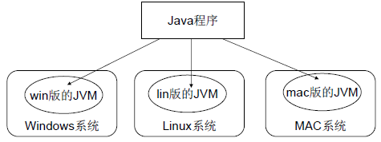

## 跨平台

Java 是跨平台的，通过 JVM 实现“一次编写，到处运行”。

Java 源代码首先编译成字节码（.class 文件），然后由 JVM 将字节码转换成平台特定的机器码。只要在不同平台上安装相应的 JVM，字节码文件就能执行。

Java 程序通过 JVM 这个“中间层”实现跨平台运行，编译生成的字节码文件是相同的，但不同平台的 JVM 会将其翻译成不同的机器码。尽管 Java 程序是跨平台的，但 JVM 本身是平台特定的，因此需要在每个平台上安装对应版本的 JVM 来支持执行。

JVM 是跨平台的关键，它将字节码转换为机器码，因此 Java 程序能在不同平台上运行。即使将 Java 程序打包成可执行文件（.exe），仍然需要 JVM 的支持。



解释执行比编译执行效率差

解释执行：在程序执行时，逐行解释执行源代码，不生成独立的可执行文件。通常由解释器动态解释并执行代码，跨平台性好，但执行速度相对较慢。（类比每次给你英语让你翻译阅读）

编译执行：在程序执行之前，整个源代码会被编译成机器码或者字节码，生成可执行文件。执行时直接运行编译后的代码，速度快，但跨平台性较差。（类比直接给你看中文）

Java同时具有解释性和编译性

- 编译性：Java源代码首先被编译成字节码，JIT 会把编译过的机器码保存起来,以备下次使用。
- 解释性：JVM中一个方法调用计数器通过统计发现一些高频次执行的代码（热点代码），然后将这些字节码交给 JIT 编译器进行编译，生成平台相关的机器码。下次执行时，JVM 会直接使用已编译的机器码，从而避免重新解释，提升性能。否则就是用解释器进行解释执行，然后字节码也是经过解释器进行解释运行的



## 垃圾回收

Java 还提供垃圾自动回收功能，虽说手动管理内存意味着白由、精细化地掌控，但是很容易出错。
在内存较充裕的当下，将内存的管理交给 GC 来做，减轻了程序员编程的负担，提升了开发效率，更加划算!

## 生态

Java 生态圈完善，丰富的第三方类库、企业级框架、各种中间件。

## 面向对象

Java 是一种严格的面向对象编程语言，具有清晰的类、对象、继承、接口等概念，支持封装、继承、多态等 OOP 特性，有助于代码的可维护性和可扩展性。