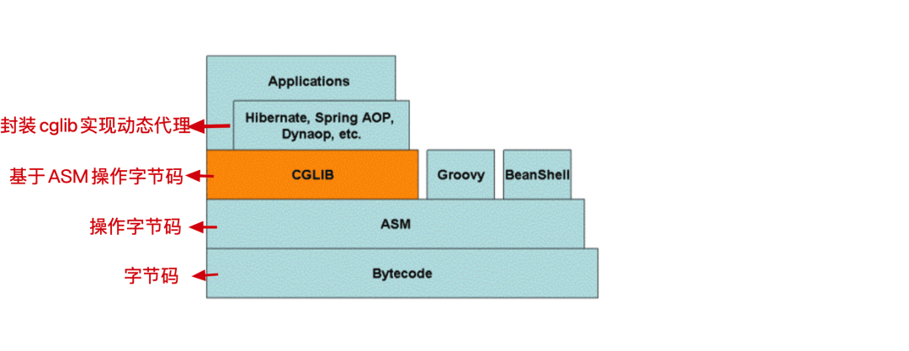

## 动态代理的定义

**动态代理（Dynamic Proxy）** 是 Java 提供的运行时动态创建代理对象的机制，主要用于在不修改原始类的情况下对方法调用进行拦截和增强。

## 动态代理主要用途

- 简化代码：通过代理模式，可以减少重复代码，尤其是在横切关注点（如日志记录、事务管理、权限控制等）方面。
- 增强灵活性：动态代理使得代码更具灵活性和可扩展性，因为代理对象是在运行时生成的，可以动态地改变行为。
- 实现 AOP：动态代理是实现面向切面编程（AOP, Aspect-Oriented Programming）的基础，可以在方法调用前后插入额外的逻辑

## 动态代理的种类

- 基于接口的动态代理：Java自带的JDK动态代理
- 基于继承的动态代理：CGLIB动态代理

## JDK动态代理

### 工作原理

- 基于接口：JDK 动态代理要求目标对象必须实现一个或多个接口。代理对象不是直接继承自目标对象，而是实现了与目标对象相同的接口。
- 基于 **`InvocationHandler`** ：当调用代理对象的任何方法时，调用会被转发到  **`InvocationHandler`** 的  **`invoke`** 方法。可以在这个  **`invoke`** 方法中定义拦截逻辑，比如前置处理、后置处理等。
- 基于  **`Proxy`** ：**`Proxy`** 利用  **`InvocationHandler`** 动态创建一个符合目标类实现的接口实例，生成目标类的代理对象。

### 实现步骤

- **定义接口**： 被代理对象必须实现一个接口。
- **处理器类实现 `InvocationHandler` 接口**： 通过 **`InvocationHandler`** 接口来定义代理类的逻辑，重写`invoke`方法实现对方法的拦截。
  - `Object proxy`：代理对象
  - `Method method`：调用的方法
  - `Object[] args`：传递的实参
- **主类使用 `Proxy.newProxyInstance()` 创建代理对象**： 通过 `Proxy` 类的 `newProxyInstance()` 方法创建代理对象。

### 示例

```java
// 定义接口
public interface UserService {
    void addUser(String name);
    void deleteUser(String name);
}

// 实现接口
public class UserServiceImpl implements UserService {
    @Override
    public void addUser(String name) {
        System.out.println("Adding user: " + name);
    }

    @Override
    public void deleteUser(String name) {
        System.out.println("Deleting user: " + name);
    }
}

// 处理器实现InvocationHandler接口
import java.lang.reflect.InvocationHandler;
import java.lang.reflect.Method;

public class LoggingHandler implements InvocationHandler {
    private final Object target;

    public LoggingHandler(Object target) {
        this.target = target;
    }

    @Override
    public Object invoke(Object proxy, Method method, Object[] args) throws Throwable {
        // 在方法执行前添加日志
        System.out.println("Method " + method.getName() + " is called with arguments: " + args[0]);
        
        // 调用真实对象的方法
        Object result = method.invoke(target, args);
        
        // 在方法执行后添加日志
        System.out.println("Method " + method.getName() + " execution completed.");
        
        return result;
    }
}

// 创建代理对象
import java.lang.reflect.Proxy;

public class ProxyExample {
    public static void main(String[] args) {
        UserService userService = new UserServiceImpl();
        
        // 创建动态代理对象
        UserService proxy = (UserService) Proxy.newProxyInstance(
                userService.getClass().getClassLoader(),
                userService.getClass().getInterfaces(),
                new LoggingHandler(userService)
        );
        
        // 使用代理对象
        proxy.addUser("Alice");
        proxy.deleteUser("Bob");
    }
}
```

## CGLIB动态代理

CGLIB（Code Generation Library）是一个强大的高性能的代码生成库，它可以在运行时动态生成一个目标类的子类。CGLIB代理不需要目标类实现接口，而是通过继承的方式创建代理类。因此，如果目标对象没有实现任何接口，可以使用CGLIB来创建动态代理。



### 工作原理

- **基于继承** ：CGLIB 通过在运行时生成目标对象的子类来创建代理对象，并在子类中覆盖非 final 的方法。因此，它不要求目标对象必须实现接口。
- **基于 ASM** ：ASM 是一个 Java 字节码操作和分析框架，CGLIB 可以通过 ASM 读取目标类的字节码，然后修改字节码生成新的类。它在运行时动态生成一个被代理类的子类，并在子类中覆盖父类的方法，通过方法拦截技术插入增强代码。

### 实现步骤

- 创建一个需要被代理的类。
- 创建一个继承 `MethodInterceptor` 的代理类，在 `intercept` 方法中定义代理逻辑。
- 使用 `Enhancer` 类创建被代理类的子类，并设置回调。

### 示例

```java
//定义一个普通类
public class HelloService {
    public void sayHello(String name) {
        System.out.println("Hello, " + name);
    }
}

//创建一个继承 MethodInterceptor 的代理类 实现 intercept 方法
public class HelloServiceCglib implements MethodInterceptor {
    private Object target;

    public Object getInstance(Object target) {
        this.target = target;
        Enhancer enhancer = new Enhancer();
        enhancer.setSuperclass(this.target.getClass());
        // 设置回调
        enhancer.setCallback(this);
        // 创建代理对象
        return enhancer.create();
    }

    @Override
    public Object intercept(Object obj, Method method, Object[] args, MethodProxy proxy) throws Throwable {
        System.out.println("Before sayHello");
        // 执行目标类的方法
        Object result = proxy.invokeSuper(obj, args);
        System.out.println("After sayHello");
        return result;
    }
}

//实现
public static void main(String[] args) {
    HelloService target = new HelloService();
    HelloServiceCglib cglib = new HelloServiceCglib();
    HelloService proxy = (HelloService) cglib.getInstance(target);
    proxy.sayHello("World");
}
```

