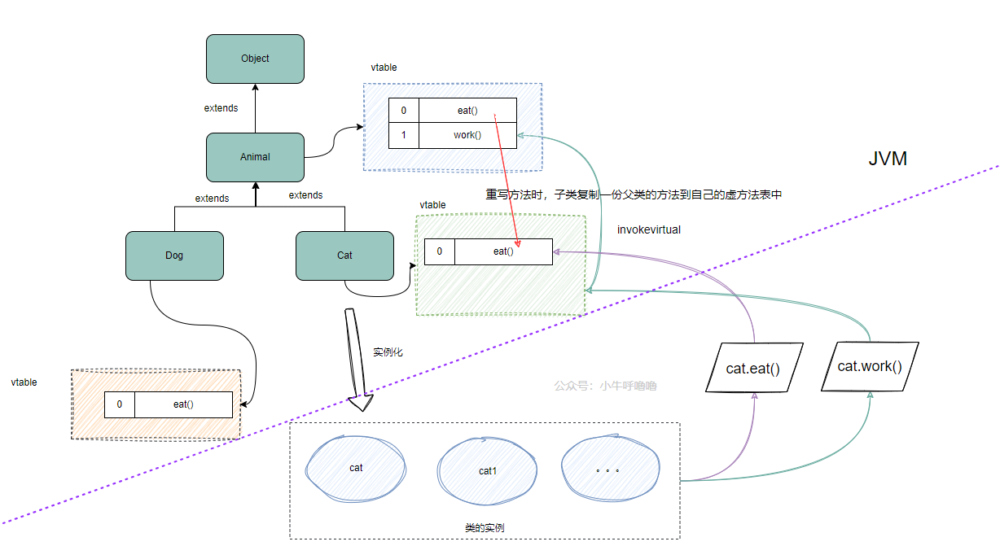

## 什么是多态

多态是指同一个接口或父类引用变量可以指向不同的对象实例，并根据实际指向的对象类型执行相应的方法。

它允许同一方法在不同对象上表现出不同的行为，是面向对象编程（OOP）的核心特性之一

## 多态的前提条件

- 子类继承父类
- 子类重写父类的方法
- 父类引用指向子类的对象

**语法格式**

```java
father_className father=new son_className ()
```


## 多态的运行特点

### 调用成员变量

遵守规则：编译看声明类型（左边），运行看声明类型（左边）

编译代码时，会看左边的父类中有没有该变量，若不存在该变量则编译失败

运行代码时，实际获取的是左边父类中成员变量的值

**示例代码**

```java
class Parent {
    public int num = 10;
}

class Child extends Parent {
    public int num = 20;
}

public class Test {
    public static void main(String[] args) {
        Parent obj = new Child();  // 左边是Parent类型，右边是Child类型
        System.out.println("num = " + obj.num);  // 访问属性
    }
}
// 输出：num = 10
```


### 调用成员方法

遵守规则：编译看声明类型（左边），运行看实际类型（右边）

编译代码时，会看左边的父类中有没有该方法，若不存在该方法则编译失败

运行代码时，实际执行的是右边父子中成员方法

**示例代码**

```java
class Parent {
    public void show() {
        System.out.println("Parent的show方法");
    }
}

class Child extends Parent {
    @Override
    public void show() {
        System.out.println("Child的show方法");
    }
}

public class Test {
    public static void main(String[] args) {
        Parent obj = new Child();  // 左边是Parent类型，右边是Child类型
        obj.show();  // 调用show方法
    }
}

// 输出：Child的show方法
```

## 多态的实现原理

### 动态绑定

多态通过动态绑定实现，Java 使用虚方法表存储方法指针，方法调用时根据对象实际类型从虚方法表查找具体实现。

## 多态的实现方式

编译时多态和运行时多态是面向对象编程中多态性的两种实现方式，它们分别在不同的阶段决定方法的绑定。

- **编译时多态**：通过方法重载实现，在编译时确定方法的调用。
- **运行时多态**：通过方法重写实现，在运行时确定方法的调用。

### 编译时多态（Compile-time Polymorphism）

**编译时多态**，也称为**静态多态**，是在编译阶段确定方法的调用。编译时多态主要通过 **方法重载（Method Overloading）** 实现。

**方法重载**：指在同一个类中定义多个方法，这些方法的名称相同但参数列表（参数的类型或数量）不同。Java 编译器在编译时会根据方法调用时传入的参数类型和数量，决定调用哪一个重载方法。

### 运行时多态（Runtime Polymorphism）

**运行时多态**，也称为**动态多态**，是在运行时确定方法的调用。运行时多态通过 **方法重写（Method Overriding）** 实现。

**方法重写**：子类重写父类的一个或多个方法。通过父类引用调用方法时，实际执行的是子类重写后的方法。这种多态性是在运行时根据对象的实际类型决定的。

## 向上转型和向下转型

### 向上转型（儿子变父亲）

向上转型是使用父类类型的引用指向子类对象，通过子类对象(小范围)实例化父类对象(大范围)

父类引用变量指向子类对象后，只能使用父类已声明的方法，但方法如果被重写会执行子类的方法，如果方法未被重写那么将执行父类的方法。

**语法格式**

```java
father_className father=new son_className ()
// 声明类型：father_className
// 实际类型：son_className
```

### 向下转型（父亲变儿子）

向下转型是将父类引用转回其子类类型，通过父类对象(大范围)实例化子类对象(小范围)，但在执行前需要确认父类引用变量实际引用必须是子类对象才能成功转型以避免 `ClassCastException`

向下转型允许我们通过父类引用访问子类特有的方法和属性

#### 语法格式

```java
son_className son=(son_className) father
```

#### 示例代码

```java
class Animal {
    public void makeSound() {
        System.out.println("Animal makes a sound");
    }
}

class Dog extends Animal {
    public void makeSound() {
        System.out.println("Dog barks");
    }

    public void wagTail() {
        System.out.println("Dog wags its tail");
    }
}

public class Test {
    public static void main(String[] args) {
        Animal animal = new Dog();  // 向上转型，父类引用指向子类对象

        animal.makeSound();  // 调用子类重写的方法，输出：Dog barks

        // 向下转型，将Animal引用强制转换为Dog类型
        if (animal instanceof Dog) {
            Dog dog = (Dog) animal;
            dog.wagTail();  // 输出：Dog wags its tail
        } else {
            System.out.println("animal 不是 Dog 类型");
        }
        
        Animal animal = new Cat();  // Animal引用指向Cat对象

        // 强制将Cat对象转为Dog类型，会引发ClassCastException
        Dog dog = (Dog) animal;  
        dog.makeSound();
    }
}

```


#### instance of关键字

判断对象是否符合指定的类型，结果要么是 true，要么是 false

**语法格式**

```java
(object) instanceof (className)
    
// JDK16的新用法
if (obj instanceof String s) {
    // 如果类型匹配 直接使用 s
}
```

判定为`true`的条件

-  `object` 是 `ClassName` 类型或其子类（或实现类）的对象
-  `ClassName` 是 `object` 实现的接口。

无论右边的类型是什么，**`null`** 对象总是返回 `false`。即：`null instanceof SomeClass // 结果为 false`

