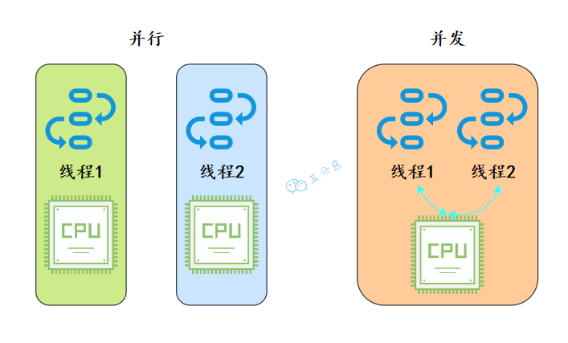
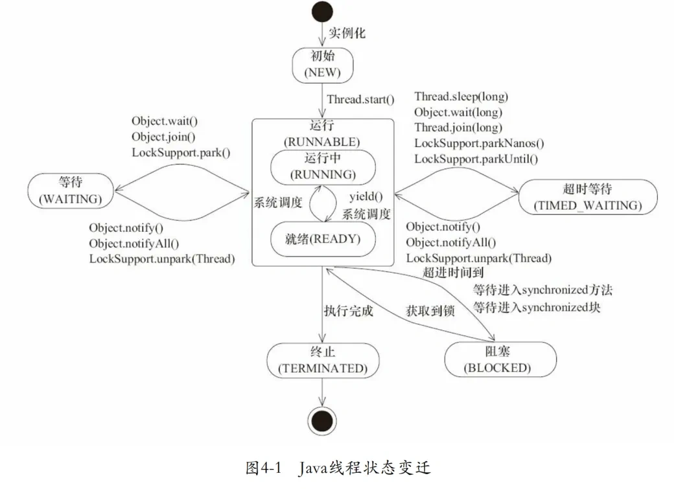

## 并发和并行

- 并行：多核 CPU 上的多任务处理，多个任务在同一时间真正地同时执行。
- 并发：单核 CPU 上的多任务处理，多个任务在同一时间段内交替执行，通过时间片轮转实现交替执行。



## 同步和异步

- **同步**：发出一个调用之后，在没有得到结果之前， 该调用就不可以返回，一直等待。
- **异步**：调用在发出之后，不用等待返回结果，该调用直接返回。

## 进程和线程

- **进程**：是对运行时程序的封装，是系统进行资源调度和分配的基本单位，实现了操作系统的并发。
- **线程**：是进程的子任务，是 CPU 调度和分派的基本单位，实现了进程内部的并发。

### 进程和线程之间的关系

- **线程在进程下进行**
- **进程之间不会相互影响，主线程结束将会导致整个进程结束**
- **不同的进程数据很难共享**
- **同进程下的不同线程之间数据很容易共享**
- **进程使用内存地址可以限定使用量**

### Java中的线程和操作系统的线程的关系

在 JDK 1.2 及以后，Java 线程改为基于原生线程（Native Threads）实现，也就是说 JVM 直接使用操作系统原生的内核级线程（内核线程）来实现 Java 线程，由操作系统内核进行线程的调度和管理。

所以本质上 java 程序创建的线程，就是和操作系统线程是一样的，是 1 对 1 的线程模型。

## 线程的上下文切换

并发其实是一个 CPU 来应付多个线程。CPU 资源的分配采用了时间片轮转也就是给每个线程分配一个时间片，线程在时间片内占用 CPU 执行任务。当线程使用完时间片后，就会处于就绪状态并让出 CPU 让其他线程占用。

线程在执行过程中会有**自己的运行条件和状态**（也称**上下文**）。线程切换意味着需要保存当前线程的上下文，留待线程下次占用 CPU 的时候恢复现场。并加载下一个将要占用 CPU 的线程上下文。

同时线程可以被**多核调度**。操作系统的调度器负责将线程分配给可用的 CPU 核心，从而实现并行处理。多核处理器提供了并行执行多个线程的能力。

## 线程安全

### 线程安全的定义

**线程安全**是指多个线程访问某一共享资源时，能够保证一致性和正确性，即无论线程如何交替执行，程序都能够产生预期的结果，且不会出现数据竞争或内存冲突

- **原子性**：提供互斥访问，同一时刻只能有一个线程对数据进行操作.一个操作或一系列操作要么全部执行成功，要么全部不执行，期间不会被其他线程干扰。在Java中使用了atomic包（这个包提供了一些支持原子操作的类，这些类可以在多线程环境下保证操作的原子性）和 **`synchronized`** 关键字来确保原子性
  - **原子类与锁**：Java 提供了 `java.util.concurrent.atomic` 包中的原子类，如 **`AtomicInteger`** ，  **`AtomicLong`** ，来保证基本类型的操作具有原子性。此外，**`synchronized`** 关键字和 **`Lock`** 接口也可以用来确保操作的原子性。
  - **CAS（Compare-And-Swap）**：Java 的原子类底层依赖于 **`CAS`** 操作来实现原子性。**`CAS`** 是一种硬件级的指令，它比较内存位置的当前值与给定的旧值，如果相等则将内存位置更新为新值，这一过程是原子的。**`CAS`** 可以避免传统锁机制带来的上下文切换开销。

- **可见性**：一个线程对主内存的修改可以及时地被其他线程看到
  - **volatile**：**`volatile`** 关键字是 Java 中用来保证可见性的轻量级同步机制。当一个变量被声明为 **`volatile`** 时，所有对该变量的读写操作都会直接从主内存中进行，从而确保变量对所有线程的可见性。
  - **synchronized**：**`synchronized`** 关键字不仅可以保证代码块的原子性，还可以保证进入和退出 **`synchronized`** 块的线程能够看到块内变量的最新值。每次线程退出 **`synchronized`** 块时，都会将修改后的变量值刷新到主内存中，进入该块的线程则会从主内存中读取最新的值。
  - **Java Memory Model（JMM）**：JMM 规定了共享变量在不同线程间的可见性和有序性规则。它定义了内存屏障的插入规则，确保在多线程环境下的代码执行顺序和内存可见性。

- **有序性**：一个线程观察其他线程中的指令执行顺序，由于指令重排序，该观察结果一般杂乱无序，在Java中使用了**happens-before**原则来确保有序性。
  - **指令重排序**：为了提高性能，处理器和编译器可能会对指令进行重排序。尽管重排序不会影响单线程中的执行结果，但在多线程环境下可能会导致严重的问题。例如，经典的双重检查锁定（DCL）模式在没有正确同步的情况下，由于指令重排序可能导致对象尚未完全初始化就被另一个线程访问。
  - **happens-before 原则**：JMM 定义了 **`happens-before`** 规则，用于约束操作之间的有序性。如果一个操作 `A` happens-before 操作 `B`，那么 `A` 的结果对于 `B` 是可见的，且 `A` 的执行顺序在 `B` 之前。这为开发者提供了在多线程环境中控制操作顺序的手段。
  - **内存屏障**：`volatile` 变量的读写操作会在指令流中插入内存屏障，阻止特定的指令重排序。对于 **`volatile`** 变量的写操作，会在写操作前插入一个 StoreStore 屏障，防止写操作与之前的写操作重排序；在读操作之后插入一个 LoadLoad 屏障，防止读操作与之后的读操作重排序。

- **活跃性**：
  - **死锁**是指多个线程因为环形等待锁的关系而永远地阻塞下去。
  - **活锁**：线程没有阻塞。当多个线程都在运行并且都在修改各自的状态，而其他线程又依赖这个状态，就导致任何一个线程都无法继续执行，只能重复着自身的动作，于是就发生了活锁。
  - **饥饿**：如果一个线程无其他异常却迟迟不能继续运行。
    - 高优先级的线程一直在运行消耗 CPU，所有的低优先级线程一直处于等待；
    - 一些线程被永久堵塞在一个等待进入同步块的状态，而其他线程总是能在它之前持续地对该同步块进行访问；


### 常见线程安全措施

- **同步锁**：通过 **`synchronized`** 关键字或 **`ReentrantLock`** 实现对共享资源的同步控制。
- **原子操作类**：Java 提供的 **`AtomicInteger`**、**`AtomicReference`** 等类确保多线程环境下的原子性操作。
- **线程安全容器**：如 **`ConcurrentHashMap`**、**`CopyOnWriteArrayList`** 等，避免手动加锁。
- **局部变量**：线程内独立的局部变量天然是线程安全的，因为每个线程都有自己的栈空间（线程隔离）。
- **ThreadLocal**：类似于局部变量，属于线程本地资源，通过线程隔离保证了线程安全。

## 线程的创建方式

### 继承  **`Thread`** 类

创建一个类继承 **`Thread`** 类，并重写 **`run()`** 方法

**`run()`** 方法中定义了线程执行的具体任务。创建该类的实例后，通过调用 **`start()`** 方法启动线程

```java
class MyThread extends Thread {
    @Override
    public void run() {
        // 线程执行的代码
    }
}

public static void main(String[] args) {
    MyThread t = new MyThread();
    t.start();
}
```

优缺点

- 优点: 编写简单，如果需要访问当前线程，无需使用 **`Thread.currentThread ()`** 方法，直接使用 **`this`** ，即可获得当前线程
- 缺点：因为线程类已经继承了Thread类，所以不能再继承其他的父类

### 实现 **`Runnable`** 接口

创建一个类实现 **`Runnable`** 接口，并重写 **`run()`** 方法,使用 **`Thread`** 类的构造函数传入 **`Runnable`** 对象，调用 **`start()`** 方法启动线程

```java
class MyRunnable implements Runnable {
    @Override
    public void run() {
        // 线程执行的代码
    }
}

public static void main(String[] args) {
    Thread t = new Thread(new MyRunnable());
    t.start();
}
```

优缺点

- 优点：线程类只是实现了 **`Runnable`** 接口，还可以继承其他的类。在这种方式下，可以多个线程共享同一个目标对象，所以非常适合多个相同线程来处理同一份资源的情况，从而可以将CPU代码和数据分开，形成清晰的模型，较好地体现了面向对象的思想。

- 缺点：编程稍微复杂，如果需要访问当前线程，必须使用 **`Thread.currentThread()`** 方法。

### 实现 **`Callable`** 接口与 **`FutureTask`**

- 实现 **`Callable`** 接口的 **`call()`** 方法

- 使用 **`FutureTask`** 包装 **`Callable`** 对象
- 再通过 **`Thread`** 包裹 **`FutureTask`** 对象。
- 方法的返回值通过 **`FutureTask`** 的 **`get()`** 方法获取

```java
class MyCallable implements Callable<Integer> {
    @Override
    public Integer call() throws Exception {
        // 线程执行的代码，这里返回一个整型结果
        return 1;
    }
}

public static void main(String[] args) {
    MyCallable task = new MyCallable();
    FutureTask<Integer> futureTask = new FutureTask<>(task);
    Thread t = new Thread(futureTask);
    t.start();
    try {
        Integer result = futureTask.get();  // 获取线程执行结果
        System.out.println("Result: " + result);
    } catch (InterruptedException | ExecutionException e) {
        e.printStackTrace();
    }
}
```

- 缺点：编程稍微复杂，如果需要访问当前线程，必须调用 **`Thread.currentThread()`** 方法。
- 优点：线程只是实现Runnable或实现Callable接口，还可以继承其他类。这种方式下，多个线程可以共享一个target对象，非常适合多线程处理同一份资源的情形。

### 使用线程池（ **`ExecutorService`** ）

通过 `ExecutorService` 提交 `Runnable` 或 `Callable` 任务，不直接创建和管理线程，适合管理大量并发任务。

```java
// 提交Runnable任务
class Task implements Runnable {
    @Override
    public void run() {
        // 线程执行的代码
    }
}

public static void main(String[] args) {
    ExecutorService executor = Executors.newFixedThreadPool(10);  // 创建固定大小的线程池
    for (int i = 0; i < 10; i++) {
        executor.submit(new Task());  // 提交任务到线程池执行
    }
    executor.shutdown();  // 关闭线程池
}

//提交Callable任务
import java.util.concurrent.*;

class Task implements Callable<String> {
    @Override
    public String call() {
        return "Task executed by " + Thread.currentThread().getName();
    }
}

public class CallableExample {
    public static void main(String[] args) {
        ExecutorService executor = Executors.newFixedThreadPool(10);  // 创建固定大小的线程池
        Future<String>[] results = new Future[10];  // 存储任务的返回结果
        
        for (int i = 0; i < 10; i++) {
            results[i] = executor.submit(new Task());  // 提交 Callable 任务
        }
        
        // 获取任务的返回结果
        for (Future<String> result : results) {
            try {
                System.out.println(result.get());  // get() 方法会阻塞直到结果可用
            } catch (InterruptedException | ExecutionException e) {
                e.printStackTrace();
            }
        }

        executor.shutdown();  // 关闭线程池
    }
}
```

优缺点

- 缺点：线程池增加了程序的复杂度，特别是当涉及线程池参数调整和故障排查时。错误的配置可能导致死锁、资源耗尽等问题，这些问题的诊断和修复可能较为复杂。
- 优点：线程池可以重用预先创建的线程，避免了线程创建和销毁的开销，显著提高了程序的性能。对于需要快速响应的并发请求，线程池可以迅速提供线程来处理任务，减少等待时间。并且，线程池能够有效控制运行的线程数量，防止因创建过多线程导致的系统资源耗尽（如内存溢出）。通过合理配置线程池大小，可以最大化CPU利用率和系统吞吐量。



**`Runnable` 和`Callable`**：

- **`Runnable`** 的 **`run()`** 方法不返回结果，不能抛出检查异常
- **`Callable`** 的 **`call()`** 方法可以返回结果，并允许抛出检查异常。使用 **`Callable`** 更适合需要返回结果或处理异常的并发任务。



## **Runnable** 接口 和 **Callable** 接口

### 无返回值的 **Runnable**

```java
public interface Runnable {
    public abstract void run();
}
```

执行完任务之后无法返回任何结果

### 有返回值的 **Callable**

```java
public interface Callable<V> {
    V call() throws Exception;
}
```

`call()` 方法返回的类型是一个 V 类型的泛型

## **Future** 接口和 **FutureTask** 实现类

```java
public interface Future<V> {
    boolean cancel(boolean mayInterruptIfRunning);
    boolean isCancelled();
    boolean isDone();
    V get() throws InterruptedException, ExecutionException;
    V get(long timeout, TimeUnit unit)
        throws InterruptedException, ExecutionException, TimeoutException;
}
```

**`Future`** 位于 `java.util.concurrent` 包下，是一个接口

- **`cancel()`** ：取消任务，如果取消任务成功则返回 **`true`**，如果取消任务失败则返回 **`false`**。
  - 参数 **`mayInterruptIfRunning`** 表示是否允许取消正在执行却没有执行完毕的任务，如果设置 **`true`**，则表示可以取消正在执行过程中的任务。
- **`isCancelled()`** ：表示任务是否被取消成功，如果在任务正常完成前被取消成功，则返回 **`true`**。
- **`isDone()`** ：表示任务是否已经完成，若任务完成，则返回 **`true`**；
- **`get()`**：获取执行结果，这个方法会产生阻塞，会一直等到任务执行完毕才返回；
- **`get(long timeout, TimeUnit unit)`**：获取执行结果，如果在指定时间内，还没获取到结果，就直接返回 **`null`**。

```java
public class FutureTask<V> implements RunnableFuture<V>
```

**`FutureTask`** 是唯一的实现类

构造器

```java
public FutureTask(Callable<V> callable) {
}
public FutureTask(Runnable runnable, V result) {
}
```

示例

```java
// 创建一个固定大小的线程池
ExecutorService executorService = Executors.newFixedThreadPool(3);

// 创建一系列 Callable
Callable<Integer>[] tasks = new Callable[5];
for (int i = 0; i < tasks.length; i++) {
    final int index = i;
    tasks[i] = new Callable<Integer>() {
        @Override
        public Integer call() throws Exception {
            TimeUnit.SECONDS.sleep(index + 1);
            return (index + 1) * 100;
        }
    };
}

// 将 Callable 包装为 FutureTask，并提交到线程池
FutureTask<Integer>[] futureTasks = new FutureTask[tasks.length];
for (int i = 0; i < tasks.length; i++) {
    futureTasks[i] = new FutureTask<>(tasks[i]);
    executorService.submit(futureTasks[i]);
}

// 获取任务结果
for (int i = 0; i < futureTasks.length; i++) {
    System.out.println("Result of task" + (i + 1) + ": " + futureTasks[i].get());
}

// 关闭线程池
executorService.shutdown();
```


## 控制线程的常用方法

### 启动线程

- **`public void start()`**

在 Java 中，启动一个新的线程应该调用其 **`start()`** 方法，而不是直接调用 **`run()`** 方法。

当调用 **`start()`** 方法时，会启动一个新的线程，并让这个新线程调用 **`run()`** 方法。这样，**`run()`** 方法就在新的线程中运行，从而实现多线程并发。

如果直接调用 **`run()`** 方法，那么 **`run()`** 方法就在当前线程中以同步的方式运行，没有新的线程被创建，也就没有实现多线程的效果。

### 线程命名

- **`public void setName(String)`** ：给当前线程取名字name)
- **`public void getName()`**：获取当前线程的名字。线程存在默认名称
  - 子线程是**Thread-索引**
  - 主线程是**main**
- **`public static ThreadcurrentThread()`**：获取当前线程对象，代码在哪个线程中执行

### 线程休眠

- **`public static void sleep(long millis) throws InterruptedException`**：使当前正在执行的线程暂停指定的毫秒数，也就是进入休眠的状态，休眠期间线程不会占用 CPU 时间片。休眠结束后，线程会尝试重新获取 CPU 时间片，进入可运行状态，但是不会让出锁。

### 线程优先执行

- **`public void join() throws InterruptedException`**
- **`public synchronized void join(long millis) throws InterruptedException`**
- **`public synchronized void join(long millis, int nanos) throws InterruptedException`**

等待这个线程执行完才会轮到后续线程得到 cpu 的执行权

### 线程间通信

**`wait()`** 让当前线程释放锁并进入等待状态

- **`public final void wait() throws InterruptedException`**
- **`public final void wait(long millis) throws InterruptedException`**
- **`public final void wait(long millis, int nanos) throws InterruptedException`**

**`notify()`** 唤醒一个等待的线程，具体唤醒哪个等待的线程是随机的，**`notifyAll()`** 唤醒所有等待的线程。

- **`public final void notify()`**
- **`public final void notifyAll()`**

### 中断线程

- **`public void interrupt()`**：设置线程的中断标志为 **`true`** 并立即返回。仅仅是设置标志而不会实际中断
- **`boolean isInterrupted()`**：检测当前线程是否被中断
- **`boolean interrupted()`** ： 检测当前线程是否被中断，与 **`isInterrupted()`** 不同的是，该方法如果发现当前线程被中断，则会清除中断标志。
- **`public void stop()`** ：强制线程停止执行，目前已经处于废弃状态，因为 stop 方法会导致线程立即停止，可能会在不一致的状态下释放锁，破坏对象的一致性，导致难以发现的错误和资源泄漏。

响应中断示例

```java
public void run() {
    try {
        while (!Thread.currentThread().isInterrupted()) {
            // 执行任务
        }
    } catch (InterruptedException e) {
        // 线程被中断时的清理代码
    } finally {
        // 线程结束前的清理代码
    }
}
```

### 让出时间片

**`yield()`** 方法用于暗示当前线程愿意放弃其当前的时间片，允许其他线程执行。它并不会使线程进入阻塞状态，线程依然处于 **RUNNABLE** 状态。但是它只是向线程调度器提出建议，调度器可能会忽略这个建议。具体行为取决于操作系统和JVM)的线程调度策略。（和 **`Thread.sleep(0)`** 功能相同）

- **`public static void yield()`**

### 设置线程优先级

- **`public final int getPriority()`** ：返回此线程的优先级
- **`public final void setPriority(int priority)`**：更改此线程的优先级，规定线程优先级是1~1010的整数，较大的优先级能提高该线程被 CPU 调度的机率

### 守护线程

- **`public void setDaemon()`**

将此线程标记为守护线程。

守护线程：是服务其他的线程，像 Java 中的垃圾回收线程，就是典型的守护线程。

- 当最后一个非守护线程束时， JVM 会正常退出，而不管当前是否存在守护线程（守护线程是否结束并不影响 JVM 退出）

- 如果某线程是守护线程，那如果所有的非守护线程都结束了，这个守护线程也会自动结束。
- 当所有的非守护线程结束时，守护线程会自动关闭，这就免去了还要继续关闭子线程的麻烦。
- 线程默认是非守护线程



**`sleep()`** 和 **`wait()`** 的区别（面试题）

- 锁行为不同
  - 当线程执行 **`sleep()`** 方法时，它不会释放任何锁。也就是说，如果一个线程在持有某个对象的锁时调用了 sleep，它在睡眠期间仍然会持有这个锁。
  - 而当线程执行 **`wait()`** 方法时，它会释放它持有的那个对象的锁，这使得其他线程可以有机会获取该对象的锁。
- 使用条件不同
  - **`sleep()`** 方法可以在任何地方被调用。
  - **`wait()`** 方法必须在同步代码块或同步方法中被调用，这是因为调用 `wait()` 方法的前提是当前线程必须持有对象的锁。否则会抛出 **`IllegalMonitorStateException`** 异常。
- 唤醒方式不同
  - 调用 **`sleep()`** 方法后，线程会进入 **TIMED_WAITING** 状态（定时等待状态），即在指定的时间内暂停执行。当指定的时间结束后，线程会自动恢复到 **RUNNABLE** 状态（就绪状态），等待 CPU 调度再次执行。
  - 调用 **`wait()`** 方法后，线程会进入 **WAITING** 状态（无限期等待状态），直到有其他线程在同一对象上调用 **`notify()`** 或 **`notifyAll()`**，线程才会从 **WAITING** 状态转变为 **RUNNABLE** 状态，准备再次获得 CPU 的执行权。



## 线程的状态



可以使用Thread中的 **`getState()`** 方法获取状态

Java中的线程状态

- **New（初始状态）** ：线程对象创建后，但未调用 **`start()`** 方法。
- **Runnable（可运行状态）** ：调用 start() 方法后，线程进入就绪状态，等待 CPU 调度。
- **Blocked（阻塞状态）** ：线程试图获取一个对象锁而被阻塞。
- **Waiting（等待状态）**：线程进入等待状态，需要被显式唤醒才能继续执行。
- **Timed Waiting（含等待时间的等待状态）** ：线程进入等待状态，但指定了等待时间，超时后会被唤醒。
- **Terminated（终止状态）** ：线程执行完成或因异常退出。

### NEW（初始状态）

处于 **NEW** 状态的线程此时尚未启动。这里的尚未启动指的是还没调用 Thread 实例的 **`start()`** 方法。

```java
// 使用synchronized关键字保证这个方法是线程安全的
public synchronized void start() {
    // threadStatus != 0 表示这个线程已经被启动过或已经结束了
    // 如果试图再次启动这个线程，就会抛出IllegalThreadStateException异常
    if (threadStatus != 0)
        throw new IllegalThreadStateException();

    // 将这个线程添加到当前线程的线程组中
    group.add(this);

    // 声明一个变量，用于记录线程是否启动成功
    boolean started = false;
    try {
        // 使用native方法启动这个线程
        start0();
        // 如果没有抛出异常，那么started被设为true，表示线程启动成功
        started = true;
    } finally {
        // 在finally语句块中，无论try语句块中的代码是否抛出异常，都会执行
        try {
            // 如果线程没有启动成功，就从线程组中移除这个线程
            if (!started) {
                group.threadStartFailed(this);
            }
        } catch (Throwable ignore) {
            // 如果在移除线程的过程中发生了异常，我们选择忽略这个异常
        }
    }
}
```

因此

1. 反复调用同一个线程的  **`start()`** 方法不可行
2. 假如一个线程执行完毕（此时处于 TERMINATED 状态），再次调用这个线程的  **`start()`** 方法不可行

在调用 **`start()`** 之后，**`threadStatus`** 的值会改变（ **`threadStatus !=0`** ），再次调用 **`start()`** 方法会抛出 **`IllegalThreadStateException`** 异常。

### RUNNABLE（正在运行）

表示当前线程正在运行中。当调用线程的 **`start()`** 方法后，线程进入可运行状态。处于 **RUNNABLE** 状态的线程在 Java 虚拟机中运行，也有可能在等待 CPU 分配资源。

```java
/**
 * Thread state for a runnable thread.  A thread in the runnable
 * state is executing in the Java virtual machine but it may
 * be waiting for other resources from the operating system
 * such as processor.
 */
```

Java 线程的**RUNNABLE**状态其实包括了操作系统线程的**ready**和**running**两个状态

现代操作系统架构通常都是用所谓的时间分片方式进行抢占式轮转调度。这个时间分片通常是很小的，一个线程一次最多只能在 CPU 上运行比如 10-20ms 的时间（此时处于 running 状态），也即大概只有 0.01 秒这一量级，时间片用后就要被切换下来放入调度队列的末尾等待再次调度。（也即回到 ready 状态）。线程切换的如此之快，区分这两种状态就没什么意义了。

### BLOCKED（阻塞状态）

线程在试图获取一个锁以进入同步块/方法时，如果锁被其他线程持有，线程将进入阻塞状态，直到它获取到锁。处于 **BLOCKED** 状态的线程正等待**锁**的释放以进入同步区

### WAITING（等待状态）

等待状态。处于等待状态的线程变成 **RUNNABLE** 状态需要其他线程唤醒

调用下面这 3 个方法会使线程进入等待状态：

- **`Object.wait()`**：使当前线程处于等待状态直到另一个线程唤醒它；
- **`Thread.join()`**：等待线程执行完毕，底层调用的是 Object 的 wait 方法；
- **`LockSupport.park()`**：除非获得调用许可，否则禁用当前线程进行线程调度

### TIMED_WAITING（超时等待）

超时等待状态。线程等待一个具体的时间，时间到后会被自动唤醒。

- **`Thread.sleep(long millis)`**：使当前线程睡眠指定时间；
- **`Object.wait(long timeout)`**：线程休眠指定时间，等待期间可以通过`notify()`/`notifyAll()`唤醒；
- **`Thread.join(long millis)`**：等待当前线程最多执行 millis 毫秒，如果 millis 为 0，则会一直执行；
- **`LockSupport.parkNanos(long nanos)`**： 除非获得调用许可，否则禁用当前线程进行线程调度指定时间

### TERMINATE（终止状态）

当线程的 **`run()`** 方法执行完毕后，或者因为一个未捕获的异常终止了执行，线程进入终止状态。一旦线程终止，它的生命周期结束，不能再被重新启动，此时线程已执行完毕

