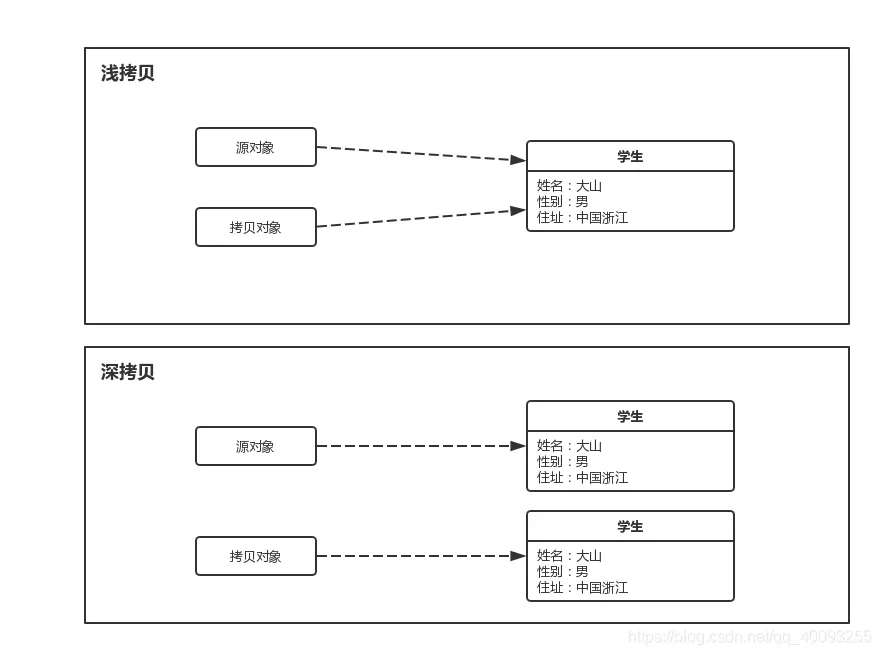

## 接口的定义

**接口 (Interface)** 是 Java 中一种特殊的引用类型，类似于类，但是接口只定义方法的签名，而不包含方法的实现。接口用于定义类应该遵循的行为规范，即一组方法的集合，而具体的实现由实现接口的类来完成。

可以理解为特殊的类，接口的所有字段为`public static final`，不包含构造方法，成员方法中除了**默认方法 (default methods)** 和**静态方法 (static methods)**以外都是抽象方法

## 接口的主要特点

- 接口无法实例化，不存在构造方法
- 接口的实现类要么是抽象类，要么实现接口中全部的抽象方法
- 接口允许多实现（一个实现类同时实现多个接口）
  - 在 Java8 之前接口是无法定义具体方法实现的，所以即使有多个接口必须子类自己实现，所以并不会发生歧义。
  - Java8 之后出了**默认方法（default method）**，该方法具有方法体，为了避免菱形继承的问题，强制规定，如果多个接口内有相同的默认方法，子类必须重写这个方法。
- 接口允许多继承
- 不要在定义接口的时候使用 final 关键字

## 接口的语法实现

### 定义接口

```java
// 接口定义
public interface InterfaceName {
    // 常量（隐式 public static final）
    int CONSTANT_VALUE = 100;

    // 抽象方法（隐式 public abstract）
    void method1();

    // 默认方法（Java 8 引入）
    default void defaultMethod() {
        System.out.println("This is a default method.");
    }

    // 静态方法（Java 8 引入）
    static void staticMethod() {
        System.out.println("This is a static method.");
    }
}

```

### 实现接口

```java
// 实现接口的类
public class MyClass implements InterfaceName {
    // 实现接口中的抽象方法
    @Override
    public void method1() {
        System.out.println("Method1 implemented in MyClass.");
    }
    
    // 实现接口中的默认方法（可选）
    @Override
    public void defaultMethod(){
        // 重写该方法
    }
}

```


## 接口中的变量

- **接口中的变量默认为`public static final`**
- **接口中定义的变量会在编译的时候自动加上 `public static final` 修饰符**

## 接口中的方法

### 抽象方法

抽象方法是接口的核心部分，所有实现接口的类都必须实现这些方法。接口中的方法默认为`public abstract`（没有使用 `private`、`default` 或者 `static` 关键字修饰的方法是隐式抽象的，在编译的时候会自动加上 `public abstract` 修饰符）

#### 注意事项

- **接口的抽象方法不能是 private、protected 或者 final**

### 默认方法

接口中允许定义默认方法，默认方法被`default`修饰，必须具有方法体可供实现类使用或者重写，为实现该接口而不覆盖该方法的类提供默认实现

#### 定义格式

```java
public default 返回值类型 方法名(形参列表){}
```

#### 注意事项

- 默认方法可以被子接口继承
- `default`方法不需要被强制重写
  - 如果子类没有重写接口中的默认方法，那么会直接使用接口中提供的默认实现
  - 若子类重写了默认方法，要去除该方法中的`default`关键字
- `public`可以省略
- 不能通过接口名调用
- 如果子类实现了多个接口且多个接口内有相同的默认方法，子类必须重写这个方法。

### 静态方法

属于接口本身的方法，具有方法体，不依赖具体的实现类就能调用

#### 定义格式

```java
public static 返回值类型 方法名(形参列表){}
```

#### 调用格式

```java
接口名.静态方法名()
```

### 私有方法

Java 9 引入了 **接口私有方法**，允许在接口中定义只能供**默认方法**和**静态方法**调用的私有辅助方法。这进一步增强了接口的灵活性和代码复用能力，同时隐藏了实现细节。

#### 方法类型

**实例私有方法**

- 只能被**默认方法**调用。
- 不能被实现类调用，也不能被接口外部访问。
- 使用 `private` 关键字修饰。

**静态私有方法**

- 只能被**静态方法**调用。
- 不能被默认方法或实现类调用。

## 接口的使用

### 作为变量类型

在 Java 中，接口不仅可以定义方法的签名，还可以作为 **类型的约束**，使得不同的类能够遵循相同的行为约定。

在 Java 中，所有的类、接口、数组和枚举类型都被视为引用类型。接口定义了类应该具备的方法签名，但它本身不能直接创建实例。实际上，接口是用于为类定义一个“行为契约”的类型。接口可以作为变量类型，来指向那些实现了该接口的类的实例。

### 多态性

Java 中的接口支持 **多态性**，这意味着一个接口类型的变量可以指向任何实现该接口的对象，哪怕是不同类的对象。因此，作为接口类型的变量，可以引用任何实现了接口的对象，而无需关心具体是哪一个类。

## 接口和抽象类的区别

参考[博客](https://tyritic.github.io/p/java%E4%B8%AD%E6%8E%A5%E5%8F%A3%E5%92%8C%E6%8A%BD%E8%B1%A1%E7%B1%BB%E7%9A%84%E8%BE%A8%E6%9E%90/)

## 常见接口

### Comparable接口

`Comparable` 接口是 Java 提供的一个用于**定义对象自然排序**的接口。它位于 `java.lang` 包中，常用于让类的对象能够通过 `Collections.sort()` 或 `Arrays.sort()` 方法进行排序。

**接口定义**

```java
public interface Comparable<E> {
	public int compareTo(E o);
}
```

**接口使用**

让实现类实现该接口中的`compareTo`方法，返回值如下

- 返回负值：当前对象小于参数对象 `o`。

  返回零值：当前对象等于参数对象 `o`。

  返回正值：当前对象大于参数对象 `o`。

- **升序**：当当前对象小于参数对象时，`compareTo` 返回**负值**。
- **降序**：当当前对象小于参数对象时，`compareTo` 返回**正值**。

**示例代码**

```java
public class Person implements Comparable<Person> {
    private String name;
    private int age;

    // 构造方法
    public Person(String name, int age) {
        this.name = name;
        this.age = age;
    }

    // 实现 compareTo 方法，按年龄升序排序
    @Override
    public int compareTo(Person other) {
        return this.age - other.age;
    }

    // 重写 toString 方法，方便打印
    @Override
    public String toString() {
        return "Person{name='" + name + "', age=" + age + '}';
    }
}
```

**缺点**：需要在类定义时就要实现

### Comparator接口

`Comparator` 是 Java 提供的一个用于**定义对象自定义排序**的接口，位于 `java.util` 包中。与 `Comparable` 接口不同，`Comparator` 可以让我们在**不修改类本身代码**的情况下，通过外部比较器灵活定义多种排序规则。

`Comparator`接口支持**多排序规则**：可以为同一类对象定义多种不同的排序规则，而不需要修改类本身。

**核心方法**： `compare`

```java
int compare(T o1, T o2);
```

- 返回负值：当前对象`o1`小于参数对象 `o2`。

  返回零值：当前对象`o1`等于参数对象 `o2`。

  返回正值：当前对象`o1`大于参数对象 `o2`。

- **升序**：当当前对象小于参数对象时，`compare` 返回**负值**。
- **降序**：当当前对象小于参数对象时，`compare` 返回**正值**。

使用方法

- 声明一个比较器类实现`Comparator`接口

  ```java
  // 比较器类
  import java.util.Comparator;
  
  public class AgeComparator implements Comparator<Person> {
      @Override
      public int compare(Person p1, Person p2) {
          return p1.getAge() - p2.getAge();
      }
  }
  
  // 测试代码
  import java.util.ArrayList;
  import java.util.Collections;
  import java.util.List;
  
  public class Test {
      public static void main(String[] args) {
          List<Person> people = new ArrayList<>();
          people.add(new Person("Alice", 25));
          people.add(new Person("Bob", 20));
          people.add(new Person("Charlie", 30));
  
          // 使用 AgeComparator 进行排序
          Collections.sort(people, new AgeComparator());
  
          // 输出排序结果
          for (Person p : people) {
              System.out.println(p);
          }
      }
  }
  
  ```

  

- 在`Collections.sort` 或 `Arrays.sort` 方法，通过传入 `Comparator` 对象（匿名内部类）来进行排序

  ```java
  import java.util.*;
  
  public class Test {
      public static void main(String[] args) {
          List<Person> people = new ArrayList<>();
          people.add(new Person("Alice", 25));
          people.add(new Person("Bob", 20));
          people.add(new Person("Charlie", 30));
  
          // 使用匿名内部类按年龄排序
          Collections.sort(people, new Comparator<Person>() {
              @Override
              public int compare(Person p1, Person p2) {
                  return p1.getAge() - p2.getAge();
              }
          });
  
          System.out.println("按年龄排序：" + people);
      }
  }
  
  ```

**其他方法**

- `comparing(Function<T, U> keyExtractor)`	按指定字段升序排序 

  ```java
  import java.util.*;
  
  public class Test {
      public static void main(String[] args) {
          List<Person> people = Arrays.asList(
              new Person("Alice", 25),
              new Person("Bob", 20),
              new Person("Charlie", 30)
          );
  
          // 按年龄升序排序
          people.sort(Comparator.comparing(Person::getAge));
  
          System.out.println("按年龄升序排序：" + people);
      }
  }
  
  class Person {
      private String name;
      private int age;
  
      public Person(String name, int age) {
          this.name = name;
          this.age = age;
      }
  
      public String getName() {
          return name;
      }
  
      public int getAge() {
          return age;
      }
  
      @Override
      public String toString() {
          return "Person{name='" + name + "', age=" + age + '}';
      }
  }
  
  ```

  

- `reversed()`	将当前排序顺序反转 

  ```java
  people.sort(Comparator.comparing(Person::getAge).reversed());
  System.out.println("按年龄降序排序：" + people);
  ```

  

- `thenComparing()`	在已有排序规则基础上追加新的排序规则 

  ```java
  people.sort(Comparator.comparing(Person::getAge).thenComparing(Person::getName));
  System.out.println("按年龄排序后再按姓名排序：" + people);
  ```

  

- `naturalOrder()`	生成按自然顺序排序的 Comparator 

  ```java
  List<String> names = Arrays.asList("Charlie", "Alice", "Bob");
  names.sort(Comparator.naturalOrder());
  System.out.println("按自然顺序排序：" + names);
  ```

  

- `reverseOrder()`	生成按自然顺序的反序排序 Comparator 

  ```java
  names.sort(Comparator.reverseOrder());
  System.out.println("按降序排序：" + names);
  ```

  

- `nullsFirst()`	处理 null 值，null 排在前面 

- `nullsLast()`	处理 null 值，null 排在后面 

### Cloneable接口

`Cloneable` 接口是 Java 中的一个标记接口（Marker Interface），它位于 `java.lang` 包中。实现了 `Cloneable` 接口的类表示该类的对象可以使用 `Object` 类的 `clone()` 方法进行**浅拷贝**。

#### 深拷贝和浅拷贝

**深拷贝**：在复制对象的同时，将对象内部的所有引用类型字段的内容也复制一份，而不是共享引用。换句话说，深拷贝会递归复制对象内部所有引用类型的字段，生成一个全新的对象以及其内部的所有对象。

**浅拷贝**：只复制对象本身和其内部的值类型字段，但不会复制对象内部的引用类型字段。换句话说，浅拷贝只是创建一个新的对象，然后将原对象的字段值复制到新对象中，但如果原对象内部有引用类型的字段，只是将引用复制到新对象中，两个对象指向的是同一个引用对象。



#### 浅拷贝的实现方式

使用 `Object.clone()` 方法是浅拷贝的常见方式。默认情况下，`clone()` 方法只是对对象的字段进行字段拷贝，对于基本类型的字段会复制值，对于引用类型的字段则复制引用。

```java
import java.util.*;

public class Person implements Cloneable {
    private String name;
    private List<String> hobbies;

    public Person(String name, List<String> hobbies) {
        this.name = name;
        this.hobbies = hobbies;
    }

    @Override
    public String toString() {
        return "Person{name='" + name + "', hobbies=" + hobbies + '}';
    }

    @Override
    protected Object clone() throws CloneNotSupportedException {
        return super.clone(); // 浅拷贝
    }

    public static void main(String[] args) {
        try {
            List<String> hobbies = new ArrayList<>(Arrays.asList("Reading", "Traveling"));
            Person p1 = new Person("Alice", hobbies);
            Person p2 = (Person) p1.clone();

            System.out.println("原对象：" + p1);
            System.out.println("克隆对象：" + p2);

            // 修改原对象的 hobbies
            p1.hobbies.add("Swimming");

            // 查看克隆对象的 hobbies 是否也发生了变化
            System.out.println("修改后的原对象：" + p1);
            System.out.println("修改后的克隆对象：" + p2);

        } catch (CloneNotSupportedException e) {
            e.printStackTrace();
        }
    }
}

// 输出结果
// 原对象：Person{name='Alice', hobbies=[Reading, Traveling]}
// 克隆对象：Person{name='Alice', hobbies=[Reading, Traveling]}
// 修改后的原对象：Person{name='Alice', hobbies=[Reading, Traveling, Swimming]}
// 修改后的克隆对象：Person{name='Alice', hobbies=[Reading, Traveling, Swimming]}

```

#### 深拷贝的实现方式

- 实现 `Cloneable` 接口并重写 `clone()` 方法

  要求对象及其所有引用类型字段都实现 `Cloneable` 接口，并且重写 `clone()` 方法。在 `clone()` 方法中，通过递归克隆引用类型字段来实现深拷贝。

  ```java
  class Address implements Cloneable {
      String city;
      public Address(String city) { this.city = city; }
      @Override
      protected Object clone() throws CloneNotSupportedException {
          return super.clone(); // 浅拷贝
      }
  }
  
  class Person implements Cloneable {
      String name;
      int age;
      Address address;
  
      public Person(String name, int age, Address address) {
          this.name = name;
          this.age = age;
          this.address = address;
      }
  
      @Override
      protected Object clone() throws CloneNotSupportedException {
          Person cloned = (Person) super.clone(); // 创建了一个浅拷贝的 Person 对象 cloned，此时 cloned 中的 address 引用与原始 Person 对象的 address 引用指向同一个 Address 对象。
          cloned.address = (Address) address.clone(); // address 是当前对象（this）中的 Address 字段，调用 address.clone() 会对这个 Address 对象进行克隆，生成一个新的 Address 对象
          return cloned;
      }
  }
  ```

- 手动递归复制

  ```java
  class Person {
      String name;
      int age;
      Address address;
  
      public Person(String name, int age, Address address) {
          this.name = name;
          this.age = age;
          this.address = address;
      }
  
      // 手动复制字段
      public Person(Person person) {
          this.name = person.name;
          this.age = person.age;
          this.address = new Address(person.address.city);
      }
  }
  
  class Address {
      String city;
  
      public Address(String city) {
          this.city = city;
      }
  }
  
  public class Main {
      public static void main(String[] args) {
          Address address = new Address("河南省洛阳市");
          Person person1 = new Person("王二", 18, address);
          Person person2 = new Person(person1);
  
          System.out.println(person1.address == person2.address); // false
      }
  }
  ```

- **序列号和反序列化的方式**

  通过将对象序列化为字节流，再从字节流反序列化为对象来实现深拷贝。要求对象及其所有引用类型字段都实现 Serializable 接口。

  ```java
  import java.io.*;
  
  // Address 类实现 Serializable 接口
  class Address implements Serializable {
      private static final long serialVersionUID = 1L;
      String city;
  
      public Address(String city) {
          this.city = city;
      }
  
      @Override
      public String toString() {
          return "Address{city='" + city + "'}";
      }
  }
  
  // Person 类实现 Serializable 接口
  class Person implements Serializable {
      private static final long serialVersionUID = 1L;
      String name;
      int age;
      Address address;
  
      public Person(String name, int age, Address address) {
          this.name = name;
          this.age = age;
          this.address = address;
      }
  
      // 使用序列化和反序列化来实现深拷贝
      public Person deepClone() throws IOException, ClassNotFoundException {
          // 序列化
          ByteArrayOutputStream bos = new ByteArrayOutputStream();
          ObjectOutputStream oos = new ObjectOutputStream(bos);
          oos.writeObject(this);  // 将当前对象写入字节流
  
          // 反序列化
          ByteArrayInputStream bis = new ByteArrayInputStream(bos.toByteArray());
          ObjectInputStream ois = new ObjectInputStream(bis);
          return (Person) ois.readObject();  // 从字节流中读取对象
      }
  
      @Override
      public String toString() {
          return "Person{name='" + name + "', age=" + age + ", address=" + address + "}";
      }
  }
  
  public class DeepCopyDemo {
      public static void main(String[] args) throws IOException, ClassNotFoundException {
          // 创建原始对象
          Address address = new Address("New York");
          Person person1 = new Person("Alice", 25, address);
  
          // 深拷贝
          Person person2 = person1.deepClone();
  
          // 修改原始对象的地址字段
          person1.address.city = "Los Angeles";
  
          // 输出两个对象
          System.out.println("原始对象: " + person1);
          System.out.println("深拷贝对象: " + person2);
      }
  }
  
  ```

  