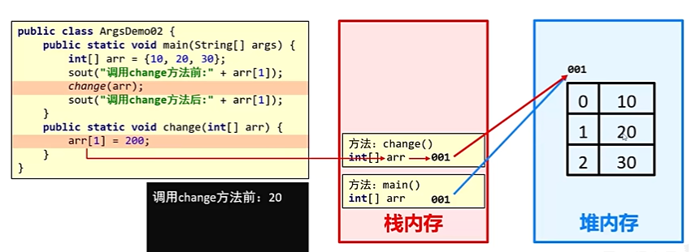
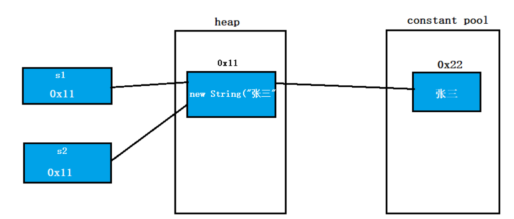
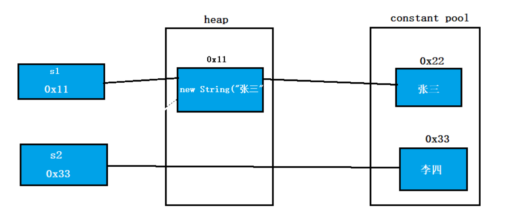
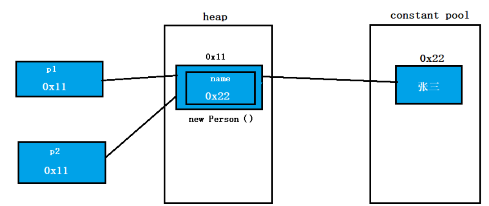
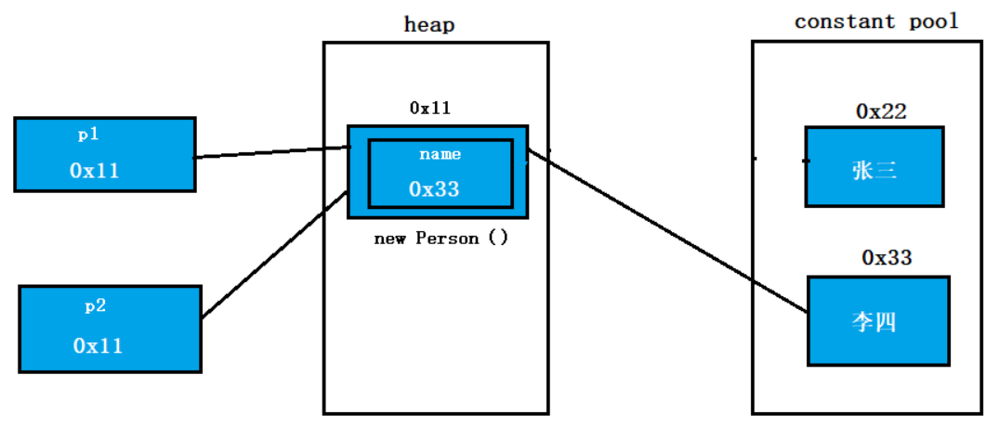

## 方法的定义

```java
修饰符 返回值类型 方法名(形参列表){
	// 方法体
}
```

## 修饰符

### 访问修饰符

**Java 中的访问修饰符**用于控制类、字段、方法和构造函数的访问权限。通过使用访问修饰符，可以实现封装，保护数据，并控制不同部分之间的访问范围。

#### public

定义：被`public`修饰的成员可以被外界访问

作用域：在一个Java源文件（.java文件）中只有一个类被声明为`public`，且这个源文件的文件名要与这个公共类的类名相同

`public`修饰类成员时可以在所有类中被访问

在继承中`public`修饰的所有成员都被继承

#### protect

定义：受保护的，受该类所在包保护，只能被同一个包内的类或者不同包的子类访问

作用域：被`protect`修饰的成员可以被同一个包内的所有类访问，同时也会被该类的所有子类继承

#### default

定义：只对同一个包中的类友好，只能被同一个包中的类访问

作用域：同一个包中的所有类可以访问，被`default`修饰的成员只能被同一个包中的子类继承

#### private

定义：私有的，只能被同一个类中的成员访问

作用域：同一个类

表格整理如下

| 修饰符    | 当前类 | 同一包内 | 子类（不同包） | 其他包 |
| --------- | ------ | -------- | -------------- | ------ |
| public    | 是     | 是       | 是             | 是     |
| protected | 是     | 是       | 是             | 否     |
| default   | 是     | 是       | 否             | 否     |
| private   | 是     | 否       | 否             | 否     |

### 静态修饰符

#### static

被`static`修饰的成员是静态方法，静态方法属于整个类，非静态方法属于单个对象

静态方法的生命周期与类一样长，随着类的消亡而消亡

非静态方法的生命周期与对象一样长，随着对象的消亡而消亡

静态方法和非静态方法的对比参考[补充资料](https://tyritic.github.io/p/java%E4%B8%AD%E9%9D%99%E6%80%81%E6%96%B9%E6%B3%95%E5%92%8C%E5%AE%9E%E4%BE%8B%E6%96%B9%E6%B3%95%E7%9A%84%E5%8C%BA%E5%88%AB/)

## 方法调用

- `main`方法作为程序入口先压入栈区
- 执行`main`方法中的代码，遇到方法后，将该方法压入栈区，执行完毕后出栈

## 方法重载

方法重载（Overloading） ：在同一个类中，允许有多个同名方法，只要它们的参数列表不同（**参数个数、类型或顺序**）。主要关注方法的签名变化，适用于在同一类中定义不同场景下的行为。

### 判定依据

- 方法在同一个类中，且具有相同的方法名
- 具有不同的形参列表（满足以下其中之一即可）
  - 形参个数不同
  - 形参类型不同
  - 形参顺序不同



方法重载与返回值无关

方法重载与方法重写的区别见[补充材料](https://tyritic.github.io/p/java%E4%B8%AD%E7%9A%84%E6%96%B9%E6%B3%95%E9%87%8D%E8%BD%BD%E5%92%8C%E6%96%B9%E6%B3%95%E9%87%8D%E5%86%99/)



## 方法的参数传递

在 Java 中，**参数传递只有按值传递，不论是基本类型还是引用类型。**

### 方法传递基本数据类型

具体类型见[往期博客](https://tyritic.github.io/p/java%E7%9A%84%E5%AD%97%E9%9D%A2%E9%87%8F%E5%92%8C%E5%9F%BA%E6%9C%AC%E6%95%B0%E6%8D%AE%E7%B1%BB%E5%9E%8B/)

#### 基本数据类型的特点

基本数据类型在栈空间中存储的是真实的数据字面值，在堆区中不开辟空间

#### 具体表现

方法中对参数的改变不会影响原始变量的值

#### 示例代码

```java
public static void main(String [] args)
{
    int nums=100;
    change(nums); //change(100)
    System.out.println(nums); //nums=100;
}
public static void change(int nums)
{
    nums=110;
}
```

#### 内存解释

每个方法压入栈区中，都会有独立的栈空间，在该方法的栈空间中传入的实际上是参数值的副本（参数的字面值）来对形参进行初始化，在这个栈区中形参值发生了改变。方法执行完成后出栈，原来栈区中的变量不受影响

### 方法传递引用数据类型

除基本数据类型以外的所有数据类型包括数组，字符串，类都是引用数据类型

#### 特点

引用数据类型在栈空间中存储的是其地址值，在堆区中开辟空间，真实的数据保存在堆区中

#### 具体表现

方法中对参数的改变会影响原始变量的值

#### 示例代码

```java
public static void main(String [] args)
{
    int[] nums={0,1,2};
    change(nums); //change(nums)
    System.out.println(nums); //nums={0,3,2};
}
public static void change(int[] nums)
{
    nums[1]=3;
}
```

#### 内存解释

每个方法压入栈区中，都会有独立的栈空间，在该方法的栈空间中传入的实际上是参数值的副本（参数的地址值）对形参进行初始化。

在这个栈区中形参和原始变量指向同一块内存区域，对形参的修改会通过引用影响原始变量。

方法执行完成后出栈，原来栈区中的变量指向的内存区域已经受到影响



### 总结

- 方法参数传递的本质是值传递（引用数据类型被视为地址值）
- 函数调用时在函数作用域创建栈区空间，再使用实参对形参进行初始化（形参作为实参的副本）
  - 基本数据类型：形参改变不影响实参，形参在方法结束后弹出栈区
  - 引用数据类型：形参是地址值，形参地址值的改变不影响实参地址值，此时形参和实参指向同一个地址

### 特殊的例子String类

#### 具体表现

作为一个单独的数据类型，传递效果与传递基本数据类型相同

作为对象的成员，传递效果与传递引用数据类型相同

#### 特点

- `String`对象一旦创建就不可更改（`String`是不可变类）
- `String`类的所有方法都不会改变`String`的内容

#### 示例代码（作为单独的数据类型）

```java
public static void main(String[] args) {
        String s1=new String("张三");
        change(s1);
        System.out.println(s1); // s1="张三"
    }
public static void change(String s2){
        s2="李四";
    }
```

#### 解析过程

**方法调用前**



- 首先 `String s=new String("张三")`，在堆中开辟内存放对象，变量`s1`在栈中，存放的是堆的地址
- 将地址`0x11`传入`change`方法复制一份用于初始化`s2`，此时`s2`放的是地址`0x11`

**方法调用时**

- `s2="李四"`；通过=赋值是直接先去常量池寻找是否存在与“李四”相同的值，有的话直接将其地址返回。否则创建一个值，再返回其地址。这里改变的是`s2`在栈区

**方法调用后**



`s1`和`s2`最终存储的地址不同

#### 示例代码（作为类的成员变量）

```java
public class Person {
    String name;
    public Person(String name){
        this.name=name;
    }
}
 
public static void main(String[] args) {
        Person p1 = new Person("张三");
        change(p1);
        System.out.println(p1.name); // 李四
}
public static void change(Person p2){
        p2.name="李四";
}
```

#### 解析过程

**方法调用前**



- 首先 `Person s=new Person("张三")`，在堆中开辟内存放对象，变量`p1`在栈中，存放的是堆的地址
- 将地址`0x11`复制一份给`s2`用于初始化，此时`s2`放的是地址`0x11`

**方法调用时**

- `p2.name="李四"`；要知道通过=赋值是直接先去常量池寻找是否存在与“李四”相同的值，有的话直接将其地址返回。否则创建一个值，再返回其地址。与上一问题不同的是，这里我们改变的是`name`，而`name`在堆中，所以常量池中地址是复制给了`name`

**方法调用后**

`p1.name`和`p2.name`最终存储的地址相同
