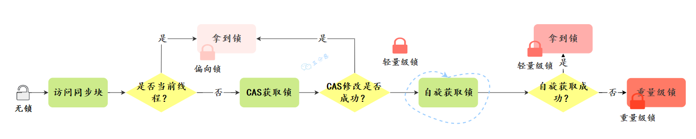
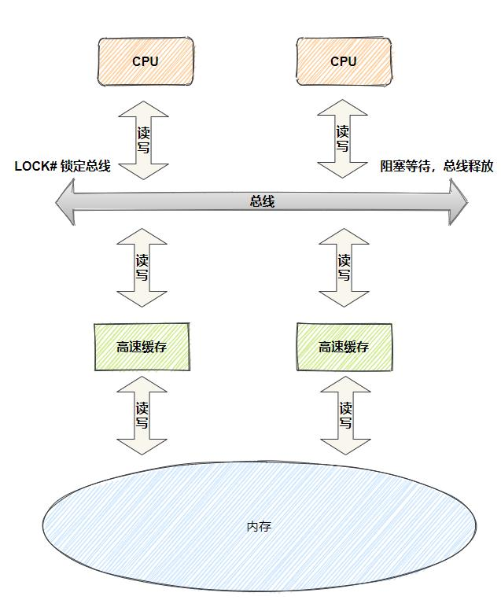

## 线程同步问题

线程同步是指在多线程环境下，为了避免多个线程对共享资源进行同时访问，从而引发数据不一致或其他问题的一种机制。它通过对关键代码段加锁，使得同一时刻只有一个线程能够访问共享资源。

当多个线程共享同一资源（如变量、对象或文件）时，若没有同步机制，可能会导致**竞态条件**，即线程对共享资源的操作是非原子性的，多个线程之间可能会同时修改数据，导致结果不符合预期。

## 死锁问题

线程死锁的定义：多个线程同时被阻塞，它们中的一个或者全部都在等待某个资源被释放。由于线程被无限期地阻塞，因此程序不可能正常终止。（ **死锁不是锁** ）


示例代码

```java
class A {
    synchronized void method1(B b) {
        System.out.println("Thread 1: Holding lock 1...");
        try { Thread.sleep(1000); } catch (InterruptedException e) {}
        System.out.println("Thread 1: Waiting for lock 2...");
        b.last();
    }
    
    synchronized void last() {
        System.out.println("Thread 1: Inside method last");
    }
}

class B {
    synchronized void method2(A a) {
        System.out.println("Thread 2: Holding lock 2...");
        try { Thread.sleep(1000); } catch (InterruptedException e) {}
        System.out.println("Thread 2: Waiting for lock 1...");
        a.last();
    }
    
    synchronized void last() {
        System.out.println("Thread 2: Inside method last");
    }
}

public class DeadlockExample {
    public static void main(String[] args) {
        final A a = new A();
        final B b = new B();
        
        // Thread 1
        new Thread() {
            public void run() { a.method1(b); }
        }.start();
        
        // Thread 2
        new Thread() {
            public void run() { b.method2(a); }
        }.start();
    }
}
```


### 死锁的必要条件

- 互斥条件：该资源任意一个时刻只由一个线程占用。
- 请求与保持条件：一个线程因请求资源而阻塞时，对已获得的资源保持不放。
- 不剥夺条件：线程已获得的资源在未使用完之前不能被其他线程强行剥夺，只有自己使用完毕后才释放资源。
- 循环等待条件：若干线程之间形成一种头尾相接的循环等待资源关系。

### 预防和防止死锁的方法

预防死锁的方法

- **破坏请求与保持条件**：一次性申请所有的资源。
- **破坏不剥夺条件**：占用部分资源的线程进一步申请其他资源时，如果申请不到，可以主动释放它占有的资源。
- **破坏循环等待条件**
  - **靠按序申请资源来预防** ：按某一顺序申请资源，释放资源则反序释放。破坏循环等待条件。
  - **设置超时等待时间**：为锁操作设置超时，防止线程无限期地等待锁。


## 锁机制的定义

**锁**（Lock）是一种用于控制对共享资源的访问的机制，确保多个线程在并发执行时，能够安全地访问资源，防止数据冲突和不一致的情况。锁通常用于实现线程同步，确保同一时刻只有一个线程可以访问临界区（critical section）中的共享资源。

**Java 多线程的锁都是基于对象的**，Java 中的每一个对象都可以作为一个锁。

## 锁存放的位置

### 对象头

每个 Java 对象都有一个对象头。如果是非数组类型，则用 2 个字宽来存储对象头，如果是数组，则会用 3 个字宽来存储对象头。

对象头的内容

| 长度     | 内容                   | 说明                           |
| -------- | ---------------------- | ------------------------------ |
| 32/64bit | Mark Word              | 存储对象的 hashCode 或锁信息等 |
| 32/64bit | Class Metadata Address | 存储到对象类型数据的指针       |
| 32/64bit | Array length           | 数组的长度（如果是数组）       |

### **`Mark Word`**

| 锁状态   | 29 bit 或 61 bit             | 1 bit 是否是偏向锁？       | 2 bit 锁标志位 |
| -------- | ---------------------------- | -------------------------- | -------------- |
| 无锁     |                              | 0                          | 01             |
| 偏向锁   | 线程 ID                      | 1                          | 01             |
| 轻量级锁 | 指向栈中锁记录的指针         | 此时这一位不用于标识偏向锁 | 00             |
| 重量级锁 | 指向互斥量（重量级锁）的指针 | 此时这一位不用于标识偏向锁 | 10             |
| GC 标记  |                              | 此时这一位不用于标识偏向锁 | 11             |

## 锁的级别

在 JDK 1.6 以前，所有的锁都是”重量级“锁，因为使用的是操作系统的互斥锁，当一个线程持有锁时，其他试图进入  **`synchronized`** 块的线程将被阻塞，直到锁被释放。涉及到了线程上下文切换和用户态与内核态的切换，因此效率较低。

那为了减少获得锁和释放锁带来的性能消耗，JDK 1.6 引入了 “ **偏向锁** ”和“ **轻量级锁** ” 的概念

一个对象其实有四种锁级别，它们级别由低到高依次是

- 无锁状态
- 偏向锁状态
- 轻量级锁状态
- 重量级锁状态

### 无锁状态

在这个状态下，没有线程试图获取锁。没有对资源进行锁定，任何线程都可以尝试去修改它

### 偏向锁

出现原因：**大多数情况下，锁不仅不存在多线程竞争，而且总是由同一线程多次获得，因此可以消除同一线程的后续锁获取和释放的开销。如果同一线程再次请求锁，就无需再次同步。**

偏向锁会偏向于第一个访问锁的线程，如果在接下来的运行过程中，该锁没有被其他的线程访问，则持有偏向锁的线程将永远不需要触发同步。也就是说，**偏向锁在资源无竞争情况下消除了同步语句**。

#### 工作原理

- 一个线程在第一次进入同步块时，会在对象头和栈帧中的锁记录里存储锁偏向的线程 ID。
- 当下次该线程进入这个同步块时，会去检查锁的 **`Mark Word`** 里面是不是放的自己的线程 ID。
  - 如果是，表明该线程已经获得了锁，以后该线程在进入和退出同步块时不需要花费 **`CAS`** 操作来加锁和解锁
  - 如果不是，就代表有另一个新线程来竞争这个偏向锁。这个时候新线程会尝试使用 **`CAS`** 来替换 **`Mark Word`** 里面的线程 ID 为新线程的 ID
    - 成功，表示之前的线程不存在了， **`Mark Word`** 里面的线程 ID 为新线程的 ID，锁不会升级，仍然为偏向锁；
    - 失败，表示之前的线程仍然存在，那么暂停之前的线程，升级为轻量级锁，会按照轻量级锁的方式进行竞争锁。

### 轻量级锁

**多个线程在不同时段获取同一把锁** ，即不存在锁竞争的情况，也就没有线程阻塞。针对这种情况，JVM 采用轻量级锁来避免线程的阻塞与唤醒。

当一个线程尝试获取轻量级锁时，它会在自己的栈帧中创建一个锁记录（Lock Record），然后尝试使用  **`CAS`** 操作将对象头的 Mark Word 替换为指向锁记录的指针。

#### 工作原理

- 当线程想要获取一个轻量级锁时，它会在自己的栈帧中创建一个锁记录（Lock Record）然后尝试用 **`CAS`** 将锁的 **`Mark Word`** 替换为指向锁记录的指针
  - 如果 **`CAS`** 操作成功，即锁当前没有被任何线程持有。JVM会将锁的标志位设置为“轻量级锁”状态，并将当前线程的ID保存在对象头中。该线程会继续执行它的代码，并且无需阻塞。
  - 如果 **`CAS`** 操作失败，即另一个线程试图获取锁。当前线程会进入**自旋** 状态（它会在短时间内不断地尝试访问锁的对象，而不立即挂起自己）自旋的过程会消耗一些CPU资源，但如果锁竞争不激烈，线程很可能在自旋过程中成功获取锁，而不会造成线程的阻塞。
- 如果自旋到一定程度（和 JVM、操作系统相关），依然没有获取到锁，那么这个线程会阻塞。同时这个锁就会**升级成重量级锁**。

### 重量级锁

重量级锁依赖于操作系统的互斥锁（mutex，用于保证任何给定时间内，只有一个线程可以执行某一段特定的代码段） 实现，而操作系统中线程间状态的转换需要相对较长的时间，所以重量级锁效率很低，但被阻塞的线程不会消耗 CPU。

### 锁的升级过程

无锁-->偏向锁---> 轻量级锁---->重量级锁。



- 当线程A首次访问同步块时，如果此对象无锁状态且偏向锁未被禁用，JVM 会将该对象头的锁标记改为偏向锁状态，并记录下线程A的 ID。此时，对象头中的 **`Mark Word`** 中存储了持有偏向锁的线程 ID。

- 当线程A再次进入这个同步块时，会去检查锁的 **`Mark Word`** 里面是不是放的自己的线程 ID。

  - 如果是，表明线程A已经获得了锁，以后该线程在进入和退出同步块时不需要花费 **`CAS`** 操作来加锁和解锁
  - 如果不是，就代表有另一个线程B来竞争这个偏向锁，这个时候线程B会尝试使用 **`CAS`** 来替换 **`Mark Word`** 里面的线程 ID 为自己的 ID
    - 成功，表示线程A已经退出同步块了， **`Mark Word`** 里面的线程 ID 为线程B的 ID，锁不会升级，仍然为偏向锁；
    - 失败，表示线程A仍然持有偏向锁，那么JVM会
      - 暂停线程A
      - 撤销偏向锁
      - 升级为轻量级锁，
      - 线程A和线程B按照轻量级锁的方式进行竞争锁。

- 当线程B想要获取一个轻量级锁时，它会在自己的栈帧中创建一个锁记录（Lock Record）然后尝试用 **`CAS`** 将锁的 **`Mark Word`** 替换为指向锁记录的指针

  - 如果 **`CAS`** 操作成功，即锁当前没有被任何线程持有。JVM会将锁的标志位设置为“轻量级锁”状态，并将线程B的ID保存在对象头中。该线程会继续执行它的代码，并且无需阻塞。
  - 如果 **`CAS`** 操作失败，即另一个线程（线程A）试图获取锁。线程B会进入**自旋** 状态（它会在短时间内不断地尝试访问锁的对象，而不立即挂起自己）自旋的过程会消耗一些CPU资源，但如果锁竞争不激烈，线程B很可能在自旋过程中成功获取锁，而不会造成线程的阻塞。

- 如果线程B自旋到一定程度（和 JVM、操作系统相关），依然没有获取到锁，那么这个线程会阻塞。同时这个锁就会**升级成重量级锁**。

  

### **`synchronized`** 的优化

- **偏向锁**：当一个线程首次获得锁时，JVM 会将锁标记为偏向这个线程，将锁的标志位设置为偏向模式，并且在对象头中记录下该线程的 ID。之后，当相同的线程再次请求这个锁时，就无需进行额外的同步。如果另一个线程尝试获取这个锁，偏向模式会被撤销，并且锁会升级为轻量级锁。
- **轻量级锁**：多个线程在不同时段获取同一把锁，即不存在锁竞争的情况，也就没有线程阻塞。针对这种情况，JVM 采用轻量级锁来避免线程的阻塞与唤醒。当一个线程尝试获取轻量级锁时，它会在自己的栈帧中创建一个锁记录（Lock Record），然后尝试使用 CAS 操作将对象头的 Mark Word 替换为指向锁记录的指针。如果成功，该线程持有锁；如果失败，表示有其他线程竞争，锁会升级为重量级锁。
- **自旋锁**：当线程尝试获取轻量级锁失败时，它会进行自旋，即循环检查锁是否可用，以避免立即进入阻塞状态。自旋的次数不是固定的，而是根据之前在同一个锁上的自旋时间和锁的状态动态调整的。
- **锁粗化**：如果 JVM 检测到一系列连续的锁操作实际上是在单一线程中完成的，则会将多个锁操作合并为一个更大范围的锁操作，这可以减少锁请求的次数。锁粗化主要针对循环内连续加锁解锁的情况进行优化。



**自旋** 和 **锁自适应自旋**

- **自旋** ：在多线程环境下，当一个线程尝试获取锁时，如果锁已经被其他线程持有，线程并不会立即被阻塞，而是不断地访问锁对象。检查锁是否已经释放，线程在自旋过程中不会被挂起，也不会进行上下文切换，而是占用CPU继续执行循环检查。
- **锁自适应自旋** ：自适应自旋锁通过动态调整自旋的次数来提高性能。自适应的策略基于之前的自旋结果，假如上一次自旋很快获得了锁，下次可能会增加自旋次数；如果自旋失败，则减少自旋时间甚至直接放弃自旋。



## 乐观锁和悲观锁

**乐观锁（Optimistic Lock）** 和 **悲观锁（Pessimistic Lock）** 是两种不同的并发控制策略，常用于处理多线程环境下对共享资源的访问冲突。它们的核心区别在于对数据冲突的预判和处理方式不同。

## 悲观锁

### 定义

悲观锁是一种假设会发生冲突的策略，认为在并发环境下线程之间会发生数据竞争，因此采用锁机制来确保线程之间的互斥执行，避免数据冲突。悲观锁会在操作数据之前加锁，保证同一时刻只有一个线程可以访问共享资源。也就是说，**共享资源每次只给一个线程使用，其它线程阻塞，用完后再把资源转让给其它线程**。

### 特点

- 假设线程之间会有冲突，因此总是会对共享资源加锁。
- 锁的粒度较大，通常在整个操作过程中都持有锁。
- 当一个线程持有锁时，其他线程必须等待该锁释放才能继续执行。

### 缺点

- **性能开销大** ：高并发的场景下，激烈的锁竞争会造成线程阻塞，大量阻塞线程会导致系统的上下文切换，增加系统的性能开销。
- **线程阻塞** ：悲观锁还可能会存在死锁问题（线程获得锁的顺序不当时），影响代码的正常运行。

### 使用场景

- 悲观锁通常多用于写比较多的情况（读少写多场景，竞争激烈），这样可以避免频繁失败和重试影响性能。
- 需要严格保证数据一致性和完整性的场合
  - 数据库中的行级锁防止多个事务同时修改同一行数据。
  - 在电商平台等支付系统中，多个用户可能会同时购买同一商品，或者多个支付请求同时处理。使用悲观锁可以确保同一时间只有一个线程能够处理某个商品的支付请求，从而避免出现库存不足或重复支付的情况。

### 具体实现

- **`synchronized`** 是最常见的悲观锁实现方式，会在方法或代码块上加锁，确保同一时刻只有一个线程能够执行该代码块或方法。
- **`ReentrantLock`** 是 Java 提供的一种显式锁，比 **`synchronized`** 提供了更多的控制功能，例如尝试获取锁、定时获取锁等。

## 乐观锁

### 定义

乐观锁则是一种假设不会发生冲突的策略，认为在并发环境下线程之间发生冲突的概率较低，因此不通过加锁来进行数据保护，而是通过其他手段，如版本号、时间戳等，来验证数据在提交时是否发生变化。如果数据发生了变化，乐观锁会进行重试或者抛出异常。

### 特点

- 假设冲突发生的概率较低，因此不会加锁。
- 在操作数据时，乐观锁会先执行任务并在提交时检查数据是否已经发生变化。
- 如果数据没有变化，则提交成功；如果数据发生了变化，则需要重新尝试或处理冲突。

### 缺点

- 实现复杂度较高，尤其是在多表或复杂事务的场景下。
- 冲突频繁时性能下降。

### 使用场景

- “读多写少“的环境，避免频繁加锁影响性能
- 在数据库系统中，乐观锁用于保证数据在并发环境下的正确性。典型的做法是给每行数据加上一个 `version` 字段（或 `timestamp`）。在更新数据时，首先读取该行数据的版本号，然后在提交时比较版本号，如果版本号没有变化，则表示没有其他事务修改过该数据，可以进行更新；如果版本号发生变化，则回滚操作。

### 具体实现

#### 版本号机制

在版本号机制中，每个数据对象（或数据库表中的记录）都会有一个与之关联的版本号或时间戳。每次读取数据时，都会获取当前的版本号。在数据修改时，首先检查版本号是否和读时一致。如果版本号没有变化，则说明在读取和写入期间没有其他事务对该数据进行修改，操作可以继续进行；否则，如果版本号发生了变化，表示数据在此期间已被其他事务修改，当前事务需要回滚或者重试。

- **初始化版本号**：每个数据项或记录初始化时会有一个版本号 **`version`**
- **读取数据时**：每次读取数据时，除了获取数据内容外，还会获取该数据的版本号 **`version`**。
- **修改数据时**：
- - 在修改数据前，程序会检查当前数据的版本号 **`version`**。
  - 提交更新时，检查该数据在操作期间是否有其他事务修改过。如果版本号 **`version`** 没有变化，说明没有发生冲突，可以提交更新；如果版本号 **`version`** 已发生变化，说明数据已被其他事务修改，此时需要回滚或重试。
- **提交操作时**：如果数据没有被其他事务修改（即版本号 **`version`** 一致），则可以成功提交更新，并将版本号 **`version`** 自增。
- **冲突处理**：如果在提交时发现版本号 **`version`** 不一致，说明发生了冲突，当前操作需要处理冲突（比如重试、提示用户、选择保留某个版本等）。

#### CAS算法

**`CAS(Compare And Swap)`** 是一种**硬件级别的原子操作**，它比较内存中的某个值是否为预期值，如果是，则更新为新值，否则不做修改。

**算法原理**

涉及的变量如下

- **`V`**：要更新的变量(var)
- **`E`**：预期值(expected)
- **`N`**：新值(new)

算法步骤如下

- **比较（Compare）** ：**`CAS`** 会检查内存中的某个值 **`V`** 是否与预期值 **`E`** 相等。
- **交换（Swap）** ：如果相等，则 **`CAS`** 通过 **原子** 方式用新值 **`N`** 来更新 **`V`** 的值
- **失败重试** ：如果不相等，说明有其他线程已经修改了该值，**`CAS`** 操作失败。当多个线程同时使用 **`CAS`** 操作一个变量时，只有一个会胜出，并成功更新，其余均会失败，但失败的线程并不会被挂起，仅是被告知失败，并且允许再次尝试，当然也允许失败的线程放弃操作。


**Java中的实现和应用**

在 Java 中，实现 **`CAS`** 操作的一个关键类是 **`Unsafe`** 。**`Unsafe`** 类中的 CAS 方法是 **`native`**方法。**`native`** 关键字表明这些方法是用本地代码（通常是 C 或 C++）实现的，而不是用 Java 实现的。这些方法直接调用底层的硬件指令来实现原子操作。也就是说，Java 语言并没有直接用 Java 实现 **`CAS`** 。

Java中的原子类都是基于 **`CAS`** 操作实现原子操作的


**原子性的保证机制**

CPU层面采取以下策略

- **总线锁定**：通过锁定 CPU 的总线，禁止其他 CPU 或设备访问内存。在进行操作时，CPU 发出一个 LOCK 信号，这会阻止其他处理器对内存地址进行操作，直到当前指令执行完成。
- **缓存锁定**：当多个 CPU 操作同一块内存地址时，如果该内存地址已经被缓存到某个 CPU 的缓存中，缓存锁定机制会锁定该缓存行，防止其他 CPU 对这块内存进行修改。


**存在的问题**

- **`ABA`** 问题：在多线程环境下，某个变量的值在一段时间内经历了从 A 到 B 再到 A 的变化，这种变化可能被线程误认为值没有变化，从而导致错误的判断和操作。
  - 解决思路
    - **版本号/时间戳**：在每次更新一个变量时，不仅更新变量的值，还更新一个版本号。**`CAS`** 操作在比较时，除了比较值是否一致，还比较版本号是否匹配。这样，即使值回到了初始值，版本号的变化也能检测到修改。
    - **引用标记** ：另一种类似的机制，通过在引用上标记一个布尔值，帮助区分是否发生了特定变化。
- **长时间自旋的CPU消耗** ：CAS 经常会用到自旋操作来进行重试，也就是不成功就一直循环执行直到成功。如果长时间不成功，会给 CPU 带来非常大的执行开销。
  - 解决方案：让 JVM 支持处理器提供的**pause 指令**。
- **只能对单个变量执行操作的原子性** ：如果对多个变量操作时，CAS 目前无法直接保证操作的原子性的。
  - 解决方案
    - 可以考虑改用锁来保证操作的原子性
    - 可以考虑合并多个变量，将多个变量封装成一个对象，通过 **`AtomicReference`** 来保证原子性。

## 可重入锁

### 定义

**可重入锁** 是指同一个线程在获取了锁之后，可以再次重复获取该锁而不会造成死锁或其他问题。当一个线程持有锁时，如果再次尝试获取该锁，就会成功获取而不会被阻塞。

### 具体实现

- **`synchronized`** 关键字
- **`ReentrantLock`** 类

### 示例

同一个线程在外层方法获取锁的时候，再进入该线程的内层方法会自动获取锁（前提：锁的是同一个对象或者 class），不会因为之前已经获取过还没释放而阻塞

```java
public class Widget {
    public synchronized void doSomething() {
        System.out.println("方法1执行...");
        doOthers();
    }

    public synchronized void doOthers() {
        System.out.println("方法2执行...");
    }
}
```

**`doSomething()`** 方法中调用了 **`doOthers()`** 方法。因为内置锁是可重入的，所以同一个线程在调用 **`doOthers()`** 时可以直接获得当前对象的锁，进入 **`doOthers()`** 进行操作。

如果是一个不可重入锁，那么当前线程在调用`doOthers()`之前，需要将执行 **`doSomething()`** 时获取当前对象的锁释放掉，实际上该对象锁已经被当前线程所持有，且无法释放。所以此时会出现死锁。

## 公平锁和非公平锁

**公平锁** : 锁被释放之后，先申请的线程先得到锁。性能较差一些，因为公平锁为了保证时间上的绝对顺序，上下文切换更频繁。

**非公平锁**：锁被释放之后，后申请的线程可能会先获取到锁，是随机或者按照其他优先级排序的。性能更好，但可能会导致某些线程永远无法获取到锁。

一般情况下，**非公平锁能提升一定的效率。但是非公平锁可能会发生线程饥饿（有一些线程长时间得不到锁）的情况**。

## 读写锁和排他锁

### **排他锁** 

**定义** ：在同一时刻**只能有一个线程**获取该锁，其他线程必须等待锁释放后才能继续执行。

如果线程 T 对数据 A 加上排它锁后，则其他线程不能再对 A 加任何类型的锁。获得排它锁的线程既能读数据又能修改数据。

**特点** ：

- **写操作必须独占锁**，防止数据竞争。
- **多个线程不能同时持有排它锁**，即便是**读操作**也会被阻塞。

**具体实现**

- **`synchronized`** 关键字
- **`ReentrantLock`** 类

### 读写锁

**定义** ：允许多个线程同时读取共享资源，而在写操作时确保只有一个线程能够进行写操作（读读操作不互斥，读写互斥、写写互斥）。

提供两种模式

- **读锁（共享锁）**：允许多个线程同时获取读锁，只要没有任何线程持有写锁。适合读操作频繁而写操作较少的场景。
- **写锁（独占锁）**：写锁是独占的，当有线程持有写锁时，其他线程既不能获取写锁，也不能获取读锁。写锁用于保证写操作的独占性，防止数据不一致。
